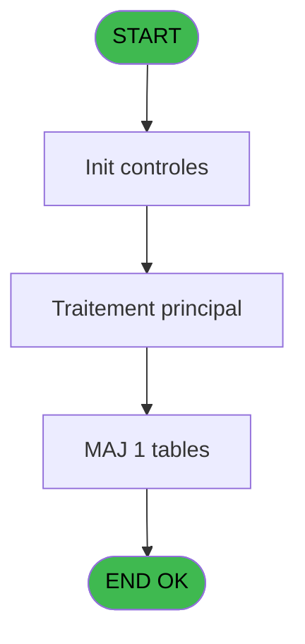

# REF IDE 891 - effectifs repas ***  au 24/04

> **Analyse**: Phases 1-4 2026-02-03 14:57 -> 14:57 (13s) | Assemblage 14:57
> **Pipeline**: V7.2 Enrichi
> **Structure**: 4 onglets (Resume | Ecrans | Donnees | Connexions)

<!-- TAB:Resume -->

## 1. FICHE D'IDENTITE

| Attribut | Valeur |
|----------|--------|
| Projet | REF |
| IDE Position | 891 |
| Nom Programme | effectifs repas ***  au 24/04 |
| Fichier source | `Prg_891.xml` |
| Dossier IDE | General |
| Taches | 3 (0 ecrans visibles) |
| Tables modifiees | 1 |
| Programmes appeles | 0 |
| :warning: Statut | **ORPHELIN_POTENTIEL** |

## 2. DESCRIPTION FONCTIONNELLE

**effectifs repas ***  au 24/04** assure la gestion complete de ce processus.

Le flux de traitement s'organise en **1 blocs fonctionnels** :

- **Traitement** (3 taches) : traitements metier divers

**Donnees modifiees** : 1 tables en ecriture (effectif_Q_new).

## 3. BLOCS FONCTIONNELS

### 3.1 Traitement (3 taches)

Traitements internes.

---

#### 891 - effectifs repas ***  au 24/04 [[ECRAN]](#ecran-t1)

**Role** : Traitement : effectifs repas ***  au 24/04.
**Ecran** : 538 x 460 DLU | [Voir mockup](#ecran-t1)
**Variables liees** : G (P.code_repas_nenc_vil), R (P.repas)

---

#### 891.1 - Création/ modification, [[ECRAN]](#ecran-t2)

**Role** : Traitement : Création/ modification,.
**Ecran** : 700 x 498 DLU | [Voir mockup](#ecran-t2)

---

#### 891.2 - Création enregs

**Role** : Traitement : Création enregs.

## 5. REGLES METIER

*(Aucune regle metier identifiee)*

## 6. CONTEXTE

- **Appele par**: (aucun)
- **Appelle**: 0 programmes | **Tables**: 1 (W:1 R:0 L:0) | **Taches**: 3 | **Expressions**: 15

<!-- TAB:Ecrans -->

## 8. ECRANS

*(Programme sans ecran visible)*

## 9. NAVIGATION

### 9.3 Structure hierarchique (3 taches)

| Position | Tache | Type | Dimensions | Bloc |
|----------|-------|------|------------|------|
| **891.1** | [**effectifs repas ***  au 24/04** (891)](#t1) [mockup](#ecran-t1) | - | 538x460 | Traitement |
| 891.1.1 | [Création/ modification, (891.1)](#t2) [mockup](#ecran-t2) | - | 700x498 | |
| 891.1.2 | [Création enregs (891.2)](#t3) | - | - | |

### 9.4 Algorigramme

> **Legende**: Vert = START/END OK | Rouge = END KO | Bleu = Decisions
> *Algorigramme auto-genere. Utiliser `/algorigramme` pour une synthese metier detaillee.*

<!-- TAB:Donnees -->

## 10. TABLES

### Tables utilisees (1)

| ID | Nom | Description | Type | R | W | L | Usages |
|----|-----|-------------|------|---|---|---|--------|
| 889 | effectif_Q_new |  | DB |   | **W** |   | 2 |

### Colonnes par table (1 / 1 tables avec colonnes identifiees)

Table 889 - effectif_Q_new (**W**) - 2 usages

| Lettre | Variable | Acces | Type |
|--------|----------|-------|------|
| A | P.modif/Annulation | W | Unicode |
| B | P.date de consommation M Saisie | W | Date |
| C | P.Code repas nenc Vil | W | Unicode |
| D | P.Quantité | W | Numeric |
| E | P.repas | W | Unicode |

## 11. VARIABLES

### 11.1 Parametres entrants (20)

Variables recues en parametre.

| Lettre | Nom | Type | Usage dans |
|--------|-----|------|-----------|
| A | P.Mode (Modif/Suppress/Annulat) | Unicode | - |
| B | P.Société | Unicode | - |
| C | P.compte | Numeric | - |
| D | P.Filiation | Numeric | - |
| E | P.Qualité | Unicode | - |
| F | P.Qualité_compl | Unicode | - |
| G | P.code_repas_nenc_vil | Unicode | - |
| H | P.date de consommation saisie | Date | - |
| I | P.date de fin | Date | 1x parametre entrant |
| J | P.heure de début | Time | - |
| K | P.Heure de fin | Time | - |
| L | P.Nouvelle date de debut | Date | - |
| M | P. Nouvelle date de fin | Date | - |
| N | P. Nouvelle heure de début | Time | - |
| O | P. Nouvelle Heure de fin | Time | - |
| P | P.Groupe | Unicode | - |
| Q | P. Quantité | Numeric | - |
| R | P.repas | Unicode | 2x parametre entrant |
| S | P.Lieu_séjour | Unicode | - |
| T | P.commentaire_annulation | Unicode | - |

### 11.2 Variables de session (1)

Variables persistantes pendant toute la session.

| Lettre | Nom | Type | Usage dans |
|--------|-----|------|-----------|
| V | v.Confirm annulation | Numeric | - |

### 11.3 Autres (1)

Variables diverses.

| Lettre | Nom | Type | Usage dans |
|--------|-----|------|-----------|
| U | v_comptage_enregistrement | Numeric | 3x refs |

Toutes les 22 variables (liste complete)

| Cat | Lettre | Nom Variable | Type |
|-----|--------|--------------|------|
| P0 | **A** | P.Mode (Modif/Suppress/Annulat) | Unicode |
| P0 | **B** | P.Société | Unicode |
| P0 | **C** | P.compte | Numeric |
| P0 | **D** | P.Filiation | Numeric |
| P0 | **E** | P.Qualité | Unicode |
| P0 | **F** | P.Qualité_compl | Unicode |
| P0 | **G** | P.code_repas_nenc_vil | Unicode |
| P0 | **H** | P.date de consommation saisie | Date |
| P0 | **I** | P.date de fin | Date |
| P0 | **J** | P.heure de début | Time |
| P0 | **K** | P.Heure de fin | Time |
| P0 | **L** | P.Nouvelle date de debut | Date |
| P0 | **M** | P. Nouvelle date de fin | Date |
| P0 | **N** | P. Nouvelle heure de début | Time |
| P0 | **O** | P. Nouvelle Heure de fin | Time |
| P0 | **P** | P.Groupe | Unicode |
| P0 | **Q** | P. Quantité | Numeric |
| P0 | **R** | P.repas | Unicode |
| P0 | **S** | P.Lieu_séjour | Unicode |
| P0 | **T** | P.commentaire_annulation | Unicode |
| V. | **V** | v.Confirm annulation | Numeric |
| Autre | **U** | v_comptage_enregistrement | Numeric |

## 12. EXPRESSIONS

**15 / 15 expressions decodees (100%)**

### 12.1 Repartition par type

| Type | Expressions | Regles |
|------|-------------|--------|
| CALCULATION | 1 | 0 |
| CONSTANTE | 6 | 0 |
| CONDITION | 7 | 0 |
| DATE | 1 | 0 |

### 12.2 Expressions cles par type

#### CALCULATION (1 expressions)

| Type | IDE | Expression | Regle |
|------|-----|------------|-------|
| CALCULATION | 9 | `v_comptage_enregistrement [U]+1` | - |

#### CONSTANTE (6 expressions)

| Type | IDE | Expression | Regle |
|------|-----|------------|-------|
| CONSTANTE | 10 | `'DEJ'` | - |
| CONSTANTE | 11 | `'DIN'` | - |
| CONSTANTE | 15 | `0` | - |
| CONSTANTE | 4 | `0` | - |
| CONSTANTE | 5 | `'M'` | - |
| ... | | *+1 autres* | |

#### CONDITION (7 expressions)

| Type | IDE | Expression | Regle |
|------|-----|------------|-------|
| CONDITION | 3 | `P.Mode (Modif/Suppress... [A]='A'` | - |
| CONDITION | 12 | `P.repas [R]='DEJ' OR P.repas [R]='DDE' OR P.repas [R]=''` | - |
| CONDITION | 13 | `P.repas [R]='DIN' OR P.repas [R]='DDE' OR P.repas [R]=''` | - |
| CONDITION | 2 | `P.Mode (Modif/Suppress... [A]='S'` | - |
| CONDITION | 7 | `P.date de consommation... [H]>=Date()+2` | - |
| ... | | *+2 autres* | |

#### DATE (1 expressions)

| Type | IDE | Expression | Regle |
|------|-----|------------|-------|
| DATE | 14 | `AddDate(P.date de consommation... [H],0,0,v_comptage_enregistrement [U])` | - |

<!-- TAB:Connexions -->

## 13. GRAPHE D'APPELS

### 13.1 Chaine depuis Main (Callers)

**Chemin**: (pas de callers directs)

### 13.2 Callers

| IDE | Nom Programme | Nb Appels |
|-----|---------------|-----------|
| - | (aucun) | - |

### 13.3 Callees (programmes appeles)

### 13.4 Detail Callees avec contexte

| IDE | Nom Programme | Appels | Contexte |
|-----|---------------|--------|----------|
| - | (aucun) | - | - |

## 14. RECOMMANDATIONS MIGRATION

### 14.1 Profil du programme

| Metrique | Valeur | Impact migration |
|----------|--------|-----------------|
| Lignes de logique | 146 | Programme compact |
| Expressions | 15 | Peu de logique |
| Tables WRITE | 1 | Impact faible |
| Sous-programmes | 0 | Peu de dependances |
| Ecrans visibles | 0 | Ecran unique ou traitement batch |
| Code desactive | 0% (0 / 146) | Code sain |
| Regles metier | 0 | Pas de regle identifiee |

### 14.2 Plan de migration par bloc

#### Traitement (3 taches: 2 ecrans, 1 traitement)

- **Strategie** : Orchestrateur avec 2 ecrans (Razor/React) et 1 traitements backend (services).
- Les ecrans deviennent des composants UI, les traitements invisibles deviennent des services injectables.
- Decomposer les taches en services unitaires testables.

### 14.3 Dependances critiques

| Dependance | Type | Appels | Impact |
|------------|------|--------|--------|
| effectif_Q_new | Table WRITE (Database) | 2x | Schema + repository |

---
*Spec DETAILED generee par Pipeline V7.2 - 2026-02-03 14:57*
