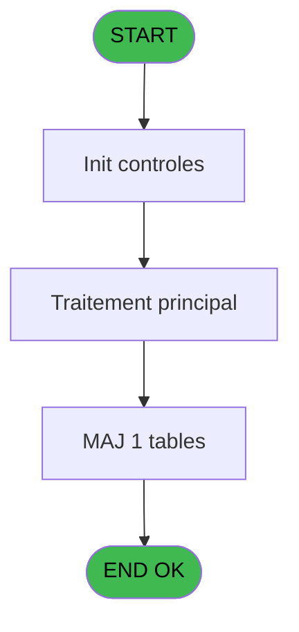
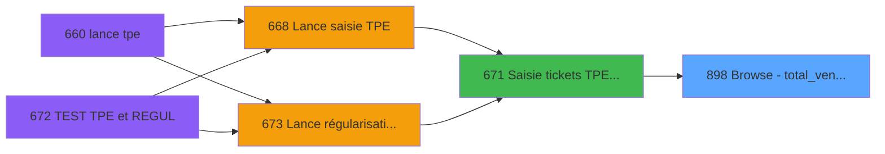

# REF IDE 898 - Browse - total_ventes_term_mop

> **Analyse**: Phases 1-4 2026-02-03 14:59 -> 14:59 (13s) | Assemblage 14:59
> **Pipeline**: V7.2 Enrichi
> **Structure**: 4 onglets (Resume | Ecrans | Donnees | Connexions)

<!-- TAB:Resume -->

## 1. FICHE D'IDENTITE

| Attribut | Valeur |
|----------|--------|
| Projet | REF |
| IDE Position | 898 |
| Nom Programme | Browse - total_ventes_term_mop |
| Fichier source | `Prg_898.xml` |
| Dossier IDE | Ventes |
| Taches | 1 (1 ecrans visibles) |
| Tables modifiees | 1 |
| Programmes appeles | 0 |

## 2. DESCRIPTION FONCTIONNELLE

**Browse - total_ventes_term_mop** assure la gestion complete de ce processus, accessible depuis [Saisie tickets TPE Interfacés (IDE 671)](REF-IDE-671.md).

Le flux de traitement s'organise en **1 blocs fonctionnels** :

- **Saisie** (1 tache) : ecrans de saisie utilisateur (formulaires, champs, donnees)

**Donnees modifiees** : 1 tables en ecriture (total_ventes_term_mop).

## 3. BLOCS FONCTIONNELS

### 3.1 Saisie (1 tache)

L'operateur saisit les donnees de la transaction via 1 ecran (Browse - total_ventes_term_mop).

---

#### 898 - Browse - total_ventes_term_mop [[ECRAN]](#ecran-t1)

**Role** : Saisie des donnees : Browse - total_ventes_term_mop.
**Ecran** : 905 x 195 DLU | [Voir mockup](#ecran-t1)

## 5. REGLES METIER

*(Aucune regle metier identifiee)*

## 6. CONTEXTE

- **Appele par**: [Saisie tickets TPE Interfacés (IDE 671)](REF-IDE-671.md)
- **Appelle**: 0 programmes | **Tables**: 1 (W:1 R:0 L:0) | **Taches**: 1 | **Expressions**: 0

<!-- TAB:Ecrans -->

## 8. ECRANS

### 8.1 Forms visibles (1 / 1)

| # | Position | Tache | Nom | Type | Largeur | Hauteur | Bloc |
|---|----------|-------|-----|------|---------|---------|------|
| 1 | 898 | 898 | Browse - total_ventes_term_mop | Type0 | 905 | 195 | Saisie |

### 8.2 Mockups Ecrans

---

#### 898 - Browse - total_ventes_term_mop
**Tache** : [898](#t1) | **Type** : Type0 | **Dimensions** : 905 x 195 DLU
**Bloc** : Saisie | **Titre IDE** : Browse - total_ventes_term_mop

<!-- FORM-DATA:
{
    "width":  905,
    "vFactor":  8,
    "type":  "Type0",
    "hFactor":  4,
    "controls":  [
                     {
                         "x":  8,
                         "type":  "table",
                         "var":  "",
                         "name":  "",
                         "titleH":  12,
                         "color":  "",
                         "w":  883,
                         "y":  8,
                         "fmt":  "",
                         "parent":  null,
                         "text":  "",
                         "rowH":  13,
                         "h":  182,
                         "cols":  [
                                      {
                                          "title":  "societe",
                                          "layer":  1,
                                          "w":  30
                                      },
                                      {
                                          "title":  "date_comptable",
                                          "layer":  2,
                                          "w":  68
                                      },
                                      {
                                          "title":  "service",
                                          "layer":  3,
                                          "w":  33
                                      },
                                      {
                                          "title":  "terminal",
                                          "layer":  4,
                                          "w":  32
                                      },
                                      {
                                          "title":  "mop",
                                          "layer":  5,
                                          "w":  33
                                      },
                                      {
                                          "title":  "montant_calcule",
                                          "layer":  6,
                                          "w":  101
                                      },
                                      {
                                          "title":  "tpe séquentiel",
                                          "layer":  7,
                                          "w":  56
                                      },
                                      {
                                          "title":  "num_remise",
                                          "layer":  8,
                                          "w":  122
                                      },
                                      {
                                          "title":  "montant_saisi",
                                          "layer":  9,
                                          "w":  101
                                      },
                                      {
                                          "title":  "ecart",
                                          "layer":  10,
                                          "w":  38
                                      },
                                      {
                                          "title":  "date_ope_TPE",
                                          "layer":  11,
                                          "w":  68
                                      },
                                      {
                                          "title":  "application",
                                          "layer":  12,
                                          "w":  44
                                      },
                                      {
                                          "title":  "vad",
                                          "layer":  13,
                                          "w":  18
                                      },
                                      {
                                          "title":  "TPE réel",
                                          "layer":  14,
                                          "w":  122
                                      }
                                  ],
                         "rows":  14
                     },
                     {
                         "x":  12,
                         "type":  "edit",
                         "var":  "",
                         "y":  23,
                         "w":  9,
                         "fmt":  "",
                         "name":  "societe",
                         "h":  10,
                         "color":  "",
                         "text":  "",
                         "parent":  1
                     },
                     {
                         "x":  42,
                         "type":  "edit",
                         "var":  "",
                         "y":  23,
                         "w":  61,
                         "fmt":  "",
                         "name":  "date_comptable",
                         "h":  10,
                         "color":  "",
                         "text":  "",
                         "parent":  1
                     },
                     {
                         "x":  110,
                         "type":  "edit",
                         "var":  "",
                         "y":  23,
                         "w":  26,
                         "fmt":  "",
                         "name":  "service",
                         "h":  10,
                         "color":  "",
                         "text":  "",
                         "parent":  1
                     },
                     {
                         "x":  143,
                         "type":  "edit",
                         "var":  "",
                         "y":  23,
                         "w":  18,
                         "fmt":  "",
                         "name":  "terminal",
                         "h":  10,
                         "color":  "",
                         "text":  "",
                         "parent":  1
                     },
                     {
                         "x":  175,
                         "type":  "edit",
                         "var":  "",
                         "y":  23,
                         "w":  26,
                         "fmt":  "",
                         "name":  "mop",
                         "h":  10,
                         "color":  "",
                         "text":  "",
                         "parent":  1
                     },
                     {
                         "x":  208,
                         "type":  "edit",
                         "var":  "",
                         "y":  23,
                         "w":  94,
                         "fmt":  "",
                         "name":  "montant_calcule",
                         "h":  10,
                         "color":  "",
                         "text":  "",
                         "parent":  1
                     },
                     {
                         "x":  309,
                         "type":  "edit",
                         "var":  "",
                         "y":  23,
                         "w":  18,
                         "fmt":  "",
                         "name":  "tpe séquentiel",
                         "h":  10,
                         "color":  "",
                         "text":  "",
                         "parent":  1
                     },
                     {
                         "x":  365,
                         "type":  "edit",
                         "var":  "",
                         "y":  23,
                         "w":  115,
                         "fmt":  "",
                         "name":  "num_remise",
                         "h":  10,
                         "color":  "",
                         "text":  "",
                         "parent":  1
                     },
                     {
                         "x":  487,
                         "type":  "edit",
                         "var":  "",
                         "y":  23,
                         "w":  94,
                         "fmt":  "",
                         "name":  "montant_saisi",
                         "h":  10,
                         "color":  "",
                         "text":  "",
                         "parent":  1
                     },
                     {
                         "x":  588,
                         "type":  "edit",
                         "var":  "",
                         "y":  23,
                         "w":  31,
                         "fmt":  "",
                         "name":  "ecart",
                         "h":  10,
                         "color":  "",
                         "text":  "",
                         "parent":  1
                     },
                     {
                         "x":  626,
                         "type":  "edit",
                         "var":  "",
                         "y":  23,
                         "w":  61,
                         "fmt":  "",
                         "name":  "date_ope_TPE",
                         "h":  10,
                         "color":  "",
                         "text":  "",
                         "parent":  1
                     },
                     {
                         "x":  694,
                         "type":  "edit",
                         "var":  "",
                         "y":  23,
                         "w":  9,
                         "fmt":  "",
                         "name":  "application",
                         "h":  10,
                         "color":  "",
                         "text":  "",
                         "parent":  1
                     },
                     {
                         "x":  738,
                         "type":  "edit",
                         "var":  "",
                         "y":  23,
                         "w":  9,
                         "fmt":  "",
                         "name":  "vad",
                         "h":  10,
                         "color":  "",
                         "text":  "",
                         "parent":  1
                     },
                     {
                         "x":  756,
                         "type":  "edit",
                         "var":  "",
                         "y":  23,
                         "w":  115,
                         "fmt":  "",
                         "name":  "TPE réel",
                         "h":  10,
                         "color":  "",
                         "text":  "",
                         "parent":  1
                     }
                 ],
    "taskId":  "898",
    "height":  195
}
-->

<strong>Champs : 14 champs</strong>

| Pos (x,y) | Nom | Variable | Type |
|-----------|-----|----------|------|
| 12,23 | societe | - | edit |
| 42,23 | date_comptable | - | edit |
| 110,23 | service | - | edit |
| 143,23 | terminal | - | edit |
| 175,23 | mop | - | edit |
| 208,23 | montant_calcule | - | edit |
| 309,23 | tpe séquentiel | - | edit |
| 365,23 | num_remise | - | edit |
| 487,23 | montant_saisi | - | edit |
| 588,23 | ecart | - | edit |
| 626,23 | date_ope_TPE | - | edit |
| 694,23 | application | - | edit |
| 738,23 | vad | - | edit |
| 756,23 | TPE réel | - | edit |

## 9. NAVIGATION

Ecran unique: **Browse - total_ventes_term_mop**

### 9.3 Structure hierarchique (1 tache)

| Position | Tache | Type | Dimensions | Bloc |
|----------|-------|------|------------|------|
| **898.1** | [**Browse - total_ventes_term_mop** (898)](#t1) [mockup](#ecran-t1) | - | 905x195 | Saisie |

### 9.4 Algorigramme

> **Legende**: Vert = START/END OK | Rouge = END KO | Bleu = Decisions
> *Algorigramme auto-genere. Utiliser `/algorigramme` pour une synthese metier detaillee.*

<!-- TAB:Donnees -->

## 10. TABLES

### Tables utilisees (1)

| ID | Nom | Description | Type | R | W | L | Usages |
|----|-----|-------------|------|---|---|---|--------|
| 858 | total_ventes_term_mop | Donnees de ventes | TMP |   | **W** |   | 1 |

### Colonnes par table (0 / 1 tables avec colonnes identifiees)

Table 858 - total_ventes_term_mop (**W**) - 1 usages

*Table utilisee uniquement en Link ou aucune colonne Real identifiee dans le DataView.*

## 11. VARIABLES

*(Programme sans variables locales mappees)*

## 12. EXPRESSIONS

**0 / 0 expressions decodees (0%)**

### 12.1 Repartition par type

| Type | Expressions | Regles |
|------|-------------|--------|

### 12.2 Expressions cles par type

<!-- TAB:Connexions -->

## 13. GRAPHE D'APPELS

### 13.1 Chaine depuis Main (Callers)

Main -> ... -> [Saisie tickets TPE Interfacés (IDE 671)](REF-IDE-671.md) -> **Browse - total_ventes_term_mop (IDE 898)**

### 13.2 Callers

| IDE | Nom Programme | Nb Appels |
|-----|---------------|-----------|
| [671](REF-IDE-671.md) | Saisie tickets TPE Interfacés | 1 |

### 13.3 Callees (programmes appeles)

### 13.4 Detail Callees avec contexte

| IDE | Nom Programme | Appels | Contexte |
|-----|---------------|--------|----------|
| - | (aucun) | - | - |

## 14. RECOMMANDATIONS MIGRATION

### 14.1 Profil du programme

| Metrique | Valeur | Impact migration |
|----------|--------|-----------------|
| Lignes de logique | 15 | Programme compact |
| Expressions | 0 | Peu de logique |
| Tables WRITE | 1 | Impact faible |
| Sous-programmes | 0 | Peu de dependances |
| Ecrans visibles | 1 | Ecran unique ou traitement batch |
| Code desactive | 0% (0 / 15) | Code sain |
| Regles metier | 0 | Pas de regle identifiee |

### 14.2 Plan de migration par bloc

#### Saisie (1 tache: 1 ecran, 0 traitement)

- **Strategie** : Formulaire React/Blazor avec validation Zod/FluentValidation.
- Reproduire 1 ecran : Browse - total_ventes_term_mop
- Validation temps reel cote client + serveur

### 14.3 Dependances critiques

| Dependance | Type | Appels | Impact |
|------------|------|--------|--------|
| total_ventes_term_mop | Table WRITE (Temp) | 1x | Schema + repository |

---
*Spec DETAILED generee par Pipeline V7.2 - 2026-02-03 14:59*
