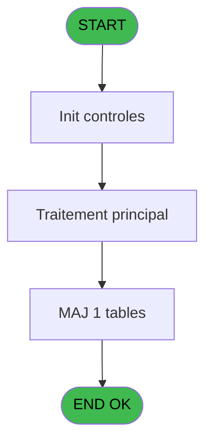
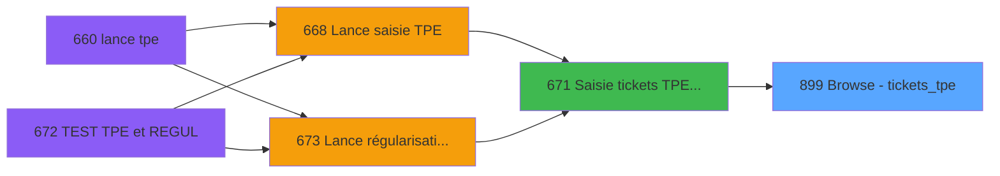

# REF IDE 899 - Browse - tickets_tpe

> **Analyse**: Phases 1-4 2026-02-03 14:59 -> 14:59 (13s) | Assemblage 14:59
> **Pipeline**: V7.2 Enrichi
> **Structure**: 4 onglets (Resume | Ecrans | Donnees | Connexions)

<!-- TAB:Resume -->

## 1. FICHE D'IDENTITE

| Attribut | Valeur |
|----------|--------|
| Projet | REF |
| IDE Position | 899 |
| Nom Programme | Browse - tickets_tpe |
| Fichier source | `Prg_899.xml` |
| Dossier IDE | Impression |
| Taches | 1 (1 ecrans visibles) |
| Tables modifiees | 1 |
| Programmes appeles | 0 |

## 2. DESCRIPTION FONCTIONNELLE

**Browse - tickets_tpe** assure la gestion complete de ce processus, accessible depuis [Saisie tickets TPE Interfacés (IDE 671)](REF-IDE-671.md).

Le flux de traitement s'organise en **1 blocs fonctionnels** :

- **Impression** (1 tache) : generation de tickets et documents

**Donnees modifiees** : 1 tables en ecriture (tickets_tpe).

## 3. BLOCS FONCTIONNELS

### 3.1 Impression (1 tache)

Generation des documents et tickets.

---

#### 899 - Browse - tickets_tpe [[ECRAN]](#ecran-t1)

**Role** : Generation du document : Browse - tickets_tpe.
**Ecran** : 1159 x 195 DLU | [Voir mockup](#ecran-t1)

## 5. REGLES METIER

*(Aucune regle metier identifiee)*

## 6. CONTEXTE

- **Appele par**: [Saisie tickets TPE Interfacés (IDE 671)](REF-IDE-671.md)
- **Appelle**: 0 programmes | **Tables**: 1 (W:1 R:0 L:0) | **Taches**: 1 | **Expressions**: 0

<!-- TAB:Ecrans -->

## 8. ECRANS

### 8.1 Forms visibles (1 / 1)

| # | Position | Tache | Nom | Type | Largeur | Hauteur | Bloc |
|---|----------|-------|-----|------|---------|---------|------|
| 1 | 899 | 899 | Browse - tickets_tpe | Type0 | 1159 | 195 | Impression |

### 8.2 Mockups Ecrans

---

#### 899 - Browse - tickets_tpe
**Tache** : [899](#t1) | **Type** : Type0 | **Dimensions** : 1159 x 195 DLU
**Bloc** : Impression | **Titre IDE** : Browse - tickets_tpe

<!-- FORM-DATA:
{
    "width":  1159,
    "vFactor":  8,
    "type":  "Type0",
    "hFactor":  4,
    "controls":  [
                     {
                         "x":  8,
                         "type":  "table",
                         "var":  "",
                         "name":  "",
                         "titleH":  12,
                         "color":  "",
                         "w":  1137,
                         "y":  8,
                         "fmt":  "",
                         "parent":  null,
                         "text":  "",
                         "rowH":  13,
                         "h":  182,
                         "cols":  [
                                      {
                                          "title":  "tmp_numero_tpe",
                                          "layer":  1,
                                          "w":  66
                                      },
                                      {
                                          "title":  "tmp_date_comptable",
                                          "layer":  2,
                                          "w":  82
                                      },
                                      {
                                          "title":  "tmp_moyen_de_paiement",
                                          "layer":  3,
                                          "w":  100
                                      },
                                      {
                                          "title":  "tmp_ordre_saisie",
                                          "layer":  4,
                                          "w":  66
                                      },
                                      {
                                          "title":  "tmp_montant",
                                          "layer":  5,
                                          "w":  101
                                      },
                                      {
                                          "title":  "tmp_numero_remise",
                                          "layer":  6,
                                          "w":  189
                                      },
                                      {
                                          "title":  "tmp_date_operation_tpe",
                                          "layer":  7,
                                          "w":  95
                                      },
                                      {
                                          "title":  "tmp_buffer_libre",
                                          "layer":  8,
                                          "w":  212
                                      },
                                      {
                                          "title":  "tmp_service",
                                          "layer":  9,
                                          "w":  49
                                      },
                                      {
                                          "title":  "tmp_Vàd",
                                          "layer":  10,
                                          "w":  38
                                      },
                                      {
                                          "title":  "tmp_TPE_reel",
                                          "layer":  11,
                                          "w":  122
                                      }
                                  ],
                         "rows":  11
                     },
                     {
                         "x":  12,
                         "type":  "edit",
                         "var":  "",
                         "y":  23,
                         "w":  13,
                         "fmt":  "",
                         "name":  "tmp_numero_tpe",
                         "h":  10,
                         "color":  "",
                         "text":  "",
                         "parent":  1
                     },
                     {
                         "x":  78,
                         "type":  "edit",
                         "var":  "",
                         "y":  23,
                         "w":  61,
                         "fmt":  "",
                         "name":  "tmp_date_comptable",
                         "h":  10,
                         "color":  "",
                         "text":  "",
                         "parent":  1
                     },
                     {
                         "x":  160,
                         "type":  "edit",
                         "var":  "",
                         "y":  23,
                         "w":  26,
                         "fmt":  "",
                         "name":  "tmp_moyen_de_paiement",
                         "h":  10,
                         "color":  "",
                         "text":  "",
                         "parent":  1
                     },
                     {
                         "x":  260,
                         "type":  "edit",
                         "var":  "",
                         "y":  23,
                         "w":  13,
                         "fmt":  "",
                         "name":  "tmp_ordre_saisie",
                         "h":  10,
                         "color":  "",
                         "text":  "",
                         "parent":  1
                     },
                     {
                         "x":  326,
                         "type":  "edit",
                         "var":  "",
                         "y":  23,
                         "w":  94,
                         "fmt":  "",
                         "name":  "tmp_montant",
                         "h":  10,
                         "color":  "",
                         "text":  "",
                         "parent":  1
                     },
                     {
                         "x":  427,
                         "type":  "edit",
                         "var":  "",
                         "y":  23,
                         "w":  182,
                         "fmt":  "",
                         "name":  "tmp_numero_remise",
                         "h":  10,
                         "color":  "",
                         "text":  "",
                         "parent":  1
                     },
                     {
                         "x":  616,
                         "type":  "edit",
                         "var":  "",
                         "y":  23,
                         "w":  61,
                         "fmt":  "",
                         "name":  "tmp_date_operation_tpe",
                         "h":  10,
                         "color":  "",
                         "text":  "",
                         "parent":  1
                     },
                     {
                         "x":  711,
                         "type":  "edit",
                         "var":  "",
                         "y":  23,
                         "w":  205,
                         "fmt":  "",
                         "name":  "tmp_buffer_libre",
                         "h":  10,
                         "color":  "",
                         "text":  "",
                         "parent":  1
                     },
                     {
                         "x":  923,
                         "type":  "edit",
                         "var":  "",
                         "y":  23,
                         "w":  26,
                         "fmt":  "",
                         "name":  "tmp_service",
                         "h":  10,
                         "color":  "",
                         "text":  "",
                         "parent":  1
                     },
                     {
                         "x":  972,
                         "type":  "edit",
                         "var":  "",
                         "y":  23,
                         "w":  31,
                         "fmt":  "",
                         "name":  "tmp_Vàd",
                         "h":  10,
                         "color":  "",
                         "text":  "",
                         "parent":  1
                     },
                     {
                         "x":  1010,
                         "type":  "edit",
                         "var":  "",
                         "y":  23,
                         "w":  115,
                         "fmt":  "",
                         "name":  "tmp_TPE_reel",
                         "h":  10,
                         "color":  "",
                         "text":  "",
                         "parent":  1
                     }
                 ],
    "taskId":  "899",
    "height":  195
}
-->

<strong>Champs : 11 champs</strong>

| Pos (x,y) | Nom | Variable | Type |
|-----------|-----|----------|------|
| 12,23 | tmp_numero_tpe | - | edit |
| 78,23 | tmp_date_comptable | - | edit |
| 160,23 | tmp_moyen_de_paiement | - | edit |
| 260,23 | tmp_ordre_saisie | - | edit |
| 326,23 | tmp_montant | - | edit |
| 427,23 | tmp_numero_remise | - | edit |
| 616,23 | tmp_date_operation_tpe | - | edit |
| 711,23 | tmp_buffer_libre | - | edit |
| 923,23 | tmp_service | - | edit |
| 972,23 | tmp_Vàd | - | edit |
| 1010,23 | tmp_TPE_reel | - | edit |

## 9. NAVIGATION

Ecran unique: **Browse - tickets_tpe**

### 9.3 Structure hierarchique (1 tache)

| Position | Tache | Type | Dimensions | Bloc |
|----------|-------|------|------------|------|
| **899.1** | [**Browse - tickets_tpe** (899)](#t1) [mockup](#ecran-t1) | - | 1159x195 | Impression |

### 9.4 Algorigramme

> **Legende**: Vert = START/END OK | Rouge = END KO | Bleu = Decisions
> *Algorigramme auto-genere. Utiliser `/algorigramme` pour une synthese metier detaillee.*

<!-- TAB:Donnees -->

## 10. TABLES

### Tables utilisees (1)

| ID | Nom | Description | Type | R | W | L | Usages |
|----|-----|-------------|------|---|---|---|--------|
| 538 | tickets_tpe |  | TMP |   | **W** |   | 1 |

### Colonnes par table (0 / 1 tables avec colonnes identifiees)

Table 538 - tickets_tpe (**W**) - 1 usages

*Table utilisee uniquement en Link ou aucune colonne Real identifiee dans le DataView.*

## 11. VARIABLES

*(Programme sans variables locales mappees)*

## 12. EXPRESSIONS

**0 / 0 expressions decodees (0%)**

### 12.1 Repartition par type

| Type | Expressions | Regles |
|------|-------------|--------|

### 12.2 Expressions cles par type

<!-- TAB:Connexions -->

## 13. GRAPHE D'APPELS

### 13.1 Chaine depuis Main (Callers)

Main -> ... -> [Saisie tickets TPE Interfacés (IDE 671)](REF-IDE-671.md) -> **Browse - tickets_tpe (IDE 899)**

### 13.2 Callers

| IDE | Nom Programme | Nb Appels |
|-----|---------------|-----------|
| [671](REF-IDE-671.md) | Saisie tickets TPE Interfacés | 1 |

### 13.3 Callees (programmes appeles)

### 13.4 Detail Callees avec contexte

| IDE | Nom Programme | Appels | Contexte |
|-----|---------------|--------|----------|
| - | (aucun) | - | - |

## 14. RECOMMANDATIONS MIGRATION

### 14.1 Profil du programme

| Metrique | Valeur | Impact migration |
|----------|--------|-----------------|
| Lignes de logique | 12 | Programme compact |
| Expressions | 0 | Peu de logique |
| Tables WRITE | 1 | Impact faible |
| Sous-programmes | 0 | Peu de dependances |
| Ecrans visibles | 1 | Ecran unique ou traitement batch |
| Code desactive | 0% (0 / 12) | Code sain |
| Regles metier | 0 | Pas de regle identifiee |

### 14.2 Plan de migration par bloc

#### Impression (1 tache: 1 ecran, 0 traitement)

- **Strategie** : Templates HTML -> PDF via wkhtmltopdf ou Puppeteer.
- `PrintService` injectable avec choix imprimante

### 14.3 Dependances critiques

| Dependance | Type | Appels | Impact |
|------------|------|--------|--------|
| tickets_tpe | Table WRITE (Temp) | 1x | Schema + repository |

---
*Spec DETAILED generee par Pipeline V7.2 - 2026-02-03 14:59*
