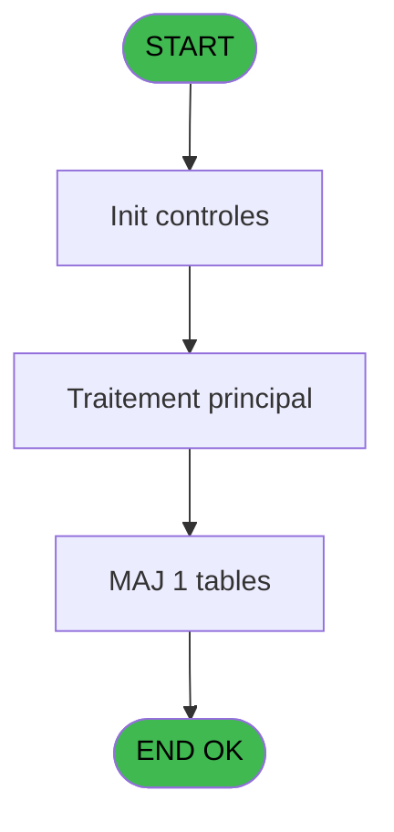

# REF IDE 97 - Browse - logement_client__loc

> **Analyse**: Phases 1-4 2026-02-03 09:19 -> 09:20 (20s) | Assemblage 09:20
> **Pipeline**: V7.2 Enrichi
> **Structure**: 4 onglets (Resume | Ecrans | Donnees | Connexions)

<!-- TAB:Resume -->

## 1. FICHE D'IDENTITE

| Attribut | Valeur |
|----------|--------|
| Projet | REF |
| IDE Position | 97 |
| Nom Programme | Browse - logement_client__loc |
| Fichier source | `Prg_97.xml` |
| Domaine metier | General |
| Taches | 1 (1 ecrans visibles) |
| Tables modifiees | 1 |
| Programmes appeles | 0 |
| :warning: Statut | **ORPHELIN_POTENTIEL** |

## 2. DESCRIPTION FONCTIONNELLE

**Browse - logement_client__loc** assure la gestion complete de ce processus.

Le flux de traitement s'organise en **1 blocs fonctionnels** :

- **Traitement** (1 tache) : traitements metier divers

**Donnees modifiees** : 1 tables en ecriture (logement_client__loc).

## 3. BLOCS FONCTIONNELS

### 3.1 Traitement (1 tache)

Traitements internes.

---

#### 97 - Browse - logement_client__loc [[ECRAN]](#ecran-t1)

**Role** : Traitement : Browse - logement_client__loc.
**Ecran** : 2009 x 195 DLU | [Voir mockup](#ecran-t1)

## 5. REGLES METIER

*(Aucune regle metier identifiee)*

## 6. CONTEXTE

- **Appele par**: (aucun)
- **Appelle**: 0 programmes | **Tables**: 1 (W:1 R:0 L:0) | **Taches**: 1 | **Expressions**: 0

<!-- TAB:Ecrans -->

## 8. ECRANS

### 8.1 Forms visibles (1 / 1)

| # | Position | Tache | Nom | Type | Largeur | Hauteur | Bloc |
|---|----------|-------|-----|------|---------|---------|------|
| 1 | 97 | 97 | Browse - logement_client__loc | Type0 | 2009 | 195 | Traitement |

### 8.2 Mockups Ecrans

---

#### 97 - Browse - logement_client__loc
**Tache** : [97](#t1) | **Type** : Type0 | **Dimensions** : 2009 x 195 DLU
**Bloc** : Traitement | **Titre IDE** : Browse - logement_client__loc

<!-- FORM-DATA:
{
    "width":  2009,
    "vFactor":  8,
    "type":  "Type0",
    "hFactor":  4,
    "controls":  [
                     {
                         "x":  8,
                         "type":  "table",
                         "var":  "",
                         "name":  "",
                         "titleH":  12,
                         "color":  "",
                         "w":  1987,
                         "y":  8,
                         "fmt":  "",
                         "parent":  null,
                         "text":  "",
                         "rowH":  13,
                         "h":  182,
                         "cols":  [
                                      {
                                          "title":  "loc_societe",
                                          "layer":  1,
                                          "w":  46
                                      },
                                      {
                                          "title":  "loc_nom_standard",
                                          "layer":  2,
                                          "w":  73
                                      },
                                      {
                                          "title":  "loc",
                                          "layer":  3,
                                          "w":  66
                                      },
                                      {
                                          "title":  "loc_nom_complet",
                                          "layer":  4,
                                          "w":  94
                                      },
                                      {
                                          "title":  "loc_type_logement",
                                          "layer":  5,
                                          "w":  74
                                      },
                                      {
                                          "title":  "loc_batiment",
                                          "layer":  6,
                                          "w":  51
                                      },
                                      {
                                          "title":  "loc_etage",
                                          "layer":  7,
                                          "w":  41
                                      },
                                      {
                                          "title":  "loc_vue",
                                          "layer":  8,
                                          "w":  34
                                      },
                                      {
                                          "title":  "loc_orientation",
                                          "layer":  9,
                                          "w":  58
                                      },
                                      {
                                          "title":  "loc_secteur",
                                          "layer":  10,
                                          "w":  47
                                      },
                                      {
                                          "title":  "loc_standing",
                                          "layer":  11,
                                          "w":  51
                                      },
                                      {
                                          "title":  "loc_surface",
                                          "layer":  12,
                                          "w":  47
                                      },
                                      {
                                          "title":  "loc_ensemble",
                                          "layer":  13,
                                          "w":  55
                                      },
                                      {
                                          "title":  "loc_occupation_std",
                                          "layer":  14,
                                          "w":  78
                                      },
                                      {
                                          "title":  "loc_zone_menage",
                                          "layer":  15,
                                          "w":  73
                                      },
                                      {
                                          "title":  "loc_secteur_menage",
                                          "layer":  16,
                                          "w":  82
                                      },
                                      {
                                          "title":  "loc_lit_pliant",
                                          "layer":  17,
                                          "w":  50
                                      },
                                      {
                                          "title":  "loc_lit_bebe",
                                          "layer":  18,
                                          "w":  49
                                      },
                                      {
                                          "title":  "loc_lit_banquette",
                                          "layer":  19,
                                          "w":  68
                                      },
                                      {
                                          "title":  "loc_attribution",
                                          "layer":  20,
                                          "w":  56
                                      },
                                      {
                                          "title":  "loc_1",
                                          "layer":  21,
                                          "w":  44
                                      },
                                      {
                                          "title":  "loc_lieu_sejour_perm",
                                          "layer":  22,
                                          "w":  82
                                      },
                                      {
                                          "title":  "loc_code_logement",
                                          "layer":  23,
                                          "w":  78
                                      },
                                      {
                                          "title":  "loc_lieu_de_sejour",
                                          "layer":  24,
                                          "w":  74
                                      },
                                      {
                                          "title":  "loc_2",
                                          "layer":  25,
                                          "w":  24
                                      },
                                      {
                                          "title":  "loc_3",
                                          "layer":  26,
                                          "w":  24
                                      },
                                      {
                                          "title":  "loc_communicante",
                                          "layer":  27,
                                          "w":  74
                                      },
                                      {
                                          "title":  "loc_handicapes",
                                          "layer":  28,
                                          "w":  63
                                      },
                                      {
                                          "title":  "loc_code_menage",
                                          "layer":  29,
                                          "w":  74
                                      },
                                      {
                                          "title":  "loc_tel_interieur",
                                          "layer":  30,
                                          "w":  62
                                      },
                                      {
                                          "title":  "loc_defauts",
                                          "layer":  31,
                                          "w":  47
                                      },
                                      {
                                          "title":  "loc_proche_centre",
                                          "layer":  32,
                                          "w":  74
                                      },
                                      {
                                          "title":  "loc_plus_belle",
                                          "layer":  33,
                                          "w":  57
                                      }
                                  ],
                         "rows":  33
                     },
                     {
                         "x":  12,
                         "type":  "edit",
                         "var":  "",
                         "y":  23,
                         "w":  9,
                         "fmt":  "",
                         "name":  "loc_societe",
                         "h":  10,
                         "color":  "110",
                         "text":  "",
                         "parent":  1
                     },
                     {
                         "x":  58,
                         "type":  "edit",
                         "var":  "",
                         "y":  23,
                         "w":  37,
                         "fmt":  "",
                         "name":  "loc_nom_standard",
                         "h":  10,
                         "color":  "110",
                         "text":  "",
                         "parent":  1
                     },
                     {
                         "x":  131,
                         "type":  "edit",
                         "var":  "",
                         "y":  23,
                         "w":  59,
                         "fmt":  "",
                         "name":  "loc",
                         "h":  10,
                         "color":  "110",
                         "text":  "",
                         "parent":  1
                     },
                     {
                         "x":  197,
                         "type":  "edit",
                         "var":  "",
                         "y":  23,
                         "w":  87,
                         "fmt":  "",
                         "name":  "loc_nom_complet",
                         "h":  10,
                         "color":  "110",
                         "text":  "",
                         "parent":  1
                     },
                     {
                         "x":  291,
                         "type":  "edit",
                         "var":  "",
                         "y":  23,
                         "w":  14,
                         "fmt":  "",
                         "name":  "loc_type_logement",
                         "h":  10,
                         "color":  "110",
                         "text":  "",
                         "parent":  1
                     },
                     {
                         "x":  365,
                         "type":  "edit",
                         "var":  "",
                         "y":  23,
                         "w":  14,
                         "fmt":  "",
                         "name":  "loc_batiment",
                         "h":  10,
                         "color":  "110",
                         "text":  "",
                         "parent":  1
                     },
                     {
                         "x":  416,
                         "type":  "edit",
                         "var":  "",
                         "y":  23,
                         "w":  14,
                         "fmt":  "",
                         "name":  "loc_etage",
                         "h":  10,
                         "color":  "110",
                         "text":  "",
                         "parent":  1
                     },
                     {
                         "x":  457,
                         "type":  "edit",
                         "var":  "",
                         "y":  23,
                         "w":  14,
                         "fmt":  "",
                         "name":  "loc_vue",
                         "h":  10,
                         "color":  "110",
                         "text":  "",
                         "parent":  1
                     },
                     {
                         "x":  491,
                         "type":  "edit",
                         "var":  "",
                         "y":  23,
                         "w":  14,
                         "fmt":  "",
                         "name":  "loc_orientation",
                         "h":  10,
                         "color":  "110",
                         "text":  "",
                         "parent":  1
                     },
                     {
                         "x":  549,
                         "type":  "edit",
                         "var":  "",
                         "y":  23,
                         "w":  14,
                         "fmt":  "",
                         "name":  "loc_secteur",
                         "h":  10,
                         "color":  "110",
                         "text":  "",
                         "parent":  1
                     },
                     {
                         "x":  596,
                         "type":  "edit",
                         "var":  "",
                         "y":  23,
                         "w":  14,
                         "fmt":  "",
                         "name":  "loc_standing",
                         "h":  10,
                         "color":  "110",
                         "text":  "",
                         "parent":  1
                     },
                     {
                         "x":  647,
                         "type":  "edit",
                         "var":  "",
                         "y":  23,
                         "w":  18,
                         "fmt":  "",
                         "name":  "loc_surface",
                         "h":  10,
                         "color":  "110",
                         "text":  "",
                         "parent":  1
                     },
                     {
                         "x":  694,
                         "type":  "edit",
                         "var":  "",
                         "y":  23,
                         "w":  20,
                         "fmt":  "",
                         "name":  "loc_ensemble",
                         "h":  10,
                         "color":  "110",
                         "text":  "",
                         "parent":  1
                     },
                     {
                         "x":  749,
                         "type":  "edit",
                         "var":  "",
                         "y":  23,
                         "w":  13,
                         "fmt":  "",
                         "name":  "loc_occupation_std",
                         "h":  10,
                         "color":  "110",
                         "text":  "",
                         "parent":  1
                     },
                     {
                         "x":  827,
                         "type":  "edit",
                         "var":  "",
                         "y":  23,
                         "w":  13,
                         "fmt":  "",
                         "name":  "loc_zone_menage",
                         "h":  10,
                         "color":  "110",
                         "text":  "",
                         "parent":  1
                     },
                     {
                         "x":  900,
                         "type":  "edit",
                         "var":  "",
                         "y":  23,
                         "w":  13,
                         "fmt":  "",
                         "name":  "loc_secteur_menage",
                         "h":  10,
                         "color":  "110",
                         "text":  "",
                         "parent":  1
                     },
                     {
                         "x":  982,
                         "type":  "edit",
                         "var":  "",
                         "y":  23,
                         "w":  9,
                         "fmt":  "",
                         "name":  "loc_lit_pliant",
                         "h":  10,
                         "color":  "110",
                         "text":  "",
                         "parent":  1
                     },
                     {
                         "x":  1032,
                         "type":  "edit",
                         "var":  "",
                         "y":  23,
                         "w":  9,
                         "fmt":  "",
                         "name":  "loc_lit_bebe",
                         "h":  10,
                         "color":  "110",
                         "text":  "",
                         "parent":  1
                     },
                     {
                         "x":  1081,
                         "type":  "edit",
                         "var":  "",
                         "y":  23,
                         "w":  9,
                         "fmt":  "",
                         "name":  "loc_lit_banquette",
                         "h":  10,
                         "color":  "110",
                         "text":  "",
                         "parent":  1
                     },
                     {
                         "x":  1149,
                         "type":  "edit",
                         "var":  "",
                         "y":  23,
                         "w":  9,
                         "fmt":  "",
                         "name":  "loc_attribution",
                         "h":  10,
                         "color":  "110",
                         "text":  "",
                         "parent":  1
                     },
                     {
                         "x":  1205,
                         "type":  "edit",
                         "var":  "",
                         "y":  23,
                         "w":  37,
                         "fmt":  "",
                         "name":  "loc_1",
                         "h":  10,
                         "color":  "110",
                         "text":  "",
                         "parent":  1
                     },
                     {
                         "x":  1249,
                         "type":  "edit",
                         "var":  "",
                         "y":  23,
                         "w":  37,
                         "fmt":  "",
                         "name":  "loc_lieu_sejour_perm",
                         "h":  10,
                         "color":  "110",
                         "text":  "",
                         "parent":  1
                     },
                     {
                         "x":  1331,
                         "type":  "edit",
                         "var":  "",
                         "y":  23,
                         "w":  37,
                         "fmt":  "",
                         "name":  "loc_code_logement",
                         "h":  10,
                         "color":  "110",
                         "text":  "",
                         "parent":  1
                     },
                     {
                         "x":  1409,
                         "type":  "edit",
                         "var":  "",
                         "y":  23,
                         "w":  9,
                         "fmt":  "",
                         "name":  "loc_lieu_de_sejour",
                         "h":  10,
                         "color":  "110",
                         "text":  "",
                         "parent":  1
                     },
                     {
                         "x":  1483,
                         "type":  "edit",
                         "var":  "",
                         "y":  23,
                         "w":  9,
                         "fmt":  "",
                         "name":  "loc_2",
                         "h":  10,
                         "color":  "110",
                         "text":  "",
                         "parent":  1
                     },
                     {
                         "x":  1507,
                         "type":  "edit",
                         "var":  "",
                         "y":  23,
                         "w":  13,
                         "fmt":  "",
                         "name":  "loc_3",
                         "h":  10,
                         "color":  "110",
                         "text":  "",
                         "parent":  1
                     },
                     {
                         "x":  1531,
                         "type":  "edit",
                         "var":  "",
                         "y":  23,
                         "w":  9,
                         "fmt":  "",
                         "name":  "loc_communicante",
                         "h":  10,
                         "color":  "110",
                         "text":  "",
                         "parent":  1
                     },
                     {
                         "x":  1605,
                         "type":  "edit",
                         "var":  "",
                         "y":  23,
                         "w":  9,
                         "fmt":  "",
                         "name":  "loc_handicapes",
                         "h":  10,
                         "color":  "110",
                         "text":  "",
                         "parent":  1
                     },
                     {
                         "x":  1668,
                         "type":  "edit",
                         "var":  "",
                         "y":  23,
                         "w":  61,
                         "fmt":  "",
                         "name":  "loc_code_menage",
                         "h":  10,
                         "color":  "110",
                         "text":  "",
                         "parent":  1
                     },
                     {
                         "x":  1742,
                         "type":  "edit",
                         "var":  "",
                         "y":  23,
                         "w":  37,
                         "fmt":  "",
                         "name":  "loc_tel_interieur",
                         "h":  10,
                         "color":  "110",
                         "text":  "",
                         "parent":  1
                     },
                     {
                         "x":  1804,
                         "type":  "edit",
                         "var":  "",
                         "y":  23,
                         "w":  9,
                         "fmt":  "",
                         "name":  "loc_defauts",
                         "h":  10,
                         "color":  "110",
                         "text":  "",
                         "parent":  1
                     },
                     {
                         "x":  1851,
                         "type":  "edit",
                         "var":  "",
                         "y":  23,
                         "w":  9,
                         "fmt":  "",
                         "name":  "loc_proche_centre",
                         "h":  10,
                         "color":  "110",
                         "text":  "",
                         "parent":  1
                     },
                     {
                         "x":  1925,
                         "type":  "edit",
                         "var":  "",
                         "y":  23,
                         "w":  9,
                         "fmt":  "",
                         "name":  "loc_plus_belle",
                         "h":  10,
                         "color":  "110",
                         "text":  "",
                         "parent":  1
                     }
                 ],
    "taskId":  "97",
    "height":  195
}
-->

<strong>Champs : 33 champs</strong>

| Pos (x,y) | Nom | Variable | Type |
|-----------|-----|----------|------|
| 12,23 | loc_societe | - | edit |
| 58,23 | loc_nom_standard | - | edit |
| 131,23 | loc | - | edit |
| 197,23 | loc_nom_complet | - | edit |
| 291,23 | loc_type_logement | - | edit |
| 365,23 | loc_batiment | - | edit |
| 416,23 | loc_etage | - | edit |
| 457,23 | loc_vue | - | edit |
| 491,23 | loc_orientation | - | edit |
| 549,23 | loc_secteur | - | edit |
| 596,23 | loc_standing | - | edit |
| 647,23 | loc_surface | - | edit |
| 694,23 | loc_ensemble | - | edit |
| 749,23 | loc_occupation_std | - | edit |
| 827,23 | loc_zone_menage | - | edit |
| 900,23 | loc_secteur_menage | - | edit |
| 982,23 | loc_lit_pliant | - | edit |
| 1032,23 | loc_lit_bebe | - | edit |
| 1081,23 | loc_lit_banquette | - | edit |
| 1149,23 | loc_attribution | - | edit |
| 1205,23 | loc_1 | - | edit |
| 1249,23 | loc_lieu_sejour_perm | - | edit |
| 1331,23 | loc_code_logement | - | edit |
| 1409,23 | loc_lieu_de_sejour | - | edit |
| 1483,23 | loc_2 | - | edit |
| 1507,23 | loc_3 | - | edit |
| 1531,23 | loc_communicante | - | edit |
| 1605,23 | loc_handicapes | - | edit |
| 1668,23 | loc_code_menage | - | edit |
| 1742,23 | loc_tel_interieur | - | edit |
| 1804,23 | loc_defauts | - | edit |
| 1851,23 | loc_proche_centre | - | edit |
| 1925,23 | loc_plus_belle | - | edit |

## 9. NAVIGATION

Ecran unique: **Browse - logement_client__loc**

### 9.3 Structure hierarchique (1 tache)

| Position | Tache | Type | Dimensions | Bloc |
|----------|-------|------|------------|------|
| **97.1** | [**Browse - logement_client__loc** (97)](#t1) [mockup](#ecran-t1) | - | 2009x195 | Traitement |

### 9.4 Algorigramme

> **Legende**: Vert = START/END OK | Rouge = END KO | Bleu = Decisions
> *Algorigramme auto-genere. Utiliser `/algorigramme` pour une synthese metier detaillee.*

<!-- TAB:Donnees -->

## 10. TABLES

### Tables utilisees (1)

| ID | Nom | Description | Type | R | W | L | Usages |
|----|-----|-------------|------|---|---|---|--------|
| 103 | logement_client__loc |  | DB |   | **W** |   | 1 |

### Colonnes par table (0 / 1 tables avec colonnes identifiees)

Table 103 - logement_client__loc (**W**) - 1 usages

*Table utilisee uniquement en Link ou aucune colonne Real identifiee dans le DataView.*

## 11. VARIABLES

*(Programme sans variables locales mappees)*

## 12. EXPRESSIONS

**0 / 0 expressions decodees (0%)**

### 12.1 Repartition par type

| Type | Expressions | Regles |
|------|-------------|--------|

### 12.2 Expressions cles par type

<!-- TAB:Connexions -->

## 13. GRAPHE D'APPELS

### 13.1 Chaine depuis Main (Callers)

**Chemin**: (pas de callers directs)

### 13.2 Callers

| IDE | Nom Programme | Nb Appels |
|-----|---------------|-----------|
| - | (aucun) | - |

### 13.3 Callees (programmes appeles)

### 13.4 Detail Callees avec contexte

| IDE | Nom Programme | Appels | Contexte |
|-----|---------------|--------|----------|
| - | (aucun) | - | - |

## 14. RECOMMANDATIONS MIGRATION

### 14.1 Profil du programme

| Metrique | Valeur | Impact migration |
|----------|--------|-----------------|
| Lignes de logique | 34 | Programme compact |
| Expressions | 0 | Peu de logique |
| Tables WRITE | 1 | Impact faible |
| Sous-programmes | 0 | Peu de dependances |
| Ecrans visibles | 1 | Ecran unique ou traitement batch |
| Code desactive | 0% (0 / 34) | Code sain |
| Regles metier | 0 | Pas de regle identifiee |

### 14.2 Plan de migration par bloc

#### Traitement (1 tache: 1 ecran, 0 traitement)

- **Strategie** : 1 composant(s) UI (Razor/React) avec formulaires et validation.
- Decomposer les taches en services unitaires testables.

### 14.3 Dependances critiques

| Dependance | Type | Appels | Impact |
|------------|------|--------|--------|
| logement_client__loc | Table WRITE (Database) | 1x | Schema + repository |

---
*Spec DETAILED generee par Pipeline V7.2 - 2026-02-03 09:20*
