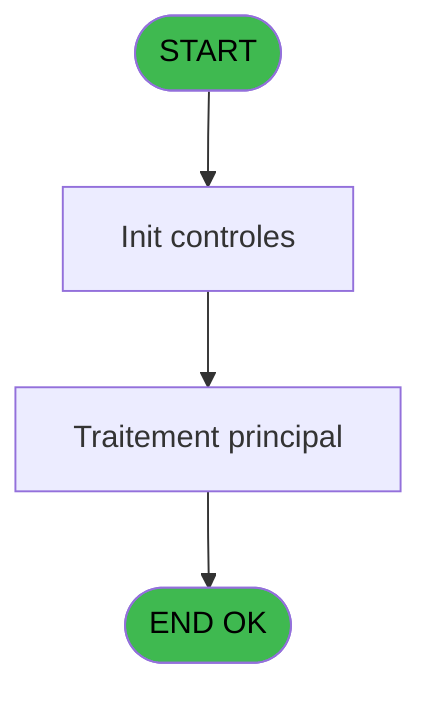
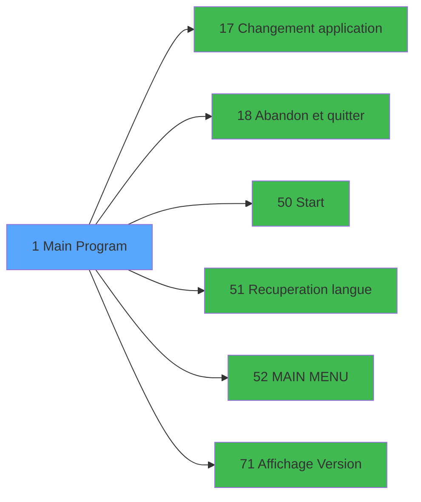

# REQ IDE 1 - Main Program

> **Analyse**: Phases 1-4 2026-02-03 20:21 -> 20:22 (14s) | Assemblage 20:22
> **Pipeline**: V7.2 Enrichi
> **Structure**: 4 onglets (Resume | Ecrans | Donnees | Connexions)

<!-- TAB:Resume -->

## 1. FICHE D'IDENTITE

| Attribut | Valeur |
|----------|--------|
| Projet | REQ |
| IDE Position | 1 |
| Nom Programme | Main Program |
| Fichier source | `Prg_1.xml` |
| Dossier IDE | General |
| Taches | 1 (1 ecrans visibles) |
| Tables modifiees | 0 |
| Programmes appeles | 6 |
| :warning: Statut | **ORPHELIN_POTENTIEL** |

## 2. DESCRIPTION FONCTIONNELLE

**Main Program** assure la gestion complete de ce processus.

Le flux de traitement s'organise en **1 blocs fonctionnels** :

- **Traitement** (1 tache) : traitements metier divers

## 3. BLOCS FONCTIONNELS

### 3.1 Traitement (1 tache)

Traitements internes.

---

#### 1 - Request [[ECRAN]](#ecran-t1)

**Role** : Traitement : Request.
**Ecran** : 320 x 200 DLU (Type11) | [Voir mockup](#ecran-t1)
**Delegue a** : [Changement application (IDE 17)](REQ-IDE-17.md), [Abandon et quitter (IDE 18)](REQ-IDE-18.md), [Start (IDE 50)](REQ-IDE-50.md)

## 5. REGLES METIER

*(Aucune regle metier identifiee)*

## 6. CONTEXTE

- **Appele par**: (aucun)
- **Appelle**: 6 programmes | **Tables**: 0 (W:0 R:0 L:0) | **Taches**: 1 | **Expressions**: 24

<!-- TAB:Ecrans -->

## 8. ECRANS

### 8.1 Forms visibles (1 / 1)

| # | Position | Tache | Nom | Type | Largeur | Hauteur | Bloc |
|---|----------|-------|-----|------|---------|---------|------|
| 1 | 1 | 1 | Request | Type11 | 320 | 200 | Traitement |

### 8.2 Mockups Ecrans

## 9. NAVIGATION

Ecran unique: **Request**

### 9.3 Structure hierarchique (1 tache)

| Position | Tache | Type | Dimensions | Bloc |
|----------|-------|------|------------|------|
| **1.1** | [**Request** (1)](#t1) [mockup](#ecran-t1) | Type11 | 320x200 | Traitement |

### 9.4 Algorigramme

> **Legende**: Vert = START/END OK | Rouge = END KO | Bleu = Decisions
> *Algorigramme auto-genere. Utiliser `/algorigramme` pour une synthese metier detaillee.*

<!-- TAB:Donnees -->

## 10. TABLES

### Tables utilisees (0)

| ID | Nom | Description | Type | R | W | L | Usages |
|----|-----|-------------|------|---|---|---|--------|

### Colonnes par table (0 / 0 tables avec colonnes identifiees)

## 11. VARIABLES

### 11.1 Variables globales (20)

Variables globales partagees entre programmes.

| Lettre | Nom | Type | Usage dans |
|--------|-----|------|-----------|
| A | VG.LOGIN | Unicode | 13x variable globale |
| B | VG.USER | Unicode | - |
| C | VG.DROIT ACCESS TO ADMIN ? | Logical | - |
| D | VG.DROIT ACCESS TO ARCHIVES ? | Logical | - |
| E | VG.DROIT ACCESS TO REQ CENTER ? | Logical | - |
| F | VG.DROIT ACCES A TOUT ? | Logical | - |
| G | VG.DROIT VALIDATE DISPATCH ? | Logical | - |
| H | VG.DROIT ACCESS TO PURGE ? | Logical | - |
| I | VG.DROIT VALIDATE FOLOW UP ? | Logical | - |
| J | VG.DROIT VALIDATE CONTROL ? | Logical | - |
| K | VG.DROIT UNDO CONTROL ? | Logical | - |
| L | VG.DROIT ACCESS GM GO ? | Logical | - |
| M | VG.DROIT ACCESS TO RESTO ? | Logical | - |
| N | VG.DROIT ACCESS TO CLE ? | Logical | - |
| O | VG.DROIT ACCESS TO MESSAGE ? | Logical | - |
| P | VG.DROIT ACCES TO RESTO ADMIN ? | Logical | - |
| Q | VG.VERSION | Alpha | - |
| R | VG.DATE VERSION | Alpha | - |
| S | VG.HOSTNAME AU LIEU DE TERM | Logical | - |
| T | VG.Numéro de pseudo terminal | Numeric | - |

Toutes les 20 variables (liste complete)

| Cat | Lettre | Nom Variable | Type |
|-----|--------|--------------|------|
| VG | **A** | VG.LOGIN | Unicode |
| VG | **B** | VG.USER | Unicode |
| VG | **C** | VG.DROIT ACCESS TO ADMIN ? | Logical |
| VG | **D** | VG.DROIT ACCESS TO ARCHIVES ? | Logical |
| VG | **E** | VG.DROIT ACCESS TO REQ CENTER ? | Logical |
| VG | **F** | VG.DROIT ACCES A TOUT ? | Logical |
| VG | **G** | VG.DROIT VALIDATE DISPATCH ? | Logical |
| VG | **H** | VG.DROIT ACCESS TO PURGE ? | Logical |
| VG | **I** | VG.DROIT VALIDATE FOLOW UP ? | Logical |
| VG | **J** | VG.DROIT VALIDATE CONTROL ? | Logical |
| VG | **K** | VG.DROIT UNDO CONTROL ? | Logical |
| VG | **L** | VG.DROIT ACCESS GM GO ? | Logical |
| VG | **M** | VG.DROIT ACCESS TO RESTO ? | Logical |
| VG | **N** | VG.DROIT ACCESS TO CLE ? | Logical |
| VG | **O** | VG.DROIT ACCESS TO MESSAGE ? | Logical |
| VG | **P** | VG.DROIT ACCES TO RESTO ADMIN ? | Logical |
| VG | **Q** | VG.VERSION | Alpha |
| VG | **R** | VG.DATE VERSION | Alpha |
| VG | **S** | VG.HOSTNAME AU LIEU DE TERM | Logical |
| VG | **T** | VG.Numéro de pseudo terminal | Numeric |

## 12. EXPRESSIONS

**24 / 24 expressions decodees (100%)**

### 12.1 Repartition par type

| Type | Expressions | Regles |
|------|-------------|--------|
| CONCATENATION | 1 | 0 |
| CONSTANTE | 5 | 0 |
| CONDITION | 1 | 0 |
| CAST_LOGIQUE | 13 | 0 |
| OTHER | 3 | 0 |
| NEGATION | 1 | 0 |

### 12.2 Expressions cles par type

#### CONCATENATION (1 expressions)

| Type | IDE | Expression | Regle |
|------|-----|------------|-------|
| CONCATENATION | 16 | `'Request - V '&Trim(ExpCalc('19'EXP))&' - '&Trim(ExpCalc('20'EXP))` | - |

#### CONSTANTE (5 expressions)

| Type | IDE | Expression | Regle |
|------|-----|------------|-------|
| CONSTANTE | 19 | `'T2H'` | - |
| CONSTANTE | 20 | `'1.00'` | - |
| CONSTANTE | 18 | `'31/03/2021'` | - |
| CONSTANTE | 15 | `'RQ'` | - |
| CONSTANTE | 17 | `'4.12'` | - |

#### CONDITION (1 expressions)

| Type | IDE | Expression | Regle |
|------|-----|------------|-------|
| CONDITION | 1 | `RunMode ()<=2` | - |

#### CAST_LOGIQUE (13 expressions)

| Type | IDE | Expression | Regle |
|------|-----|------------|-------|
| CAST_LOGIQUE | 11 | `CallProg(ProgIdx('hasRight','TRUE'LOG),VG.LOGIN [A],'RESTOACCES')` | - |
| CAST_LOGIQUE | 10 | `CallProg(ProgIdx('hasRight','TRUE'LOG),VG.LOGIN [A],'REQACCES')` | - |
| CAST_LOGIQUE | 9 | `CallProg(ProgIdx('hasRight','TRUE'LOG),VG.LOGIN [A],'UNDO CTRL')` | - |
| CAST_LOGIQUE | 14 | `CallProg(ProgIdx('hasRight','TRUE'LOG),VG.LOGIN [A],'RESTOADMIN')` | - |
| CAST_LOGIQUE | 13 | `CallProg(ProgIdx('hasRight','TRUE'LOG),VG.LOGIN [A],'MESSACCES')` | - |
| ... | | *+8 autres* | |

#### OTHER (3 expressions)

| Type | IDE | Expression | Regle |
|------|-----|------------|-------|
| OTHER | 24 | `VG.HOSTNAME AU LIEU DE... [S]` | - |
| OTHER | 22 | `GetPseudoTerminal ()` | - |
| OTHER | 21 | `Term ()` | - |

#### NEGATION (1 expressions)

| Type | IDE | Expression | Regle |
|------|-----|------------|-------|
| NEGATION | 23 | `NOT VG.HOSTNAME AU LIEU DE... [S]` | - |

### 12.3 Toutes les expressions (24)

Voir les 24 expressions

#### CONCATENATION (1)

| IDE | Expression Decodee |
|-----|-------------------|
| 16 | `'Request - V '&Trim(ExpCalc('19'EXP))&' - '&Trim(ExpCalc('20'EXP))` |

#### CONSTANTE (5)

| IDE | Expression Decodee |
|-----|-------------------|
| 15 | `'RQ'` |
| 17 | `'4.12'` |
| 18 | `'31/03/2021'` |
| 19 | `'T2H'` |
| 20 | `'1.00'` |

#### CONDITION (1)

| IDE | Expression Decodee |
|-----|-------------------|
| 1 | `RunMode ()<=2` |

#### CAST_LOGIQUE (13)

| IDE | Expression Decodee |
|-----|-------------------|
| 2 | `CallProg(ProgIdx('hasRight','TRUE'LOG),VG.LOGIN [A],'ACCESARCHI')` |
| 3 | `CallProg(ProgIdx('hasRight','TRUE'LOG),VG.LOGIN [A],'REQCENTER')` |
| 4 | `CallProg(ProgIdx('hasRight','TRUE'LOG),VG.LOGIN [A],'ACCESALL')` |
| 5 | `CallProg(ProgIdx('hasRight','TRUE'LOG),VG.LOGIN [A],'VALID DISP')` |
| 6 | `CallProg(ProgIdx('hasRight','TRUE'LOG),VG.LOGIN [A],'PURACCESS')` |
| 7 | `CallProg(ProgIdx('hasRight','TRUE'LOG),VG.LOGIN [A],'VALID FOUP')` |
| 8 | `CallProg(ProgIdx('hasRight','TRUE'LOG),VG.LOGIN [A],'VALID CTRL')` |
| 9 | `CallProg(ProgIdx('hasRight','TRUE'LOG),VG.LOGIN [A],'UNDO CTRL')` |
| 10 | `CallProg(ProgIdx('hasRight','TRUE'LOG),VG.LOGIN [A],'REQACCES')` |
| 11 | `CallProg(ProgIdx('hasRight','TRUE'LOG),VG.LOGIN [A],'RESTOACCES')` |
| 12 | `CallProg(ProgIdx('hasRight','TRUE'LOG),VG.LOGIN [A],'CLEACCES')` |
| 13 | `CallProg(ProgIdx('hasRight','TRUE'LOG),VG.LOGIN [A],'MESSACCES')` |
| 14 | `CallProg(ProgIdx('hasRight','TRUE'LOG),VG.LOGIN [A],'RESTOADMIN')` |

#### OTHER (3)

| IDE | Expression Decodee |
|-----|-------------------|
| 21 | `Term ()` |
| 22 | `GetPseudoTerminal ()` |
| 24 | `VG.HOSTNAME AU LIEU DE... [S]` |

#### NEGATION (1)

| IDE | Expression Decodee |
|-----|-------------------|
| 23 | `NOT VG.HOSTNAME AU LIEU DE... [S]` |

<!-- TAB:Connexions -->

## 13. GRAPHE D'APPELS

### 13.1 Chaine depuis Main (Callers)

**Chemin**: (pas de callers directs)

### 13.2 Callers

| IDE | Nom Programme | Nb Appels |
|-----|---------------|-----------|
| - | (aucun) | - |

### 13.3 Callees (programmes appeles)

### 13.4 Detail Callees avec contexte

| IDE | Nom Programme | Appels | Contexte |
|-----|---------------|--------|----------|
| [17](REQ-IDE-17.md) | Changement application | 2 | Sous-programme |
| [18](REQ-IDE-18.md) | Abandon et quitter | 1 | Sous-programme |
| [50](REQ-IDE-50.md) | Start | 1 | Sous-programme |
| [51](REQ-IDE-51.md) |   Recuperation langue | 1 | Recuperation donnees |
| [52](REQ-IDE-52.md) | MAIN MENU | 1 | Navigation menu |
| [71](REQ-IDE-71.md) | Affichage &Version | 1 | Affichage donnees |

## 14. RECOMMANDATIONS MIGRATION

### 14.1 Profil du programme

| Metrique | Valeur | Impact migration |
|----------|--------|-----------------|
| Lignes de logique | 54 | Programme compact |
| Expressions | 24 | Peu de logique |
| Tables WRITE | 0 | Impact faible |
| Sous-programmes | 6 | Dependances moderees |
| Ecrans visibles | 1 | Ecran unique ou traitement batch |
| Code desactive | 0% (0 / 54) | Code sain |
| Regles metier | 0 | Pas de regle identifiee |

### 14.2 Plan de migration par bloc

#### Traitement (1 tache: 1 ecran, 0 traitement)

- **Strategie** : 1 composant(s) UI (Razor/React) avec formulaires et validation.
- 6 sous-programme(s) a migrer ou a reutiliser depuis les services existants.
- Decomposer les taches en services unitaires testables.

### 14.3 Dependances critiques

| Dependance | Type | Appels | Impact |
|------------|------|--------|--------|
| [Changement application (IDE 17)](REQ-IDE-17.md) | Sous-programme | 2x | Haute - Sous-programme |
| [MAIN MENU (IDE 52)](REQ-IDE-52.md) | Sous-programme | 1x | Normale - Navigation menu |
| [Affichage &Version (IDE 71)](REQ-IDE-71.md) | Sous-programme | 1x | Normale - Affichage donnees |
| [  Recuperation langue (IDE 51)](REQ-IDE-51.md) | Sous-programme | 1x | Normale - Recuperation donnees |
| [Abandon et quitter (IDE 18)](REQ-IDE-18.md) | Sous-programme | 1x | Normale - Sous-programme |
| [Start (IDE 50)](REQ-IDE-50.md) | Sous-programme | 1x | Normale - Sous-programme |

---
*Spec DETAILED generee par Pipeline V7.2 - 2026-02-03 20:22*
