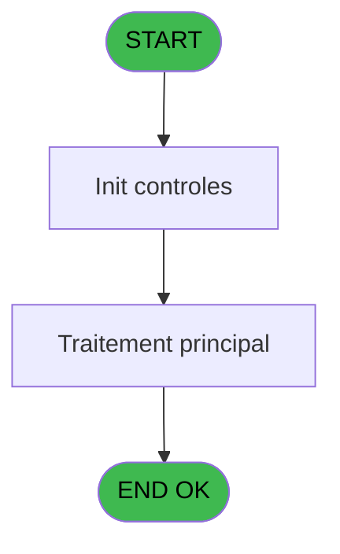
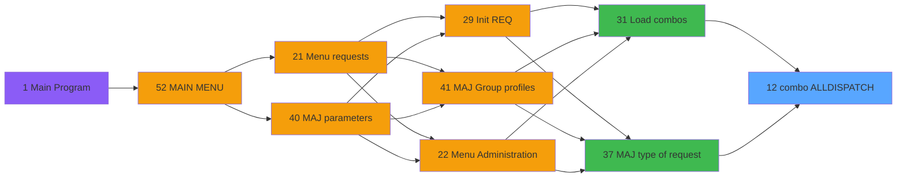

# REQ IDE 12 - combo ALLDISPATCH

> **Analyse**: Phases 1-4 2026-02-03 20:25 -> 20:25 (13s) | Assemblage 20:25
> **Pipeline**: V7.2 Enrichi
> **Structure**: 4 onglets (Resume | Ecrans | Donnees | Connexions)

<!-- TAB:Resume -->

## 1. FICHE D'IDENTITE

| Attribut | Valeur |
|----------|--------|
| Projet | REQ |
| IDE Position | 12 |
| Nom Programme | combo ALLDISPATCH |
| Fichier source | `Prg_12.xml` |
| Dossier IDE | Combos |
| Taches | 1 (0 ecrans visibles) |
| Tables modifiees | 0 |
| Programmes appeles | 0 |

## 2. DESCRIPTION FONCTIONNELLE

**combo ALLDISPATCH** assure la gestion complete de ce processus, accessible depuis [  Load combos (IDE 31)](REQ-IDE-31.md), [MAJ type of request (IDE 37)](REQ-IDE-37.md).

Le flux de traitement s'organise en **1 blocs fonctionnels** :

- **Consultation** (1 tache) : ecrans de recherche, selection et consultation

## 3. BLOCS FONCTIONNELS

### 3.1 Consultation (1 tache)

Ecrans de recherche et consultation.

---

#### 12 - Zoom service [[ECRAN]](#ecran-t1)

**Role** : Selection par l'operateur : Zoom service.
**Ecran** : 282 x 62 DLU (MDI) | [Voir mockup](#ecran-t1)

## 5. REGLES METIER

*(Aucune regle metier identifiee)*

## 6. CONTEXTE

- **Appele par**: [  Load combos (IDE 31)](REQ-IDE-31.md), [MAJ type of request (IDE 37)](REQ-IDE-37.md)
- **Appelle**: 0 programmes | **Tables**: 3 (W:0 R:1 L:2) | **Taches**: 1 | **Expressions**: 13

<!-- TAB:Ecrans -->

## 8. ECRANS

*(Programme sans ecran visible)*

## 9. NAVIGATION

### 9.3 Structure hierarchique (1 tache)

| Position | Tache | Type | Dimensions | Bloc |
|----------|-------|------|------------|------|
| **12.1** | [**Zoom service** (12)](#t1) [mockup](#ecran-t1) | MDI | 282x62 | Consultation |

### 9.4 Algorigramme

> **Legende**: Vert = START/END OK | Rouge = END KO | Bleu = Decisions
> *Algorigramme auto-genere. Utiliser `/algorigramme` pour une synthese metier detaillee.*

<!-- TAB:Donnees -->

## 10. TABLES

### Tables utilisees (3)

| ID | Nom | Description | Type | R | W | L | Usages |
|----|-----|-------------|------|---|---|---|--------|
| 426 | req_groups_profile2__service_ | Services / filieres | DB | R |   |   | 1 |
| 434 | req_type_options |  | DB |   |   | L | 1 |
| 435 | req_archives |  | DB |   |   | L | 1 |

### Colonnes par table (1 / 1 tables avec colonnes identifiees)

Table 426 - req_groups_profile2__service_ (R) - 1 usages

| Lettre | Variable | Acces | Type |
|--------|----------|-------|------|
| A | v.list ALLMY | R | Alpha |
| B | v.list ALLBUTMY | R | Alpha |
| C | v.list ALL | R | Alpha |
| D | r.profile 5 | R | Logical |

## 11. VARIABLES

### 11.1 Variables de session (3)

Variables persistantes pendant toute la session.

| Lettre | Nom | Type | Usage dans |
|--------|-----|------|-----------|
| A | v.list ALLMY | Alpha | 3x session |
| B | v.list ALLBUTMY | Alpha | 3x session |
| C | v.list ALL | Alpha | 9x session |

### 11.2 Autres (1)

Variables diverses.

| Lettre | Nom | Type | Usage dans |
|--------|-----|------|-----------|
| D | r.profile 5 | Logical | 5x refs |

## 12. EXPRESSIONS

**13 / 13 expressions decodees (100%)**

### 12.1 Repartition par type

| Type | Expressions | Regles |
|------|-------------|--------|
| CALCULATION | 3 | 0 |
| OTHER | 3 | 0 |
| CONDITION | 1 | 0 |
| CONCATENATION | 3 | 0 |
| STRING | 3 | 0 |

### 12.2 Expressions cles par type

#### CALCULATION (3 expressions)

| Type | IDE | Expression | Regle |
|------|-----|------------|-------|
| CALCULATION | 6 | `Left (Trim (v.list ALL [C]),Len (Trim (v.list ALL [C]))-1)` | - |
| CALCULATION | 5 | `Left (Trim (v.list ALLBUTMY [B]),Len (Trim (v.list ALLBUTMY [B]))-1)` | - |
| CALCULATION | 4 | `Left (Trim (v.list ALLMY [A]),Len (Trim (v.list ALLMY [A]))-1)` | - |

#### OTHER (3 expressions)

| Type | IDE | Expression | Regle |
|------|-----|------------|-------|
| OTHER | 12 | `[G]` | - |
| OTHER | 11 | `r.profile 5 [D]` | - |
| OTHER | 10 | `GetParam ('GROUP')` | - |

#### CONDITION (1 expressions)

| Type | IDE | Expression | Regle |
|------|-----|------------|-------|
| CONDITION | 13 | `[G] AND [F]<>r.profile 5 [D]` | - |

#### CONCATENATION (3 expressions)

| Type | IDE | Expression | Regle |
|------|-----|------------|-------|
| CONCATENATION | 3 | `Trim (v.list ALL [C])&Trim (r.profile 5 [D])&','` | - |
| CONCATENATION | 2 | `Trim (v.list ALLBUTMY [B])&Trim (r.profile 5 [D])&','` | - |
| CONCATENATION | 1 | `Trim (v.list ALLMY [A])&Trim (r.profile 5 [D])&','` | - |

#### STRING (3 expressions)

| Type | IDE | Expression | Regle |
|------|-----|------------|-------|
| STRING | 9 | `SetParam ('ALLDISPATCH',Trim (v.list ALL [C]))` | - |
| STRING | 8 | `SetParam ('ALLBUTMYDISPATCH',Trim (v.list ALLBUTMY [B]))` | - |
| STRING | 7 | `SetParam ('ALLMYDISPATCH',Trim (v.list ALLMY [A]))` | - |

<!-- TAB:Connexions -->

## 13. GRAPHE D'APPELS

### 13.1 Chaine depuis Main (Callers)

Main -> ... -> [  Load combos (IDE 31)](REQ-IDE-31.md) -> **combo ALLDISPATCH (IDE 12)**

Main -> ... -> [MAJ type of request (IDE 37)](REQ-IDE-37.md) -> **combo ALLDISPATCH (IDE 12)**

### 13.2 Callers

| IDE | Nom Programme | Nb Appels |
|-----|---------------|-----------|
| [31](REQ-IDE-31.md) |   Load combos | 1 |
| [37](REQ-IDE-37.md) | MAJ type of request | 1 |

### 13.3 Callees (programmes appeles)

### 13.4 Detail Callees avec contexte

| IDE | Nom Programme | Appels | Contexte |
|-----|---------------|--------|----------|
| - | (aucun) | - | - |

## 14. RECOMMANDATIONS MIGRATION

### 14.1 Profil du programme

| Metrique | Valeur | Impact migration |
|----------|--------|-----------------|
| Lignes de logique | 27 | Programme compact |
| Expressions | 13 | Peu de logique |
| Tables WRITE | 0 | Impact faible |
| Sous-programmes | 0 | Peu de dependances |
| Ecrans visibles | 0 | Ecran unique ou traitement batch |
| Code desactive | 0% (0 / 27) | Code sain |
| Regles metier | 0 | Pas de regle identifiee |

### 14.2 Plan de migration par bloc

#### Consultation (1 tache: 1 ecran, 0 traitement)

- **Strategie** : Composants de recherche/selection en modales.
- 1 ecran : Zoom service

### 14.3 Dependances critiques

| Dependance | Type | Appels | Impact |
|------------|------|--------|--------|

---
*Spec DETAILED generee par Pipeline V7.2 - 2026-02-03 20:25*
