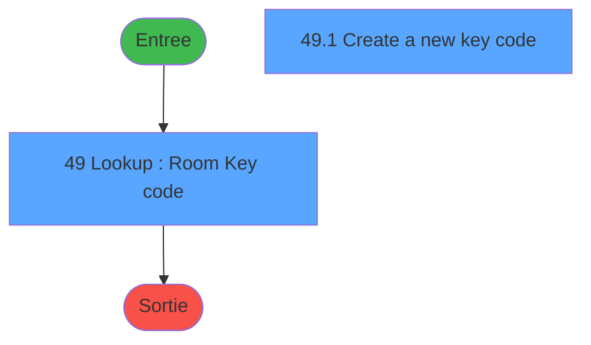
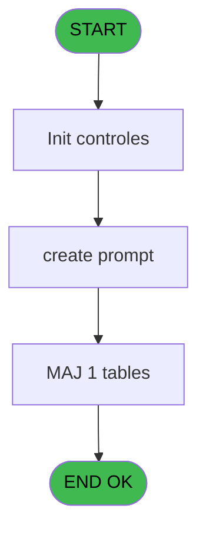
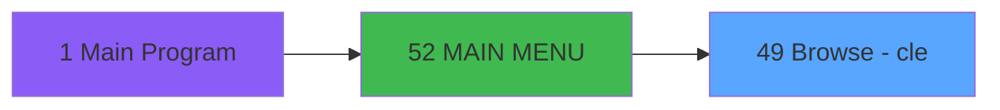
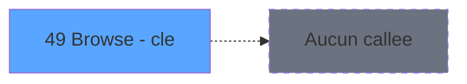

# REQ IDE 49 - Browse - cle

> **Analyse**: Phases 1-4 2026-02-03 20:29 -> 20:29 (14s) | Assemblage 20:29
> **Pipeline**: V7.2 Enrichi
> **Structure**: 4 onglets (Resume | Ecrans | Donnees | Connexions)

<!-- TAB:Resume -->

## 1. FICHE D'IDENTITE

| Attribut | Valeur |
|----------|--------|
| Projet | REQ |
| IDE Position | 49 |
| Nom Programme | Browse - cle |
| Fichier source | `Prg_49.xml` |
| Dossier IDE | Initialisation |
| Taches | 3 (2 ecrans visibles) |
| Tables modifiees | 1 |
| Programmes appeles | 0 |

## 2. DESCRIPTION FONCTIONNELLE

**Browse - cle** assure la gestion complete de ce processus, accessible depuis [MAIN MENU (IDE 52)](REQ-IDE-52.md).

Le flux de traitement s'organise en **2 blocs fonctionnels** :

- **Creation** (2 taches) : insertion d'enregistrements en base (mouvements, prestations)
- **Traitement** (1 tache) : traitements metier divers

**Donnees modifiees** : 1 tables en ecriture (cle).

Detail : phases du traitement

#### Phase 1 : Traitement (1 tache)

- **49** - Lookup : Room / Key code **[[ECRAN]](#ecran-t1)**

#### Phase 2 : Creation (2 taches)

- **49.1** - Create a new key code **[[ECRAN]](#ecran-t2)**
- **49.1.1** - create batch

#### Tables impactees

| Table | Operations | Role metier |
|-------|-----------|-------------|
| cle | **W** (3 usages) |  |

## 3. BLOCS FONCTIONNELS

### 3.1 Traitement (1 tache)

Traitements internes.

---

#### 49 - Lookup : Room / Key code [[ECRAN]](#ecran-t1)

**Role** : Traitement : Lookup : Room / Key code.
**Ecran** : 361 x 255 DLU (MDI) | [Voir mockup](#ecran-t1)
**Variables liees** : A (v.code), B (c.room), C (r.code), D (r.room)

### 3.2 Creation (2 taches)

Insertion de nouveaux enregistrements en base.

---

#### 49.1 - Create a new key code [[ECRAN]](#ecran-t2)

**Role** : Traitement : Create a new key code.
**Ecran** : 242 x 84 DLU (MDI) | [Voir mockup](#ecran-t2)
**Variables liees** : A (v.code), C (r.code)

---

#### 49.1.1 - create batch

**Role** : Traitement : create batch.

## 5. REGLES METIER

*(Aucune regle metier identifiee)*

## 6. CONTEXTE

- **Appele par**: [MAIN MENU (IDE 52)](REQ-IDE-52.md)
- **Appelle**: 0 programmes | **Tables**: 1 (W:1 R:0 L:0) | **Taches**: 3 | **Expressions**: 7

<!-- TAB:Ecrans -->

## 8. ECRANS

### 8.1 Forms visibles (2 / 3)

| # | Position | Tache | Nom | Type | Largeur | Hauteur | Bloc |
|---|----------|-------|-----|------|---------|---------|------|
| 1 | 49 | 49 | Lookup : Room / Key code | MDI | 361 | 255 | Traitement |
| 2 | 49.1 | 49.1 | Create a new key code | MDI | 242 | 84 | Creation |

### 8.2 Mockups Ecrans

---

#### 49 - Lookup : Room / Key code
**Tache** : [49](#t1) | **Type** : MDI | **Dimensions** : 361 x 255 DLU
**Bloc** : Traitement | **Titre IDE** : Lookup : Room / Key code

<!-- FORM-DATA:
{
    "width":  361,
    "vFactor":  8,
    "type":  "MDI",
    "hFactor":  4,
    "controls":  [
                     {
                         "x":  0,
                         "type":  "label",
                         "var":  "",
                         "y":  0,
                         "w":  360,
                         "fmt":  "",
                         "name":  "",
                         "h":  40,
                         "color":  "6",
                         "text":  "",
                         "parent":  null
                     },
                     {
                         "x":  10,
                         "type":  "label",
                         "var":  "",
                         "y":  8,
                         "w":  140,
                         "fmt":  "",
                         "name":  "",
                         "h":  12,
                         "color":  "6",
                         "text":  "Room key codes",
                         "parent":  1
                     },
                     {
                         "x":  53,
                         "type":  "label",
                         "var":  "",
                         "y":  24,
                         "w":  249,
                         "fmt":  "",
                         "name":  "",
                         "h":  9,
                         "color":  "6",
                         "text":  "Enter each room number and its respective code",
                         "parent":  1
                     },
                     {
                         "x":  131,
                         "type":  "table",
                         "var":  "",
                         "name":  "",
                         "titleH":  12,
                         "color":  "110",
                         "w":  187,
                         "y":  68,
                         "fmt":  "",
                         "parent":  null,
                         "text":  "",
                         "rowH":  13,
                         "h":  143,
                         "cols":  [
                                      {
                                          "title":  "Key code",
                                          "layer":  1,
                                          "w":  81
                                      },
                                      {
                                          "title":  "Room number",
                                          "layer":  2,
                                          "w":  90
                                      }
                                  ],
                         "rows":  2
                     },
                     {
                         "x":  0,
                         "type":  "line",
                         "var":  "",
                         "y":  228,
                         "w":  361,
                         "fmt":  "",
                         "name":  "",
                         "h":  0,
                         "color":  "7",
                         "text":  "",
                         "parent":  null
                     },
                     {
                         "x":  143,
                         "type":  "edit",
                         "var":  "",
                         "y":  83,
                         "w":  66,
                         "fmt":  "U10",
                         "name":  "",
                         "h":  8,
                         "color":  "6",
                         "text":  "",
                         "parent":  8
                     },
                     {
                         "x":  219,
                         "type":  "edit",
                         "var":  "",
                         "y":  83,
                         "w":  78,
                         "fmt":  "U10",
                         "name":  "",
                         "h":  9,
                         "color":  "6",
                         "text":  "",
                         "parent":  8
                     },
                     {
                         "x":  10,
                         "type":  "image",
                         "var":  "",
                         "y":  46,
                         "w":  80,
                         "fmt":  "",
                         "name":  "",
                         "h":  61,
                         "color":  "",
                         "text":  "",
                         "parent":  null
                     },
                     {
                         "x":  4,
                         "type":  "button",
                         "var":  "",
                         "y":  234,
                         "w":  79,
                         "fmt":  "Query",
                         "name":  "",
                         "h":  17,
                         "color":  "",
                         "text":  "",
                         "parent":  null
                     },
                     {
                         "x":  82,
                         "type":  "button",
                         "var":  "",
                         "y":  234,
                         "w":  79,
                         "fmt":  "Modify",
                         "name":  "",
                         "h":  17,
                         "color":  "",
                         "text":  "",
                         "parent":  null
                     },
                     {
                         "x":  160,
                         "type":  "button",
                         "var":  "",
                         "y":  234,
                         "w":  79,
                         "fmt":  "Create",
                         "name":  "",
                         "h":  17,
                         "color":  "",
                         "text":  "",
                         "parent":  null
                     },
                     {
                         "x":  276,
                         "type":  "button",
                         "var":  "",
                         "y":  234,
                         "w":  79,
                         "fmt":  "Exit",
                         "name":  "",
                         "h":  17,
                         "color":  "",
                         "text":  "",
                         "parent":  null
                     },
                     {
                         "x":  316,
                         "type":  "image",
                         "var":  "",
                         "y":  9,
                         "w":  30,
                         "fmt":  "",
                         "name":  "",
                         "h":  21,
                         "color":  "",
                         "text":  "",
                         "parent":  null
                     }
                 ],
    "taskId":  "49",
    "height":  255
}
-->

<strong>Champs : 2 champs</strong>

| Pos (x,y) | Nom | Variable | Type |
|-----------|-----|----------|------|
| 143,83 | U10 | - | edit |
| 219,83 | U10 | - | edit |

<strong>Boutons : 4 boutons</strong>

| Bouton | Pos (x,y) | Action |
|--------|-----------|--------|
| Query | 4,234 | Bouton fonctionnel |
| Modify | 82,234 | Modifie l'element |
| Create | 160,234 | Bouton fonctionnel |
| Exit | 276,234 | Quitte le programme |

---

#### 49.1 - Create a new key code
**Tache** : [49.1](#t2) | **Type** : MDI | **Dimensions** : 242 x 84 DLU
**Bloc** : Creation | **Titre IDE** : Create a new key code

<!-- FORM-DATA:
{
    "width":  242,
    "vFactor":  8,
    "type":  "MDI",
    "hFactor":  4,
    "controls":  [
                     {
                         "x":  53,
                         "type":  "label",
                         "var":  "",
                         "y":  16,
                         "w":  63,
                         "fmt":  "",
                         "name":  "",
                         "h":  11,
                         "color":  "",
                         "text":  "Key code",
                         "parent":  null
                     },
                     {
                         "x":  53,
                         "type":  "label",
                         "var":  "",
                         "y":  32,
                         "w":  63,
                         "fmt":  "",
                         "name":  "",
                         "h":  11,
                         "color":  "",
                         "text":  "Room number",
                         "parent":  null
                     },
                     {
                         "x":  0,
                         "type":  "line",
                         "var":  "",
                         "y":  59,
                         "w":  242,
                         "fmt":  "",
                         "name":  "",
                         "h":  0,
                         "color":  "7",
                         "text":  "",
                         "parent":  null
                     },
                     {
                         "x":  120,
                         "type":  "edit",
                         "var":  "",
                         "y":  16,
                         "w":  69,
                         "fmt":  "U10",
                         "name":  "",
                         "h":  11,
                         "color":  "6",
                         "text":  "",
                         "parent":  null
                     },
                     {
                         "x":  120,
                         "type":  "edit",
                         "var":  "",
                         "y":  32,
                         "w":  69,
                         "fmt":  "U10",
                         "name":  "",
                         "h":  11,
                         "color":  "6",
                         "text":  "",
                         "parent":  null
                     },
                     {
                         "x":  159,
                         "type":  "button",
                         "var":  "",
                         "y":  64,
                         "w":  79,
                         "fmt":  "Cancel",
                         "name":  "",
                         "h":  17,
                         "color":  "",
                         "text":  "",
                         "parent":  null
                     },
                     {
                         "x":  83,
                         "type":  "button",
                         "var":  "",
                         "y":  64,
                         "w":  77,
                         "fmt":  "Ok",
                         "name":  "",
                         "h":  17,
                         "color":  "",
                         "text":  "",
                         "parent":  null
                     }
                 ],
    "taskId":  "49.1",
    "height":  84
}
-->

<strong>Champs : 2 champs</strong>

| Pos (x,y) | Nom | Variable | Type |
|-----------|-----|----------|------|
| 120,16 | U10 | - | edit |
| 120,32 | U10 | - | edit |

<strong>Boutons : 2 boutons</strong>

| Bouton | Pos (x,y) | Action |
|--------|-----------|--------|
| Cancel | 159,64 | Annule et retour au menu |
| Ok | 83,64 | Valide la saisie et enregistre |

## 9. NAVIGATION

### 9.1 Enchainement des ecrans

**Detail par enchainement :**

| Depuis | Action | Vers | Retour |
|--------|--------|------|--------|

### 9.3 Structure hierarchique (3 taches)

| Position | Tache | Type | Dimensions | Bloc |
|----------|-------|------|------------|------|
| **49.1** | [**Lookup : Room / Key code** (49)](#t1) [mockup](#ecran-t1) | MDI | 361x255 | Traitement |
| **49.2** | [**Create a new key code** (49.1)](#t2) [mockup](#ecran-t2) | MDI | 242x84 | Creation |
| 49.2.1 | [create batch (49.1.1)](#t3) | MDI | - | |

### 9.4 Algorigramme

> **Legende**: Vert = START/END OK | Rouge = END KO | Bleu = Decisions
> *Algorigramme auto-genere. Utiliser `/algorigramme` pour une synthese metier detaillee.*

<!-- TAB:Donnees -->

## 10. TABLES

### Tables utilisees (1)

| ID | Nom | Description | Type | R | W | L | Usages |
|----|-----|-------------|------|---|---|---|--------|
| 276 | cle |  | DB |   | **W** |   | 3 |

### Colonnes par table (1 / 1 tables avec colonnes identifiees)

Table 276 - cle (**W**) - 3 usages

| Lettre | Variable | Acces | Type |
|--------|----------|-------|------|
| A | v.code | W | Alpha |
| B | c.room | W | Alpha |
| C | r.code | W | Logical |
| D | r.room | W | Logical |

## 11. VARIABLES

### 11.1 Variables de session (1)

Variables persistantes pendant toute la session.

| Lettre | Nom | Type | Usage dans |
|--------|-----|------|-----------|
| A | v.code | Alpha | 3x session |

### 11.2 Autres (3)

Variables diverses.

| Lettre | Nom | Type | Usage dans |
|--------|-----|------|-----------|
| B | c.room | Alpha | 2x refs |
| C | r.code | Logical | 1x refs |
| D | r.room | Logical | - |

## 12. EXPRESSIONS

**7 / 7 expressions decodees (100%)**

### 12.1 Repartition par type

| Type | Expressions | Regles |
|------|-------------|--------|
| OTHER | 6 | 0 |
| CONDITION | 1 | 0 |

### 12.2 Expressions cles par type

#### OTHER (6 expressions)

| Type | IDE | Expression | Regle |
|------|-----|------------|-------|
| OTHER | 4 | `r.code [C]` | - |
| OTHER | 5 | `[E]` | - |
| OTHER | 7 | `{1,1}` | - |
| OTHER | 1 | `LocateAdd('{1,1}'VAR,v.code [A])` | - |
| OTHER | 2 | `v.code [A]` | - |
| ... | | *+1 autres* | |

#### CONDITION (1 expressions)

| Type | IDE | Expression | Regle |
|------|-----|------------|-------|
| CONDITION | 6 | `v.code [A]='' OR c.room [B]=''` | - |

<!-- TAB:Connexions -->

## 13. GRAPHE D'APPELS

### 13.1 Chaine depuis Main (Callers)

Main -> ... -> [MAIN MENU (IDE 52)](REQ-IDE-52.md) -> **Browse - cle (IDE 49)**

### 13.2 Callers

| IDE | Nom Programme | Nb Appels |
|-----|---------------|-----------|
| [52](REQ-IDE-52.md) | MAIN MENU | 1 |

### 13.3 Callees (programmes appeles)

### 13.4 Detail Callees avec contexte

| IDE | Nom Programme | Appels | Contexte |
|-----|---------------|--------|----------|
| - | (aucun) | - | - |

## 14. RECOMMANDATIONS MIGRATION

### 14.1 Profil du programme

| Metrique | Valeur | Impact migration |
|----------|--------|-----------------|
| Lignes de logique | 27 | Programme compact |
| Expressions | 7 | Peu de logique |
| Tables WRITE | 1 | Impact faible |
| Sous-programmes | 0 | Peu de dependances |
| Ecrans visibles | 2 | Quelques ecrans |
| Code desactive | 0% (0 / 27) | Code sain |
| Regles metier | 0 | Pas de regle identifiee |

### 14.2 Plan de migration par bloc

#### Traitement (1 tache: 1 ecran, 0 traitement)

- **Strategie** : 1 composant(s) UI (Razor/React) avec formulaires et validation.
- Decomposer les taches en services unitaires testables.

#### Creation (2 taches: 1 ecran, 1 traitement)

- **Strategie** : Repository pattern avec Entity Framework Core.
- Insertion via `IRepository<T>.CreateAsync()`

### 14.3 Dependances critiques

| Dependance | Type | Appels | Impact |
|------------|------|--------|--------|
| cle | Table WRITE (Database) | 3x | Schema + repository |

---
*Spec DETAILED generee par Pipeline V7.2 - 2026-02-03 20:29*
