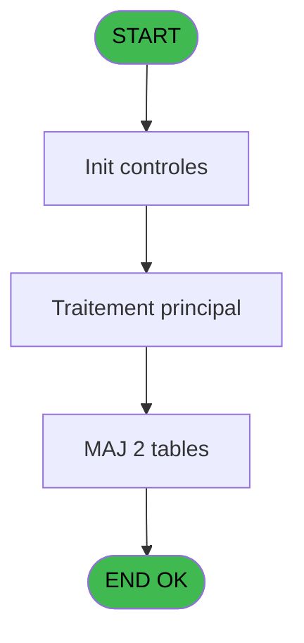
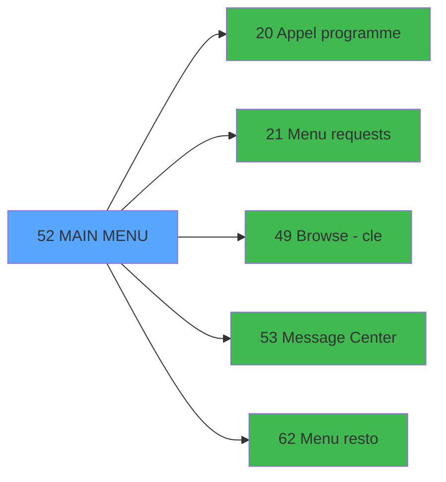

# REQ IDE 52 - MAIN MENU

> **Analyse**: Phases 1-4 2026-02-03 20:30 -> 20:30 (15s) | Assemblage 20:30
> **Pipeline**: V7.2 Enrichi
> **Structure**: 4 onglets (Resume | Ecrans | Donnees | Connexions)

<!-- TAB:Resume -->

## 1. FICHE D'IDENTITE

| Attribut | Valeur |
|----------|--------|
| Projet | REQ |
| IDE Position | 52 |
| Nom Programme | MAIN MENU |
| Fichier source | `Prg_52.xml` |
| Dossier IDE | Message |
| Taches | 5 (1 ecrans visibles) |
| Tables modifiees | 2 |
| Programmes appeles | 5 |

## 2. DESCRIPTION FONCTIONNELLE

**MAIN MENU** assure la gestion complete de ce processus, accessible depuis [Main Program (IDE 1)](REQ-IDE-1.md).

Le flux de traitement s'organise en **2 blocs fonctionnels** :

- **Traitement** (4 taches) : traitements metier divers
- **Initialisation** (1 tache) : reinitialisation d'etats et de variables de travail

**Donnees modifiees** : 2 tables en ecriture (reseau_cloture___rec, parametres___par).

Detail : phases du traitement

#### Phase 1 : Traitement (4 taches)

- **52** - Menu **[[ECRAN]](#ecran-t1)**
- **52.1** - Station eteinte anormalement
- **52.3** - Lecture paramètres PAR
- **52.4** - Station eteinte anormalement

Delegue a : [Appel programme (IDE 20)](REQ-IDE-20.md), [Menu requests (IDE 21)](REQ-IDE-21.md), [Browse - cle (IDE 49)](REQ-IDE-49.md), [Message Center (IDE 53)](REQ-IDE-53.md), [Menu resto (IDE 62)](REQ-IDE-62.md)

#### Phase 2 : Initialisation (1 tache)

- **52.2** - Initialisation

#### Tables impactees

| Table | Operations | Role metier |
|-------|-----------|-------------|
| reseau_cloture___rec | **W** (2 usages) | Donnees reseau/cloture |
| parametres___par | **W** (1 usages) |  |

## 3. BLOCS FONCTIONNELS

### 3.1 Traitement (4 taches)

Traitements internes.

---

#### 52 - Menu [[ECRAN]](#ecran-t1)

**Role** : Traitement : Menu.
**Ecran** : 875 x 209 DLU (MDI) | [Voir mockup](#ecran-t1)

3 sous-taches directes

| Tache | Nom | Bloc |
|-------|-----|------|
| [52.1](#t2) | Station eteinte anormalement | Traitement |
| [52.3](#t4) | Lecture paramètres PAR | Traitement |
| [52.4](#t7) | Station eteinte anormalement | Traitement |

**Delegue a** : [Appel programme (IDE 20)](REQ-IDE-20.md), [Menu requests (IDE 21)](REQ-IDE-21.md), [Browse - cle (IDE 49)](REQ-IDE-49.md)

---

#### 52.1 - Station eteinte anormalement

**Role** : Traitement : Station eteinte anormalement.
**Delegue a** : [Appel programme (IDE 20)](REQ-IDE-20.md), [Menu requests (IDE 21)](REQ-IDE-21.md), [Browse - cle (IDE 49)](REQ-IDE-49.md)

---

#### 52.3 - Lecture paramètres PAR

**Role** : Traitement : Lecture paramètres PAR.
**Delegue a** : [Appel programme (IDE 20)](REQ-IDE-20.md), [Menu requests (IDE 21)](REQ-IDE-21.md), [Browse - cle (IDE 49)](REQ-IDE-49.md)

---

#### 52.4 - Station eteinte anormalement

**Role** : Traitement : Station eteinte anormalement.
**Delegue a** : [Appel programme (IDE 20)](REQ-IDE-20.md), [Menu requests (IDE 21)](REQ-IDE-21.md), [Browse - cle (IDE 49)](REQ-IDE-49.md)

### 3.2 Initialisation (1 tache)

Reinitialisation d'etats et variables de travail.

---

#### 52.2 - Initialisation

**Role** : Reinitialisation : Initialisation.

## 5. REGLES METIER

*(Aucune regle metier identifiee)*

## 6. CONTEXTE

- **Appele par**: [Main Program (IDE 1)](REQ-IDE-1.md)
- **Appelle**: 5 programmes | **Tables**: 3 (W:2 R:1 L:0) | **Taches**: 5 | **Expressions**: 16

<!-- TAB:Ecrans -->

## 8. ECRANS

### 8.1 Forms visibles (1 / 5)

| # | Position | Tache | Nom | Type | Largeur | Hauteur | Bloc |
|---|----------|-------|-----|------|---------|---------|------|
| 1 | 52 | 52 | Menu | MDI | 875 | 209 | Traitement |

### 8.2 Mockups Ecrans

---

#### 52 - Menu
**Tache** : [52](#t1) | **Type** : MDI | **Dimensions** : 875 x 209 DLU
**Bloc** : Traitement | **Titre IDE** : Menu

<!-- FORM-DATA:
{
    "width":  875,
    "vFactor":  8,
    "type":  "MDI",
    "hFactor":  8,
    "controls":  [
                     {
                         "x":  0,
                         "type":  "label",
                         "var":  "",
                         "y":  0,
                         "w":  873,
                         "fmt":  "",
                         "name":  "",
                         "h":  21,
                         "color":  "",
                         "text":  "",
                         "parent":  null
                     },
                     {
                         "x":  253,
                         "type":  "label",
                         "var":  "",
                         "y":  51,
                         "w":  534,
                         "fmt":  "",
                         "name":  "",
                         "h":  120,
                         "color":  "",
                         "text":  "",
                         "parent":  null
                     },
                     {
                         "x":  270,
                         "type":  "label",
                         "var":  "",
                         "y":  58,
                         "w":  497,
                         "fmt":  "",
                         "name":  "",
                         "h":  91,
                         "color":  "",
                         "text":  "",
                         "parent":  6
                     },
                     {
                         "x":  318,
                         "type":  "label",
                         "var":  "",
                         "y":  58,
                         "w":  447,
                         "fmt":  "",
                         "name":  "",
                         "h":  90,
                         "color":  "6",
                         "text":  "",
                         "parent":  6
                     },
                     {
                         "x":  273,
                         "type":  "label",
                         "var":  "",
                         "y":  59,
                         "w":  45,
                         "fmt":  "",
                         "name":  "",
                         "h":  89,
                         "color":  "",
                         "text":  "",
                         "parent":  6
                     },
                     {
                         "x":  334,
                         "type":  "label",
                         "var":  "",
                         "y":  64,
                         "w":  373,
                         "fmt":  "",
                         "name":  "",
                         "h":  11,
                         "color":  "146",
                         "text":  "GM \u0026 GO requests",
                         "parent":  6
                     },
                     {
                         "x":  333,
                         "type":  "label",
                         "var":  "",
                         "y":  78,
                         "w":  373,
                         "fmt":  "",
                         "name":  "",
                         "h":  11,
                         "color":  "146",
                         "text":  "Restaurant",
                         "parent":  6
                     },
                     {
                         "x":  333,
                         "type":  "label",
                         "var":  "",
                         "y":  92,
                         "w":  373,
                         "fmt":  "",
                         "name":  "",
                         "h":  11,
                         "color":  "146",
                         "text":  "Lost \u0026 Found",
                         "parent":  6
                     },
                     {
                         "x":  333,
                         "type":  "label",
                         "var":  "",
                         "y":  106,
                         "w":  373,
                         "fmt":  "",
                         "name":  "",
                         "h":  11,
                         "color":  "146",
                         "text":  "Key code",
                         "parent":  6
                     },
                     {
                         "x":  333,
                         "type":  "label",
                         "var":  "",
                         "y":  119,
                         "w":  373,
                         "fmt":  "",
                         "name":  "",
                         "h":  11,
                         "color":  "146",
                         "text":  "Message center",
                         "parent":  6
                     },
                     {
                         "x":  442,
                         "type":  "label",
                         "var":  "",
                         "y":  155,
                         "w":  142,
                         "fmt":  "",
                         "name":  "",
                         "h":  10,
                         "color":  "",
                         "text":  "Your selection",
                         "parent":  6
                     },
                     {
                         "x":  0,
                         "type":  "label",
                         "var":  "",
                         "y":  191,
                         "w":  719,
                         "fmt":  "",
                         "name":  "",
                         "h":  18,
                         "color":  "",
                         "text":  "",
                         "parent":  null
                     },
                     {
                         "x":  595,
                         "type":  "edit",
                         "var":  "",
                         "y":  155,
                         "w":  26,
                         "fmt":  "",
                         "name":  "W0 choix action",
                         "h":  10,
                         "color":  "6",
                         "text":  "",
                         "parent":  6
                     },
                     {
                         "x":  3,
                         "type":  "image",
                         "var":  "",
                         "y":  2,
                         "w":  59,
                         "fmt":  "",
                         "name":  "",
                         "h":  18,
                         "color":  "",
                         "text":  "",
                         "parent":  null
                     },
                     {
                         "x":  77,
                         "type":  "edit",
                         "var":  "",
                         "y":  6,
                         "w":  480,
                         "fmt":  "40",
                         "name":  "",
                         "h":  8,
                         "color":  "",
                         "text":  "",
                         "parent":  null
                     },
                     {
                         "x":  596,
                         "type":  "edit",
                         "var":  "",
                         "y":  6,
                         "w":  268,
                         "fmt":  "WWW DD MMM YYYYT",
                         "name":  "",
                         "h":  8,
                         "color":  "",
                         "text":  "",
                         "parent":  null
                     },
                     {
                         "x":  0,
                         "type":  "image",
                         "var":  "",
                         "y":  22,
                         "w":  86,
                         "fmt":  "",
                         "name":  "",
                         "h":  34,
                         "color":  "",
                         "text":  "",
                         "parent":  null
                     },
                     {
                         "x":  282,
                         "type":  "button",
                         "var":  "",
                         "y":  64,
                         "w":  26,
                         "fmt":  "A",
                         "name":  "A",
                         "h":  11,
                         "color":  "",
                         "text":  "",
                         "parent":  null
                     },
                     {
                         "x":  282,
                         "type":  "button",
                         "var":  "",
                         "y":  78,
                         "w":  26,
                         "fmt":  "B",
                         "name":  "B",
                         "h":  11,
                         "color":  "",
                         "text":  "",
                         "parent":  null
                     },
                     {
                         "x":  282,
                         "type":  "button",
                         "var":  "",
                         "y":  92,
                         "w":  26,
                         "fmt":  "C",
                         "name":  "C",
                         "h":  11,
                         "color":  "",
                         "text":  "",
                         "parent":  null
                     },
                     {
                         "x":  13,
                         "type":  "image",
                         "var":  "",
                         "y":  97,
                         "w":  192,
                         "fmt":  "",
                         "name":  "",
                         "h":  51,
                         "color":  "",
                         "text":  "",
                         "parent":  null
                     },
                     {
                         "x":  282,
                         "type":  "button",
                         "var":  "",
                         "y":  106,
                         "w":  26,
                         "fmt":  "D",
                         "name":  "D",
                         "h":  11,
                         "color":  "",
                         "text":  "",
                         "parent":  null
                     },
                     {
                         "x":  282,
                         "type":  "button",
                         "var":  "",
                         "y":  119,
                         "w":  26,
                         "fmt":  "E",
                         "name":  "E",
                         "h":  11,
                         "color":  "",
                         "text":  "",
                         "parent":  null
                     },
                     {
                         "x":  718,
                         "type":  "button",
                         "var":  "",
                         "y":  191,
                         "w":  156,
                         "fmt":  "\u0026Exit",
                         "name":  "\u0026Quitter",
                         "h":  18,
                         "color":  "",
                         "text":  "",
                         "parent":  null
                     }
                 ],
    "taskId":  "52",
    "height":  209
}
-->

<strong>Champs : 3 champs</strong>

| Pos (x,y) | Nom | Variable | Type |
|-----------|-----|----------|------|
| 595,155 | W0 choix action | - | edit |
| 77,6 | 40 | - | edit |
| 596,6 | WWW DD MMM YYYYT | - | edit |

<strong>Boutons : 6 boutons</strong>

| Bouton | Pos (x,y) | Action |
|--------|-----------|--------|
| A | 282,64 | Bouton fonctionnel |
| B | 282,78 | Bouton fonctionnel |
| C | 282,92 | Bouton fonctionnel |
| D | 282,106 | Bouton fonctionnel |
| E | 282,119 | Bouton fonctionnel |
| Exit | 718,191 | Quitte le programme |

## 9. NAVIGATION

Ecran unique: **Menu**

### 9.3 Structure hierarchique (5 taches)

| Position | Tache | Type | Dimensions | Bloc |
|----------|-------|------|------------|------|
| **52.1** | [**Menu** (52)](#t1) [mockup](#ecran-t1) | MDI | 875x209 | Traitement |
| 52.1.1 | [Station eteinte anormalement (52.1)](#t2) | MDI | - | |
| 52.1.2 | [Lecture paramètres PAR (52.3)](#t4) | MDI | - | |
| 52.1.3 | [Station eteinte anormalement (52.4)](#t7) | MDI | - | |
| **52.2** | [**Initialisation** (52.2)](#t3) | MDI | - | Initialisation |

### 9.4 Algorigramme

> **Legende**: Vert = START/END OK | Rouge = END KO | Bleu = Decisions
> *Algorigramme auto-genere. Utiliser `/algorigramme` pour une synthese metier detaillee.*

<!-- TAB:Donnees -->

## 10. TABLES

### Tables utilisees (3)

| ID | Nom | Description | Type | R | W | L | Usages |
|----|-----|-------------|------|---|---|---|--------|
| 23 | reseau_cloture___rec | Donnees reseau/cloture | DB |   | **W** |   | 2 |
| 63 | parametres___par |  | DB |   | **W** |   | 1 |
| 69 | initialisation___ini |  | DB | R |   |   | 1 |

### Colonnes par table (0 / 3 tables avec colonnes identifiees)

Table 23 - reseau_cloture___rec (**W**) - 2 usages

*Table utilisee uniquement en Link ou aucune colonne Real identifiee dans le DataView.*

Table 63 - parametres___par (**W**) - 1 usages

*Table utilisee uniquement en Link ou aucune colonne Real identifiee dans le DataView.*

Table 69 - initialisation___ini (R) - 1 usages

*Table utilisee uniquement en Link ou aucune colonne Real identifiee dans le DataView.*

## 11. VARIABLES

### 11.1 Parametres entrants (1)

Variables recues du programme appelant ([Main Program (IDE 1)](REQ-IDE-1.md)).

| Lettre | Nom | Type | Usage dans |
|--------|-----|------|-----------|
| A | P0 societe | Alpha | - |

### 11.2 Variables de travail (13)

Variables internes au programme.

| Lettre | Nom | Type | Usage dans |
|--------|-----|------|-----------|
| B | W0 village CAM | Alpha | - |
| C | W0 village TEL | Alpha | - |
| D | W0 village BIBOP | Alpha | - |
| E | W0 nb decimales | Numeric | - |
| F | W0 devise locale | Alpha | - |
| G | W0 code village | Alpha | - |
| H | W0 nom village | Alpha | - |
| I | W0 masque montant | Alpha | - |
| J | W0 choix action | Alpha | 4x calcul interne |
| K | W0 utilisation caiss | Alpha | - |
| L | W0 utilisation bouti | Alpha | - |
| M | W0 village PME | Alpha | - |
| N | W0 fin tache | Alpha | 1x calcul interne |

## 12. EXPRESSIONS

**16 / 16 expressions decodees (100%)**

### 12.1 Repartition par type

| Type | Expressions | Regles |
|------|-------------|--------|
| CONSTANTE | 2 | 0 |
| DATE | 1 | 0 |
| CAST_LOGIQUE | 1 | 0 |
| CONDITION | 5 | 0 |
| REFERENCE_VG | 5 | 0 |
| NEGATION | 1 | 0 |
| CONCATENATION | 1 | 0 |

### 12.2 Expressions cles par type

#### CONSTANTE (2 expressions)

| Type | IDE | Expression | Regle |
|------|-----|------------|-------|
| CONSTANTE | 10 | `''` | - |
| CONSTANTE | 4 | `'C'` | - |

#### DATE (1 expressions)

| Type | IDE | Expression | Regle |
|------|-----|------------|-------|
| DATE | 2 | `Date ()` | - |

#### CAST_LOGIQUE (1 expressions)

| Type | IDE | Expression | Regle |
|------|-----|------------|-------|
| CAST_LOGIQUE | 1 | `'FALSE'LOG` | - |

#### CONDITION (5 expressions)

| Type | IDE | Expression | Regle |
|------|-----|------------|-------|
| CONDITION | 8 | `W0 choix action [J]='D' AND VG14` | - |
| CONDITION | 9 | `W0 choix action [J]='E' AND VG15` | - |
| CONDITION | 7 | `W0 choix action [J]='B' AND VG13` | - |
| CONDITION | 5 | `W0 fin tache [N]='F'` | - |
| CONDITION | 6 | `W0 choix action [J]='A' AND VG5` | - |

#### REFERENCE_VG (5 expressions)

| Type | IDE | Expression | Regle |
|------|-----|------------|-------|
| REFERENCE_VG | 14 | `VG15` | - |
| REFERENCE_VG | 16 | `VG19` | - |
| REFERENCE_VG | 13 | `VG14` | - |
| REFERENCE_VG | 11 | `VG13` | - |
| REFERENCE_VG | 12 | `VG12` | - |

#### NEGATION (1 expressions)

| Type | IDE | Expression | Regle |
|------|-----|------------|-------|
| NEGATION | 15 | `NOT VG19` | - |

#### CONCATENATION (1 expressions)

| Type | IDE | Expression | Regle |
|------|-----|------------|-------|
| CONCATENATION | 3 | `VG2&' '&'('&Trim (Str (VG20,'3'))&') '` | - |

<!-- TAB:Connexions -->

## 13. GRAPHE D'APPELS

### 13.1 Chaine depuis Main (Callers)

Main -> ... -> [Main Program (IDE 1)](REQ-IDE-1.md) -> **MAIN MENU (IDE 52)**

### 13.2 Callers

| IDE | Nom Programme | Nb Appels |
|-----|---------------|-----------|
| [1](REQ-IDE-1.md) | Main Program | 1 |

### 13.3 Callees (programmes appeles)

### 13.4 Detail Callees avec contexte

| IDE | Nom Programme | Appels | Contexte |
|-----|---------------|--------|----------|
| [20](REQ-IDE-20.md) | Appel programme | 1 | Sous-programme |
| [21](REQ-IDE-21.md) | Menu requests | 1 | Navigation menu |
| [49](REQ-IDE-49.md) | Browse - cle | 1 | Sous-programme |
| [53](REQ-IDE-53.md) | Message Center | 1 | Sous-programme |
| [62](REQ-IDE-62.md) | Menu resto | 1 | Navigation menu |

## 14. RECOMMANDATIONS MIGRATION

### 14.1 Profil du programme

| Metrique | Valeur | Impact migration |
|----------|--------|-----------------|
| Lignes de logique | 88 | Programme compact |
| Expressions | 16 | Peu de logique |
| Tables WRITE | 2 | Impact faible |
| Sous-programmes | 5 | Peu de dependances |
| Ecrans visibles | 1 | Ecran unique ou traitement batch |
| Code desactive | 0% (0 / 88) | Code sain |
| Regles metier | 0 | Pas de regle identifiee |

### 14.2 Plan de migration par bloc

#### Traitement (4 taches: 1 ecran, 3 traitements)

- **Strategie** : Orchestrateur avec 1 ecrans (Razor/React) et 3 traitements backend (services).
- Les ecrans deviennent des composants UI, les traitements invisibles deviennent des services injectables.
- 5 sous-programme(s) a migrer ou a reutiliser depuis les services existants.
- Decomposer les taches en services unitaires testables.

#### Initialisation (1 tache: 0 ecran, 1 traitement)

- **Strategie** : Constructeur/methode `InitAsync()` dans l'orchestrateur.

### 14.3 Dependances critiques

| Dependance | Type | Appels | Impact |
|------------|------|--------|--------|
| reseau_cloture___rec | Table WRITE (Database) | 2x | Schema + repository |
| parametres___par | Table WRITE (Database) | 1x | Schema + repository |
| [Message Center (IDE 53)](REQ-IDE-53.md) | Sous-programme | 1x | Normale - Sous-programme |
| [Menu resto (IDE 62)](REQ-IDE-62.md) | Sous-programme | 1x | Normale - Navigation menu |
| [Browse - cle (IDE 49)](REQ-IDE-49.md) | Sous-programme | 1x | Normale - Sous-programme |
| [Appel programme (IDE 20)](REQ-IDE-20.md) | Sous-programme | 1x | Normale - Sous-programme |
| [Menu requests (IDE 21)](REQ-IDE-21.md) | Sous-programme | 1x | Normale - Navigation menu |

---
*Spec DETAILED generee par Pipeline V7.2 - 2026-02-03 20:30*
