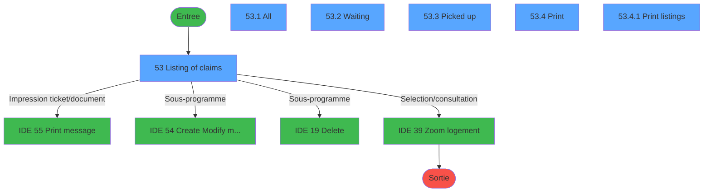
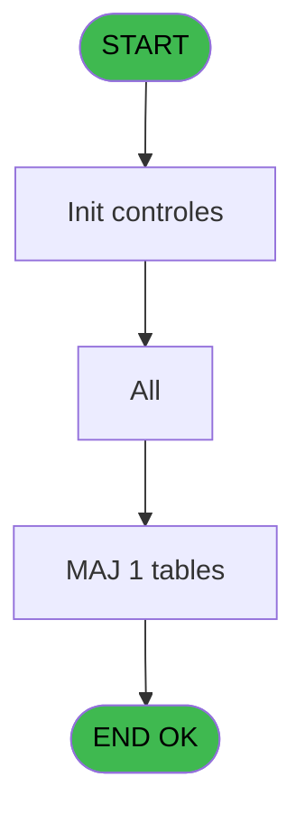
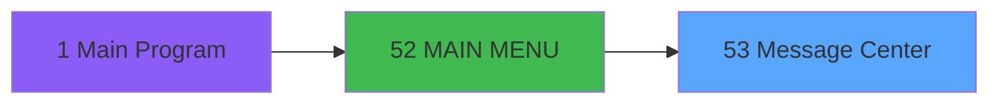
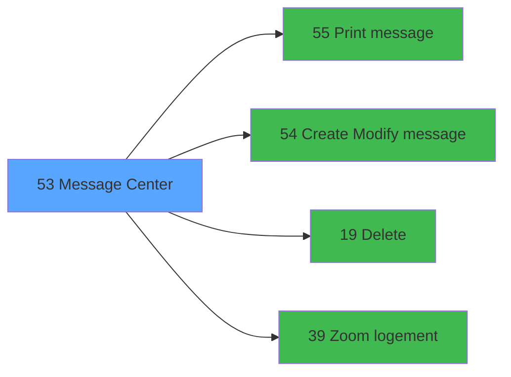

# REQ IDE 53 - Message Center

> **Analyse**: Phases 1-4 2026-02-03 20:30 -> 20:30 (15s) | Assemblage 20:30
> **Pipeline**: V7.2 Enrichi
> **Structure**: 4 onglets (Resume | Ecrans | Donnees | Connexions)

<!-- TAB:Resume -->

## 1. FICHE D'IDENTITE

| Attribut | Valeur |
|----------|--------|
| Projet | REQ |
| IDE Position | 53 |
| Nom Programme | Message Center |
| Fichier source | `Prg_53.xml` |
| Dossier IDE | Message |
| Taches | 10 (6 ecrans visibles) |
| Tables modifiees | 1 |
| Programmes appeles | 4 |

## 2. DESCRIPTION FONCTIONNELLE

**Message Center** assure la gestion complete de ce processus, accessible depuis [MAIN MENU (IDE 52)](REQ-IDE-52.md).

Le flux de traitement s'organise en **2 blocs fonctionnels** :

- **Traitement** (8 taches) : traitements metier divers
- **Impression** (2 taches) : generation de tickets et documents

**Donnees modifiees** : 1 tables en ecriture (mod).

Detail : phases du traitement

#### Phase 1 : Traitement (8 taches)

- **53** - Listing of claims **[[ECRAN]](#ecran-t1)**
- **53.1** - All **[[ECRAN]](#ecran-t2)**
- **53.1.1** - change stauts
- **53.2** - Waiting **[[ECRAN]](#ecran-t4)**
- **53.2.1** - change stauts
- **53.3** - Picked up **[[ECRAN]](#ecran-t6)**
- **53.5** - Count
- **53.6** - clear filter

Delegue a : [Delete (IDE 19)](REQ-IDE-19.md)

#### Phase 2 : Impression (2 taches)

- **53.4** - Print **[[ECRAN]](#ecran-t7)**
- **53.4.1** - Print listings **[[ECRAN]](#ecran-t8)**

Delegue a : [Print message (IDE 55)](REQ-IDE-55.md)

#### Tables impactees

| Table | Operations | Role metier |
|-------|-----------|-------------|
| mod | **W** (7 usages) |  |

## 3. BLOCS FONCTIONNELS

### 3.1 Traitement (8 taches)

Traitements internes.

---

#### 53 - Listing of claims [[ECRAN]](#ecran-t1)

**Role** : Tache d'orchestration : point d'entree du programme (8 sous-taches). Coordonne l'enchainement des traitements.
**Ecran** : 596 x 272 DLU (MDI) | [Voir mockup](#ecran-t1)

7 sous-taches directes

| Tache | Nom | Bloc |
|-------|-----|------|
| [53.1](#t2) | All **[[ECRAN]](#ecran-t2)** | Traitement |
| [53.1.1](#t3) | change stauts | Traitement |
| [53.2](#t4) | Waiting **[[ECRAN]](#ecran-t4)** | Traitement |
| [53.2.1](#t5) | change stauts | Traitement |
| [53.3](#t6) | Picked up **[[ECRAN]](#ecran-t6)** | Traitement |
| [53.5](#t9) | Count | Traitement |
| [53.6](#t10) | clear filter | Traitement |

**Delegue a** : [Delete (IDE 19)](REQ-IDE-19.md)

---

#### 53.1 - All [[ECRAN]](#ecran-t2)

**Role** : Traitement interne.
**Ecran** : 587 x 168 DLU (Modal) | [Voir mockup](#ecran-t2)

---

#### 53.1.1 - change stauts

**Role** : Traitement : change stauts.
**Delegue a** : [Delete (IDE 19)](REQ-IDE-19.md)

---

#### 53.2 - Waiting [[ECRAN]](#ecran-t4)

**Role** : Traitement : Waiting.
**Ecran** : 588 x 168 DLU (Modal) | [Voir mockup](#ecran-t4)
**Delegue a** : [Delete (IDE 19)](REQ-IDE-19.md)

---

#### 53.2.1 - change stauts

**Role** : Traitement : change stauts.
**Delegue a** : [Delete (IDE 19)](REQ-IDE-19.md)

---

#### 53.3 - Picked up [[ECRAN]](#ecran-t6)

**Role** : Traitement : Picked up.
**Ecran** : 587 x 168 DLU (Modal) | [Voir mockup](#ecran-t6)
**Delegue a** : [Delete (IDE 19)](REQ-IDE-19.md)

---

#### 53.5 - Count

**Role** : Traitement : Count.
**Delegue a** : [Delete (IDE 19)](REQ-IDE-19.md)

---

#### 53.6 - clear filter

**Role** : Traitement : clear filter.
**Delegue a** : [Delete (IDE 19)](REQ-IDE-19.md)

### 3.2 Impression (2 taches)

Generation des documents et tickets.

---

#### 53.4 - Print [[ECRAN]](#ecran-t7)

**Role** : Generation du document : Print.
**Ecran** : 308 x 126 DLU (MDI) | [Voir mockup](#ecran-t7)
**Delegue a** : [Print message (IDE 55)](REQ-IDE-55.md)

---

#### 53.4.1 - Print listings [[ECRAN]](#ecran-t8)

**Role** : Generation du document : Print listings.
**Ecran** : 191 x 54 DLU (MDI) | [Voir mockup](#ecran-t8)
**Delegue a** : [Print message (IDE 55)](REQ-IDE-55.md)

## 5. REGLES METIER

*(Aucune regle metier identifiee)*

## 6. CONTEXTE

- **Appele par**: [MAIN MENU (IDE 52)](REQ-IDE-52.md)
- **Appelle**: 4 programmes | **Tables**: 1 (W:1 R:0 L:0) | **Taches**: 10 | **Expressions**: 15

<!-- TAB:Ecrans -->

## 8. ECRANS

### 8.1 Forms visibles (6 / 10)

| # | Position | Tache | Nom | Type | Largeur | Hauteur | Bloc |
|---|----------|-------|-----|------|---------|---------|------|
| 1 | 53 | 53 | Listing of claims | MDI | 596 | 272 | Traitement |
| 2 | 53.1 | 53.1 | All | Modal | 587 | 168 | Traitement |
| 3 | 53.2 | 53.2 | Waiting | Modal | 588 | 168 | Traitement |
| 4 | 53.3 | 53.3 | Picked up | Modal | 587 | 168 | Traitement |
| 5 | 53.4 | 53.4 | Print | MDI | 308 | 126 | Impression |
| 6 | 53.4.1 | 53.4.1 | Print listings | MDI | 191 | 54 | Impression |

### 8.2 Mockups Ecrans

---

#### 53 - Listing of claims
**Tache** : [53](#t1) | **Type** : MDI | **Dimensions** : 596 x 272 DLU
**Bloc** : Traitement | **Titre IDE** : Listing of claims

<!-- FORM-DATA:
{
    "width":  596,
    "vFactor":  8,
    "type":  "MDI",
    "hFactor":  4,
    "controls":  [
                     {
                         "x":  2,
                         "type":  "label",
                         "var":  "",
                         "y":  254,
                         "w":  333,
                         "fmt":  "",
                         "name":  "",
                         "h":  15,
                         "color":  "148",
                         "text":  "MESSAGE CENTER",
                         "parent":  1
                     },
                     {
                         "x":  162,
                         "type":  "line",
                         "var":  "",
                         "y":  22,
                         "w":  0,
                         "fmt":  "",
                         "name":  "",
                         "h":  48,
                         "color":  "",
                         "text":  "",
                         "parent":  1
                     },
                     {
                         "x":  543,
                         "type":  "line",
                         "var":  "",
                         "y":  22,
                         "w":  0,
                         "fmt":  "",
                         "name":  "",
                         "h":  48,
                         "color":  "",
                         "text":  "",
                         "parent":  1
                     },
                     {
                         "x":  7,
                         "type":  "label",
                         "var":  "",
                         "y":  29,
                         "w":  22,
                         "fmt":  "",
                         "name":  "",
                         "h":  12,
                         "color":  "1",
                         "text":  "From",
                         "parent":  1
                     },
                     {
                         "x":  188,
                         "type":  "label",
                         "var":  "",
                         "y":  32,
                         "w":  29,
                         "fmt":  "",
                         "name":  "",
                         "h":  12,
                         "color":  "",
                         "text":  "Room",
                         "parent":  1
                     },
                     {
                         "x":  286,
                         "type":  "label",
                         "var":  "",
                         "y":  32,
                         "w":  69,
                         "fmt":  "",
                         "name":  "",
                         "h":  12,
                         "color":  "",
                         "text":  "Type of message",
                         "parent":  1
                     },
                     {
                         "x":  7,
                         "type":  "label",
                         "var":  "",
                         "y":  48,
                         "w":  16,
                         "fmt":  "",
                         "name":  "",
                         "h":  12,
                         "color":  "",
                         "text":  "To",
                         "parent":  1
                     },
                     {
                         "x":  29,
                         "type":  "edit",
                         "var":  "",
                         "y":  29,
                         "w":  55,
                         "fmt":  "##/##/####A",
                         "name":  "F.date from",
                         "h":  12,
                         "color":  "110",
                         "text":  "",
                         "parent":  1
                     },
                     {
                         "x":  29,
                         "type":  "edit",
                         "var":  "",
                         "y":  48,
                         "w":  55,
                         "fmt":  "##/##/####A",
                         "name":  "F.date to",
                         "h":  12,
                         "color":  "110",
                         "text":  "",
                         "parent":  1
                     },
                     {
                         "x":  286,
                         "type":  "combobox",
                         "var":  "",
                         "y":  45,
                         "w":  99,
                         "fmt":  "",
                         "name":  "F.type",
                         "h":  12,
                         "color":  "110",
                         "text":  "Fax,Telephone,Mail \\- Email \\- Parcel",
                         "parent":  null
                     },
                     {
                         "x":  0,
                         "type":  "tab",
                         "var":  "",
                         "y":  0,
                         "w":  594,
                         "fmt":  "",
                         "name":  "v.tab control",
                         "h":  250,
                         "color":  "",
                         "text":  "",
                         "parent":  null
                     },
                     {
                         "x":  334,
                         "type":  "image",
                         "var":  "",
                         "y":  254,
                         "w":  20,
                         "fmt":  "",
                         "name":  "",
                         "h":  15,
                         "color":  "",
                         "text":  "",
                         "parent":  1
                     },
                     {
                         "x":  107,
                         "type":  "button",
                         "var":  "",
                         "y":  25,
                         "w":  51,
                         "fmt":  "This Month",
                         "name":  "MONTH",
                         "h":  10,
                         "color":  "",
                         "text":  "",
                         "parent":  null
                     },
                     {
                         "x":  84,
                         "type":  "button",
                         "var":  "",
                         "y":  27,
                         "w":  21,
                         "fmt":  "",
                         "name":  "DATEFROM",
                         "h":  16,
                         "color":  "",
                         "text":  "",
                         "parent":  null
                     },
                     {
                         "x":  496,
                         "type":  "button",
                         "var":  "",
                         "y":  31,
                         "w":  21,
                         "fmt":  "",
                         "name":  "",
                         "h":  16,
                         "color":  "",
                         "text":  "",
                         "parent":  null
                     },
                     {
                         "x":  565,
                         "type":  "button",
                         "var":  "",
                         "y":  31,
                         "w":  20,
                         "fmt":  "",
                         "name":  "COUNT",
                         "h":  16,
                         "color":  "",
                         "text":  "",
                         "parent":  null
                     },
                     {
                         "x":  107,
                         "type":  "button",
                         "var":  "",
                         "y":  40,
                         "w":  51,
                         "fmt":  "This Week",
                         "name":  "WEEK",
                         "h":  10,
                         "color":  "",
                         "text":  "",
                         "parent":  null
                     },
                     {
                         "x":  188,
                         "type":  "edit",
                         "var":  "",
                         "y":  45,
                         "w":  38,
                         "fmt":  "30",
                         "name":  "",
                         "h":  15,
                         "color":  "110",
                         "text":  "",
                         "parent":  1
                     },
                     {
                         "x":  227,
                         "type":  "button",
                         "var":  "",
                         "y":  45,
                         "w":  20,
                         "fmt":  "",
                         "name":  "",
                         "h":  15,
                         "color":  "",
                         "text":  "",
                         "parent":  null
                     },
                     {
                         "x":  496,
                         "type":  "button",
                         "var":  "",
                         "y":  46,
                         "w":  21,
                         "fmt":  "",
                         "name":  "CLEAR",
                         "h":  16,
                         "color":  "",
                         "text":  "",
                         "parent":  null
                     },
                     {
                         "x":  565,
                         "type":  "button",
                         "var":  "",
                         "y":  46,
                         "w":  20,
                         "fmt":  "",
                         "name":  "PRINT",
                         "h":  16,
                         "color":  "",
                         "text":  "",
                         "parent":  null
                     },
                     {
                         "x":  84,
                         "type":  "button",
                         "var":  "",
                         "y":  47,
                         "w":  21,
                         "fmt":  "",
                         "name":  "DATETO",
                         "h":  16,
                         "color":  "",
                         "text":  "",
                         "parent":  null
                     },
                     {
                         "x":  107,
                         "type":  "button",
                         "var":  "",
                         "y":  54,
                         "w":  51,
                         "fmt":  "Today",
                         "name":  "TODAY",
                         "h":  10,
                         "color":  "",
                         "text":  "",
                         "parent":  null
                     },
                     {
                         "x":  355,
                         "type":  "button",
                         "var":  "",
                         "y":  253,
                         "w":  117,
                         "fmt":  "\u0026Log a new message",
                         "name":  "NEW",
                         "h":  18,
                         "color":  "",
                         "text":  "",
                         "parent":  null
                     },
                     {
                         "x":  476,
                         "type":  "button",
                         "var":  "",
                         "y":  253,
                         "w":  117,
                         "fmt":  "\u0026Exit",
                         "name":  "",
                         "h":  18,
                         "color":  "",
                         "text":  "",
                         "parent":  null
                     },
                     {
                         "x":  2,
                         "type":  "subform",
                         "var":  "",
                         "y":  71,
                         "w":  590,
                         "fmt":  "",
                         "name":  "A",
                         "h":  176,
                         "color":  "",
                         "text":  "",
                         "parent":  1
                     },
                     {
                         "x":  2,
                         "type":  "subform",
                         "var":  "",
                         "y":  71,
                         "w":  590,
                         "fmt":  "",
                         "name":  "W",
                         "h":  176,
                         "color":  "",
                         "text":  "",
                         "parent":  1
                     },
                     {
                         "x":  1,
                         "type":  "subform",
                         "var":  "",
                         "y":  71,
                         "w":  590,
                         "fmt":  "",
                         "name":  "P",
                         "h":  176,
                         "color":  "",
                         "text":  "",
                         "parent":  1
                     }
                 ],
    "taskId":  "53",
    "height":  272
}
-->

<strong>Champs : 4 champs</strong>

| Pos (x,y) | Nom | Variable | Type |
|-----------|-----|----------|------|
| 29,29 | F.date from | - | edit |
| 29,48 | F.date to | - | edit |
| 286,45 | F.type | - | combobox |
| 188,45 | 30 | - | edit |

<strong>Boutons : 12 boutons</strong>

| Bouton | Pos (x,y) | Action |
|--------|-----------|--------|
| This Month | 107,25 | Bouton fonctionnel |
| DATEFROM | 84,27 | Bouton fonctionnel |
| (sans nom) | 496,31 | Action declenchee |
| COUNT | 565,31 | Bouton fonctionnel |
| This Week | 107,40 | Bouton fonctionnel |
| (sans nom) | 227,45 | Action declenchee |
| CLEAR | 496,46 | Bouton fonctionnel |
| PRINT | 565,46 | Appel [Print message (IDE 55)](REQ-IDE-55.md) |
| DATETO | 84,47 | Bouton fonctionnel |
| Today | 107,54 | Bouton fonctionnel |
| Log a new message | 355,253 | Bouton fonctionnel |
| Exit | 476,253 | Quitte le programme |

---

#### 53.1 - All
**Tache** : [53.1](#t2) | **Type** : Modal | **Dimensions** : 587 x 168 DLU
**Bloc** : Traitement | **Titre IDE** : All

<!-- FORM-DATA:
{
    "width":  587,
    "vFactor":  8,
    "type":  "Modal",
    "hFactor":  4,
    "controls":  [
                     {
                         "x":  1,
                         "type":  "label",
                         "var":  "",
                         "y":  1,
                         "w":  142,
                         "fmt":  "",
                         "name":  "",
                         "h":  12,
                         "color":  "148",
                         "text":  "Received",
                         "parent":  null
                     },
                     {
                         "x":  145,
                         "type":  "label",
                         "var":  "",
                         "y":  1,
                         "w":  228,
                         "fmt":  "",
                         "name":  "",
                         "h":  12,
                         "color":  "148",
                         "text":  "Messages",
                         "parent":  null
                     },
                     {
                         "x":  374,
                         "type":  "label",
                         "var":  "",
                         "y":  1,
                         "w":  194,
                         "fmt":  "",
                         "name":  "",
                         "h":  12,
                         "color":  "148",
                         "text":  "Picked up",
                         "parent":  null
                     },
                     {
                         "x":  1,
                         "type":  "table",
                         "var":  "",
                         "name":  "",
                         "titleH":  13,
                         "color":  "110",
                         "w":  572,
                         "y":  12,
                         "fmt":  "",
                         "parent":  null,
                         "text":  "",
                         "rowH":  17,
                         "h":  143,
                         "cols":  [
                                      {
                                          "title":  "Date",
                                          "layer":  1,
                                          "w":  52
                                      },
                                      {
                                          "title":  "Time",
                                          "layer":  2,
                                          "w":  34
                                      },
                                      {
                                          "title":  "User",
                                          "layer":  3,
                                          "w":  58
                                      },
                                      {
                                          "title":  "Room",
                                          "layer":  4,
                                          "w":  34
                                      },
                                      {
                                          "title":  "Message for",
                                          "layer":  5,
                                          "w":  122
                                      },
                                      {
                                          "title":  "Type",
                                          "layer":  6,
                                          "w":  74
                                      },
                                      {
                                          "title":  "Status",
                                          "layer":  7,
                                          "w":  48
                                      },
                                      {
                                          "title":  "Date",
                                          "layer":  8,
                                          "w":  53
                                      },
                                      {
                                          "title":  "Time",
                                          "layer":  9,
                                          "w":  34
                                      },
                                      {
                                          "title":  "User",
                                          "layer":  10,
                                          "w":  59
                                      }
                                  ],
                         "rows":  10
                     },
                     {
                         "x":  6,
                         "type":  "label",
                         "var":  "",
                         "y":  156,
                         "w":  84,
                         "fmt":  "",
                         "name":  "",
                         "h":  11,
                         "color":  "",
                         "text":  "Message number :",
                         "parent":  null
                     },
                     {
                         "x":  93,
                         "type":  "edit",
                         "var":  "",
                         "y":  156,
                         "w":  51,
                         "fmt":  "",
                         "name":  "",
                         "h":  11,
                         "color":  "",
                         "text":  "",
                         "parent":  null
                     },
                     {
                         "x":  147,
                         "type":  "edit",
                         "var":  "",
                         "y":  27,
                         "w":  32,
                         "fmt":  "",
                         "name":  "",
                         "h":  14,
                         "color":  "110",
                         "text":  "",
                         "parent":  4
                     },
                     {
                         "x":  183,
                         "type":  "edit",
                         "var":  "",
                         "y":  27,
                         "w":  117,
                         "fmt":  "",
                         "name":  "",
                         "h":  14,
                         "color":  "110",
                         "text":  "",
                         "parent":  4
                     },
                     {
                         "x":  4,
                         "type":  "edit",
                         "var":  "",
                         "y":  27,
                         "w":  47,
                         "fmt":  "",
                         "name":  "",
                         "h":  14,
                         "color":  "110",
                         "text":  "",
                         "parent":  4
                     },
                     {
                         "x":  57,
                         "type":  "edit",
                         "var":  "",
                         "y":  27,
                         "w":  29,
                         "fmt":  "",
                         "name":  "",
                         "h":  14,
                         "color":  "110",
                         "text":  "",
                         "parent":  4
                     },
                     {
                         "x":  89,
                         "type":  "edit",
                         "var":  "",
                         "y":  27,
                         "w":  55,
                         "fmt":  "",
                         "name":  "",
                         "h":  14,
                         "color":  "110",
                         "text":  "",
                         "parent":  4
                     },
                     {
                         "x":  427,
                         "type":  "edit",
                         "var":  "",
                         "y":  27,
                         "w":  47,
                         "fmt":  "",
                         "name":  "",
                         "h":  14,
                         "color":  "110",
                         "text":  "",
                         "parent":  4
                     },
                     {
                         "x":  480,
                         "type":  "edit",
                         "var":  "",
                         "y":  27,
                         "w":  30,
                         "fmt":  "",
                         "name":  "",
                         "h":  14,
                         "color":  "110",
                         "text":  "",
                         "parent":  4
                     },
                     {
                         "x":  512,
                         "type":  "edit",
                         "var":  "",
                         "y":  27,
                         "w":  57,
                         "fmt":  "",
                         "name":  "",
                         "h":  14,
                         "color":  "110",
                         "text":  "",
                         "parent":  4
                     },
                     {
                         "x":  380,
                         "type":  "button",
                         "var":  "",
                         "y":  26,
                         "w":  42,
                         "fmt":  "þ",
                         "name":  "",
                         "h":  14,
                         "color":  "",
                         "text":  "",
                         "parent":  4
                     },
                     {
                         "x":  303,
                         "type":  "edit",
                         "var":  "",
                         "y":  27,
                         "w":  72,
                         "fmt":  "30",
                         "name":  "",
                         "h":  14,
                         "color":  "110",
                         "text":  "",
                         "parent":  4
                     }
                 ],
    "taskId":  "53.1",
    "height":  168
}
-->

<strong>Champs : 10 champs</strong>

| Pos (x,y) | Nom | Variable | Type |
|-----------|-----|----------|------|
| 93,156 | (sans nom) | - | edit |
| 147,27 | (sans nom) | - | edit |
| 183,27 | (sans nom) | - | edit |
| 4,27 | (sans nom) | - | edit |
| 57,27 | (sans nom) | - | edit |
| 89,27 | (sans nom) | - | edit |
| 427,27 | (sans nom) | - | edit |
| 480,27 | (sans nom) | - | edit |
| 512,27 | (sans nom) | - | edit |
| 303,27 | 30 | - | edit |

<strong>Boutons : 1 boutons</strong>

| Bouton | Pos (x,y) | Action |
|--------|-----------|--------|
| þ | 380,26 | Bouton fonctionnel |

---

#### 53.2 - Waiting
**Tache** : [53.2](#t4) | **Type** : Modal | **Dimensions** : 588 x 168 DLU
**Bloc** : Traitement | **Titre IDE** : Waiting

<!-- FORM-DATA:
{
    "width":  588,
    "vFactor":  8,
    "type":  "Modal",
    "hFactor":  4,
    "controls":  [
                     {
                         "x":  1,
                         "type":  "label",
                         "var":  "",
                         "y":  1,
                         "w":  142,
                         "fmt":  "",
                         "name":  "",
                         "h":  12,
                         "color":  "148",
                         "text":  "Received",
                         "parent":  null
                     },
                     {
                         "x":  145,
                         "type":  "label",
                         "var":  "",
                         "y":  1,
                         "w":  244,
                         "fmt":  "",
                         "name":  "",
                         "h":  12,
                         "color":  "148",
                         "text":  "Messages",
                         "parent":  null
                     },
                     {
                         "x":  390,
                         "type":  "label",
                         "var":  "",
                         "y":  1,
                         "w":  196,
                         "fmt":  "",
                         "name":  "",
                         "h":  12,
                         "color":  "148",
                         "text":  "Not picked up yet",
                         "parent":  null
                     },
                     {
                         "x":  0,
                         "type":  "table",
                         "var":  "",
                         "name":  "",
                         "titleH":  13,
                         "color":  "110",
                         "w":  588,
                         "y":  12,
                         "fmt":  "",
                         "parent":  null,
                         "text":  "",
                         "rowH":  17,
                         "h":  154,
                         "cols":  [
                                      {
                                          "title":  "Date",
                                          "layer":  1,
                                          "w":  54
                                      },
                                      {
                                          "title":  "Time",
                                          "layer":  2,
                                          "w":  32
                                      },
                                      {
                                          "title":  "User",
                                          "layer":  3,
                                          "w":  62
                                      },
                                      {
                                          "title":  "Room",
                                          "layer":  4,
                                          "w":  29
                                      },
                                      {
                                          "title":  "Message for",
                                          "layer":  5,
                                          "w":  119
                                      },
                                      {
                                          "title":  "Type",
                                          "layer":  6,
                                          "w":  93
                                      },
                                      {
                                          "title":  "Status",
                                          "layer":  7,
                                          "w":  194
                                      }
                                  ],
                         "rows":  7
                     },
                     {
                         "x":  150,
                         "type":  "edit",
                         "var":  "",
                         "y":  27,
                         "w":  26,
                         "fmt":  "",
                         "name":  "",
                         "h":  14,
                         "color":  "110",
                         "text":  "",
                         "parent":  4
                     },
                     {
                         "x":  180,
                         "type":  "edit",
                         "var":  "",
                         "y":  27,
                         "w":  116,
                         "fmt":  "",
                         "name":  "",
                         "h":  14,
                         "color":  "110",
                         "text":  "",
                         "parent":  4
                     },
                     {
                         "x":  3,
                         "type":  "edit",
                         "var":  "",
                         "y":  27,
                         "w":  51,
                         "fmt":  "",
                         "name":  "",
                         "h":  14,
                         "color":  "110",
                         "text":  "",
                         "parent":  4
                     },
                     {
                         "x":  58,
                         "type":  "edit",
                         "var":  "",
                         "y":  27,
                         "w":  28,
                         "fmt":  "",
                         "name":  "",
                         "h":  14,
                         "color":  "110",
                         "text":  "",
                         "parent":  4
                     },
                     {
                         "x":  90,
                         "type":  "edit",
                         "var":  "",
                         "y":  27,
                         "w":  57,
                         "fmt":  "",
                         "name":  "",
                         "h":  14,
                         "color":  "110",
                         "text":  "",
                         "parent":  4
                     },
                     {
                         "x":  391,
                         "type":  "button",
                         "var":  "",
                         "y":  26,
                         "w":  194,
                         "fmt":  "o",
                         "name":  "",
                         "h":  14,
                         "color":  "",
                         "text":  "",
                         "parent":  4
                     },
                     {
                         "x":  298,
                         "type":  "edit",
                         "var":  "",
                         "y":  27,
                         "w":  90,
                         "fmt":  "30",
                         "name":  "",
                         "h":  14,
                         "color":  "110",
                         "text":  "",
                         "parent":  4
                     }
                 ],
    "taskId":  "53.2",
    "height":  168
}
-->

<strong>Champs : 6 champs</strong>

| Pos (x,y) | Nom | Variable | Type |
|-----------|-----|----------|------|
| 150,27 | (sans nom) | - | edit |
| 180,27 | (sans nom) | - | edit |
| 3,27 | (sans nom) | - | edit |
| 58,27 | (sans nom) | - | edit |
| 90,27 | (sans nom) | - | edit |
| 298,27 | 30 | - | edit |

<strong>Boutons : 1 boutons</strong>

| Bouton | Pos (x,y) | Action |
|--------|-----------|--------|
| o | 391,26 | Bouton fonctionnel |

---

#### 53.3 - Picked up
**Tache** : [53.3](#t6) | **Type** : Modal | **Dimensions** : 587 x 168 DLU
**Bloc** : Traitement | **Titre IDE** : Picked up

<!-- FORM-DATA:
{
    "width":  587,
    "vFactor":  8,
    "type":  "Modal",
    "hFactor":  4,
    "controls":  [
                     {
                         "x":  1,
                         "type":  "label",
                         "var":  "",
                         "y":  1,
                         "w":  142,
                         "fmt":  "",
                         "name":  "",
                         "h":  12,
                         "color":  "148",
                         "text":  "Received",
                         "parent":  null
                     },
                     {
                         "x":  145,
                         "type":  "label",
                         "var":  "",
                         "y":  1,
                         "w":  244,
                         "fmt":  "",
                         "name":  "",
                         "h":  12,
                         "color":  "148",
                         "text":  "Messages",
                         "parent":  null
                     },
                     {
                         "x":  390,
                         "type":  "label",
                         "var":  "",
                         "y":  1,
                         "w":  194,
                         "fmt":  "",
                         "name":  "",
                         "h":  12,
                         "color":  "148",
                         "text":  "Picked up",
                         "parent":  null
                     },
                     {
                         "x":  1,
                         "type":  "table",
                         "var":  "",
                         "name":  "",
                         "titleH":  13,
                         "color":  "110",
                         "w":  586,
                         "y":  12,
                         "fmt":  "",
                         "parent":  null,
                         "text":  "",
                         "rowH":  14,
                         "h":  154,
                         "cols":  [
                                      {
                                          "title":  "Date",
                                          "layer":  1,
                                          "w":  50
                                      },
                                      {
                                          "title":  "Time",
                                          "layer":  2,
                                          "w":  31
                                      },
                                      {
                                          "title":  "User",
                                          "layer":  3,
                                          "w":  62
                                      },
                                      {
                                          "title":  "Room",
                                          "layer":  4,
                                          "w":  35
                                      },
                                      {
                                          "title":  "Message for",
                                          "layer":  5,
                                          "w":  123
                                      },
                                      {
                                          "title":  "Type",
                                          "layer":  6,
                                          "w":  88
                                      },
                                      {
                                          "title":  "Status",
                                          "layer":  7,
                                          "w":  46
                                      },
                                      {
                                          "title":  "Date",
                                          "layer":  8,
                                          "w":  50
                                      },
                                      {
                                          "title":  "Time",
                                          "layer":  9,
                                          "w":  34
                                      },
                                      {
                                          "title":  "User",
                                          "layer":  10,
                                          "w":  64
                                      }
                                  ],
                         "rows":  10
                     },
                     {
                         "x":  402,
                         "type":  "label",
                         "var":  "",
                         "y":  28,
                         "w":  20,
                         "fmt":  "",
                         "name":  "",
                         "h":  10,
                         "color":  "110",
                         "text":  "ü",
                         "parent":  4
                     },
                     {
                         "x":  146,
                         "type":  "edit",
                         "var":  "",
                         "y":  28,
                         "w":  30,
                         "fmt":  "",
                         "name":  "",
                         "h":  11,
                         "color":  "110",
                         "text":  "",
                         "parent":  4
                     },
                     {
                         "x":  182,
                         "type":  "edit",
                         "var":  "",
                         "y":  28,
                         "w":  116,
                         "fmt":  "",
                         "name":  "",
                         "h":  11,
                         "color":  "110",
                         "text":  "",
                         "parent":  4
                     },
                     {
                         "x":  4,
                         "type":  "edit",
                         "var":  "",
                         "y":  28,
                         "w":  46,
                         "fmt":  "",
                         "name":  "",
                         "h":  11,
                         "color":  "110",
                         "text":  "",
                         "parent":  4
                     },
                     {
                         "x":  55,
                         "type":  "edit",
                         "var":  "",
                         "y":  28,
                         "w":  28,
                         "fmt":  "",
                         "name":  "",
                         "h":  11,
                         "color":  "110",
                         "text":  "",
                         "parent":  4
                     },
                     {
                         "x":  89,
                         "type":  "edit",
                         "var":  "",
                         "y":  28,
                         "w":  51,
                         "fmt":  "",
                         "name":  "",
                         "h":  11,
                         "color":  "110",
                         "text":  "",
                         "parent":  4
                     },
                     {
                         "x":  439,
                         "type":  "edit",
                         "var":  "",
                         "y":  28,
                         "w":  46,
                         "fmt":  "",
                         "name":  "",
                         "h":  11,
                         "color":  "110",
                         "text":  "",
                         "parent":  4
                     },
                     {
                         "x":  490,
                         "type":  "edit",
                         "var":  "",
                         "y":  28,
                         "w":  28,
                         "fmt":  "",
                         "name":  "",
                         "h":  11,
                         "color":  "110",
                         "text":  "",
                         "parent":  4
                     },
                     {
                         "x":  524,
                         "type":  "edit",
                         "var":  "",
                         "y":  28,
                         "w":  51,
                         "fmt":  "",
                         "name":  "",
                         "h":  11,
                         "color":  "110",
                         "text":  "",
                         "parent":  4
                     },
                     {
                         "x":  306,
                         "type":  "edit",
                         "var":  "",
                         "y":  28,
                         "w":  80,
                         "fmt":  "30",
                         "name":  "",
                         "h":  11,
                         "color":  "110",
                         "text":  "",
                         "parent":  4
                     }
                 ],
    "taskId":  "53.3",
    "height":  168
}
-->

<strong>Champs : 9 champs</strong>

| Pos (x,y) | Nom | Variable | Type |
|-----------|-----|----------|------|
| 146,28 | (sans nom) | - | edit |
| 182,28 | (sans nom) | - | edit |
| 4,28 | (sans nom) | - | edit |
| 55,28 | (sans nom) | - | edit |
| 89,28 | (sans nom) | - | edit |
| 439,28 | (sans nom) | - | edit |
| 490,28 | (sans nom) | - | edit |
| 524,28 | (sans nom) | - | edit |
| 306,28 | 30 | - | edit |

---

#### 53.4 - Print
**Tache** : [53.4](#t7) | **Type** : MDI | **Dimensions** : 308 x 126 DLU
**Bloc** : Impression | **Titre IDE** : Print

<!-- FORM-DATA:
{
    "width":  308,
    "vFactor":  8,
    "type":  "MDI",
    "hFactor":  4,
    "controls":  [
                     {
                         "x":  0,
                         "type":  "label",
                         "var":  "",
                         "y":  1,
                         "w":  306,
                         "fmt":  "",
                         "name":  "",
                         "h":  32,
                         "color":  "6",
                         "text":  "",
                         "parent":  null
                     },
                     {
                         "x":  15,
                         "type":  "label",
                         "var":  "",
                         "y":  7,
                         "w":  139,
                         "fmt":  "",
                         "name":  "",
                         "h":  10,
                         "color":  "6",
                         "text":  "Printout",
                         "parent":  1
                     },
                     {
                         "x":  51,
                         "type":  "label",
                         "var":  "",
                         "y":  17,
                         "w":  240,
                         "fmt":  "",
                         "name":  "",
                         "h":  10,
                         "color":  "6",
                         "text":  "Select how you would like to print the list of message",
                         "parent":  1
                     },
                     {
                         "x":  142,
                         "type":  "label",
                         "var":  "",
                         "y":  45,
                         "w":  132,
                         "fmt":  "",
                         "name":  "",
                         "h":  51,
                         "color":  "",
                         "text":  "Output",
                         "parent":  null
                     },
                     {
                         "x":  189,
                         "type":  "radio",
                         "var":  "",
                         "y":  58,
                         "w":  70,
                         "fmt":  "",
                         "name":  "",
                         "h":  31,
                         "color":  "6",
                         "text":  "",
                         "parent":  5
                     },
                     {
                         "x":  166,
                         "type":  "button",
                         "var":  "",
                         "y":  107,
                         "w":  70,
                         "fmt":  "Ok",
                         "name":  "",
                         "h":  16,
                         "color":  "",
                         "text":  "",
                         "parent":  null
                     },
                     {
                         "x":  235,
                         "type":  "button",
                         "var":  "",
                         "y":  107,
                         "w":  70,
                         "fmt":  "Cancel",
                         "name":  "",
                         "h":  16,
                         "color":  "",
                         "text":  "",
                         "parent":  null
                     },
                     {
                         "x":  14,
                         "type":  "image",
                         "var":  "",
                         "y":  44,
                         "w":  81,
                         "fmt":  "",
                         "name":  "",
                         "h":  54,
                         "color":  "",
                         "text":  "",
                         "parent":  null
                     }
                 ],
    "taskId":  "53.4",
    "height":  126
}
-->

<strong>Boutons : 2 boutons</strong>

| Bouton | Pos (x,y) | Action |
|--------|-----------|--------|
| Ok | 166,107 | Valide la saisie et enregistre |
| Cancel | 235,107 | Annule et retour au menu |

---

#### 53.4.1 - Print listings
**Tache** : [53.4.1](#t8) | **Type** : MDI | **Dimensions** : 191 x 54 DLU
**Bloc** : Impression | **Titre IDE** : Print listings

<!-- FORM-DATA:
{
    "width":  191,
    "vFactor":  8,
    "type":  "MDI",
    "hFactor":  4,
    "controls":  [
                     {
                         "x":  51,
                         "type":  "label",
                         "var":  "",
                         "y":  23,
                         "w":  89,
                         "fmt":  "",
                         "name":  "",
                         "h":  9,
                         "color":  "6",
                         "text":  "Running ...",
                         "parent":  null
                     }
                 ],
    "taskId":  "53.4.1",
    "height":  54
}
-->

## 9. NAVIGATION

### 9.1 Enchainement des ecrans

**Detail par enchainement :**

| Depuis | Action | Vers | Retour |
|--------|--------|------|--------|
| Listing of claims | Impression ticket/document | [Print message (IDE 55)](REQ-IDE-55.md) | Retour ecran |
| Listing of claims | Sous-programme | [Create / Modify message (IDE 54)](REQ-IDE-54.md) | Retour ecran |
| Listing of claims | Sous-programme | [Delete (IDE 19)](REQ-IDE-19.md) | Retour ecran |
| Listing of claims | Selection/consultation | [Zoom logement (IDE 39)](REQ-IDE-39.md) | Retour ecran |

### 9.3 Structure hierarchique (10 taches)

| Position | Tache | Type | Dimensions | Bloc |
|----------|-------|------|------------|------|
| **53.1** | [**Listing of claims** (53)](#t1) [mockup](#ecran-t1) | MDI | 596x272 | Traitement |
| 53.1.1 | [All (53.1)](#t2) [mockup](#ecran-t2) | Modal | 587x168 | |
| 53.1.2 | [change stauts (53.1.1)](#t3) | MDI | - | |
| 53.1.3 | [Waiting (53.2)](#t4) [mockup](#ecran-t4) | Modal | 588x168 | |
| 53.1.4 | [change stauts (53.2.1)](#t5) | MDI | - | |
| 53.1.5 | [Picked up (53.3)](#t6) [mockup](#ecran-t6) | Modal | 587x168 | |
| 53.1.6 | [Count (53.5)](#t9) | MDI | - | |
| 53.1.7 | [clear filter (53.6)](#t10) | MDI | - | |
| **53.2** | [**Print** (53.4)](#t7) [mockup](#ecran-t7) | MDI | 308x126 | Impression |
| 53.2.1 | [Print listings (53.4.1)](#t8) [mockup](#ecran-t8) | MDI | 191x54 | |

### 9.4 Algorigramme

> **Legende**: Vert = START/END OK | Rouge = END KO | Bleu = Decisions
> *Algorigramme auto-genere. Utiliser `/algorigramme` pour une synthese metier detaillee.*

<!-- TAB:Donnees -->

## 10. TABLES

### Tables utilisees (1)

| ID | Nom | Description | Type | R | W | L | Usages |
|----|-----|-------------|------|---|---|---|--------|
| 357 | mod |  | DB |   | **W** |   | 7 |

### Colonnes par table (0 / 1 tables avec colonnes identifiees)

Table 357 - mod (**W**) - 7 usages

*Table utilisee uniquement en Link ou aucune colonne Real identifiee dans le DataView.*

## 11. VARIABLES

### 11.1 Variables de session (2)

Variables persistantes pendant toute la session.

| Lettre | Nom | Type | Usage dans |
|--------|-----|------|-----------|
| A | v.message id | Alpha | - |
| G | v.tab control | Alpha | 1x session |

### 11.2 Autres (5)

Variables diverses.

| Lettre | Nom | Type | Usage dans |
|--------|-----|------|-----------|
| B | F.date from | Date | - |
| C | F.date to | Date | - |
| D | F.user | Alpha | - |
| E | F.room/service | Alpha | 1x refs |
| F | F.type | Alpha | - |

## 12. EXPRESSIONS

**15 / 15 expressions decodees (100%)**

### 12.1 Repartition par type

| Type | Expressions | Regles |
|------|-------------|--------|
| CONSTANTE | 7 | 0 |
| DATE | 5 | 0 |
| OTHER | 2 | 0 |
| CONDITION | 1 | 0 |

### 12.2 Expressions cles par type

#### CONSTANTE (7 expressions)

| Type | IDE | Expression | Regle |
|------|-----|------------|-------|
| CONSTANTE | 7 | `'Select the romm number'` | - |
| CONSTANTE | 8 | `'W'` | - |
| CONSTANTE | 14 | `''` | - |
| CONSTANTE | 6 | `'Print this list of messages'` | - |
| CONSTANTE | 3 | `'Apply filters'` | - |
| ... | | *+2 autres* | |

#### DATE (5 expressions)

| Type | IDE | Expression | Regle |
|------|-----|------------|-------|
| DATE | 12 | `AddDate (Date (),0,0,- (DOW (Date ()))+1)` | - |
| DATE | 13 | `AddDate (Date (),0,0,7-DOW (Date ()))` | - |
| DATE | 11 | `EOM (Date ())` | - |
| DATE | 9 | `Date ()` | - |
| DATE | 10 | `BOM (Date ())` | - |

#### OTHER (2 expressions)

| Type | IDE | Expression | Regle |
|------|-----|------------|-------|
| OTHER | 2 | `F.room/service [E]` | - |
| OTHER | 1 | `GetParam ('REQUESTTYPEINIT')` | - |

#### CONDITION (1 expressions)

| Type | IDE | Expression | Regle |
|------|-----|------------|-------|
| CONDITION | 15 | `v.tab control [G]<>'W'` | - |

<!-- TAB:Connexions -->

## 13. GRAPHE D'APPELS

### 13.1 Chaine depuis Main (Callers)

Main -> ... -> [MAIN MENU (IDE 52)](REQ-IDE-52.md) -> **Message Center (IDE 53)**

### 13.2 Callers

| IDE | Nom Programme | Nb Appels |
|-----|---------------|-----------|
| [52](REQ-IDE-52.md) | MAIN MENU | 1 |

### 13.3 Callees (programmes appeles)

### 13.4 Detail Callees avec contexte

| IDE | Nom Programme | Appels | Contexte |
|-----|---------------|--------|----------|
| [55](REQ-IDE-55.md) | Print message | 5 | Impression ticket/document |
| [54](REQ-IDE-54.md) | Create / Modify message | 3 | Sous-programme |
| [19](REQ-IDE-19.md) | Delete | 2 | Sous-programme |
| [39](REQ-IDE-39.md) | Zoom logement | 1 | Selection/consultation |

## 14. RECOMMANDATIONS MIGRATION

### 14.1 Profil du programme

| Metrique | Valeur | Impact migration |
|----------|--------|-----------------|
| Lignes de logique | 151 | Programme compact |
| Expressions | 15 | Peu de logique |
| Tables WRITE | 1 | Impact faible |
| Sous-programmes | 4 | Peu de dependances |
| Ecrans visibles | 6 | Interface complexe multi-ecrans |
| Code desactive | 0% (0 / 151) | Code sain |
| Regles metier | 0 | Pas de regle identifiee |

### 14.2 Plan de migration par bloc

#### Traitement (8 taches: 4 ecrans, 4 traitements)

- **Strategie** : Orchestrateur avec 4 ecrans (Razor/React) et 4 traitements backend (services).
- Les ecrans deviennent des composants UI, les traitements invisibles deviennent des services injectables.
- 4 sous-programme(s) a migrer ou a reutiliser depuis les services existants.
- Decomposer les taches en services unitaires testables.

#### Impression (2 taches: 2 ecrans, 0 traitement)

- **Strategie** : Templates HTML -> PDF via wkhtmltopdf ou Puppeteer.
- `PrintService` injectable avec choix imprimante

### 14.3 Dependances critiques

| Dependance | Type | Appels | Impact |
|------------|------|--------|--------|
| mod | Table WRITE (Database) | 7x | Schema + repository |
| [Print message (IDE 55)](REQ-IDE-55.md) | Sous-programme | 5x | **CRITIQUE** - Impression ticket/document |
| [Create / Modify message (IDE 54)](REQ-IDE-54.md) | Sous-programme | 3x | **CRITIQUE** - Sous-programme |
| [Delete (IDE 19)](REQ-IDE-19.md) | Sous-programme | 2x | Haute - Sous-programme |
| [Zoom logement (IDE 39)](REQ-IDE-39.md) | Sous-programme | 1x | Normale - Selection/consultation |

---
*Spec DETAILED generee par Pipeline V7.2 - 2026-02-03 20:30*
