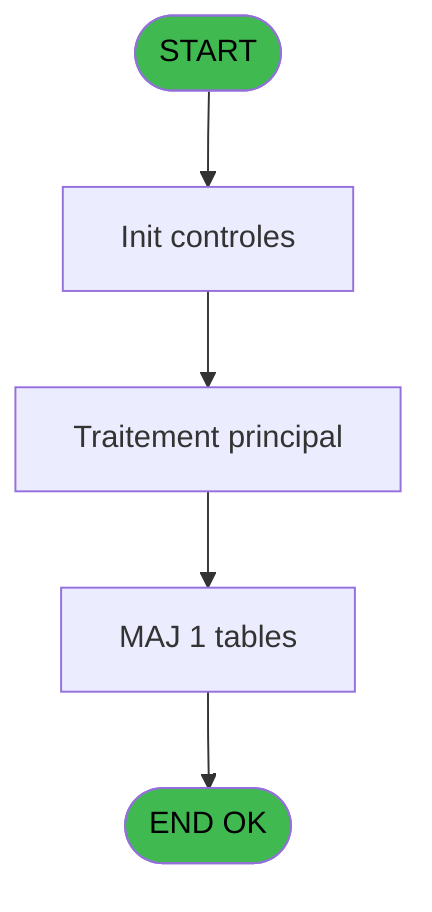
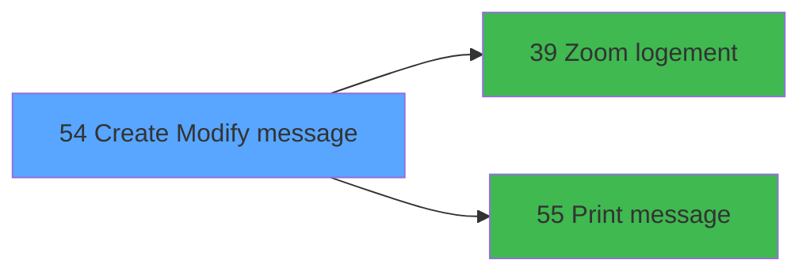

# REQ IDE 54 - Create / Modify message

> **Analyse**: Phases 1-4 2026-02-03 20:30 -> 20:31 (15s) | Assemblage 20:31
> **Pipeline**: V7.2 Enrichi
> **Structure**: 4 onglets (Resume | Ecrans | Donnees | Connexions)

<!-- TAB:Resume -->

## 1. FICHE D'IDENTITE

| Attribut | Valeur |
|----------|--------|
| Projet | REQ |
| IDE Position | 54 |
| Nom Programme | Create / Modify message |
| Fichier source | `Prg_54.xml` |
| Dossier IDE | Message |
| Taches | 3 (1 ecrans visibles) |
| Tables modifiees | 1 |
| Programmes appeles | 2 |

## 2. DESCRIPTION FONCTIONNELLE

**Create / Modify message** assure la gestion complete de ce processus, accessible depuis [Message Center (IDE 53)](REQ-IDE-53.md).

Le flux de traitement s'organise en **1 blocs fonctionnels** :

- **Traitement** (3 taches) : traitements metier divers

**Donnees modifiees** : 1 tables en ecriture (mod).

## 3. BLOCS FONCTIONNELS

### 3.1 Traitement (3 taches)

Traitements internes.

---

#### 54 - Message [[ECRAN]](#ecran-t1)

**Role** : Traitement : Message.
**Ecran** : 262 x 228 DLU (MDI) | [Voir mockup](#ecran-t1)
**Delegue a** : [Print message (IDE 55)](REQ-IDE-55.md)

---

#### 54.1 - Reservation [[ECRAN]](#ecran-t2)

**Role** : Traitement : Reservation.
**Ecran** : 150 x 72 DLU (MDI) | [Voir mockup](#ecran-t2)

---

#### 54.2 - get mes ID [[ECRAN]](#ecran-t3)

**Role** : Consultation/chargement : get mes ID.
**Ecran** : 198 x 116 DLU (MDI) | [Voir mockup](#ecran-t3)

## 5. REGLES METIER

*(Aucune regle metier identifiee)*

## 6. CONTEXTE

- **Appele par**: [Message Center (IDE 53)](REQ-IDE-53.md)
- **Appelle**: 2 programmes | **Tables**: 1 (W:1 R:0 L:0) | **Taches**: 3 | **Expressions**: 6

<!-- TAB:Ecrans -->

## 8. ECRANS

### 8.1 Forms visibles (1 / 3)

| # | Position | Tache | Nom | Type | Largeur | Hauteur | Bloc |
|---|----------|-------|-----|------|---------|---------|------|
| 1 | 54 | 54 | Message | MDI | 262 | 228 | Traitement |

### 8.2 Mockups Ecrans

---

#### 54 - Message
**Tache** : [54](#t1) | **Type** : MDI | **Dimensions** : 262 x 228 DLU
**Bloc** : Traitement | **Titre IDE** : Message

<!-- FORM-DATA:
{
    "width":  262,
    "vFactor":  8,
    "type":  "MDI",
    "hFactor":  4,
    "controls":  [
                     {
                         "x":  0,
                         "type":  "label",
                         "var":  "",
                         "y":  0,
                         "w":  259,
                         "fmt":  "",
                         "name":  "",
                         "h":  40,
                         "color":  "6",
                         "text":  "",
                         "parent":  null
                     },
                     {
                         "x":  6,
                         "type":  "label",
                         "var":  "",
                         "y":  5,
                         "w":  140,
                         "fmt":  "",
                         "name":  "",
                         "h":  12,
                         "color":  "6",
                         "text":  "Message logging",
                         "parent":  1
                     },
                     {
                         "x":  31,
                         "type":  "label",
                         "var":  "",
                         "y":  20,
                         "w":  177,
                         "fmt":  "",
                         "name":  "",
                         "h":  9,
                         "color":  "6",
                         "text":  "Log the message by making selections below.",
                         "parent":  1
                     },
                     {
                         "x":  45,
                         "type":  "label",
                         "var":  "",
                         "y":  53,
                         "w":  38,
                         "fmt":  "",
                         "name":  "",
                         "h":  11,
                         "color":  "",
                         "text":  "Room #",
                         "parent":  null
                     },
                     {
                         "x":  45,
                         "type":  "label",
                         "var":  "",
                         "y":  70,
                         "w":  38,
                         "fmt":  "",
                         "name":  "",
                         "h":  11,
                         "color":  "",
                         "text":  "Name",
                         "parent":  null
                     },
                     {
                         "x":  45,
                         "type":  "label",
                         "var":  "",
                         "y":  95,
                         "w":  36,
                         "fmt":  "",
                         "name":  "",
                         "h":  11,
                         "color":  "",
                         "text":  "Type",
                         "parent":  null
                     },
                     {
                         "x":  45,
                         "type":  "label",
                         "var":  "",
                         "y":  145,
                         "w":  50,
                         "fmt":  "",
                         "name":  "",
                         "h":  10,
                         "color":  "",
                         "text":  "Comments",
                         "parent":  null
                     },
                     {
                         "x":  0,
                         "type":  "line",
                         "var":  "",
                         "y":  204,
                         "w":  259,
                         "fmt":  "",
                         "name":  "",
                         "h":  0,
                         "color":  "",
                         "text":  "",
                         "parent":  null
                     },
                     {
                         "x":  88,
                         "type":  "edit",
                         "var":  "",
                         "y":  53,
                         "w":  38,
                         "fmt":  "",
                         "name":  "ROOM",
                         "h":  11,
                         "color":  "110",
                         "text":  "",
                         "parent":  null
                     },
                     {
                         "x":  88,
                         "type":  "edit",
                         "var":  "",
                         "y":  70,
                         "w":  106,
                         "fmt":  "",
                         "name":  "p.name",
                         "h":  11,
                         "color":  "110",
                         "text":  "",
                         "parent":  null
                     },
                     {
                         "x":  80,
                         "type":  "radio",
                         "var":  "",
                         "y":  92,
                         "w":  107,
                         "fmt":  "",
                         "name":  "p.type",
                         "h":  44,
                         "color":  "1",
                         "text":  "Fax,Telephone,Mail \\- Email \\- Parcel",
                         "parent":  null
                     },
                     {
                         "x":  47,
                         "type":  "edit",
                         "var":  "",
                         "y":  157,
                         "w":  184,
                         "fmt":  "",
                         "name":  "p.comment",
                         "h":  43,
                         "color":  "110",
                         "text":  "",
                         "parent":  null
                     },
                     {
                         "x":  126,
                         "type":  "button",
                         "var":  "",
                         "y":  51,
                         "w":  20,
                         "fmt":  "",
                         "name":  "bt room",
                         "h":  15,
                         "color":  "",
                         "text":  "",
                         "parent":  null
                     },
                     {
                         "x":  218,
                         "type":  "image",
                         "var":  "",
                         "y":  10,
                         "w":  30,
                         "fmt":  "",
                         "name":  "",
                         "h":  21,
                         "color":  "",
                         "text":  "",
                         "parent":  null
                     },
                     {
                         "x":  105,
                         "type":  "button",
                         "var":  "",
                         "y":  209,
                         "w":  76,
                         "fmt":  "Cancel",
                         "name":  "",
                         "h":  16,
                         "color":  "",
                         "text":  "",
                         "parent":  null
                     },
                     {
                         "x":  180,
                         "type":  "button",
                         "var":  "",
                         "y":  209,
                         "w":  76,
                         "fmt":  "Validate",
                         "name":  "",
                         "h":  16,
                         "color":  "",
                         "text":  "",
                         "parent":  null
                     }
                 ],
    "taskId":  "54",
    "height":  228
}
-->

<strong>Champs : 3 champs</strong>

| Pos (x,y) | Nom | Variable | Type |
|-----------|-----|----------|------|
| 88,53 | ROOM | - | edit |
| 88,70 | p.name | - | edit |
| 47,157 | p.comment | - | edit |

<strong>Boutons : 3 boutons</strong>

| Bouton | Pos (x,y) | Action |
|--------|-----------|--------|
| bt room | 126,51 | Bouton fonctionnel |
| Cancel | 105,209 | Annule et retour au menu |
| Validate | 180,209 | Valide la saisie et enregistre |

## 9. NAVIGATION

Ecran unique: **Message**

### 9.3 Structure hierarchique (3 taches)

| Position | Tache | Type | Dimensions | Bloc |
|----------|-------|------|------------|------|
| **54.1** | [**Message** (54)](#t1) [mockup](#ecran-t1) | MDI | 262x228 | Traitement |
| 54.1.1 | [Reservation (54.1)](#t2) [mockup](#ecran-t2) | MDI | 150x72 | |
| 54.1.2 | [get mes ID (54.2)](#t3) [mockup](#ecran-t3) | MDI | 198x116 | |

### 9.4 Algorigramme

> **Legende**: Vert = START/END OK | Rouge = END KO | Bleu = Decisions
> *Algorigramme auto-genere. Utiliser `/algorigramme` pour une synthese metier detaillee.*

<!-- TAB:Donnees -->

## 10. TABLES

### Tables utilisees (1)

| ID | Nom | Description | Type | R | W | L | Usages |
|----|-----|-------------|------|---|---|---|--------|
| 357 | mod |  | DB |   | **W** |   | 2 |

### Colonnes par table (0 / 1 tables avec colonnes identifiees)

Table 357 - mod (**W**) - 2 usages

*Table utilisee uniquement en Link ou aucune colonne Real identifiee dans le DataView.*

## 11. VARIABLES

### 11.1 Parametres entrants (5)

Variables recues du programme appelant ([Message Center (IDE 53)](REQ-IDE-53.md)).

| Lettre | Nom | Type | Usage dans |
|--------|-----|------|-----------|
| A | p.mess id | Alpha | 1x parametre entrant |
| B | p.room | Alpha | - |
| C | p.name | Alpha | - |
| D | p.type | Alpha | 1x parametre entrant |
| E | p.comment | Alpha | - |

### 11.2 Autres (1)

Variables diverses.

| Lettre | Nom | Type | Usage dans |
|--------|-----|------|-----------|
| F | bt room | Alpha | - |

## 12. EXPRESSIONS

**6 / 6 expressions decodees (100%)**

### 12.1 Repartition par type

| Type | Expressions | Regles |
|------|-------------|--------|
| CONSTANTE | 2 | 0 |
| OTHER | 1 | 0 |
| CAST_LOGIQUE | 1 | 0 |
| CONDITION | 2 | 0 |

### 12.2 Expressions cles par type

#### CONSTANTE (2 expressions)

| Type | IDE | Expression | Regle |
|------|-----|------------|-------|
| CONSTANTE | 3 | `'Telephone'` | - |
| CONSTANTE | 1 | `'%club_images%btzoom.bmp'` | - |

#### OTHER (1 expressions)

| Type | IDE | Expression | Regle |
|------|-----|------------|-------|
| OTHER | 2 | `Stat (0,'CM'MODE)` | - |

#### CAST_LOGIQUE (1 expressions)

| Type | IDE | Expression | Regle |
|------|-----|------------|-------|
| CAST_LOGIQUE | 4 | `'TRUE'LOG` | - |

#### CONDITION (2 expressions)

| Type | IDE | Expression | Regle |
|------|-----|------------|-------|
| CONDITION | 6 | `Trim (p.mess id [A])=''` | - |
| CONDITION | 5 | `Trim (p.type [D])=''` | - |

<!-- TAB:Connexions -->

## 13. GRAPHE D'APPELS

### 13.1 Chaine depuis Main (Callers)

Main -> ... -> [Message Center (IDE 53)](REQ-IDE-53.md) -> **Create / Modify message (IDE 54)**

### 13.2 Callers

| IDE | Nom Programme | Nb Appels |
|-----|---------------|-----------|
| [53](REQ-IDE-53.md) | Message Center | 3 |

### 13.3 Callees (programmes appeles)

### 13.4 Detail Callees avec contexte

| IDE | Nom Programme | Appels | Contexte |
|-----|---------------|--------|----------|
| [39](REQ-IDE-39.md) | Zoom logement | 1 | Selection/consultation |
| [55](REQ-IDE-55.md) | Print message | 1 | Impression ticket/document |

## 14. RECOMMANDATIONS MIGRATION

### 14.1 Profil du programme

| Metrique | Valeur | Impact migration |
|----------|--------|-----------------|
| Lignes de logique | 37 | Programme compact |
| Expressions | 6 | Peu de logique |
| Tables WRITE | 1 | Impact faible |
| Sous-programmes | 2 | Peu de dependances |
| Ecrans visibles | 1 | Ecran unique ou traitement batch |
| Code desactive | 0% (0 / 37) | Code sain |
| Regles metier | 0 | Pas de regle identifiee |

### 14.2 Plan de migration par bloc

#### Traitement (3 taches: 3 ecrans, 0 traitement)

- **Strategie** : 3 composant(s) UI (Razor/React) avec formulaires et validation.
- 2 sous-programme(s) a migrer ou a reutiliser depuis les services existants.
- Decomposer les taches en services unitaires testables.

### 14.3 Dependances critiques

| Dependance | Type | Appels | Impact |
|------------|------|--------|--------|
| mod | Table WRITE (Database) | 2x | Schema + repository |
| [Print message (IDE 55)](REQ-IDE-55.md) | Sous-programme | 1x | Normale - Impression ticket/document |
| [Zoom logement (IDE 39)](REQ-IDE-39.md) | Sous-programme | 1x | Normale - Selection/consultation |

---
*Spec DETAILED generee par Pipeline V7.2 - 2026-02-03 20:31*
