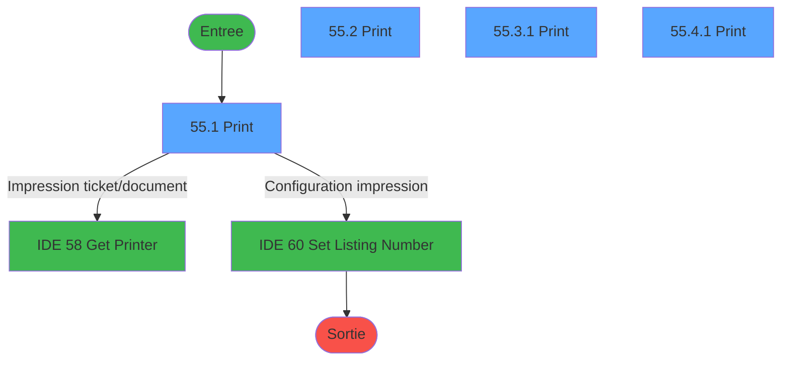
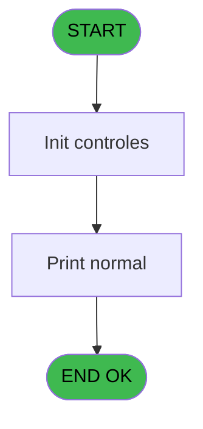
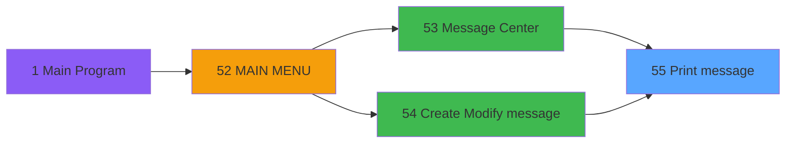
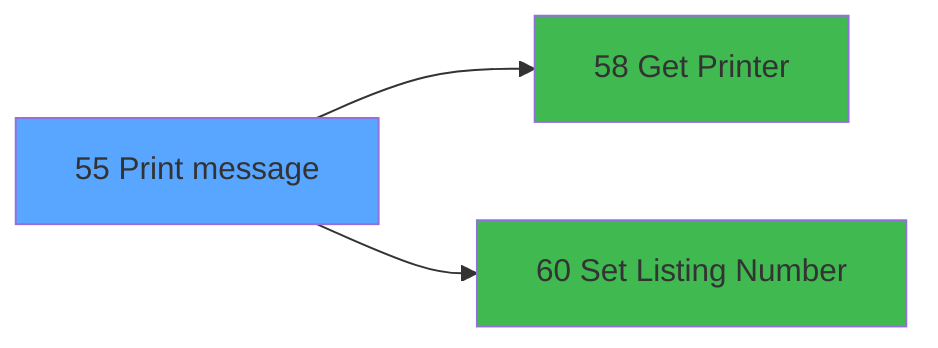

# REQ IDE 55 - Print message

> **Analyse**: Phases 1-4 2026-02-03 20:31 -> 20:31 (14s) | Assemblage 20:31
> **Pipeline**: V7.2 Enrichi
> **Structure**: 4 onglets (Resume | Ecrans | Donnees | Connexions)

<!-- TAB:Resume -->

## 1. FICHE D'IDENTITE

| Attribut | Valeur |
|----------|--------|
| Projet | REQ |
| IDE Position | 55 |
| Nom Programme | Print message |
| Fichier source | `Prg_55.xml` |
| Dossier IDE | Message |
| Taches | 7 (4 ecrans visibles) |
| Tables modifiees | 0 |
| Programmes appeles | 2 |

## 2. DESCRIPTION FONCTIONNELLE

**Print message** assure la gestion complete de ce processus, accessible depuis [Message Center (IDE 53)](REQ-IDE-53.md), [Create / Modify message (IDE 54)](REQ-IDE-54.md).

Le flux de traitement s'organise en **2 blocs fonctionnels** :

- **Impression** (6 taches) : generation de tickets et documents
- **Traitement** (1 tache) : traitements metier divers

Detail : phases du traitement

#### Phase 1 : Traitement (1 tache)

- **55** - Capture form **[[ECRAN]](#ecran-t1)**

Delegue a : [Set Listing Number (IDE 60)](REQ-IDE-60.md)

#### Phase 2 : Impression (6 taches)

- **55.1** - Print **[[ECRAN]](#ecran-t2)**
- **55.2** - Print **[[ECRAN]](#ecran-t3)**
- **55.3** - Printer 8
- **55.3.1** - Print **[[ECRAN]](#ecran-t5)**
- **55.4** - Printer 9
- **55.4.1** - Print **[[ECRAN]](#ecran-t7)**

Delegue a : [Get Printer (IDE 58)](REQ-IDE-58.md), [Set Listing Number (IDE 60)](REQ-IDE-60.md)

## 3. BLOCS FONCTIONNELS

### 3.1 Traitement (1 tache)

Traitements internes.

---

#### 55 - Capture form [[ECRAN]](#ecran-t1)

**Role** : Traitement : Capture form.
**Ecran** : 632 x 278 DLU (MDI) | [Voir mockup](#ecran-t1)
**Delegue a** : [Set Listing Number (IDE 60)](REQ-IDE-60.md)

### 3.2 Impression (6 taches)

Generation des documents et tickets.

---

#### 55.1 - Print [[ECRAN]](#ecran-t2)

**Role** : Generation du document : Print.
**Ecran** : 228 x 65 DLU (MDI) | [Voir mockup](#ecran-t2)
**Variables liees** : B (p.print message ?)
**Delegue a** : [Get Printer (IDE 58)](REQ-IDE-58.md)

---

#### 55.2 - Print [[ECRAN]](#ecran-t3)

**Role** : Generation du document : Print.
**Ecran** : 228 x 65 DLU (MDI) | [Voir mockup](#ecran-t3)
**Variables liees** : B (p.print message ?)
**Delegue a** : [Get Printer (IDE 58)](REQ-IDE-58.md)

---

#### 55.3 - Printer 8

**Role** : Generation du document : Printer 8.
**Delegue a** : [Get Printer (IDE 58)](REQ-IDE-58.md)

---

#### 55.3.1 - Print [[ECRAN]](#ecran-t5)

**Role** : Generation du document : Print.
**Ecran** : 228 x 65 DLU (MDI) | [Voir mockup](#ecran-t5)
**Variables liees** : B (p.print message ?)
**Delegue a** : [Get Printer (IDE 58)](REQ-IDE-58.md)

---

#### 55.4 - Printer 9

**Role** : Generation du document : Printer 9.
**Delegue a** : [Get Printer (IDE 58)](REQ-IDE-58.md)

---

#### 55.4.1 - Print [[ECRAN]](#ecran-t7)

**Role** : Generation du document : Print.
**Ecran** : 228 x 65 DLU (MDI) | [Voir mockup](#ecran-t7)
**Variables liees** : B (p.print message ?)
**Delegue a** : [Get Printer (IDE 58)](REQ-IDE-58.md)

## 5. REGLES METIER

*(Aucune regle metier identifiee)*

## 6. CONTEXTE

- **Appele par**: [Message Center (IDE 53)](REQ-IDE-53.md), [Create / Modify message (IDE 54)](REQ-IDE-54.md)
- **Appelle**: 2 programmes | **Tables**: 1 (W:0 R:1 L:0) | **Taches**: 7 | **Expressions**: 5

<!-- TAB:Ecrans -->

## 8. ECRANS

### 8.1 Forms visibles (4 / 7)

| # | Position | Tache | Nom | Type | Largeur | Hauteur | Bloc |
|---|----------|-------|-----|------|---------|---------|------|
| 1 | 55.1 | 55.1 | Print | MDI | 228 | 65 | Impression |
| 2 | 55.2 | 55.2 | Print | MDI | 228 | 65 | Impression |
| 3 | 55.3.1 | 55.3.1 | Print | MDI | 228 | 65 | Impression |
| 4 | 55.4.1 | 55.4.1 | Print | MDI | 228 | 65 | Impression |

### 8.2 Mockups Ecrans

---

#### 55.1 - Print
**Tache** : [55.1](#t2) | **Type** : MDI | **Dimensions** : 228 x 65 DLU
**Bloc** : Impression | **Titre IDE** : Print

<!-- FORM-DATA:
{
    "width":  228,
    "vFactor":  8,
    "type":  "MDI",
    "hFactor":  4,
    "controls":  [
                     {
                         "x":  83,
                         "type":  "label",
                         "var":  "",
                         "y":  24,
                         "w":  63,
                         "fmt":  "",
                         "name":  "",
                         "h":  10,
                         "color":  "6",
                         "text":  "Running ...",
                         "parent":  null
                     }
                 ],
    "taskId":  "55.1",
    "height":  65
}
-->

---

#### 55.2 - Print
**Tache** : [55.2](#t3) | **Type** : MDI | **Dimensions** : 228 x 65 DLU
**Bloc** : Impression | **Titre IDE** : Print

<!-- FORM-DATA:
{
    "width":  228,
    "vFactor":  8,
    "type":  "MDI",
    "hFactor":  4,
    "controls":  [
                     {
                         "x":  83,
                         "type":  "label",
                         "var":  "",
                         "y":  24,
                         "w":  63,
                         "fmt":  "",
                         "name":  "",
                         "h":  10,
                         "color":  "6",
                         "text":  "Running ...",
                         "parent":  null
                     }
                 ],
    "taskId":  "55.2",
    "height":  65
}
-->

---

#### 55.3.1 - Print
**Tache** : [55.3.1](#t5) | **Type** : MDI | **Dimensions** : 228 x 65 DLU
**Bloc** : Impression | **Titre IDE** : Print

<!-- FORM-DATA:
{
    "width":  228,
    "vFactor":  8,
    "type":  "MDI",
    "hFactor":  4,
    "controls":  [
                     {
                         "x":  83,
                         "type":  "label",
                         "var":  "",
                         "y":  24,
                         "w":  63,
                         "fmt":  "",
                         "name":  "",
                         "h":  10,
                         "color":  "6",
                         "text":  "Running ...",
                         "parent":  null
                     }
                 ],
    "taskId":  "55.3.1",
    "height":  65
}
-->

---

#### 55.4.1 - Print
**Tache** : [55.4.1](#t7) | **Type** : MDI | **Dimensions** : 228 x 65 DLU
**Bloc** : Impression | **Titre IDE** : Print

<!-- FORM-DATA:
{
    "width":  228,
    "vFactor":  8,
    "type":  "MDI",
    "hFactor":  4,
    "controls":  [
                     {
                         "x":  83,
                         "type":  "label",
                         "var":  "",
                         "y":  24,
                         "w":  63,
                         "fmt":  "",
                         "name":  "",
                         "h":  10,
                         "color":  "6",
                         "text":  "Running ...",
                         "parent":  null
                     }
                 ],
    "taskId":  "55.4.1",
    "height":  65
}
-->

## 9. NAVIGATION

### 9.1 Enchainement des ecrans

**Detail par enchainement :**

| Depuis | Action | Vers | Retour |
|--------|--------|------|--------|
| Print | Impression ticket/document | [Get Printer (IDE 58)](REQ-IDE-58.md) | Retour ecran |
| Print | Configuration impression | [Set Listing Number (IDE 60)](REQ-IDE-60.md) | Retour ecran |

### 9.3 Structure hierarchique (7 taches)

| Position | Tache | Type | Dimensions | Bloc |
|----------|-------|------|------------|------|
| **55.1** | [**Capture form** (55)](#t1) [mockup](#ecran-t1) | MDI | 632x278 | Traitement |
| **55.2** | [**Print** (55.1)](#t2) [mockup](#ecran-t2) | MDI | 228x65 | Impression |
| 55.2.1 | [Print (55.2)](#t3) [mockup](#ecran-t3) | MDI | 228x65 | |
| 55.2.2 | [Printer 8 (55.3)](#t4) | MDI | - | |
| 55.2.3 | [Print (55.3.1)](#t5) [mockup](#ecran-t5) | MDI | 228x65 | |
| 55.2.4 | [Printer 9 (55.4)](#t6) | MDI | - | |
| 55.2.5 | [Print (55.4.1)](#t7) [mockup](#ecran-t7) | MDI | 228x65 | |

### 9.4 Algorigramme

> **Legende**: Vert = START/END OK | Rouge = END KO | Bleu = Decisions
> *Algorigramme auto-genere. Utiliser `/algorigramme` pour une synthese metier detaillee.*

<!-- TAB:Donnees -->

## 10. TABLES

### Tables utilisees (1)

| ID | Nom | Description | Type | R | W | L | Usages |
|----|-----|-------------|------|---|---|---|--------|
| 357 | mod |  | DB | R |   |   | 4 |

### Colonnes par table (0 / 1 tables avec colonnes identifiees)

Table 357 - mod (R) - 4 usages

*Table utilisee uniquement en Link ou aucune colonne Real identifiee dans le DataView.*

## 11. VARIABLES

### 11.1 Parametres entrants (2)

Variables recues du programme appelant ([Message Center (IDE 53)](REQ-IDE-53.md)).

| Lettre | Nom | Type | Usage dans |
|--------|-----|------|-----------|
| A | p.message id | Alpha | - |
| B | p.print message ? | Logical | - |

## 12. EXPRESSIONS

**5 / 5 expressions decodees (100%)**

### 12.1 Repartition par type

| Type | Expressions | Regles |
|------|-------------|--------|
| CONSTANTE | 1 | 0 |
| CONDITION | 4 | 0 |

### 12.2 Expressions cles par type

#### CONSTANTE (1 expressions)

| Type | IDE | Expression | Regle |
|------|-----|------------|-------|
| CONSTANTE | 1 | `402` | - |

#### CONDITION (4 expressions)

| Type | IDE | Expression | Regle |
|------|-----|------------|-------|
| CONDITION | 4 | `GetParam ('CURRENTPRINTERNUM')=8` | - |
| CONDITION | 5 | `GetParam ('CURRENTPRINTERNUM')=9` | - |
| CONDITION | 2 | `GetParam ('CURRENTPRINTERNUM')=1` | - |
| CONDITION | 3 | `GetParam ('CURRENTPRINTERNUM')=6` | - |

<!-- TAB:Connexions -->

## 13. GRAPHE D'APPELS

### 13.1 Chaine depuis Main (Callers)

Main -> ... -> [Message Center (IDE 53)](REQ-IDE-53.md) -> **Print message (IDE 55)**

Main -> ... -> [Create / Modify message (IDE 54)](REQ-IDE-54.md) -> **Print message (IDE 55)**

### 13.2 Callers

| IDE | Nom Programme | Nb Appels |
|-----|---------------|-----------|
| [53](REQ-IDE-53.md) | Message Center | 5 |
| [54](REQ-IDE-54.md) | Create / Modify message | 1 |

### 13.3 Callees (programmes appeles)

### 13.4 Detail Callees avec contexte

| IDE | Nom Programme | Appels | Contexte |
|-----|---------------|--------|----------|
| [58](REQ-IDE-58.md) | Get Printer | 1 | Impression ticket/document |
| [60](REQ-IDE-60.md) | Set Listing Number | 1 | Configuration impression |

## 14. RECOMMANDATIONS MIGRATION

### 14.1 Profil du programme

| Metrique | Valeur | Impact migration |
|----------|--------|-----------------|
| Lignes de logique | 75 | Programme compact |
| Expressions | 5 | Peu de logique |
| Tables WRITE | 0 | Impact faible |
| Sous-programmes | 2 | Peu de dependances |
| Ecrans visibles | 4 | Quelques ecrans |
| Code desactive | 0% (0 / 75) | Code sain |
| Regles metier | 0 | Pas de regle identifiee |

### 14.2 Plan de migration par bloc

#### Traitement (1 tache: 1 ecran, 0 traitement)

- **Strategie** : 1 composant(s) UI (Razor/React) avec formulaires et validation.
- 2 sous-programme(s) a migrer ou a reutiliser depuis les services existants.
- Decomposer les taches en services unitaires testables.

#### Impression (6 taches: 4 ecrans, 2 traitements)

- **Strategie** : Templates HTML -> PDF via wkhtmltopdf ou Puppeteer.
- `PrintService` injectable avec choix imprimante

### 14.3 Dependances critiques

| Dependance | Type | Appels | Impact |
|------------|------|--------|--------|
| [Set Listing Number (IDE 60)](REQ-IDE-60.md) | Sous-programme | 1x | Normale - Configuration impression |
| [Get Printer (IDE 58)](REQ-IDE-58.md) | Sous-programme | 1x | Normale - Impression ticket/document |

---
*Spec DETAILED generee par Pipeline V7.2 - 2026-02-03 20:31*
