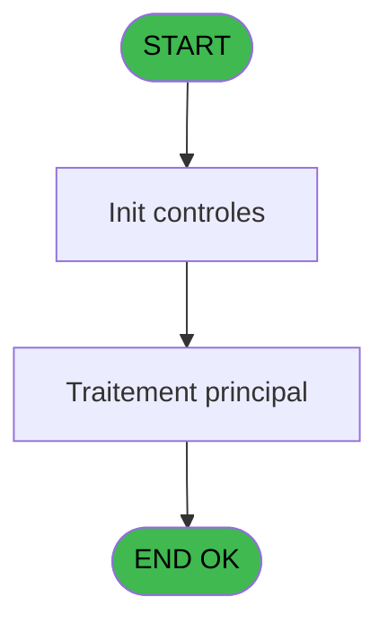
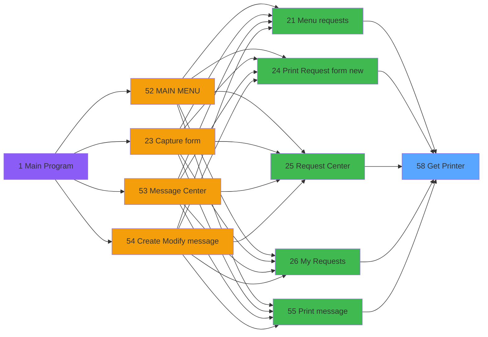

# REQ IDE 58 - Get Printer

> **Analyse**: Phases 1-4 2026-02-03 20:32 -> 20:32 (15s) | Assemblage 20:32
> **Pipeline**: V7.2 Enrichi
> **Structure**: 4 onglets (Resume | Ecrans | Donnees | Connexions)

<!-- TAB:Resume -->

## 1. FICHE D'IDENTITE

| Attribut | Valeur |
|----------|--------|
| Projet | REQ |
| IDE Position | 58 |
| Nom Programme | Get Printer |
| Fichier source | `Prg_58.xml` |
| Dossier IDE | Printer |
| Taches | 3 (0 ecrans visibles) |
| Tables modifiees | 0 |
| Programmes appeles | 1 |

## 2. DESCRIPTION FONCTIONNELLE

**Get Printer** assure la gestion complete de ce processus, accessible depuis [Menu requests (IDE 21)](REQ-IDE-21.md), [    Print Request form new (IDE 24)](REQ-IDE-24.md), [Request Center (IDE 25)](REQ-IDE-25.md), [My Requests (IDE 26)](REQ-IDE-26.md), [Print message (IDE 55)](REQ-IDE-55.md), [Printer choice (IDE 59)](REQ-IDE-59.md), [Raz Current Printer (IDE 61)](REQ-IDE-61.md).

Le flux de traitement s'organise en **1 blocs fonctionnels** :

- **Impression** (3 taches) : generation de tickets et documents

## 3. BLOCS FONCTIONNELS

### 3.1 Impression (3 taches)

Generation des documents et tickets.

---

#### 58 - Get Printer

**Role** : Generation du document : Get Printer.

---

#### 58.1 - pms_print_param terminal v1

**Role** : Generation du document : pms_print_param terminal v1.

---

#### 58.2 - pms_print_param terminal

**Role** : Generation du document : pms_print_param terminal.

## 5. REGLES METIER

*(Aucune regle metier identifiee)*

## 6. CONTEXTE

- **Appele par**: [Menu requests (IDE 21)](REQ-IDE-21.md), [    Print Request form new (IDE 24)](REQ-IDE-24.md), [Request Center (IDE 25)](REQ-IDE-25.md), [My Requests (IDE 26)](REQ-IDE-26.md), [Print message (IDE 55)](REQ-IDE-55.md), [Printer choice (IDE 59)](REQ-IDE-59.md), [Raz Current Printer (IDE 61)](REQ-IDE-61.md)
- **Appelle**: 1 programmes | **Tables**: 3 (W:0 R:2 L:1) | **Taches**: 3 | **Expressions**: 13

<!-- TAB:Ecrans -->

## 8. ECRANS

*(Programme sans ecran visible)*

## 9. NAVIGATION

### 9.3 Structure hierarchique (3 taches)

| Position | Tache | Type | Dimensions | Bloc |
|----------|-------|------|------------|------|
| **58.1** | [**Get Printer** (58)](#t1) | MDI | - | Impression |
| 58.1.1 | [pms_print_param terminal v1 (58.1)](#t2) | - | - | |
| 58.1.2 | [pms_print_param terminal (58.2)](#t5) | - | - | |

### 9.4 Algorigramme

> **Legende**: Vert = START/END OK | Rouge = END KO | Bleu = Decisions
> *Algorigramme auto-genere. Utiliser `/algorigramme` pour une synthese metier detaillee.*

<!-- TAB:Donnees -->

## 10. TABLES

### Tables utilisees (3)

| ID | Nom | Description | Type | R | W | L | Usages |
|----|-----|-------------|------|---|---|---|--------|
| 367 | pms_print_param_default |  | DB | R |   |   | 1 |
| 369 | presents_par_nationalite |  | DB |   |   | L | 1 |
| 370 | pv_accounting_date |  | DB | R |   |   | 2 |

### Colonnes par table (1 / 2 tables avec colonnes identifiees)

Table 367 - pms_print_param_default (R) - 1 usages

| Lettre | Variable | Acces | Type |
|--------|----------|-------|------|
| A | v.Imprimante | R | Numeric |
| B | v.Copies | R | Numeric |

Table 370 - pv_accounting_date (R) - 2 usages

*Table utilisee uniquement en Link ou aucune colonne Real identifiee dans le DataView.*

## 11. VARIABLES

### 11.1 Variables de session (2)

Variables persistantes pendant toute la session.

| Lettre | Nom | Type | Usage dans |
|--------|-----|------|-----------|
| A | v.Imprimante | Numeric | - |
| B | v.Copies | Numeric | - |

## 12. EXPRESSIONS

**13 / 13 expressions decodees (100%)**

### 12.1 Repartition par type

| Type | Expressions | Regles |
|------|-------------|--------|
| OTHER | 7 | 0 |
| CONDITION | 4 | 0 |
| REFERENCE_VG | 2 | 0 |

### 12.2 Expressions cles par type

#### OTHER (7 expressions)

| Type | IDE | Expression | Regle |
|------|-----|------------|-------|
| OTHER | 6 | `SetParam ('CURRENTPRINTERNUM',[C])` | - |
| OTHER | 7 | `SetParam ('CURRENTPRINTERNAME',[I])` | - |
| OTHER | 10 | `SetParam ('NUMBERCOPIES',[D])` | - |
| OTHER | 5 | `SetParam ('DEFAULTPRINTERNAME',[I])` | - |
| OTHER | 1 | `GetParam ('CURRENTLISTINGNUM')` | - |
| ... | | *+2 autres* | |

#### CONDITION (4 expressions)

| Type | IDE | Expression | Regle |
|------|-----|------------|-------|
| CONDITION | 9 | `GetParam ('CURRENTPRINTERNAME')='VOID'` | - |
| CONDITION | 11 | `GetParam ('NUMBERCOPIES')=0` | - |
| CONDITION | 3 | `SetParam ('CURRENTLISTINGNAME',IF (GetParam ('CODELANGUE')='FRA',[F],IF ([G]='',[F],[G])))` | - |
| CONDITION | 8 | `GetParam ('CURRENTPRINTERNUM')=0` | - |

#### REFERENCE_VG (2 expressions)

| Type | IDE | Expression | Regle |
|------|-----|------------|-------|
| REFERENCE_VG | 13 | `VG20` | - |
| REFERENCE_VG | 12 | `VG19` | - |

<!-- TAB:Connexions -->

## 13. GRAPHE D'APPELS

### 13.1 Chaine depuis Main (Callers)

Main -> ... -> [Menu requests (IDE 21)](REQ-IDE-21.md) -> **Get Printer (IDE 58)**

Main -> ... -> [    Print Request form new (IDE 24)](REQ-IDE-24.md) -> **Get Printer (IDE 58)**

Main -> ... -> [Request Center (IDE 25)](REQ-IDE-25.md) -> **Get Printer (IDE 58)**

Main -> ... -> [My Requests (IDE 26)](REQ-IDE-26.md) -> **Get Printer (IDE 58)**

Main -> ... -> [Print message (IDE 55)](REQ-IDE-55.md) -> **Get Printer (IDE 58)**

Main -> ... -> [Printer choice (IDE 59)](REQ-IDE-59.md) -> **Get Printer (IDE 58)**

Main -> ... -> [Raz Current Printer (IDE 61)](REQ-IDE-61.md) -> **Get Printer (IDE 58)**

### 13.2 Callers

| IDE | Nom Programme | Nb Appels |
|-----|---------------|-----------|
| [21](REQ-IDE-21.md) | Menu requests | 1 |
| [24](REQ-IDE-24.md) |     Print Request form new | 1 |
| [25](REQ-IDE-25.md) | Request Center | 1 |
| [26](REQ-IDE-26.md) | My Requests | 1 |
| [55](REQ-IDE-55.md) | Print message | 1 |
| [59](REQ-IDE-59.md) | Printer choice | 1 |
| [61](REQ-IDE-61.md) | Raz Current Printer | 1 |

### 13.3 Callees (programmes appeles)

### 13.4 Detail Callees avec contexte

| IDE | Nom Programme | Appels | Contexte |
|-----|---------------|--------|----------|
| [57](REQ-IDE-57.md) | Set Village Address | 1 | Sous-programme |

## 14. RECOMMANDATIONS MIGRATION

### 14.1 Profil du programme

| Metrique | Valeur | Impact migration |
|----------|--------|-----------------|
| Lignes de logique | 47 | Programme compact |
| Expressions | 13 | Peu de logique |
| Tables WRITE | 0 | Impact faible |
| Sous-programmes | 1 | Peu de dependances |
| Ecrans visibles | 0 | Ecran unique ou traitement batch |
| Code desactive | 0% (0 / 47) | Code sain |
| Regles metier | 0 | Pas de regle identifiee |

### 14.2 Plan de migration par bloc

#### Impression (3 taches: 0 ecran, 3 traitements)

- **Strategie** : Templates HTML -> PDF via wkhtmltopdf ou Puppeteer.
- `PrintService` injectable avec choix imprimante

### 14.3 Dependances critiques

| Dependance | Type | Appels | Impact |
|------------|------|--------|--------|
| [Set Village Address (IDE 57)](REQ-IDE-57.md) | Sous-programme | 1x | Normale - Sous-programme |

---
*Spec DETAILED generee par Pipeline V7.2 - 2026-02-03 20:32*
