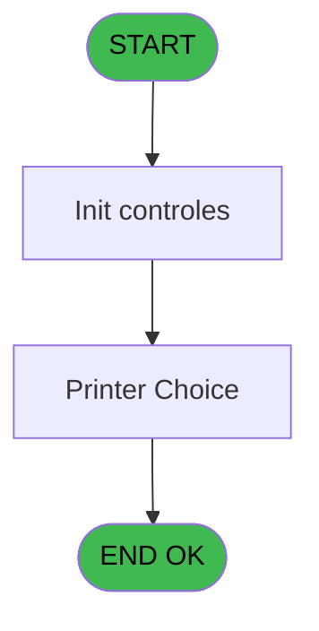
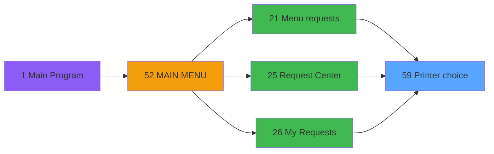

# REQ IDE 59 - Printer choice

> **Analyse**: Phases 1-4 2026-02-03 20:32 -> 20:32 (15s) | Assemblage 20:32
> **Pipeline**: V7.2 Enrichi
> **Structure**: 4 onglets (Resume | Ecrans | Donnees | Connexions)

<!-- TAB:Resume -->

## 1. FICHE D'IDENTITE

| Attribut | Valeur |
|----------|--------|
| Projet | REQ |
| IDE Position | 59 |
| Nom Programme | Printer choice |
| Fichier source | `Prg_59.xml` |
| Dossier IDE | Printer |
| Taches | 5 (1 ecrans visibles) |
| Tables modifiees | 0 |
| Programmes appeles | 1 |

## 2. DESCRIPTION FONCTIONNELLE

**Printer choice** assure la gestion complete de ce processus, accessible depuis [Menu requests (IDE 21)](REQ-IDE-21.md), [Request Center (IDE 25)](REQ-IDE-25.md), [My Requests (IDE 26)](REQ-IDE-26.md).

Le flux de traitement s'organise en **2 blocs fonctionnels** :

- **Impression** (4 taches) : generation de tickets et documents
- **Traitement** (1 tache) : traitements metier divers

Detail : phases du traitement

#### Phase 1 : Impression (4 taches)

- **59** - Printer choice **[[ECRAN]](#ecran-t1)**
- **59.2** - Printer Choice **[[ECRAN]](#ecran-t3)**
- **59.1.1** - pms_print_param terminal
- **59.1.2** - pms_print_param terminal

Delegue a : [Get Printer (IDE 58)](REQ-IDE-58.md)

#### Phase 2 : Traitement (1 tache)

- **59.1** - Load

## 3. BLOCS FONCTIONNELS

### 3.1 Impression (4 taches)

Generation des documents et tickets.

---

#### 59 - Printer choice [[ECRAN]](#ecran-t1)

**Role** : Generation du document : Printer choice.
**Ecran** : 366 x 0 DLU (MDI) | [Voir mockup](#ecran-t1)

3 sous-taches directes

| Tache | Nom | Bloc |
|-------|-----|------|
| [59.2](#t3) | Printer Choice **[[ECRAN]](#ecran-t3)** | Impression |
| [59.1.1](#t12) | pms_print_param terminal | Impression |
| [59.1.2](#t15) | pms_print_param terminal | Impression |

**Variables liees** : A (EndprinterChoice)
**Delegue a** : [Get Printer (IDE 58)](REQ-IDE-58.md)

---

#### 59.2 - Printer Choice [[ECRAN]](#ecran-t3)

**Role** : Generation du document : Printer Choice.
**Ecran** : 770 x 233 DLU (MDI) | [Voir mockup](#ecran-t3)
**Variables liees** : A (EndprinterChoice)
**Delegue a** : [Get Printer (IDE 58)](REQ-IDE-58.md)

---

#### 59.1.1 - pms_print_param terminal

**Role** : Generation du document : pms_print_param terminal.
**Delegue a** : [Get Printer (IDE 58)](REQ-IDE-58.md)

---

#### 59.1.2 - pms_print_param terminal

**Role** : Generation du document : pms_print_param terminal.
**Delegue a** : [Get Printer (IDE 58)](REQ-IDE-58.md)

### 3.2 Traitement (1 tache)

Traitements internes.

---

#### 59.1 - Load

**Role** : Traitement : Load.

## 5. REGLES METIER

*(Aucune regle metier identifiee)*

## 6. CONTEXTE

- **Appele par**: [Menu requests (IDE 21)](REQ-IDE-21.md), [Request Center (IDE 25)](REQ-IDE-25.md), [My Requests (IDE 26)](REQ-IDE-26.md)
- **Appelle**: 1 programmes | **Tables**: 5 (W:0 R:2 L:3) | **Taches**: 5 | **Expressions**: 2

<!-- TAB:Ecrans -->

## 8. ECRANS

### 8.1 Forms visibles (1 / 5)

| # | Position | Tache | Nom | Type | Largeur | Hauteur | Bloc |
|---|----------|-------|-----|------|---------|---------|------|
| 1 | 59.2 | 59.2 | Printer Choice | MDI | 770 | 233 | Impression |

### 8.2 Mockups Ecrans

---

#### 59.2 - Printer Choice
**Tache** : [59.2](#t3) | **Type** : MDI | **Dimensions** : 770 x 233 DLU
**Bloc** : Impression | **Titre IDE** : Printer Choice

<!-- FORM-DATA:
{
    "width":  770,
    "vFactor":  8,
    "type":  "MDI",
    "hFactor":  8,
    "controls":  [
                     {
                         "x":  10,
                         "type":  "table",
                         "var":  "",
                         "name":  "",
                         "titleH":  12,
                         "color":  "110",
                         "w":  744,
                         "y":  4,
                         "fmt":  "",
                         "parent":  null,
                         "text":  "",
                         "rowH":  14,
                         "h":  155,
                         "cols":  [
                                      {
                                          "title":  "Chrono",
                                          "layer":  1,
                                          "w":  78
                                      },
                                      {
                                          "title":  "Libellé",
                                          "layer":  2,
                                          "w":  431
                                      },
                                      {
                                          "title":  "Tray",
                                          "layer":  3,
                                          "w":  49
                                      },
                                      {
                                          "title":  "Copies",
                                          "layer":  4,
                                          "w":  69
                                      },
                                      {
                                          "title":  "Choice",
                                          "layer":  5,
                                          "w":  85
                                      }
                                  ],
                         "rows":  5
                     },
                     {
                         "x":  8,
                         "type":  "label",
                         "var":  "",
                         "y":  167,
                         "w":  165,
                         "fmt":  "",
                         "name":  "",
                         "h":  12,
                         "color":  "",
                         "text":  "Default printer",
                         "parent":  null
                     },
                     {
                         "x":  8,
                         "type":  "label",
                         "var":  "",
                         "y":  181,
                         "w":  165,
                         "fmt":  "",
                         "name":  "",
                         "h":  12,
                         "color":  "",
                         "text":  "Current listing",
                         "parent":  null
                     },
                     {
                         "x":  8,
                         "type":  "label",
                         "var":  "",
                         "y":  195,
                         "w":  165,
                         "fmt":  "",
                         "name":  "",
                         "h":  12,
                         "color":  "",
                         "text":  "Current printer",
                         "parent":  null
                     },
                     {
                         "x":  8,
                         "type":  "label",
                         "var":  "",
                         "y":  209,
                         "w":  165,
                         "fmt":  "",
                         "name":  "",
                         "h":  12,
                         "color":  "",
                         "text":  "Current copies",
                         "parent":  null
                     },
                     {
                         "x":  506,
                         "type":  "button",
                         "var":  "",
                         "y":  211,
                         "w":  240,
                         "fmt":  "",
                         "name":  "NoChangeAndExitButton",
                         "h":  16,
                         "color":  "",
                         "text":  "",
                         "parent":  null
                     },
                     {
                         "x":  194,
                         "type":  "edit",
                         "var":  "",
                         "y":  167,
                         "w":  549,
                         "fmt":  "",
                         "name":  "",
                         "h":  12,
                         "color":  "110",
                         "text":  "",
                         "parent":  null
                     },
                     {
                         "x":  194,
                         "type":  "edit",
                         "var":  "",
                         "y":  195,
                         "w":  549,
                         "fmt":  "",
                         "name":  "",
                         "h":  12,
                         "color":  "110",
                         "text":  "",
                         "parent":  null
                     },
                     {
                         "x":  18,
                         "type":  "edit",
                         "var":  "",
                         "y":  18,
                         "w":  62,
                         "fmt":  "",
                         "name":  "",
                         "h":  12,
                         "color":  "110",
                         "text":  "",
                         "parent":  1
                     },
                     {
                         "x":  96,
                         "type":  "edit",
                         "var":  "",
                         "y":  18,
                         "w":  421,
                         "fmt":  "",
                         "name":  "",
                         "h":  12,
                         "color":  "110",
                         "text":  "",
                         "parent":  1
                     },
                     {
                         "x":  525,
                         "type":  "edit",
                         "var":  "",
                         "y":  18,
                         "w":  40,
                         "fmt":  "",
                         "name":  "",
                         "h":  12,
                         "color":  "110",
                         "text":  "",
                         "parent":  1
                     },
                     {
                         "x":  574,
                         "type":  "edit",
                         "var":  "",
                         "y":  18,
                         "w":  59,
                         "fmt":  "",
                         "name":  "Copies",
                         "h":  12,
                         "color":  "110",
                         "text":  "",
                         "parent":  1
                     },
                     {
                         "x":  643,
                         "type":  "button",
                         "var":  "",
                         "y":  18,
                         "w":  72,
                         "fmt":  "",
                         "name":  "Choice",
                         "h":  12,
                         "color":  "",
                         "text":  "",
                         "parent":  1
                     },
                     {
                         "x":  194,
                         "type":  "edit",
                         "var":  "",
                         "y":  181,
                         "w":  549,
                         "fmt":  "64",
                         "name":  "",
                         "h":  12,
                         "color":  "110",
                         "text":  "",
                         "parent":  null
                     },
                     {
                         "x":  194,
                         "type":  "edit",
                         "var":  "",
                         "y":  209,
                         "w":  56,
                         "fmt":  "4",
                         "name":  "",
                         "h":  12,
                         "color":  "110",
                         "text":  "",
                         "parent":  null
                     }
                 ],
    "taskId":  "59.2",
    "height":  233
}
-->

<strong>Champs : 8 champs</strong>

| Pos (x,y) | Nom | Variable | Type |
|-----------|-----|----------|------|
| 194,167 | (sans nom) | - | edit |
| 194,195 | (sans nom) | - | edit |
| 18,18 | (sans nom) | - | edit |
| 96,18 | (sans nom) | - | edit |
| 525,18 | (sans nom) | - | edit |
| 574,18 | Copies | - | edit |
| 194,181 | 64 | - | edit |
| 194,209 | 4 | - | edit |

<strong>Boutons : 2 boutons</strong>

| Bouton | Pos (x,y) | Action |
|--------|-----------|--------|
| NoChangeAndExitButton | 506,211 | Modifie l'element Quitte le programme |
| Choice | 643,18 | Bouton fonctionnel |

## 9. NAVIGATION

Ecran unique: **Printer Choice**

### 9.3 Structure hierarchique (5 taches)

| Position | Tache | Type | Dimensions | Bloc |
|----------|-------|------|------------|------|
| **59.1** | [**Printer choice** (59)](#t1) [mockup](#ecran-t1) | MDI | 366x0 | Impression |
| 59.1.1 | [Printer Choice (59.2)](#t3) [mockup](#ecran-t3) | MDI | 770x233 | |
| 59.1.2 | [pms_print_param terminal (59.1.1)](#t12) | - | - | |
| 59.1.3 | [pms_print_param terminal (59.1.2)](#t15) | - | - | |
| **59.2** | [**Load** (59.1)](#t2) | MDI | - | Traitement |

### 9.4 Algorigramme

> **Legende**: Vert = START/END OK | Rouge = END KO | Bleu = Decisions
> *Algorigramme auto-genere. Utiliser `/algorigramme` pour une synthese metier detaillee.*

<!-- TAB:Donnees -->

## 10. TABLES

### Tables utilisees (5)

| ID | Nom | Description | Type | R | W | L | Usages |
|----|-----|-------------|------|---|---|---|--------|
| 367 | pms_print_param_default |  | DB | R |   |   | 2 |
| 369 | presents_par_nationalite |  | DB |   |   | L | 2 |
| 370 | pv_accounting_date |  | DB | R |   |   | 2 |
| 371 | pv_binding_settings |  | DB |   |   | L | 1 |
| 584 | tempo_type_millesia | Table temporaire ecran | TMP |   |   | L | 2 |

### Colonnes par table (1 / 2 tables avec colonnes identifiees)

Table 367 - pms_print_param_default (R) - 2 usages

| Lettre | Variable | Acces | Type |
|--------|----------|-------|------|
| A | For current | R | Logical |
| B | v.Copies | R | Numeric |
| C | For default term | R | Logical |

Table 370 - pv_accounting_date (R) - 2 usages

*Table utilisee uniquement en Link ou aucune colonne Real identifiee dans le DataView.*

## 11. VARIABLES

### 11.1 Variables de session (1)

Variables persistantes pendant toute la session.

| Lettre | Nom | Type | Usage dans |
|--------|-----|------|-----------|
| B | v.Copies | Numeric | - |

### 11.2 Autres (2)

Variables diverses.

| Lettre | Nom | Type | Usage dans |
|--------|-----|------|-----------|
| A | EndprinterChoice | Logical | 1x refs |
| C | For default term | Logical | - |

## 12. EXPRESSIONS

**2 / 2 expressions decodees (100%)**

### 12.1 Repartition par type

| Type | Expressions | Regles |
|------|-------------|--------|
| OTHER | 2 | 0 |

### 12.2 Expressions cles par type

#### OTHER (2 expressions)

| Type | IDE | Expression | Regle |
|------|-----|------------|-------|
| OTHER | 2 | `DbDel ('{584,2}'DSOURCE,'')` | - |
| OTHER | 1 | `EndprinterChoice [A]` | - |

<!-- TAB:Connexions -->

## 13. GRAPHE D'APPELS

### 13.1 Chaine depuis Main (Callers)

Main -> ... -> [Menu requests (IDE 21)](REQ-IDE-21.md) -> **Printer choice (IDE 59)**

Main -> ... -> [Request Center (IDE 25)](REQ-IDE-25.md) -> **Printer choice (IDE 59)**

Main -> ... -> [My Requests (IDE 26)](REQ-IDE-26.md) -> **Printer choice (IDE 59)**

### 13.2 Callers

| IDE | Nom Programme | Nb Appels |
|-----|---------------|-----------|
| [21](REQ-IDE-21.md) | Menu requests | 1 |
| [25](REQ-IDE-25.md) | Request Center | 1 |
| [26](REQ-IDE-26.md) | My Requests | 1 |

### 13.3 Callees (programmes appeles)

### 13.4 Detail Callees avec contexte

| IDE | Nom Programme | Appels | Contexte |
|-----|---------------|--------|----------|
| [58](REQ-IDE-58.md) | Get Printer | 1 | Impression ticket/document |

## 14. RECOMMANDATIONS MIGRATION

### 14.1 Profil du programme

| Metrique | Valeur | Impact migration |
|----------|--------|-----------------|
| Lignes de logique | 105 | Programme compact |
| Expressions | 2 | Peu de logique |
| Tables WRITE | 0 | Impact faible |
| Sous-programmes | 1 | Peu de dependances |
| Ecrans visibles | 1 | Ecran unique ou traitement batch |
| Code desactive | 0% (0 / 105) | Code sain |
| Regles metier | 0 | Pas de regle identifiee |

### 14.2 Plan de migration par bloc

#### Impression (4 taches: 2 ecrans, 2 traitements)

- **Strategie** : Templates HTML -> PDF via wkhtmltopdf ou Puppeteer.
- `PrintService` injectable avec choix imprimante

#### Traitement (1 tache: 0 ecran, 1 traitement)

- **Strategie** : 1 service(s) backend injectable(s) (Domain Services).
- 1 sous-programme(s) a migrer ou a reutiliser depuis les services existants.
- Decomposer les taches en services unitaires testables.

### 14.3 Dependances critiques

| Dependance | Type | Appels | Impact |
|------------|------|--------|--------|
| [Get Printer (IDE 58)](REQ-IDE-58.md) | Sous-programme | 1x | Normale - Impression ticket/document |

---
*Spec DETAILED generee par Pipeline V7.2 - 2026-02-03 20:32*
