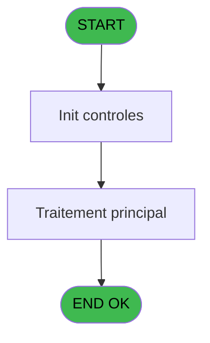
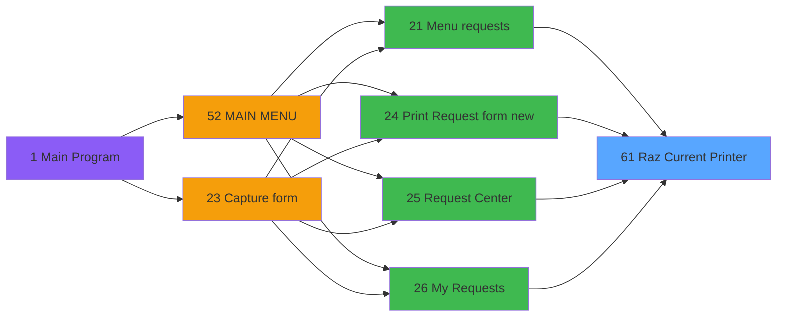

# REQ IDE 61 - Raz Current Printer

> **Analyse**: Phases 1-4 2026-02-03 20:33 -> 20:33 (15s) | Assemblage 20:33
> **Pipeline**: V7.2 Enrichi
> **Structure**: 4 onglets (Resume | Ecrans | Donnees | Connexions)

<!-- TAB:Resume -->

## 1. FICHE D'IDENTITE

| Attribut | Valeur |
|----------|--------|
| Projet | REQ |
| IDE Position | 61 |
| Nom Programme | Raz Current Printer |
| Fichier source | `Prg_61.xml` |
| Dossier IDE | Restaurant |
| Taches | 1 (0 ecrans visibles) |
| Tables modifiees | 0 |
| Programmes appeles | 1 |

## 2. DESCRIPTION FONCTIONNELLE

**Raz Current Printer** assure la gestion complete de ce processus, accessible depuis [Menu requests (IDE 21)](REQ-IDE-21.md), [    Print Request form new (IDE 24)](REQ-IDE-24.md), [Request Center (IDE 25)](REQ-IDE-25.md), [My Requests (IDE 26)](REQ-IDE-26.md).

Le flux de traitement s'organise en **1 blocs fonctionnels** :

- **Impression** (1 tache) : generation de tickets et documents

## 3. BLOCS FONCTIONNELS

### 3.1 Impression (1 tache)

Generation des documents et tickets.

---

#### 61 - Raz Current Printer

**Role** : Generation du document : Raz Current Printer.
**Delegue a** : [Get Printer (IDE 58)](REQ-IDE-58.md)

## 5. REGLES METIER

*(Aucune regle metier identifiee)*

## 6. CONTEXTE

- **Appele par**: [Menu requests (IDE 21)](REQ-IDE-21.md), [    Print Request form new (IDE 24)](REQ-IDE-24.md), [Request Center (IDE 25)](REQ-IDE-25.md), [My Requests (IDE 26)](REQ-IDE-26.md)
- **Appelle**: 1 programmes | **Tables**: 0 (W:0 R:0 L:0) | **Taches**: 1 | **Expressions**: 5

<!-- TAB:Ecrans -->

## 8. ECRANS

*(Programme sans ecran visible)*

## 9. NAVIGATION

### 9.3 Structure hierarchique (1 tache)

| Position | Tache | Type | Dimensions | Bloc |
|----------|-------|------|------------|------|
| **61.1** | [**Raz Current Printer** (61)](#t1) | MDI | - | Impression |

### 9.4 Algorigramme

> **Legende**: Vert = START/END OK | Rouge = END KO | Bleu = Decisions
> *Algorigramme auto-genere. Utiliser `/algorigramme` pour une synthese metier detaillee.*

<!-- TAB:Donnees -->

## 10. TABLES

### Tables utilisees (0)

| ID | Nom | Description | Type | R | W | L | Usages |
|----|-----|-------------|------|---|---|---|--------|

### Colonnes par table (0 / 0 tables avec colonnes identifiees)

## 11. VARIABLES

*(Programme sans variables locales mappees)*

## 12. EXPRESSIONS

**5 / 5 expressions decodees (100%)**

### 12.1 Repartition par type

| Type | Expressions | Regles |
|------|-------------|--------|
| OTHER | 5 | 0 |

### 12.2 Expressions cles par type

#### OTHER (5 expressions)

| Type | IDE | Expression | Regle |
|------|-----|------------|-------|
| OTHER | 4 | `SetParam ('NUMBERCOPIES',0)` | - |
| OTHER | 5 | `SetParam ('LISTINGNUMPRINTERCHOICE',0)` | - |
| OTHER | 3 | `SetParam ('SPECIFICPRINT','VOID')` | - |
| OTHER | 1 | `SetParam ('CURRENTPRINTERNUM',0)` | - |
| OTHER | 2 | `SetParam ('CURRENTPRINTERNAME','VOID')` | - |

<!-- TAB:Connexions -->

## 13. GRAPHE D'APPELS

### 13.1 Chaine depuis Main (Callers)

Main -> ... -> [Menu requests (IDE 21)](REQ-IDE-21.md) -> **Raz Current Printer (IDE 61)**

Main -> ... -> [    Print Request form new (IDE 24)](REQ-IDE-24.md) -> **Raz Current Printer (IDE 61)**

Main -> ... -> [Request Center (IDE 25)](REQ-IDE-25.md) -> **Raz Current Printer (IDE 61)**

Main -> ... -> [My Requests (IDE 26)](REQ-IDE-26.md) -> **Raz Current Printer (IDE 61)**

### 13.2 Callers

| IDE | Nom Programme | Nb Appels |
|-----|---------------|-----------|
| [21](REQ-IDE-21.md) | Menu requests | 1 |
| [24](REQ-IDE-24.md) |     Print Request form new | 1 |
| [25](REQ-IDE-25.md) | Request Center | 1 |
| [26](REQ-IDE-26.md) | My Requests | 1 |

### 13.3 Callees (programmes appeles)

### 13.4 Detail Callees avec contexte

| IDE | Nom Programme | Appels | Contexte |
|-----|---------------|--------|----------|
| [58](REQ-IDE-58.md) | Get Printer | 1 | Impression ticket/document |

## 14. RECOMMANDATIONS MIGRATION

### 14.1 Profil du programme

| Metrique | Valeur | Impact migration |
|----------|--------|-----------------|
| Lignes de logique | 11 | Programme compact |
| Expressions | 5 | Peu de logique |
| Tables WRITE | 0 | Impact faible |
| Sous-programmes | 1 | Peu de dependances |
| Ecrans visibles | 0 | Ecran unique ou traitement batch |
| Code desactive | 0% (0 / 11) | Code sain |
| Regles metier | 0 | Pas de regle identifiee |

### 14.2 Plan de migration par bloc

#### Impression (1 tache: 0 ecran, 1 traitement)

- **Strategie** : Templates HTML -> PDF via wkhtmltopdf ou Puppeteer.
- `PrintService` injectable avec choix imprimante

### 14.3 Dependances critiques

| Dependance | Type | Appels | Impact |
|------------|------|--------|--------|
| [Get Printer (IDE 58)](REQ-IDE-58.md) | Sous-programme | 1x | Normale - Impression ticket/document |

---
*Spec DETAILED generee par Pipeline V7.2 - 2026-02-03 20:33*
