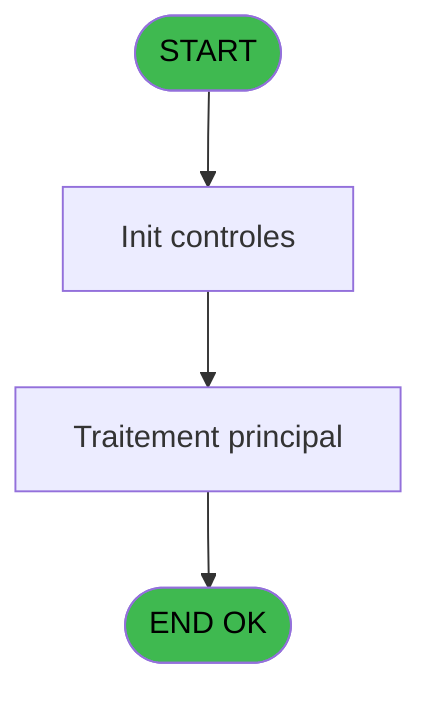
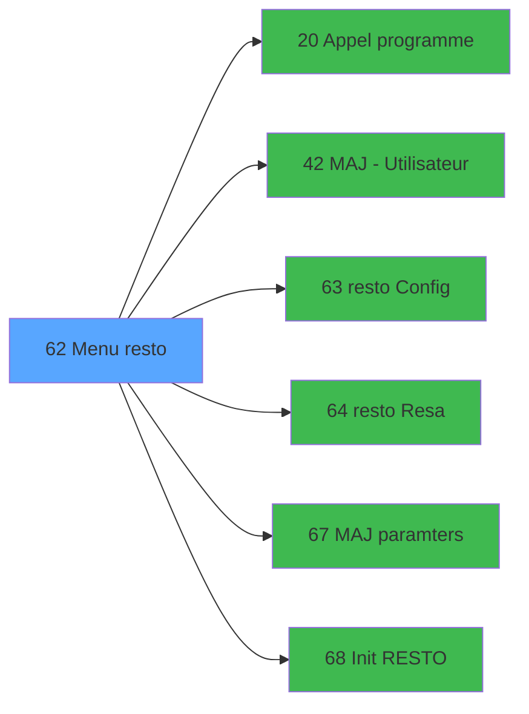

# REQ IDE 62 - Menu resto

> **Analyse**: Phases 1-4 2026-02-03 20:33 -> 20:33 (16s) | Assemblage 20:33
> **Pipeline**: V7.2 Enrichi
> **Structure**: 4 onglets (Resume | Ecrans | Donnees | Connexions)

<!-- TAB:Resume -->

## 1. FICHE D'IDENTITE

| Attribut | Valeur |
|----------|--------|
| Projet | REQ |
| IDE Position | 62 |
| Nom Programme | Menu resto |
| Fichier source | `Prg_62.xml` |
| Dossier IDE | Restaurant |
| Taches | 1 (1 ecrans visibles) |
| Tables modifiees | 0 |
| Programmes appeles | 6 |

## 2. DESCRIPTION FONCTIONNELLE

**Menu resto** assure la gestion complete de ce processus, accessible depuis [MAIN MENU (IDE 52)](REQ-IDE-52.md).

Le flux de traitement s'organise en **1 blocs fonctionnels** :

- **Traitement** (1 tache) : traitements metier divers

## 3. BLOCS FONCTIONNELS

### 3.1 Traitement (1 tache)

Traitements internes.

---

#### 62 - Restaurant [[ECRAN]](#ecran-t1)

**Role** : Traitement : Restaurant.
**Ecran** : 875 x 209 DLU (MDI) | [Voir mockup](#ecran-t1)
**Delegue a** : [Appel programme (IDE 20)](REQ-IDE-20.md), [MAJ - Utilisateur (IDE 42)](REQ-IDE-42.md), [resto Config (IDE 63)](REQ-IDE-63.md)

## 5. REGLES METIER

*(Aucune regle metier identifiee)*

## 6. CONTEXTE

- **Appele par**: [MAIN MENU (IDE 52)](REQ-IDE-52.md)
- **Appelle**: 6 programmes | **Tables**: 0 (W:0 R:0 L:0) | **Taches**: 1 | **Expressions**: 11

<!-- TAB:Ecrans -->

## 8. ECRANS

### 8.1 Forms visibles (1 / 1)

| # | Position | Tache | Nom | Type | Largeur | Hauteur | Bloc |
|---|----------|-------|-----|------|---------|---------|------|
| 1 | 62 | 62 | Restaurant | MDI | 875 | 209 | Traitement |

### 8.2 Mockups Ecrans

---

#### 62 - Restaurant
**Tache** : [62](#t1) | **Type** : MDI | **Dimensions** : 875 x 209 DLU
**Bloc** : Traitement | **Titre IDE** : Restaurant

<!-- FORM-DATA:
{
    "width":  875,
    "vFactor":  8,
    "type":  "MDI",
    "hFactor":  8,
    "controls":  [
                     {
                         "x":  0,
                         "type":  "label",
                         "var":  "",
                         "y":  0,
                         "w":  873,
                         "fmt":  "",
                         "name":  "",
                         "h":  21,
                         "color":  "",
                         "text":  "",
                         "parent":  null
                     },
                     {
                         "x":  304,
                         "type":  "label",
                         "var":  "",
                         "y":  44,
                         "w":  534,
                         "fmt":  "",
                         "name":  "",
                         "h":  120,
                         "color":  "",
                         "text":  "",
                         "parent":  null
                     },
                     {
                         "x":  321,
                         "type":  "label",
                         "var":  "",
                         "y":  51,
                         "w":  497,
                         "fmt":  "",
                         "name":  "",
                         "h":  91,
                         "color":  "",
                         "text":  "",
                         "parent":  6
                     },
                     {
                         "x":  369,
                         "type":  "label",
                         "var":  "",
                         "y":  51,
                         "w":  447,
                         "fmt":  "",
                         "name":  "",
                         "h":  90,
                         "color":  "6",
                         "text":  "",
                         "parent":  6
                     },
                     {
                         "x":  324,
                         "type":  "label",
                         "var":  "",
                         "y":  52,
                         "w":  45,
                         "fmt":  "",
                         "name":  "",
                         "h":  89,
                         "color":  "",
                         "text":  "",
                         "parent":  6
                     },
                     {
                         "x":  385,
                         "type":  "label",
                         "var":  "",
                         "y":  57,
                         "w":  373,
                         "fmt":  "",
                         "name":  "",
                         "h":  11,
                         "color":  "146",
                         "text":  "Restaurant configuration",
                         "parent":  6
                     },
                     {
                         "x":  384,
                         "type":  "label",
                         "var":  "",
                         "y":  71,
                         "w":  373,
                         "fmt":  "",
                         "name":  "",
                         "h":  11,
                         "color":  "146",
                         "text":  "Restaurant reservations",
                         "parent":  6
                     },
                     {
                         "x":  384,
                         "type":  "label",
                         "var":  "",
                         "y":  85,
                         "w":  214,
                         "fmt":  "",
                         "name":  "",
                         "h":  11,
                         "color":  "146",
                         "text":  "Rights",
                         "parent":  6
                     },
                     {
                         "x":  384,
                         "type":  "label",
                         "var":  "",
                         "y":  100,
                         "w":  214,
                         "fmt":  "",
                         "name":  "",
                         "h":  11,
                         "color":  "146",
                         "text":  "Administration",
                         "parent":  6
                     },
                     {
                         "x":  474,
                         "type":  "label",
                         "var":  "",
                         "y":  148,
                         "w":  142,
                         "fmt":  "",
                         "name":  "",
                         "h":  10,
                         "color":  "",
                         "text":  "Your selection",
                         "parent":  6
                     },
                     {
                         "x":  0,
                         "type":  "line",
                         "var":  "",
                         "y":  184,
                         "w":  873,
                         "fmt":  "",
                         "name":  "",
                         "h":  0,
                         "color":  "7",
                         "text":  "",
                         "parent":  null
                     },
                     {
                         "x":  621,
                         "type":  "edit",
                         "var":  "",
                         "y":  148,
                         "w":  26,
                         "fmt":  "UA",
                         "name":  "",
                         "h":  10,
                         "color":  "6",
                         "text":  "",
                         "parent":  6
                     },
                     {
                         "x":  3,
                         "type":  "image",
                         "var":  "",
                         "y":  2,
                         "w":  59,
                         "fmt":  "",
                         "name":  "",
                         "h":  18,
                         "color":  "",
                         "text":  "",
                         "parent":  null
                     },
                     {
                         "x":  77,
                         "type":  "edit",
                         "var":  "",
                         "y":  6,
                         "w":  480,
                         "fmt":  "40",
                         "name":  "",
                         "h":  8,
                         "color":  "",
                         "text":  "",
                         "parent":  null
                     },
                     {
                         "x":  596,
                         "type":  "edit",
                         "var":  "",
                         "y":  6,
                         "w":  268,
                         "fmt":  "WWW DD MMM YYYYT",
                         "name":  "",
                         "h":  8,
                         "color":  "",
                         "text":  "",
                         "parent":  null
                     },
                     {
                         "x":  55,
                         "type":  "image",
                         "var":  "",
                         "y":  44,
                         "w":  188,
                         "fmt":  "",
                         "name":  "",
                         "h":  74,
                         "color":  "",
                         "text":  "",
                         "parent":  null
                     },
                     {
                         "x":  333,
                         "type":  "button",
                         "var":  "",
                         "y":  57,
                         "w":  26,
                         "fmt":  "A",
                         "name":  "A",
                         "h":  11,
                         "color":  "1",
                         "text":  "",
                         "parent":  null
                     },
                     {
                         "x":  333,
                         "type":  "button",
                         "var":  "",
                         "y":  71,
                         "w":  26,
                         "fmt":  "B",
                         "name":  "B",
                         "h":  11,
                         "color":  "1",
                         "text":  "",
                         "parent":  null
                     },
                     {
                         "x":  333,
                         "type":  "button",
                         "var":  "",
                         "y":  85,
                         "w":  26,
                         "fmt":  "C",
                         "name":  "C",
                         "h":  11,
                         "color":  "1",
                         "text":  "",
                         "parent":  null
                     },
                     {
                         "x":  333,
                         "type":  "button",
                         "var":  "",
                         "y":  100,
                         "w":  26,
                         "fmt":  "D",
                         "name":  "D",
                         "h":  11,
                         "color":  "1",
                         "text":  "",
                         "parent":  null
                     },
                     {
                         "x":  713,
                         "type":  "button",
                         "var":  "",
                         "y":  189,
                         "w":  156,
                         "fmt":  "\u0026Exit",
                         "name":  "\u0026Quitter",
                         "h":  18,
                         "color":  "",
                         "text":  "",
                         "parent":  null
                     }
                 ],
    "taskId":  "62",
    "height":  209
}
-->

<strong>Champs : 3 champs</strong>

| Pos (x,y) | Nom | Variable | Type |
|-----------|-----|----------|------|
| 621,148 | UA | - | edit |
| 77,6 | 40 | - | edit |
| 596,6 | WWW DD MMM YYYYT | - | edit |

<strong>Boutons : 5 boutons</strong>

| Bouton | Pos (x,y) | Action |
|--------|-----------|--------|
| A | 333,57 | Bouton fonctionnel |
| B | 333,71 | Bouton fonctionnel |
| C | 333,85 | Bouton fonctionnel |
| D | 333,100 | Bouton fonctionnel |
| Exit | 713,189 | Quitte le programme |

## 9. NAVIGATION

Ecran unique: **Restaurant**

### 9.3 Structure hierarchique (1 tache)

| Position | Tache | Type | Dimensions | Bloc |
|----------|-------|------|------------|------|
| **62.1** | [**Restaurant** (62)](#t1) [mockup](#ecran-t1) | MDI | 875x209 | Traitement |

### 9.4 Algorigramme

> **Legende**: Vert = START/END OK | Rouge = END KO | Bleu = Decisions
> *Algorigramme auto-genere. Utiliser `/algorigramme` pour une synthese metier detaillee.*

<!-- TAB:Donnees -->

## 10. TABLES

### Tables utilisees (0)

| ID | Nom | Description | Type | R | W | L | Usages |
|----|-----|-------------|------|---|---|---|--------|

### Colonnes par table (0 / 0 tables avec colonnes identifiees)

## 11. VARIABLES

### 11.1 Parametres entrants (1)

Variables recues du programme appelant ([MAIN MENU (IDE 52)](REQ-IDE-52.md)).

| Lettre | Nom | Type | Usage dans |
|--------|-----|------|-----------|
| A | P0 societe | Alpha | - |

### 11.2 Variables de travail (2)

Variables internes au programme.

| Lettre | Nom | Type | Usage dans |
|--------|-----|------|-----------|
| B | w0 choix action | Alpha | 4x calcul interne |
| C | W0 fin tache | Alpha | 1x calcul interne |

## 12. EXPRESSIONS

**11 / 11 expressions decodees (100%)**

### 12.1 Repartition par type

| Type | Expressions | Regles |
|------|-------------|--------|
| CONSTANTE | 2 | 0 |
| DATE | 1 | 0 |
| CONDITION | 5 | 0 |
| REFERENCE_VG | 2 | 0 |
| CONCATENATION | 1 | 0 |

### 12.2 Expressions cles par type

#### CONSTANTE (2 expressions)

| Type | IDE | Expression | Regle |
|------|-----|------------|-------|
| CONSTANTE | 9 | `'RESTO'` | - |
| CONSTANTE | 3 | `'C'` | - |

#### DATE (1 expressions)

| Type | IDE | Expression | Regle |
|------|-----|------------|-------|
| DATE | 1 | `Date ()` | - |

#### CONDITION (5 expressions)

| Type | IDE | Expression | Regle |
|------|-----|------------|-------|
| CONDITION | 7 | `w0 choix action [B]='C' AND VG6` | - |
| CONDITION | 8 | `w0 choix action [B]='D' AND VG16` | - |
| CONDITION | 6 | `w0 choix action [B]='B'` | - |
| CONDITION | 4 | `W0 fin tache [C]='F'` | - |
| CONDITION | 5 | `w0 choix action [B]='A' AND VG16` | - |

#### REFERENCE_VG (2 expressions)

| Type | IDE | Expression | Regle |
|------|-----|------------|-------|
| REFERENCE_VG | 11 | `VG6` | - |
| REFERENCE_VG | 10 | `VG16` | - |

#### CONCATENATION (1 expressions)

| Type | IDE | Expression | Regle |
|------|-----|------------|-------|
| CONCATENATION | 2 | `VG2&' '&'('&Trim (Str (VG20,'3'))&') '` | - |

<!-- TAB:Connexions -->

## 13. GRAPHE D'APPELS

### 13.1 Chaine depuis Main (Callers)

Main -> ... -> [MAIN MENU (IDE 52)](REQ-IDE-52.md) -> **Menu resto (IDE 62)**

### 13.2 Callers

| IDE | Nom Programme | Nb Appels |
|-----|---------------|-----------|
| [52](REQ-IDE-52.md) | MAIN MENU | 1 |

### 13.3 Callees (programmes appeles)

### 13.4 Detail Callees avec contexte

| IDE | Nom Programme | Appels | Contexte |
|-----|---------------|--------|----------|
| [20](REQ-IDE-20.md) | Appel programme | 1 | Sous-programme |
| [42](REQ-IDE-42.md) | MAJ - Utilisateur | 1 | Mise a jour donnees |
| [63](REQ-IDE-63.md) | resto Config | 1 | Sous-programme |
| [64](REQ-IDE-64.md) | resto Resa | 1 | Sous-programme |
| [67](REQ-IDE-67.md) | MAJ paramters | 1 | Mise a jour donnees |
| [68](REQ-IDE-68.md) | Init RESTO | 1 | Reinitialisation |

## 14. RECOMMANDATIONS MIGRATION

### 14.1 Profil du programme

| Metrique | Valeur | Impact migration |
|----------|--------|-----------------|
| Lignes de logique | 11 | Programme compact |
| Expressions | 11 | Peu de logique |
| Tables WRITE | 0 | Impact faible |
| Sous-programmes | 6 | Dependances moderees |
| Ecrans visibles | 1 | Ecran unique ou traitement batch |
| Code desactive | 0% (0 / 11) | Code sain |
| Regles metier | 0 | Pas de regle identifiee |

### 14.2 Plan de migration par bloc

#### Traitement (1 tache: 1 ecran, 0 traitement)

- **Strategie** : 1 composant(s) UI (Razor/React) avec formulaires et validation.
- 6 sous-programme(s) a migrer ou a reutiliser depuis les services existants.
- Decomposer les taches en services unitaires testables.

### 14.3 Dependances critiques

| Dependance | Type | Appels | Impact |
|------------|------|--------|--------|
| [resto Resa (IDE 64)](REQ-IDE-64.md) | Sous-programme | 1x | Normale - Sous-programme |
| [MAJ paramters (IDE 67)](REQ-IDE-67.md) | Sous-programme | 1x | Normale - Mise a jour donnees |
| [Init RESTO (IDE 68)](REQ-IDE-68.md) | Sous-programme | 1x | Normale - Reinitialisation |
| [Appel programme (IDE 20)](REQ-IDE-20.md) | Sous-programme | 1x | Normale - Sous-programme |
| [MAJ - Utilisateur (IDE 42)](REQ-IDE-42.md) | Sous-programme | 1x | Normale - Mise a jour donnees |
| [resto Config (IDE 63)](REQ-IDE-63.md) | Sous-programme | 1x | Normale - Sous-programme |

---
*Spec DETAILED generee par Pipeline V7.2 - 2026-02-03 20:34*
