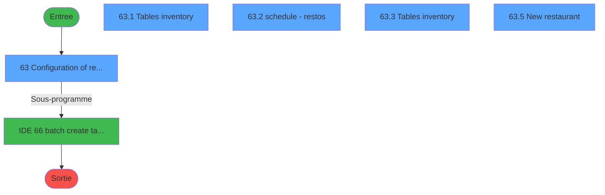
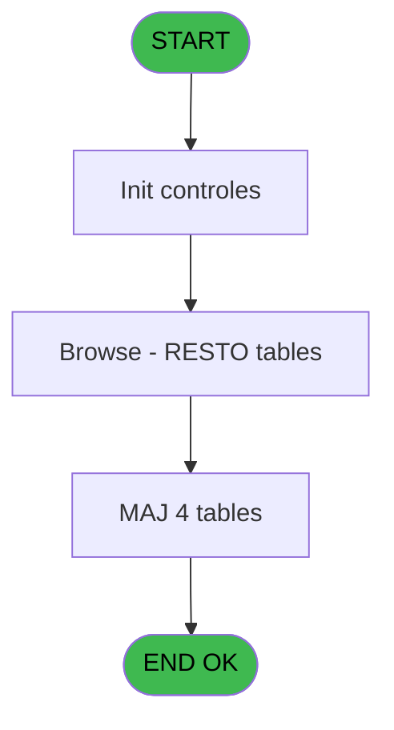
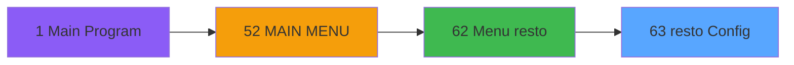
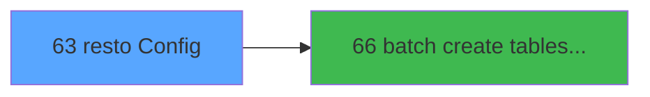

# REQ IDE 63 - resto Config

> **Analyse**: Phases 1-4 2026-02-03 20:34 -> 20:34 (16s) | Assemblage 20:34
> **Pipeline**: V7.2 Enrichi
> **Structure**: 4 onglets (Resume | Ecrans | Donnees | Connexions)

<!-- TAB:Resume -->

## 1. FICHE D'IDENTITE

| Attribut | Valeur |
|----------|--------|
| Projet | REQ |
| IDE Position | 63 |
| Nom Programme | resto Config |
| Fichier source | `Prg_63.xml` |
| Dossier IDE | Restaurant |
| Taches | 9 (5 ecrans visibles) |
| Tables modifiees | 4 |
| Programmes appeles | 1 |

## 2. DESCRIPTION FONCTIONNELLE

**resto Config** assure la gestion complete de ce processus, accessible depuis [Menu resto (IDE 62)](REQ-IDE-62.md).

Le flux de traitement s'organise en **2 blocs fonctionnels** :

- **Traitement** (7 taches) : traitements metier divers
- **Creation** (2 taches) : insertion d'enregistrements en base (mouvements, prestations)

**Donnees modifiees** : 4 tables en ecriture (resto_tables_tmp, gm_chambres, scelles, sessionsanalyse).

**Logique metier** : 1 regles identifiees couvrant conditions metier.

Detail : phases du traitement

#### Phase 1 : Traitement (7 taches)

- **63** - Configuration of restaurants **[[ECRAN]](#ecran-t1)**
- **63.1** - Tables inventory **[[ECRAN]](#ecran-t2)**
- **63.1.1** - count tables
- **63.2** - schedule - restos **[[ECRAN]](#ecran-t4)**
- **63.3** - Tables inventory **[[ECRAN]](#ecran-t5)**
- **63.3.1** - reset tables
- **63.5** - New restaurant **[[ECRAN]](#ecran-t9)**

#### Phase 2 : Creation (2 taches)

- **63.4** - create resto schedule
- **63.5.1** - create batch

Delegue a : [batch create tables schedule (IDE 66)](REQ-IDE-66.md)

#### Tables impactees

| Table | Operations | Role metier |
|-------|-----------|-------------|
| gm_chambres | **W**/L (4 usages) |  |
| sessionsanalyse | **W**/L (3 usages) | Sessions de caisse |
| scelles | R/**W** (2 usages) |  |
| resto_tables_tmp | **W** (2 usages) |  |

## 3. BLOCS FONCTIONNELS

### 3.1 Traitement (7 taches)

Traitements internes.

---

#### 63 - Configuration of restaurants [[ECRAN]](#ecran-t1)

**Role** : Tache d'orchestration : point d'entree du programme (7 sous-taches). Coordonne l'enchainement des traitements.
**Ecran** : 632 x 274 DLU (MDI) | [Voir mockup](#ecran-t1)

6 sous-taches directes

| Tache | Nom | Bloc |
|-------|-----|------|
| [63.1](#t2) | Tables inventory **[[ECRAN]](#ecran-t2)** | Traitement |
| [63.1.1](#t3) | count tables | Traitement |
| [63.2](#t4) | schedule - restos **[[ECRAN]](#ecran-t4)** | Traitement |
| [63.3](#t5) | Tables inventory **[[ECRAN]](#ecran-t5)** | Traitement |
| [63.3.1](#t6) | reset tables | Traitement |
| [63.5](#t9) | New restaurant **[[ECRAN]](#ecran-t9)** | Traitement |

---

#### 63.1 - Tables inventory [[ECRAN]](#ecran-t2)

**Role** : Traitement : Tables inventory.
**Ecran** : 316 x 166 DLU (MDI) | [Voir mockup](#ecran-t2)

---

#### 63.1.1 - count tables

**Role** : Traitement : count tables.

---

#### 63.2 - schedule - restos [[ECRAN]](#ecran-t4)

**Role** : Traitement : schedule - restos.
**Ecran** : 297 x 52 DLU (MDI) | [Voir mockup](#ecran-t4)
**Variables liees** : B (r.schedule resto), C (r.schedule table)
**Delegue a** : [batch create tables schedule (IDE 66)](REQ-IDE-66.md)

---

#### 63.3 - Tables inventory [[ECRAN]](#ecran-t5)

**Role** : Traitement : Tables inventory.
**Ecran** : 999 x 720 DLU (Modal) | [Voir mockup](#ecran-t5)

---

#### 63.3.1 - reset tables

**Role** : Traitement : reset tables.

---

#### 63.5 - New restaurant [[ECRAN]](#ecran-t9)

**Role** : Traitement : New restaurant.
**Ecran** : 260 x 119 DLU (MDI) | [Voir mockup](#ecran-t9)

### 3.2 Creation (2 taches)

Insertion de nouveaux enregistrements en base.

---

#### 63.4 - create resto schedule

**Role** : Traitement : create resto schedule.
**Variables liees** : B (r.schedule resto), C (r.schedule table)
**Delegue a** : [batch create tables schedule (IDE 66)](REQ-IDE-66.md)

---

#### 63.5.1 - create batch

**Role** : Traitement : create batch.
**Delegue a** : [batch create tables schedule (IDE 66)](REQ-IDE-66.md)

## 5. REGLES METIER

1 regles identifiees:

### Autres (1 regles)

#### [RM-001] Si Date ()=[D] alors 146 sinon 110)

| Element | Detail |
|---------|--------|
| **Condition** | `Date ()=[D]` |
| **Si vrai** | 146 |
| **Si faux** | 110) |
| **Expression source** | Expression 1 : `IF (Date ()=[D],146,110)` |
| **Exemple** | Si Date ()=[D] → 146. Sinon → 110) |

## 6. CONTEXTE

- **Appele par**: [Menu resto (IDE 62)](REQ-IDE-62.md)
- **Appelle**: 1 programmes | **Tables**: 4 (W:4 R:1 L:2) | **Taches**: 9 | **Expressions**: 10

<!-- TAB:Ecrans -->

## 8. ECRANS

### 8.1 Forms visibles (5 / 9)

| # | Position | Tache | Nom | Type | Largeur | Hauteur | Bloc |
|---|----------|-------|-----|------|---------|---------|------|
| 1 | 63 | 63 | Configuration of restaurants | MDI | 632 | 274 | Traitement |
| 2 | 63.1 | 63.1 | Tables inventory | MDI | 316 | 166 | Traitement |
| 3 | 63.2 | 63.2 | schedule - restos | MDI | 297 | 52 | Traitement |
| 4 | 63.3 | 63.3 | Tables inventory | Modal | 999 | 720 | Traitement |
| 5 | 63.5 | 63.5 | New restaurant | MDI | 260 | 119 | Traitement |

### 8.2 Mockups Ecrans

---

#### 63 - Configuration of restaurants
**Tache** : [63](#t1) | **Type** : MDI | **Dimensions** : 632 x 274 DLU
**Bloc** : Traitement | **Titre IDE** : Configuration of restaurants

<!-- FORM-DATA:
{
    "width":  632,
    "vFactor":  8,
    "type":  "MDI",
    "hFactor":  4,
    "controls":  [
                     {
                         "x":  0,
                         "type":  "label",
                         "var":  "",
                         "y":  0,
                         "w":  312,
                         "fmt":  "",
                         "name":  "",
                         "h":  19,
                         "color":  "180",
                         "text":  "General configuration",
                         "parent":  null
                     },
                     {
                         "x":  313,
                         "type":  "label",
                         "var":  "",
                         "y":  0,
                         "w":  14,
                         "fmt":  "",
                         "name":  "",
                         "h":  19,
                         "color":  "180",
                         "text":  "",
                         "parent":  null
                     },
                     {
                         "x":  328,
                         "type":  "label",
                         "var":  "",
                         "y":  0,
                         "w":  302,
                         "fmt":  "",
                         "name":  "",
                         "h":  19,
                         "color":  "180",
                         "text":  "Schedule",
                         "parent":  null
                     },
                     {
                         "x":  8,
                         "type":  "label",
                         "var":  "",
                         "y":  20,
                         "w":  615,
                         "fmt":  "",
                         "name":  "",
                         "h":  17,
                         "color":  "",
                         "text":  "List of restaurants",
                         "parent":  null
                     },
                     {
                         "x":  8,
                         "type":  "table",
                         "var":  "",
                         "name":  "",
                         "titleH":  13,
                         "color":  "110",
                         "w":  305,
                         "y":  37,
                         "fmt":  "",
                         "parent":  null,
                         "text":  "",
                         "rowH":  13,
                         "h":  38,
                         "cols":  [
                                      {
                                          "title":  "Code",
                                          "layer":  1,
                                          "w":  41
                                      },
                                      {
                                          "title":  "Restaurant name",
                                          "layer":  2,
                                          "w":  154
                                      },
                                      {
                                          "title":  "Total # of tables",
                                          "layer":  3,
                                          "w":  94
                                      }
                                  ],
                         "rows":  3
                     },
                     {
                         "x":  9,
                         "type":  "label",
                         "var":  "",
                         "y":  37,
                         "w":  305,
                         "fmt":  "",
                         "name":  "",
                         "h":  12,
                         "color":  "",
                         "text":  "",
                         "parent":  null
                     },
                     {
                         "x":  313,
                         "type":  "label",
                         "var":  "",
                         "y":  37,
                         "w":  16,
                         "fmt":  "",
                         "name":  "",
                         "h":  55,
                         "color":  "",
                         "text":  "",
                         "parent":  null
                     },
                     {
                         "x":  313,
                         "type":  "label",
                         "var":  "",
                         "y":  91,
                         "w":  16,
                         "fmt":  "",
                         "name":  "",
                         "h":  16,
                         "color":  "159",
                         "text":  "",
                         "parent":  null
                     },
                     {
                         "x":  314,
                         "type":  "label",
                         "var":  "",
                         "y":  107,
                         "w":  15,
                         "fmt":  "",
                         "name":  "",
                         "h":  152,
                         "color":  "",
                         "text":  "",
                         "parent":  null
                     },
                     {
                         "x":  0,
                         "type":  "label",
                         "var":  "",
                         "y":  256,
                         "w":  534,
                         "fmt":  "",
                         "name":  "",
                         "h":  15,
                         "color":  "",
                         "text":  "",
                         "parent":  null
                     },
                     {
                         "x":  11,
                         "type":  "edit",
                         "var":  "",
                         "y":  52,
                         "w":  35,
                         "fmt":  "5",
                         "name":  "resto id",
                         "h":  10,
                         "color":  "110",
                         "text":  "",
                         "parent":  6
                     },
                     {
                         "x":  53,
                         "type":  "edit",
                         "var":  "",
                         "y":  52,
                         "w":  116,
                         "fmt":  "",
                         "name":  "resto name",
                         "h":  10,
                         "color":  "110",
                         "text":  "",
                         "parent":  6
                     },
                     {
                         "x":  206,
                         "type":  "edit",
                         "var":  "",
                         "y":  52,
                         "w":  30,
                         "fmt":  "",
                         "name":  "",
                         "h":  10,
                         "color":  "110",
                         "text":  "",
                         "parent":  6
                     },
                     {
                         "x":  393,
                         "type":  "edit",
                         "var":  "",
                         "y":  20,
                         "w":  165,
                         "fmt":  "WWWWWWWWWWT   ##/##/####A",
                         "name":  "",
                         "h":  17,
                         "color":  "110",
                         "text":  "",
                         "parent":  null
                     },
                     {
                         "x":  329,
                         "type":  "button",
                         "var":  "",
                         "y":  21,
                         "w":  64,
                         "fmt":  "\u003c\u003c",
                         "name":  "-1",
                         "h":  15,
                         "color":  "",
                         "text":  "",
                         "parent":  null
                     },
                     {
                         "x":  558,
                         "type":  "button",
                         "var":  "",
                         "y":  21,
                         "w":  64,
                         "fmt":  "\u003e\u003e",
                         "name":  "+1",
                         "h":  15,
                         "color":  "",
                         "text":  "",
                         "parent":  null
                     },
                     {
                         "x":  202,
                         "type":  "button",
                         "var":  "",
                         "y":  75,
                         "w":  111,
                         "fmt":  "New restaurant",
                         "name":  "",
                         "h":  16,
                         "color":  "",
                         "text":  "",
                         "parent":  null
                     },
                     {
                         "x":  534,
                         "type":  "button",
                         "var":  "",
                         "y":  256,
                         "w":  96,
                         "fmt":  "Exit",
                         "name":  "",
                         "h":  15,
                         "color":  "",
                         "text":  "",
                         "parent":  null
                     },
                     {
                         "x":  0,
                         "type":  "subform",
                         "var":  "",
                         "y":  91,
                         "w":  313,
                         "fmt":  "",
                         "name":  "Browse - RESTO tables",
                         "h":  165,
                         "color":  "",
                         "text":  "",
                         "parent":  null
                     },
                     {
                         "x":  329,
                         "type":  "subform",
                         "var":  "",
                         "y":  36,
                         "w":  294,
                         "fmt":  "",
                         "name":  "schedule - restos",
                         "h":  50,
                         "color":  "",
                         "text":  "",
                         "parent":  null
                     },
                     {
                         "x":  329,
                         "type":  "subform",
                         "var":  "",
                         "y":  88,
                         "w":  302,
                         "fmt":  "",
                         "name":  "schedule - tables",
                         "h":  169,
                         "color":  "",
                         "text":  "",
                         "parent":  null
                     }
                 ],
    "taskId":  "63",
    "height":  274
}
-->

<strong>Champs : 4 champs</strong>

| Pos (x,y) | Nom | Variable | Type |
|-----------|-----|----------|------|
| 11,52 | resto id | - | edit |
| 53,52 | resto name | - | edit |
| 206,52 | (sans nom) | - | edit |
| 393,20 | WWWWWWWWWWT   ##/##/####A | - | edit |

<strong>Boutons : 4 boutons</strong>

| Bouton | Pos (x,y) | Action |
|--------|-----------|--------|
| << | 329,21 | Bouton fonctionnel |
| >> | 558,21 | Bouton fonctionnel |
| New restaurant | 202,75 | Bouton fonctionnel |
| Exit | 534,256 | Quitte le programme |

---

#### 63.1 - Tables inventory
**Tache** : [63.1](#t2) | **Type** : MDI | **Dimensions** : 316 x 166 DLU
**Bloc** : Traitement | **Titre IDE** : Tables inventory

<!-- FORM-DATA:
{
    "width":  316,
    "vFactor":  8,
    "type":  "MDI",
    "hFactor":  4,
    "controls":  [
                     {
                         "x":  3,
                         "type":  "label",
                         "var":  "",
                         "y":  0,
                         "w":  104,
                         "fmt":  "",
                         "name":  "",
                         "h":  16,
                         "color":  "159",
                         "text":  "Tables :",
                         "parent":  null
                     },
                     {
                         "x":  106,
                         "type":  "label",
                         "var":  "",
                         "y":  0,
                         "w":  206,
                         "fmt":  "",
                         "name":  "",
                         "h":  16,
                         "color":  "159",
                         "text":  "Inventory",
                         "parent":  null
                     },
                     {
                         "x":  2,
                         "type":  "table",
                         "var":  "",
                         "name":  "",
                         "titleH":  14,
                         "color":  "110",
                         "w":  311,
                         "y":  16,
                         "fmt":  "",
                         "parent":  null,
                         "text":  "",
                         "rowH":  14,
                         "h":  142,
                         "cols":  [
                                      {
                                          "title":  "Code",
                                          "layer":  1,
                                          "w":  29
                                      },
                                      {
                                          "title":  "Description",
                                          "layer":  2,
                                          "w":  94
                                      },
                                      {
                                          "title":  "Section",
                                          "layer":  3,
                                          "w":  76
                                      },
                                      {
                                          "title":  "Tables",
                                          "layer":  4,
                                          "w":  43
                                      },
                                      {
                                          "title":  "Max people",
                                          "layer":  5,
                                          "w":  50
                                      }
                                  ],
                         "rows":  5
                     },
                     {
                         "x":  6,
                         "type":  "edit",
                         "var":  "",
                         "y":  31,
                         "w":  23,
                         "fmt":  "",
                         "name":  "",
                         "h":  12,
                         "color":  "6",
                         "text":  "",
                         "parent":  3
                     },
                     {
                         "x":  35,
                         "type":  "edit",
                         "var":  "",
                         "y":  31,
                         "w":  89,
                         "fmt":  "",
                         "name":  "",
                         "h":  12,
                         "color":  "6",
                         "text":  "",
                         "parent":  3
                     },
                     {
                         "x":  130,
                         "type":  "combobox",
                         "var":  "",
                         "y":  32,
                         "w":  69,
                         "fmt":  "",
                         "name":  "",
                         "h":  12,
                         "color":  "6",
                         "text":  "SECTIONCOMBO",
                         "parent":  3
                     },
                     {
                         "x":  208,
                         "type":  "edit",
                         "var":  "",
                         "y":  31,
                         "w":  26,
                         "fmt":  "",
                         "name":  "",
                         "h":  12,
                         "color":  "6",
                         "text":  "",
                         "parent":  3
                     },
                     {
                         "x":  248,
                         "type":  "edit",
                         "var":  "",
                         "y":  31,
                         "w":  38,
                         "fmt":  "",
                         "name":  "",
                         "h":  12,
                         "color":  "6",
                         "text":  "",
                         "parent":  3
                     }
                 ],
    "taskId":  "63.1",
    "height":  166
}
-->

<strong>Champs : 5 champs</strong>

| Pos (x,y) | Nom | Variable | Type |
|-----------|-----|----------|------|
| 6,31 | (sans nom) | - | edit |
| 35,31 | (sans nom) | - | edit |
| 130,32 | SECTIONCOMBO | - | combobox |
| 208,31 | (sans nom) | - | edit |
| 248,31 | (sans nom) | - | edit |

---

#### 63.2 - schedule - restos
**Tache** : [63.2](#t4) | **Type** : MDI | **Dimensions** : 297 x 52 DLU
**Bloc** : Traitement | **Titre IDE** : schedule - restos

<!-- FORM-DATA:
{
    "width":  297,
    "vFactor":  8,
    "type":  "MDI",
    "hFactor":  4,
    "controls":  [
                     {
                         "x":  0,
                         "type":  "table",
                         "var":  "",
                         "name":  "",
                         "titleH":  13,
                         "color":  "110",
                         "w":  296,
                         "y":  0,
                         "fmt":  "",
                         "parent":  null,
                         "text":  "",
                         "rowH":  13,
                         "h":  27,
                         "cols":  [
                                      {
                                          "title":  "Max occupancy",
                                          "layer":  1,
                                          "w":  91
                                      },
                                      {
                                          "title":  "Shifts(min)",
                                          "layer":  2,
                                          "w":  49
                                      },
                                      {
                                          "title":  "People",
                                          "layer":  3,
                                          "w":  37
                                      },
                                      {
                                          "title":  "Open at",
                                          "layer":  4,
                                          "w":  46
                                      },
                                      {
                                          "title":  "Close at",
                                          "layer":  5,
                                          "w":  44
                                      },
                                      {
                                          "title":  "?",
                                          "layer":  6,
                                          "w":  24
                                      }
                                  ],
                         "rows":  6
                     },
                     {
                         "x":  10,
                         "type":  "edit",
                         "var":  "",
                         "y":  15,
                         "w":  30,
                         "fmt":  "",
                         "name":  "",
                         "h":  10,
                         "color":  "110",
                         "text":  "",
                         "parent":  1
                     },
                     {
                         "x":  102,
                         "type":  "edit",
                         "var":  "",
                         "y":  15,
                         "w":  30,
                         "fmt":  "",
                         "name":  "",
                         "h":  10,
                         "color":  "110",
                         "text":  "",
                         "parent":  1
                     },
                     {
                         "x":  149,
                         "type":  "edit",
                         "var":  "",
                         "y":  15,
                         "w":  30,
                         "fmt":  "",
                         "name":  "",
                         "h":  10,
                         "color":  "110",
                         "text":  "",
                         "parent":  1
                     },
                     {
                         "x":  186,
                         "type":  "edit",
                         "var":  "",
                         "y":  15,
                         "w":  35,
                         "fmt":  "",
                         "name":  "",
                         "h":  10,
                         "color":  "110",
                         "text":  "",
                         "parent":  1
                     },
                     {
                         "x":  228,
                         "type":  "edit",
                         "var":  "",
                         "y":  15,
                         "w":  31,
                         "fmt":  "",
                         "name":  "",
                         "h":  10,
                         "color":  "110",
                         "text":  "",
                         "parent":  1
                     },
                     {
                         "x":  272,
                         "type":  "checkbox",
                         "var":  "",
                         "y":  15,
                         "w":  15,
                         "fmt":  "",
                         "name":  "",
                         "h":  9,
                         "color":  "110",
                         "text":  "",
                         "parent":  1
                     }
                 ],
    "taskId":  "63.2",
    "height":  52
}
-->

<strong>Champs : 6 champs</strong>

| Pos (x,y) | Nom | Variable | Type |
|-----------|-----|----------|------|
| 10,15 | (sans nom) | - | edit |
| 102,15 | (sans nom) | - | edit |
| 149,15 | (sans nom) | - | edit |
| 186,15 | (sans nom) | - | edit |
| 228,15 | (sans nom) | - | edit |
| 272,15 | (sans nom) | - | checkbox |

---

#### 63.3 - Tables inventory
**Tache** : [63.3](#t5) | **Type** : Modal | **Dimensions** : 999 x 720 DLU
**Bloc** : Traitement | **Titre IDE** : Tables inventory

<!-- FORM-DATA:
{
    "width":  999,
    "vFactor":  100,
    "type":  "Modal",
    "hFactor":  100,
    "controls":  [
                     {
                         "x":  0,
                         "type":  "label",
                         "var":  "",
                         "y":  16,
                         "w":  978,
                         "fmt":  "",
                         "name":  "",
                         "h":  69,
                         "color":  "159",
                         "text":  "availability",
                         "parent":  null
                     },
                     {
                         "x":  0,
                         "type":  "table",
                         "var":  "",
                         "name":  "",
                         "titleH":  60,
                         "color":  "110",
                         "w":  272,
                         "y":  87,
                         "fmt":  "",
                         "parent":  null,
                         "text":  "",
                         "rowH":  56,
                         "h":  623,
                         "cols":  [
                                      {
                                          "title":  "Nb of tables",
                                          "layer":  1,
                                          "w":  213
                                      }
                                  ],
                         "rows":  1
                     },
                     {
                         "x":  0,
                         "type":  "label",
                         "var":  "",
                         "y":  85,
                         "w":  244,
                         "fmt":  "",
                         "name":  "",
                         "h":  59,
                         "color":  "",
                         "text":  "",
                         "parent":  null
                     },
                     {
                         "x":  329,
                         "type":  "label",
                         "var":  "",
                         "y":  221,
                         "w":  524,
                         "fmt":  "",
                         "name":  "",
                         "h":  45,
                         "color":  "6",
                         "text":  "Total number of tables available :",
                         "parent":  null
                     },
                     {
                         "x":  516,
                         "type":  "label",
                         "var":  "",
                         "y":  376,
                         "w":  255,
                         "fmt":  "",
                         "name":  "",
                         "h":  232,
                         "color":  "143",
                         "text":  "Enter the number of tables available for this date.",
                         "parent":  null
                     },
                     {
                         "x":  355,
                         "type":  "label",
                         "var":  "",
                         "y":  434,
                         "w":  93,
                         "fmt":  "",
                         "name":  "",
                         "h":  84,
                         "color":  "144",
                         "text":  "ß",
                         "parent":  null
                     },
                     {
                         "x":  19,
                         "type":  "edit",
                         "var":  "",
                         "y":  156,
                         "w":  168,
                         "fmt":  "",
                         "name":  "",
                         "h":  43,
                         "color":  "110",
                         "text":  "",
                         "parent":  2
                     },
                     {
                         "x":  870,
                         "type":  "edit",
                         "var":  "",
                         "y":  221,
                         "w":  98,
                         "fmt":  "",
                         "name":  "",
                         "h":  45,
                         "color":  "6",
                         "text":  "",
                         "parent":  null
                     },
                     {
                         "x":  717,
                         "type":  "button",
                         "var":  "",
                         "y":  21,
                         "w":  254,
                         "fmt":  "Reset",
                         "name":  "",
                         "h":  58,
                         "color":  "",
                         "text":  "",
                         "parent":  null
                     }
                 ],
    "taskId":  "63.3",
    "height":  720
}
-->

<strong>Champs : 2 champs</strong>

| Pos (x,y) | Nom | Variable | Type |
|-----------|-----|----------|------|
| 19,156 | (sans nom) | - | edit |
| 870,221 | (sans nom) | - | edit |

<strong>Boutons : 1 boutons</strong>

| Bouton | Pos (x,y) | Action |
|--------|-----------|--------|
| Reset | 717,21 | Bouton fonctionnel |

---

#### 63.5 - New restaurant
**Tache** : [63.5](#t9) | **Type** : MDI | **Dimensions** : 260 x 119 DLU
**Bloc** : Traitement | **Titre IDE** : New restaurant

<!-- FORM-DATA:
{
    "width":  260,
    "vFactor":  8,
    "type":  "MDI",
    "hFactor":  4,
    "controls":  [
                     {
                         "x":  0,
                         "type":  "label",
                         "var":  "",
                         "y":  0,
                         "w":  259,
                         "fmt":  "",
                         "name":  "",
                         "h":  40,
                         "color":  "6",
                         "text":  "",
                         "parent":  null
                     },
                     {
                         "x":  10,
                         "type":  "label",
                         "var":  "",
                         "y":  7,
                         "w":  140,
                         "fmt":  "",
                         "name":  "",
                         "h":  12,
                         "color":  "6",
                         "text":  "Restaurant creation",
                         "parent":  1
                     },
                     {
                         "x":  27,
                         "type":  "label",
                         "var":  "",
                         "y":  23,
                         "w":  187,
                         "fmt":  "",
                         "name":  "",
                         "h":  9,
                         "color":  "6",
                         "text":  "Create a restaurant with a code and a name",
                         "parent":  1
                     },
                     {
                         "x":  33,
                         "type":  "label",
                         "var":  "",
                         "y":  53,
                         "w":  49,
                         "fmt":  "",
                         "name":  "",
                         "h":  10,
                         "color":  "",
                         "text":  "Code",
                         "parent":  null
                     },
                     {
                         "x":  32,
                         "type":  "label",
                         "var":  "",
                         "y":  70,
                         "w":  49,
                         "fmt":  "",
                         "name":  "",
                         "h":  10,
                         "color":  "",
                         "text":  "Name",
                         "parent":  null
                     },
                     {
                         "x":  87,
                         "type":  "edit",
                         "var":  "",
                         "y":  52,
                         "w":  41,
                         "fmt":  "",
                         "name":  "",
                         "h":  12,
                         "color":  "110",
                         "text":  "",
                         "parent":  null
                     },
                     {
                         "x":  86,
                         "type":  "edit",
                         "var":  "",
                         "y":  70,
                         "w":  137,
                         "fmt":  "",
                         "name":  "",
                         "h":  12,
                         "color":  "110",
                         "text":  "",
                         "parent":  null
                     },
                     {
                         "x":  91,
                         "type":  "button",
                         "var":  "",
                         "y":  97,
                         "w":  84,
                         "fmt":  "Cancel",
                         "name":  "",
                         "h":  20,
                         "color":  "",
                         "text":  "",
                         "parent":  null
                     },
                     {
                         "x":  174,
                         "type":  "button",
                         "var":  "",
                         "y":  97,
                         "w":  84,
                         "fmt":  "Validate",
                         "name":  "",
                         "h":  20,
                         "color":  "",
                         "text":  "",
                         "parent":  null
                     },
                     {
                         "x":  221,
                         "type":  "image",
                         "var":  "",
                         "y":  5,
                         "w":  30,
                         "fmt":  "",
                         "name":  "",
                         "h":  21,
                         "color":  "",
                         "text":  "",
                         "parent":  null
                     }
                 ],
    "taskId":  "63.5",
    "height":  119
}
-->

<strong>Champs : 2 champs</strong>

| Pos (x,y) | Nom | Variable | Type |
|-----------|-----|----------|------|
| 87,52 | (sans nom) | - | edit |
| 86,70 | (sans nom) | - | edit |

<strong>Boutons : 2 boutons</strong>

| Bouton | Pos (x,y) | Action |
|--------|-----------|--------|
| Cancel | 91,97 | Annule et retour au menu |
| Validate | 174,97 | Valide la saisie et enregistre |

## 9. NAVIGATION

### 9.1 Enchainement des ecrans

**Detail par enchainement :**

| Depuis | Action | Vers | Retour |
|--------|--------|------|--------|
| Configuration of restaurants | Sous-programme | [batch create tables schedule (IDE 66)](REQ-IDE-66.md) | Retour ecran |

### 9.3 Structure hierarchique (9 taches)

| Position | Tache | Type | Dimensions | Bloc |
|----------|-------|------|------------|------|
| **63.1** | [**Configuration of restaurants** (63)](#t1) [mockup](#ecran-t1) | MDI | 632x274 | Traitement |
| 63.1.1 | [Tables inventory (63.1)](#t2) [mockup](#ecran-t2) | MDI | 316x166 | |
| 63.1.2 | [count tables (63.1.1)](#t3) | MDI | - | |
| 63.1.3 | [schedule - restos (63.2)](#t4) [mockup](#ecran-t4) | MDI | 297x52 | |
| 63.1.4 | [Tables inventory (63.3)](#t5) [mockup](#ecran-t5) | Modal | 999x720 | |
| 63.1.5 | [reset tables (63.3.1)](#t6) | MDI | - | |
| 63.1.6 | [New restaurant (63.5)](#t9) [mockup](#ecran-t9) | MDI | 260x119 | |
| **63.2** | [**create resto schedule** (63.4)](#t8) | MDI | - | Creation |
| 63.2.1 | [create batch (63.5.1)](#t10) | MDI | - | |

### 9.4 Algorigramme

> **Legende**: Vert = START/END OK | Rouge = END KO | Bleu = Decisions
> *Algorigramme auto-genere. Utiliser `/algorigramme` pour une synthese metier detaillee.*

<!-- TAB:Donnees -->

## 10. TABLES

### Tables utilisees (4)

| ID | Nom | Description | Type | R | W | L | Usages |
|----|-----|-------------|------|---|---|---|--------|
| 443 | resto_tables_tmp |  | DB |   | **W** |   | 2 |
| 446 | gm_chambres |  | DB |   | **W** | L | 4 |
| 447 | scelles |  | DB | R | **W** |   | 2 |
| 448 | sessionsanalyse | Sessions de caisse | DB |   | **W** | L | 3 |

### Colonnes par table (2 / 4 tables avec colonnes identifiees)

Table 443 - resto_tables_tmp (**W**) - 2 usages

| Lettre | Variable | Acces | Type |
|--------|----------|-------|------|
| A | v.date | W | Date |
| B | r.schedule resto | W | Logical |
| C | r.schedule table | W | Logical |

Table 446 - gm_chambres (**W**/L) - 4 usages

| Lettre | Variable | Acces | Type |
|--------|----------|-------|------|
| A | P.Resto_id | W | Alpha |
| B | P.Date | W | Date |

Table 447 - scelles (R/**W**) - 2 usages

*Table utilisee uniquement en Link ou aucune colonne Real identifiee dans le DataView.*

Table 448 - sessionsanalyse (**W**/L) - 3 usages

*Table utilisee uniquement en Link ou aucune colonne Real identifiee dans le DataView.*

## 11. VARIABLES

### 11.1 Variables de session (1)

Variables persistantes pendant toute la session.

| Lettre | Nom | Type | Usage dans |
|--------|-----|------|-----------|
| A | v.date | Date | 1x session |

### 11.2 Autres (2)

Variables diverses.

| Lettre | Nom | Type | Usage dans |
|--------|-----|------|-----------|
| B | r.schedule resto | Logical | - |
| C | r.schedule table | Logical | - |

## 12. EXPRESSIONS

**10 / 10 expressions decodees (100%)**

### 12.1 Repartition par type

| Type | Expressions | Regles |
|------|-------------|--------|
| CONDITION | 3 | 5 |
| DATE | 3 | 0 |
| OTHER | 2 | 0 |
| NEGATION | 2 | 0 |

### 12.2 Expressions cles par type

#### CONDITION (3 expressions)

| Type | IDE | Expression | Regle |
|------|-----|------------|-------|
| CONDITION | 1 | `IF (Date ()=[D],146,110)` | [RM-001](#rm-RM-001) |
| CONDITION | 5 | `InStr (LastClicked (),'+')>0` | - |
| CONDITION | 6 | `InStr (LastClicked (),'-')>0` | - |

#### DATE (3 expressions)

| Type | IDE | Expression | Regle |
|------|-----|------------|-------|
| DATE | 4 | `AddDate ([D],0,0,- (1))` | - |
| DATE | 3 | `AddDate ([D],0,0,1)` | - |
| DATE | 2 | `Date ()` | - |

#### OTHER (2 expressions)

| Type | IDE | Expression | Regle |
|------|-----|------------|-------|
| OTHER | 8 | `[D]` | - |
| OTHER | 7 | `v.date [A]` | - |

#### NEGATION (2 expressions)

| Type | IDE | Expression | Regle |
|------|-----|------------|-------|
| NEGATION | 10 | `NOT ([H])` | - |
| NEGATION | 9 | `NOT ([E])` | - |

<!-- TAB:Connexions -->

## 13. GRAPHE D'APPELS

### 13.1 Chaine depuis Main (Callers)

Main -> ... -> [Menu resto (IDE 62)](REQ-IDE-62.md) -> **resto Config (IDE 63)**

### 13.2 Callers

| IDE | Nom Programme | Nb Appels |
|-----|---------------|-----------|
| [62](REQ-IDE-62.md) | Menu resto | 1 |

### 13.3 Callees (programmes appeles)

### 13.4 Detail Callees avec contexte

| IDE | Nom Programme | Appels | Contexte |
|-----|---------------|--------|----------|
| [66](REQ-IDE-66.md) | batch create tables schedule | 2 | Sous-programme |

## 14. RECOMMANDATIONS MIGRATION

### 14.1 Profil du programme

| Metrique | Valeur | Impact migration |
|----------|--------|-----------------|
| Lignes de logique | 89 | Programme compact |
| Expressions | 10 | Peu de logique |
| Tables WRITE | 4 | Impact modere |
| Sous-programmes | 1 | Peu de dependances |
| Ecrans visibles | 5 | Quelques ecrans |
| Code desactive | 0% (0 / 89) | Code sain |
| Regles metier | 1 | Quelques regles a preserver |

### 14.2 Plan de migration par bloc

#### Traitement (7 taches: 5 ecrans, 2 traitements)

- **Strategie** : Orchestrateur avec 5 ecrans (Razor/React) et 2 traitements backend (services).
- Les ecrans deviennent des composants UI, les traitements invisibles deviennent des services injectables.
- 1 sous-programme(s) a migrer ou a reutiliser depuis les services existants.
- Decomposer les taches en services unitaires testables.

#### Creation (2 taches: 0 ecran, 2 traitements)

- **Strategie** : Repository pattern avec Entity Framework Core.
- Insertion via `IRepository<T>.CreateAsync()`

### 14.3 Dependances critiques

| Dependance | Type | Appels | Impact |
|------------|------|--------|--------|
| resto_tables_tmp | Table WRITE (Database) | 2x | Schema + repository |
| gm_chambres | Table WRITE (Database) | 3x | Schema + repository |
| scelles | Table WRITE (Database) | 1x | Schema + repository |
| sessionsanalyse | Table WRITE (Database) | 1x | Schema + repository |
| [batch create tables schedule (IDE 66)](REQ-IDE-66.md) | Sous-programme | 2x | Haute - Sous-programme |

---
*Spec DETAILED generee par Pipeline V7.2 - 2026-02-03 20:34*
