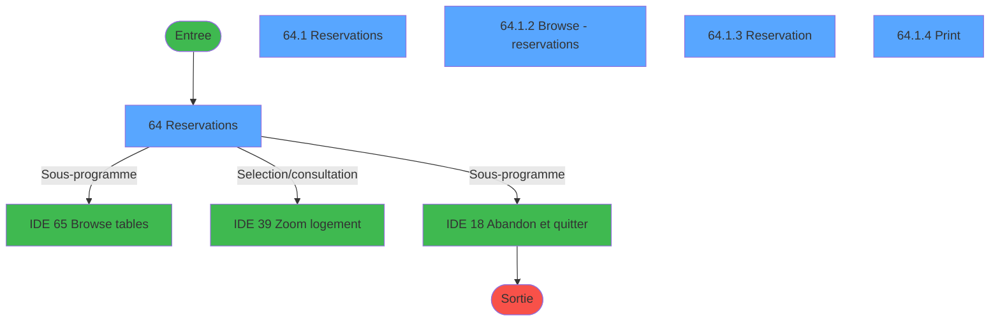
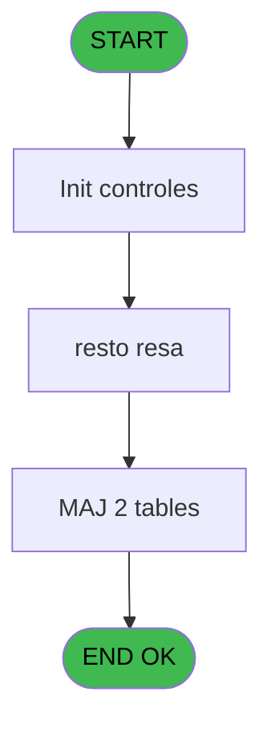
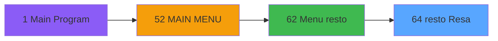
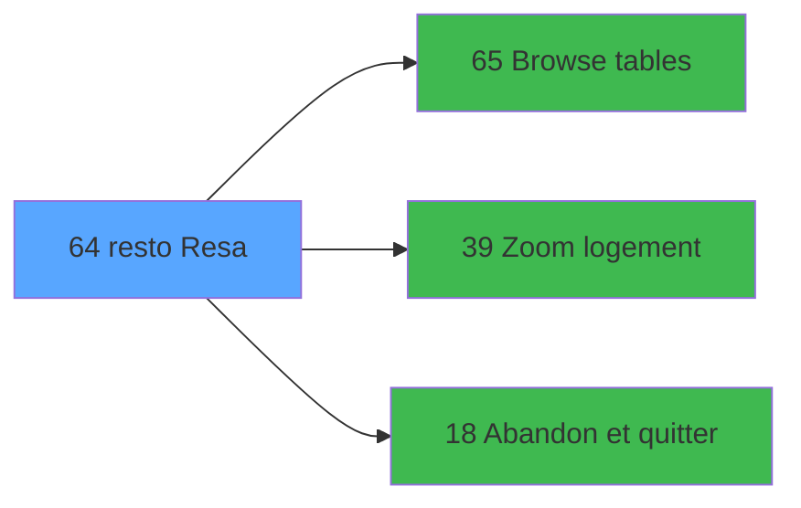

# REQ IDE 64 - resto Resa

> **Analyse**: Phases 1-4 2026-02-03 20:34 -> 20:34 (18s) | Assemblage 20:34
> **Pipeline**: V7.2 Enrichi
> **Structure**: 4 onglets (Resume | Ecrans | Donnees | Connexions)

<!-- TAB:Resume -->

## 1. FICHE D'IDENTITE

| Attribut | Valeur |
|----------|--------|
| Projet | REQ |
| IDE Position | 64 |
| Nom Programme | resto Resa |
| Fichier source | `Prg_64.xml` |
| Dossier IDE | Restaurant |
| Taches | 10 (5 ecrans visibles) |
| Tables modifiees | 2 |
| Programmes appeles | 3 |

## 2. DESCRIPTION FONCTIONNELLE

**resto Resa** assure la gestion complete de ce processus, accessible depuis [Menu resto (IDE 62)](REQ-IDE-62.md).

Le flux de traitement s'organise en **3 blocs fonctionnels** :

- **Traitement** (5 taches) : traitements metier divers
- **Calcul** (4 taches) : calculs de montants, stocks ou compteurs
- **Impression** (1 tache) : generation de tickets et documents

**Donnees modifiees** : 2 tables en ecriture (retour_chek_pabx, gm_chambres).

**Logique metier** : 2 regles identifiees couvrant conditions metier.

Detail : phases du traitement

#### Phase 1 : Traitement (5 taches)

- **64** - Reservations **[[ECRAN]](#ecran-t1)**
- **64.1** - Reservations **[[ECRAN]](#ecran-t2)**
- **64.1.2** - Browse - reservations **[[ECRAN]](#ecran-t4)**
- **64.1.3** - Reservation **[[ECRAN]](#ecran-t5)**
- **64.1.3.1** - Reservation **[[ECRAN]](#ecran-t6)**

Delegue a : [Browse tables (IDE 65)](REQ-IDE-65.md), [Abandon et quitter (IDE 18)](REQ-IDE-18.md)

#### Phase 2 : Calcul (4 taches)

- **64.1.1** - calculate tab **[[ECRAN]](#ecran-t3)**
- **64.1.5** - calculate availlability **[[ECRAN]](#ecran-t8)**
- **64.1.6** - calculate availlability **[[ECRAN]](#ecran-t9)**
- **64.1.7** - calculate availlability **[[ECRAN]](#ecran-t10)**

#### Phase 3 : Impression (1 tache)

- **64.1.4** - Print **[[ECRAN]](#ecran-t7)**

#### Tables impactees

| Table | Operations | Role metier |
|-------|-----------|-------------|
| retour_chek_pabx | R/**W** (6 usages) |  |
| gm_chambres | **W** (1 usages) |  |

## 3. BLOCS FONCTIONNELS

### 3.1 Traitement (5 taches)

Traitements internes.

---

#### 64 - Reservations [[ECRAN]](#ecran-t1)

**Role** : Traitement : Reservations.
**Ecran** : 621 x 274 DLU (MDI) | [Voir mockup](#ecran-t1)

4 sous-taches directes

| Tache | Nom | Bloc |
|-------|-----|------|
| [64.1](#t2) | Reservations **[[ECRAN]](#ecran-t2)** | Traitement |
| [64.1.2](#t4) | Browse - reservations **[[ECRAN]](#ecran-t4)** | Traitement |
| [64.1.3](#t5) | Reservation **[[ECRAN]](#ecran-t5)** | Traitement |
| [64.1.3.1](#t6) | Reservation **[[ECRAN]](#ecran-t6)** | Traitement |

**Delegue a** : [Browse tables (IDE 65)](REQ-IDE-65.md), [Abandon et quitter (IDE 18)](REQ-IDE-18.md)

---

#### 64.1 - Reservations [[ECRAN]](#ecran-t2)

**Role** : Traitement : Reservations.
**Ecran** : 622 x 251 DLU (MDI) | [Voir mockup](#ecran-t2)
**Delegue a** : [Browse tables (IDE 65)](REQ-IDE-65.md), [Abandon et quitter (IDE 18)](REQ-IDE-18.md)

---

#### 64.1.2 - Browse - reservations [[ECRAN]](#ecran-t4)

**Role** : Traitement : Browse - reservations.
**Ecran** : 611 x 136 DLU (Modal) | [Voir mockup](#ecran-t4)
**Delegue a** : [Browse tables (IDE 65)](REQ-IDE-65.md), [Abandon et quitter (IDE 18)](REQ-IDE-18.md)

---

#### 64.1.3 - Reservation [[ECRAN]](#ecran-t5)

**Role** : Traitement : Reservation.
**Ecran** : 262 x 258 DLU (MDI) | [Voir mockup](#ecran-t5)
**Delegue a** : [Browse tables (IDE 65)](REQ-IDE-65.md), [Abandon et quitter (IDE 18)](REQ-IDE-18.md)

---

#### 64.1.3.1 - Reservation [[ECRAN]](#ecran-t6)

**Role** : Traitement : Reservation.
**Ecran** : 150 x 72 DLU (MDI) | [Voir mockup](#ecran-t6)
**Delegue a** : [Browse tables (IDE 65)](REQ-IDE-65.md), [Abandon et quitter (IDE 18)](REQ-IDE-18.md)

### 3.2 Calcul (4 taches)

Calculs metier : montants, stocks, compteurs.

---

#### 64.1.1 - calculate tab [[ECRAN]](#ecran-t3)

**Role** : Calcul : calculate tab.
**Ecran** : 99 x 34 DLU (MDI) | [Voir mockup](#ecran-t3)

---

#### 64.1.5 - calculate availlability [[ECRAN]](#ecran-t8)

**Role** : Calcul : calculate availlability.
**Ecran** : 116 x 63 DLU (MDI) | [Voir mockup](#ecran-t8)

---

#### 64.1.6 - calculate availlability [[ECRAN]](#ecran-t9)

**Role** : Calcul : calculate availlability.
**Ecran** : 116 x 63 DLU (MDI) | [Voir mockup](#ecran-t9)

---

#### 64.1.7 - calculate availlability [[ECRAN]](#ecran-t10)

**Role** : Calcul : calculate availlability.
**Ecran** : 96 x 54 DLU (MDI) | [Voir mockup](#ecran-t10)

### 3.3 Impression (1 tache)

Generation des documents et tickets.

---

#### 64.1.4 - Print [[ECRAN]](#ecran-t7)

**Role** : Generation du document : Print.
**Ecran** : 220 x 70 DLU (Modal) | [Voir mockup](#ecran-t7)

## 5. REGLES METIER

2 regles identifiees:

### Autres (2 regles)

#### [RM-001] Si v.time shift TAB list [B]=Date () alors 180 sinon 110)

| Element | Detail |
|---------|--------|
| **Condition** | `v.time shift TAB list [B]=Date ()` |
| **Si vrai** | 180 |
| **Si faux** | 110) |
| **Variables** | A (v.time shift TAB), B (v.time shift TAB list) |
| **Expression source** | Expression 2 : `IF (v.time shift TAB list [B]=Date (),180,110)` |
| **Exemple** | Si v.time shift TAB list [B]=Date () → 180. Sinon → 110) |

#### [RM-002] Si v.color [C]-[M]>0 alors 13 sinon 12)

| Element | Detail |
|---------|--------|
| **Condition** | `v.color [C]-[M]>0` |
| **Si vrai** | 13 |
| **Si faux** | 12) |
| **Variables** | C (v.color) |
| **Expression source** | Expression 13 : `IF (v.color [C]-[M]>0,13,12)` |
| **Exemple** | Si v.color [C]-[M]>0 → 13. Sinon → 12) |

## 6. CONTEXTE

- **Appele par**: [Menu resto (IDE 62)](REQ-IDE-62.md)
- **Appelle**: 3 programmes | **Tables**: 4 (W:2 R:3 L:1) | **Taches**: 10 | **Expressions**: 17

<!-- TAB:Ecrans -->

## 8. ECRANS

### 8.1 Forms visibles (5 / 10)

| # | Position | Tache | Nom | Type | Largeur | Hauteur | Bloc |
|---|----------|-------|-----|------|---------|---------|------|
| 1 | 64 | 64 | Reservations | MDI | 621 | 274 | Traitement |
| 2 | 64.1 | 64.1 | Reservations | MDI | 622 | 251 | Traitement |
| 3 | 64.1.2 | 64.1.2 | Browse - reservations | Modal | 611 | 136 | Traitement |
| 4 | 64.1.3 | 64.1.3 | Reservation | MDI | 262 | 258 | Traitement |
| 5 | 64.1.4 | 64.1.4 | Print | Modal | 220 | 70 | Impression |

### 8.2 Mockups Ecrans

---

#### 64 - Reservations
**Tache** : [64](#t1) | **Type** : MDI | **Dimensions** : 621 x 274 DLU
**Bloc** : Traitement | **Titre IDE** : Reservations

<!-- FORM-DATA:
{
    "width":  621,
    "vFactor":  8,
    "type":  "MDI",
    "hFactor":  4,
    "controls":  [
                     {
                         "x":  183,
                         "type":  "label",
                         "var":  "",
                         "y":  82,
                         "w":  254,
                         "fmt":  "",
                         "name":  "",
                         "h":  17,
                         "color":  "",
                         "text":  "Restaurants",
                         "parent":  null
                     },
                     {
                         "x":  187,
                         "type":  "table",
                         "var":  "",
                         "name":  "",
                         "titleH":  12,
                         "color":  "110",
                         "w":  247,
                         "y":  101,
                         "fmt":  "",
                         "parent":  null,
                         "text":  "",
                         "rowH":  20,
                         "h":  144,
                         "cols":  [
                                      {
                                          "title":  "",
                                          "layer":  1,
                                          "w":  244
                                      }
                                  ],
                         "rows":  1
                     },
                     {
                         "x":  189,
                         "type":  "button",
                         "var":  "",
                         "y":  102,
                         "w":  244,
                         "fmt":  "",
                         "name":  "resto name",
                         "h":  19,
                         "color":  "",
                         "text":  "",
                         "parent":  3
                     },
                     {
                         "x":  18,
                         "type":  "image",
                         "var":  "",
                         "y":  16,
                         "w":  132,
                         "fmt":  "",
                         "name":  "",
                         "h":  72,
                         "color":  "",
                         "text":  "",
                         "parent":  null
                     },
                     {
                         "x":  543,
                         "type":  "button",
                         "var":  "",
                         "y":  256,
                         "w":  76,
                         "fmt":  "\u0026Exit",
                         "name":  "",
                         "h":  16,
                         "color":  "",
                         "text":  "",
                         "parent":  null
                     }
                 ],
    "taskId":  "64",
    "height":  274
}
-->

<strong>Boutons : 2 boutons</strong>

| Bouton | Pos (x,y) | Action |
|--------|-----------|--------|
| resto name | 189,102 | Bouton fonctionnel |
| Exit | 543,256 | Quitte le programme |

---

#### 64.1 - Reservations
**Tache** : [64.1](#t2) | **Type** : MDI | **Dimensions** : 622 x 251 DLU
**Bloc** : Traitement | **Titre IDE** : Reservations

<!-- FORM-DATA:
{
    "width":  622,
    "vFactor":  8,
    "type":  "MDI",
    "hFactor":  4,
    "controls":  [
                     {
                         "x":  1,
                         "type":  "label",
                         "var":  "",
                         "y":  7,
                         "w":  419,
                         "fmt":  "",
                         "name":  "",
                         "h":  61,
                         "color":  "",
                         "text":  "Restaurant configuration",
                         "parent":  null
                     },
                     {
                         "x":  156,
                         "type":  "line",
                         "var":  "",
                         "y":  17,
                         "w":  0,
                         "fmt":  "",
                         "name":  "",
                         "h":  45,
                         "color":  "",
                         "text":  "",
                         "parent":  null
                     },
                     {
                         "x":  13,
                         "type":  "label",
                         "var":  "",
                         "y":  19,
                         "w":  111,
                         "fmt":  "",
                         "name":  "",
                         "h":  9,
                         "color":  "",
                         "text":  "Maximum number of people",
                         "parent":  2
                     },
                     {
                         "x":  241,
                         "type":  "line",
                         "var":  "",
                         "y":  20,
                         "w":  0,
                         "fmt":  "",
                         "name":  "",
                         "h":  33,
                         "color":  "",
                         "text":  "",
                         "parent":  2
                     },
                     {
                         "x":  249,
                         "type":  "label",
                         "var":  "",
                         "y":  22,
                         "w":  165,
                         "fmt":  "",
                         "name":  "",
                         "h":  14,
                         "color":  "2",
                         "text":  "  Availlability :",
                         "parent":  2
                     },
                     {
                         "x":  379,
                         "type":  "label",
                         "var":  "",
                         "y":  24,
                         "w":  34,
                         "fmt":  "",
                         "name":  "",
                         "h":  10,
                         "color":  "143",
                         "text":  "FULL",
                         "parent":  2
                     },
                     {
                         "x":  163,
                         "type":  "label",
                         "var":  "",
                         "y":  26,
                         "w":  37,
                         "fmt":  "",
                         "name":  "",
                         "h":  10,
                         "color":  "",
                         "text":  "Open at :",
                         "parent":  2
                     },
                     {
                         "x":  13,
                         "type":  "label",
                         "var":  "",
                         "y":  30,
                         "w":  111,
                         "fmt":  "",
                         "name":  "",
                         "h":  9,
                         "color":  "",
                         "text":  "Total number of tables",
                         "parent":  2
                     },
                     {
                         "x":  163,
                         "type":  "label",
                         "var":  "",
                         "y":  40,
                         "w":  37,
                         "fmt":  "",
                         "name":  "",
                         "h":  10,
                         "color":  "",
                         "text":  "Close at :",
                         "parent":  2
                     },
                     {
                         "x":  13,
                         "type":  "label",
                         "var":  "",
                         "y":  42,
                         "w":  111,
                         "fmt":  "",
                         "name":  "",
                         "h":  9,
                         "color":  "",
                         "text":  "Booking shift (minutes)",
                         "parent":  2
                     },
                     {
                         "x":  13,
                         "type":  "label",
                         "var":  "",
                         "y":  54,
                         "w":  111,
                         "fmt":  "",
                         "name":  "",
                         "h":  9,
                         "color":  "",
                         "text":  "Maximum # people per shift",
                         "parent":  2
                     },
                     {
                         "x":  113,
                         "type":  "edit",
                         "var":  "",
                         "y":  68,
                         "w":  196,
                         "fmt":  "WWWWWWWWWWT   ##/##/####A",
                         "name":  "date",
                         "h":  16,
                         "color":  "110",
                         "text":  "",
                         "parent":  null
                     },
                     {
                         "x":  123,
                         "type":  "edit",
                         "var":  "",
                         "y":  19,
                         "w":  25,
                         "fmt":  "",
                         "name":  "",
                         "h":  9,
                         "color":  "142",
                         "text":  "",
                         "parent":  2
                     },
                     {
                         "x":  123,
                         "type":  "edit",
                         "var":  "",
                         "y":  30,
                         "w":  25,
                         "fmt":  "",
                         "name":  "",
                         "h":  9,
                         "color":  "142",
                         "text":  "",
                         "parent":  2
                     },
                     {
                         "x":  123,
                         "type":  "edit",
                         "var":  "",
                         "y":  42,
                         "w":  25,
                         "fmt":  "",
                         "name":  "",
                         "h":  9,
                         "color":  "142",
                         "text":  "",
                         "parent":  2
                     },
                     {
                         "x":  123,
                         "type":  "edit",
                         "var":  "",
                         "y":  54,
                         "w":  25,
                         "fmt":  "",
                         "name":  "",
                         "h":  9,
                         "color":  "142",
                         "text":  "",
                         "parent":  2
                     },
                     {
                         "x":  203,
                         "type":  "edit",
                         "var":  "",
                         "y":  26,
                         "w":  31,
                         "fmt":  "",
                         "name":  "",
                         "h":  10,
                         "color":  "142",
                         "text":  "",
                         "parent":  2
                     },
                     {
                         "x":  203,
                         "type":  "edit",
                         "var":  "",
                         "y":  40,
                         "w":  31,
                         "fmt":  "",
                         "name":  "",
                         "h":  10,
                         "color":  "142",
                         "text":  "",
                         "parent":  2
                     },
                     {
                         "x":  1,
                         "type":  "tab",
                         "var":  "",
                         "y":  92,
                         "w":  619,
                         "fmt":  "",
                         "name":  "v.time shift TAB",
                         "h":  157,
                         "color":  "",
                         "text":  "times",
                         "parent":  null
                     },
                     {
                         "x":  438,
                         "type":  "edit",
                         "var":  "",
                         "y":  1,
                         "w":  167,
                         "fmt":  "",
                         "name":  "",
                         "h":  10,
                         "color":  "142",
                         "text":  "",
                         "parent":  null
                     },
                     {
                         "x":  440,
                         "type":  "image",
                         "var":  "",
                         "y":  13,
                         "w":  151,
                         "fmt":  "",
                         "name":  "",
                         "h":  80,
                         "color":  "",
                         "text":  "",
                         "parent":  null
                     },
                     {
                         "x":  321,
                         "type":  "edit",
                         "var":  "",
                         "y":  24,
                         "w":  55,
                         "fmt":  "N4 people",
                         "name":  "",
                         "h":  10,
                         "color":  "2",
                         "text":  "",
                         "parent":  2
                     },
                     {
                         "x":  249,
                         "type":  "button",
                         "var":  "",
                         "y":  39,
                         "w":  165,
                         "fmt":  "availability",
                         "name":  "",
                         "h":  16,
                         "color":  "",
                         "text":  "",
                         "parent":  null
                     },
                     {
                         "x":  1,
                         "type":  "button",
                         "var":  "",
                         "y":  68,
                         "w":  111,
                         "fmt":  "\u003c\u003c",
                         "name":  "-1",
                         "h":  16,
                         "color":  "",
                         "text":  "",
                         "parent":  null
                     },
                     {
                         "x":  310,
                         "type":  "button",
                         "var":  "",
                         "y":  68,
                         "w":  110,
                         "fmt":  "\u003e\u003e",
                         "name":  "+1",
                         "h":  16,
                         "color":  "",
                         "text":  "",
                         "parent":  null
                     },
                     {
                         "x":  599,
                         "type":  "button",
                         "var":  "",
                         "y":  76,
                         "w":  20,
                         "fmt":  "",
                         "name":  "PRINT",
                         "h":  16,
                         "color":  "",
                         "text":  "",
                         "parent":  null
                     }
                 ],
    "taskId":  "64.1",
    "height":  251
}
-->

<strong>Champs : 9 champs</strong>

| Pos (x,y) | Nom | Variable | Type |
|-----------|-----|----------|------|
| 113,68 | date | - | edit |
| 123,19 | (sans nom) | - | edit |
| 123,30 | (sans nom) | - | edit |
| 123,42 | (sans nom) | - | edit |
| 123,54 | (sans nom) | - | edit |
| 203,26 | (sans nom) | - | edit |
| 203,40 | (sans nom) | - | edit |
| 438,1 | (sans nom) | - | edit |
| 321,24 | N4 people | - | edit |

<strong>Boutons : 4 boutons</strong>

| Bouton | Pos (x,y) | Action |
|--------|-----------|--------|
| availability | 249,39 | Bouton fonctionnel |
| << | 1,68 | Bouton fonctionnel |
| >> | 310,68 | Bouton fonctionnel |
| PRINT | 599,76 | Lance l'impression |

---

#### 64.1.2 - Browse - reservations
**Tache** : [64.1.2](#t4) | **Type** : Modal | **Dimensions** : 611 x 136 DLU
**Bloc** : Traitement | **Titre IDE** : Browse - reservations

<!-- FORM-DATA:
{
    "width":  611,
    "vFactor":  8,
    "type":  "Modal",
    "hFactor":  4,
    "controls":  [
                     {
                         "x":  0,
                         "type":  "table",
                         "var":  "",
                         "name":  "",
                         "titleH":  13,
                         "color":  "110",
                         "w":  609,
                         "y":  3,
                         "fmt":  "",
                         "parent":  null,
                         "text":  "",
                         "rowH":  14,
                         "h":  109,
                         "cols":  [
                                      {
                                          "title":  "Room #",
                                          "layer":  1,
                                          "w":  46
                                      },
                                      {
                                          "title":  "Name",
                                          "layer":  2,
                                          "w":  114
                                      },
                                      {
                                          "title":  "# guests",
                                          "layer":  3,
                                          "w":  43
                                      },
                                      {
                                          "title":  "Section",
                                          "layer":  4,
                                          "w":  67
                                      },
                                      {
                                          "title":  "Table Id.",
                                          "layer":  5,
                                          "w":  41
                                      },
                                      {
                                          "title":  "Comments",
                                          "layer":  6,
                                          "w":  191
                                      },
                                      {
                                          "title":  "User",
                                          "layer":  7,
                                          "w":  56
                                      },
                                      {
                                          "title":  "Time",
                                          "layer":  8,
                                          "w":  34
                                      }
                                  ],
                         "rows":  8
                     },
                     {
                         "x":  0,
                         "type":  "label",
                         "var":  "",
                         "y":  119,
                         "w":  177,
                         "fmt":  "",
                         "name":  "",
                         "h":  14,
                         "color":  "",
                         "text":  " Shift availlability :",
                         "parent":  null
                     },
                     {
                         "x":  184,
                         "type":  "label",
                         "var":  "",
                         "y":  119,
                         "w":  192,
                         "fmt":  "",
                         "name":  "",
                         "h":  14,
                         "color":  "",
                         "text":  " Nb of people booked on this shift :",
                         "parent":  null
                     },
                     {
                         "x":  4,
                         "type":  "edit",
                         "var":  "",
                         "y":  19,
                         "w":  38,
                         "fmt":  "",
                         "name":  "room #",
                         "h":  9,
                         "color":  "110",
                         "text":  "",
                         "parent":  1
                     },
                     {
                         "x":  50,
                         "type":  "edit",
                         "var":  "",
                         "y":  19,
                         "w":  106,
                         "fmt":  "",
                         "name":  "name",
                         "h":  9,
                         "color":  "110",
                         "text":  "",
                         "parent":  1
                     },
                     {
                         "x":  164,
                         "type":  "edit",
                         "var":  "",
                         "y":  19,
                         "w":  34,
                         "fmt":  "4Z",
                         "name":  "number of persons",
                         "h":  9,
                         "color":  "110",
                         "text":  "",
                         "parent":  1
                     },
                     {
                         "x":  206,
                         "type":  "combobox",
                         "var":  "",
                         "y":  18,
                         "w":  61,
                         "fmt":  "",
                         "name":  "section",
                         "h":  12,
                         "color":  "110",
                         "text":  "SECTIONCOMBO",
                         "parent":  1
                     },
                     {
                         "x":  277,
                         "type":  "edit",
                         "var":  "",
                         "y":  19,
                         "w":  25,
                         "fmt":  "",
                         "name":  "table id",
                         "h":  9,
                         "color":  "110",
                         "text":  "",
                         "parent":  1
                     },
                     {
                         "x":  315,
                         "type":  "edit",
                         "var":  "",
                         "y":  19,
                         "w":  184,
                         "fmt":  "",
                         "name":  "comments",
                         "h":  9,
                         "color":  "110",
                         "text":  "",
                         "parent":  1
                     },
                     {
                         "x":  504,
                         "type":  "edit",
                         "var":  "",
                         "y":  19,
                         "w":  53,
                         "fmt":  "",
                         "name":  "",
                         "h":  9,
                         "color":  "110",
                         "text":  "",
                         "parent":  1
                     },
                     {
                         "x":  561,
                         "type":  "edit",
                         "var":  "",
                         "y":  19,
                         "w":  28,
                         "fmt":  "HH:MM",
                         "name":  "",
                         "h":  9,
                         "color":  "110",
                         "text":  "",
                         "parent":  1
                     },
                     {
                         "x":  381,
                         "type":  "button",
                         "var":  "",
                         "y":  118,
                         "w":  76,
                         "fmt":  "\u0026Create",
                         "name":  "",
                         "h":  16,
                         "color":  "",
                         "text":  "",
                         "parent":  null
                     },
                     {
                         "x":  456,
                         "type":  "button",
                         "var":  "",
                         "y":  118,
                         "w":  76,
                         "fmt":  "\u0026Modify",
                         "name":  "",
                         "h":  16,
                         "color":  "",
                         "text":  "",
                         "parent":  null
                     },
                     {
                         "x":  531,
                         "type":  "button",
                         "var":  "",
                         "y":  118,
                         "w":  76,
                         "fmt":  "\u0026Delete",
                         "name":  "Delete",
                         "h":  16,
                         "color":  "",
                         "text":  "",
                         "parent":  null
                     },
                     {
                         "x":  86,
                         "type":  "edit",
                         "var":  "",
                         "y":  121,
                         "w":  51,
                         "fmt":  "N4  people",
                         "name":  "",
                         "h":  10,
                         "color":  "",
                         "text":  "",
                         "parent":  null
                     },
                     {
                         "x":  142,
                         "type":  "edit",
                         "var":  "",
                         "y":  121,
                         "w":  29,
                         "fmt":  "30",
                         "name":  "",
                         "h":  10,
                         "color":  "143",
                         "text":  "",
                         "parent":  null
                     },
                     {
                         "x":  347,
                         "type":  "edit",
                         "var":  "",
                         "y":  121,
                         "w":  23,
                         "fmt":  "",
                         "name":  "",
                         "h":  10,
                         "color":  "",
                         "text":  "",
                         "parent":  null
                     }
                 ],
    "taskId":  "64.1.2",
    "height":  136
}
-->

<strong>Champs : 11 champs</strong>

| Pos (x,y) | Nom | Variable | Type |
|-----------|-----|----------|------|
| 4,19 | room # | - | edit |
| 50,19 | name | - | edit |
| 164,19 | number of persons | - | edit |
| 206,18 | section | - | combobox |
| 277,19 | table id | - | edit |
| 315,19 | comments | - | edit |
| 504,19 | (sans nom) | - | edit |
| 561,19 | HH:MM | - | edit |
| 86,121 | N4  people | - | edit |
| 142,121 | 30 | - | edit |
| 347,121 | (sans nom) | - | edit |

<strong>Boutons : 3 boutons</strong>

| Bouton | Pos (x,y) | Action |
|--------|-----------|--------|
| Create | 381,118 | Bouton fonctionnel |
| Modify | 456,118 | Modifie l'element |
| Delete | 531,118 | Supprime l'element selectionne |

---

#### 64.1.3 - Reservation
**Tache** : [64.1.3](#t5) | **Type** : MDI | **Dimensions** : 262 x 258 DLU
**Bloc** : Traitement | **Titre IDE** : Reservation

<!-- FORM-DATA:
{
    "width":  262,
    "vFactor":  8,
    "type":  "MDI",
    "hFactor":  4,
    "controls":  [
                     {
                         "x":  0,
                         "type":  "label",
                         "var":  "",
                         "y":  0,
                         "w":  259,
                         "fmt":  "",
                         "name":  "",
                         "h":  40,
                         "color":  "6",
                         "text":  "",
                         "parent":  null
                     },
                     {
                         "x":  10,
                         "type":  "label",
                         "var":  "",
                         "y":  7,
                         "w":  140,
                         "fmt":  "",
                         "name":  "",
                         "h":  12,
                         "color":  "6",
                         "text":  "Reservation booking",
                         "parent":  1
                     },
                     {
                         "x":  27,
                         "type":  "label",
                         "var":  "",
                         "y":  23,
                         "w":  187,
                         "fmt":  "",
                         "name":  "",
                         "h":  9,
                         "color":  "6",
                         "text":  "Book a reservation by filling the following fields",
                         "parent":  1
                     },
                     {
                         "x":  41,
                         "type":  "label",
                         "var":  "",
                         "y":  43,
                         "w":  177,
                         "fmt":  "",
                         "name":  "",
                         "h":  14,
                         "color":  "",
                         "text":  "Shift availlability :",
                         "parent":  null
                     },
                     {
                         "x":  180,
                         "type":  "label",
                         "var":  "",
                         "y":  45,
                         "w":  28,
                         "fmt":  "",
                         "name":  "",
                         "h":  10,
                         "color":  "143",
                         "text":  "FULL",
                         "parent":  null
                     },
                     {
                         "x":  0,
                         "type":  "line",
                         "var":  "",
                         "y":  60,
                         "w":  259,
                         "fmt":  "",
                         "name":  "",
                         "h":  0,
                         "color":  "",
                         "text":  "",
                         "parent":  null
                     },
                     {
                         "x":  45,
                         "type":  "label",
                         "var":  "",
                         "y":  73,
                         "w":  50,
                         "fmt":  "",
                         "name":  "",
                         "h":  11,
                         "color":  "",
                         "text":  "Room #",
                         "parent":  null
                     },
                     {
                         "x":  45,
                         "type":  "label",
                         "var":  "",
                         "y":  88,
                         "w":  50,
                         "fmt":  "",
                         "name":  "",
                         "h":  11,
                         "color":  "",
                         "text":  "Name",
                         "parent":  null
                     },
                     {
                         "x":  45,
                         "type":  "label",
                         "var":  "",
                         "y":  108,
                         "w":  50,
                         "fmt":  "",
                         "name":  "",
                         "h":  11,
                         "color":  "",
                         "text":  "# guests",
                         "parent":  null
                     },
                     {
                         "x":  45,
                         "type":  "label",
                         "var":  "",
                         "y":  133,
                         "w":  50,
                         "fmt":  "",
                         "name":  "",
                         "h":  11,
                         "color":  "",
                         "text":  "Section",
                         "parent":  null
                     },
                     {
                         "x":  45,
                         "type":  "label",
                         "var":  "",
                         "y":  168,
                         "w":  50,
                         "fmt":  "",
                         "name":  "",
                         "h":  11,
                         "color":  "",
                         "text":  "Table",
                         "parent":  null
                     },
                     {
                         "x":  45,
                         "type":  "label",
                         "var":  "",
                         "y":  189,
                         "w":  50,
                         "fmt":  "",
                         "name":  "",
                         "h":  10,
                         "color":  "",
                         "text":  "Comments",
                         "parent":  null
                     },
                     {
                         "x":  0,
                         "type":  "line",
                         "var":  "",
                         "y":  234,
                         "w":  259,
                         "fmt":  "",
                         "name":  "",
                         "h":  0,
                         "color":  "",
                         "text":  "",
                         "parent":  null
                     },
                     {
                         "x":  88,
                         "type":  "edit",
                         "var":  "",
                         "y":  73,
                         "w":  38,
                         "fmt":  "",
                         "name":  "",
                         "h":  11,
                         "color":  "110",
                         "text":  "",
                         "parent":  null
                     },
                     {
                         "x":  127,
                         "type":  "button",
                         "var":  "",
                         "y":  70,
                         "w":  20,
                         "fmt":  "",
                         "name":  "bt.room",
                         "h":  15,
                         "color":  "",
                         "text":  "",
                         "parent":  null
                     },
                     {
                         "x":  88,
                         "type":  "edit",
                         "var":  "",
                         "y":  88,
                         "w":  106,
                         "fmt":  "",
                         "name":  "v.name",
                         "h":  11,
                         "color":  "110",
                         "text":  "",
                         "parent":  null
                     },
                     {
                         "x":  88,
                         "type":  "edit",
                         "var":  "",
                         "y":  108,
                         "w":  38,
                         "fmt":  "",
                         "name":  "v.nb people",
                         "h":  11,
                         "color":  "110",
                         "text":  "",
                         "parent":  null
                     },
                     {
                         "x":  88,
                         "type":  "combobox",
                         "var":  "",
                         "y":  133,
                         "w":  106,
                         "fmt":  "",
                         "name":  "v.section",
                         "h":  12,
                         "color":  "110",
                         "text":  "SECTIONCOMBO",
                         "parent":  null
                     },
                     {
                         "x":  88,
                         "type":  "edit",
                         "var":  "",
                         "y":  168,
                         "w":  38,
                         "fmt":  "",
                         "name":  "Table Id",
                         "h":  11,
                         "color":  "110",
                         "text":  "",
                         "parent":  null
                     },
                     {
                         "x":  127,
                         "type":  "button",
                         "var":  "",
                         "y":  166,
                         "w":  20,
                         "fmt":  "",
                         "name":  "bt.table",
                         "h":  15,
                         "color":  "",
                         "text":  "",
                         "parent":  null
                     },
                     {
                         "x":  45,
                         "type":  "edit",
                         "var":  "",
                         "y":  200,
                         "w":  184,
                         "fmt":  "",
                         "name":  "v.comment",
                         "h":  29,
                         "color":  "110",
                         "text":  "",
                         "parent":  null
                     },
                     {
                         "x":  221,
                         "type":  "image",
                         "var":  "",
                         "y":  5,
                         "w":  30,
                         "fmt":  "",
                         "name":  "",
                         "h":  21,
                         "color":  "",
                         "text":  "",
                         "parent":  null
                     },
                     {
                         "x":  127,
                         "type":  "edit",
                         "var":  "",
                         "y":  45,
                         "w":  51,
                         "fmt":  "N4  people",
                         "name":  "",
                         "h":  10,
                         "color":  "",
                         "text":  "",
                         "parent":  null
                     },
                     {
                         "x":  105,
                         "type":  "button",
                         "var":  "",
                         "y":  238,
                         "w":  76,
                         "fmt":  "\u0026Cancel",
                         "name":  "b.Annule \u0026 Quitte",
                         "h":  16,
                         "color":  "",
                         "text":  "",
                         "parent":  null
                     },
                     {
                         "x":  180,
                         "type":  "button",
                         "var":  "",
                         "y":  238,
                         "w":  76,
                         "fmt":  "\u0026Validate",
                         "name":  "b . Validate",
                         "h":  16,
                         "color":  "",
                         "text":  "",
                         "parent":  null
                     }
                 ],
    "taskId":  "64.1.3",
    "height":  258
}
-->

<strong>Champs : 7 champs</strong>

| Pos (x,y) | Nom | Variable | Type |
|-----------|-----|----------|------|
| 88,73 | (sans nom) | - | edit |
| 88,88 | v.name | - | edit |
| 88,108 | v.nb people | - | edit |
| 88,133 | v.section | - | combobox |
| 88,168 | Table Id | - | edit |
| 45,200 | v.comment | - | edit |
| 127,45 | N4  people | - | edit |

<strong>Boutons : 4 boutons</strong>

| Bouton | Pos (x,y) | Action |
|--------|-----------|--------|
| bt.room | 127,70 | Bouton fonctionnel |
| bt.table | 127,166 | Bouton fonctionnel |
| Cancel | 105,238 | Annule et retour au menu |
| Validate | 180,238 | Valide la saisie et enregistre |

---

#### 64.1.4 - Print
**Tache** : [64.1.4](#t7) | **Type** : Modal | **Dimensions** : 220 x 70 DLU
**Bloc** : Impression | **Titre IDE** : Print

<!-- FORM-DATA:
{
    "width":  220,
    "vFactor":  8,
    "type":  "Modal",
    "hFactor":  4,
    "controls":  [
                     {
                         "x":  69,
                         "type":  "label",
                         "var":  "",
                         "y":  17,
                         "w":  83,
                         "fmt":  "",
                         "name":  "",
                         "h":  13,
                         "color":  "",
                         "text":  "Running ...",
                         "parent":  null
                     },
                     {
                         "x":  72,
                         "type":  "edit",
                         "var":  "",
                         "y":  35,
                         "w":  77,
                         "fmt":  "4",
                         "name":  "",
                         "h":  10,
                         "color":  "6",
                         "text":  "",
                         "parent":  null
                     }
                 ],
    "taskId":  "64.1.4",
    "height":  70
}
-->

<strong>Champs : 1 champs</strong>

| Pos (x,y) | Nom | Variable | Type |
|-----------|-----|----------|------|
| 72,35 | 4 | - | edit |

## 9. NAVIGATION

### 9.1 Enchainement des ecrans

**Detail par enchainement :**

| Depuis | Action | Vers | Retour |
|--------|--------|------|--------|
| Reservations | Sous-programme | [Browse tables (IDE 65)](REQ-IDE-65.md) | Retour ecran |
| Reservations | Selection/consultation | [Zoom logement (IDE 39)](REQ-IDE-39.md) | Retour ecran |
| Reservations | Sous-programme | [Abandon et quitter (IDE 18)](REQ-IDE-18.md) | Retour ecran |

### 9.3 Structure hierarchique (10 taches)

| Position | Tache | Type | Dimensions | Bloc |
|----------|-------|------|------------|------|
| **64.1** | [**Reservations** (64)](#t1) [mockup](#ecran-t1) | MDI | 621x274 | Traitement |
| 64.1.1 | [Reservations (64.1)](#t2) [mockup](#ecran-t2) | MDI | 622x251 | |
| 64.1.2 | [Browse - reservations (64.1.2)](#t4) [mockup](#ecran-t4) | Modal | 611x136 | |
| 64.1.3 | [Reservation (64.1.3)](#t5) [mockup](#ecran-t5) | MDI | 262x258 | |
| 64.1.4 | [Reservation (64.1.3.1)](#t6) [mockup](#ecran-t6) | MDI | 150x72 | |
| **64.2** | [**calculate tab** (64.1.1)](#t3) [mockup](#ecran-t3) | MDI | 99x34 | Calcul |
| 64.2.1 | [calculate availlability (64.1.5)](#t8) [mockup](#ecran-t8) | MDI | 116x63 | |
| 64.2.2 | [calculate availlability (64.1.6)](#t9) [mockup](#ecran-t9) | MDI | 116x63 | |
| 64.2.3 | [calculate availlability (64.1.7)](#t10) [mockup](#ecran-t10) | MDI | 96x54 | |
| **64.3** | [**Print** (64.1.4)](#t7) [mockup](#ecran-t7) | Modal | 220x70 | Impression |

### 9.4 Algorigramme

> **Legende**: Vert = START/END OK | Rouge = END KO | Bleu = Decisions
> *Algorigramme auto-genere. Utiliser `/algorigramme` pour une synthese metier detaillee.*

<!-- TAB:Donnees -->

## 10. TABLES

### Tables utilisees (4)

| ID | Nom | Description | Type | R | W | L | Usages |
|----|-----|-------------|------|---|---|---|--------|
| 443 | resto_tables_tmp |  | DB | R |   |   | 1 |
| 445 | retour_chek_pabx |  | DB | R | **W** |   | 6 |
| 446 | gm_chambres |  | DB |   | **W** |   | 1 |
| 447 | scelles |  | DB | R |   | L | 2 |

### Colonnes par table (3 / 4 tables avec colonnes identifiees)

Table 443 - resto_tables_tmp (R) - 1 usages

*Table utilisee uniquement en Link ou aucune colonne Real identifiee dans le DataView.*

Table 445 - retour_chek_pabx (R/**W**) - 6 usages

| Lettre | Variable | Acces | Type |
|--------|----------|-------|------|
| A | v.tmpinitial booking | W | Numeric |
| B | v.allow create | W | Logical |
| C | b.Button Delete | W | Alpha |

Table 446 - gm_chambres (**W**) - 1 usages

| Lettre | Variable | Acces | Type |
|--------|----------|-------|------|
| A | v.time shift TAB | W | Alpha |
| B | v.time shift TAB list | W | Alpha |
| C | v.color | W | Numeric |
| D | v.overall booking qty | W | Numeric |
| E | v.shift booking qty | W | Numeric |
| F | v.table booking qty | W | Numeric |

Table 447 - scelles (R/L) - 2 usages

| Lettre | Variable | Acces | Type |
|--------|----------|-------|------|
| A | v.room | R | Alpha |
| B | bt.room | R | Alpha |
| C | v.name | R | Alpha |
| D | v.nb people | R | Numeric |
| E | v.section | R | Alpha |
| F | v.table id | R | Alpha |
| G | bt.table | R | Alpha |
| H | v.comment | R | Alpha |
| I | v.tmpinitial booking | R | Numeric |
| J | b . Validate | R | Alpha |
| K | b.Annule & Quitte | R | Alpha |

## 11. VARIABLES

### 11.1 Variables de session (8)

Variables persistantes pendant toute la session.

| Lettre | Nom | Type | Usage dans |
|--------|-----|------|-----------|
| A | v.time shift TAB | Alpha | 1x session |
| B | v.time shift TAB list | Alpha | 1x session |
| C | v.color | Numeric | 3x session |
| D | v.overall booking qty | Numeric | 1x session |
| E | v.shift booking qty | Numeric | - |
| F | v.table booking qty | Numeric | - |
| H | v.comment | Alpha | - |
| I | v.tmpinitial booking | Numeric | - |

### 11.2 Autres (3)

Variables diverses.

| Lettre | Nom | Type | Usage dans |
|--------|-----|------|-----------|
| G | bt.table | Alpha | 1x refs |
| J | b . Validate | Alpha | - |
| K | b.Annule & Quitte | Alpha | 2x refs |

## 12. EXPRESSIONS

**17 / 17 expressions decodees (100%)**

### 12.1 Repartition par type

| Type | Expressions | Regles |
|------|-------------|--------|
| CALCULATION | 2 | 0 |
| CONDITION | 4 | 2 |
| CONSTANTE | 5 | 0 |
| DATE | 1 | 0 |
| CAST_LOGIQUE | 1 | 0 |
| OTHER | 1 | 0 |
| STRING | 3 | 0 |

### 12.2 Expressions cles par type

#### CALCULATION (2 expressions)

| Type | IDE | Expression | Regle |
|------|-----|------------|-------|
| CALCULATION | 17 | `Trim (Str (v.overall booking qty [D]-[O],'4'))&' tables available'` | - |
| CALCULATION | 14 | `v.color [C]-[M]` | - |

#### CONDITION (4 expressions)

| Type | IDE | Expression | Regle |
|------|-----|------------|-------|
| CONDITION | 13 | `IF (v.color [C]-[M]>0,13,12)` | [RM-002](#rm-RM-002) |
| CONDITION | 2 | `IF (v.time shift TAB list [B]=Date (),180,110)` | [RM-001](#rm-RM-001) |
| CONDITION | 15 | `v.color [C]=[M]` | - |
| CONDITION | 16 | `b.Annule & Quitte [K]='' OR LastClicked ()='-1' OR LastClicked ()='+1'` | - |

#### CONSTANTE (5 expressions)

| Type | IDE | Expression | Regle |
|------|-----|------------|-------|
| CONSTANTE | 9 | `'Check availability'` | - |
| CONSTANTE | 12 | `6` | - |
| CONSTANTE | 8 | `'Next day'` | - |
| CONSTANTE | 6 | `'Print reservations'` | - |
| CONSTANTE | 7 | `'Previous day'` | - |

#### DATE (1 expressions)

| Type | IDE | Expression | Regle |
|------|-----|------------|-------|
| DATE | 3 | `Date ()` | - |

#### CAST_LOGIQUE (1 expressions)

| Type | IDE | Expression | Regle |
|------|-----|------------|-------|
| CAST_LOGIQUE | 4 | `'TRUE'LOG` | - |

#### OTHER (1 expressions)

| Type | IDE | Expression | Regle |
|------|-----|------------|-------|
| OTHER | 5 | `{1,1}` | - |

#### STRING (3 expressions)

| Type | IDE | Expression | Regle |
|------|-----|------------|-------|
| STRING | 11 | `Trim (b.Annule & Quitte [K])` | - |
| STRING | 10 | `'Restaurant : '&Trim ({1,2})` | - |
| STRING | 1 | `TStr (bt.table [G],'HH:MM')` | - |

<!-- TAB:Connexions -->

## 13. GRAPHE D'APPELS

### 13.1 Chaine depuis Main (Callers)

Main -> ... -> [Menu resto (IDE 62)](REQ-IDE-62.md) -> **resto Resa (IDE 64)**

### 13.2 Callers

| IDE | Nom Programme | Nb Appels |
|-----|---------------|-----------|
| [62](REQ-IDE-62.md) | Menu resto | 1 |

### 13.3 Callees (programmes appeles)

### 13.4 Detail Callees avec contexte

| IDE | Nom Programme | Appels | Contexte |
|-----|---------------|--------|----------|
| [65](REQ-IDE-65.md) | Browse tables | 3 | Sous-programme |
| [39](REQ-IDE-39.md) | Zoom logement | 2 | Selection/consultation |
| [18](REQ-IDE-18.md) | Abandon et quitter | 1 | Sous-programme |

## 14. RECOMMANDATIONS MIGRATION

### 14.1 Profil du programme

| Metrique | Valeur | Impact migration |
|----------|--------|-----------------|
| Lignes de logique | 174 | Programme compact |
| Expressions | 17 | Peu de logique |
| Tables WRITE | 2 | Impact faible |
| Sous-programmes | 3 | Peu de dependances |
| Ecrans visibles | 5 | Quelques ecrans |
| Code desactive | 0% (0 / 174) | Code sain |
| Regles metier | 2 | Quelques regles a preserver |

### 14.2 Plan de migration par bloc

#### Traitement (5 taches: 5 ecrans, 0 traitement)

- **Strategie** : 5 composant(s) UI (Razor/React) avec formulaires et validation.
- 3 sous-programme(s) a migrer ou a reutiliser depuis les services existants.
- Decomposer les taches en services unitaires testables.

#### Calcul (4 taches: 4 ecrans, 0 traitement)

- **Strategie** : Services de calcul purs (Domain Services).
- Migrer la logique de calcul (stock, compteurs, montants)

#### Impression (1 tache: 1 ecran, 0 traitement)

- **Strategie** : Templates HTML -> PDF via wkhtmltopdf ou Puppeteer.
- `PrintService` injectable avec choix imprimante

### 14.3 Dependances critiques

| Dependance | Type | Appels | Impact |
|------------|------|--------|--------|
| retour_chek_pabx | Table WRITE (Database) | 3x | Schema + repository |
| gm_chambres | Table WRITE (Database) | 1x | Schema + repository |
| [Browse tables (IDE 65)](REQ-IDE-65.md) | Sous-programme | 3x | **CRITIQUE** - Sous-programme |
| [Zoom logement (IDE 39)](REQ-IDE-39.md) | Sous-programme | 2x | Haute - Selection/consultation |
| [Abandon et quitter (IDE 18)](REQ-IDE-18.md) | Sous-programme | 1x | Normale - Sous-programme |

---
*Spec DETAILED generee par Pipeline V7.2 - 2026-02-03 20:34*
