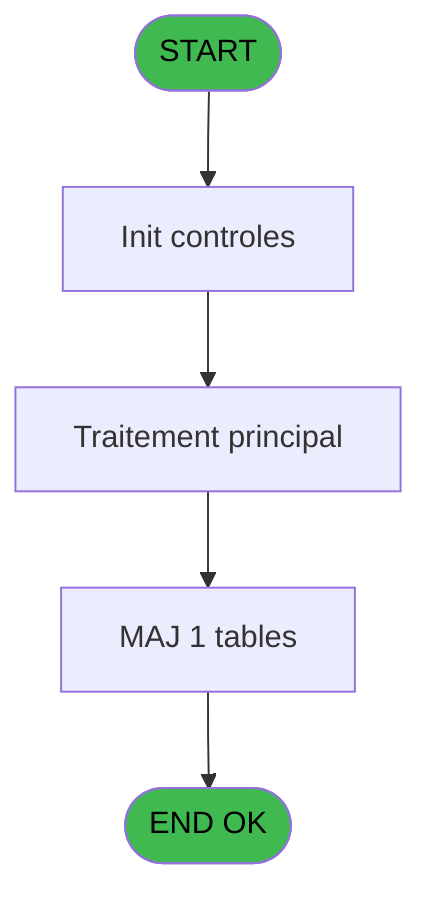

# REQ IDE 65 - Browse tables

> **Analyse**: Phases 1-4 2026-02-03 20:34 -> 20:35 (18s) | Assemblage 20:35
> **Pipeline**: V7.2 Enrichi
> **Structure**: 4 onglets (Resume | Ecrans | Donnees | Connexions)

<!-- TAB:Resume -->

## 1. FICHE D'IDENTITE

| Attribut | Valeur |
|----------|--------|
| Projet | REQ |
| IDE Position | 65 |
| Nom Programme | Browse tables |
| Fichier source | `Prg_65.xml` |
| Dossier IDE | Restaurant |
| Taches | 5 (1 ecrans visibles) |
| Tables modifiees | 1 |
| Programmes appeles | 0 |

## 2. DESCRIPTION FONCTIONNELLE

**Browse tables** assure la gestion complete de ce processus, accessible depuis [resto Resa (IDE 64)](REQ-IDE-64.md).

Le flux de traitement s'organise en **2 blocs fonctionnels** :

- **Traitement** (3 taches) : traitements metier divers
- **Calcul** (2 taches) : calculs de montants, stocks ou compteurs

**Donnees modifiees** : 1 tables en ecriture (bresil).

Detail : phases du traitement

#### Phase 1 : Traitement (3 taches)

- **65** - Availability **[[ECRAN]](#ecran-t1)**
- **65.1.2** - update table tmp
- **65.1.3** - del table tmp

#### Phase 2 : Calcul (2 taches)

- **65.1** - calcul table available **[[ECRAN]](#ecran-t2)**
- **65.1.1** - calcul resa

#### Tables impactees

| Table | Operations | Role metier |
|-------|-----------|-------------|
| bresil | **W**/L (3 usages) |  |

## 3. BLOCS FONCTIONNELS

### 3.1 Traitement (3 taches)

Traitements internes.

---

#### 65 - Availability [[ECRAN]](#ecran-t1)

**Role** : Traitement : Availability.
**Ecran** : 1105 x 273 DLU (MDI) | [Voir mockup](#ecran-t1)

---

#### 65.1.2 - update table tmp

**Role** : Traitement : update table tmp.
**Variables liees** : D (p.table id)

---

#### 65.1.3 - del table tmp

**Role** : Traitement : del table tmp.
**Variables liees** : D (p.table id)

### 3.2 Calcul (2 taches)

Calculs metier : montants, stocks, compteurs.

---

#### 65.1 - calcul table available [[ECRAN]](#ecran-t2)

**Role** : Calcul : calcul table available.
**Ecran** : 198 x 51 DLU (MDI) | [Voir mockup](#ecran-t2)
**Variables liees** : D (p.table id)

---

#### 65.1.1 - calcul resa

**Role** : Calcul : calcul resa.

## 5. REGLES METIER

*(Aucune regle metier identifiee)*

## 6. CONTEXTE

- **Appele par**: [resto Resa (IDE 64)](REQ-IDE-64.md)
- **Appelle**: 0 programmes | **Tables**: 4 (W:1 R:3 L:1) | **Taches**: 5 | **Expressions**: 14

<!-- TAB:Ecrans -->

## 8. ECRANS

### 8.1 Forms visibles (1 / 5)

| # | Position | Tache | Nom | Type | Largeur | Hauteur | Bloc |
|---|----------|-------|-----|------|---------|---------|------|
| 1 | 65 | 65 | Availability | MDI | 1105 | 273 | Traitement |

### 8.2 Mockups Ecrans

---

#### 65 - Availability
**Tache** : [65](#t1) | **Type** : MDI | **Dimensions** : 1105 x 273 DLU
**Bloc** : Traitement | **Titre IDE** : Availability

<!-- FORM-DATA:
{
    "width":  1105,
    "vFactor":  8,
    "type":  "MDI",
    "hFactor":  8,
    "controls":  [
                     {
                         "x":  0,
                         "type":  "label",
                         "var":  "",
                         "y":  0,
                         "w":  1105,
                         "fmt":  "",
                         "name":  "",
                         "h":  40,
                         "color":  "6",
                         "text":  "",
                         "parent":  null
                     },
                     {
                         "x":  20,
                         "type":  "label",
                         "var":  "",
                         "y":  7,
                         "w":  444,
                         "fmt":  "",
                         "name":  "",
                         "h":  12,
                         "color":  "6",
                         "text":  "Tables availlability",
                         "parent":  1
                     },
                     {
                         "x":  67,
                         "type":  "label",
                         "var":  "",
                         "y":  23,
                         "w":  534,
                         "fmt":  "",
                         "name":  "",
                         "h":  9,
                         "color":  "6",
                         "text":  "The list shows the remaining tables that are availlable",
                         "parent":  1
                     },
                     {
                         "x":  358,
                         "type":  "table",
                         "var":  "",
                         "name":  "",
                         "titleH":  24,
                         "color":  "110",
                         "w":  741,
                         "y":  46,
                         "fmt":  "",
                         "parent":  null,
                         "text":  "",
                         "rowH":  13,
                         "h":  193,
                         "cols":  [
                                      {
                                          "title":  "Section",
                                          "layer":  1,
                                          "w":  220
                                      },
                                      {
                                          "title":  "Table",
                                          "layer":  2,
                                          "w":  263
                                      },
                                      {
                                          "title":  "People max",
                                          "layer":  3,
                                          "w":  91
                                      },
                                      {
                                          "title":  "# of tables available",
                                          "layer":  4,
                                          "w":  134
                                      }
                                  ],
                         "rows":  4
                     },
                     {
                         "x":  1,
                         "type":  "line",
                         "var":  "",
                         "y":  248,
                         "w":  1105,
                         "fmt":  "",
                         "name":  "",
                         "h":  0,
                         "color":  "",
                         "text":  "",
                         "parent":  null
                     },
                     {
                         "x":  365,
                         "type":  "combobox",
                         "var":  "",
                         "y":  72,
                         "w":  163,
                         "fmt":  "",
                         "name":  "",
                         "h":  12,
                         "color":  "110",
                         "text":  "SECTIONCOMBO",
                         "parent":  10
                     },
                     {
                         "x":  939,
                         "type":  "edit",
                         "var":  "",
                         "y":  72,
                         "w":  125,
                         "fmt":  "",
                         "name":  "",
                         "h":  12,
                         "color":  "179",
                         "text":  "",
                         "parent":  10
                     },
                     {
                         "x":  592,
                         "type":  "edit",
                         "var":  "",
                         "y":  73,
                         "w":  233,
                         "fmt":  "",
                         "name":  "",
                         "h":  10,
                         "color":  "110",
                         "text":  "",
                         "parent":  10
                     },
                     {
                         "x":  853,
                         "type":  "edit",
                         "var":  "",
                         "y":  73,
                         "w":  80,
                         "fmt":  "",
                         "name":  "",
                         "h":  10,
                         "color":  "110",
                         "text":  "",
                         "parent":  10
                     },
                     {
                         "x":  90,
                         "type":  "image",
                         "var":  "",
                         "y":  52,
                         "w":  190,
                         "fmt":  "",
                         "name":  "",
                         "h":  72,
                         "color":  "",
                         "text":  "",
                         "parent":  null
                     },
                     {
                         "x":  534,
                         "type":  "image",
                         "var":  "",
                         "y":  73,
                         "w":  32,
                         "fmt":  "",
                         "name":  "",
                         "h":  10,
                         "color":  "",
                         "text":  "",
                         "parent":  10
                     },
                     {
                         "x":  534,
                         "type":  "image",
                         "var":  "",
                         "y":  73,
                         "w":  32,
                         "fmt":  "",
                         "name":  "",
                         "h":  10,
                         "color":  "",
                         "text":  "",
                         "parent":  10
                     },
                     {
                         "x":  84,
                         "type":  "image",
                         "var":  "",
                         "y":  162,
                         "w":  170,
                         "fmt":  "",
                         "name":  "",
                         "h":  48,
                         "color":  "",
                         "text":  "",
                         "parent":  null
                     },
                     {
                         "x":  84,
                         "type":  "image",
                         "var":  "",
                         "y":  163,
                         "w":  170,
                         "fmt":  "",
                         "name":  "",
                         "h":  48,
                         "color":  "",
                         "text":  "",
                         "parent":  null
                     },
                     {
                         "x":  782,
                         "type":  "button",
                         "var":  "",
                         "y":  253,
                         "w":  160,
                         "fmt":  "\u0026Select",
                         "name":  "",
                         "h":  18,
                         "color":  "",
                         "text":  "",
                         "parent":  null
                     },
                     {
                         "x":  941,
                         "type":  "button",
                         "var":  "",
                         "y":  253,
                         "w":  160,
                         "fmt":  "\u0026Exit",
                         "name":  "",
                         "h":  18,
                         "color":  "",
                         "text":  "",
                         "parent":  null
                     },
                     {
                         "x":  1030,
                         "type":  "image",
                         "var":  "",
                         "y":  9,
                         "w":  56,
                         "fmt":  "",
                         "name":  "",
                         "h":  21,
                         "color":  "",
                         "text":  "",
                         "parent":  null
                     }
                 ],
    "taskId":  "65",
    "height":  273
}
-->

<strong>Champs : 4 champs</strong>

| Pos (x,y) | Nom | Variable | Type |
|-----------|-----|----------|------|
| 365,72 | SECTIONCOMBO | - | combobox |
| 939,72 | (sans nom) | - | edit |
| 592,73 | (sans nom) | - | edit |
| 853,73 | (sans nom) | - | edit |

<strong>Boutons : 2 boutons</strong>

| Bouton | Pos (x,y) | Action |
|--------|-----------|--------|
| Select | 782,253 | Ouvre la selection |
| Exit | 941,253 | Quitte le programme |

## 9. NAVIGATION

Ecran unique: **Availability**

### 9.3 Structure hierarchique (5 taches)

| Position | Tache | Type | Dimensions | Bloc |
|----------|-------|------|------------|------|
| **65.1** | [**Availability** (65)](#t1) [mockup](#ecran-t1) | MDI | 1105x273 | Traitement |
| 65.1.1 | [update table tmp (65.1.2)](#t4) | MDI | - | |
| 65.1.2 | [del table tmp (65.1.3)](#t5) | MDI | - | |
| **65.2** | [**calcul table available** (65.1)](#t2) [mockup](#ecran-t2) | MDI | 198x51 | Calcul |
| 65.2.1 | [calcul resa (65.1.1)](#t3) | MDI | - | |

### 9.4 Algorigramme

> **Legende**: Vert = START/END OK | Rouge = END KO | Bleu = Decisions
> *Algorigramme auto-genere. Utiliser `/algorigramme` pour une synthese metier detaillee.*

<!-- TAB:Donnees -->

## 10. TABLES

### Tables utilisees (4)

| ID | Nom | Description | Type | R | W | L | Usages |
|----|-----|-------------|------|---|---|---|--------|
| 445 | retour_chek_pabx |  | DB | R |   |   | 1 |
| 447 | scelles |  | DB | R |   |   | 1 |
| 448 | sessionsanalyse | Sessions de caisse | DB | R |   |   | 1 |
| 449 | bresil |  | DB |   | **W** | L | 3 |

### Colonnes par table (1 / 4 tables avec colonnes identifiees)

Table 445 - retour_chek_pabx (R) - 1 usages

*Table utilisee uniquement en Link ou aucune colonne Real identifiee dans le DataView.*

Table 447 - scelles (R) - 1 usages

| Lettre | Variable | Acces | Type |
|--------|----------|-------|------|
| A | p.resto id | R | Alpha |
| B | p.date | R | Date |
| C | p.section | R | Alpha |
| D | p.table id | R | Alpha |
| E | p.nb of people | R | Numeric |

Table 448 - sessionsanalyse (R) - 1 usages

*Table utilisee uniquement en Link ou aucune colonne Real identifiee dans le DataView.*

Table 449 - bresil (**W**/L) - 3 usages

*Table utilisee uniquement en Link ou aucune colonne Real identifiee dans le DataView.*

## 11. VARIABLES

### 11.1 Parametres entrants (5)

Variables recues du programme appelant ([resto Resa (IDE 64)](REQ-IDE-64.md)).

| Lettre | Nom | Type | Usage dans |
|--------|-----|------|-----------|
| A | p.resto id | Alpha | 1x parametre entrant |
| B | p.date | Date | 1x parametre entrant |
| C | p.section | Alpha | 4x parametre entrant |
| D | p.table id | Alpha | - |
| E | p.nb of people | Numeric | 1x parametre entrant |

## 12. EXPRESSIONS

**14 / 14 expressions decodees (100%)**

### 12.1 Repartition par type

| Type | Expressions | Regles |
|------|-------------|--------|
| CONDITION | 6 | 0 |
| OTHER | 8 | 0 |

### 12.2 Expressions cles par type

#### CONDITION (6 expressions)

| Type | IDE | Expression | Regle |
|------|-----|------------|-------|
| CONDITION | 11 | `[H]='S'` | - |
| CONDITION | 12 | `p.section [C]='N'` | - |
| CONDITION | 13 | `p.section [C]='S'` | - |
| CONDITION | 1 | `p.section [C]<>''` | - |
| CONDITION | 5 | `CndRange (p.section [C]<>'',p.section [C])` | - |
| ... | | *+1 autres* | |

#### OTHER (8 expressions)

| Type | IDE | Expression | Regle |
|------|-----|------------|-------|
| OTHER | 8 | `[I]` | - |
| OTHER | 7 | `[H]` | - |
| OTHER | 14 | `GetParam ('SECTIONCOMBO')` | - |
| OTHER | 9 | `[I]` | - |
| OTHER | 3 | `p.resto id [A]` | - |
| ... | | *+3 autres* | |

<!-- TAB:Connexions -->

## 13. GRAPHE D'APPELS

### 13.1 Chaine depuis Main (Callers)

Main -> ... -> [resto Resa (IDE 64)](REQ-IDE-64.md) -> **Browse tables (IDE 65)**

### 13.2 Callers

| IDE | Nom Programme | Nb Appels |
|-----|---------------|-----------|
| [64](REQ-IDE-64.md) | resto Resa | 3 |

### 13.3 Callees (programmes appeles)

### 13.4 Detail Callees avec contexte

| IDE | Nom Programme | Appels | Contexte |
|-----|---------------|--------|----------|
| - | (aucun) | - | - |

## 14. RECOMMANDATIONS MIGRATION

### 14.1 Profil du programme

| Metrique | Valeur | Impact migration |
|----------|--------|-----------------|
| Lignes de logique | 52 | Programme compact |
| Expressions | 14 | Peu de logique |
| Tables WRITE | 1 | Impact faible |
| Sous-programmes | 0 | Peu de dependances |
| Ecrans visibles | 1 | Ecran unique ou traitement batch |
| Code desactive | 0% (0 / 52) | Code sain |
| Regles metier | 0 | Pas de regle identifiee |

### 14.2 Plan de migration par bloc

#### Traitement (3 taches: 1 ecran, 2 traitements)

- **Strategie** : Orchestrateur avec 1 ecrans (Razor/React) et 2 traitements backend (services).
- Les ecrans deviennent des composants UI, les traitements invisibles deviennent des services injectables.
- Decomposer les taches en services unitaires testables.

#### Calcul (2 taches: 1 ecran, 1 traitement)

- **Strategie** : Services de calcul purs (Domain Services).
- Migrer la logique de calcul (stock, compteurs, montants)

### 14.3 Dependances critiques

| Dependance | Type | Appels | Impact |
|------------|------|--------|--------|
| bresil | Table WRITE (Database) | 2x | Schema + repository |

---
*Spec DETAILED generee par Pipeline V7.2 - 2026-02-03 20:35*
