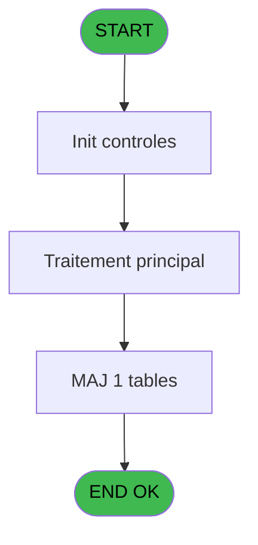
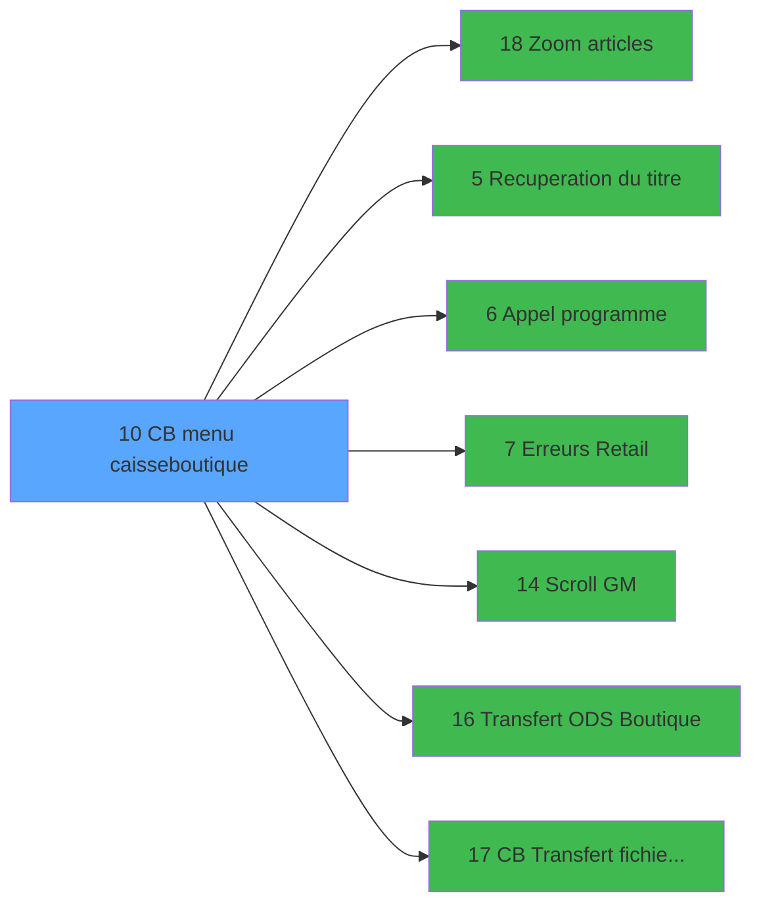

# RET IDE 10 - CB menu caisse/boutique

> **Analyse**: Phases 1-4 2026-02-03 20:41 -> 20:42 (15s) | Assemblage 20:42
> **Pipeline**: V7.2 Enrichi
> **Structure**: 4 onglets (Resume | Ecrans | Donnees | Connexions)

<!-- TAB:Resume -->

## 1. FICHE D'IDENTITE

| Attribut | Valeur |
|----------|--------|
| Projet | RET |
| IDE Position | 10 |
| Nom Programme | CB menu caisse/boutique |
| Fichier source | `Prg_10.xml` |
| Dossier IDE | Start |
| Taches | 4 (1 ecrans visibles) |
| Tables modifiees | 1 |
| Programmes appeles | 7 |

## 2. DESCRIPTION FONCTIONNELLE

**CB menu caisse/boutique** assure la gestion complete de ce processus, accessible depuis [Start (IDE 9)](RET-IDE-9.md).

Le flux de traitement s'organise en **3 blocs fonctionnels** :

- **Initialisation** (2 taches) : reinitialisation d'etats et de variables de travail
- **Traitement** (1 tache) : traitements metier divers
- **Calcul** (1 tache) : calculs de montants, stocks ou compteurs

**Donnees modifiees** : 1 tables en ecriture (arc_cc_type_detail).

Detail : phases du traitement

#### Phase 1 : Traitement (1 tache)

- **10** - CB menu caisse/boutique **[[ECRAN]](#ecran-t1)**

Delegue a : [Recuperation du titre (IDE 5)](RET-IDE-5.md), [Appel programme (IDE 6)](RET-IDE-6.md), [Erreurs Retail (IDE 7)](RET-IDE-7.md), [Scroll GM (IDE 14)](RET-IDE-14.md)

#### Phase 2 : Calcul (1 tache)

- **10.1** - Lecture date comptable

#### Phase 3 : Initialisation (2 taches)

- **10.2** - Init Articles
- **10.3** - Init Articles

#### Tables impactees

| Table | Operations | Role metier |
|-------|-----------|-------------|
| arc_cc_type_detail | R/**W** (2 usages) |  |

## 3. BLOCS FONCTIONNELS

### 3.1 Traitement (1 tache)

Traitements internes.

---

#### 10 - CB menu caisse/boutique [[ECRAN]](#ecran-t1)

**Role** : Traitement : CB menu caisse/boutique.
**Ecran** : 739 x 188 DLU (MDI) | [Voir mockup](#ecran-t1)
**Delegue a** : [Recuperation du titre (IDE 5)](RET-IDE-5.md), [Appel programme (IDE 6)](RET-IDE-6.md), [Erreurs Retail (IDE 7)](RET-IDE-7.md)

### 3.2 Calcul (1 tache)

Calculs metier : montants, stocks, compteurs.

---

#### 10.1 - Lecture date comptable

**Role** : Traitement : Lecture date comptable.
**Variables liees** : A (W0 date comptable)

### 3.3 Initialisation (2 taches)

Reinitialisation d'etats et variables de travail.

---

#### 10.2 - Init Articles

**Role** : Reinitialisation : Init Articles.

---

#### 10.3 - Init Articles

**Role** : Reinitialisation : Init Articles.

## 5. REGLES METIER

*(Aucune regle metier identifiee)*

## 6. CONTEXTE

- **Appele par**: [Start (IDE 9)](RET-IDE-9.md)
- **Appelle**: 7 programmes | **Tables**: 2 (W:1 R:2 L:0) | **Taches**: 4 | **Expressions**: 15

<!-- TAB:Ecrans -->

## 8. ECRANS

### 8.1 Forms visibles (1 / 4)

| # | Position | Tache | Nom | Type | Largeur | Hauteur | Bloc |
|---|----------|-------|-----|------|---------|---------|------|
| 1 | 10 | 10 | CB menu caisse/boutique | MDI | 739 | 188 | Traitement |

### 8.2 Mockups Ecrans

---

#### 10 - CB menu caisse/boutique
**Tache** : [10](#t1) | **Type** : MDI | **Dimensions** : 739 x 188 DLU
**Bloc** : Traitement | **Titre IDE** : CB menu caisse/boutique

<!-- FORM-DATA:
{
    "width":  739,
    "vFactor":  8,
    "type":  "MDI",
    "hFactor":  8,
    "controls":  [
                     {
                         "x":  0,
                         "type":  "label",
                         "var":  "",
                         "y":  0,
                         "w":  738,
                         "fmt":  "",
                         "name":  "",
                         "h":  21,
                         "color":  "",
                         "text":  "",
                         "parent":  null
                     },
                     {
                         "x":  114,
                         "type":  "label",
                         "var":  "",
                         "y":  42,
                         "w":  596,
                         "fmt":  "",
                         "name":  "",
                         "h":  112,
                         "color":  "",
                         "text":  "",
                         "parent":  null
                     },
                     {
                         "x":  323,
                         "type":  "label",
                         "var":  "",
                         "y":  46,
                         "w":  367,
                         "fmt":  "",
                         "name":  "",
                         "h":  104,
                         "color":  "",
                         "text":  "",
                         "parent":  null
                     },
                     {
                         "x":  342,
                         "type":  "label",
                         "var":  "",
                         "y":  55,
                         "w":  328,
                         "fmt":  "",
                         "name":  "",
                         "h":  81,
                         "color":  "",
                         "text":  "",
                         "parent":  8
                     },
                     {
                         "x":  344,
                         "type":  "label",
                         "var":  "",
                         "y":  56,
                         "w":  41,
                         "fmt":  "",
                         "name":  "",
                         "h":  79,
                         "color":  "",
                         "text":  "",
                         "parent":  8
                     },
                     {
                         "x":  385,
                         "type":  "label",
                         "var":  "",
                         "y":  56,
                         "w":  283,
                         "fmt":  "",
                         "name":  "",
                         "h":  79,
                         "color":  "6",
                         "text":  "",
                         "parent":  8
                     },
                     {
                         "x":  388,
                         "type":  "label",
                         "var":  "",
                         "y":  60,
                         "w":  211,
                         "fmt":  "",
                         "name":  "",
                         "h":  8,
                         "color":  "146",
                         "text":  "Transfer GM file",
                         "parent":  11
                     },
                     {
                         "x":  388,
                         "type":  "label",
                         "var":  "",
                         "y":  75,
                         "w":  270,
                         "fmt":  "",
                         "name":  "",
                         "h":  9,
                         "color":  "146",
                         "text":  "Transfer boutique ODs",
                         "parent":  11
                     },
                     {
                         "x":  388,
                         "type":  "label",
                         "var":  "",
                         "y":  90,
                         "w":  270,
                         "fmt":  "",
                         "name":  "",
                         "h":  9,
                         "color":  "146",
                         "text":  "View errors log file",
                         "parent":  11
                     },
                     {
                         "x":  388,
                         "type":  "label",
                         "var":  "",
                         "y":  105,
                         "w":  270,
                         "fmt":  "",
                         "name":  "",
                         "h":  9,
                         "color":  "146",
                         "text":  "Imputation Settings",
                         "parent":  11
                     },
                     {
                         "x":  388,
                         "type":  "label",
                         "var":  "",
                         "y":  120,
                         "w":  270,
                         "fmt":  "",
                         "name":  "",
                         "h":  9,
                         "color":  "146",
                         "text":  "GM List",
                         "parent":  11
                     },
                     {
                         "x":  422,
                         "type":  "label",
                         "var":  "",
                         "y":  138,
                         "w":  120,
                         "fmt":  "",
                         "name":  "",
                         "h":  9,
                         "color":  "",
                         "text":  "Your choice",
                         "parent":  8
                     },
                     {
                         "x":  0,
                         "type":  "label",
                         "var":  "",
                         "y":  163,
                         "w":  738,
                         "fmt":  "",
                         "name":  "",
                         "h":  24,
                         "color":  "",
                         "text":  "",
                         "parent":  null
                     },
                     {
                         "x":  545,
                         "type":  "edit",
                         "var":  "",
                         "y":  138,
                         "w":  26,
                         "fmt":  "",
                         "name":  "",
                         "h":  10,
                         "color":  "6",
                         "text":  "",
                         "parent":  8
                     },
                     {
                         "x":  5,
                         "type":  "image",
                         "var":  "",
                         "y":  2,
                         "w":  59,
                         "fmt":  "",
                         "name":  "",
                         "h":  18,
                         "color":  "",
                         "text":  "",
                         "parent":  null
                     },
                     {
                         "x":  75,
                         "type":  "edit",
                         "var":  "",
                         "y":  6,
                         "w":  267,
                         "fmt":  "20",
                         "name":  "",
                         "h":  8,
                         "color":  "",
                         "text":  "",
                         "parent":  null
                     },
                     {
                         "x":  469,
                         "type":  "edit",
                         "var":  "",
                         "y":  6,
                         "w":  261,
                         "fmt":  "DD MMM YYYYT",
                         "name":  "",
                         "h":  8,
                         "color":  "",
                         "text":  "",
                         "parent":  null
                     },
                     {
                         "x":  0,
                         "type":  "image",
                         "var":  "",
                         "y":  23,
                         "w":  86,
                         "fmt":  "",
                         "name":  "",
                         "h":  42,
                         "color":  "",
                         "text":  "",
                         "parent":  null
                     },
                     {
                         "x":  125,
                         "type":  "image",
                         "var":  "",
                         "y":  46,
                         "w":  163,
                         "fmt":  "",
                         "name":  "",
                         "h":  35,
                         "color":  "",
                         "text":  "",
                         "parent":  null
                     },
                     {
                         "x":  351,
                         "type":  "button",
                         "var":  "",
                         "y":  60,
                         "w":  27,
                         "fmt":  "A",
                         "name":  "A",
                         "h":  9,
                         "color":  "",
                         "text":  "",
                         "parent":  10
                     },
                     {
                         "x":  351,
                         "type":  "button",
                         "var":  "",
                         "y":  75,
                         "w":  27,
                         "fmt":  "B",
                         "name":  "B",
                         "h":  9,
                         "color":  "",
                         "text":  "",
                         "parent":  10
                     },
                     {
                         "x":  351,
                         "type":  "button",
                         "var":  "",
                         "y":  90,
                         "w":  27,
                         "fmt":  "C",
                         "name":  "C",
                         "h":  9,
                         "color":  "",
                         "text":  "",
                         "parent":  10
                     },
                     {
                         "x":  351,
                         "type":  "button",
                         "var":  "",
                         "y":  105,
                         "w":  27,
                         "fmt":  "D",
                         "name":  "D",
                         "h":  9,
                         "color":  "",
                         "text":  "",
                         "parent":  10
                     },
                     {
                         "x":  351,
                         "type":  "button",
                         "var":  "",
                         "y":  120,
                         "w":  27,
                         "fmt":  "E",
                         "name":  "E",
                         "h":  9,
                         "color":  "",
                         "text":  "",
                         "parent":  10
                     },
                     {
                         "x":  6,
                         "type":  "button",
                         "var":  "",
                         "y":  166,
                         "w":  154,
                         "fmt":  "\u0026Quit",
                         "name":  "",
                         "h":  18,
                         "color":  "",
                         "text":  "",
                         "parent":  19
                     }
                 ],
    "taskId":  "10",
    "height":  188
}
-->

<strong>Champs : 3 champs</strong>

| Pos (x,y) | Nom | Variable | Type |
|-----------|-----|----------|------|
| 545,138 | (sans nom) | - | edit |
| 75,6 | 20 | - | edit |
| 469,6 | DD MMM YYYYT | - | edit |

<strong>Boutons : 6 boutons</strong>

| Bouton | Pos (x,y) | Action |
|--------|-----------|--------|
| A | 351,60 | Bouton fonctionnel |
| B | 351,75 | Bouton fonctionnel |
| C | 351,90 | Bouton fonctionnel |
| D | 351,105 | Bouton fonctionnel |
| E | 351,120 | Bouton fonctionnel |
| Quit | 6,166 | Bouton fonctionnel |

## 9. NAVIGATION

Ecran unique: **CB menu caisse/boutique**

### 9.3 Structure hierarchique (4 taches)

| Position | Tache | Type | Dimensions | Bloc |
|----------|-------|------|------------|------|
| **10.1** | [**CB menu caisse/boutique** (10)](#t1) [mockup](#ecran-t1) | MDI | 739x188 | Traitement |
| **10.2** | [**Lecture date comptable** (10.1)](#t2) | MDI | - | Calcul |
| **10.3** | [**Init Articles** (10.2)](#t3) | - | - | Initialisation |
| 10.3.1 | [Init Articles (10.3)](#t11) | - | - | |

### 9.4 Algorigramme

> **Legende**: Vert = START/END OK | Rouge = END KO | Bleu = Decisions
> *Algorigramme auto-genere. Utiliser `/algorigramme` pour une synthese metier detaillee.*

<!-- TAB:Donnees -->

## 10. TABLES

### Tables utilisees (2)

| ID | Nom | Description | Type | R | W | L | Usages |
|----|-----|-------------|------|---|---|---|--------|
| 70 | date_comptable___dat |  | DB | R |   |   | 1 |
| 729 | arc_cc_type_detail |  | DB | R | **W** |   | 2 |

### Colonnes par table (1 / 2 tables avec colonnes identifiees)

Table 70 - date_comptable___dat (R) - 1 usages

| Lettre | Variable | Acces | Type |
|--------|----------|-------|------|
| A | W0 date comptable | R | Date |

Table 729 - arc_cc_type_detail (R/**W**) - 2 usages

*Table utilisee uniquement en Link ou aucune colonne Real identifiee dans le DataView.*

## 11. VARIABLES

### 11.1 Variables de session (1)

Variables persistantes pendant toute la session.

| Lettre | Nom | Type | Usage dans |
|--------|-----|------|-----------|
| D | v.titre | Alpha | 1x session |

### 11.2 Variables de travail (5)

Variables internes au programme.

| Lettre | Nom | Type | Usage dans |
|--------|-----|------|-----------|
| A | W0 date comptable | Date | - |
| B | W0 choix action | Alpha | 5x calcul interne |
| C | W0 code article | Numeric | - |
| E | W0 Article Boutique | Numeric | - |
| F | W0 Article Golf | Numeric | - |

## 12. EXPRESSIONS

**15 / 15 expressions decodees (100%)**

### 12.1 Repartition par type

| Type | Expressions | Regles |
|------|-------------|--------|
| CONSTANTE | 4 | 0 |
| DATE | 1 | 0 |
| REFERENCE_VG | 2 | 0 |
| CONDITION | 6 | 0 |
| OTHER | 1 | 0 |
| STRING | 1 | 0 |

### 12.2 Expressions cles par type

#### CONSTANTE (4 expressions)

| Type | IDE | Expression | Regle |
|------|-----|------------|-------|
| CONSTANTE | 12 | `'B'` | - |
| CONSTANTE | 14 | `'G'` | - |
| CONSTANTE | 1 | `1` | - |
| CONSTANTE | 4 | `''` | - |

#### DATE (1 expressions)

| Type | IDE | Expression | Regle |
|------|-----|------------|-------|
| DATE | 3 | `Date ()` | - |

#### REFERENCE_VG (2 expressions)

| Type | IDE | Expression | Regle |
|------|-----|------------|-------|
| REFERENCE_VG | 7 | `VG23` | - |
| REFERENCE_VG | 2 | `VG2` | - |

#### CONDITION (6 expressions)

| Type | IDE | Expression | Regle |
|------|-----|------------|-------|
| CONDITION | 10 | `W0 choix action [B]='D'` | - |
| CONDITION | 15 | `W0 choix action [B]='E'` | - |
| CONDITION | 13 | `Trim (INIGet ('[MAGIC_LOGICAL_NAMES]club_bgolf'))='O'` | - |
| CONDITION | 5 | `W0 choix action [B]='A'` | - |
| CONDITION | 8 | `W0 choix action [B]='B'` | - |
| ... | | *+1 autres* | |

#### OTHER (1 expressions)

| Type | IDE | Expression | Regle |
|------|-----|------------|-------|
| OTHER | 6 | `NOT(VG23)` | - |

#### STRING (1 expressions)

| Type | IDE | Expression | Regle |
|------|-----|------------|-------|
| STRING | 11 | `Trim (v.titre [D])` | - |

<!-- TAB:Connexions -->

## 13. GRAPHE D'APPELS

### 13.1 Chaine depuis Main (Callers)

Main -> ... -> [Start (IDE 9)](RET-IDE-9.md) -> **CB menu caisse/boutique (IDE 10)**

### 13.2 Callers

| IDE | Nom Programme | Nb Appels |
|-----|---------------|-----------|
| [9](RET-IDE-9.md) | Start | 1 |

### 13.3 Callees (programmes appeles)

### 13.4 Detail Callees avec contexte

| IDE | Nom Programme | Appels | Contexte |
|-----|---------------|--------|----------|
| [18](RET-IDE-18.md) | Zoom articles | 2 | Selection/consultation |
| [5](RET-IDE-5.md) | Recuperation du titre | 1 | Recuperation donnees |
| [6](RET-IDE-6.md) | Appel programme | 1 | Sous-programme |
| [7](RET-IDE-7.md) | Erreurs Retail | 1 | Sous-programme |
| [14](RET-IDE-14.md) | Scroll GM | 1 | Sous-programme |
| [16](RET-IDE-16.md) | Transfert ODS Boutique | 1 | Transfert donnees |
| [17](RET-IDE-17.md) | CB Transfert fichiers GM | 1 | Transfert donnees |

## 14. RECOMMANDATIONS MIGRATION

### 14.1 Profil du programme

| Metrique | Valeur | Impact migration |
|----------|--------|-----------------|
| Lignes de logique | 58 | Programme compact |
| Expressions | 15 | Peu de logique |
| Tables WRITE | 1 | Impact faible |
| Sous-programmes | 7 | Dependances moderees |
| Ecrans visibles | 1 | Ecran unique ou traitement batch |
| Code desactive | 0% (0 / 58) | Code sain |
| Regles metier | 0 | Pas de regle identifiee |

### 14.2 Plan de migration par bloc

#### Traitement (1 tache: 1 ecran, 0 traitement)

- **Strategie** : 1 composant(s) UI (Razor/React) avec formulaires et validation.
- 7 sous-programme(s) a migrer ou a reutiliser depuis les services existants.
- Decomposer les taches en services unitaires testables.

#### Calcul (1 tache: 0 ecran, 1 traitement)

- **Strategie** : Services de calcul purs (Domain Services).
- Migrer la logique de calcul (stock, compteurs, montants)

#### Initialisation (2 taches: 0 ecran, 2 traitements)

- **Strategie** : Constructeur/methode `InitAsync()` dans l'orchestrateur.

### 14.3 Dependances critiques

| Dependance | Type | Appels | Impact |
|------------|------|--------|--------|
| arc_cc_type_detail | Table WRITE (Database) | 1x | Schema + repository |
| [Zoom articles (IDE 18)](RET-IDE-18.md) | Sous-programme | 2x | Haute - Selection/consultation |
| [Scroll GM (IDE 14)](RET-IDE-14.md) | Sous-programme | 1x | Normale - Sous-programme |
| [Transfert ODS Boutique (IDE 16)](RET-IDE-16.md) | Sous-programme | 1x | Normale - Transfert donnees |
| [CB Transfert fichiers GM (IDE 17)](RET-IDE-17.md) | Sous-programme | 1x | Normale - Transfert donnees |
| [Recuperation du titre (IDE 5)](RET-IDE-5.md) | Sous-programme | 1x | Normale - Recuperation donnees |
| [Appel programme (IDE 6)](RET-IDE-6.md) | Sous-programme | 1x | Normale - Sous-programme |
| [Erreurs Retail (IDE 7)](RET-IDE-7.md) | Sous-programme | 1x | Normale - Sous-programme |

---
*Spec DETAILED generee par Pipeline V7.2 - 2026-02-03 20:42*
