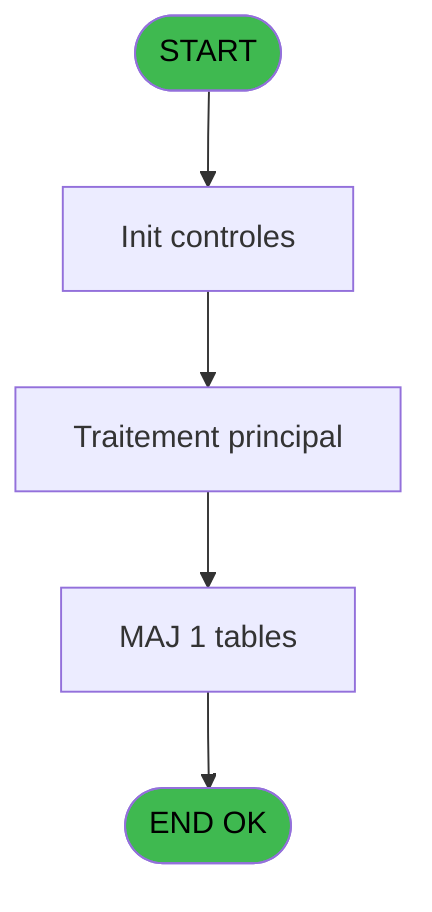

# RET IDE 11 - lancement automatique

> **Analyse**: Phases 1-4 2026-02-03 20:42 -> 20:42 (15s) | Assemblage 20:42
> **Pipeline**: V7.2 Enrichi
> **Structure**: 4 onglets (Resume | Ecrans | Donnees | Connexions)

<!-- TAB:Resume -->

## 1. FICHE D'IDENTITE

| Attribut | Valeur |
|----------|--------|
| Projet | RET |
| IDE Position | 11 |
| Nom Programme | lancement automatique |
| Fichier source | `Prg_11.xml` |
| Dossier IDE | Start |
| Taches | 3 (1 ecrans visibles) |
| Tables modifiees | 1 |
| Programmes appeles | 0 |

## 2. DESCRIPTION FONCTIONNELLE

**lancement automatique** assure la gestion complete de ce processus, accessible depuis [Start (IDE 9)](RET-IDE-9.md).

Le flux de traitement s'organise en **2 blocs fonctionnels** :

- **Traitement** (2 taches) : traitements metier divers
- **Calcul** (1 tache) : calculs de montants, stocks ou compteurs

**Donnees modifiees** : 1 tables en ecriture (tai_forfait).

**Logique metier** : 1 regles identifiees couvrant conditions metier.

Detail : phases du traitement

#### Phase 1 : Traitement (2 taches)

- **11** - CB menu caisse/boutique **[[ECRAN]](#ecran-t1)**
- **11.2** - Purge Erreurs

#### Phase 2 : Calcul (1 tache)

- **11.1** - Lecture date comptable

#### Tables impactees

| Table | Operations | Role metier |
|-------|-----------|-------------|
| tai_forfait | **W** (1 usages) |  |

## 3. BLOCS FONCTIONNELS

### 3.1 Traitement (2 taches)

Traitements internes.

---

#### 11 - CB menu caisse/boutique [[ECRAN]](#ecran-t1)

**Role** : Traitement : CB menu caisse/boutique.
**Ecran** : 870 x 105 DLU (MDI) | [Voir mockup](#ecran-t1)

---

#### 11.2 - Purge Erreurs

**Role** : Traitement : Purge Erreurs.

### 3.2 Calcul (1 tache)

Calculs metier : montants, stocks, compteurs.

---

#### 11.1 - Lecture date comptable

**Role** : Traitement : Lecture date comptable.
**Variables liees** : B (W0 date comptable), D (v. date next stop)

## 5. REGLES METIER

1 regles identifiees:

### Autres (1 regles)

#### [RM-001] Si Time ()>=TVal (INIGet ('[MAGIC_LOGICAL_NAMES]TimeStop') alors 'HH:MM') sinon Date ()+1,Date ())

| Element | Detail |
|---------|--------|
| **Condition** | `Time ()>=TVal (INIGet ('[MAGIC_LOGICAL_NAMES]TimeStop')` |
| **Si vrai** | 'HH:MM') |
| **Si faux** | Date ()+1,Date ()) |
| **Expression source** | Expression 2 : `IF (Time ()>=TVal (INIGet ('[MAGIC_LOGICAL_NAMES]TimeStop'),` |
| **Exemple** | Si Time ()>=TVal (INIGet ('[MAGIC_LOGICAL_NAMES]TimeStop') → 'HH:MM'). Sinon → Date ()+1,Date ()) |

## 6. CONTEXTE

- **Appele par**: [Start (IDE 9)](RET-IDE-9.md)
- **Appelle**: 0 programmes | **Tables**: 2 (W:1 R:1 L:0) | **Taches**: 3 | **Expressions**: 7

<!-- TAB:Ecrans -->

## 8. ECRANS

### 8.1 Forms visibles (1 / 3)

| # | Position | Tache | Nom | Type | Largeur | Hauteur | Bloc |
|---|----------|-------|-----|------|---------|---------|------|
| 1 | 11 | 11 | CB menu caisse/boutique | MDI | 870 | 105 | Traitement |

### 8.2 Mockups Ecrans

---

#### 11 - CB menu caisse/boutique
**Tache** : [11](#t1) | **Type** : MDI | **Dimensions** : 870 x 105 DLU
**Bloc** : Traitement | **Titre IDE** : CB menu caisse/boutique

<!-- FORM-DATA:
{
    "width":  870,
    "vFactor":  8,
    "type":  "MDI",
    "hFactor":  8,
    "controls":  [
                     {
                         "x":  83,
                         "type":  "label",
                         "var":  "",
                         "y":  12,
                         "w":  668,
                         "fmt":  "",
                         "name":  "",
                         "h":  81,
                         "color":  "",
                         "text":  "",
                         "parent":  null
                     },
                     {
                         "x":  157,
                         "type":  "label",
                         "var":  "",
                         "y":  18,
                         "w":  202,
                         "fmt":  "",
                         "name":  "",
                         "h":  15,
                         "color":  "",
                         "text":  "Transfert od\u0027s boutique",
                         "parent":  1
                     },
                     {
                         "x":  165,
                         "type":  "label",
                         "var":  "",
                         "y":  42,
                         "w":  157,
                         "fmt":  "",
                         "name":  "",
                         "h":  10,
                         "color":  "",
                         "text":  "Date comptable",
                         "parent":  1
                     },
                     {
                         "x":  323,
                         "type":  "edit",
                         "var":  "",
                         "y":  42,
                         "w":  136,
                         "fmt":  "",
                         "name":  "",
                         "h":  10,
                         "color":  "6",
                         "text":  "",
                         "parent":  1
                     }
                 ],
    "taskId":  "11",
    "height":  105
}
-->

<strong>Champs : 1 champs</strong>

| Pos (x,y) | Nom | Variable | Type |
|-----------|-----|----------|------|
| 323,42 | (sans nom) | - | edit |

## 9. NAVIGATION

Ecran unique: **CB menu caisse/boutique**

### 9.3 Structure hierarchique (3 taches)

| Position | Tache | Type | Dimensions | Bloc |
|----------|-------|------|------------|------|
| **11.1** | [**CB menu caisse/boutique** (11)](#t1) [mockup](#ecran-t1) | MDI | 870x105 | Traitement |
| 11.1.1 | [Purge Erreurs (11.2)](#t3) | MDI | - | |
| **11.2** | [**Lecture date comptable** (11.1)](#t2) | MDI | - | Calcul |

### 9.4 Algorigramme

> **Legende**: Vert = START/END OK | Rouge = END KO | Bleu = Decisions
> *Algorigramme auto-genere. Utiliser `/algorigramme` pour une synthese metier detaillee.*

<!-- TAB:Donnees -->

## 10. TABLES

### Tables utilisees (2)

| ID | Nom | Description | Type | R | W | L | Usages |
|----|-----|-------------|------|---|---|---|--------|
| 70 | date_comptable___dat |  | DB | R |   |   | 1 |
| 453 | tai_forfait |  | DB |   | **W** |   | 1 |

### Colonnes par table (1 / 2 tables avec colonnes identifiees)

Table 70 - date_comptable___dat (R) - 1 usages

| Lettre | Variable | Acces | Type |
|--------|----------|-------|------|
| B | W0 date comptable | R | Date |
| D | v. date next stop | R | Date |

Table 453 - tai_forfait (**W**) - 1 usages

*Table utilisee uniquement en Link ou aucune colonne Real identifiee dans le DataView.*

## 11. VARIABLES

### 11.1 Variables de session (2)

Variables persistantes pendant toute la session.

| Lettre | Nom | Type | Usage dans |
|--------|-----|------|-----------|
| C | v. last time executed | Time | 1x session |
| D | v. date next stop | Date | [11.1](#t2) |

### 11.2 Variables de travail (1)

Variables internes au programme.

| Lettre | Nom | Type | Usage dans |
|--------|-----|------|-----------|
| B | W0 date comptable | Date | - |

### 11.3 Autres (1)

Variables diverses.

| Lettre | Nom | Type | Usage dans |
|--------|-----|------|-----------|
| A | > societe | Alpha | - |

## 12. EXPRESSIONS

**7 / 7 expressions decodees (100%)**

### 12.1 Repartition par type

| Type | Expressions | Regles |
|------|-------------|--------|
| CONDITION | 3 | 5 |
| CONSTANTE | 1 | 0 |
| OTHER | 3 | 0 |

### 12.2 Expressions cles par type

#### CONDITION (3 expressions)

| Type | IDE | Expression | Regle |
|------|-----|------------|-------|
| CONDITION | 2 | `IF (Time ()>=TVal (INIGet ('[MAGIC_LOGICAL_NAMES]TimeStop'),'HH:MM'),Date ()+1,Date ())` | [RM-001](#rm-RM-001) |
| CONDITION | 1 | `Date ()=v. date next stop [D] AND Time ()>=TVal (INIGet ('[MAGIC_LOGICAL_NAMES]TimeStop'),'HH:MM')` | - |
| CONDITION | 4 | `Time ()-v. last time executed [C]>='00:05:00'TIME` | - |

#### CONSTANTE (1 expressions)

| Type | IDE | Expression | Regle |
|------|-----|------------|-------|
| CONSTANTE | 3 | `'C'` | - |

#### OTHER (3 expressions)

| Type | IDE | Expression | Regle |
|------|-----|------------|-------|
| OTHER | 7 | `NOT(VG23)` | - |
| OTHER | 6 | `INIGet ('[MAGIC_LOGICAL_NAMES]BckCmd')` | - |
| OTHER | 5 | `Time ()` | - |

<!-- TAB:Connexions -->

## 13. GRAPHE D'APPELS

### 13.1 Chaine depuis Main (Callers)

Main -> ... -> [Start (IDE 9)](RET-IDE-9.md) -> **lancement automatique (IDE 11)**

### 13.2 Callers

| IDE | Nom Programme | Nb Appels |
|-----|---------------|-----------|
| [9](RET-IDE-9.md) | Start | 1 |

### 13.3 Callees (programmes appeles)

### 13.4 Detail Callees avec contexte

| IDE | Nom Programme | Appels | Contexte |
|-----|---------------|--------|----------|
| - | (aucun) | - | - |

## 14. RECOMMANDATIONS MIGRATION

### 14.1 Profil du programme

| Metrique | Valeur | Impact migration |
|----------|--------|-----------------|
| Lignes de logique | 31 | Programme compact |
| Expressions | 7 | Peu de logique |
| Tables WRITE | 1 | Impact faible |
| Sous-programmes | 0 | Peu de dependances |
| Ecrans visibles | 1 | Ecran unique ou traitement batch |
| Code desactive | 0% (0 / 31) | Code sain |
| Regles metier | 1 | Quelques regles a preserver |

### 14.2 Plan de migration par bloc

#### Traitement (2 taches: 1 ecran, 1 traitement)

- **Strategie** : Orchestrateur avec 1 ecrans (Razor/React) et 1 traitements backend (services).
- Les ecrans deviennent des composants UI, les traitements invisibles deviennent des services injectables.
- Decomposer les taches en services unitaires testables.

#### Calcul (1 tache: 0 ecran, 1 traitement)

- **Strategie** : Services de calcul purs (Domain Services).
- Migrer la logique de calcul (stock, compteurs, montants)

### 14.3 Dependances critiques

| Dependance | Type | Appels | Impact |
|------------|------|--------|--------|
| tai_forfait | Table WRITE (Database) | 1x | Schema + repository |

---
*Spec DETAILED generee par Pipeline V7.2 - 2026-02-03 20:42*
