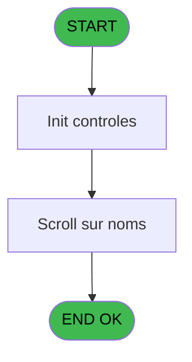
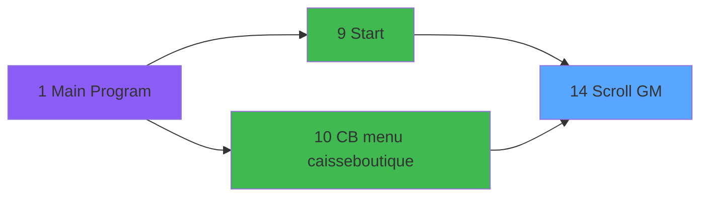

# RET IDE 14 - Scroll GM

> **Analyse**: Phases 1-4 2026-02-03 20:43 -> 20:43 (15s) | Assemblage 20:43
> **Pipeline**: V7.2 Enrichi
> **Structure**: 4 onglets (Resume | Ecrans | Donnees | Connexions)

<!-- TAB:Resume -->

## 1. FICHE D'IDENTITE

| Attribut | Valeur |
|----------|--------|
| Projet | RET |
| IDE Position | 14 |
| Nom Programme | Scroll GM |
| Fichier source | `Prg_14.xml` |
| Dossier IDE | Version |
| Taches | 2 (1 ecrans visibles) |
| Tables modifiees | 0 |
| Programmes appeles | 0 |

## 2. DESCRIPTION FONCTIONNELLE

**Scroll GM** assure la gestion complete de ce processus, accessible depuis [Start (IDE 9)](RET-IDE-9.md), [CB menu caisse/boutique (IDE 10)](RET-IDE-10.md).

Le flux de traitement s'organise en **1 blocs fonctionnels** :

- **Traitement** (2 taches) : traitements metier divers

## 3. BLOCS FONCTIONNELS

### 3.1 Traitement (2 taches)

Traitements internes.

---

#### 14 - (sans nom) [[ECRAN]](#ecran-t1)

**Role** : Traitement interne.
**Ecran** : 640 x 184 DLU (MDI) | [Voir mockup](#ecran-t1)

---

#### 14.1 - Scroll GM [[ECRAN]](#ecran-t2)

**Role** : Traitement : Scroll GM.
**Ecran** : 1590 x 245 DLU (MDI) | [Voir mockup](#ecran-t2)

## 5. REGLES METIER

*(Aucune regle metier identifiee)*

## 6. CONTEXTE

- **Appele par**: [Start (IDE 9)](RET-IDE-9.md), [CB menu caisse/boutique (IDE 10)](RET-IDE-10.md)
- **Appelle**: 0 programmes | **Tables**: 11 (W:0 R:1 L:10) | **Taches**: 2 | **Expressions**: 2

<!-- TAB:Ecrans -->

## 8. ECRANS

### 8.1 Forms visibles (1 / 2)

| # | Position | Tache | Nom | Type | Largeur | Hauteur | Bloc |
|---|----------|-------|-----|------|---------|---------|------|
| 1 | 14.1 | 14.1 | Scroll GM | MDI | 1590 | 245 | Traitement |

### 8.2 Mockups Ecrans

---

#### 14.1 - Scroll GM
**Tache** : [14.1](#t2) | **Type** : MDI | **Dimensions** : 1590 x 245 DLU
**Bloc** : Traitement | **Titre IDE** : Scroll GM

<!-- FORM-DATA:
{
    "width":  1590,
    "vFactor":  8,
    "type":  "MDI",
    "hFactor":  8,
    "controls":  [
                     {
                         "x":  0,
                         "type":  "label",
                         "var":  "",
                         "y":  0,
                         "w":  1587,
                         "fmt":  "",
                         "name":  "",
                         "h":  21,
                         "color":  "",
                         "text":  "",
                         "parent":  null
                     },
                     {
                         "x":  5,
                         "type":  "label",
                         "var":  "",
                         "y":  32,
                         "w":  251,
                         "fmt":  "",
                         "name":  "",
                         "h":  173,
                         "color":  "",
                         "text":  "",
                         "parent":  null
                     },
                     {
                         "x":  257,
                         "type":  "table",
                         "var":  "",
                         "name":  "",
                         "titleH":  12,
                         "color":  "148",
                         "w":  1333,
                         "y":  32,
                         "fmt":  "",
                         "parent":  null,
                         "text":  "",
                         "rowH":  13,
                         "h":  173,
                         "cols":  [
                                      {
                                          "title":  "Nom",
                                          "layer":  1,
                                          "w":  416
                                      },
                                      {
                                          "title":  "Prénom",
                                          "layer":  2,
                                          "w":  125
                                      },
                                      {
                                          "title":  "Sexe",
                                          "layer":  3,
                                          "w":  47
                                      },
                                      {
                                          "title":  "Chambre",
                                          "layer":  4,
                                          "w":  78
                                      },
                                      {
                                          "title":  "Séjour",
                                          "layer":  5,
                                          "w":  237
                                      },
                                      {
                                          "title":  "Divers",
                                          "layer":  6,
                                          "w":  268
                                      },
                                      {
                                          "title":  "Qualité",
                                          "layer":  7,
                                          "w":  128
                                      }
                                  ],
                         "rows":  7
                     },
                     {
                         "x":  14,
                         "type":  "label",
                         "var":  "",
                         "y":  105,
                         "w":  234,
                         "fmt":  "",
                         "name":  "",
                         "h":  10,
                         "color":  "142",
                         "text":  "Nom du GM",
                         "parent":  5
                     },
                     {
                         "x":  3,
                         "type":  "label",
                         "var":  "",
                         "y":  219,
                         "w":  1587,
                         "fmt":  "",
                         "name":  "",
                         "h":  24,
                         "color":  "",
                         "text":  "",
                         "parent":  null
                     },
                     {
                         "x":  288,
                         "type":  "edit",
                         "var":  "",
                         "y":  47,
                         "w":  377,
                         "fmt":  "",
                         "name":  "",
                         "h":  8,
                         "color":  "148",
                         "text":  "",
                         "parent":  6
                     },
                     {
                         "x":  680,
                         "type":  "edit",
                         "var":  "",
                         "y":  47,
                         "w":  119,
                         "fmt":  "",
                         "name":  "",
                         "h":  8,
                         "color":  "148",
                         "text":  "",
                         "parent":  6
                     },
                     {
                         "x":  1172,
                         "type":  "edit",
                         "var":  "",
                         "y":  47,
                         "w":  200,
                         "fmt":  "30",
                         "name":  "",
                         "h":  8,
                         "color":  "6",
                         "text":  "",
                         "parent":  6
                     },
                     {
                         "x":  853,
                         "type":  "edit",
                         "var":  "",
                         "y":  47,
                         "w":  65,
                         "fmt":  "",
                         "name":  "",
                         "h":  8,
                         "color":  "148",
                         "text":  "",
                         "parent":  6
                     },
                     {
                         "x":  14,
                         "type":  "edit",
                         "var":  "",
                         "y":  118,
                         "w":  234,
                         "fmt":  "",
                         "name":  "",
                         "h":  10,
                         "color":  "6",
                         "text":  "",
                         "parent":  5
                     },
                     {
                         "x":  75,
                         "type":  "edit",
                         "var":  "",
                         "y":  6,
                         "w":  395,
                         "fmt":  "30",
                         "name":  "",
                         "h":  8,
                         "color":  "",
                         "text":  "",
                         "parent":  null
                     },
                     {
                         "x":  1312,
                         "type":  "edit",
                         "var":  "",
                         "y":  6,
                         "w":  259,
                         "fmt":  "WWW DD MMM YYYYT",
                         "name":  "",
                         "h":  8,
                         "color":  "",
                         "text":  "",
                         "parent":  null
                     },
                     {
                         "x":  14,
                         "type":  "image",
                         "var":  "",
                         "y":  38,
                         "w":  86,
                         "fmt":  "",
                         "name":  "",
                         "h":  42,
                         "color":  "",
                         "text":  "",
                         "parent":  null
                     },
                     {
                         "x":  933,
                         "type":  "edit",
                         "var":  "",
                         "y":  46,
                         "w":  214,
                         "fmt":  "25",
                         "name":  "",
                         "h":  10,
                         "color":  "6",
                         "text":  "",
                         "parent":  6
                     },
                     {
                         "x":  1379,
                         "type":  "image",
                         "var":  "",
                         "y":  46,
                         "w":  26,
                         "fmt":  "",
                         "name":  "",
                         "h":  10,
                         "color":  "",
                         "text":  "",
                         "parent":  6
                     },
                     {
                         "x":  807,
                         "type":  "edit",
                         "var":  "",
                         "y":  47,
                         "w":  31,
                         "fmt":  "2",
                         "name":  "",
                         "h":  8,
                         "color":  "148",
                         "text":  "",
                         "parent":  6
                     },
                     {
                         "x":  9,
                         "type":  "button",
                         "var":  "",
                         "y":  222,
                         "w":  186,
                         "fmt":  "\u0026Quit",
                         "name":  "Bt.Quitter",
                         "h":  18,
                         "color":  "",
                         "text":  "",
                         "parent":  29
                     },
                     {
                         "x":  5,
                         "type":  "image",
                         "var":  "",
                         "y":  2,
                         "w":  59,
                         "fmt":  "",
                         "name":  "",
                         "h":  18,
                         "color":  "",
                         "text":  "",
                         "parent":  null
                     },
                     {
                         "x":  1401,
                         "type":  "button",
                         "var":  "",
                         "y":  222,
                         "w":  186,
                         "fmt":  "\u0026Extrait de compte",
                         "name":  "Extrait_Compte",
                         "h":  18,
                         "color":  "",
                         "text":  "",
                         "parent":  29
                     },
                     {
                         "x":  1208,
                         "type":  "button",
                         "var":  "",
                         "y":  222,
                         "w":  186,
                         "fmt":  "\u0026Cloture",
                         "name":  "Cloture OB",
                         "h":  18,
                         "color":  "",
                         "text":  "",
                         "parent":  29
                     },
                     {
                         "x":  1435,
                         "type":  "edit",
                         "var":  "",
                         "y":  47,
                         "w":  100,
                         "fmt":  "30",
                         "name":  "heb_type_hebergement",
                         "h":  8,
                         "color":  "148",
                         "text":  "",
                         "parent":  6
                     },
                     {
                         "x":  994,
                         "type":  "button",
                         "var":  "",
                         "y":  222,
                         "w":  207,
                         "fmt":  "\u0026Vérification Garantie",
                         "name":  "Verification Garantie",
                         "h":  18,
                         "color":  "",
                         "text":  "",
                         "parent":  29
                     }
                 ],
    "taskId":  "14.1",
    "height":  245
}
-->

<strong>Champs : 10 champs</strong>

| Pos (x,y) | Nom | Variable | Type |
|-----------|-----|----------|------|
| 288,47 | (sans nom) | - | edit |
| 680,47 | (sans nom) | - | edit |
| 1172,47 | 30 | - | edit |
| 853,47 | (sans nom) | - | edit |
| 14,118 | (sans nom) | - | edit |
| 75,6 | 30 | - | edit |
| 1312,6 | WWW DD MMM YYYYT | - | edit |
| 933,46 | 25 | - | edit |
| 807,47 | 2 | - | edit |
| 1435,47 | heb_type_hebergement | - | edit |

<strong>Boutons : 4 boutons</strong>

| Bouton | Pos (x,y) | Action |
|--------|-----------|--------|
| Quit | 9,222 | Bouton fonctionnel |
| Extrait de compte | 1401,222 | Bouton fonctionnel |
| Cloture | 1208,222 | Bouton fonctionnel |
| Vérification Garantie | 994,222 | Bouton fonctionnel |

## 9. NAVIGATION

Ecran unique: **Scroll GM**

### 9.3 Structure hierarchique (2 taches)

| Position | Tache | Type | Dimensions | Bloc |
|----------|-------|------|------------|------|
| **14.1** | [**(sans nom)** (14)](#t1) [mockup](#ecran-t1) | MDI | 640x184 | Traitement |
| 14.1.1 | [Scroll GM (14.1)](#t2) [mockup](#ecran-t2) | MDI | 1590x245 | |

### 9.4 Algorigramme

> **Legende**: Vert = START/END OK | Rouge = END KO | Bleu = Decisions
> *Algorigramme auto-genere. Utiliser `/algorigramme` pour une synthese metier detaillee.*

<!-- TAB:Donnees -->

## 10. TABLES

### Tables utilisees (11)

| ID | Nom | Description | Type | R | W | L | Usages |
|----|-----|-------------|------|---|---|---|--------|
| 26 | comptes_speciaux_spc | Comptes GM (generaux) | DB | R |   |   | 1 |
| 30 | gm-recherche_____gmr | Index de recherche | DB |   |   | L | 1 |
| 31 | gm-complet_______gmc |  | DB |   |   | L | 1 |
| 34 | hebergement______heb | Hebergement (chambres) | DB |   |   | L | 1 |
| 39 | depot_garantie___dga | Depots et garanties | DB |   |   | L | 1 |
| 47 | compte_gm________cgm | Comptes GM (generaux) | DB |   |   | L | 1 |
| 69 | initialisation___ini |  | DB |   |   | L | 1 |
| 312 | ez_card |  | DB |   |   | L | 1 |
| 358 | import_mod |  | DB |   |   | L | 1 |
| 738 | pv_selling_unit |  | DB |   |   | L | 1 |
| 839 | ##_pv_compta_dat |  | DB |   |   | L | 1 |

### Colonnes par table (3 / 1 tables avec colonnes identifiees)

Table 26 - comptes_speciaux_spc (R) - 1 usages

| Lettre | Variable | Acces | Type |
|--------|----------|-------|------|
| A | code-8chiffres | R | Numeric |
| B | filiation | R | Numeric |
| C | V.Libelle fid | R | Unicode |
| D | V.Couleur fid | R | Numeric |
| E | ---pour--la--chambre | R | Alpha |
| F | v. lien sejour? | R | Logical |
| G | W1 chaîne_recherchee | R | Alpha |
| H | V est un compte special | R | Logical |
| I | V.Libelle VIP | R | Alpha |
| J | V. Montant Garantie | R | Numeric |
| K | V.CodeRetourExtraitCompte | R | Alpha |
| L | V.SoldeCompte | R | Numeric |
| M | V.EtatCompte | R | Alpha |
| N | V.DateSolde | R | Date |
| O | V.GarantieO/N | R | Alpha |

## 11. VARIABLES

### 11.1 Parametres entrants (1)

Variables recues du programme appelant ([Start (IDE 9)](RET-IDE-9.md)).

| Lettre | Nom | Type | Usage dans |
|--------|-----|------|-----------|
| A | P0 societe | Alpha | - |

### 11.2 Variables de session (9)

Variables persistantes pendant toute la session.

| Lettre | Nom | Type | Usage dans |
|--------|-----|------|-----------|
| F | v. lien sejour? | Logical | - |
| H | V est un compte special | Logical | - |
| I | V.Libelle VIP | Alpha | - |
| J | V. Montant Garantie | Numeric | - |
| K | V.CodeRetourExtraitCompte | Alpha | - |
| L | V.SoldeCompte | Numeric | - |
| M | V.EtatCompte | Alpha | - |
| N | V.DateSolde | Date | - |
| O | V.GarantieO/N | Alpha | - |

### 11.3 Variables de travail (1)

Variables internes au programme.

| Lettre | Nom | Type | Usage dans |
|--------|-----|------|-----------|
| B | W0 choix action | Alpha | 1x calcul interne |

### 11.4 Autres (4)

Variables diverses.

| Lettre | Nom | Type | Usage dans |
|--------|-----|------|-----------|
| C | WP0 chaîne recherche | Alpha | - |
| D | WP0 code GM | Numeric | - |
| E | WP0 filiation | Numeric | - |
| G | W1 chaîne_recherchee | Alpha | - |

## 12. EXPRESSIONS

**2 / 2 expressions decodees (100%)**

### 12.1 Repartition par type

| Type | Expressions | Regles |
|------|-------------|--------|
| CONSTANTE | 1 | 0 |
| CONDITION | 1 | 0 |

### 12.2 Expressions cles par type

#### CONSTANTE (1 expressions)

| Type | IDE | Expression | Regle |
|------|-----|------------|-------|
| CONSTANTE | 2 | `'C'` | - |

#### CONDITION (1 expressions)

| Type | IDE | Expression | Regle |
|------|-----|------------|-------|
| CONDITION | 1 | `W0 choix action [B]='F'` | - |

<!-- TAB:Connexions -->

## 13. GRAPHE D'APPELS

### 13.1 Chaine depuis Main (Callers)

Main -> ... -> [Start (IDE 9)](RET-IDE-9.md) -> **Scroll GM (IDE 14)**

Main -> ... -> [CB menu caisse/boutique (IDE 10)](RET-IDE-10.md) -> **Scroll GM (IDE 14)**

### 13.2 Callers

| IDE | Nom Programme | Nb Appels |
|-----|---------------|-----------|
| [9](RET-IDE-9.md) | Start | 1 |
| [10](RET-IDE-10.md) | CB menu caisse/boutique | 1 |

### 13.3 Callees (programmes appeles)

### 13.4 Detail Callees avec contexte

| IDE | Nom Programme | Appels | Contexte |
|-----|---------------|--------|----------|
| - | (aucun) | - | - |

## 14. RECOMMANDATIONS MIGRATION

### 14.1 Profil du programme

| Metrique | Valeur | Impact migration |
|----------|--------|-----------------|
| Lignes de logique | 142 | Programme compact |
| Expressions | 2 | Peu de logique |
| Tables WRITE | 0 | Impact faible |
| Sous-programmes | 0 | Peu de dependances |
| Ecrans visibles | 1 | Ecran unique ou traitement batch |
| Code desactive | 0% (0 / 142) | Code sain |
| Regles metier | 0 | Pas de regle identifiee |

### 14.2 Plan de migration par bloc

#### Traitement (2 taches: 2 ecrans, 0 traitement)

- **Strategie** : 2 composant(s) UI (Razor/React) avec formulaires et validation.
- Decomposer les taches en services unitaires testables.

### 14.3 Dependances critiques

| Dependance | Type | Appels | Impact |
|------------|------|--------|--------|

---
*Spec DETAILED generee par Pipeline V7.2 - 2026-02-03 20:43*
