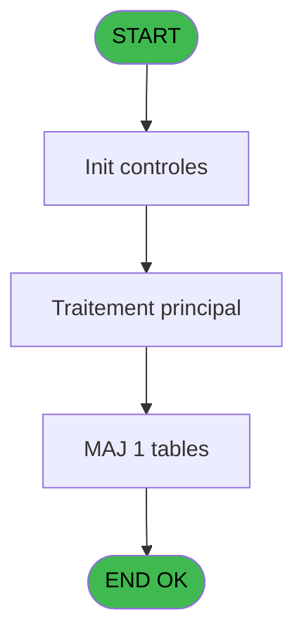

# RET IDE 17 - CB Transfert fichiers GM

> **Analyse**: Phases 1-4 2026-02-03 20:44 -> 20:44 (17s) | Assemblage 20:44
> **Pipeline**: V7.2 Enrichi
> **Structure**: 4 onglets (Resume | Ecrans | Donnees | Connexions)

<!-- TAB:Resume -->

## 1. FICHE D'IDENTITE

| Attribut | Valeur |
|----------|--------|
| Projet | RET |
| IDE Position | 17 |
| Nom Programme | CB Transfert fichiers GM |
| Fichier source | `Prg_17.xml` |
| Dossier IDE | Zoom |
| Taches | 2 (0 ecrans visibles) |
| Tables modifiees | 1 |
| Programmes appeles | 0 |

## 2. DESCRIPTION FONCTIONNELLE

**CB Transfert fichiers GM** assure la gestion complete de ce processus, accessible depuis [CB menu caisse/boutique (IDE 10)](RET-IDE-10.md).

Le flux de traitement s'organise en **2 blocs fonctionnels** :

- **Transfert** (1 tache) : transferts de donnees entre modules ou deversements
- **Traitement** (1 tache) : traitements metier divers

**Donnees modifiees** : 1 tables en ecriture (parametres___par).

Detail : phases du traitement

#### Phase 1 : Traitement (1 tache)

- **17** - Veuillez patienter ... **[[ECRAN]](#ecran-t1)**

#### Phase 2 : Transfert (1 tache)

- **17.1** - Transfert fichiers GM **[[ECRAN]](#ecran-t2)**

#### Tables impactees

| Table | Operations | Role metier |
|-------|-----------|-------------|
| parametres___par | **W** (1 usages) |  |

## 3. BLOCS FONCTIONNELS

### 3.1 Traitement (1 tache)

Traitements internes.

---

#### 17 - Veuillez patienter ... [[ECRAN]](#ecran-t1)

**Role** : Traitement : Veuillez patienter ....
**Ecran** : 426 x 56 DLU (MDI) | [Voir mockup](#ecran-t1)

### 3.2 Transfert (1 tache)

Transfert de donnees entre modules.

---

#### 17.1 - Transfert fichiers GM [[ECRAN]](#ecran-t2)

**Role** : Transfert de donnees : Transfert fichiers GM.
**Ecran** : 798 x 363 DLU (MDI) | [Voir mockup](#ecran-t2)

## 5. REGLES METIER

*(Aucune regle metier identifiee)*

## 6. CONTEXTE

- **Appele par**: [CB menu caisse/boutique (IDE 10)](RET-IDE-10.md)
- **Appelle**: 0 programmes | **Tables**: 9 (W:1 R:1 L:7) | **Taches**: 2 | **Expressions**: 5

<!-- TAB:Ecrans -->

## 8. ECRANS

*(Programme sans ecran visible)*

## 9. NAVIGATION

### 9.3 Structure hierarchique (2 taches)

| Position | Tache | Type | Dimensions | Bloc |
|----------|-------|------|------------|------|
| **17.1** | [**Veuillez patienter ...** (17)](#t1) [mockup](#ecran-t1) | MDI | 426x56 | Traitement |
| **17.2** | [**Transfert fichiers GM** (17.1)](#t2) [mockup](#ecran-t2) | MDI | 798x363 | Transfert |

### 9.4 Algorigramme

> **Legende**: Vert = START/END OK | Rouge = END KO | Bleu = Decisions
> *Algorigramme auto-genere. Utiliser `/algorigramme` pour une synthese metier detaillee.*

<!-- TAB:Donnees -->

## 10. TABLES

### Tables utilisees (9)

| ID | Nom | Description | Type | R | W | L | Usages |
|----|-----|-------------|------|---|---|---|--------|
| 30 | gm-recherche_____gmr | Index de recherche | DB | R |   |   | 1 |
| 34 | hebergement______heb | Hebergement (chambres) | DB |   |   | L | 1 |
| 47 | compte_gm________cgm | Comptes GM (generaux) | DB |   |   | L | 1 |
| 63 | parametres___par |  | DB |   | **W** |   | 1 |
| 312 | ez_card |  | DB |   |   | L | 1 |
| 358 | import_mod |  | DB |   |   | L | 1 |
| 470 | comptage_coffre | Etat du coffre | TMP |   |   | L | 1 |
| 738 | pv_selling_unit |  | DB |   |   | L | 1 |
| 839 | ##_pv_compta_dat |  | DB |   |   | L | 1 |

### Colonnes par table (1 / 2 tables avec colonnes identifiees)

Table 30 - gm-recherche_____gmr (R) - 1 usages

| Lettre | Variable | Acces | Type |
|--------|----------|-------|------|
| A | W2 qualite | R | Alpha |
| B | W2 prenom majuscule | R | Alpha |
| C | W2 níadherent chaine | R | Alpha |
| D | W2 filiation chaine | R | Alpha |
| E | W2 níadherent chaine Kari | R | Alpha |
| F | W2 filiation chaine Kari | R | Alpha |
| G | retour 25 avec Garantie | R | Logical |
| H | retour millesia | R | Logical |
| I | retour type millesia | R | Logical |
| J | V.Libelle VIP | R | Alpha |

Table 63 - parametres___par (**W**) - 1 usages

*Table utilisee uniquement en Link ou aucune colonne Real identifiee dans le DataView.*

## 11. VARIABLES

### 11.1 Variables de session (1)

Variables persistantes pendant toute la session.

| Lettre | Nom | Type | Usage dans |
|--------|-----|------|-----------|
| J | V.Libelle VIP | Alpha | - |

### 11.2 Autres (9)

Variables diverses.

| Lettre | Nom | Type | Usage dans |
|--------|-----|------|-----------|
| A | W2 qualite | Alpha | - |
| B | W2 prenom majuscule | Alpha | - |
| C | W2 níadherent chaine | Alpha | - |
| D | W2 filiation chaine | Alpha | - |
| E | W2 níadherent chaine Kari | Alpha | - |
| F | W2 filiation chaine Kari | Alpha | - |
| G | retour 25 avec Garantie | Logical | - |
| H | retour millesia | Logical | - |
| I | retour type millesia | Logical | - |

## 12. EXPRESSIONS

**5 / 5 expressions decodees (100%)**

### 12.1 Repartition par type

| Type | Expressions | Regles |
|------|-------------|--------|
| CONSTANTE | 3 | 0 |
| OTHER | 2 | 0 |

### 12.2 Expressions cles par type

#### CONSTANTE (3 expressions)

| Type | IDE | Expression | Regle |
|------|-----|------------|-------|
| CONSTANTE | 5 | `1` | - |
| CONSTANTE | 4 | `'EZGUA'` | - |
| CONSTANTE | 3 | `'C'` | - |

#### OTHER (2 expressions)

| Type | IDE | Expression | Regle |
|------|-----|------------|-------|
| OTHER | 2 | `SetCrsr (1)` | - |
| OTHER | 1 | `SetCrsr (2)` | - |

<!-- TAB:Connexions -->

## 13. GRAPHE D'APPELS

### 13.1 Chaine depuis Main (Callers)

Main -> ... -> [CB menu caisse/boutique (IDE 10)](RET-IDE-10.md) -> **CB Transfert fichiers GM (IDE 17)**

### 13.2 Callers

| IDE | Nom Programme | Nb Appels |
|-----|---------------|-----------|
| [10](RET-IDE-10.md) | CB menu caisse/boutique | 1 |

### 13.3 Callees (programmes appeles)

### 13.4 Detail Callees avec contexte

| IDE | Nom Programme | Appels | Contexte |
|-----|---------------|--------|----------|
| - | (aucun) | - | - |

## 14. RECOMMANDATIONS MIGRATION

### 14.1 Profil du programme

| Metrique | Valeur | Impact migration |
|----------|--------|-----------------|
| Lignes de logique | 91 | Programme compact |
| Expressions | 5 | Peu de logique |
| Tables WRITE | 1 | Impact faible |
| Sous-programmes | 0 | Peu de dependances |
| Ecrans visibles | 0 | Ecran unique ou traitement batch |
| Code desactive | 0% (0 / 91) | Code sain |
| Regles metier | 0 | Pas de regle identifiee |

### 14.2 Plan de migration par bloc

#### Traitement (1 tache: 1 ecran, 0 traitement)

- **Strategie** : 1 composant(s) UI (Razor/React) avec formulaires et validation.
- Decomposer les taches en services unitaires testables.

#### Transfert (1 tache: 1 ecran, 0 traitement)

- **Strategie** : Service `ITransfertService` avec logique de deversement.

### 14.3 Dependances critiques

| Dependance | Type | Appels | Impact |
|------------|------|--------|--------|
| parametres___par | Table WRITE (Database) | 1x | Schema + repository |

---
*Spec DETAILED generee par Pipeline V7.2 - 2026-02-03 20:44*
