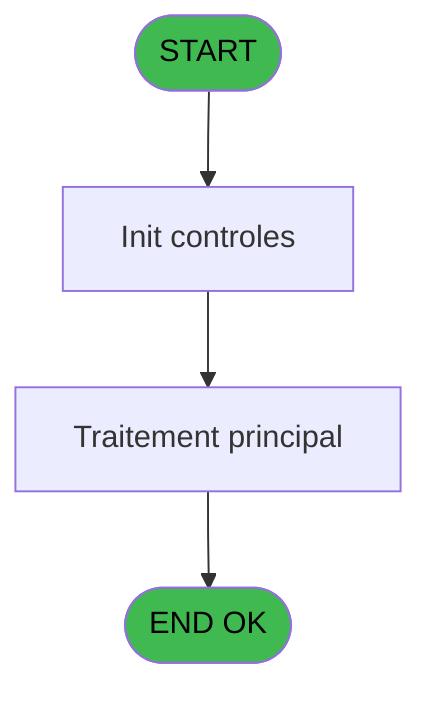

# RET IDE 18 - Zoom articles

> **Analyse**: Phases 1-4 2026-02-03 20:44 -> 20:45 (14s) | Assemblage 20:45
> **Pipeline**: V7.2 Enrichi
> **Structure**: 4 onglets (Resume | Ecrans | Donnees | Connexions)

<!-- TAB:Resume -->

## 1. FICHE D'IDENTITE

| Attribut | Valeur |
|----------|--------|
| Projet | RET |
| IDE Position | 18 |
| Nom Programme | Zoom articles |
| Fichier source | `Prg_18.xml` |
| Dossier IDE | Ventes |
| Taches | 2 (1 ecrans visibles) |
| Tables modifiees | 0 |
| Programmes appeles | 0 |

## 2. DESCRIPTION FONCTIONNELLE

**Zoom articles** assure la gestion complete de ce processus, accessible depuis [CB menu caisse/boutique (IDE 10)](RET-IDE-10.md).

Le flux de traitement s'organise en **1 blocs fonctionnels** :

- **Traitement** (2 taches) : traitements metier divers

**Logique metier** : 1 regles identifiees couvrant conditions metier.

## 3. BLOCS FONCTIONNELS

### 3.1 Traitement (2 taches)

Traitements internes.

---

#### 18 - Articles Boutique [[ECRAN]](#ecran-t1)

**Role** : Traitement : Articles Boutique.
**Ecran** : 357 x 152 DLU (MDI) | [Voir mockup](#ecran-t1)

---

#### 18.1 - void

**Role** : Traitement : void.

## 5. REGLES METIER

1 regles identifiees:

### Autres (1 regles)

#### [RM-001] Si < destination [B]='G' alors MlsTrans('Article Boutique Golf') sinon MlsTrans('Article Boutique'))

| Element | Detail |
|---------|--------|
| **Condition** | `< destination [B]='G'` |
| **Si vrai** | MlsTrans('Article Boutique Golf') |
| **Si faux** | MlsTrans('Article Boutique')) |
| **Variables** | B (< destination) |
| **Expression source** | Expression 5 : `IF (< destination [B]='G',MlsTrans('Article Boutique Golf'),` |
| **Exemple** | Si < destination [B]='G' → MlsTrans('Article Boutique Golf'). Sinon → MlsTrans('Article Boutique')) |

## 6. CONTEXTE

- **Appele par**: [CB menu caisse/boutique (IDE 10)](RET-IDE-10.md)
- **Appelle**: 0 programmes | **Tables**: 1 (W:0 R:1 L:0) | **Taches**: 2 | **Expressions**: 5

<!-- TAB:Ecrans -->

## 8. ECRANS

### 8.1 Forms visibles (1 / 2)

| # | Position | Tache | Nom | Type | Largeur | Hauteur | Bloc |
|---|----------|-------|-----|------|---------|---------|------|
| 1 | 18 | 18 | Articles Boutique | MDI | 357 | 152 | Traitement |

### 8.2 Mockups Ecrans

---

#### 18 - Articles Boutique
**Tache** : [18](#t1) | **Type** : MDI | **Dimensions** : 357 x 152 DLU
**Bloc** : Traitement | **Titre IDE** : Articles Boutique

<!-- FORM-DATA:
{
    "width":  357,
    "vFactor":  8,
    "type":  "MDI",
    "hFactor":  8,
    "controls":  [
                     {
                         "x":  59,
                         "type":  "table",
                         "var":  "",
                         "name":  "",
                         "titleH":  12,
                         "color":  "196",
                         "w":  259,
                         "y":  7,
                         "fmt":  "",
                         "parent":  null,
                         "text":  "",
                         "rowH":  13,
                         "h":  102,
                         "cols":  [
                                      {
                                          "title":  "Articles",
                                          "layer":  1,
                                          "w":  253
                                      }
                                  ],
                         "rows":  1
                     },
                     {
                         "x":  0,
                         "type":  "label",
                         "var":  "",
                         "y":  132,
                         "w":  355,
                         "fmt":  "",
                         "name":  "",
                         "h":  19,
                         "color":  "",
                         "text":  "",
                         "parent":  null
                     },
                     {
                         "x":  61,
                         "type":  "edit",
                         "var":  "",
                         "y":  22,
                         "w":  245,
                         "fmt":  "",
                         "name":  "",
                         "h":  8,
                         "color":  "196",
                         "text":  "",
                         "parent":  1
                     },
                     {
                         "x":  112,
                         "type":  "button",
                         "var":  "",
                         "y":  135,
                         "w":  144,
                         "fmt":  "",
                         "name":  "",
                         "h":  14,
                         "color":  "",
                         "text":  "",
                         "parent":  null
                     },
                     {
                         "x":  155,
                         "type":  "image",
                         "var":  "",
                         "y":  111,
                         "w":  58,
                         "fmt":  "",
                         "name":  "",
                         "h":  18,
                         "color":  "",
                         "text":  "",
                         "parent":  null
                     }
                 ],
    "taskId":  "18",
    "height":  152
}
-->

<strong>Champs : 1 champs</strong>

| Pos (x,y) | Nom | Variable | Type |
|-----------|-----|----------|------|
| 61,22 | (sans nom) | - | edit |

<strong>Boutons : 1 boutons</strong>

| Bouton | Pos (x,y) | Action |
|--------|-----------|--------|
| (sans nom) | 112,135 | Action declenchee |

## 9. NAVIGATION

Ecran unique: **Articles Boutique**

### 9.3 Structure hierarchique (2 taches)

| Position | Tache | Type | Dimensions | Bloc |
|----------|-------|------|------------|------|
| **18.1** | [**Articles Boutique** (18)](#t1) [mockup](#ecran-t1) | MDI | 357x152 | Traitement |
| 18.1.1 | [void (18.1)](#t2) | MDI | - | |

### 9.4 Algorigramme

> **Legende**: Vert = START/END OK | Rouge = END KO | Bleu = Decisions
> *Algorigramme auto-genere. Utiliser `/algorigramme` pour une synthese metier detaillee.*

<!-- TAB:Donnees -->

## 10. TABLES

### Tables utilisees (1)

| ID | Nom | Description | Type | R | W | L | Usages |
|----|-----|-------------|------|---|---|---|--------|
| 77 | articles_________art | Articles et stock | DB | R |   |   | 1 |

### Colonnes par table (1 / 1 tables avec colonnes identifiees)

Table 77 - articles_________art (R) - 1 usages

| Lettre | Variable | Acces | Type |
|--------|----------|-------|------|
| A | < code article | R | Numeric |
| B | < destination | R | Alpha |
| C | bouton selectionner | R | Alpha |
| D | no exit | R | Logical |

## 11. VARIABLES

### 11.1 Autres (4)

Variables diverses.

| Lettre | Nom | Type | Usage dans |
|--------|-----|------|-----------|
| A | < code article | Numeric | [18](#t1) |
| B | < destination | Alpha | 1x refs |
| C | bouton selectionner | Alpha | - |
| D | no exit | Logical | 1x refs |

## 12. EXPRESSIONS

**5 / 5 expressions decodees (100%)**

### 12.1 Repartition par type

| Type | Expressions | Regles |
|------|-------------|--------|
| CONDITION | 2 | 5 |
| CONSTANTE | 2 | 0 |
| OTHER | 1 | 0 |

### 12.2 Expressions cles par type

#### CONDITION (2 expressions)

| Type | IDE | Expression | Regle |
|------|-----|------------|-------|
| CONDITION | 5 | `IF (< destination [B]='G',MlsTrans('Article Boutique Golf'),MlsTrans('Article Boutique'))` | [RM-001](#rm-RM-001) |
| CONDITION | 4 | `< code article [A]` | - |

#### CONSTANTE (2 expressions)

| Type | IDE | Expression | Regle |
|------|-----|------------|-------|
| CONSTANTE | 2 | `'BOUT'` | - |
| CONSTANTE | 1 | `'&Selectionner'` | - |

#### OTHER (1 expressions)

| Type | IDE | Expression | Regle |
|------|-----|------------|-------|
| OTHER | 3 | `no exit [D]` | - |

<!-- TAB:Connexions -->

## 13. GRAPHE D'APPELS

### 13.1 Chaine depuis Main (Callers)

Main -> ... -> [CB menu caisse/boutique (IDE 10)](RET-IDE-10.md) -> **Zoom articles (IDE 18)**

### 13.2 Callers

| IDE | Nom Programme | Nb Appels |
|-----|---------------|-----------|
| [10](RET-IDE-10.md) | CB menu caisse/boutique | 2 |

### 13.3 Callees (programmes appeles)

### 13.4 Detail Callees avec contexte

| IDE | Nom Programme | Appels | Contexte |
|-----|---------------|--------|----------|
| - | (aucun) | - | - |

## 14. RECOMMANDATIONS MIGRATION

### 14.1 Profil du programme

| Metrique | Valeur | Impact migration |
|----------|--------|-----------------|
| Lignes de logique | 19 | Programme compact |
| Expressions | 5 | Peu de logique |
| Tables WRITE | 0 | Impact faible |
| Sous-programmes | 0 | Peu de dependances |
| Ecrans visibles | 1 | Ecran unique ou traitement batch |
| Code desactive | 0% (0 / 19) | Code sain |
| Regles metier | 1 | Quelques regles a preserver |

### 14.2 Plan de migration par bloc

#### Traitement (2 taches: 1 ecran, 1 traitement)

- **Strategie** : Orchestrateur avec 1 ecrans (Razor/React) et 1 traitements backend (services).
- Les ecrans deviennent des composants UI, les traitements invisibles deviennent des services injectables.
- Decomposer les taches en services unitaires testables.

### 14.3 Dependances critiques

| Dependance | Type | Appels | Impact |
|------------|------|--------|--------|

---
*Spec DETAILED generee par Pipeline V7.2 - 2026-02-03 20:45*
