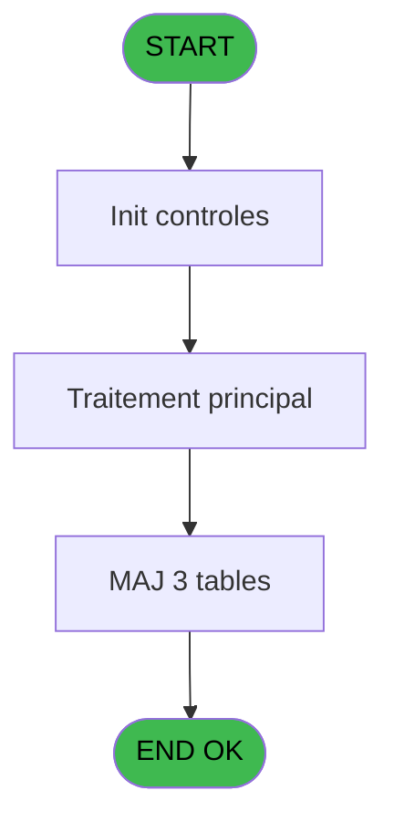
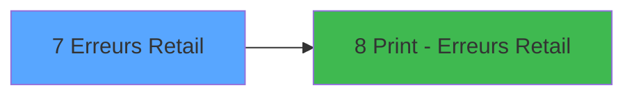

# RET IDE 7 - Erreurs Retail

> **Analyse**: Phases 1-4 2026-02-03 20:40 -> 20:40 (16s) | Assemblage 20:40
> **Pipeline**: V7.2 Enrichi
> **Structure**: 4 onglets (Resume | Ecrans | Donnees | Connexions)

<!-- TAB:Resume -->

## 1. FICHE D'IDENTITE

| Attribut | Valeur |
|----------|--------|
| Projet | RET |
| IDE Position | 7 |
| Nom Programme | Erreurs Retail |
| Fichier source | `Prg_7.xml` |
| Dossier IDE | Erreurs |
| Taches | 3 (1 ecrans visibles) |
| Tables modifiees | 3 |
| Programmes appeles | 1 |

## 2. DESCRIPTION FONCTIONNELLE

**Erreurs Retail** assure la gestion complete de ce processus, accessible depuis [CB menu caisse/boutique (IDE 10)](RET-IDE-10.md).

Le flux de traitement s'organise en **2 blocs fonctionnels** :

- **Creation** (2 taches) : insertion d'enregistrements en base (mouvements, prestations)
- **Traitement** (1 tache) : traitements metier divers

**Donnees modifiees** : 3 tables en ecriture (comptable_gratuite, comptable________cte, tai_forfait).

Detail : phases du traitement

#### Phase 1 : Traitement (1 tache)

- **7** - Erreurs Retail **[[ECRAN]](#ecran-t1)**

#### Phase 2 : Creation (2 taches)

- **7.1** - Creation OD boutique
- **7.2** - Creation OD boutique gratuite

#### Tables impactees

| Table | Operations | Role metier |
|-------|-----------|-------------|
| tai_forfait | **W** (1 usages) |  |
| comptable________cte | **W** (1 usages) |  |
| comptable_gratuite | **W** (1 usages) |  |

## 3. BLOCS FONCTIONNELS

### 3.1 Traitement (1 tache)

Traitements internes.

---

#### 7 - Erreurs Retail [[ECRAN]](#ecran-t1)

**Role** : Traitement : Erreurs Retail.
**Ecran** : 1614 x 218 DLU (MDI) | [Voir mockup](#ecran-t1)
**Delegue a** : [Print - Erreurs Retail (IDE 8)](RET-IDE-8.md)

### 3.2 Creation (2 taches)

Insertion de nouveaux enregistrements en base.

---

#### 7.1 - Creation OD boutique

**Role** : Creation d'enregistrement : Creation OD boutique.

---

#### 7.2 - Creation OD boutique gratuite

**Role** : Creation d'enregistrement : Creation OD boutique gratuite.
**Variables liees** : C (T Gratuite)

## 5. REGLES METIER

*(Aucune regle metier identifiee)*

## 6. CONTEXTE

- **Appele par**: [CB menu caisse/boutique (IDE 10)](RET-IDE-10.md)
- **Appelle**: 1 programmes | **Tables**: 9 (W:3 R:0 L:6) | **Taches**: 3 | **Expressions**: 17

<!-- TAB:Ecrans -->

## 8. ECRANS

### 8.1 Forms visibles (1 / 3)

| # | Position | Tache | Nom | Type | Largeur | Hauteur | Bloc |
|---|----------|-------|-----|------|---------|---------|------|
| 1 | 7 | 7 | Erreurs Retail | MDI | 1614 | 218 | Traitement |

### 8.2 Mockups Ecrans

---

#### 7 - Erreurs Retail
**Tache** : [7](#t1) | **Type** : MDI | **Dimensions** : 1614 x 218 DLU
**Bloc** : Traitement | **Titre IDE** : Erreurs Retail

<!-- FORM-DATA:
{
    "width":  1614,
    "vFactor":  8,
    "type":  "MDI",
    "hFactor":  8,
    "controls":  [
                     {
                         "x":  9,
                         "type":  "table",
                         "var":  "",
                         "name":  "",
                         "titleH":  12,
                         "color":  "110",
                         "w":  1597,
                         "y":  8,
                         "fmt":  "",
                         "parent":  null,
                         "text":  "",
                         "rowH":  10,
                         "h":  168,
                         "cols":  [
                                      {
                                          "title":  "Date Comptable",
                                          "layer":  1,
                                          "w":  142
                                      },
                                      {
                                          "title":  "Num Adhérent",
                                          "layer":  2,
                                          "w":  148
                                      },
                                      {
                                          "title":  "Filiation",
                                          "layer":  3,
                                          "w":  64
                                      },
                                      {
                                          "title":  "Nom",
                                          "layer":  4,
                                          "w":  306
                                      },
                                      {
                                          "title":  "Prénom",
                                          "layer":  5,
                                          "w":  96
                                      },
                                      {
                                          "title":  "Date Achat",
                                          "layer":  6,
                                          "w":  102
                                      },
                                      {
                                          "title":  "Heure Achat",
                                          "layer":  7,
                                          "w":  90
                                      },
                                      {
                                          "title":  "Date Post",
                                          "layer":  8,
                                          "w":  94
                                      },
                                      {
                                          "title":  "Heure Post",
                                          "layer":  9,
                                          "w":  78
                                      },
                                      {
                                          "title":  "Montant",
                                          "layer":  10,
                                          "w":  140
                                      },
                                      {
                                          "title":  "Type Erreur",
                                          "layer":  11,
                                          "w":  306
                                      }
                                  ],
                         "rows":  11
                     },
                     {
                         "x":  158,
                         "type":  "edit",
                         "var":  "",
                         "y":  22,
                         "w":  102,
                         "fmt":  "",
                         "name":  "",
                         "h":  6,
                         "color":  "110",
                         "text":  "",
                         "parent":  1
                     },
                     {
                         "x":  306,
                         "type":  "edit",
                         "var":  "",
                         "y":  22,
                         "w":  36,
                         "fmt":  "",
                         "name":  "",
                         "h":  6,
                         "color":  "110",
                         "text":  "",
                         "parent":  1
                     },
                     {
                         "x":  370,
                         "type":  "edit",
                         "var":  "",
                         "y":  22,
                         "w":  294,
                         "fmt":  "",
                         "name":  "",
                         "h":  6,
                         "color":  "110",
                         "text":  "",
                         "parent":  1
                     },
                     {
                         "x":  677,
                         "type":  "edit",
                         "var":  "",
                         "y":  22,
                         "w":  84,
                         "fmt":  "",
                         "name":  "",
                         "h":  6,
                         "color":  "110",
                         "text":  "",
                         "parent":  1
                     },
                     {
                         "x":  773,
                         "type":  "edit",
                         "var":  "",
                         "y":  22,
                         "w":  88,
                         "fmt":  "",
                         "name":  "",
                         "h":  6,
                         "color":  "110",
                         "text":  "",
                         "parent":  1
                     },
                     {
                         "x":  874,
                         "type":  "edit",
                         "var":  "",
                         "y":  22,
                         "w":  54,
                         "fmt":  "HH:MM",
                         "name":  "",
                         "h":  6,
                         "color":  "110",
                         "text":  "",
                         "parent":  1
                     },
                     {
                         "x":  965,
                         "type":  "edit",
                         "var":  "",
                         "y":  22,
                         "w":  88,
                         "fmt":  "",
                         "name":  "",
                         "h":  6,
                         "color":  "110",
                         "text":  "",
                         "parent":  1
                     },
                     {
                         "x":  1058,
                         "type":  "edit",
                         "var":  "",
                         "y":  22,
                         "w":  54,
                         "fmt":  "HH:MM",
                         "name":  "",
                         "h":  6,
                         "color":  "110",
                         "text":  "",
                         "parent":  1
                     },
                     {
                         "x":  1136,
                         "type":  "edit",
                         "var":  "",
                         "y":  22,
                         "w":  128,
                         "fmt":  "",
                         "name":  "",
                         "h":  6,
                         "color":  "110",
                         "text":  "",
                         "parent":  1
                     },
                     {
                         "x":  1277,
                         "type":  "edit",
                         "var":  "",
                         "y":  22,
                         "w":  294,
                         "fmt":  "",
                         "name":  "",
                         "h":  6,
                         "color":  "110",
                         "text":  "",
                         "parent":  1
                     },
                     {
                         "x":  16,
                         "type":  "edit",
                         "var":  "",
                         "y":  22,
                         "w":  88,
                         "fmt":  "",
                         "name":  "",
                         "h":  6,
                         "color":  "110",
                         "text":  "",
                         "parent":  1
                     },
                     {
                         "x":  264,
                         "type":  "button",
                         "var":  "",
                         "y":  192,
                         "w":  276,
                         "fmt":  "",
                         "name":  "bt Supprimer",
                         "h":  14,
                         "color":  "",
                         "text":  "",
                         "parent":  null
                     },
                     {
                         "x":  592,
                         "type":  "button",
                         "var":  "",
                         "y":  192,
                         "w":  276,
                         "fmt":  "",
                         "name":  "bt Generer ecriture",
                         "h":  14,
                         "color":  "",
                         "text":  "",
                         "parent":  null
                     },
                     {
                         "x":  920,
                         "type":  "button",
                         "var":  "",
                         "y":  192,
                         "w":  276,
                         "fmt":  "",
                         "name":  "bt Quitter",
                         "h":  14,
                         "color":  "",
                         "text":  "",
                         "parent":  null
                     },
                     {
                         "x":  1250,
                         "type":  "button",
                         "var":  "",
                         "y":  192,
                         "w":  276,
                         "fmt":  "",
                         "name":  "bt Imprimer",
                         "h":  14,
                         "color":  "",
                         "text":  "",
                         "parent":  null
                     }
                 ],
    "taskId":  "7",
    "height":  218
}
-->

<strong>Champs : 11 champs</strong>

| Pos (x,y) | Nom | Variable | Type |
|-----------|-----|----------|------|
| 158,22 | (sans nom) | - | edit |
| 306,22 | (sans nom) | - | edit |
| 370,22 | (sans nom) | - | edit |
| 677,22 | (sans nom) | - | edit |
| 773,22 | (sans nom) | - | edit |
| 874,22 | HH:MM | - | edit |
| 965,22 | (sans nom) | - | edit |
| 1058,22 | HH:MM | - | edit |
| 1136,22 | (sans nom) | - | edit |
| 1277,22 | (sans nom) | - | edit |
| 16,22 | (sans nom) | - | edit |

<strong>Boutons : 4 boutons</strong>

| Bouton | Pos (x,y) | Action |
|--------|-----------|--------|
| bt Supprimer | 264,192 | Supprime l'element selectionne |
| bt Generer ecriture | 592,192 | Bouton fonctionnel |
| bt Quitter | 920,192 | Quitte le programme |
| bt Imprimer | 1250,192 | Lance l'impression |

## 9. NAVIGATION

Ecran unique: **Erreurs Retail**

### 9.3 Structure hierarchique (3 taches)

| Position | Tache | Type | Dimensions | Bloc |
|----------|-------|------|------------|------|
| **7.1** | [**Erreurs Retail** (7)](#t1) [mockup](#ecran-t1) | MDI | 1614x218 | Traitement |
| **7.2** | [**Creation OD boutique** (7.1)](#t2) | MDI | - | Creation |
| 7.2.1 | [Creation OD boutique gratuite (7.2)](#t3) | MDI | - | |

### 9.4 Algorigramme

> **Legende**: Vert = START/END OK | Rouge = END KO | Bleu = Decisions
> *Algorigramme auto-genere. Utiliser `/algorigramme` pour une synthese metier detaillee.*

<!-- TAB:Donnees -->

## 10. TABLES

### Tables utilisees (9)

| ID | Nom | Description | Type | R | W | L | Usages |
|----|-----|-------------|------|---|---|---|--------|
| 23 | reseau_cloture___rec | Donnees reseau/cloture | DB |   |   | L | 1 |
| 31 | gm-complet_______gmc |  | DB |   |   | L | 1 |
| 38 | comptable_gratuite |  | DB |   | **W** |   | 1 |
| 40 | comptable________cte |  | DB |   | **W** |   | 1 |
| 47 | compte_gm________cgm | Comptes GM (generaux) | DB |   |   | L | 2 |
| 77 | articles_________art | Articles et stock | DB |   |   | L | 1 |
| 79 | gratuites________gra |  | DB |   |   | L | 1 |
| 453 | tai_forfait |  | DB |   | **W** |   | 1 |
| 729 | arc_cc_type_detail |  | DB |   |   | L | 1 |

### Colonnes par table (3 / 3 tables avec colonnes identifiees)

Table 38 - comptable_gratuite (**W**) - 1 usages

| Lettre | Variable | Acces | Type |
|--------|----------|-------|------|
| A | P. Date Comptable | W | Date |
| C | T Gratuite | W | Logical |

Table 40 - comptable________cte (**W**) - 1 usages

| Lettre | Variable | Acces | Type |
|--------|----------|-------|------|
| A | P. Date Comptable | W | Date |

Table 453 - tai_forfait (**W**) - 1 usages

| Lettre | Variable | Acces | Type |
|--------|----------|-------|------|
| A | P. Date Comptable | W | Date |
| B | T Clôture en cours | W | Logical |
| C | T Gratuite | W | Logical |
| D | bt Supprimer | W | Alpha |
| E | Confirmation | W | Numeric |
| F | bt Generer ecriture | W | Alpha |
| G | bt Quitter | W | Alpha |
| H | bt Imprimer | W | Alpha |

## 11. VARIABLES

### 11.1 Parametres entrants (1)

Variables recues du programme appelant ([CB menu caisse/boutique (IDE 10)](RET-IDE-10.md)).

| Lettre | Nom | Type | Usage dans |
|--------|-----|------|-----------|
| A | P. Date Comptable | Date | 1x parametre entrant |

### 11.2 Autres (7)

Variables diverses.

| Lettre | Nom | Type | Usage dans |
|--------|-----|------|-----------|
| B | T Clôture en cours | Logical | 1x refs |
| C | T Gratuite | Logical | - |
| D | bt Supprimer | Alpha | - |
| E | Confirmation | Numeric | - |
| F | bt Generer ecriture | Alpha | 1x refs |
| G | bt Quitter | Alpha | - |
| H | bt Imprimer | Alpha | 1x refs |

## 12. EXPRESSIONS

**17 / 17 expressions decodees (100%)**

### 12.1 Repartition par type

| Type | Expressions | Regles |
|------|-------------|--------|
| CONSTANTE | 1 | 0 |
| OTHER | 12 | 0 |
| CONDITION | 1 | 0 |
| NEGATION | 2 | 0 |
| CAST_LOGIQUE | 1 | 0 |

### 12.2 Expressions cles par type

#### CONSTANTE (1 expressions)

| Type | IDE | Expression | Regle |
|------|-----|------------|-------|
| CONSTANTE | 1 | `'C'` | - |

#### OTHER (12 expressions)

| Type | IDE | Expression | Regle |
|------|-----|------------|-------|
| OTHER | 10 | `[I]` | - |
| OTHER | 9 | `bt Imprimer [H]` | - |
| OTHER | 8 | `[AC]` | - |
| OTHER | 17 | `{1,27}` | - |
| OTHER | 15 | `MlsTrans ('Ecriture generee !')` | - |
| ... | | *+7 autres* | |

#### CONDITION (1 expressions)

| Type | IDE | Expression | Regle |
|------|-----|------------|-------|
| CONDITION | 11 | `[AN]=6` | - |

#### NEGATION (2 expressions)

| Type | IDE | Expression | Regle |
|------|-----|------------|-------|
| NEGATION | 14 | `NOT (T Clôture en cours [B]) AND [V]='Customer blocked' AND [AF]<>'R'` | - |
| NEGATION | 12 | `NOT ([AG])` | - |

#### CAST_LOGIQUE (1 expressions)

| Type | IDE | Expression | Regle |
|------|-----|------------|-------|
| CAST_LOGIQUE | 16 | `'FALSE'LOG` | - |

<!-- TAB:Connexions -->

## 13. GRAPHE D'APPELS

### 13.1 Chaine depuis Main (Callers)

Main -> ... -> [CB menu caisse/boutique (IDE 10)](RET-IDE-10.md) -> **Erreurs Retail (IDE 7)**

### 13.2 Callers

| IDE | Nom Programme | Nb Appels |
|-----|---------------|-----------|
| [10](RET-IDE-10.md) | CB menu caisse/boutique | 1 |

### 13.3 Callees (programmes appeles)

### 13.4 Detail Callees avec contexte

| IDE | Nom Programme | Appels | Contexte |
|-----|---------------|--------|----------|
| [8](RET-IDE-8.md) | Print - Erreurs Retail | 1 | Impression ticket/document |

## 14. RECOMMANDATIONS MIGRATION

### 14.1 Profil du programme

| Metrique | Valeur | Impact migration |
|----------|--------|-----------------|
| Lignes de logique | 180 | Programme compact |
| Expressions | 17 | Peu de logique |
| Tables WRITE | 3 | Impact modere |
| Sous-programmes | 1 | Peu de dependances |
| Ecrans visibles | 1 | Ecran unique ou traitement batch |
| Code desactive | 0% (0 / 180) | Code sain |
| Regles metier | 0 | Pas de regle identifiee |

### 14.2 Plan de migration par bloc

#### Traitement (1 tache: 1 ecran, 0 traitement)

- **Strategie** : 1 composant(s) UI (Razor/React) avec formulaires et validation.
- 1 sous-programme(s) a migrer ou a reutiliser depuis les services existants.
- Decomposer les taches en services unitaires testables.

#### Creation (2 taches: 0 ecran, 2 traitements)

- **Strategie** : Repository pattern avec Entity Framework Core.
- Insertion via `IRepository<T>.CreateAsync()`

### 14.3 Dependances critiques

| Dependance | Type | Appels | Impact |
|------------|------|--------|--------|
| comptable_gratuite | Table WRITE (Database) | 1x | Schema + repository |
| comptable________cte | Table WRITE (Database) | 1x | Schema + repository |
| tai_forfait | Table WRITE (Database) | 1x | Schema + repository |
| [Print - Erreurs Retail (IDE 8)](RET-IDE-8.md) | Sous-programme | 1x | Normale - Impression ticket/document |

---
*Spec DETAILED generee par Pipeline V7.2 - 2026-02-03 20:41*
