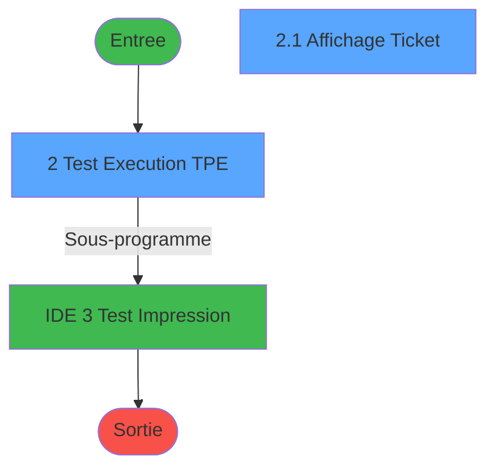
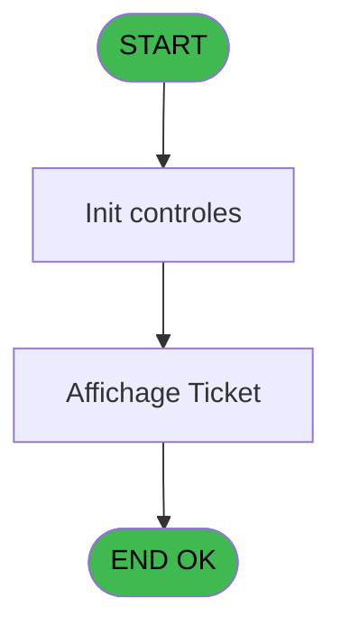
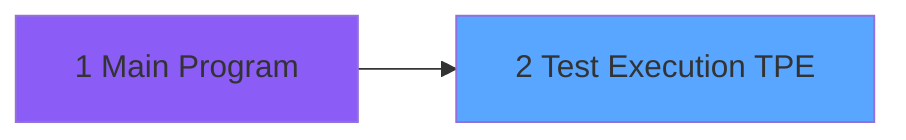

# TPE IDE 2 - Test Execution TPE

> **Analyse**: Phases 1-4 2026-02-03 20:45 -> 20:45 (15s) | Assemblage 20:45
> **Pipeline**: V7.2 Enrichi
> **Structure**: 4 onglets (Resume | Ecrans | Donnees | Connexions)

<!-- TAB:Resume -->

## 1. FICHE D'IDENTITE

| Attribut | Valeur |
|----------|--------|
| Projet | TPE |
| IDE Position | 2 |
| Nom Programme | Test Execution TPE |
| Fichier source | `Prg_2.xml` |
| Dossier IDE | General |
| Taches | 2 (2 ecrans visibles) |
| Tables modifiees | 0 |
| Programmes appeles | 1 |

## 2. DESCRIPTION FONCTIONNELLE

**Test Execution TPE** assure la gestion complete de ce processus, accessible depuis [Main Program (IDE 1)](TPE-IDE-1.md).

Le flux de traitement s'organise en **2 blocs fonctionnels** :

- **Impression** (1 tache) : generation de tickets et documents
- **Traitement** (1 tache) : traitements metier divers

**Logique metier** : 2 regles identifiees couvrant conditions metier.

Detail : phases du traitement

#### Phase 1 : Traitement (1 tache)

- **2** - Test Execution TPE **[[ECRAN]](#ecran-t1)**

Delegue a : [Test Impression (IDE 3)](TPE-IDE-3.md)

#### Phase 2 : Impression (1 tache)

- **2.1** - Affichage Ticket **[[ECRAN]](#ecran-t2)**

## 3. BLOCS FONCTIONNELS

### 3.1 Traitement (1 tache)

Traitements internes.

---

#### 2 - Test Execution TPE [[ECRAN]](#ecran-t1)

**Role** : Verification : Test Execution TPE.
**Ecran** : 333 x 348 DLU | [Voir mockup](#ecran-t1)
**Delegue a** : [Test Impression (IDE 3)](TPE-IDE-3.md)

### 3.2 Impression (1 tache)

Generation des documents et tickets.

---

#### 2.1 - Affichage Ticket [[ECRAN]](#ecran-t2)

**Role** : Generation du document : Affichage Ticket.
**Ecran** : 333 x 348 DLU | [Voir mockup](#ecran-t2)
**Variables liees** : S (v.Blob affichage Ticket)

## 5. REGLES METIER

2 regles identifiees:

### Autres (2 regles)

#### [RM-001] Verification d'appartenance de Montant [F] a une liste de valeurs

| Element | Detail |
|---------|--------|
| **Condition** | `IN(Montant [F]` |
| **Si vrai** | 'V' |
| **Si faux** | 'S'),'EUR','978') |
| **Variables** | F (Montant) |
| **Expression source** | Expression 8 : `IF(IN(Montant [F],'V','S'),'EUR','978')` |
| **Exemple** | Si IN(Montant [F] → 'V'. Sinon → 'S'),'EUR','978') |

#### [RM-002] Traitement si [AC] est renseigne

| Element | Detail |
|---------|--------|
| **Condition** | `[AC]<>'' AND [AA]<>''` |
| **Si vrai** | [AA] |
| **Si faux** | [AD]) |
| **Expression source** | Expression 11 : `IF([AC]<>'' AND [AA]<>'', [AA], [AD])` |
| **Exemple** | Si [AC]<>'' AND [AA]<>'' → [AA]. Sinon → [AD]) |

## 6. CONTEXTE

- **Appele par**: [Main Program (IDE 1)](TPE-IDE-1.md)
- **Appelle**: 1 programmes | **Tables**: 3 (W:0 R:1 L:2) | **Taches**: 2 | **Expressions**: 16

<!-- TAB:Ecrans -->

## 8. ECRANS

### 8.1 Forms visibles (2 / 2)

| # | Position | Tache | Nom | Type | Largeur | Hauteur | Bloc |
|---|----------|-------|-----|------|---------|---------|------|
| 1 | 2 | 2 | Test Execution TPE | Type0 | 333 | 348 | Traitement |
| 2 | 2.1 | 2.1 | Affichage Ticket | Type0 | 333 | 348 | Impression |

### 8.2 Mockups Ecrans

---

#### 2 - Test Execution TPE
**Tache** : [2](#t1) | **Type** : Type0 | **Dimensions** : 333 x 348 DLU
**Bloc** : Traitement | **Titre IDE** : Test Execution TPE

<!-- FORM-DATA:
{
    "width":  333,
    "vFactor":  8,
    "type":  "Type0",
    "hFactor":  4,
    "controls":  [
                     {
                         "x":  13,
                         "type":  "label",
                         "var":  "",
                         "y":  12,
                         "w":  84,
                         "fmt":  "",
                         "name":  "",
                         "h":  9,
                         "color":  "",
                         "text":  "Code Societe",
                         "parent":  38
                     },
                     {
                         "x":  13,
                         "type":  "label",
                         "var":  "",
                         "y":  28,
                         "w":  84,
                         "fmt":  "",
                         "name":  "",
                         "h":  9,
                         "color":  "",
                         "text":  "Code Village",
                         "parent":  38
                     },
                     {
                         "x":  13,
                         "type":  "label",
                         "var":  "",
                         "y":  76,
                         "w":  84,
                         "fmt":  "",
                         "name":  "",
                         "h":  9,
                         "color":  "",
                         "text":  "Num Caisse",
                         "parent":  38
                     },
                     {
                         "x":  13,
                         "type":  "label",
                         "var":  "",
                         "y":  92,
                         "w":  84,
                         "fmt":  "",
                         "name":  "",
                         "h":  9,
                         "color":  "",
                         "text":  "Num TPE",
                         "parent":  38
                     },
                     {
                         "x":  13,
                         "type":  "label",
                         "var":  "",
                         "y":  108,
                         "w":  84,
                         "fmt":  "",
                         "name":  "",
                         "h":  9,
                         "color":  "",
                         "text":  " Montant",
                         "parent":  38
                     },
                     {
                         "x":  13,
                         "type":  "label",
                         "var":  "",
                         "y":  124,
                         "w":  84,
                         "fmt":  "",
                         "name":  "",
                         "h":  9,
                         "color":  "",
                         "text":  "Operation",
                         "parent":  38
                     },
                     {
                         "x":  13,
                         "type":  "label",
                         "var":  "",
                         "y":  140,
                         "w":  84,
                         "fmt":  "",
                         "name":  "",
                         "h":  9,
                         "color":  "",
                         "text":  "Code Devise",
                         "parent":  38
                     },
                     {
                         "x":  13,
                         "type":  "label",
                         "var":  "",
                         "y":  156,
                         "w":  84,
                         "fmt":  "",
                         "name":  "",
                         "h":  9,
                         "color":  "",
                         "text":  "Code Adherent",
                         "parent":  38
                     },
                     {
                         "x":  13,
                         "type":  "label",
                         "var":  "",
                         "y":  172,
                         "w":  84,
                         "fmt":  "",
                         "name":  "",
                         "h":  9,
                         "color":  "",
                         "text":  "Filiation",
                         "parent":  38
                     },
                     {
                         "x":  13,
                         "type":  "label",
                         "var":  "",
                         "y":  202,
                         "w":  84,
                         "fmt":  "",
                         "name":  "",
                         "h":  9,
                         "color":  "",
                         "text":  "Num Dossier PMS",
                         "parent":  39
                     },
                     {
                         "x":  13,
                         "type":  "label",
                         "var":  "",
                         "y":  218,
                         "w":  84,
                         "fmt":  "",
                         "name":  "",
                         "h":  9,
                         "color":  "",
                         "text":  "Num Dossier Axis",
                         "parent":  39
                     },
                     {
                         "x":  13,
                         "type":  "label",
                         "var":  "",
                         "y":  234,
                         "w":  84,
                         "fmt":  "",
                         "name":  "",
                         "h":  9,
                         "color":  "",
                         "text":  "Num Autorisation",
                         "parent":  39
                     },
                     {
                         "x":  13,
                         "type":  "label",
                         "var":  "",
                         "y":  250,
                         "w":  84,
                         "fmt":  "",
                         "name":  "",
                         "h":  9,
                         "color":  "",
                         "text":  "MOP",
                         "parent":  39
                     },
                     {
                         "x":  13,
                         "type":  "label",
                         "var":  "",
                         "y":  266,
                         "w":  84,
                         "fmt":  "",
                         "name":  "",
                         "h":  9,
                         "color":  "",
                         "text":  "Transaction Validée",
                         "parent":  39
                     },
                     {
                         "x":  13,
                         "type":  "label",
                         "var":  "",
                         "y":  282,
                         "w":  84,
                         "fmt":  "",
                         "name":  "",
                         "h":  9,
                         "color":  "",
                         "text":  "Message Erreur",
                         "parent":  39
                     },
                     {
                         "x":  13,
                         "type":  "label",
                         "var":  "",
                         "y":  298,
                         "w":  84,
                         "fmt":  "",
                         "name":  "",
                         "h":  9,
                         "color":  "",
                         "text":  "Signature",
                         "parent":  39
                     },
                     {
                         "x":  13,
                         "type":  "label",
                         "var":  "",
                         "y":  44,
                         "w":  84,
                         "fmt":  "",
                         "name":  "",
                         "h":  9,
                         "color":  "",
                         "text":  "Num Terminal",
                         "parent":  38
                     },
                     {
                         "x":  4,
                         "type":  "label",
                         "var":  "",
                         "y":  1,
                         "w":  320,
                         "fmt":  "",
                         "name":  "",
                         "h":  185,
                         "color":  "",
                         "text":  "Commande",
                         "parent":  null
                     },
                     {
                         "x":  4,
                         "type":  "label",
                         "var":  "",
                         "y":  188,
                         "w":  320,
                         "fmt":  "",
                         "name":  "",
                         "h":  128,
                         "color":  "",
                         "text":  "Réponse",
                         "parent":  null
                     },
                     {
                         "x":  13,
                         "type":  "label",
                         "var":  "",
                         "y":  59,
                         "w":  84,
                         "fmt":  "",
                         "name":  "",
                         "h":  9,
                         "color":  "",
                         "text":  "Hostname",
                         "parent":  38
                     },
                     {
                         "x":  109,
                         "type":  "edit",
                         "var":  "",
                         "y":  12,
                         "w":  204,
                         "fmt":  "",
                         "name":  "p.Code Societe",
                         "h":  10,
                         "color":  "",
                         "text":  "",
                         "parent":  38
                     },
                     {
                         "x":  109,
                         "type":  "edit",
                         "var":  "",
                         "y":  28,
                         "w":  204,
                         "fmt":  "",
                         "name":  "p.Code Village",
                         "h":  10,
                         "color":  "",
                         "text":  "",
                         "parent":  38
                     },
                     {
                         "x":  109,
                         "type":  "edit",
                         "var":  "",
                         "y":  44,
                         "w":  204,
                         "fmt":  "",
                         "name":  "Num Terminal_0001",
                         "h":  10,
                         "color":  "",
                         "text":  "",
                         "parent":  38
                     },
                     {
                         "x":  109,
                         "type":  "edit",
                         "var":  "",
                         "y":  59,
                         "w":  204,
                         "fmt":  "",
                         "name":  "Hostname_0001",
                         "h":  10,
                         "color":  "",
                         "text":  "",
                         "parent":  38
                     },
                     {
                         "x":  109,
                         "type":  "edit",
                         "var":  "",
                         "y":  76,
                         "w":  204,
                         "fmt":  "",
                         "name":  "p.Num Caisse",
                         "h":  10,
                         "color":  "",
                         "text":  "",
                         "parent":  38
                     },
                     {
                         "x":  109,
                         "type":  "edit",
                         "var":  "",
                         "y":  92,
                         "w":  204,
                         "fmt":  "",
                         "name":  "p.Num TPE",
                         "h":  10,
                         "color":  "",
                         "text":  "",
                         "parent":  38
                     },
                     {
                         "x":  109,
                         "type":  "edit",
                         "var":  "",
                         "y":  108,
                         "w":  204,
                         "fmt":  "",
                         "name":  "p. Montant",
                         "h":  10,
                         "color":  "",
                         "text":  "",
                         "parent":  38
                     },
                     {
                         "x":  109,
                         "type":  "combobox",
                         "var":  "",
                         "y":  124,
                         "w":  204,
                         "fmt":  "",
                         "name":  "p.Operation_0001",
                         "h":  12,
                         "color":  "",
                         "text":  "I,D,C,A,G,N,J,V,S,E,M,T",
                         "parent":  38
                     },
                     {
                         "x":  109,
                         "type":  "edit",
                         "var":  "",
                         "y":  140,
                         "w":  204,
                         "fmt":  "",
                         "name":  "p.Code Devise",
                         "h":  10,
                         "color":  "",
                         "text":  "",
                         "parent":  38
                     },
                     {
                         "x":  109,
                         "type":  "edit",
                         "var":  "",
                         "y":  156,
                         "w":  204,
                         "fmt":  "",
                         "name":  "p.Code Adherent",
                         "h":  10,
                         "color":  "",
                         "text":  "",
                         "parent":  38
                     },
                     {
                         "x":  109,
                         "type":  "edit",
                         "var":  "",
                         "y":  172,
                         "w":  204,
                         "fmt":  "",
                         "name":  "p.Filiation",
                         "h":  10,
                         "color":  "",
                         "text":  "",
                         "parent":  38
                     },
                     {
                         "x":  109,
                         "type":  "edit",
                         "var":  "",
                         "y":  202,
                         "w":  204,
                         "fmt":  "",
                         "name":  "p.Num Dossier PMS",
                         "h":  10,
                         "color":  "",
                         "text":  "",
                         "parent":  39
                     },
                     {
                         "x":  109,
                         "type":  "edit",
                         "var":  "",
                         "y":  218,
                         "w":  204,
                         "fmt":  "",
                         "name":  "p.Num Dossier Axis",
                         "h":  10,
                         "color":  "",
                         "text":  "",
                         "parent":  39
                     },
                     {
                         "x":  109,
                         "type":  "edit",
                         "var":  "",
                         "y":  234,
                         "w":  204,
                         "fmt":  "",
                         "name":  "v.Num Autorisation",
                         "h":  10,
                         "color":  "",
                         "text":  "",
                         "parent":  39
                     },
                     {
                         "x":  109,
                         "type":  "edit",
                         "var":  "",
                         "y":  250,
                         "w":  204,
                         "fmt":  "",
                         "name":  "v.MOP",
                         "h":  10,
                         "color":  "",
                         "text":  "",
                         "parent":  39
                     },
                     {
                         "x":  109,
                         "type":  "edit",
                         "var":  "",
                         "y":  266,
                         "w":  204,
                         "fmt":  "",
                         "name":  "v.Transaction Validée",
                         "h":  10,
                         "color":  "",
                         "text":  "",
                         "parent":  39
                     },
                     {
                         "x":  109,
                         "type":  "edit",
                         "var":  "",
                         "y":  282,
                         "w":  204,
                         "fmt":  "",
                         "name":  "v.Message Erreur",
                         "h":  10,
                         "color":  "",
                         "text":  "",
                         "parent":  39
                     },
                     {
                         "x":  109,
                         "type":  "edit",
                         "var":  "",
                         "y":  298,
                         "w":  204,
                         "fmt":  "",
                         "name":  "v.Signature",
                         "h":  10,
                         "color":  "",
                         "text":  "",
                         "parent":  39
                     },
                     {
                         "x":  11,
                         "type":  "button",
                         "var":  "",
                         "y":  328,
                         "w":  96,
                         "fmt":  "\u0026Executer",
                         "name":  "Bt.Executer",
                         "h":  14,
                         "color":  "",
                         "text":  "",
                         "parent":  null
                     },
                     {
                         "x":  118,
                         "type":  "button",
                         "var":  "",
                         "y":  328,
                         "w":  96,
                         "fmt":  "\u0026Test Impression",
                         "name":  "Bt.ExecuterImp",
                         "h":  14,
                         "color":  "",
                         "text":  "",
                         "parent":  null
                     },
                     {
                         "x":  226,
                         "type":  "button",
                         "var":  "",
                         "y":  328,
                         "w":  96,
                         "fmt":  "\u0026Quitter",
                         "name":  "Bt.Quitter",
                         "h":  14,
                         "color":  "",
                         "text":  "",
                         "parent":  null
                     }
                 ],
    "taskId":  "2",
    "height":  348
}
-->

<strong>Champs : 18 champs</strong>

| Pos (x,y) | Nom | Variable | Type |
|-----------|-----|----------|------|
| 109,12 | p.Code Societe | - | edit |
| 109,28 | p.Code Village | - | edit |
| 109,44 | Num Terminal_0001 | - | edit |
| 109,59 | Hostname_0001 | - | edit |
| 109,76 | p.Num Caisse | - | edit |
| 109,92 | p.Num TPE | - | edit |
| 109,108 | p. Montant | - | edit |
| 109,124 | p.Operation_0001 | - | combobox |
| 109,140 | p.Code Devise | - | edit |
| 109,156 | p.Code Adherent | - | edit |
| 109,172 | p.Filiation | - | edit |
| 109,202 | p.Num Dossier PMS | - | edit |
| 109,218 | p.Num Dossier Axis | - | edit |
| 109,234 | v.Num Autorisation | - | edit |
| 109,250 | v.MOP | - | edit |
| 109,266 | v.Transaction Validée | - | edit |
| 109,282 | v.Message Erreur | - | edit |
| 109,298 | v.Signature | - | edit |

<strong>Boutons : 3 boutons</strong>

| Bouton | Pos (x,y) | Action |
|--------|-----------|--------|
| Executer | 11,328 | Bouton fonctionnel |
| Test Impression | 118,328 | Appel [Test Impression (IDE 3)](TPE-IDE-3.md) |
| Quitter | 226,328 | Quitte le programme |

---

#### 2.1 - Affichage Ticket
**Tache** : [2.1](#t2) | **Type** : Type0 | **Dimensions** : 333 x 348 DLU
**Bloc** : Impression | **Titre IDE** : Affichage Ticket

<!-- FORM-DATA:
{
    "width":  333,
    "vFactor":  8,
    "type":  "Type0",
    "hFactor":  4,
    "controls":  [
                     {
                         "x":  6,
                         "type":  "edit",
                         "var":  "",
                         "y":  8,
                         "w":  320,
                         "fmt":  "",
                         "name":  "",
                         "h":  312,
                         "color":  "",
                         "text":  "",
                         "parent":  null
                     },
                     {
                         "x":  118,
                         "type":  "button",
                         "var":  "",
                         "y":  328,
                         "w":  96,
                         "fmt":  "",
                         "name":  "Bouton Quitter",
                         "h":  14,
                         "color":  "",
                         "text":  "",
                         "parent":  null
                     }
                 ],
    "taskId":  "2.1",
    "height":  348
}
-->

<strong>Champs : 1 champs</strong>

| Pos (x,y) | Nom | Variable | Type |
|-----------|-----|----------|------|
| 6,8 | (sans nom) | - | edit |

<strong>Boutons : 1 boutons</strong>

| Bouton | Pos (x,y) | Action |
|--------|-----------|--------|
| Quitter | 118,328 | Quitte le programme |

## 9. NAVIGATION

### 9.1 Enchainement des ecrans

**Detail par enchainement :**

| Depuis | Action | Vers | Retour |
|--------|--------|------|--------|
| Test Execution TPE | Sous-programme | [Test Impression (IDE 3)](TPE-IDE-3.md) | Retour ecran |

### 9.3 Structure hierarchique (2 taches)

| Position | Tache | Type | Dimensions | Bloc |
|----------|-------|------|------------|------|
| **2.1** | [**Test Execution TPE** (2)](#t1) [mockup](#ecran-t1) | - | 333x348 | Traitement |
| **2.2** | [**Affichage Ticket** (2.1)](#t2) [mockup](#ecran-t2) | - | 333x348 | Impression |

### 9.4 Algorigramme

> **Legende**: Vert = START/END OK | Rouge = END KO | Bleu = Decisions
> *Algorigramme auto-genere. Utiliser `/algorigramme` pour une synthese metier detaillee.*

<!-- TAB:Donnees -->

## 10. TABLES

### Tables utilisees (3)

| ID | Nom | Description | Type | R | W | L | Usages |
|----|-----|-------------|------|---|---|---|--------|
| 67 | tables___________tab |  | DB | R |   |   | 1 |
| 69 | initialisation___ini |  | DB |   |   | L | 1 |
| 831 | import_go_erreur_affection |  | DB |   |   | L | 1 |

### Colonnes par table (1 / 1 tables avec colonnes identifiees)

Table 67 - tables___________tab (R) - 1 usages

*Table utilisee uniquement en Link ou aucune colonne Real identifiee dans le DataView.*

## 11. VARIABLES

### 11.1 Variables de session (2)

Variables persistantes pendant toute la session.

| Lettre | Nom | Type | Usage dans |
|--------|-----|------|-----------|
| D | v.Num_tpe | Unicode | - |
| S | v.Blob affichage Ticket | Blob | - |

### 11.2 Autres (19)

Variables diverses.

| Lettre | Nom | Type | Usage dans |
|--------|-----|------|-----------|
| A | Code Societe | Alpha | - |
| B | Num Terminal | Numeric | - |
| C | Hostname | Unicode | 1x refs |
| E | Num Caisse | Alpha | - |
| F | Montant | Numeric | 2x refs |
| G | Operation | Alpha | 1x refs |
| H | Code Devise | Alpha | - |
| I | Code Adherent | Numeric | - |
| J | Filiation | Numeric | - |
| K | Num Dossier PMS | Alpha | - |
| L | Num Dossier Axis | Alpha | - |
| M | MOP | Alpha | - |
| N | Transaction Validée | Logical | - |
| O | Message Erreur | Alpha | - |
| P | Num Autorisation | Alpha | - |
| Q | Signature | Alpha | 2x refs |
| R | Easy checkout | Logical | - |
| T | CHG_REASON_Operation | Numeric | 1x refs |
| U | CHG_PRV_Operation | Alpha | - |

Toutes les 21 variables (liste complete)

| Cat | Lettre | Nom Variable | Type |
|-----|--------|--------------|------|
| V. | **D** | v.Num_tpe | Unicode |
| V. | **S** | v.Blob affichage Ticket | Blob |
| Autre | **A** | Code Societe | Alpha |
| Autre | **B** | Num Terminal | Numeric |
| Autre | **C** | Hostname | Unicode |
| Autre | **E** | Num Caisse | Alpha |
| Autre | **F** | Montant | Numeric |
| Autre | **G** | Operation | Alpha |
| Autre | **H** | Code Devise | Alpha |
| Autre | **I** | Code Adherent | Numeric |
| Autre | **J** | Filiation | Numeric |
| Autre | **K** | Num Dossier PMS | Alpha |
| Autre | **L** | Num Dossier Axis | Alpha |
| Autre | **M** | MOP | Alpha |
| Autre | **N** | Transaction Validée | Logical |
| Autre | **O** | Message Erreur | Alpha |
| Autre | **P** | Num Autorisation | Alpha |
| Autre | **Q** | Signature | Alpha |
| Autre | **R** | Easy checkout | Logical |
| Autre | **T** | CHG_REASON_Operation | Numeric |
| Autre | **U** | CHG_PRV_Operation | Alpha |

## 12. EXPRESSIONS

**16 / 16 expressions decodees (100%)**

### 12.1 Repartition par type

| Type | Expressions | Regles |
|------|-------------|--------|
| CONDITION | 4 | 2 |
| CONSTANTE | 4 | 0 |
| OTHER | 6 | 0 |
| FORMAT | 2 | 0 |

### 12.2 Expressions cles par type

#### CONDITION (4 expressions)

| Type | IDE | Expression | Regle |
|------|-----|------------|-------|
| CONDITION | 11 | `IF([AC]<>'' AND [AA]<>'', [AA], [AD])` | [RM-002](#rm-RM-002) |
| CONDITION | 8 | `IF(IN(Montant [F],'V','S'),'EUR','978')` | [RM-001](#rm-RM-001) |
| CONDITION | 7 | `Trim(CHG_REASON_Operation [T])<>''` | - |
| CONDITION | 13 | `Montant [F]='E' AND FileExist((Translate('%club_tpe%')&'ticket'))` | - |

#### CONSTANTE (4 expressions)

| Type | IDE | Expression | Regle |
|------|-----|------------|-------|
| CONSTANTE | 6 | `'D'` | - |
| CONSTANTE | 14 | `'BDEV'` | - |
| CONSTANTE | 3 | `'C'` | - |
| CONSTANTE | 5 | `1` | - |

#### OTHER (6 expressions)

| Type | IDE | Expression | Regle |
|------|-----|------------|-------|
| OTHER | 10 | `[AF]` | - |
| OTHER | 12 | `File2Blb(Translate('%club_tpe%')&'ticket')` | - |
| OTHER | 15 | `[AJ]` | - |
| OTHER | 1 | `Signature [Q]` | - |
| OTHER | 4 | `Term()` | - |
| ... | | *+1 autres* | |

#### FORMAT (2 expressions)

| Type | IDE | Expression | Regle |
|------|-----|------------|-------|
| FORMAT | 16 | `Trim(Str([AL],'3'))` | - |
| FORMAT | 2 | `Str(Signature [Q],'8P0')` | - |

<!-- TAB:Connexions -->

## 13. GRAPHE D'APPELS

### 13.1 Chaine depuis Main (Callers)

Main -> ... -> [Main Program (IDE 1)](TPE-IDE-1.md) -> **Test Execution TPE (IDE 2)**

### 13.2 Callers

| IDE | Nom Programme | Nb Appels |
|-----|---------------|-----------|
| [1](TPE-IDE-1.md) | Main Program | 1 |

### 13.3 Callees (programmes appeles)

### 13.4 Detail Callees avec contexte

| IDE | Nom Programme | Appels | Contexte |
|-----|---------------|--------|----------|
| [3](TPE-IDE-3.md) | Test Impression | 1 | Sous-programme |

## 14. RECOMMANDATIONS MIGRATION

### 14.1 Profil du programme

| Metrique | Valeur | Impact migration |
|----------|--------|-----------------|
| Lignes de logique | 65 | Programme compact |
| Expressions | 16 | Peu de logique |
| Tables WRITE | 0 | Impact faible |
| Sous-programmes | 1 | Peu de dependances |
| Ecrans visibles | 2 | Quelques ecrans |
| Code desactive | 0% (0 / 65) | Code sain |
| Regles metier | 2 | Quelques regles a preserver |

### 14.2 Plan de migration par bloc

#### Traitement (1 tache: 1 ecran, 0 traitement)

- **Strategie** : 1 composant(s) UI (Razor/React) avec formulaires et validation.
- 1 sous-programme(s) a migrer ou a reutiliser depuis les services existants.
- Decomposer les taches en services unitaires testables.

#### Impression (1 tache: 1 ecran, 0 traitement)

- **Strategie** : Templates HTML -> PDF via wkhtmltopdf ou Puppeteer.
- `PrintService` injectable avec choix imprimante

### 14.3 Dependances critiques

| Dependance | Type | Appels | Impact |
|------------|------|--------|--------|
| [Test Impression (IDE 3)](TPE-IDE-3.md) | Sous-programme | 1x | Normale - Sous-programme |

---
*Spec DETAILED generee par Pipeline V7.2 - 2026-02-03 20:45*
