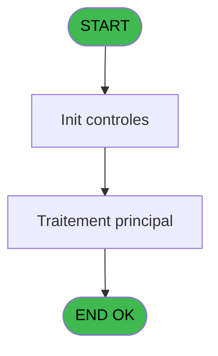

# TST IDE 2 - Mail Connection

> **Analyse**: Phases 1-4 2026-02-03 20:46 -> 20:46 (14s) | Assemblage 20:46
> **Pipeline**: V7.2 Enrichi
> **Structure**: 4 onglets (Resume | Ecrans | Donnees | Connexions)

<!-- TAB:Resume -->

## 1. FICHE D'IDENTITE

| Attribut | Valeur |
|----------|--------|
| Projet | TST |
| IDE Position | 2 |
| Nom Programme | Mail Connection |
| Fichier source | `Prg_2.xml` |
| Dossier IDE | Mail |
| Taches | 1 (0 ecrans visibles) |
| Tables modifiees | 0 |
| Programmes appeles | 0 |

## 2. DESCRIPTION FONCTIONNELLE

**Mail Connection** assure la gestion complete de ce processus, accessible depuis [Test envoi mail (IDE 5)](TST-IDE-5.md).

Le flux de traitement s'organise en **1 blocs fonctionnels** :

- **Traitement** (1 tache) : traitements metier divers

**Logique metier** : 1 regles identifiees couvrant conditions metier.

## 3. BLOCS FONCTIONNELS

### 3.1 Traitement (1 tache)

Traitements internes.

---

#### 2 - Mail Connection s [[ECRAN]](#ecran-t1)

**Role** : Traitement : Mail Connection s.
**Ecran** : 579 x 324 DLU | [Voir mockup](#ecran-t1)
**Variables liees** : A (p.o.Connection OK ?), K (V.Code Retour connection)

## 5. REGLES METIER

1 regles identifiees:

### Autres (1 regles)

#### [RM-001] Traitement si [P] est non nul

| Element | Detail |
|---------|--------|
| **Condition** | `[P]<>0` |
| **Si vrai** | 'ERR' |
| **Si faux** | 'OK') |
| **Expression source** | Expression 18 : `IF([P]<>0, 'ERR', 'OK')` |
| **Exemple** | Si [P]<>0 → 'ERR'. Sinon → 'OK') |

## 6. CONTEXTE

- **Appele par**: [Test envoi mail (IDE 5)](TST-IDE-5.md)
- **Appelle**: 0 programmes | **Tables**: 0 (W:0 R:0 L:0) | **Taches**: 1 | **Expressions**: 18

<!-- TAB:Ecrans -->

## 8. ECRANS

*(Programme sans ecran visible)*

## 9. NAVIGATION

### 9.3 Structure hierarchique (1 tache)

| Position | Tache | Type | Dimensions | Bloc |
|----------|-------|------|------------|------|
| **2.1** | [**Mail Connection s** (2)](#t1) [mockup](#ecran-t1) | - | 579x324 | Traitement |

### 9.4 Algorigramme

> **Legende**: Vert = START/END OK | Rouge = END KO | Bleu = Decisions
> *Algorigramme auto-genere. Utiliser `/algorigramme` pour une synthese metier detaillee.*

<!-- TAB:Donnees -->

## 10. TABLES

### Tables utilisees (0)

| ID | Nom | Description | Type | R | W | L | Usages |
|----|-----|-------------|------|---|---|---|--------|

### Colonnes par table (0 / 0 tables avec colonnes identifiees)

## 11. VARIABLES

### 11.1 Parametres entrants (7)

Variables recues du programme appelant ([Test envoi mail (IDE 5)](TST-IDE-5.md)).

| Lettre | Nom | Type | Usage dans |
|--------|-----|------|-----------|
| A | p.o.Connection OK ? | Logical | - |
| B | p.o.Code Erreur | Numeric | - |
| C | p.o.Message Erreur | Unicode | 1x parametre entrant |
| D | p.i.Viens de : | Unicode | 1x parametre entrant |
| E | p.Serveur | Unicode | - |
| F | p.User | Unicode | - |
| G | p.Mdp | Unicode | - |

### 11.2 Variables de session (4)

Variables persistantes pendant toute la session.

| Lettre | Nom | Type | Usage dans |
|--------|-----|------|-----------|
| H | v Serveur | Unicode | - |
| I | v.User | Unicode | - |
| J | v.Mdp | Unicode | - |
| K | V.Code Retour connection | Numeric | - |

## 12. EXPRESSIONS

**18 / 18 expressions decodees (100%)**

### 12.1 Repartition par type

| Type | Expressions | Regles |
|------|-------------|--------|
| CONDITION | 4 | 5 |
| CONSTANTE | 2 | 0 |
| FORMAT | 2 | 0 |
| DATE | 1 | 0 |
| OTHER | 5 | 0 |
| STRING | 4 | 0 |

### 12.2 Expressions cles par type

#### CONDITION (4 expressions)

| Type | IDE | Expression | Regle |
|------|-----|------------|-------|
| CONDITION | 18 | `IF([P]<>0, 'ERR', 'OK')` | [RM-001](#rm-RM-001) |
| CONDITION | 9 | `[P]<>0 OR Translate('%club_tracemail%')='O'` | - |
| CONDITION | 8 | `[P]<>0` | - |
| CONDITION | 6 | `[P]=0` | - |

#### CONSTANTE (2 expressions)

| Type | IDE | Expression | Regle |
|------|-----|------------|-------|
| CONSTANTE | 14 | `'CONNECTION'` | - |
| CONSTANTE | 13 | `'EMAIL'` | - |

#### FORMAT (2 expressions)

| Type | IDE | Expression | Regle |
|------|-----|------------|-------|
| FORMAT | 7 | `MailError(MailLastRC()) & ' Code Erreur : ' & Trim(Str(MailLastRC(),'N6'))` | - |
| FORMAT | 1 | `'%club_exportdata%'&'trace_mail_'&DStr(Date(),'YYYYMM')&'.txt'` | - |

#### DATE (1 expressions)

| Type | IDE | Expression | Regle |
|------|-----|------------|-------|
| DATE | 11 | `Date()` | - |

#### OTHER (5 expressions)

| Type | IDE | Expression | Regle |
|------|-----|------------|-------|
| OTHER | 16 | `p.i.Viens de : [D]` | - |
| OTHER | 17 | `StrBuild('Connexion to @1@ for user @2@', [M], [N])` | - |
| OTHER | 15 | `p.o.Message Erreur [C]` | - |
| OTHER | 10 | `[P]` | - |
| OTHER | 12 | `Time()` | - |

#### STRING (4 expressions)

| Type | IDE | Expression | Regle |
|------|-----|------------|-------|
| STRING | 4 | `Trim([T])` | - |
| STRING | 5 | `MailConnect(1,Trim([M]),Trim([N]),Trim([O]))` | - |
| STRING | 2 | `Trim([R])` | - |
| STRING | 3 | `Trim([S])` | - |

<!-- TAB:Connexions -->

## 13. GRAPHE D'APPELS

### 13.1 Chaine depuis Main (Callers)

Main -> ... -> [Test envoi mail (IDE 5)](TST-IDE-5.md) -> **Mail Connection (IDE 2)**

### 13.2 Callers

| IDE | Nom Programme | Nb Appels |
|-----|---------------|-----------|
| [5](TST-IDE-5.md) | Test envoi mail | 1 |

### 13.3 Callees (programmes appeles)

### 13.4 Detail Callees avec contexte

| IDE | Nom Programme | Appels | Contexte |
|-----|---------------|--------|----------|
| - | (aucun) | - | - |

## 14. RECOMMANDATIONS MIGRATION

### 14.1 Profil du programme

| Metrique | Valeur | Impact migration |
|----------|--------|-----------------|
| Lignes de logique | 26 | Programme compact |
| Expressions | 18 | Peu de logique |
| Tables WRITE | 0 | Impact faible |
| Sous-programmes | 0 | Peu de dependances |
| Ecrans visibles | 0 | Ecran unique ou traitement batch |
| Code desactive | 0% (0 / 26) | Code sain |
| Regles metier | 1 | Quelques regles a preserver |

### 14.2 Plan de migration par bloc

#### Traitement (1 tache: 1 ecran, 0 traitement)

- **Strategie** : 1 composant(s) UI (Razor/React) avec formulaires et validation.
- Decomposer les taches en services unitaires testables.

### 14.3 Dependances critiques

| Dependance | Type | Appels | Impact |
|------------|------|--------|--------|

---
*Spec DETAILED generee par Pipeline V7.2 - 2026-02-03 20:47*
