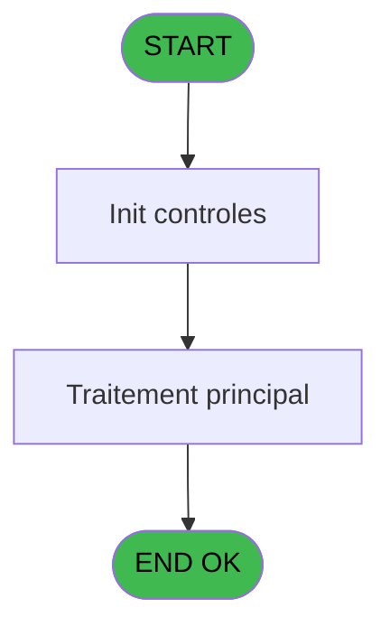

# TST IDE 3 - Mail Déconnection

> **Analyse**: Phases 1-4 2026-02-03 20:47 -> 20:47 (14s) | Assemblage 20:47
> **Pipeline**: V7.2 Enrichi
> **Structure**: 4 onglets (Resume | Ecrans | Donnees | Connexions)

<!-- TAB:Resume -->

## 1. FICHE D'IDENTITE

| Attribut | Valeur |
|----------|--------|
| Projet | TST |
| IDE Position | 3 |
| Nom Programme | Mail Déconnection |
| Fichier source | `Prg_3.xml` |
| Dossier IDE | Mail |
| Taches | 1 (0 ecrans visibles) |
| Tables modifiees | 0 |
| Programmes appeles | 0 |

## 2. DESCRIPTION FONCTIONNELLE

**Mail Déconnection** assure la gestion complete de ce processus, accessible depuis [Test envoi mail (IDE 5)](TST-IDE-5.md).

Le flux de traitement s'organise en **1 blocs fonctionnels** :

- **Traitement** (1 tache) : traitements metier divers

**Logique metier** : 1 regles identifiees couvrant conditions metier.

## 3. BLOCS FONCTIONNELS

### 3.1 Traitement (1 tache)

Traitements internes.

---

#### 3 - Mail Connection s

**Role** : Traitement : Mail Connection s.
**Variables liees** : A (P.Retour DéConnection), B (P.pgm_serveur_mail_prod), C (P.pgm_user_mail_prod), D (P.pgm_user_mail_password_prod), H (V.Code Retour Déconnection)

## 5. REGLES METIER

1 regles identifiees:

### Autres (1 regles)

#### [RM-001] Traitement si [J] est non nul

| Element | Detail |
|---------|--------|
| **Condition** | `[J]<>0` |
| **Si vrai** | 'FALSE'LOG |
| **Si faux** | 'TRUE'LOG) |
| **Expression source** | Expression 5 : `IF([J]<>0,'FALSE'LOG,'TRUE'LOG)` |
| **Exemple** | Si [J]<>0 → 'FALSE'LOG. Sinon → 'TRUE'LOG) |

## 6. CONTEXTE

- **Appele par**: [Test envoi mail (IDE 5)](TST-IDE-5.md)
- **Appelle**: 0 programmes | **Tables**: 0 (W:0 R:0 L:0) | **Taches**: 1 | **Expressions**: 5

<!-- TAB:Ecrans -->

## 8. ECRANS

*(Programme sans ecran visible)*

## 9. NAVIGATION

### 9.3 Structure hierarchique (1 tache)

| Position | Tache | Type | Dimensions | Bloc |
|----------|-------|------|------------|------|
| **3.1** | [**Mail Connection s** (3)](#t1) | - | - | Traitement |

### 9.4 Algorigramme

> **Legende**: Vert = START/END OK | Rouge = END KO | Bleu = Decisions
> *Algorigramme auto-genere. Utiliser `/algorigramme` pour une synthese metier detaillee.*

<!-- TAB:Donnees -->

## 10. TABLES

### Tables utilisees (0)

| ID | Nom | Description | Type | R | W | L | Usages |
|----|-----|-------------|------|---|---|---|--------|

### Colonnes par table (0 / 0 tables avec colonnes identifiees)

## 11. VARIABLES

### 11.1 Parametres entrants (4)

Variables recues du programme appelant ([Test envoi mail (IDE 5)](TST-IDE-5.md)).

| Lettre | Nom | Type | Usage dans |
|--------|-----|------|-----------|
| A | P.Retour DéConnection | Logical | - |
| B | P.pgm_serveur_mail_prod | Unicode | - |
| C | P.pgm_user_mail_prod | Unicode | - |
| D | P.pgm_user_mail_password_prod | Unicode | - |

### 11.2 Variables de session (4)

Variables persistantes pendant toute la session.

| Lettre | Nom | Type | Usage dans |
|--------|-----|------|-----------|
| E | v Serveur | Unicode | - |
| F | v.User | Unicode | - |
| G | v.Mdp | Unicode | - |
| H | V.Code Retour Déconnection | Numeric | - |

## 12. EXPRESSIONS

**5 / 5 expressions decodees (100%)**

### 12.1 Repartition par type

| Type | Expressions | Regles |
|------|-------------|--------|
| CAST_LOGIQUE | 2 | 5 |
| OTHER | 3 | 0 |

### 12.2 Expressions cles par type

#### CAST_LOGIQUE (2 expressions)

| Type | IDE | Expression | Regle |
|------|-----|------------|-------|
| CAST_LOGIQUE | 5 | `IF([J]<>0,'FALSE'LOG,'TRUE'LOG)` | [RM-001](#rm-RM-001) |
| CAST_LOGIQUE | 4 | `MailDisconnect(1,'FALSE'LOG)` | - |

#### OTHER (3 expressions)

| Type | IDE | Expression | Regle |
|------|-----|------------|-------|
| OTHER | 3 | `[M]` | - |
| OTHER | 2 | `[L]` | - |
| OTHER | 1 | `[K]` | - |

<!-- TAB:Connexions -->

## 13. GRAPHE D'APPELS

### 13.1 Chaine depuis Main (Callers)

Main -> ... -> [Test envoi mail (IDE 5)](TST-IDE-5.md) -> **Mail Déconnection (IDE 3)**

### 13.2 Callers

| IDE | Nom Programme | Nb Appels |
|-----|---------------|-----------|
| [5](TST-IDE-5.md) | Test envoi mail | 1 |

### 13.3 Callees (programmes appeles)

### 13.4 Detail Callees avec contexte

| IDE | Nom Programme | Appels | Contexte |
|-----|---------------|--------|----------|
| - | (aucun) | - | - |

## 14. RECOMMANDATIONS MIGRATION

### 14.1 Profil du programme

| Metrique | Valeur | Impact migration |
|----------|--------|-----------------|
| Lignes de logique | 16 | Programme compact |
| Expressions | 5 | Peu de logique |
| Tables WRITE | 0 | Impact faible |
| Sous-programmes | 0 | Peu de dependances |
| Ecrans visibles | 0 | Ecran unique ou traitement batch |
| Code desactive | 0% (0 / 16) | Code sain |
| Regles metier | 1 | Quelques regles a preserver |

### 14.2 Plan de migration par bloc

#### Traitement (1 tache: 0 ecran, 1 traitement)

- **Strategie** : 1 service(s) backend injectable(s) (Domain Services).
- Decomposer les taches en services unitaires testables.

### 14.3 Dependances critiques

| Dependance | Type | Appels | Impact |
|------------|------|--------|--------|

---
*Spec DETAILED generee par Pipeline V7.2 - 2026-02-03 20:47*
