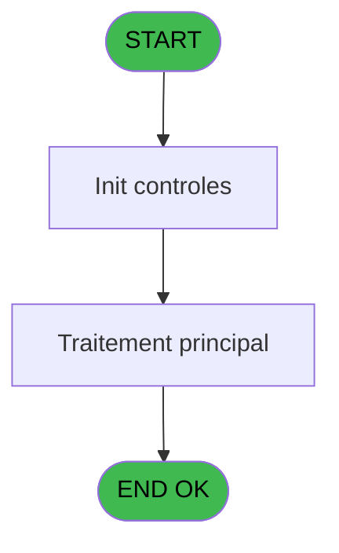
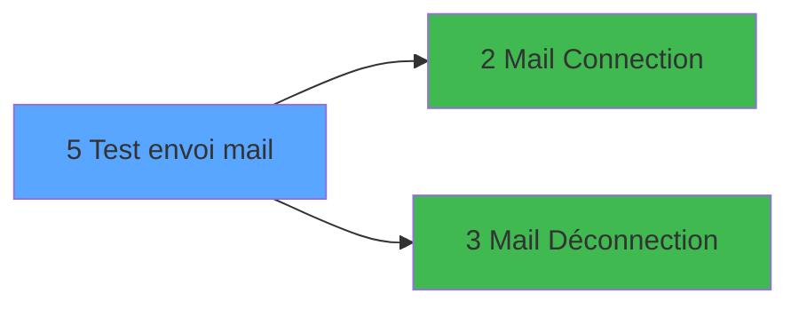

# TST IDE 5 - Test envoi mail

> **Analyse**: Phases 1-4 2026-02-03 20:47 -> 20:48 (17s) | Assemblage 20:48
> **Pipeline**: V7.2 Enrichi
> **Structure**: 4 onglets (Resume | Ecrans | Donnees | Connexions)

<!-- TAB:Resume -->

## 1. FICHE D'IDENTITE

| Attribut | Valeur |
|----------|--------|
| Projet | TST |
| IDE Position | 5 |
| Nom Programme | Test envoi mail |
| Fichier source | `Prg_5.xml` |
| Dossier IDE | Room |
| Taches | 2 (1 ecrans visibles) |
| Tables modifiees | 0 |
| Programmes appeles | 2 |
| :warning: Statut | **ORPHELIN_POTENTIEL** |

## 2. DESCRIPTION FONCTIONNELLE

**Test envoi mail** assure la gestion complete de ce processus.

Le flux de traitement s'organise en **1 blocs fonctionnels** :

- **Traitement** (2 taches) : traitements metier divers

## 3. BLOCS FONCTIONNELS

### 3.1 Traitement (2 taches)

Traitements internes.

---

#### 5 - Test envoi mail [[ECRAN]](#ecran-t1)

**Role** : Verification : Test envoi mail.
**Ecran** : 646 x 346 DLU | [Voir mockup](#ecran-t1)
**Variables liees** : H (v.MailFrom), I (v.MailTo), L (v.Mail Code Retour Envoi OK)
**Delegue a** : [Mail Connection (IDE 2)](TST-IDE-2.md), [Mail Déconnection (IDE 3)](TST-IDE-3.md)

---

#### 5.1 - (sans nom)

**Role** : Traitement interne.
**Delegue a** : [Mail Connection (IDE 2)](TST-IDE-2.md), [Mail Déconnection (IDE 3)](TST-IDE-3.md)

## 5. REGLES METIER

*(Aucune regle metier identifiee)*

## 6. CONTEXTE

- **Appele par**: (aucun)
- **Appelle**: 2 programmes | **Tables**: 1 (W:0 R:1 L:0) | **Taches**: 2 | **Expressions**: 12

<!-- TAB:Ecrans -->

## 8. ECRANS

### 8.1 Forms visibles (1 / 2)

| # | Position | Tache | Nom | Type | Largeur | Hauteur | Bloc |
|---|----------|-------|-----|------|---------|---------|------|
| 1 | 5 | 5 | Test envoi mail | Type0 | 646 | 346 | Traitement |

### 8.2 Mockups Ecrans

---

#### 5 - Test envoi mail
**Tache** : [5](#t1) | **Type** : Type0 | **Dimensions** : 646 x 346 DLU
**Bloc** : Traitement | **Titre IDE** : Test envoi mail

<!-- FORM-DATA:
{
    "width":  646,
    "vFactor":  8,
    "type":  "Type0",
    "hFactor":  4,
    "controls":  [
                     {
                         "x":  12,
                         "type":  "label",
                         "var":  "",
                         "y":  80,
                         "w":  628,
                         "fmt":  "",
                         "name":  "",
                         "h":  64,
                         "color":  "",
                         "text":  "Test Connection / Déconnection",
                         "parent":  null
                     },
                     {
                         "x":  20,
                         "type":  "label",
                         "var":  "",
                         "y":  96,
                         "w":  68,
                         "fmt":  "",
                         "name":  "",
                         "h":  10,
                         "color":  "",
                         "text":  "Connection OK ?",
                         "parent":  1
                     },
                     {
                         "x":  20,
                         "type":  "label",
                         "var":  "",
                         "y":  112,
                         "w":  68,
                         "fmt":  "",
                         "name":  "",
                         "h":  10,
                         "color":  "",
                         "text":  "Error",
                         "parent":  1
                     },
                     {
                         "x":  20,
                         "type":  "label",
                         "var":  "",
                         "y":  128,
                         "w":  83,
                         "fmt":  "",
                         "name":  "",
                         "h":  10,
                         "color":  "",
                         "text":  "Deconnection OK ?",
                         "parent":  1
                     },
                     {
                         "x":  12,
                         "type":  "label",
                         "var":  "",
                         "y":  8,
                         "w":  312,
                         "fmt":  "",
                         "name":  "",
                         "h":  64,
                         "color":  "",
                         "text":  "Connection informations (can be updated)",
                         "parent":  null
                     },
                     {
                         "x":  20,
                         "type":  "label",
                         "var":  "",
                         "y":  24,
                         "w":  46,
                         "fmt":  "",
                         "name":  "",
                         "h":  9,
                         "color":  "",
                         "text":  "Server",
                         "parent":  12
                     },
                     {
                         "x":  20,
                         "type":  "label",
                         "var":  "",
                         "y":  40,
                         "w":  46,
                         "fmt":  "",
                         "name":  "",
                         "h":  9,
                         "color":  "",
                         "text":  "User",
                         "parent":  12
                     },
                     {
                         "x":  20,
                         "type":  "label",
                         "var":  "",
                         "y":  56,
                         "w":  46,
                         "fmt":  "",
                         "name":  "",
                         "h":  9,
                         "color":  "",
                         "text":  "Password",
                         "parent":  12
                     },
                     {
                         "x":  328,
                         "type":  "label",
                         "var":  "",
                         "y":  8,
                         "w":  312,
                         "fmt":  "",
                         "name":  "",
                         "h":  64,
                         "color":  "",
                         "text":  "Suivi des traitements",
                         "parent":  null
                     },
                     {
                         "x":  345,
                         "type":  "label",
                         "var":  "",
                         "y":  24,
                         "w":  124,
                         "fmt":  "",
                         "name":  "",
                         "h":  16,
                         "color":  "",
                         "text":  "Voir les traitements log_batch",
                         "parent":  19
                     },
                     {
                         "x":  12,
                         "type":  "label",
                         "var":  "",
                         "y":  152,
                         "w":  628,
                         "fmt":  "",
                         "name":  "",
                         "h":  192,
                         "color":  "",
                         "text":  "Envoi mail",
                         "parent":  null
                     },
                     {
                         "x":  24,
                         "type":  "label",
                         "var":  "",
                         "y":  192,
                         "w":  48,
                         "fmt":  "",
                         "name":  "",
                         "h":  10,
                         "color":  "",
                         "text":  "From",
                         "parent":  25
                     },
                     {
                         "x":  24,
                         "type":  "label",
                         "var":  "",
                         "y":  208,
                         "w":  48,
                         "fmt":  "",
                         "name":  "",
                         "h":  10,
                         "color":  "",
                         "text":  "to",
                         "parent":  25
                     },
                     {
                         "x":  24,
                         "type":  "label",
                         "var":  "",
                         "y":  224,
                         "w":  48,
                         "fmt":  "",
                         "name":  "",
                         "h":  10,
                         "color":  "",
                         "text":  "Subject",
                         "parent":  25
                     },
                     {
                         "x":  24,
                         "type":  "label",
                         "var":  "",
                         "y":  240,
                         "w":  48,
                         "fmt":  "",
                         "name":  "",
                         "h":  10,
                         "color":  "",
                         "text":  "Body",
                         "parent":  25
                     },
                     {
                         "x":  24,
                         "type":  "label",
                         "var":  "",
                         "y":  164,
                         "w":  80,
                         "fmt":  "",
                         "name":  "",
                         "h":  10,
                         "color":  "",
                         "text":  "Processing Type",
                         "parent":  25
                     },
                     {
                         "x":  80,
                         "type":  "edit",
                         "var":  "",
                         "y":  24,
                         "w":  87,
                         "fmt":  "",
                         "name":  "v.Serveur",
                         "h":  10,
                         "color":  "",
                         "text":  "",
                         "parent":  12
                     },
                     {
                         "x":  588,
                         "type":  "button",
                         "var":  "",
                         "y":  24,
                         "w":  39,
                         "fmt":  "...",
                         "name":  "",
                         "h":  16,
                         "color":  "",
                         "text":  "",
                         "parent":  19
                     },
                     {
                         "x":  80,
                         "type":  "edit",
                         "var":  "",
                         "y":  40,
                         "w":  171,
                         "fmt":  "",
                         "name":  "v.User",
                         "h":  10,
                         "color":  "",
                         "text":  "",
                         "parent":  12
                     },
                     {
                         "x":  80,
                         "type":  "edit",
                         "var":  "",
                         "y":  56,
                         "w":  171,
                         "fmt":  "",
                         "name":  "v.Password",
                         "h":  10,
                         "color":  "",
                         "text":  "",
                         "parent":  12
                     },
                     {
                         "x":  104,
                         "type":  "edit",
                         "var":  "",
                         "y":  96,
                         "w":  42,
                         "fmt":  "",
                         "name":  "v. Connection OK ?",
                         "h":  10,
                         "color":  "",
                         "text":  "",
                         "parent":  1
                     },
                     {
                         "x":  588,
                         "type":  "button",
                         "var":  "",
                         "y":  104,
                         "w":  44,
                         "fmt":  "Test",
                         "name":  "",
                         "h":  16,
                         "color":  "",
                         "text":  "",
                         "parent":  1
                     },
                     {
                         "x":  104,
                         "type":  "edit",
                         "var":  "",
                         "y":  112,
                         "w":  42,
                         "fmt":  "6NCZ",
                         "name":  "v. Code Erreur",
                         "h":  10,
                         "color":  "",
                         "text":  "",
                         "parent":  1
                     },
                     {
                         "x":  148,
                         "type":  "edit",
                         "var":  "",
                         "y":  112,
                         "w":  428,
                         "fmt":  "",
                         "name":  "v. Message Erreur",
                         "h":  10,
                         "color":  "",
                         "text":  "",
                         "parent":  1
                     },
                     {
                         "x":  104,
                         "type":  "edit",
                         "var":  "",
                         "y":  128,
                         "w":  42,
                         "fmt":  "",
                         "name":  "v. Retour deconexion",
                         "h":  10,
                         "color":  "",
                         "text":  "",
                         "parent":  1
                     },
                     {
                         "x":  588,
                         "type":  "button",
                         "var":  "",
                         "y":  160,
                         "w":  44,
                         "fmt":  "getMail",
                         "name":  "",
                         "h":  16,
                         "color":  "",
                         "text":  "",
                         "parent":  25
                     },
                     {
                         "x":  120,
                         "type":  "combobox",
                         "var":  "",
                         "y":  162,
                         "w":  172,
                         "fmt":  "",
                         "name":  "??",
                         "h":  12,
                         "color":  "",
                         "text":  "",
                         "parent":  25
                     },
                     {
                         "x":  120,
                         "type":  "edit",
                         "var":  "",
                         "y":  192,
                         "w":  171,
                         "fmt":  "",
                         "name":  "v.MailFrom",
                         "h":  10,
                         "color":  "",
                         "text":  "",
                         "parent":  25
                     },
                     {
                         "x":  120,
                         "type":  "edit",
                         "var":  "",
                         "y":  208,
                         "w":  171,
                         "fmt":  "",
                         "name":  "v.MailTo",
                         "h":  10,
                         "color":  "",
                         "text":  "",
                         "parent":  25
                     },
                     {
                         "x":  120,
                         "type":  "edit",
                         "var":  "",
                         "y":  224,
                         "w":  171,
                         "fmt":  "",
                         "name":  "v.Sujet",
                         "h":  10,
                         "color":  "",
                         "text":  "",
                         "parent":  25
                     },
                     {
                         "x":  120,
                         "type":  "edit",
                         "var":  "",
                         "y":  240,
                         "w":  504,
                         "fmt":  "",
                         "name":  "v.Corps",
                         "h":  72,
                         "color":  "",
                         "text":  "",
                         "parent":  25
                     },
                     {
                         "x":  588,
                         "type":  "button",
                         "var":  "",
                         "y":  312,
                         "w":  44,
                         "fmt":  "sendMail",
                         "name":  "",
                         "h":  16,
                         "color":  "",
                         "text":  "",
                         "parent":  null
                     }
                 ],
    "taskId":  "5",
    "height":  346
}
-->

<strong>Champs : 12 champs</strong>

| Pos (x,y) | Nom | Variable | Type |
|-----------|-----|----------|------|
| 80,24 | v.Serveur | - | edit |
| 80,40 | v.User | - | edit |
| 80,56 | v.Password | - | edit |
| 104,96 | v. Connection OK ? | - | edit |
| 104,112 | v. Code Erreur | - | edit |
| 148,112 | v. Message Erreur | - | edit |
| 104,128 | v. Retour deconexion | - | edit |
| 120,162 | ?? | - | combobox |
| 120,192 | v.MailFrom | - | edit |
| 120,208 | v.MailTo | - | edit |
| 120,224 | v.Sujet | - | edit |
| 120,240 | v.Corps | - | edit |

<strong>Boutons : 4 boutons</strong>

| Bouton | Pos (x,y) | Action |
|--------|-----------|--------|
| ... | 588,24 | Bouton fonctionnel |
| Test | 588,104 | Bouton fonctionnel |
| getMail | 588,160 | Bouton fonctionnel |
| sendMail | 588,312 | Bouton fonctionnel |

## 9. NAVIGATION

Ecran unique: **Test envoi mail**

### 9.3 Structure hierarchique (2 taches)

| Position | Tache | Type | Dimensions | Bloc |
|----------|-------|------|------------|------|
| **5.1** | [**Test envoi mail** (5)](#t1) [mockup](#ecran-t1) | - | 646x346 | Traitement |
| 5.1.1 | [(sans nom) (5.1)](#t2) | - | - | |

### 9.4 Algorigramme

> **Legende**: Vert = START/END OK | Rouge = END KO | Bleu = Decisions
> *Algorigramme auto-genere. Utiliser `/algorigramme` pour une synthese metier detaillee.*

<!-- TAB:Donnees -->

## 10. TABLES

### Tables utilisees (1)

| ID | Nom | Description | Type | R | W | L | Usages |
|----|-----|-------------|------|---|---|---|--------|
| 858 | total_ventes_term_mop | Donnees de ventes | TMP | R |   |   | 1 |

### Colonnes par table (0 / 1 tables avec colonnes identifiees)

Table 858 - total_ventes_term_mop (R) - 1 usages

*Table utilisee uniquement en Link ou aucune colonne Real identifiee dans le DataView.*

## 11. VARIABLES

### 11.1 Variables de session (13)

Variables persistantes pendant toute la session.

| Lettre | Nom | Type | Usage dans |
|--------|-----|------|-----------|
| A | v. Connection OK ? | Logical | - |
| B | v. Code Erreur | Numeric | - |
| C | v. Message Erreur | Alpha | 1x session |
| D | v. Retour deconexion | Logical | - |
| E | v.Serveur | Unicode | - |
| F | v.User | Unicode | - |
| G | v.Password | Unicode | 1x session |
| H | v.MailFrom | Alpha | 1x session |
| I | v.MailTo | Alpha | 1x session |
| J | v.Sujet | Alpha | - |
| K | v.Corps | Alpha | - |
| L | v.Mail Code Retour Envoi OK | Logical | - |
| M | v.TypeTraitement | Alpha | - |

## 12. EXPRESSIONS

**12 / 12 expressions decodees (100%)**

### 12.1 Repartition par type

| Type | Expressions | Regles |
|------|-------------|--------|
| CONSTANTE | 5 | 0 |
| DATE | 1 | 0 |
| OTHER | 4 | 0 |
| STRING | 2 | 0 |

### 12.2 Expressions cles par type

#### CONSTANTE (5 expressions)

| Type | IDE | Expression | Regle |
|------|-----|------------|-------|
| CONSTANTE | 7 | `'FIRSTNAMETEST'` | - |
| CONSTANTE | 8 | `'LASTNAMETEST'` | - |
| CONSTANTE | 6 | `'FRA'` | - |
| CONSTANTE | 2 | `''` | - |
| CONSTANTE | 4 | `'TST MAIL'` | - |

#### DATE (1 expressions)

| Type | IDE | Expression | Regle |
|------|-----|------------|-------|
| DATE | 5 | `Date()` | - |

#### OTHER (4 expressions)

| Type | IDE | Expression | Regle |
|------|-----|------------|-------|
| OTHER | 11 | `v.MailFrom [H]` | - |
| OTHER | 12 | `v.MailTo [I]` | - |
| OTHER | 1 | `v. Message Erreur [C]` | - |
| OTHER | 10 | `v.Password [G]` | - |

#### STRING (2 expressions)

| Type | IDE | Expression | Regle |
|------|-----|------------|-------|
| STRING | 9 | `Trim([N])` | - |
| STRING | 3 | `Trim([Q])` | - |

<!-- TAB:Connexions -->

## 13. GRAPHE D'APPELS

### 13.1 Chaine depuis Main (Callers)

**Chemin**: (pas de callers directs)

### 13.2 Callers

| IDE | Nom Programme | Nb Appels |
|-----|---------------|-----------|
| - | (aucun) | - |

### 13.3 Callees (programmes appeles)

### 13.4 Detail Callees avec contexte

| IDE | Nom Programme | Appels | Contexte |
|-----|---------------|--------|----------|
| [2](TST-IDE-2.md) | Mail Connection | 1 | Sous-programme |
| [3](TST-IDE-3.md) | Mail Déconnection | 1 | Sous-programme |

## 14. RECOMMANDATIONS MIGRATION

### 14.1 Profil du programme

| Metrique | Valeur | Impact migration |
|----------|--------|-----------------|
| Lignes de logique | 48 | Programme compact |
| Expressions | 12 | Peu de logique |
| Tables WRITE | 0 | Impact faible |
| Sous-programmes | 2 | Peu de dependances |
| Ecrans visibles | 1 | Ecran unique ou traitement batch |
| Code desactive | 0% (0 / 48) | Code sain |
| Regles metier | 0 | Pas de regle identifiee |

### 14.2 Plan de migration par bloc

#### Traitement (2 taches: 1 ecran, 1 traitement)

- **Strategie** : Orchestrateur avec 1 ecrans (Razor/React) et 1 traitements backend (services).
- Les ecrans deviennent des composants UI, les traitements invisibles deviennent des services injectables.
- 2 sous-programme(s) a migrer ou a reutiliser depuis les services existants.
- Decomposer les taches en services unitaires testables.

### 14.3 Dependances critiques

| Dependance | Type | Appels | Impact |
|------------|------|--------|--------|
| [Mail Déconnection (IDE 3)](TST-IDE-3.md) | Sous-programme | 1x | Normale - Sous-programme |
| [Mail Connection (IDE 2)](TST-IDE-2.md) | Sous-programme | 1x | Normale - Sous-programme |

---
*Spec DETAILED generee par Pipeline V7.2 - 2026-02-03 20:48*
