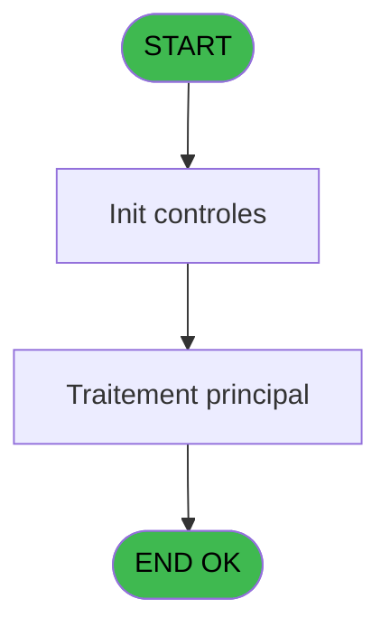
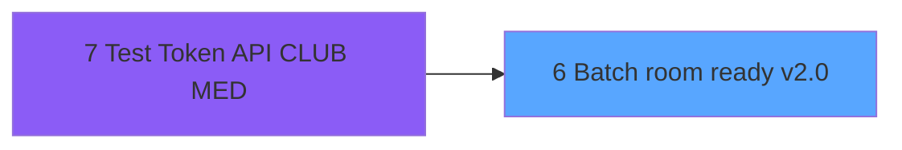

# TST IDE 6 - Batch room ready v2.0

> **Analyse**: Phases 1-4 2026-02-03 20:48 -> 20:48 (18s) | Assemblage 20:48
> **Pipeline**: V7.2 Enrichi
> **Structure**: 4 onglets (Resume | Ecrans | Donnees | Connexions)

<!-- TAB:Resume -->

## 1. FICHE D'IDENTITE

| Attribut | Valeur |
|----------|--------|
| Projet | TST |
| IDE Position | 6 |
| Nom Programme | Batch room ready v2.0 |
| Fichier source | `Prg_6.xml` |
| Dossier IDE | ClubMed |
| Taches | 2 (0 ecrans visibles) |
| Tables modifiees | 0 |
| Programmes appeles | 0 |

## 2. DESCRIPTION FONCTIONNELLE

**Batch room ready v2.0** assure la gestion complete de ce processus, accessible depuis [Test Token API CLUB MED (IDE 7)](TST-IDE-7.md).

Le flux de traitement s'organise en **1 blocs fonctionnels** :

- **Traitement** (2 taches) : traitements metier divers

## 3. BLOCS FONCTIONNELS

### 3.1 Traitement (2 taches)

Traitements internes.

---

#### 6 - Batch room ready v2.0

**Role** : Traitement : Batch room ready v2.0.
**Variables liees** : E (v.Heure début Room Ready), F (v.Heure fin Room Ready), J (v.URL room ready 2.0), W (v.log_Id batch père), Z (v.1 Room ready par heure ?)

---

#### 6.1 - Lecture paramétrage

**Role** : Traitement : Lecture paramétrage.

## 5. REGLES METIER

*(Aucune regle metier identifiee)*

## 6. CONTEXTE

- **Appele par**: [Test Token API CLUB MED (IDE 7)](TST-IDE-7.md)
- **Appelle**: 0 programmes | **Tables**: 2 (W:0 R:2 L:0) | **Taches**: 2 | **Expressions**: 29

<!-- TAB:Ecrans -->

## 8. ECRANS

*(Programme sans ecran visible)*

## 9. NAVIGATION

### 9.3 Structure hierarchique (2 taches)

| Position | Tache | Type | Dimensions | Bloc |
|----------|-------|------|------------|------|
| **6.1** | [**Batch room ready v2.0** (6)](#t1) | - | - | Traitement |
| 6.1.1 | [Lecture paramétrage (6.1)](#t4) | - | - | |

### 9.4 Algorigramme

> **Legende**: Vert = START/END OK | Rouge = END KO | Bleu = Decisions
> *Algorigramme auto-genere. Utiliser `/algorigramme` pour une synthese metier detaillee.*

<!-- TAB:Donnees -->

## 10. TABLES

### Tables utilisees (2)

| ID | Nom | Description | Type | R | W | L | Usages |
|----|-----|-------------|------|---|---|---|--------|
| 368 | pms_village |  | DB | R |   |   | 1 |
| 915 | web_api_cashup |  | DB | R |   |   | 1 |

### Colonnes par table (1 / 2 tables avec colonnes identifiees)

Table 368 - pms_village (R) - 1 usages

*Table utilisee uniquement en Link ou aucune colonne Real identifiee dans le DataView.*

Table 915 - web_api_cashup (R) - 1 usages

| Lettre | Variable | Acces | Type |
|--------|----------|-------|------|
| A | po | R | Unicode |
| B | v.Base URL MyClubMedApp | R | Unicode |
| C | v.Api key | R | Unicode |
| D | v.Eté ? | R | Logical |
| E | v.Heure début Room Ready | R | Time |
| F | v.Heure fin Room Ready | R | Time |
| G | v.Access token | R | Unicode |
| H | v.répertoire fichiers curl | R | Unicode |
| I | v.répertoire fichiers réponse | R | Unicode |
| J | v.URL room ready 2.0 | R | Unicode |
| K | v.Proxy | R | Unicode |
| L | v.Heure OK ? | R | Logical |
| M | v.clientId | R | Unicode |
| N | v.ClientSecret | R | Unicode |
| O | v.grantType | R | Unicode |
| P | v.scope | R | Unicode |
| Q | v.Url | R | Unicode |
| R | v.Proxy | R | Unicode |
| S | v.bypassProxyonLocal | R | Logical |
| T | v.log_Resorts | R | Unicode |
| U | v.log_Nb appels | R | Numeric |
| V | v.log_Nb traités OK | R | Numeric |
| W | v.log_Id batch père | R | Numeric |
| X | v.message erreur | R | Alpha |
| Y | v.TEST | R | Logical |
| Z | v.1 Room ready par heure ? | R | Logical |

## 11. VARIABLES

### 11.1 Variables de session (25)

Variables persistantes pendant toute la session.

| Lettre | Nom | Type | Usage dans |
|--------|-----|------|-----------|
| B | v.Base URL MyClubMedApp | Unicode | 3x session |
| C | v.Api key | Unicode | - |
| D | v.Eté ? | Logical | 4x session |
| E | v.Heure début Room Ready | Time | [6](#t1) |
| F | v.Heure fin Room Ready | Time | [6](#t1) |
| G | v.Access token | Unicode | - |
| H | v.répertoire fichiers curl | Unicode | - |
| I | v.répertoire fichiers réponse | Unicode | - |
| J | v.URL room ready 2.0 | Unicode | [6](#t1) |
| K | v.Proxy | Unicode | 2x session |
| L | v.Heure OK ? | Logical | 1x session |
| M | v.clientId | Unicode | 1x session |
| N | v.ClientSecret | Unicode | 1x session |
| O | v.grantType | Unicode | 1x session |
| P | v.scope | Unicode | 1x session |
| Q | v.Url | Unicode | 3x session |
| R | v.Proxy | Unicode | 2x session |
| S | v.bypassProxyonLocal | Logical | - |
| T | v.log_Resorts | Unicode | - |
| U | v.log_Nb appels | Numeric | - |
| V | v.log_Nb traités OK | Numeric | - |
| W | v.log_Id batch père | Numeric | [6](#t1) |
| X | v.message erreur | Alpha | - |
| Y | v.TEST | Logical | - |
| Z | v.1 Room ready par heure ? | Logical | - |

### 11.2 Autres (1)

Variables diverses.

| Lettre | Nom | Type | Usage dans |
|--------|-----|------|-----------|
| A | po | Unicode | 4x refs |

Toutes les 26 variables (liste complete)

| Cat | Lettre | Nom Variable | Type |
|-----|--------|--------------|------|
| V. | **B** | v.Base URL MyClubMedApp | Unicode |
| V. | **C** | v.Api key | Unicode |
| V. | **D** | v.Eté ? | Logical |
| V. | **E** | v.Heure début Room Ready | Time |
| V. | **F** | v.Heure fin Room Ready | Time |
| V. | **G** | v.Access token | Unicode |
| V. | **H** | v.répertoire fichiers curl | Unicode |
| V. | **I** | v.répertoire fichiers réponse | Unicode |
| V. | **J** | v.URL room ready 2.0 | Unicode |
| V. | **K** | v.Proxy | Unicode |
| V. | **L** | v.Heure OK ? | Logical |
| V. | **M** | v.clientId | Unicode |
| V. | **N** | v.ClientSecret | Unicode |
| V. | **O** | v.grantType | Unicode |
| V. | **P** | v.scope | Unicode |
| V. | **Q** | v.Url | Unicode |
| V. | **R** | v.Proxy | Unicode |
| V. | **S** | v.bypassProxyonLocal | Logical |
| V. | **T** | v.log_Resorts | Unicode |
| V. | **U** | v.log_Nb appels | Numeric |
| V. | **V** | v.log_Nb traités OK | Numeric |
| V. | **W** | v.log_Id batch père | Numeric |
| V. | **X** | v.message erreur | Alpha |
| V. | **Y** | v.TEST | Logical |
| V. | **Z** | v.1 Room ready par heure ? | Logical |
| Autre | **A** | po | Unicode |

## 12. EXPRESSIONS

**29 / 29 expressions decodees (100%)**

### 12.1 Repartition par type

| Type | Expressions | Regles |
|------|-------------|--------|
| CONCATENATION | 3 | 0 |
| CONSTANTE | 2 | 0 |
| CONDITION | 9 | 0 |
| CAST_LOGIQUE | 1 | 0 |
| OTHER | 14 | 0 |

### 12.2 Expressions cles par type

#### CONCATENATION (3 expressions)

| Type | IDE | Expression | Regle |
|------|-----|------------|-------|
| CONCATENATION | 11 | `Trim(v.log_Id batch père [W])&IF(v.log_Id batch père [W]<>'',' - ','')&'Proxy non renseigné'` | - |
| CONCATENATION | 10 | `Trim(v.log_Id batch père [W])&IF(v.log_Id batch père [W]<>'',' - ','')&'Acces token non renseigné'` | - |
| CONCATENATION | 9 | `Trim(v.log_Id batch père [W])&IF(v.log_Id batch père [W]<>'',' - ','')&'API-key non renseigné'` | - |

#### CONSTANTE (2 expressions)

| Type | IDE | Expression | Regle |
|------|-----|------------|-------|
| CONSTANTE | 12 | `'@1@/room_status'` | - |
| CONSTANTE | 8 | `'Base Url Clubmed pas renseigne'` | - |

#### CONDITION (9 expressions)

| Type | IDE | Expression | Regle |
|------|-----|------------|-------|
| CONDITION | 17 | `v.Base URL MyClubMedApp [B]=''` | - |
| CONDITION | 16 | `po [A]=''` | - |
| CONDITION | 19 | `v.URL room ready 2.0 [J]=''` | - |
| CONDITION | 18 | `v.Heure fin Room Ready [F]=''` | - |
| CONDITION | 15 | `RunMode()=2` | - |
| ... | | *+4 autres* | |

#### CAST_LOGIQUE (1 expressions)

| Type | IDE | Expression | Regle |
|------|-----|------------|-------|
| CAST_LOGIQUE | 3 | `'TRUE'LOG` | - |

#### OTHER (14 expressions)

| Type | IDE | Expression | Regle |
|------|-----|------------|-------|
| OTHER | 25 | `v.scope [P]` | - |
| OTHER | 24 | `v.grantType [O]` | - |
| OTHER | 23 | `v.ClientSecret [N]` | - |
| OTHER | 26 | `v.Url [Q]` | - |
| OTHER | 29 | `po [A]` | - |
| ... | | *+9 autres* | |

### 12.3 Toutes les expressions (29)

Voir les 29 expressions

#### CONCATENATION (3)

| IDE | Expression Decodee |
|-----|-------------------|
| 9 | `Trim(v.log_Id batch père [W])&IF(v.log_Id batch père [W]<>'',' - ','')&'API-key non renseigné'` |
| 10 | `Trim(v.log_Id batch père [W])&IF(v.log_Id batch père [W]<>'',' - ','')&'Acces token non renseigné'` |
| 11 | `Trim(v.log_Id batch père [W])&IF(v.log_Id batch père [W]<>'',' - ','')&'Proxy non renseigné'` |

#### CONSTANTE (2)

| IDE | Expression Decodee |
|-----|-------------------|
| 8 | `'Base Url Clubmed pas renseigne'` |
| 12 | `'@1@/room_status'` |

#### CONDITION (9)

| IDE | Expression Decodee |
|-----|-------------------|
| 1 | `po [A]<>'' AND v.Base URL MyClubMedApp [B]<>'' AND v.Proxy [K] AND v.Heure fin Room Ready [F]<>'' AND v.URL room ready 2.0 [J]<>''` |
| 2 | `po [A]='' OR v.Base URL MyClubMedApp [B]='' OR v.Heure fin Room Ready [F]=''` |
| 4 | `v.Eté ? [D]='00:00:00'TIME AND v.Heure début Room Ready [E]='00:00:00'TIME` |
| 5 | `v.Eté ? [D]<=v.Heure début Room Ready [E]` |
| 15 | `RunMode()=2` |
| 16 | `po [A]=''` |
| 17 | `v.Base URL MyClubMedApp [B]=''` |
| 18 | `v.Heure fin Room Ready [F]=''` |
| 19 | `v.URL room ready 2.0 [J]=''` |

#### CAST_LOGIQUE (1)

| IDE | Expression Decodee |
|-----|-------------------|
| 3 | `'TRUE'LOG` |

#### OTHER (14)

| IDE | Expression Decodee |
|-----|-------------------|
| 6 | `Range(Time(), v.Eté ? [D], v.Heure début Room Ready [E])` |
| 7 | `Range(Time(), v.Eté ? [D], '24:00:00'TIME) OR Range(Time(),  '00:00:00'TIME, v.Heure début Room Ready [E])` |
| 13 | `[AB]` |
| 14 | `[AD]` |
| 20 | `Translate('%TempDir%')&'ROR20\'` |
| 21 | `v.Heure OK ? [L]` |
| 22 | `v.clientId [M]` |
| 23 | `v.ClientSecret [N]` |
| 24 | `v.grantType [O]` |
| 25 | `v.scope [P]` |
| 26 | `v.Url [Q]` |
| 27 | `v.Proxy [R]` |
| 28 | `v.Heure fin Room Ready [F]` |
| 29 | `po [A]` |

<!-- TAB:Connexions -->

## 13. GRAPHE D'APPELS

### 13.1 Chaine depuis Main (Callers)

Main -> ... -> [Test Token API CLUB MED (IDE 7)](TST-IDE-7.md) -> **Batch room ready v2.0 (IDE 6)**

### 13.2 Callers

| IDE | Nom Programme | Nb Appels |
|-----|---------------|-----------|
| [7](TST-IDE-7.md) | Test Token API CLUB MED | 1 |

### 13.3 Callees (programmes appeles)

### 13.4 Detail Callees avec contexte

| IDE | Nom Programme | Appels | Contexte |
|-----|---------------|--------|----------|
| - | (aucun) | - | - |

## 14. RECOMMANDATIONS MIGRATION

### 14.1 Profil du programme

| Metrique | Valeur | Impact migration |
|----------|--------|-----------------|
| Lignes de logique | 108 | Programme compact |
| Expressions | 29 | Peu de logique |
| Tables WRITE | 0 | Impact faible |
| Sous-programmes | 0 | Peu de dependances |
| Ecrans visibles | 0 | Ecran unique ou traitement batch |
| Code desactive | 0% (0 / 108) | Code sain |
| Regles metier | 0 | Pas de regle identifiee |

### 14.2 Plan de migration par bloc

#### Traitement (2 taches: 0 ecran, 2 traitements)

- **Strategie** : 2 service(s) backend injectable(s) (Domain Services).
- Decomposer les taches en services unitaires testables.

### 14.3 Dependances critiques

| Dependance | Type | Appels | Impact |
|------------|------|--------|--------|

---
*Spec DETAILED generee par Pipeline V7.2 - 2026-02-03 20:48*
