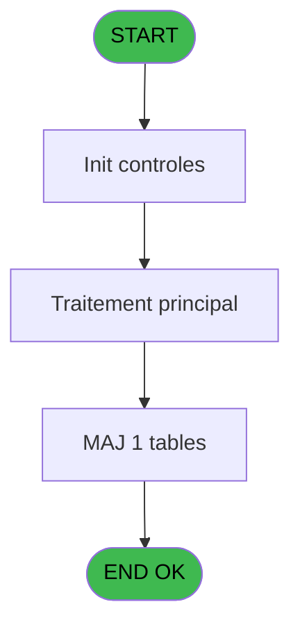
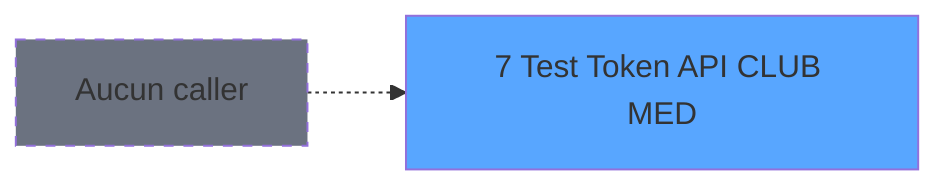
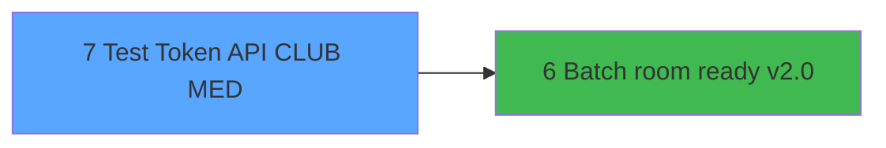

# TST IDE 7 - Test Token API CLUB MED

> **Analyse**: Phases 1-4 2026-02-03 20:48 -> 20:49 (17s) | Assemblage 20:49
> **Pipeline**: V7.2 Enrichi
> **Structure**: 4 onglets (Resume | Ecrans | Donnees | Connexions)

<!-- TAB:Resume -->

## 1. FICHE D'IDENTITE

| Attribut | Valeur |
|----------|--------|
| Projet | TST |
| IDE Position | 7 |
| Nom Programme | Test Token API CLUB MED |
| Fichier source | `Prg_7.xml` |
| Dossier IDE | ClubMed |
| Taches | 1 (1 ecrans visibles) |
| Tables modifiees | 1 |
| Programmes appeles | 1 |
| :warning: Statut | **ORPHELIN_POTENTIEL** |

## 2. DESCRIPTION FONCTIONNELLE

**Test Token API CLUB MED** assure la gestion complete de ce processus.

Le flux de traitement s'organise en **1 blocs fonctionnels** :

- **Traitement** (1 tache) : traitements metier divers

**Donnees modifiees** : 1 tables en ecriture (pms_village).

## 3. BLOCS FONCTIONNELS

### 3.1 Traitement (1 tache)

Traitements internes.

---

#### 7 - Test Token API CLUB MED [[ECRAN]](#ecran-t1)

**Role** : Verification : Test Token API CLUB MED.
**Ecran** : 560 x 302 DLU | [Voir mockup](#ecran-t1)
**Delegue a** : [Batch room ready v2.0 (IDE 6)](TST-IDE-6.md)

## 5. REGLES METIER

*(Aucune regle metier identifiee)*

## 6. CONTEXTE

- **Appele par**: (aucun)
- **Appelle**: 1 programmes | **Tables**: 1 (W:1 R:0 L:0) | **Taches**: 1 | **Expressions**: 7

<!-- TAB:Ecrans -->

## 8. ECRANS

### 8.1 Forms visibles (1 / 1)

| # | Position | Tache | Nom | Type | Largeur | Hauteur | Bloc |
|---|----------|-------|-----|------|---------|---------|------|
| 1 | 7 | 7 | Test Token API CLUB MED | Type0 | 560 | 302 | Traitement |

### 8.2 Mockups Ecrans

---

#### 7 - Test Token API CLUB MED
**Tache** : [7](#t1) | **Type** : Type0 | **Dimensions** : 560 x 302 DLU
**Bloc** : Traitement | **Titre IDE** : Test Token API CLUB MED

<!-- FORM-DATA:
{
    "width":  560,
    "vFactor":  8,
    "type":  "Type0",
    "hFactor":  4,
    "controls":  [
                     {
                         "x":  0,
                         "type":  "label",
                         "var":  "",
                         "y":  24,
                         "w":  90,
                         "fmt":  "",
                         "name":  "",
                         "h":  9,
                         "color":  "",
                         "text":  "api_clud_med_client_id",
                         "parent":  null
                     },
                     {
                         "x":  0,
                         "type":  "label",
                         "var":  "",
                         "y":  40,
                         "w":  107,
                         "fmt":  "",
                         "name":  "",
                         "h":  9,
                         "color":  "",
                         "text":  "api_clud_med_client_secret",
                         "parent":  null
                     },
                     {
                         "x":  0,
                         "type":  "label",
                         "var":  "",
                         "y":  56,
                         "w":  90,
                         "fmt":  "",
                         "name":  "",
                         "h":  9,
                         "color":  "",
                         "text":  "api_clud_med_login_url",
                         "parent":  null
                     },
                     {
                         "x":  120,
                         "type":  "label",
                         "var":  "",
                         "y":  8,
                         "w":  352,
                         "fmt":  "",
                         "name":  "",
                         "h":  8,
                         "color":  "120",
                         "text":  "Ce ne sont pas des variables mais la table pms_village",
                         "parent":  null
                     },
                     {
                         "x":  0,
                         "type":  "label",
                         "var":  "",
                         "y":  88,
                         "w":  37,
                         "fmt":  "",
                         "name":  "",
                         "h":  9,
                         "color":  "",
                         "text":  "v. Retour",
                         "parent":  null
                     },
                     {
                         "x":  0,
                         "type":  "label",
                         "var":  "",
                         "y":  72,
                         "w":  128,
                         "fmt":  "",
                         "name":  "",
                         "h":  9,
                         "color":  "",
                         "text":  "api_clubmed_bypass_proxy_local",
                         "parent":  null
                     },
                     {
                         "x":  112,
                         "type":  "edit",
                         "var":  "",
                         "y":  24,
                         "w":  444,
                         "fmt":  "",
                         "name":  "api_clud_med_client_id",
                         "h":  10,
                         "color":  "",
                         "text":  "",
                         "parent":  null
                     },
                     {
                         "x":  112,
                         "type":  "edit",
                         "var":  "",
                         "y":  40,
                         "w":  444,
                         "fmt":  "",
                         "name":  "api_clud_med_client_secret",
                         "h":  10,
                         "color":  "",
                         "text":  "",
                         "parent":  null
                     },
                     {
                         "x":  112,
                         "type":  "edit",
                         "var":  "",
                         "y":  56,
                         "w":  444,
                         "fmt":  "",
                         "name":  "api_clud_med_login_url",
                         "h":  10,
                         "color":  "",
                         "text":  "",
                         "parent":  null
                     },
                     {
                         "x":  132,
                         "type":  "edit",
                         "var":  "",
                         "y":  72,
                         "w":  31,
                         "fmt":  "",
                         "name":  "api_clubmed_bypass_proxy_local",
                         "h":  10,
                         "color":  "",
                         "text":  "",
                         "parent":  null
                     },
                     {
                         "x":  356,
                         "type":  "button",
                         "var":  "",
                         "y":  88,
                         "w":  100,
                         "fmt":  "View Log",
                         "name":  "",
                         "h":  14,
                         "color":  "",
                         "text":  "",
                         "parent":  null
                     },
                     {
                         "x":  460,
                         "type":  "button",
                         "var":  "",
                         "y":  88,
                         "w":  96,
                         "fmt":  "Test Token",
                         "name":  "",
                         "h":  14,
                         "color":  "",
                         "text":  "",
                         "parent":  null
                     },
                     {
                         "x":  0,
                         "type":  "edit",
                         "var":  "",
                         "y":  104,
                         "w":  560,
                         "fmt":  "",
                         "name":  "v. Retour",
                         "h":  184,
                         "color":  "",
                         "text":  "",
                         "parent":  null
                     }
                 ],
    "taskId":  "7",
    "height":  302
}
-->

<strong>Champs : 5 champs</strong>

| Pos (x,y) | Nom | Variable | Type |
|-----------|-----|----------|------|
| 112,24 | api_clud_med_client_id | - | edit |
| 112,40 | api_clud_med_client_secret | - | edit |
| 112,56 | api_clud_med_login_url | - | edit |
| 132,72 | api_clubmed_bypass_proxy_local | - | edit |
| 0,104 | v. Retour | - | edit |

<strong>Boutons : 2 boutons</strong>

| Bouton | Pos (x,y) | Action |
|--------|-----------|--------|
| View Log | 356,88 | Bouton fonctionnel |
| Test Token | 460,88 | Valide la saisie et enregistre |

## 9. NAVIGATION

Ecran unique: **Test Token API CLUB MED**

### 9.3 Structure hierarchique (1 tache)

| Position | Tache | Type | Dimensions | Bloc |
|----------|-------|------|------------|------|
| **7.1** | [**Test Token API CLUB MED** (7)](#t1) [mockup](#ecran-t1) | - | 560x302 | Traitement |

### 9.4 Algorigramme

> **Legende**: Vert = START/END OK | Rouge = END KO | Bleu = Decisions
> *Algorigramme auto-genere. Utiliser `/algorigramme` pour une synthese metier detaillee.*

<!-- TAB:Donnees -->

## 10. TABLES

### Tables utilisees (1)

| ID | Nom | Description | Type | R | W | L | Usages |
|----|-----|-------------|------|---|---|---|--------|
| 368 | pms_village |  | DB |   | **W** |   | 1 |

### Colonnes par table (0 / 1 tables avec colonnes identifiees)

Table 368 - pms_village (**W**) - 1 usages

*Table utilisee uniquement en Link ou aucune colonne Real identifiee dans le DataView.*

## 11. VARIABLES

*(Programme sans variables locales mappees)*

## 12. EXPRESSIONS

**7 / 7 expressions decodees (100%)**

### 12.1 Repartition par type

| Type | Expressions | Regles |
|------|-------------|--------|
| CONSTANTE | 2 | 0 |
| OTHER | 5 | 0 |

### 12.2 Expressions cles par type

#### CONSTANTE (2 expressions)

| Type | IDE | Expression | Regle |
|------|-----|------------|-------|
| CONSTANTE | 6 | `'client_credentials'` | - |
| CONSTANTE | 5 | `'openid pms'` | - |

#### OTHER (5 expressions)

| Type | IDE | Expression | Regle |
|------|-----|------------|-------|
| OTHER | 4 | `[G]` | - |
| OTHER | 7 | `INIGet('HTTPProxyAddress')` | - |
| OTHER | 3 | `[C]` | - |
| OTHER | 1 | `v. Retour [A]` | - |
| OTHER | 2 | `[B]` | - |

<!-- TAB:Connexions -->

## 13. GRAPHE D'APPELS

### 13.1 Chaine depuis Main (Callers)

**Chemin**: (pas de callers directs)

### 13.2 Callers

| IDE | Nom Programme | Nb Appels |
|-----|---------------|-----------|
| - | (aucun) | - |

### 13.3 Callees (programmes appeles)

### 13.4 Detail Callees avec contexte

| IDE | Nom Programme | Appels | Contexte |
|-----|---------------|--------|----------|
| [6](TST-IDE-6.md) | Batch room ready v2.0 | 1 | Sous-programme |

## 14. RECOMMANDATIONS MIGRATION

### 14.1 Profil du programme

| Metrique | Valeur | Impact migration |
|----------|--------|-----------------|
| Lignes de logique | 11 | Programme compact |
| Expressions | 7 | Peu de logique |
| Tables WRITE | 1 | Impact faible |
| Sous-programmes | 1 | Peu de dependances |
| Ecrans visibles | 1 | Ecran unique ou traitement batch |
| Code desactive | 0% (0 / 11) | Code sain |
| Regles metier | 0 | Pas de regle identifiee |

### 14.2 Plan de migration par bloc

#### Traitement (1 tache: 1 ecran, 0 traitement)

- **Strategie** : 1 composant(s) UI (Razor/React) avec formulaires et validation.
- 1 sous-programme(s) a migrer ou a reutiliser depuis les services existants.
- Decomposer les taches en services unitaires testables.

### 14.3 Dependances critiques

| Dependance | Type | Appels | Impact |
|------------|------|--------|--------|
| pms_village | Table WRITE (Database) | 1x | Schema + repository |
| [Batch room ready v2.0 (IDE 6)](TST-IDE-6.md) | Sous-programme | 1x | Normale - Sous-programme |

---
*Spec DETAILED generee par Pipeline V7.2 - 2026-02-03 20:49*
