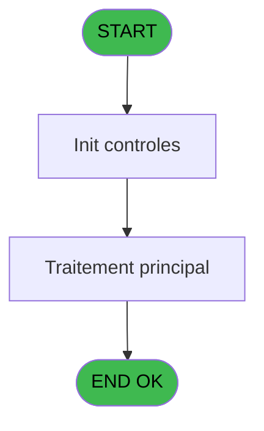
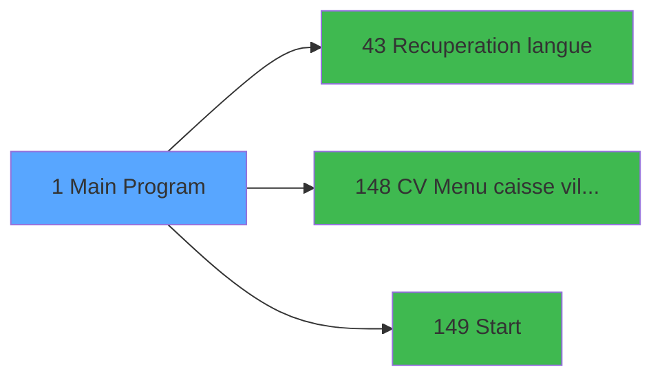

# VIL IDE 1 - Main Program

> **Analyse**: Phases 1-4 2026-02-03 00:44 -> 00:45 (60s) | Assemblage 00:45
> **Pipeline**: V7.2 Enrichi
> **Structure**: 4 onglets (Resume | Ecrans | Donnees | Connexions)

<!-- TAB:Resume -->

## 1. FICHE D'IDENTITE

| Attribut | Valeur |
|----------|--------|
| Projet | VIL |
| IDE Position | 1 |
| Nom Programme | Main Program |
| Fichier source | `Prg_1.xml` |
| Domaine metier | General |
| Taches | 5 (1 ecrans visibles) |
| Tables modifiees | 0 |
| Programmes appeles | 3 |
| :warning: Statut | **ORPHELIN_POTENTIEL** |

## 2. DESCRIPTION FONCTIONNELLE

**Main Program** assure la gestion complete de ce processus.

Le flux de traitement s'organise en **1 blocs fonctionnels** :

- **Traitement** (5 taches) : traitements metier divers

Detail : phases du traitement

#### Phase 1 : Traitement (5 taches)

- **1** - Caisse Village **[[ECRAN]](#ecran-t1)**
- **1.1** - Get Village Id
- **1.2** - Get delai expiration VAD
- **1.3** - Get Village Id
- **1.4** - Get delai expiration VAD

Delegue a : [Recuperation langue (IDE 43)](VIL-IDE-43.md), [CV  Menu caisse village (IDE 148)](VIL-IDE-148.md), [Start (IDE 149)](VIL-IDE-149.md)

## 3. BLOCS FONCTIONNELS

### 3.1 Traitement (5 taches)

Traitements internes.

---

#### 1 - Caisse Village [[ECRAN]](#ecran-t1)

**Role** : Traitement : Caisse Village.
**Ecran** : 320 x 200 DLU (Type11) | [Voir mockup](#ecran-t1)

4 sous-taches directes

| Tache | Nom | Bloc |
|-------|-----|------|
| [1.1](#t2) | Get Village Id | Traitement |
| [1.2](#t6) | Get delai expiration VAD | Traitement |
| [1.3](#t9) | Get Village Id | Traitement |
| [1.4](#t12) | Get delai expiration VAD | Traitement |

**Variables liees** : D (VG.DROIT ACCES CAISSE VILLAGE ?), J (VG.CODE VILLAGE), BA (VG. Nom Village)
**Delegue a** : [Recuperation langue (IDE 43)](VIL-IDE-43.md), [CV  Menu caisse village (IDE 148)](VIL-IDE-148.md), [Start (IDE 149)](VIL-IDE-149.md)

---

#### 1.1 - Get Village Id

**Role** : Consultation/chargement : Get Village Id.
**Variables liees** : D (VG.DROIT ACCES CAISSE VILLAGE ?), J (VG.CODE VILLAGE), BA (VG. Nom Village)
**Delegue a** : [Recuperation langue (IDE 43)](VIL-IDE-43.md), [CV  Menu caisse village (IDE 148)](VIL-IDE-148.md), [Start (IDE 149)](VIL-IDE-149.md)

---

#### 1.2 - Get delai expiration VAD

**Role** : Consultation/chargement : Get delai expiration VAD.
**Variables liees** : BH (VG Délai expiration valid VAD)
**Delegue a** : [Recuperation langue (IDE 43)](VIL-IDE-43.md), [CV  Menu caisse village (IDE 148)](VIL-IDE-148.md), [Start (IDE 149)](VIL-IDE-149.md)

---

#### 1.3 - Get Village Id

**Role** : Consultation/chargement : Get Village Id.
**Variables liees** : D (VG.DROIT ACCES CAISSE VILLAGE ?), J (VG.CODE VILLAGE), BA (VG. Nom Village)
**Delegue a** : [Recuperation langue (IDE 43)](VIL-IDE-43.md), [CV  Menu caisse village (IDE 148)](VIL-IDE-148.md), [Start (IDE 149)](VIL-IDE-149.md)

---

#### 1.4 - Get delai expiration VAD

**Role** : Consultation/chargement : Get delai expiration VAD.
**Variables liees** : BH (VG Délai expiration valid VAD)
**Delegue a** : [Recuperation langue (IDE 43)](VIL-IDE-43.md), [CV  Menu caisse village (IDE 148)](VIL-IDE-148.md), [Start (IDE 149)](VIL-IDE-149.md)

## 5. REGLES METIER

*(Aucune regle metier identifiee)*

## 6. CONTEXTE

- **Appele par**: (aucun)
- **Appelle**: 3 programmes | **Tables**: 4 (W:0 R:2 L:2) | **Taches**: 5 | **Expressions**: 50

<!-- TAB:Ecrans -->

## 8. ECRANS

### 8.1 Forms visibles (1 / 5)

| # | Position | Tache | Nom | Type | Largeur | Hauteur | Bloc |
|---|----------|-------|-----|------|---------|---------|------|
| 1 | 1 | 1 | Caisse Village | Type11 | 320 | 200 | Traitement |

### 8.2 Mockups Ecrans

## 9. NAVIGATION

Ecran unique: **Caisse Village**

### 9.3 Structure hierarchique (5 taches)

| Position | Tache | Type | Dimensions | Bloc |
|----------|-------|------|------------|------|
| **1.1** | [**Caisse Village** (1)](#t1) [mockup](#ecran-t1) | Type11 | 320x200 | Traitement |
| 1.1.1 | [Get Village Id (1.1)](#t2) | - | - | |
| 1.1.2 | [Get delai expiration VAD (1.2)](#t6) | - | - | |
| 1.1.3 | [Get Village Id (1.3)](#t9) | - | - | |
| 1.1.4 | [Get delai expiration VAD (1.4)](#t12) | - | - | |

### 9.4 Algorigramme

> **Legende**: Vert = START/END OK | Rouge = END KO | Bleu = Decisions
> *Algorigramme auto-genere. Utiliser `/algorigramme` pour une synthese metier detaillee.*

<!-- TAB:Donnees -->

## 10. TABLES

### Tables utilisees (4)

| ID | Nom | Description | Type | R | W | L | Usages |
|----|-----|-------------|------|---|---|---|--------|
| 69 | initialisation___ini |  | DB | R |   |   | 3 |
| 112 | tables_paris |  | DB | R |   |   | 1 |
| 372 | pv_budget |  | DB |   |   | L | 2 |
| 771 | easy_check_in |  | DB |   |   | L | 1 |

### Colonnes par table (0 / 2 tables avec colonnes identifiees)

Table 69 - initialisation___ini (R) - 3 usages

*Table utilisee uniquement en Link ou aucune colonne Real identifiee dans le DataView.*

Table 112 - tables_paris (R) - 1 usages

*Table utilisee uniquement en Link ou aucune colonne Real identifiee dans le DataView.*

## 11. VARIABLES

### 11.1 Variables globales (52)

Variables globales partagees entre programmes.

| Lettre | Nom | Type | Usage dans |
|--------|-----|------|-----------|
| A | VG.LOGIN | Unicode | 2x variable globale |
| B | VG.USER | Unicode | - |
| C | VG.DROIT ACCES IT RESORT ? | Logical | - |
| D | VG.DROIT ACCES CAISSE VILLAGE ? | Logical | - |
| E | VG.VRL ACTIF ? | Logical | - |
| F | VG.ECI ACTIF ? | Logical | - |
| G | VG.DATE CACHING ACTIF ? | Logical | - |
| H | VG.COMPTE CASH ACTIF ? | Logical | - |
| I | VG.USE MDR | Logical | - |
| J | VG.CODE VILLAGE | Unicode | - |
| K | VG.N° Version | Alpha | - |
| L | VG.Date version | Alpha | - |
| M | VG.SEPARATEUR | Alpha | - |
| N | VG.FACTURE TVA | Logical | - |
| O | VG.INTERFACES TPE | Logical | - |
| P | VG.VENTE ACTIF ? | Logical | - |
| Q | VG.CORRESPITIVI ACTIF ? | Logical | - |
| R | VG.PME (Porte-Monnaie Electroni | Logical | - |
| S | VG.TPE ACTIF ? | Logical | - |
| T | VG.Great Members Actif ? | Logical | - |
| U | VG.GIFT_PASS_V2.00 ? | Logical | - |
| V | VG.SER_V1.00 ACTIF | Logical | - |
| W | VG.RFI | Logical | - |
| X | VG.PYR ACTIF ? | Logical | - |
| Y | VG.CA reception ACTIF ? | Logical | - |
| Z | VG Masque Numerique | Alpha | - |
| BA | VG. Nom Village | Unicode | - |
| BB | VG.Has Supervisor Right | Logical | - |
| BC | VG.ECO AUTO | Logical | - |
| BD | VG. Interfaces Open Bravo | Logical | - |
| BE | VG.Hostname au lieu de Term | Logical | - |
| BF | VG.Num pseudo terminal | Numeric | - |
| BG | VG Envoi mail paiements VAD | Logical | - |
| BH | VG Délai expiration valid VAD | Numeric | - |
| BI | VG Affichage GM sans nom | Logical | - |
| BJ | VG Heure libération chambre | Logical | - |
| BK | VG.Gestion Taxes Additionnelles | Logical | - |
| BL | VG. Fiche Police Maroc 2.00 | Logical | - |
| BM | VG. Fiche Police Turquie 2.00 | Logical | - |
| BN | VG. Fiche Police Portugal 1.00 | Logical | - |
| BO | VG. STA 1.00 | Logical | 1x variable globale |
| BP | VG.Nombre de caractère compagni | Numeric | - |
| BQ | VG.Reçu Loi AGEC | Logical | - |
| BR | VG.Parametrage Loi AGEC | Logical | - |
| BS | VG. Turkish Accounting export 1 | Logical | - |
| BT | VG.Automated Accounting Import | Logical | - |
| BU | VG.Chemin Repertoire Transfert | Unicode | - |
| BV | VG. Plusieurs responsable RFI | Logical | - |
| BW | VG. Plafond AAJ | Numeric | - |
| BX | VG. Currency | Unicode | - |
| BY | VG. Pop up annulation AAJ 1.00 | Logical | - |
| BZ | VG. Date activation AAJ 1.00 | Date | - |

Toutes les 52 variables (liste complete)

| Cat | Lettre | Nom Variable | Type |
|-----|--------|--------------|------|
| VG | **A** | VG.LOGIN | Unicode |
| VG | **B** | VG.USER | Unicode |
| VG | **C** | VG.DROIT ACCES IT RESORT ? | Logical |
| VG | **D** | VG.DROIT ACCES CAISSE VILLAGE ? | Logical |
| VG | **E** | VG.VRL ACTIF ? | Logical |
| VG | **F** | VG.ECI ACTIF ? | Logical |
| VG | **G** | VG.DATE CACHING ACTIF ? | Logical |
| VG | **H** | VG.COMPTE CASH ACTIF ? | Logical |
| VG | **I** | VG.USE MDR | Logical |
| VG | **J** | VG.CODE VILLAGE | Unicode |
| VG | **K** | VG.N° Version | Alpha |
| VG | **L** | VG.Date version | Alpha |
| VG | **M** | VG.SEPARATEUR | Alpha |
| VG | **N** | VG.FACTURE TVA | Logical |
| VG | **O** | VG.INTERFACES TPE | Logical |
| VG | **P** | VG.VENTE ACTIF ? | Logical |
| VG | **Q** | VG.CORRESPITIVI ACTIF ? | Logical |
| VG | **R** | VG.PME (Porte-Monnaie Electroni | Logical |
| VG | **S** | VG.TPE ACTIF ? | Logical |
| VG | **T** | VG.Great Members Actif ? | Logical |
| VG | **U** | VG.GIFT_PASS_V2.00 ? | Logical |
| VG | **V** | VG.SER_V1.00 ACTIF | Logical |
| VG | **W** | VG.RFI | Logical |
| VG | **X** | VG.PYR ACTIF ? | Logical |
| VG | **Y** | VG.CA reception ACTIF ? | Logical |
| VG | **Z** | VG Masque Numerique | Alpha |
| VG | **BA** | VG. Nom Village | Unicode |
| VG | **BB** | VG.Has Supervisor Right | Logical |
| VG | **BC** | VG.ECO AUTO | Logical |
| VG | **BD** | VG. Interfaces Open Bravo | Logical |
| VG | **BE** | VG.Hostname au lieu de Term | Logical |
| VG | **BF** | VG.Num pseudo terminal | Numeric |
| VG | **BG** | VG Envoi mail paiements VAD | Logical |
| VG | **BH** | VG Délai expiration valid VAD | Numeric |
| VG | **BI** | VG Affichage GM sans nom | Logical |
| VG | **BJ** | VG Heure libération chambre | Logical |
| VG | **BK** | VG.Gestion Taxes Additionnelles | Logical |
| VG | **BL** | VG. Fiche Police Maroc 2.00 | Logical |
| VG | **BM** | VG. Fiche Police Turquie 2.00 | Logical |
| VG | **BN** | VG. Fiche Police Portugal 1.00 | Logical |
| VG | **BO** | VG. STA 1.00 | Logical |
| VG | **BP** | VG.Nombre de caractère compagni | Numeric |
| VG | **BQ** | VG.Reçu Loi AGEC | Logical |
| VG | **BR** | VG.Parametrage Loi AGEC | Logical |
| VG | **BS** | VG. Turkish Accounting export 1 | Logical |
| VG | **BT** | VG.Automated Accounting Import | Logical |
| VG | **BU** | VG.Chemin Repertoire Transfert | Unicode |
| VG | **BV** | VG. Plusieurs responsable RFI | Logical |
| VG | **BW** | VG. Plafond AAJ | Numeric |
| VG | **BX** | VG. Currency | Unicode |
| VG | **BY** | VG. Pop up annulation AAJ 1.00 | Logical |
| VG | **BZ** | VG. Date activation AAJ 1.00 | Date |

## 12. EXPRESSIONS

**50 / 50 expressions decodees (100%)**

### 12.1 Repartition par type

| Type | Expressions | Regles |
|------|-------------|--------|
| CONCATENATION | 1 | 0 |
| CONSTANTE | 36 | 0 |
| CONDITION | 2 | 0 |
| OTHER | 7 | 0 |
| CAST_LOGIQUE | 2 | 0 |
| NEGATION | 1 | 0 |
| STRING | 1 | 0 |

### 12.2 Expressions cles par type

#### CONCATENATION (1 expressions)

| Type | IDE | Expression | Regle |
|------|-----|------------|-------|
| CONCATENATION | 19 | `'Caisse Village - V '&Trim(ExpCalc('11'EXP))&' - '&Trim(ExpCalc('12'EXP))` | - |

#### CONSTANTE (36 expressions)

| Type | IDE | Expression | Regle |
|------|-----|------------|-------|
| CONSTANTE | 32 | `'GSN'` | - |
| CONSTANTE | 31 | `'ITO'` | - |
| CONSTANTE | 39 | `'GTA'` | - |
| CONSTANTE | 33 | `'TRA'` | - |
| CONSTANTE | 30 | `'T2H'` | - |
| ... | | *+31 autres* | |

#### CONDITION (2 expressions)

| Type | IDE | Expression | Regle |
|------|-----|------------|-------|
| CONDITION | 25 | `RunMode ()<=2 OR INIGet ('[MAGIC_LOGICAL_NAMES]DEV')='O'` | - |
| CONDITION | 1 | `RunMode ()<=2` | - |

#### OTHER (7 expressions)

| Type | IDE | Expression | Regle |
|------|-----|------------|-------|
| OTHER | 37 | `[AM]` | - |
| OTHER | 38 | `[AO]` | - |
| OTHER | 50 | `VG. STA 1.00 [BO]` | - |
| OTHER | 35 | `GetPseudoTerminal()` | - |
| OTHER | 2 | `NOT(IsComponent())` | - |
| ... | | *+2 autres* | |

#### CAST_LOGIQUE (2 expressions)

| Type | IDE | Expression | Regle |
|------|-----|------------|-------|
| CAST_LOGIQUE | 4 | `CallProg(ProgIdx('hasRight','TRUE'LOG),VG.LOGIN [A],'CAISSEVIL')` | - |
| CAST_LOGIQUE | 3 | `CallProg(ProgIdx('hasRight','TRUE'LOG),VG.LOGIN [A],'ACCESALL')` | - |

#### NEGATION (1 expressions)

| Type | IDE | Expression | Regle |
|------|-----|------------|-------|
| NEGATION | 36 | `NOT [AM]` | - |

#### STRING (1 expressions)

| Type | IDE | Expression | Regle |
|------|-----|------------|-------|
| STRING | 47 | `Trim (INIGet ('[MAGIC_LOGICAL_NAMES]club_exportdata'))&'Cloture\Transfert'` | - |

### 12.3 Toutes les expressions (50)

Voir les 50 expressions

#### CONCATENATION (1)

| IDE | Expression Decodee |
|-----|-------------------|
| 19 | `'Caisse Village - V '&Trim(ExpCalc('11'EXP))&' - '&Trim(ExpCalc('12'EXP))` |

#### CONSTANTE (36)

| IDE | Expression Decodee |
|-----|-------------------|
| 5 | `'VRL'` |
| 6 | `'1.00'` |
| 7 | `'2.00'` |
| 8 | `'ECI'` |
| 9 | `'CAC'` |
| 10 | `'CSH'` |
| 11 | `'FTV'` |
| 12 | `'TPE'` |
| 13 | `'FEX'` |
| 14 | `'SER'` |
| 15 | `'CV'` |
| 16 | `'ECA'` |
| 17 | `'3.89'` |
| 18 | `'15/12/2025'` |
| 21 | `'VEN'` |
| 22 | `'COR'` |
| 23 | `'PME'` |
| 24 | `'TPE'` |
| 26 | `'PYR'` |
| 27 | `'SCR'` |
| 28 | `'SUPERVISOR'` |
| 29 | `'IOB'` |
| 30 | `'T2H'` |
| 31 | `'ITO'` |
| 32 | `'GSN'` |
| 33 | `'TRA'` |
| 39 | `'GTA'` |
| 40 | `'AGC'` |
| 41 | `'AAI'` |
| 42 | `'DGS'` |
| 43 | `'FPT'` |
| 44 | `'FPP'` |
| 45 | `'STA'` |
| 46 | `'TAE'` |
| 48 | `'RFI'` |
| 49 | `'AAJ'` |

#### CONDITION (2)

| IDE | Expression Decodee |
|-----|-------------------|
| 1 | `RunMode ()<=2` |
| 25 | `RunMode ()<=2 OR INIGet ('[MAGIC_LOGICAL_NAMES]DEV')='O'` |

#### OTHER (7)

| IDE | Expression Decodee |
|-----|-------------------|
| 2 | `NOT(IsComponent())` |
| 20 | `Translate('%club_excel_separator%')` |
| 34 | `Term()` |
| 35 | `GetPseudoTerminal()` |
| 37 | `[AM]` |
| 38 | `[AO]` |
| 50 | `VG. STA 1.00 [BO]` |

#### CAST_LOGIQUE (2)

| IDE | Expression Decodee |
|-----|-------------------|
| 3 | `CallProg(ProgIdx('hasRight','TRUE'LOG),VG.LOGIN [A],'ACCESALL')` |
| 4 | `CallProg(ProgIdx('hasRight','TRUE'LOG),VG.LOGIN [A],'CAISSEVIL')` |

#### NEGATION (1)

| IDE | Expression Decodee |
|-----|-------------------|
| 36 | `NOT [AM]` |

#### STRING (1)

| IDE | Expression Decodee |
|-----|-------------------|
| 47 | `Trim (INIGet ('[MAGIC_LOGICAL_NAMES]club_exportdata'))&'Cloture\Transfert'` |

<!-- TAB:Connexions -->

## 13. GRAPHE D'APPELS

### 13.1 Chaine depuis Main (Callers)

**Chemin**: (pas de callers directs)

### 13.2 Callers

| IDE | Nom Programme | Nb Appels |
|-----|---------------|-----------|
| - | (aucun) | - |

### 13.3 Callees (programmes appeles)

### 13.4 Detail Callees avec contexte

| IDE | Nom Programme | Appels | Contexte |
|-----|---------------|--------|----------|
| [43](VIL-IDE-43.md) | Recuperation langue | 1 | Recuperation donnees |
| [148](VIL-IDE-148.md) | CV  Menu caisse village | 1 | Navigation menu |
| [149](VIL-IDE-149.md) | Start | 1 | Sous-programme |

## 14. RECOMMANDATIONS MIGRATION

### 14.1 Profil du programme

| Metrique | Valeur | Impact migration |
|----------|--------|-----------------|
| Lignes de logique | 178 | Programme compact |
| Expressions | 50 | Peu de logique |
| Tables WRITE | 0 | Impact faible |
| Sous-programmes | 3 | Peu de dependances |
| Ecrans visibles | 1 | Ecran unique ou traitement batch |
| Code desactive | 0% (0 / 178) | Code sain |
| Regles metier | 0 | Pas de regle identifiee |

### 14.2 Plan de migration par bloc

#### Traitement (5 taches: 1 ecran, 4 traitements)

- **Strategie** : Orchestrateur avec 1 ecrans (Razor/React) et 4 traitements backend (services).
- Les ecrans deviennent des composants UI, les traitements invisibles deviennent des services injectables.
- 3 sous-programme(s) a migrer ou a reutiliser depuis les services existants.
- Decomposer les taches en services unitaires testables.

### 14.3 Dependances critiques

| Dependance | Type | Appels | Impact |
|------------|------|--------|--------|
| [Start (IDE 149)](VIL-IDE-149.md) | Sous-programme | 1x | Normale - Sous-programme |
| [CV  Menu caisse village (IDE 148)](VIL-IDE-148.md) | Sous-programme | 1x | Normale - Navigation menu |
| [Recuperation langue (IDE 43)](VIL-IDE-43.md) | Sous-programme | 1x | Normale - Recuperation donnees |

---
*Spec DETAILED generee par Pipeline V7.2 - 2026-02-03 00:45*
