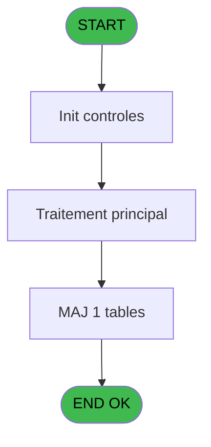
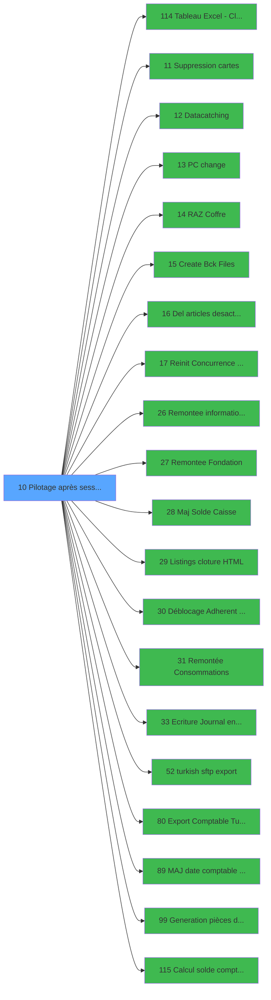

# VIL IDE 10 - Pilotage après sessions

> **Analyse**: Phases 1-4 2026-02-03 00:57 -> 00:57 (38s) | Assemblage 00:57
> **Pipeline**: V7.2 Enrichi
> **Structure**: 4 onglets (Resume | Ecrans | Donnees | Connexions)

<!-- TAB:Resume -->

## 1. FICHE D'IDENTITE

| Attribut | Valeur |
|----------|--------|
| Projet | VIL |
| IDE Position | 10 |
| Nom Programme | Pilotage après sessions |
| Fichier source | `Prg_10.xml` |
| Domaine metier | Caisse |
| Taches | 3 (0 ecrans visibles) |
| Tables modifiees | 1 |
| Programmes appeles | 20 |

## 2. DESCRIPTION FONCTIONNELLE

**Pilotage après sessions** assure la gestion complete de ce processus, accessible depuis [Pilotage avant sessions (IDE 9)](VIL-IDE-9.md).

Le flux de traitement s'organise en **1 blocs fonctionnels** :

- **Traitement** (3 taches) : traitements metier divers

**Donnees modifiees** : 1 tables en ecriture (reseau_cloture___rec).

**Logique metier** : 1 regles identifiees couvrant conditions metier.

## 3. BLOCS FONCTIONNELS

### 3.1 Traitement (3 taches)

Traitements internes.

---

#### 10 - Pilotage

**Role** : Traitement : Pilotage.
**Delegue a** : [Tableau Excel - Cloture Auto (IDE 114)](VIL-IDE-114.md), [    Suppression cartes (IDE 11)](VIL-IDE-11.md), [    Datacatching (IDE 12)](VIL-IDE-12.md)

---

#### 10.1 - Deblocage Cloture

**Role** : Traitement : Deblocage Cloture.
**Delegue a** : [Tableau Excel - Cloture Auto (IDE 114)](VIL-IDE-114.md), [    Suppression cartes (IDE 11)](VIL-IDE-11.md), [    Datacatching (IDE 12)](VIL-IDE-12.md)

---

#### 10.2 - Deblocage Cloture

**Role** : Traitement : Deblocage Cloture.
**Delegue a** : [Tableau Excel - Cloture Auto (IDE 114)](VIL-IDE-114.md), [    Suppression cartes (IDE 11)](VIL-IDE-11.md), [    Datacatching (IDE 12)](VIL-IDE-12.md)

## 5. REGLES METIER

1 regles identifiees:

### Autres (1 regles)

#### [RM-001] Si [S]<Date() alors Date() sinon [S]+1)

| Element | Detail |
|---------|--------|
| **Condition** | `[S]<Date()` |
| **Si vrai** | Date() |
| **Si faux** | [S]+1) |
| **Expression source** | Expression 17 : `IF([S]<Date(),Date(),[S]+1)` |
| **Exemple** | Si [S]<Date() → Date(). Sinon → [S]+1) |

## 6. CONTEXTE

- **Appele par**: [Pilotage avant sessions (IDE 9)](VIL-IDE-9.md)
- **Appelle**: 20 programmes | **Tables**: 9 (W:1 R:1 L:7) | **Taches**: 3 | **Expressions**: 32

<!-- TAB:Ecrans -->

## 8. ECRANS

*(Programme sans ecran visible)*

## 9. NAVIGATION

### 9.3 Structure hierarchique (3 taches)

| Position | Tache | Type | Dimensions | Bloc |
|----------|-------|------|------------|------|
| **10.1** | [**Pilotage** (10)](#t1) | MDI | - | Traitement |
| 10.1.1 | [Deblocage Cloture (10.1)](#t2) | MDI | - | |
| 10.1.2 | [Deblocage Cloture (10.2)](#t5) | MDI | - | |

### 9.4 Algorigramme

> **Legende**: Vert = START/END OK | Rouge = END KO | Bleu = Decisions
> *Algorigramme auto-genere. Utiliser `/algorigramme` pour une synthese metier detaillee.*

<!-- TAB:Donnees -->

## 10. TABLES

### Tables utilisees (9)

| ID | Nom | Description | Type | R | W | L | Usages |
|----|-----|-------------|------|---|---|---|--------|
| 23 | reseau_cloture___rec | Donnees reseau/cloture | DB |   | **W** |   | 2 |
| 63 | parametres___par |  | DB | R |   |   | 1 |
| 69 | initialisation___ini |  | DB |   |   | L | 1 |
| 70 | date_comptable___dat |  | DB |   |   | L | 1 |
| 122 | unilateral_bilateral |  | DB |   |   | L | 1 |
| 213 | suivi_cloture | Donnees reseau/cloture | DB |   |   | L | 1 |
| 348 | log_cloture_auto | Donnees reseau/cloture | DB |   |   | L | 1 |
| 372 | pv_budget |  | DB |   |   | L | 1 |
| 697 | droits_applications | Droits operateur | DB |   |   | L | 1 |

### Colonnes par table (2 / 2 tables avec colonnes identifiees)

Table 23 - reseau_cloture___rec (**W**) - 2 usages

*Table utilisee uniquement en Link ou aucune colonne Real identifiee dans le DataView.*

Table 63 - parametres___par (R) - 1 usages

| Lettre | Variable | Acces | Type |
|--------|----------|-------|------|
| A | Param N° Term coffre2 | R | Numeric |
| B | Param Hostname coffre2 | R | Unicode |
| C | W0 existe session | R | Logical |
| D | W0 sessions ouvertes | R | Logical |
| E | W0 nb sessions ouvertes | R | Numeric |
| F | W0 societe | R | Alpha |
| G | W0 masque montant | R | Alpha |
| H | W0 abandon | R | Logical |
| I | W0 compte total | R | Numeric |
| J | W0 compte monnaie | R | Numeric |
| K | W0 compte produit | R | Numeric |
| L | W0 compte carte | R | Numeric |
| M | W0 compte cheque | R | Numeric |
| N | W0 compte od | R | Numeric |
| O | W0 compte nbre devises | R | Numeric |
| P | W0 Compte Verst Retrait | R | Alpha |
| Q | W0 Erreur Restructuration | R | Numeric |
| R | W0 Date Comptable | R | Date |

## 11. VARIABLES

### 11.1 Variables de travail (16)

Variables internes au programme.

| Lettre | Nom | Type | Usage dans |
|--------|-----|------|-----------|
| C | W0 existe session | Logical | - |
| D | W0 sessions ouvertes | Logical | - |
| E | W0 nb sessions ouvertes | Numeric | 1x calcul interne |
| F | W0 societe | Alpha | - |
| G | W0 masque montant | Alpha | - |
| H | W0 abandon | Logical | - |
| I | W0 compte total | Numeric | - |
| J | W0 compte monnaie | Numeric | - |
| K | W0 compte produit | Numeric | - |
| L | W0 compte carte | Numeric | - |
| M | W0 compte cheque | Numeric | - |
| N | W0 compte od | Numeric | - |
| O | W0 compte nbre devises | Numeric | - |
| P | W0 Compte Verst Retrait | Alpha | - |
| Q | W0 Erreur Restructuration | Numeric | 1x calcul interne |
| R | W0 Date Comptable | Date | - |

### 11.2 Autres (2)

Variables diverses.

| Lettre | Nom | Type | Usage dans |
|--------|-----|------|-----------|
| A | Param N° Term coffre2 | Numeric | - |
| B | Param Hostname coffre2 | Unicode | - |

Toutes les 18 variables (liste complete)

| Cat | Lettre | Nom Variable | Type |
|-----|--------|--------------|------|
| W0 | **C** | W0 existe session | Logical |
| W0 | **D** | W0 sessions ouvertes | Logical |
| W0 | **E** | W0 nb sessions ouvertes | Numeric |
| W0 | **F** | W0 societe | Alpha |
| W0 | **G** | W0 masque montant | Alpha |
| W0 | **H** | W0 abandon | Logical |
| W0 | **I** | W0 compte total | Numeric |
| W0 | **J** | W0 compte monnaie | Numeric |
| W0 | **K** | W0 compte produit | Numeric |
| W0 | **L** | W0 compte carte | Numeric |
| W0 | **M** | W0 compte cheque | Numeric |
| W0 | **N** | W0 compte od | Numeric |
| W0 | **O** | W0 compte nbre devises | Numeric |
| W0 | **P** | W0 Compte Verst Retrait | Alpha |
| W0 | **Q** | W0 Erreur Restructuration | Numeric |
| W0 | **R** | W0 Date Comptable | Date |
| Autre | **A** | Param N° Term coffre2 | Numeric |
| Autre | **B** | Param Hostname coffre2 | Unicode |

## 12. EXPRESSIONS

**32 / 32 expressions decodees (100%)**

### 12.1 Repartition par type

| Type | Expressions | Regles |
|------|-------------|--------|
| CALCULATION | 2 | 0 |
| CONDITION | 2 | 5 |
| CONSTANTE | 7 | 0 |
| DATE | 1 | 0 |
| CONCATENATION | 3 | 0 |
| OTHER | 7 | 0 |
| CAST_LOGIQUE | 1 | 0 |
| REFERENCE_VG | 4 | 0 |
| NEGATION | 3 | 0 |
| FORMAT | 1 | 0 |
| STRING | 1 | 0 |

### 12.2 Expressions cles par type

#### CALCULATION (2 expressions)

| Type | IDE | Expression | Regle |
|------|-----|------------|-------|
| CALCULATION | 24 | `'cmd /c mkdir '&Trim (Translate('%club_exportdata%fondation'))` | - |
| CALCULATION | 23 | `'cmd /c mkdir '&Trim (Translate('%club_exportdata%eci'))` | - |

#### CONDITION (2 expressions)

| Type | IDE | Expression | Regle |
|------|-----|------------|-------|
| CONDITION | 17 | `IF([S]<Date(),Date(),[S]+1)` | [RM-001](#rm-RM-001) |
| CONDITION | 30 | `Translate('%club_test%')<>'T'` | - |

#### CONSTANTE (7 expressions)

| Type | IDE | Expression | Regle |
|------|-----|------------|-------|
| CONSTANTE | 14 | `'D'` | - |
| CONSTANTE | 15 | `'V'` | - |
| CONSTANTE | 16 | `'G'` | - |
| CONSTANTE | 13 | `''` | - |
| CONSTANTE | 1 | `'C'` | - |
| ... | | *+2 autres* | |

#### DATE (1 expressions)

| Type | IDE | Expression | Regle |
|------|-----|------------|-------|
| DATE | 8 | `Date ()` | - |

#### CONCATENATION (3 expressions)

| Type | IDE | Expression | Regle |
|------|-----|------------|-------|
| CONCATENATION | 20 | `Trim (INIGet ('[MAGIC_LOGICAL_NAMES]club_exe'))&'zip -j '&Trim (INIGet ('[MAGIC_LOGICAL_NAMES]club_exportdata'))&'Cloture\docs_'&DStr ([S],'YYYYMMDD')&' '&Trim (INIGet ('[MAGIC_LOGICAL_NAMES]club_exportdata'))&'Cloture\Editions\*'&DStr ([S],'YYYYMMDD')&'*.csv'` | - |
| CONCATENATION | 19 | `Trim (INIGet ('[MAGIC_LOGICAL_NAMES]club_exe'))&'zip -j '&Trim (INIGet ('[MAGIC_LOGICAL_NAMES]club_exportdata'))&'Cloture\docs_'&DStr ([S],'YYYYMMDD')&' '&Trim (INIGet ('[MAGIC_LOGICAL_NAMES]club_exportdata'))&'Cloture\Editions\*'&DStr ([S],'YYYYMMDD')&'.htm'` | - |
| CONCATENATION | 18 | `Trim (INIGet ('[MAGIC_LOGICAL_NAMES]club_exe'))&'zip -j '&Trim (INIGet ('[MAGIC_LOGICAL_NAMES]club_exportdata'))&'Cloture\docs_'&DStr ([S],'YYYYMMDD')&' '&Trim (INIGet ('[MAGIC_LOGICAL_NAMES]club_exportdata'))&'Cloture\*'&DStr ([S],'YYYYMMDD')&'*.*'` | - |

#### OTHER (7 expressions)

| Type | IDE | Expression | Regle |
|------|-----|------------|-------|
| OTHER | 11 | `W0 Erreur Restructuration [Q]` | - |
| OTHER | 22 | `[V]` | - |
| OTHER | 31 | `[DX]` | - |
| OTHER | 10 | `[S]` | - |
| OTHER | 2 | `W0 nb sessions ouvertes [E]` | - |
| ... | | *+2 autres* | |

#### CAST_LOGIQUE (1 expressions)

| Type | IDE | Expression | Regle |
|------|-----|------------|-------|
| CAST_LOGIQUE | 12 | `'TRUE'LOG` | - |

#### REFERENCE_VG (4 expressions)

| Type | IDE | Expression | Regle |
|------|-----|------------|-------|
| REFERENCE_VG | 29 | `VG39` | - |
| REFERENCE_VG | 32 | `VG58` | - |
| REFERENCE_VG | 21 | `VG12` | - |
| REFERENCE_VG | 27 | `VG27` | - |

#### NEGATION (3 expressions)

| Type | IDE | Expression | Regle |
|------|-----|------------|-------|
| NEGATION | 28 | `NOT VG39` | - |
| NEGATION | 26 | `NOT FileExist(Translate('%club_exportdata%fondation'))` | - |
| NEGATION | 25 | `NOT FileExist(Translate('%club_exportdata%eci'))` | - |

#### FORMAT (1 expressions)

| Type | IDE | Expression | Regle |
|------|-----|------------|-------|
| FORMAT | 6 | `'N15'&IF([AA]>0,'.'&Trim(Str([AA],'1')),'')&'CZ'` | - |

#### STRING (1 expressions)

| Type | IDE | Expression | Regle |
|------|-----|------------|-------|
| STRING | 7 | `Str ([AC],'9')` | - |

### 12.3 Toutes les expressions (32)

Voir les 32 expressions

#### CALCULATION (2)

| IDE | Expression Decodee |
|-----|-------------------|
| 23 | `'cmd /c mkdir '&Trim (Translate('%club_exportdata%eci'))` |
| 24 | `'cmd /c mkdir '&Trim (Translate('%club_exportdata%fondation'))` |

#### CONDITION (2)

| IDE | Expression Decodee |
|-----|-------------------|
| 17 | `IF([S]<Date(),Date(),[S]+1)` |
| 30 | `Translate('%club_test%')<>'T'` |

#### CONSTANTE (7)

| IDE | Expression Decodee |
|-----|-------------------|
| 1 | `'C'` |
| 3 | `'CAISSE'` |
| 4 | `2` |
| 13 | `''` |
| 14 | `'D'` |
| 15 | `'V'` |
| 16 | `'G'` |

#### DATE (1)

| IDE | Expression Decodee |
|-----|-------------------|
| 8 | `Date ()` |

#### CONCATENATION (3)

| IDE | Expression Decodee |
|-----|-------------------|
| 18 | `Trim (INIGet ('[MAGIC_LOGICAL_NAMES]club_exe'))&'zip -j '&Trim (INIGet ('[MAGIC_LOGICAL_NAMES]club_exportdata'))&'Cloture\docs_'&DStr ([S],'YYYYMMDD')&' '&Trim (INIGet ('[MAGIC_LOGICAL_NAMES]club_exportdata'))&'Cloture\*'&DStr ([S],'YYYYMMDD')&'*.*'` |
| 19 | `Trim (INIGet ('[MAGIC_LOGICAL_NAMES]club_exe'))&'zip -j '&Trim (INIGet ('[MAGIC_LOGICAL_NAMES]club_exportdata'))&'Cloture\docs_'&DStr ([S],'YYYYMMDD')&' '&Trim (INIGet ('[MAGIC_LOGICAL_NAMES]club_exportdata'))&'Cloture\Editions\*'&DStr ([S],'YYYYMMDD')&'.htm'` |
| 20 | `Trim (INIGet ('[MAGIC_LOGICAL_NAMES]club_exe'))&'zip -j '&Trim (INIGet ('[MAGIC_LOGICAL_NAMES]club_exportdata'))&'Cloture\docs_'&DStr ([S],'YYYYMMDD')&' '&Trim (INIGet ('[MAGIC_LOGICAL_NAMES]club_exportdata'))&'Cloture\Editions\*'&DStr ([S],'YYYYMMDD')&'*.csv'` |

#### OTHER (7)

| IDE | Expression Decodee |
|-----|-------------------|
| 2 | `W0 nb sessions ouvertes [E]` |
| 5 | `SetParam ('DEVISELOCAL_IN','N')` |
| 9 | `Time ()` |
| 10 | `[S]` |
| 11 | `W0 Erreur Restructuration [Q]` |
| 22 | `[V]` |
| 31 | `[DX]` |

#### CAST_LOGIQUE (1)

| IDE | Expression Decodee |
|-----|-------------------|
| 12 | `'TRUE'LOG` |

#### REFERENCE_VG (4)

| IDE | Expression Decodee |
|-----|-------------------|
| 21 | `VG12` |
| 27 | `VG27` |
| 29 | `VG39` |
| 32 | `VG58` |

#### NEGATION (3)

| IDE | Expression Decodee |
|-----|-------------------|
| 25 | `NOT FileExist(Translate('%club_exportdata%eci'))` |
| 26 | `NOT FileExist(Translate('%club_exportdata%fondation'))` |
| 28 | `NOT VG39` |

#### FORMAT (1)

| IDE | Expression Decodee |
|-----|-------------------|
| 6 | `'N15'&IF([AA]>0,'.'&Trim(Str([AA],'1')),'')&'CZ'` |

#### STRING (1)

| IDE | Expression Decodee |
|-----|-------------------|
| 7 | `Str ([AC],'9')` |

<!-- TAB:Connexions -->

## 13. GRAPHE D'APPELS

### 13.1 Chaine depuis Main (Callers)

Main -> ... -> [Pilotage avant sessions (IDE 9)](VIL-IDE-9.md) -> **Pilotage après sessions (IDE 10)**

### 13.2 Callers

| IDE | Nom Programme | Nb Appels |
|-----|---------------|-----------|
| [9](VIL-IDE-9.md) | Pilotage avant sessions | 1 |

### 13.3 Callees (programmes appeles)

### 13.4 Detail Callees avec contexte

| IDE | Nom Programme | Appels | Contexte |
|-----|---------------|--------|----------|
| [114](VIL-IDE-114.md) | Tableau Excel - Cloture Auto | 2 | Fermeture session |
| [11](VIL-IDE-11.md) |     Suppression cartes | 1 | Sous-programme |
| [12](VIL-IDE-12.md) |     Datacatching | 1 | Sous-programme |
| [13](VIL-IDE-13.md) |     PC change | 1 | Sous-programme |
| [14](VIL-IDE-14.md) |     RAZ Coffre | 1 | Reinitialisation |
| [15](VIL-IDE-15.md) |     Create Bck Files | 1 | Sous-programme |
| [16](VIL-IDE-16.md) |     Del articles desactives | 1 | Sous-programme |
| [17](VIL-IDE-17.md) |     Reinit Concurrence Session | 1 | Reinitialisation |
| [26](VIL-IDE-26.md) | Remontee informations ECI | 1 | Sous-programme |
| [27](VIL-IDE-27.md) | Remontee Fondation | 1 | Sous-programme |
| [28](VIL-IDE-28.md) |     Maj Solde Caisse | 1 | Verification solde |
| [29](VIL-IDE-29.md) |     Listings cloture HTML | 1 | Configuration impression |
| [30](VIL-IDE-30.md) | Déblocage Adherent Clôture | 1 | Sous-programme |
| [31](VIL-IDE-31.md) | Remontée Consommations | 1 | Sous-programme |
| [33](VIL-IDE-33.md) | Ecriture Journal encaissement | 1 | Sous-programme |
| [52](VIL-IDE-52.md) | turkish sftp export | 1 | Sous-programme |
| [80](VIL-IDE-80.md) | Export Comptable Turquie | 1 | Sous-programme |
| [89](VIL-IDE-89.md) | MAJ date comptable sessions | 1 | Mise a jour donnees |
| [99](VIL-IDE-99.md) | Generation pièces de caisse | 1 | Sous-programme |
| [115](VIL-IDE-115.md) | Calcul solde compte adherent | 1 | Calcul de donnees |

## 14. RECOMMANDATIONS MIGRATION

### 14.1 Profil du programme

| Metrique | Valeur | Impact migration |
|----------|--------|-----------------|
| Lignes de logique | 194 | Programme compact |
| Expressions | 32 | Peu de logique |
| Tables WRITE | 1 | Impact faible |
| Sous-programmes | 20 | Forte dependance |
| Ecrans visibles | 0 | Ecran unique ou traitement batch |
| Code desactive | 0% (0 / 194) | Code sain |
| Regles metier | 1 | Quelques regles a preserver |

### 14.2 Plan de migration par bloc

#### Traitement (3 taches: 0 ecran, 3 traitements)

- **Strategie** : 3 service(s) backend injectable(s) (Domain Services).
- 20 sous-programme(s) a migrer ou a reutiliser depuis les services existants.
- Decomposer les taches en services unitaires testables.

### 14.3 Dependances critiques

| Dependance | Type | Appels | Impact |
|------------|------|--------|--------|
| reseau_cloture___rec | Table WRITE (Database) | 2x | Schema + repository |
| [Tableau Excel - Cloture Auto (IDE 114)](VIL-IDE-114.md) | Sous-programme | 2x | Haute - Fermeture session |
| [Remontée Consommations (IDE 31)](VIL-IDE-31.md) | Sous-programme | 1x | Normale - Sous-programme |
| [Ecriture Journal encaissement (IDE 33)](VIL-IDE-33.md) | Sous-programme | 1x | Normale - Sous-programme |
| [    Listings cloture HTML (IDE 29)](VIL-IDE-29.md) | Sous-programme | 1x | Normale - Configuration impression |
| [Déblocage Adherent Clôture (IDE 30)](VIL-IDE-30.md) | Sous-programme | 1x | Normale - Sous-programme |
| [turkish sftp export (IDE 52)](VIL-IDE-52.md) | Sous-programme | 1x | Normale - Sous-programme |
| [Generation pièces de caisse (IDE 99)](VIL-IDE-99.md) | Sous-programme | 1x | Normale - Sous-programme |
| [Calcul solde compte adherent (IDE 115)](VIL-IDE-115.md) | Sous-programme | 1x | Normale - Calcul de donnees |
| [Export Comptable Turquie (IDE 80)](VIL-IDE-80.md) | Sous-programme | 1x | Normale - Sous-programme |
| [MAJ date comptable sessions (IDE 89)](VIL-IDE-89.md) | Sous-programme | 1x | Normale - Mise a jour donnees |

---
*Spec DETAILED generee par Pipeline V7.2 - 2026-02-03 00:57*
