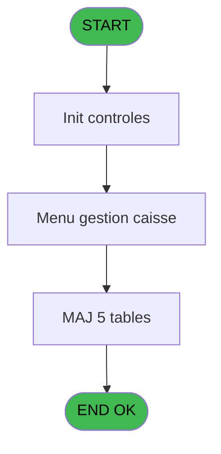
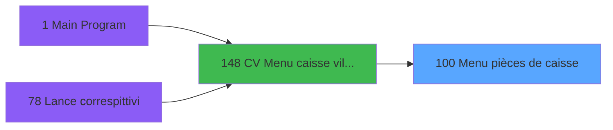
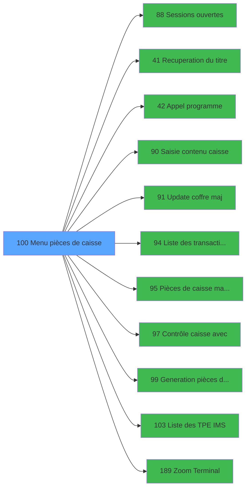

# VIL IDE 100 - Menu pièces de caisse

> **Analyse**: Phases 1-4 2026-02-03 09:21 -> 09:22 (20s) | Assemblage 09:22
> **Pipeline**: V7.2 Enrichi
> **Structure**: 4 onglets (Resume | Ecrans | Donnees | Connexions)

<!-- TAB:Resume -->

## 1. FICHE D'IDENTITE

| Attribut | Valeur |
|----------|--------|
| Projet | VIL |
| IDE Position | 100 |
| Nom Programme | Menu pièces de caisse |
| Fichier source | `Prg_100.xml` |
| Domaine metier | Caisse |
| Taches | 13 (3 ecrans visibles) |
| Tables modifiees | 5 |
| Programmes appeles | 11 |

## 2. DESCRIPTION FONCTIONNELLE

**Menu pièces de caisse** assure la gestion complete de ce processus, accessible depuis [CV  Menu caisse village (IDE 148)](VIL-IDE-148.md).

Le flux de traitement s'organise en **2 blocs fonctionnels** :

- **Traitement** (12 taches) : traitements metier divers
- **Initialisation** (1 tache) : reinitialisation d'etats et de variables de travail

**Donnees modifiees** : 5 tables en ecriture (pieces_caisse____pks, detail_coffre, detail_coffre_devise, ecarts, suivi_pdc).

Detail : phases du traitement

#### Phase 1 : Traitement (12 taches)

- **100** - CV  Autres tables **[[ECRAN]](#ecran-t1)**
- **100.1** - Menu pièces de caisse **[[ECRAN]](#ecran-t2)**
- **100.2** - Pilotage du contrôle de caisse **[[ECRAN]](#ecran-t3)**
- **100.2.1** - SUPP PDC ecart coffre
- **100.2.2** - SUPP ecart
- **100.2.3.1** - Histo coffre
- **100.2.3.2** - Histo devises
- **100.2.3.3** - Update suivi
- **100.2.3.4** - Ecart coffre
- **100.3** - Lecture suivi PDC
- **100.4** - Listing IMS **[[ECRAN]](#ecran-t13)**
- **100.5** - param caisse

Delegue a : [Sessions ouvertes (IDE 88)](VIL-IDE-88.md), [Recuperation du titre (IDE 41)](VIL-IDE-41.md), [Appel programme (IDE 42)](VIL-IDE-42.md), [Update coffre maj (IDE 91)](VIL-IDE-91.md), [Pièces de caisse manuelles (IDE 95)](VIL-IDE-95.md), [Contrôle caisse avec (IDE 97)](VIL-IDE-97.md), [Generation pièces de caisse (IDE 99)](VIL-IDE-99.md), [Liste des TPE IMS (IDE 103)](VIL-IDE-103.md)

#### Phase 2 : Initialisation (1 tache)

- **100.2.3** - RAZ historiques

#### Tables impactees

| Table | Operations | Role metier |
|-------|-----------|-------------|
| ecarts | **W** (2 usages) |  |
| suivi_pdc | R/**W** (2 usages) |  |
| detail_coffre | **W** (1 usages) | Etat du coffre |
| pieces_caisse____pks | **W** (1 usages) | Sessions de caisse |
| detail_coffre_devise | **W** (1 usages) | Etat du coffre |

## 3. BLOCS FONCTIONNELS

### 3.1 Traitement (12 taches)

Traitements internes.

---

#### 100 - CV  Autres tables [[ECRAN]](#ecran-t1)

**Role** : Tache d'orchestration : point d'entree du programme (12 sous-taches). Coordonne l'enchainement des traitements.
**Ecran** : 770 x 228 DLU (MDI) | [Voir mockup](#ecran-t1)

11 sous-taches directes

| Tache | Nom | Bloc |
|-------|-----|------|
| [100.1](#t2) | Menu pièces de caisse **[[ECRAN]](#ecran-t2)** | Traitement |
| [100.2](#t3) | Pilotage du contrôle de caisse **[[ECRAN]](#ecran-t3)** | Traitement |
| [100.2.1](#t4) | SUPP PDC ecart coffre | Traitement |
| [100.2.2](#t5) | SUPP ecart | Traitement |
| [100.2.3.1](#t7) | Histo coffre | Traitement |
| [100.2.3.2](#t8) | Histo devises | Traitement |
| [100.2.3.3](#t9) | Update suivi | Traitement |
| [100.2.3.4](#t10) | Ecart coffre | Traitement |
| [100.3](#t11) | Lecture suivi PDC | Traitement |
| [100.4](#t13) | Listing IMS **[[ECRAN]](#ecran-t13)** | Traitement |
| [100.5](#t17) | param caisse | Traitement |

---

#### 100.1 - Menu pièces de caisse [[ECRAN]](#ecran-t2)

**Role** : Traitement : Menu pièces de caisse.
**Ecran** : 640 x 198 DLU (MDI) | [Voir mockup](#ecran-t2)
**Variables liees** : O (v total caisse)

---

#### 100.2 - Pilotage du contrôle de caisse [[ECRAN]](#ecran-t3)

**Role** : Traitement : Pilotage du contrôle de caisse.
**Ecran** : 1040 x 271 DLU (MDI) | [Voir mockup](#ecran-t3)
**Variables liees** : O (v total caisse)

---

#### 100.2.1 - SUPP PDC ecart coffre

**Role** : Traitement : SUPP PDC ecart coffre.
**Variables liees** : Z (v abandon ecart), H (Param N° term coffre2), I (Param Hostname coffre2), BI (Ecart TPE corrige)

---

#### 100.2.2 - SUPP ecart

**Role** : Traitement : SUPP ecart.
**Variables liees** : Z (v abandon ecart), BI (Ecart TPE corrige)

---

#### 100.2.3.1 - Histo coffre

**Role** : Traitement : Histo coffre.
**Variables liees** : L (v chrono histo), H (Param N° term coffre2), I (Param Hostname coffre2)

---

#### 100.2.3.2 - Histo devises

**Role** : Traitement : Histo devises.
**Variables liees** : L (v chrono histo), U (v nbre devises)

---

#### 100.2.3.3 - Update suivi

**Role** : Traitement : Update suivi.
**Variables liees** : X (v abandon update)

---

#### 100.2.3.4 - Ecart coffre

**Role** : Traitement : Ecart coffre.
**Variables liees** : Z (v abandon ecart), H (Param N° term coffre2), I (Param Hostname coffre2), BI (Ecart TPE corrige)

---

#### 100.3 - Lecture suivi PDC

**Role** : Traitement : Lecture suivi PDC.

---

#### 100.4 - Listing IMS [[ECRAN]](#ecran-t13)

**Role** : Traitement : Listing IMS.
**Ecran** : 640 x 198 DLU (MDI) | [Voir mockup](#ecran-t13)

---

#### 100.5 - param caisse

**Role** : Traitement : param caisse.
**Variables liees** : O (v total caisse), A (Param societe), B (Param devise locale), C (Param masque), D (Param date comptable)

### 3.2 Initialisation (1 tache)

Reinitialisation d'etats et variables de travail.

---

#### 100.2.3 - RAZ historiques

**Role** : Reinitialisation : RAZ historiques.

## 5. REGLES METIER

*(Aucune regle metier identifiee)*

## 6. CONTEXTE

- **Appele par**: [CV  Menu caisse village (IDE 148)](VIL-IDE-148.md)
- **Appelle**: 11 programmes | **Tables**: 6 (W:5 R:2 L:0) | **Taches**: 13 | **Expressions**: 16

<!-- TAB:Ecrans -->

## 8. ECRANS

### 8.1 Forms visibles (3 / 13)

| # | Position | Tache | Nom | Type | Largeur | Hauteur | Bloc |
|---|----------|-------|-----|------|---------|---------|------|
| 1 | 100.1 | 100.1 | Menu pièces de caisse | MDI | 640 | 198 | Traitement |
| 2 | 100.2 | 100.2 | Pilotage du contrôle de caisse | MDI | 1040 | 271 | Traitement |
| 3 | 100.4 | 100.4 | Listing IMS | MDI | 640 | 198 | Traitement |

### 8.2 Mockups Ecrans

---

#### 100.1 - Menu pièces de caisse
**Tache** : [100.1](#t2) | **Type** : MDI | **Dimensions** : 640 x 198 DLU
**Bloc** : Traitement | **Titre IDE** : Menu pièces de caisse

<!-- FORM-DATA:
{
    "width":  640,
    "vFactor":  8,
    "type":  "MDI",
    "hFactor":  8,
    "controls":  [
                     {
                         "x":  0,
                         "type":  "label",
                         "var":  "",
                         "y":  1,
                         "w":  640,
                         "fmt":  "",
                         "name":  "",
                         "h":  19,
                         "color":  "",
                         "text":  "",
                         "parent":  null
                     },
                     {
                         "x":  7,
                         "type":  "label",
                         "var":  "",
                         "y":  23,
                         "w":  627,
                         "fmt":  "",
                         "name":  "",
                         "h":  143,
                         "color":  "",
                         "text":  "",
                         "parent":  null
                     },
                     {
                         "x":  144,
                         "type":  "label",
                         "var":  "",
                         "y":  43,
                         "w":  484,
                         "fmt":  "",
                         "name":  "",
                         "h":  106,
                         "color":  "",
                         "text":  "",
                         "parent":  null
                     },
                     {
                         "x":  160,
                         "type":  "label",
                         "var":  "",
                         "y":  52,
                         "w":  459,
                         "fmt":  "",
                         "name":  "",
                         "h":  77,
                         "color":  "",
                         "text":  "",
                         "parent":  5
                     },
                     {
                         "x":  207,
                         "type":  "label",
                         "var":  "",
                         "y":  56,
                         "w":  402,
                         "fmt":  "",
                         "name":  "",
                         "h":  9,
                         "color":  "7",
                         "text":  "Saisie des pièces de caisse manuelles",
                         "parent":  7
                     },
                     {
                         "x":  207,
                         "type":  "label",
                         "var":  "",
                         "y":  70,
                         "w":  402,
                         "fmt":  "",
                         "name":  "",
                         "h":  9,
                         "color":  "7",
                         "text":  "",
                         "parent":  7
                     },
                     {
                         "x":  207,
                         "type":  "label",
                         "var":  "",
                         "y":  84,
                         "w":  402,
                         "fmt":  "",
                         "name":  "",
                         "h":  9,
                         "color":  "7",
                         "text":  "Saisie des télécollectes TPE",
                         "parent":  7
                     },
                     {
                         "x":  207,
                         "type":  "label",
                         "var":  "",
                         "y":  98,
                         "w":  402,
                         "fmt":  "",
                         "name":  "",
                         "h":  9,
                         "color":  "7",
                         "text":  "Génération pièces de caisse réception",
                         "parent":  7
                     },
                     {
                         "x":  207,
                         "type":  "label",
                         "var":  "",
                         "y":  112,
                         "w":  402,
                         "fmt":  "",
                         "name":  "",
                         "h":  9,
                         "color":  "7",
                         "text":  "Comptage et contrôle caisse",
                         "parent":  7
                     },
                     {
                         "x":  297,
                         "type":  "label",
                         "var":  "",
                         "y":  133,
                         "w":  133,
                         "fmt":  "",
                         "name":  "",
                         "h":  10,
                         "color":  "",
                         "text":  " Votre choix",
                         "parent":  5
                     },
                     {
                         "x":  0,
                         "type":  "label",
                         "var":  "",
                         "y":  174,
                         "w":  640,
                         "fmt":  "",
                         "name":  "",
                         "h":  24,
                         "color":  "",
                         "text":  "",
                         "parent":  null
                     },
                     {
                         "x":  441,
                         "type":  "edit",
                         "var":  "",
                         "y":  133,
                         "w":  26,
                         "fmt":  "",
                         "name":  "",
                         "h":  10,
                         "color":  "6",
                         "text":  "",
                         "parent":  5
                     },
                     {
                         "x":  7,
                         "type":  "edit",
                         "var":  "",
                         "y":  6,
                         "w":  267,
                         "fmt":  "20",
                         "name":  "",
                         "h":  8,
                         "color":  "",
                         "text":  "",
                         "parent":  null
                     },
                     {
                         "x":  372,
                         "type":  "edit",
                         "var":  "",
                         "y":  7,
                         "w":  256,
                         "fmt":  "WWW DD MMM YYYYT",
                         "name":  "",
                         "h":  8,
                         "color":  "",
                         "text":  "",
                         "parent":  null
                     },
                     {
                         "x":  17,
                         "type":  "image",
                         "var":  "",
                         "y":  64,
                         "w":  120,
                         "fmt":  "",
                         "name":  "",
                         "h":  45,
                         "color":  "",
                         "text":  "",
                         "parent":  null
                     },
                     {
                         "x":  208,
                         "type":  "edit",
                         "var":  "",
                         "y":  181,
                         "w":  397,
                         "fmt":  "",
                         "name":  "",
                         "h":  10,
                         "color":  "143",
                         "text":  "",
                         "parent":  null
                     },
                     {
                         "x":  169,
                         "type":  "button",
                         "var":  "",
                         "y":  56,
                         "w":  26,
                         "fmt":  "1",
                         "name":  "1",
                         "h":  9,
                         "color":  "",
                         "text":  "",
                         "parent":  7
                     },
                     {
                         "x":  169,
                         "type":  "button",
                         "var":  "",
                         "y":  84,
                         "w":  26,
                         "fmt":  "2",
                         "name":  "2",
                         "h":  9,
                         "color":  "",
                         "text":  "",
                         "parent":  7
                     },
                     {
                         "x":  169,
                         "type":  "button",
                         "var":  "",
                         "y":  98,
                         "w":  26,
                         "fmt":  "3",
                         "name":  "3",
                         "h":  9,
                         "color":  "",
                         "text":  "",
                         "parent":  7
                     },
                     {
                         "x":  169,
                         "type":  "button",
                         "var":  "",
                         "y":  112,
                         "w":  26,
                         "fmt":  "4",
                         "name":  "4",
                         "h":  9,
                         "color":  "",
                         "text":  "",
                         "parent":  7
                     },
                     {
                         "x":  7,
                         "type":  "button",
                         "var":  "",
                         "y":  177,
                         "w":  154,
                         "fmt":  "\u0026Quitter",
                         "name":  "",
                         "h":  18,
                         "color":  "",
                         "text":  "",
                         "parent":  null
                     }
                 ],
    "taskId":  "100.1",
    "height":  198
}
-->

<strong>Champs : 4 champs</strong>

| Pos (x,y) | Nom | Variable | Type |
|-----------|-----|----------|------|
| 441,133 | (sans nom) | - | edit |
| 7,6 | 20 | - | edit |
| 372,7 | WWW DD MMM YYYYT | - | edit |
| 208,181 | (sans nom) | - | edit |

<strong>Boutons : 5 boutons</strong>

| Bouton | Pos (x,y) | Action |
|--------|-----------|--------|
| 1 | 169,56 | Bouton fonctionnel |
| 2 | 169,84 | Bouton fonctionnel |
| 3 | 169,98 | Bouton fonctionnel |
| 4 | 169,112 | Bouton fonctionnel |
| Quitter | 7,177 | Quitte le programme |

---

#### 100.2 - Pilotage du contrôle de caisse
**Tache** : [100.2](#t3) | **Type** : MDI | **Dimensions** : 1040 x 271 DLU
**Bloc** : Traitement | **Titre IDE** : Pilotage du contrôle de caisse

<!-- FORM-DATA:
{
    "width":  1040,
    "vFactor":  8,
    "type":  "MDI",
    "hFactor":  8,
    "controls":  [
                     {
                         "x":  320,
                         "type":  "label",
                         "var":  "",
                         "y":  127,
                         "w":  400,
                         "fmt":  "",
                         "name":  "",
                         "h":  16,
                         "color":  "142",
                         "text":  "Calcul en cours",
                         "parent":  null
                     }
                 ],
    "taskId":  "100.2",
    "height":  271
}
-->

---

#### 100.4 - Listing IMS
**Tache** : [100.4](#t13) | **Type** : MDI | **Dimensions** : 640 x 198 DLU
**Bloc** : Traitement | **Titre IDE** : Listing IMS

<!-- FORM-DATA:
{
    "width":  640,
    "vFactor":  8,
    "type":  "MDI",
    "hFactor":  8,
    "controls":  [
                     {
                         "x":  0,
                         "type":  "label",
                         "var":  "",
                         "y":  1,
                         "w":  640,
                         "fmt":  "",
                         "name":  "",
                         "h":  19,
                         "color":  "",
                         "text":  "",
                         "parent":  null
                     },
                     {
                         "x":  325,
                         "type":  "label",
                         "var":  "",
                         "y":  79,
                         "w":  154,
                         "fmt":  "",
                         "name":  "",
                         "h":  10,
                         "color":  "",
                         "text":  "Terminal IMS",
                         "parent":  null
                     },
                     {
                         "x":  0,
                         "type":  "label",
                         "var":  "",
                         "y":  143,
                         "w":  640,
                         "fmt":  "",
                         "name":  "",
                         "h":  24,
                         "color":  "",
                         "text":  "",
                         "parent":  null
                     },
                     {
                         "x":  0,
                         "type":  "label",
                         "var":  "",
                         "y":  173,
                         "w":  640,
                         "fmt":  "",
                         "name":  "",
                         "h":  24,
                         "color":  "",
                         "text":  "",
                         "parent":  null
                     },
                     {
                         "x":  515,
                         "type":  "edit",
                         "var":  "",
                         "y":  79,
                         "w":  56,
                         "fmt":  "3Z",
                         "name":  "Terminal IMS",
                         "h":  10,
                         "color":  "6",
                         "text":  "",
                         "parent":  null
                     },
                     {
                         "x":  6,
                         "type":  "button",
                         "var":  "",
                         "y":  146,
                         "w":  280,
                         "fmt":  "Listing \u0026Transaction",
                         "name":  "Bt Listing Transaction",
                         "h":  18,
                         "color":  "",
                         "text":  "",
                         "parent":  null
                     },
                     {
                         "x":  349,
                         "type":  "button",
                         "var":  "",
                         "y":  146,
                         "w":  280,
                         "fmt":  "Listing \u0026Reçus TPE",
                         "name":  "Bt Listing RECUS TPE",
                         "h":  18,
                         "color":  "",
                         "text":  "",
                         "parent":  null
                     },
                     {
                         "x":  6,
                         "type":  "edit",
                         "var":  "",
                         "y":  6,
                         "w":  267,
                         "fmt":  "30",
                         "name":  "",
                         "h":  8,
                         "color":  "",
                         "text":  "",
                         "parent":  null
                     },
                     {
                         "x":  371,
                         "type":  "edit",
                         "var":  "",
                         "y":  7,
                         "w":  256,
                         "fmt":  "WWW DD MMM YYYYT",
                         "name":  "",
                         "h":  8,
                         "color":  "",
                         "text":  "",
                         "parent":  null
                     },
                     {
                         "x":  69,
                         "type":  "image",
                         "var":  "",
                         "y":  58,
                         "w":  120,
                         "fmt":  "",
                         "name":  "",
                         "h":  52,
                         "color":  "",
                         "text":  "",
                         "parent":  null
                     },
                     {
                         "x":  6,
                         "type":  "button",
                         "var":  "",
                         "y":  176,
                         "w":  154,
                         "fmt":  "\u0026Quitter",
                         "name":  "",
                         "h":  18,
                         "color":  "",
                         "text":  "",
                         "parent":  null
                     }
                 ],
    "taskId":  "100.4",
    "height":  198
}
-->

<strong>Champs : 3 champs</strong>

| Pos (x,y) | Nom | Variable | Type |
|-----------|-----|----------|------|
| 515,79 | Terminal IMS | - | edit |
| 6,6 | 30 | - | edit |
| 371,7 | WWW DD MMM YYYYT | - | edit |

<strong>Boutons : 3 boutons</strong>

| Bouton | Pos (x,y) | Action |
|--------|-----------|--------|
| Listing Transaction | 6,146 | Bouton fonctionnel |
| Listing Reçus TPE | 349,146 | Bouton fonctionnel |
| Quitter | 6,176 | Quitte le programme |

## 9. NAVIGATION

### 9.1 Enchainement des ecrans

```mermaid
flowchart TD
    START([Entree])
    style START fill:#3fb950
    VF2[100.1 Menu pièces de caisse]
    style VF2 fill:#58a6ff
    VF3[100.2 Pilotage du contrôl...]
    style VF3 fill:#58a6ff
    VF13[100.4 Listing IMS]
    style VF13 fill:#58a6ff
    EXT88[IDE 88 Sessions ouvertes]
    style EXT88 fill:#3fb950
    EXT41[IDE 41 Recuperation du...]
    style EXT41 fill:#3fb950
    EXT42[IDE 42 Appel programme]
    style EXT42 fill:#3fb950
    EXT90[IDE 90 Saisie contenu ...]
    style EXT90 fill:#3fb950
    EXT91[IDE 91 Update coffre maj]
    style EXT91 fill:#3fb950
    EXT94[IDE 94 Liste des trans...]
    style EXT94 fill:#3fb950
    EXT95[IDE 95 Pièces de caiss...]
    style EXT95 fill:#3fb950
    EXT97[IDE 97 Contrôle caisse...]
    style EXT97 fill:#3fb950
    EXT99[IDE 99 Generation pièc...]
    style EXT99 fill:#3fb950
    EXT103[IDE 103 Liste des TPE IMS]
    style EXT103 fill:#3fb950
    EXT189[IDE 189 Zoom Terminal]
    style EXT189 fill:#3fb950
    FIN([Sortie])
    style FIN fill:#f85149
    START --> VF2
    VF2 -->|Gestion session| EXT88
    VF2 -->|Recuperation donnees| EXT41
    VF2 -->|Sous-programme| EXT42
    VF2 -->|Sous-programme| EXT90
    VF2 -->|Mise a jour donnees| EXT91
    VF2 -->|Configuration impression| EXT94
    VF2 -->|Sous-programme| EXT95
    VF2 -->|Sous-programme| EXT97
    EXT189 --> FIN
```

**Detail par enchainement :**

| Depuis | Action | Vers | Retour |
|--------|--------|------|--------|
| Menu pièces de caisse | Gestion session | [Sessions ouvertes (IDE 88)](VIL-IDE-88.md) | Retour ecran |
| Menu pièces de caisse | Recuperation donnees | [Recuperation du titre (IDE 41)](VIL-IDE-41.md) | Retour ecran |
| Menu pièces de caisse | Sous-programme | [Appel programme (IDE 42)](VIL-IDE-42.md) | Retour ecran |
| Menu pièces de caisse | Sous-programme | [Saisie contenu caisse (IDE 90)](VIL-IDE-90.md) | Retour ecran |
| Menu pièces de caisse | Mise a jour donnees | [Update coffre maj (IDE 91)](VIL-IDE-91.md) | Retour ecran |
| Menu pièces de caisse | Configuration impression | [Liste des transactions IMS (IDE 94)](VIL-IDE-94.md) | Retour ecran |
| Menu pièces de caisse | Sous-programme | [Pièces de caisse manuelles (IDE 95)](VIL-IDE-95.md) | Retour ecran |
| Menu pièces de caisse | Sous-programme | [Contrôle caisse avec (IDE 97)](VIL-IDE-97.md) | Retour ecran |
| Menu pièces de caisse | Sous-programme | [Generation pièces de caisse (IDE 99)](VIL-IDE-99.md) | Retour ecran |
| Menu pièces de caisse | Configuration impression | [Liste des TPE IMS (IDE 103)](VIL-IDE-103.md) | Retour ecran |
| Menu pièces de caisse | Selection/consultation | [Zoom Terminal (IDE 189)](VIL-IDE-189.md) | Retour ecran |

### 9.3 Structure hierarchique (13 taches)

| Position | Tache | Type | Dimensions | Bloc |
|----------|-------|------|------------|------|
| **100.1** | [**CV  Autres tables** (100)](#t1) [mockup](#ecran-t1) | MDI | 770x228 | Traitement |
| 100.1.1 | [Menu pièces de caisse (100.1)](#t2) [mockup](#ecran-t2) | MDI | 640x198 | |
| 100.1.2 | [Pilotage du contrôle de caisse (100.2)](#t3) [mockup](#ecran-t3) | MDI | 1040x271 | |
| 100.1.3 | [SUPP PDC ecart coffre (100.2.1)](#t4) | MDI | - | |
| 100.1.4 | [SUPP ecart (100.2.2)](#t5) | MDI | - | |
| 100.1.5 | [Histo coffre (100.2.3.1)](#t7) | MDI | - | |
| 100.1.6 | [Histo devises (100.2.3.2)](#t8) | MDI | - | |
| 100.1.7 | [Update suivi (100.2.3.3)](#t9) | MDI | - | |
| 100.1.8 | [Ecart coffre (100.2.3.4)](#t10) | MDI | - | |
| 100.1.9 | [Lecture suivi PDC (100.3)](#t11) | MDI | - | |
| 100.1.10 | [Listing IMS (100.4)](#t13) [mockup](#ecran-t13) | MDI | 640x198 | |
| 100.1.11 | [param caisse (100.5)](#t17) | MDI | - | |
| **100.2** | [**RAZ historiques** (100.2.3)](#t6) | MDI | - | Initialisation |

### 9.4 Algorigramme

> **Legende**: Vert = START/END OK | Rouge = END KO | Bleu = Decisions
> *Algorigramme auto-genere. Utiliser `/algorigramme` pour une synthese metier detaillee.*

<!-- TAB:Donnees -->

## 10. TABLES

### Tables utilisees (6)

| ID | Nom | Description | Type | R | W | L | Usages |
|----|-----|-------------|------|---|---|---|--------|
| 54 | pieces_caisse____pks | Sessions de caisse | DB |   | **W** |   | 1 |
| 228 | detail_coffre | Etat du coffre | DB |   | **W** |   | 1 |
| 229 | detail_coffre_devise | Etat du coffre | DB |   | **W** |   | 1 |
| 234 | ecarts |  | DB |   | **W** |   | 2 |
| 255 | suivi_pdc |  | DB | R | **W** |   | 2 |
| 697 | droits_applications | Droits operateur | DB | R |   |   | 1 |

### Colonnes par table (3 / 6 tables avec colonnes identifiees)

Table 54 - pieces_caisse____pks (**W**) - 1 usages

| Lettre | Variable | Acces | Type |
|--------|----------|-------|------|
| O | v total caisse | W | Numeric |

Table 228 - detail_coffre (**W**) - 1 usages

| Lettre | Variable | Acces | Type |
|--------|----------|-------|------|
| H | Param N° term coffre2 | W | Numeric |
| I | Param Hostname coffre2 | W | Unicode |

Table 229 - detail_coffre_devise (**W**) - 1 usages

| Lettre | Variable | Acces | Type |
|--------|----------|-------|------|
| B | Param devise locale | W | Alpha |
| H | Param N° term coffre2 | W | Numeric |
| I | Param Hostname coffre2 | W | Unicode |
| U | v nbre devises | W | Numeric |

Table 234 - ecarts (**W**) - 2 usages

*Table utilisee uniquement en Link ou aucune colonne Real identifiee dans le DataView.*

Table 255 - suivi_pdc (R/**W**) - 2 usages

*Table utilisee uniquement en Link ou aucune colonne Real identifiee dans le DataView.*

Table 697 - droits_applications (R) - 1 usages

*Table utilisee uniquement en Link ou aucune colonne Real identifiee dans le DataView.*

## 11. VARIABLES

### 11.1 Variables de session (25)

Variables persistantes pendant toute la session.

| Lettre | Nom | Type | Usage dans |
|--------|-----|------|-----------|
| J | v quand (blanc) | Alpha | - |
| K | v chrono session (zero) | Numeric | - |
| L | v chrono histo | Numeric | - |
| M | v date validation | Date | - |
| N | v time validation | Time | - |
| O | v total caisse | Numeric | - |
| P | v total monnaie | Numeric | - |
| Q | v total produits | Numeric | - |
| R | v total cartes | Numeric | - |
| S | v total cheques | Numeric | - |
| T | v total od | Numeric | - |
| U | v nbre devises | Numeric | [100.2.3.2](#t8) |
| V | v abandon comptage | Logical | - |
| W | v from | Alpha | - |
| X | v abandon update | Logical | - |
| Y | v initialisation | Logical | - |
| Z | v abandon ecart | Logical | [100.2.1](#t4), [100.2.2](#t5), [100.2.3.4](#t10) |
| BB | v. titre | Alpha | - |
| BC | v. libelle pdc generees | Alpha | - |
| BD | v. etape TPE faite | Logical | - |
| BE | v. etape PDC faite | Logical | - |
| BF | v. etape COC faite | Logical | - |
| BG | v. existe session | Logical | - |
| BH | v. existe session ouverte | Logical | - |
| BJ | v cloture_auto | Logical | - |

### 11.2 Variables de travail (1)

Variables internes au programme.

| Lettre | Nom | Type | Usage dans |
|--------|-----|------|-----------|
| BA | W0 choix action | Alpha | - |

### 11.3 Autres (10)

Variables diverses.

| Lettre | Nom | Type | Usage dans |
|--------|-----|------|-----------|
| A | Param societe | Alpha | - |
| B | Param devise locale | Alpha | - |
| C | Param masque | Alpha | - |
| D | Param date comptable | Date | - |
| E | Param nom village | Alpha | - |
| F | Param Nbre decimales | Numeric | - |
| G | Param UNI/BI | Alpha | - |
| H | Param N° term coffre2 | Numeric | - |
| I | Param Hostname coffre2 | Unicode | - |
| BI | Ecart TPE corrige | Logical | - |

Toutes les 36 variables (liste complete)

| Cat | Lettre | Nom Variable | Type |
|-----|--------|--------------|------|
| W0 | **BA** | W0 choix action | Alpha |
| V. | **J** | v quand (blanc) | Alpha |
| V. | **K** | v chrono session (zero) | Numeric |
| V. | **L** | v chrono histo | Numeric |
| V. | **M** | v date validation | Date |
| V. | **N** | v time validation | Time |
| V. | **O** | v total caisse | Numeric |
| V. | **P** | v total monnaie | Numeric |
| V. | **Q** | v total produits | Numeric |
| V. | **R** | v total cartes | Numeric |
| V. | **S** | v total cheques | Numeric |
| V. | **T** | v total od | Numeric |
| V. | **U** | v nbre devises | Numeric |
| V. | **V** | v abandon comptage | Logical |
| V. | **W** | v from | Alpha |
| V. | **X** | v abandon update | Logical |
| V. | **Y** | v initialisation | Logical |
| V. | **Z** | v abandon ecart | Logical |
| V. | **BB** | v. titre | Alpha |
| V. | **BC** | v. libelle pdc generees | Alpha |
| V. | **BD** | v. etape TPE faite | Logical |
| V. | **BE** | v. etape PDC faite | Logical |
| V. | **BF** | v. etape COC faite | Logical |
| V. | **BG** | v. existe session | Logical |
| V. | **BH** | v. existe session ouverte | Logical |
| V. | **BJ** | v cloture_auto | Logical |
| Autre | **A** | Param societe | Alpha |
| Autre | **B** | Param devise locale | Alpha |
| Autre | **C** | Param masque | Alpha |
| Autre | **D** | Param date comptable | Date |
| Autre | **E** | Param nom village | Alpha |
| Autre | **F** | Param Nbre decimales | Numeric |
| Autre | **G** | Param UNI/BI | Alpha |
| Autre | **H** | Param N° term coffre2 | Numeric |
| Autre | **I** | Param Hostname coffre2 | Unicode |
| Autre | **BI** | Ecart TPE corrige | Logical |

## 12. EXPRESSIONS

**16 / 16 expressions decodees (100%)**

### 12.1 Repartition par type

| Type | Expressions | Regles |
|------|-------------|--------|
| CONSTANTE | 3 | 0 |
| CONDITION | 5 | 0 |
| NEGATION | 4 | 0 |
| OTHER | 2 | 0 |
| CAST_LOGIQUE | 1 | 0 |
| STRING | 1 | 0 |

### 12.2 Expressions cles par type

#### CONSTANTE (3 expressions)

| Type | IDE | Expression | Regle |
|------|-----|------------|-------|
| CONSTANTE | 9 | `'COC'` | - |
| CONSTANTE | 8 | `'PDC'` | - |
| CONSTANTE | 7 | `'TPE'` | - |

#### CONDITION (5 expressions)

| Type | IDE | Expression | Regle |
|------|-----|------------|-------|
| CONDITION | 5 | `v abandon ecart [Z]='4'` | - |
| CONDITION | 6 | `v abandon ecart [Z]='F'` | - |
| CONDITION | 4 | `v abandon ecart [Z]='3'` | - |
| CONDITION | 2 | `v abandon ecart [Z]='1'` | - |
| CONDITION | 3 | `v abandon ecart [Z]='2'` | - |

#### NEGATION (4 expressions)

| Type | IDE | Expression | Regle |
|------|-----|------------|-------|
| NEGATION | 15 | `NOT (v nbre devises [U])` | - |
| NEGATION | 16 | `NOT ([AJ])` | - |
| NEGATION | 10 | `NOT ([AD])` | - |
| NEGATION | 13 | `NOT ([AG])` | - |

#### OTHER (2 expressions)

| Type | IDE | Expression | Regle |
|------|-----|------------|-------|
| OTHER | 12 | `[AG]` | - |
| OTHER | 11 | `[AD]` | - |

#### CAST_LOGIQUE (1 expressions)

| Type | IDE | Expression | Regle |
|------|-----|------------|-------|
| CAST_LOGIQUE | 14 | `'FALSE'LOG` | - |

#### STRING (1 expressions)

| Type | IDE | Expression | Regle |
|------|-----|------------|-------|
| STRING | 1 | `Trim ([AA])` | - |

<!-- TAB:Connexions -->

## 13. GRAPHE D'APPELS

### 13.1 Chaine depuis Main (Callers)

Main -> ... -> [CV  Menu caisse village (IDE 148)](VIL-IDE-148.md) -> **Menu pièces de caisse (IDE 100)**

### 13.2 Callers

| IDE | Nom Programme | Nb Appels |
|-----|---------------|-----------|
| [148](VIL-IDE-148.md) | CV  Menu caisse village | 1 |

### 13.3 Callees (programmes appeles)

### 13.4 Detail Callees avec contexte

| IDE | Nom Programme | Appels | Contexte |
|-----|---------------|--------|----------|
| [88](VIL-IDE-88.md) | Sessions ouvertes | 2 | Gestion session |
| [41](VIL-IDE-41.md) | Recuperation du titre | 1 | Recuperation donnees |
| [42](VIL-IDE-42.md) | Appel programme | 1 | Sous-programme |
| [90](VIL-IDE-90.md) | Saisie contenu caisse | 1 | Sous-programme |
| [91](VIL-IDE-91.md) | Update coffre maj | 1 | Mise a jour donnees |
| [94](VIL-IDE-94.md) | Liste des transactions IMS | 1 | Configuration impression |
| [95](VIL-IDE-95.md) | Pièces de caisse manuelles | 1 | Sous-programme |
| [97](VIL-IDE-97.md) | Contrôle caisse avec | 1 | Sous-programme |
| [99](VIL-IDE-99.md) | Generation pièces de caisse | 1 | Sous-programme |
| [103](VIL-IDE-103.md) | Liste des TPE IMS | 1 | Configuration impression |
| [189](VIL-IDE-189.md) | Zoom Terminal | 1 | Selection/consultation |

## 14. RECOMMANDATIONS MIGRATION

### 14.1 Profil du programme

| Metrique | Valeur | Impact migration |
|----------|--------|-----------------|
| Lignes de logique | 206 | Taille moyenne |
| Expressions | 16 | Peu de logique |
| Tables WRITE | 5 | Impact modere |
| Sous-programmes | 11 | Forte dependance |
| Ecrans visibles | 3 | Quelques ecrans |
| Code desactive | 0% (0 / 206) | Code sain |
| Regles metier | 0 | Pas de regle identifiee |

### 14.2 Plan de migration par bloc

#### Traitement (12 taches: 4 ecrans, 8 traitements)

- **Strategie** : Orchestrateur avec 4 ecrans (Razor/React) et 8 traitements backend (services).
- Les ecrans deviennent des composants UI, les traitements invisibles deviennent des services injectables.
- 11 sous-programme(s) a migrer ou a reutiliser depuis les services existants.
- Decomposer les taches en services unitaires testables.

#### Initialisation (1 tache: 0 ecran, 1 traitement)

- **Strategie** : Constructeur/methode `InitAsync()` dans l'orchestrateur.

### 14.3 Dependances critiques

| Dependance | Type | Appels | Impact |
|------------|------|--------|--------|
| pieces_caisse____pks | Table WRITE (Database) | 1x | Schema + repository |
| detail_coffre | Table WRITE (Database) | 1x | Schema + repository |
| detail_coffre_devise | Table WRITE (Database) | 1x | Schema + repository |
| ecarts | Table WRITE (Database) | 2x | Schema + repository |
| suivi_pdc | Table WRITE (Database) | 1x | Schema + repository |
| [Sessions ouvertes (IDE 88)](VIL-IDE-88.md) | Sous-programme | 2x | Haute - Gestion session |
| [Contrôle caisse avec (IDE 97)](VIL-IDE-97.md) | Sous-programme | 1x | Normale - Sous-programme |
| [Pièces de caisse manuelles (IDE 95)](VIL-IDE-95.md) | Sous-programme | 1x | Normale - Sous-programme |
| [Generation pièces de caisse (IDE 99)](VIL-IDE-99.md) | Sous-programme | 1x | Normale - Sous-programme |
| [Zoom Terminal (IDE 189)](VIL-IDE-189.md) | Sous-programme | 1x | Normale - Selection/consultation |
| [Liste des TPE IMS (IDE 103)](VIL-IDE-103.md) | Sous-programme | 1x | Normale - Configuration impression |
| [Appel programme (IDE 42)](VIL-IDE-42.md) | Sous-programme | 1x | Normale - Sous-programme |
| [Recuperation du titre (IDE 41)](VIL-IDE-41.md) | Sous-programme | 1x | Normale - Recuperation donnees |
| [Saisie contenu caisse (IDE 90)](VIL-IDE-90.md) | Sous-programme | 1x | Normale - Sous-programme |
| [Liste des transactions IMS (IDE 94)](VIL-IDE-94.md) | Sous-programme | 1x | Normale - Configuration impression |

---
*Spec DETAILED generee par Pipeline V7.2 - 2026-02-03 09:22*
