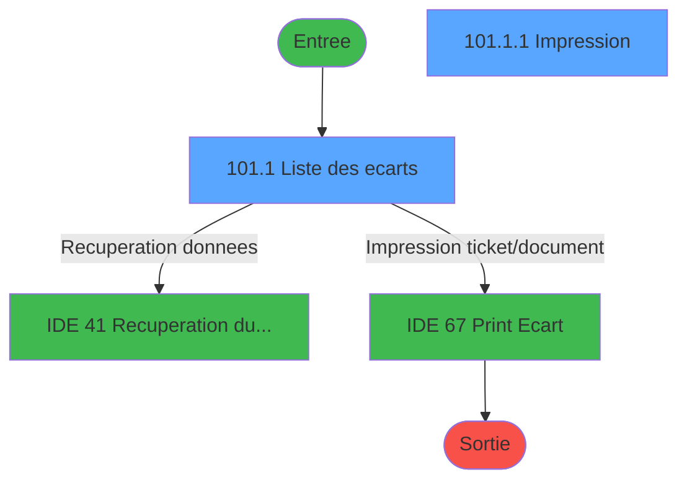
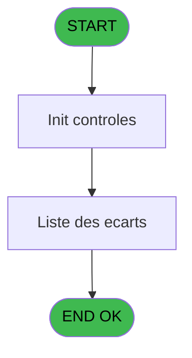
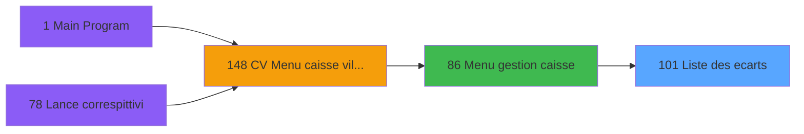
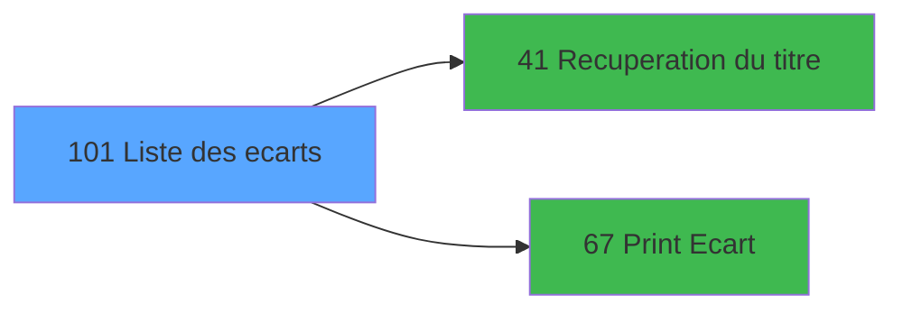

# VIL IDE 101 - Liste des ecarts

> **Analyse**: Phases 1-4 2026-02-03 09:22 -> 09:22 (19s) | Assemblage 09:22
> **Pipeline**: V7.2 Enrichi
> **Structure**: 4 onglets (Resume | Ecrans | Donnees | Connexions)

<!-- TAB:Resume -->

## 1. FICHE D'IDENTITE

| Attribut | Valeur |
|----------|--------|
| Projet | VIL |
| IDE Position | 101 |
| Nom Programme | Liste des ecarts |
| Fichier source | `Prg_101.xml` |
| Domaine metier | General |
| Taches | 4 (2 ecrans visibles) |
| Tables modifiees | 0 |
| Programmes appeles | 2 |

## 2. DESCRIPTION FONCTIONNELLE

**Liste des ecarts** assure la gestion complete de ce processus, accessible depuis [Menu gestion caisse (IDE 86)](VIL-IDE-86.md).

Le flux de traitement s'organise en **1 blocs fonctionnels** :

- **Traitement** (4 taches) : traitements metier divers

Detail : phases du traitement

#### Phase 1 : Traitement (4 taches)

- **101** - Liste des ecarts **[[ECRAN]](#ecran-t1)**
- **101.1** - Liste des ecarts **[[ECRAN]](#ecran-t2)**
- **101.1.1** - Impression **[[ECRAN]](#ecran-t3)**
- **101.1.1.1** - 1er ecart

Delegue a : [Recuperation du titre (IDE 41)](VIL-IDE-41.md)

## 3. BLOCS FONCTIONNELS

### 3.1 Traitement (4 taches)

Traitements internes.

---

#### 101 - Liste des ecarts [[ECRAN]](#ecran-t1)

**Role** : Traitement : Liste des ecarts.
**Ecran** : 640 x 0 DLU (MDI) | [Voir mockup](#ecran-t1)

3 sous-taches directes

| Tache | Nom | Bloc |
|-------|-----|------|
| [101.1](#t2) | Liste des ecarts **[[ECRAN]](#ecran-t2)** | Traitement |
| [101.1.1](#t3) | Impression **[[ECRAN]](#ecran-t3)** | Traitement |
| [101.1.1.1](#t4) | 1er ecart | Traitement |

**Delegue a** : [Recuperation du titre (IDE 41)](VIL-IDE-41.md)

---

#### 101.1 - Liste des ecarts [[ECRAN]](#ecran-t2)

**Role** : Traitement : Liste des ecarts.
**Ecran** : 1259 x 271 DLU (MDI) | [Voir mockup](#ecran-t2)
**Delegue a** : [Recuperation du titre (IDE 41)](VIL-IDE-41.md)

---

#### 101.1.1 - Impression [[ECRAN]](#ecran-t3)

**Role** : Generation du document : Impression.
**Ecran** : 640 x 0 DLU (MDI) | [Voir mockup](#ecran-t3)
**Delegue a** : [Recuperation du titre (IDE 41)](VIL-IDE-41.md)

---

#### 101.1.1.1 - 1er ecart

**Role** : Traitement : 1er ecart.
**Delegue a** : [Recuperation du titre (IDE 41)](VIL-IDE-41.md)

## 5. REGLES METIER

*(Aucune regle metier identifiee)*

## 6. CONTEXTE

- **Appele par**: [Menu gestion caisse (IDE 86)](VIL-IDE-86.md)
- **Appelle**: 2 programmes | **Tables**: 1 (W:0 R:1 L:0) | **Taches**: 4 | **Expressions**: 1

<!-- TAB:Ecrans -->

## 8. ECRANS

### 8.1 Forms visibles (2 / 4)

| # | Position | Tache | Nom | Type | Largeur | Hauteur | Bloc |
|---|----------|-------|-----|------|---------|---------|------|
| 1 | 101.1 | 101.1 | Liste des ecarts | MDI | 1259 | 271 | Traitement |
| 2 | 101.1.1 | 101.1.1 | Impression | MDI | 640 | 0 | Traitement |

### 8.2 Mockups Ecrans

---

#### 101.1 - Liste des ecarts
**Tache** : [101.1](#t2) | **Type** : MDI | **Dimensions** : 1259 x 271 DLU
**Bloc** : Traitement | **Titre IDE** : Liste des ecarts

<!-- FORM-DATA:
{
    "width":  1259,
    "vFactor":  8,
    "type":  "MDI",
    "hFactor":  8,
    "controls":  [
                     {
                         "x":  1,
                         "type":  "label",
                         "var":  "",
                         "y":  2,
                         "w":  1247,
                         "fmt":  "",
                         "name":  "",
                         "h":  18,
                         "color":  "",
                         "text":  "",
                         "parent":  null
                     },
                     {
                         "x":  1,
                         "type":  "table",
                         "var":  "",
                         "name":  "",
                         "titleH":  12,
                         "color":  "110",
                         "w":  1248,
                         "y":  28,
                         "fmt":  "",
                         "parent":  null,
                         "text":  "",
                         "rowH":  13,
                         "h":  208,
                         "cols":  [
                                      {
                                          "title":  "Date",
                                          "layer":  1,
                                          "w":  109
                                      },
                                      {
                                          "title":  "Login",
                                          "layer":  2,
                                          "w":  93
                                      },
                                      {
                                          "title":  "Session",
                                          "layer":  3,
                                          "w":  110
                                      },
                                      {
                                          "title":  "Caisse comptée",
                                          "layer":  4,
                                          "w":  130
                                      },
                                      {
                                          "title":  "Caisse PMS",
                                          "layer":  5,
                                          "w":  119
                                      },
                                      {
                                          "title":  "Montant écart",
                                          "layer":  6,
                                          "w":  124
                                      },
                                      {
                                          "title":  "Commentaire",
                                          "layer":  7,
                                          "w":  263
                                      },
                                      {
                                          "title":  "Où",
                                          "layer":  8,
                                          "w":  131
                                      },
                                      {
                                          "title":  "Date comptable",
                                          "layer":  9,
                                          "w":  135
                                      }
                                  ],
                         "rows":  9
                     },
                     {
                         "x":  1,
                         "type":  "label",
                         "var":  "",
                         "y":  247,
                         "w":  1247,
                         "fmt":  "",
                         "name":  "",
                         "h":  24,
                         "color":  "",
                         "text":  "",
                         "parent":  null
                     },
                     {
                         "x":  1090,
                         "type":  "edit",
                         "var":  "",
                         "y":  42,
                         "w":  108,
                         "fmt":  "",
                         "name":  "",
                         "h":  10,
                         "color":  "110",
                         "text":  "",
                         "parent":  4
                     },
                     {
                         "x":  8,
                         "type":  "edit",
                         "var":  "",
                         "y":  42,
                         "w":  98,
                         "fmt":  "",
                         "name":  "",
                         "h":  10,
                         "color":  "110",
                         "text":  "",
                         "parent":  4
                     },
                     {
                         "x":  117,
                         "type":  "edit",
                         "var":  "",
                         "y":  42,
                         "w":  82,
                         "fmt":  "",
                         "name":  "",
                         "h":  10,
                         "color":  "110",
                         "text":  "",
                         "parent":  4
                     },
                     {
                         "x":  208,
                         "type":  "edit",
                         "var":  "",
                         "y":  42,
                         "w":  101,
                         "fmt":  "12Z",
                         "name":  "",
                         "h":  10,
                         "color":  "110",
                         "text":  "",
                         "parent":  4
                     },
                     {
                         "x":  326,
                         "type":  "edit",
                         "var":  "",
                         "y":  42,
                         "w":  112,
                         "fmt":  "N## ### ### ###.###Z",
                         "name":  "",
                         "h":  10,
                         "color":  "110",
                         "text":  "",
                         "parent":  4
                     },
                     {
                         "x":  450,
                         "type":  "edit",
                         "var":  "",
                         "y":  42,
                         "w":  112,
                         "fmt":  "N## ### ### ###.###Z",
                         "name":  "",
                         "h":  10,
                         "color":  "110",
                         "text":  "",
                         "parent":  4
                     },
                     {
                         "x":  571,
                         "type":  "edit",
                         "var":  "",
                         "y":  42,
                         "w":  112,
                         "fmt":  "N## ### ### ###.###Z",
                         "name":  "",
                         "h":  10,
                         "color":  "110",
                         "text":  "",
                         "parent":  4
                     },
                     {
                         "x":  693,
                         "type":  "edit",
                         "var":  "",
                         "y":  42,
                         "w":  255,
                         "fmt":  "",
                         "name":  "",
                         "h":  10,
                         "color":  "110",
                         "text":  "",
                         "parent":  4
                     },
                     {
                         "x":  1029,
                         "type":  "edit",
                         "var":  "",
                         "y":  7,
                         "w":  216,
                         "fmt":  "WWW  DD MMM YYYYT",
                         "name":  "",
                         "h":  8,
                         "color":  "",
                         "text":  "",
                         "parent":  null
                     },
                     {
                         "x":  957,
                         "type":  "edit",
                         "var":  "",
                         "y":  42,
                         "w":  119,
                         "fmt":  "16",
                         "name":  "",
                         "h":  10,
                         "color":  "110",
                         "text":  "",
                         "parent":  4
                     },
                     {
                         "x":  5,
                         "type":  "button",
                         "var":  "",
                         "y":  250,
                         "w":  154,
                         "fmt":  "Quitter",
                         "name":  "",
                         "h":  18,
                         "color":  "",
                         "text":  "",
                         "parent":  null
                     },
                     {
                         "x":  359,
                         "type":  "button",
                         "var":  "",
                         "y":  250,
                         "w":  154,
                         "fmt":  "Réception",
                         "name":  "CAISSE",
                         "h":  18,
                         "color":  "",
                         "text":  "",
                         "parent":  null
                     },
                     {
                         "x":  547,
                         "type":  "button",
                         "var":  "",
                         "y":  250,
                         "w":  154,
                         "fmt":  "Coffre",
                         "name":  "COFFRE",
                         "h":  18,
                         "color":  "",
                         "text":  "",
                         "parent":  null
                     },
                     {
                         "x":  735,
                         "type":  "button",
                         "var":  "",
                         "y":  250,
                         "w":  154,
                         "fmt":  "Tous",
                         "name":  "TOUS",
                         "h":  18,
                         "color":  "",
                         "text":  "",
                         "parent":  null
                     },
                     {
                         "x":  1091,
                         "type":  "button",
                         "var":  "",
                         "y":  250,
                         "w":  154,
                         "fmt":  "\u0026Impression",
                         "name":  "",
                         "h":  18,
                         "color":  "",
                         "text":  "",
                         "parent":  null
                     },
                     {
                         "x":  5,
                         "type":  "edit",
                         "var":  "",
                         "y":  7,
                         "w":  267,
                         "fmt":  "30",
                         "name":  "",
                         "h":  8,
                         "color":  "",
                         "text":  "",
                         "parent":  null
                     }
                 ],
    "taskId":  "101.1",
    "height":  271
}
-->

<strong>Champs : 11 champs</strong>

| Pos (x,y) | Nom | Variable | Type |
|-----------|-----|----------|------|
| 1090,42 | (sans nom) | - | edit |
| 8,42 | (sans nom) | - | edit |
| 117,42 | (sans nom) | - | edit |
| 208,42 | 12Z | - | edit |
| 326,42 | N## ### ### ###.###Z | - | edit |
| 450,42 | N## ### ### ###.###Z | - | edit |
| 571,42 | N## ### ### ###.###Z | - | edit |
| 693,42 | (sans nom) | - | edit |
| 1029,7 | WWW  DD MMM YYYYT | - | edit |
| 957,42 | 16 | - | edit |
| 5,7 | 30 | - | edit |

<strong>Boutons : 5 boutons</strong>

| Bouton | Pos (x,y) | Action |
|--------|-----------|--------|
| Quitter | 5,250 | Quitte le programme |
| Réception | 359,250 | Bouton fonctionnel |
| Coffre | 547,250 | Bouton fonctionnel |
| Tous | 735,250 | Bouton fonctionnel |
| Impression | 1091,250 | Bouton fonctionnel |

---

#### 101.1.1 - Impression
**Tache** : [101.1.1](#t3) | **Type** : MDI | **Dimensions** : 640 x 0 DLU
**Bloc** : Traitement | **Titre IDE** : Impression

<!-- FORM-DATA:
{
    "width":  640,
    "vFactor":  8,
    "type":  "MDI",
    "hFactor":  8,
    "controls":  [
                     {
                         "x":  0,
                         "type":  "label",
                         "var":  "",
                         "y":  1,
                         "w":  640,
                         "fmt":  "",
                         "name":  "",
                         "h":  18,
                         "color":  "",
                         "text":  "",
                         "parent":  null
                     },
                     {
                         "x":  27,
                         "type":  "label",
                         "var":  "",
                         "y":  26,
                         "w":  586,
                         "fmt":  "",
                         "name":  "",
                         "h":  139,
                         "color":  "",
                         "text":  "",
                         "parent":  null
                     },
                     {
                         "x":  236,
                         "type":  "label",
                         "var":  "",
                         "y":  41,
                         "w":  317,
                         "fmt":  "",
                         "name":  "",
                         "h":  47,
                         "color":  "",
                         "text":  "",
                         "parent":  null
                     },
                     {
                         "x":  236,
                         "type":  "label",
                         "var":  "",
                         "y":  104,
                         "w":  317,
                         "fmt":  "",
                         "name":  "",
                         "h":  42,
                         "color":  "",
                         "text":  "",
                         "parent":  null
                     },
                     {
                         "x":  278,
                         "type":  "label",
                         "var":  "",
                         "y":  112,
                         "w":  93,
                         "fmt":  "",
                         "name":  "",
                         "h":  8,
                         "color":  "",
                         "text":  "Date début",
                         "parent":  null
                     },
                     {
                         "x":  278,
                         "type":  "label",
                         "var":  "",
                         "y":  131,
                         "w":  93,
                         "fmt":  "",
                         "name":  "",
                         "h":  8,
                         "color":  "",
                         "text":  "Date fin",
                         "parent":  null
                     },
                     {
                         "x":  0,
                         "type":  "label",
                         "var":  "",
                         "y":  176,
                         "w":  640,
                         "fmt":  "",
                         "name":  "",
                         "h":  24,
                         "color":  "",
                         "text":  "",
                         "parent":  null
                     },
                     {
                         "x":  291,
                         "type":  "checkbox",
                         "var":  "",
                         "y":  51,
                         "w":  200,
                         "fmt":  "",
                         "name":  "",
                         "h":  12,
                         "color":  "",
                         "text":  " Date comptable",
                         "parent":  null
                     },
                     {
                         "x":  291,
                         "type":  "checkbox",
                         "var":  "",
                         "y":  70,
                         "w":  200,
                         "fmt":  "",
                         "name":  "",
                         "h":  12,
                         "color":  "",
                         "text":  " Date génération",
                         "parent":  null
                     },
                     {
                         "x":  87,
                         "type":  "radio",
                         "var":  "",
                         "y":  104,
                         "w":  134,
                         "fmt":  "",
                         "name":  "",
                         "h":  42,
                         "color":  "",
                         "text":  "Tous,Réception,Coffre",
                         "parent":  null
                     },
                     {
                         "x":  384,
                         "type":  "edit",
                         "var":  "",
                         "y":  112,
                         "w":  126,
                         "fmt":  "",
                         "name":  "",
                         "h":  10,
                         "color":  "6",
                         "text":  "",
                         "parent":  null
                     },
                     {
                         "x":  384,
                         "type":  "edit",
                         "var":  "",
                         "y":  131,
                         "w":  126,
                         "fmt":  "",
                         "name":  "",
                         "h":  10,
                         "color":  "6",
                         "text":  "",
                         "parent":  null
                     },
                     {
                         "x":  412,
                         "type":  "edit",
                         "var":  "",
                         "y":  6,
                         "w":  216,
                         "fmt":  "WWW  DD MMM YYYYT",
                         "name":  "",
                         "h":  8,
                         "color":  "",
                         "text":  "",
                         "parent":  null
                     },
                     {
                         "x":  4,
                         "type":  "button",
                         "var":  "",
                         "y":  179,
                         "w":  154,
                         "fmt":  "\u0026Abandon",
                         "name":  "",
                         "h":  18,
                         "color":  "",
                         "text":  "",
                         "parent":  null
                     },
                     {
                         "x":  479,
                         "type":  "button",
                         "var":  "",
                         "y":  179,
                         "w":  154,
                         "fmt":  "\u0026Validation",
                         "name":  "",
                         "h":  18,
                         "color":  "",
                         "text":  "",
                         "parent":  null
                     },
                     {
                         "x":  6,
                         "type":  "edit",
                         "var":  "",
                         "y":  6,
                         "w":  267,
                         "fmt":  "30",
                         "name":  "",
                         "h":  8,
                         "color":  "",
                         "text":  "",
                         "parent":  null
                     }
                 ],
    "taskId":  "101.1.1",
    "height":  0
}
-->

<strong>Champs : 6 champs</strong>

| Pos (x,y) | Nom | Variable | Type |
|-----------|-----|----------|------|
| 291,51 |  Date comptable | - | checkbox |
| 291,70 |  Date génération | - | checkbox |
| 384,112 | (sans nom) | - | edit |
| 384,131 | (sans nom) | - | edit |
| 412,6 | WWW  DD MMM YYYYT | - | edit |
| 6,6 | 30 | - | edit |

<strong>Boutons : 2 boutons</strong>

| Bouton | Pos (x,y) | Action |
|--------|-----------|--------|
| Abandon | 4,179 | Annule et retour au menu |
| Validation | 479,179 | Valide la saisie et enregistre |

## 9. NAVIGATION

### 9.1 Enchainement des ecrans

**Detail par enchainement :**

| Depuis | Action | Vers | Retour |
|--------|--------|------|--------|
| Liste des ecarts | Recuperation donnees | [Recuperation du titre (IDE 41)](VIL-IDE-41.md) | Retour ecran |
| Liste des ecarts | Impression ticket/document | [Print Ecart (IDE 67)](VIL-IDE-67.md) | Retour ecran |

### 9.3 Structure hierarchique (4 taches)

| Position | Tache | Type | Dimensions | Bloc |
|----------|-------|------|------------|------|
| **101.1** | [**Liste des ecarts** (101)](#t1) [mockup](#ecran-t1) | MDI | 640x0 | Traitement |
| 101.1.1 | [Liste des ecarts (101.1)](#t2) [mockup](#ecran-t2) | MDI | 1259x271 | |
| 101.1.2 | [Impression (101.1.1)](#t3) [mockup](#ecran-t3) | MDI | 640x0 | |
| 101.1.3 | [1er ecart (101.1.1.1)](#t4) | MDI | - | |

### 9.4 Algorigramme

> **Legende**: Vert = START/END OK | Rouge = END KO | Bleu = Decisions
> *Algorigramme auto-genere. Utiliser `/algorigramme` pour une synthese metier detaillee.*

<!-- TAB:Donnees -->

## 10. TABLES

### Tables utilisees (1)

| ID | Nom | Description | Type | R | W | L | Usages |
|----|-----|-------------|------|---|---|---|--------|
| 234 | ecarts |  | DB | R |   |   | 2 |

### Colonnes par table (0 / 1 tables avec colonnes identifiees)

Table 234 - ecarts (R) - 2 usages

*Table utilisee uniquement en Link ou aucune colonne Real identifiee dans le DataView.*

## 11. VARIABLES

### 11.1 Autres (6)

Variables diverses.

| Lettre | Nom | Type | Usage dans |
|--------|-----|------|-----------|
| A | Param societe | Alpha | - |
| B | Param date comptable | Date | - |
| C | Param masque | Alpha | - |
| D | Param nom village | Alpha | - |
| E | Code selection | Numeric | - |
| F | FIN | Logical | 1x refs |

## 12. EXPRESSIONS

**1 / 1 expressions decodees (100%)**

### 12.1 Repartition par type

| Type | Expressions | Regles |
|------|-------------|--------|
| OTHER | 1 | 0 |

### 12.2 Expressions cles par type

#### OTHER (1 expressions)

| Type | IDE | Expression | Regle |
|------|-----|------------|-------|
| OTHER | 1 | `FIN [F]` | - |

<!-- TAB:Connexions -->

## 13. GRAPHE D'APPELS

### 13.1 Chaine depuis Main (Callers)

Main -> ... -> [Menu gestion caisse (IDE 86)](VIL-IDE-86.md) -> **Liste des ecarts (IDE 101)**

### 13.2 Callers

| IDE | Nom Programme | Nb Appels |
|-----|---------------|-----------|
| [86](VIL-IDE-86.md) | Menu gestion caisse | 1 |

### 13.3 Callees (programmes appeles)

### 13.4 Detail Callees avec contexte

| IDE | Nom Programme | Appels | Contexte |
|-----|---------------|--------|----------|
| [41](VIL-IDE-41.md) | Recuperation du titre | 1 | Recuperation donnees |
| [67](VIL-IDE-67.md) | Print Ecart | 1 | Impression ticket/document |

## 14. RECOMMANDATIONS MIGRATION

### 14.1 Profil du programme

| Metrique | Valeur | Impact migration |
|----------|--------|-----------------|
| Lignes de logique | 58 | Programme compact |
| Expressions | 1 | Peu de logique |
| Tables WRITE | 0 | Impact faible |
| Sous-programmes | 2 | Peu de dependances |
| Ecrans visibles | 2 | Quelques ecrans |
| Code desactive | 0% (0 / 58) | Code sain |
| Regles metier | 0 | Pas de regle identifiee |

### 14.2 Plan de migration par bloc

#### Traitement (4 taches: 3 ecrans, 1 traitement)

- **Strategie** : Orchestrateur avec 3 ecrans (Razor/React) et 1 traitements backend (services).
- Les ecrans deviennent des composants UI, les traitements invisibles deviennent des services injectables.
- 2 sous-programme(s) a migrer ou a reutiliser depuis les services existants.
- Decomposer les taches en services unitaires testables.

### 14.3 Dependances critiques

| Dependance | Type | Appels | Impact |
|------------|------|--------|--------|
| [Print Ecart (IDE 67)](VIL-IDE-67.md) | Sous-programme | 1x | Normale - Impression ticket/document |
| [Recuperation du titre (IDE 41)](VIL-IDE-41.md) | Sous-programme | 1x | Normale - Recuperation donnees |

---
*Spec DETAILED generee par Pipeline V7.2 - 2026-02-03 09:22*
