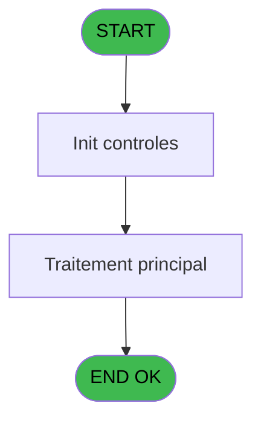
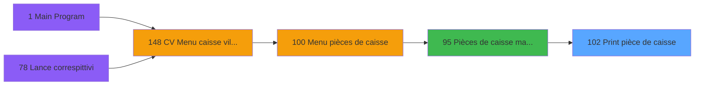

# VIL IDE 102 - Print pièce de caisse

> **Analyse**: Phases 1-4 2026-02-03 09:22 -> 09:23 (20s) | Assemblage 09:23
> **Pipeline**: V7.2 Enrichi
> **Structure**: 4 onglets (Resume | Ecrans | Donnees | Connexions)

<!-- TAB:Resume -->

## 1. FICHE D'IDENTITE

| Attribut | Valeur |
|----------|--------|
| Projet | VIL |
| IDE Position | 102 |
| Nom Programme | Print pièce de caisse |
| Fichier source | `Prg_102.xml` |
| Domaine metier | Caisse |
| Taches | 1 (0 ecrans visibles) |
| Tables modifiees | 0 |
| Programmes appeles | 1 |

## 2. DESCRIPTION FONCTIONNELLE

**Print pièce de caisse** assure la gestion complete de ce processus, accessible depuis [Pièces de caisse manuelles (IDE 95)](VIL-IDE-95.md).

Le flux de traitement s'organise en **1 blocs fonctionnels** :

- **Traitement** (1 tache) : traitements metier divers

**Logique metier** : 5 regles identifiees couvrant conditions metier, valeurs par defaut.

## 3. BLOCS FONCTIONNELS

### 3.1 Traitement (1 tache)

Traitements internes.

---

#### 102 - Veuillez patienter.... [[ECRAN]](#ecran-t1)

**Role** : Traitement : Veuillez patienter.....
**Ecran** : 427 x 56 DLU (MDI) | [Voir mockup](#ecran-t1)

## 5. REGLES METIER

5 regles identifiees:

### Autres (5 regles)

#### [RM-001] Si [J]='A' alors 'ANNULATION' sinon '')

| Element | Detail |
|---------|--------|
| **Condition** | `[J]='A'` |
| **Si vrai** | 'ANNULATION' |
| **Si faux** | '') |
| **Expression source** | Expression 5 : `IF ([J]='A','ANNULATION','')` |
| **Exemple** | Si [J]='A' → 'ANNULATION'. Sinon → '') |

#### [RM-002] Valeur par defaut si [W] est vide

| Element | Detail |
|---------|--------|
| **Condition** | `[W]=''` |
| **Si vrai** | [P] |
| **Si faux** | [W]) |
| **Expression source** | Expression 9 : `IF ([W]='',[P],[W])` |
| **Exemple** | Si [W]='' → [P]. Sinon → [W]) |

#### [RM-003] Si [O]='R' alors 'RECETTE' sinon 'DEPENSE')

| Element | Detail |
|---------|--------|
| **Condition** | `[O]='R'` |
| **Si vrai** | 'RECETTE' |
| **Si faux** | 'DEPENSE') |
| **Expression source** | Expression 10 : `IF ([O]='R','RECETTE','DEPENSE')` |
| **Exemple** | Si [O]='R' → 'RECETTE'. Sinon → 'DEPENSE') |

#### [RM-004] Si GetParam ('CODELANGUE')='FRA' alors [AF] sinon [AG])

| Element | Detail |
|---------|--------|
| **Condition** | `GetParam ('CODELANGUE')='FRA'` |
| **Si vrai** | [AF] |
| **Si faux** | [AG]) |
| **Expression source** | Expression 14 : `IF (GetParam ('CODELANGUE')='FRA',[AF],[AG])` |
| **Exemple** | Si GetParam ('CODELANGUE')='FRA' → [AF]. Sinon → [AG]) |

#### [RM-005] Si [O]='D' alors [Q] sinon 0)

| Element | Detail |
|---------|--------|
| **Condition** | `[O]='D'` |
| **Si vrai** | [Q] |
| **Si faux** | 0) |
| **Expression source** | Expression 15 : `IF ([O]='D',[Q],0)` |
| **Exemple** | Si [O]='D' → [Q]. Sinon → 0) |

## 6. CONTEXTE

- **Appele par**: [Pièces de caisse manuelles (IDE 95)](VIL-IDE-95.md)
- **Appelle**: 1 programmes | **Tables**: 5 (W:0 R:1 L:4) | **Taches**: 1 | **Expressions**: 28

<!-- TAB:Ecrans -->

## 8. ECRANS

*(Programme sans ecran visible)*

## 9. NAVIGATION

### 9.3 Structure hierarchique (1 tache)

| Position | Tache | Type | Dimensions | Bloc |
|----------|-------|------|------------|------|
| **102.1** | [**Veuillez patienter....** (102)](#t1) [mockup](#ecran-t1) | MDI | 427x56 | Traitement |

### 9.4 Algorigramme

> **Legende**: Vert = START/END OK | Rouge = END KO | Bleu = Decisions
> *Algorigramme auto-genere. Utiliser `/algorigramme` pour une synthese metier detaillee.*

<!-- TAB:Donnees -->

## 10. TABLES

### Tables utilisees (5)

| ID | Nom | Description | Type | R | W | L | Usages |
|----|-----|-------------|------|---|---|---|--------|
| 27 | donnees_village__dvi |  | DB | R |   |   | 1 |
| 54 | pieces_caisse____pks | Sessions de caisse | DB |   |   | L | 1 |
| 69 | initialisation___ini |  | DB |   |   | L | 1 |
| 209 | plan_comptable_central |  | DB |   |   | L | 1 |
| 224 | complement_pieces_de_caisse | Sessions de caisse | DB |   |   | L | 1 |

### Colonnes par table (1 / 1 tables avec colonnes identifiees)

Table 27 - donnees_village__dvi (R) - 1 usages

| Lettre | Variable | Acces | Type |
|--------|----------|-------|------|
| A | P0 societe | R | Alpha |
| B | P0 numero pièce | R | Numeric |
| C | P0 devise locale | R | Alpha |
| D | P0 masque mtt | R | Alpha |
| E | P0 nom village | R | Alpha |
| F | W0 config imp | R | Alpha |
| G | W0 libelle montant | R | Alpha |

## 11. VARIABLES

### 11.1 Parametres entrants (5)

Variables recues du programme appelant ([Pièces de caisse manuelles (IDE 95)](VIL-IDE-95.md)).

| Lettre | Nom | Type | Usage dans |
|--------|-----|------|-----------|
| A | P0 societe | Alpha | 1x parametre entrant |
| B | P0 numero pièce | Numeric | 1x parametre entrant |
| C | P0 devise locale | Alpha | 1x parametre entrant |
| D | P0 masque mtt | Alpha | 1x parametre entrant |
| E | P0 nom village | Alpha | - |

### 11.2 Variables de travail (2)

Variables internes au programme.

| Lettre | Nom | Type | Usage dans |
|--------|-----|------|-----------|
| F | W0 config imp | Alpha | - |
| G | W0 libelle montant | Alpha | - |

## 12. EXPRESSIONS

**28 / 28 expressions decodees (100%)**

### 12.1 Repartition par type

| Type | Expressions | Regles |
|------|-------------|--------|
| CONCATENATION | 1 | 0 |
| CONDITION | 11 | 5 |
| FORMAT | 1 | 0 |
| CONSTANTE | 4 | 0 |
| OTHER | 9 | 0 |
| STRING | 2 | 0 |

### 12.2 Expressions cles par type

#### CONCATENATION (1 expressions)

| Type | IDE | Expression | Regle |
|------|-----|------------|-------|
| CONCATENATION | 11 | `MID (Str ([N],'9P0'),1,3)&' '&MID (Str ([N],'9'),4,3)&' / '&MID (Str ([N],'9'),7,3)` | - |

#### CONDITION (11 expressions)

| Type | IDE | Expression | Regle |
|------|-----|------------|-------|
| CONDITION | 9 | `IF ([W]='',[P],[W])` | [RM-002](#rm-RM-002) |
| CONDITION | 10 | `IF ([O]='R','RECETTE','DEPENSE')` | [RM-003](#rm-RM-003) |
| CONDITION | 15 | `IF ([O]='D',[Q],0)` | [RM-005](#rm-RM-005) |
| CONDITION | 14 | `IF (GetParam ('CODELANGUE')='FRA',[AF],[AG])` | [RM-004](#rm-RM-004) |
| CONDITION | 5 | `IF ([J]='A','ANNULATION','')` | [RM-001](#rm-RM-001) |
| ... | | *+6 autres* | |

#### FORMAT (1 expressions)

| Type | IDE | Expression | Regle |
|------|-----|------------|-------|
| FORMAT | 27 | `StrBuild(MlsTrans('Pièce de caisse autorisée par RFS pour un montant de + de @1@'),Str(VG64,'')&' '&Trim(VG65))` | - |

#### CONSTANTE (4 expressions)

| Type | IDE | Expression | Regle |
|------|-----|------------|-------|
| CONSTANTE | 21 | `'euro'` | - |
| CONSTANTE | 22 | `'centime'` | - |
| CONSTANTE | 7 | `'* AUT'` | - |
| CONSTANTE | 8 | `1` | - |

#### OTHER (9 expressions)

| Type | IDE | Expression | Regle |
|------|-----|------------|-------|
| OTHER | 19 | `ABS ([Q])` | - |
| OTHER | 18 | `[Q]` | - |
| OTHER | 28 | `[BO]` | - |
| OTHER | 20 | `GetParam ('CODELANGUE')` | - |
| OTHER | 17 | `P0 masque mtt [D]` | - |
| ... | | *+4 autres* | |

#### STRING (2 expressions)

| Type | IDE | Expression | Regle |
|------|-----|------------|-------|
| STRING | 13 | `Val (MID (Str ([N],'9'),7,3),'3')` | - |
| STRING | 12 | `Val (MID (Str ([N],'9'),1,6),'6')` | - |

### 12.3 Toutes les expressions (28)

Voir les 28 expressions

#### CONCATENATION (1)

| IDE | Expression Decodee |
|-----|-------------------|
| 11 | `MID (Str ([N],'9P0'),1,3)&' '&MID (Str ([N],'9'),4,3)&' / '&MID (Str ([N],'9'),7,3)` |

#### CONDITION (11)

| IDE | Expression Decodee |
|-----|-------------------|
| 23 | `[R]='PDC-AUTO'` |
| 24 | `[R]<>'PDC-AUTO'` |
| 5 | `IF ([J]='A','ANNULATION','')` |
| 9 | `IF ([W]='',[P],[W])` |
| 10 | `IF ([O]='R','RECETTE','DEPENSE')` |
| 14 | `IF (GetParam ('CODELANGUE')='FRA',[AF],[AG])` |
| 15 | `IF ([O]='D',[Q],0)` |
| 16 | `IF ([O]='R',[Q],0)` |
| 1 | `INIGet ('[MAGIC_LOGICAL_NAMES]preview')='O'` |
| 25 | `GetParam ('CODELANGUE')='FRA'` |
| 26 | `P0 devise locale [C]='EUR'` |

#### FORMAT (1)

| IDE | Expression Decodee |
|-----|-------------------|
| 27 | `StrBuild(MlsTrans('Pièce de caisse autorisée par RFS pour un montant de + de @1@'),Str(VG64,'')&' '&Trim(VG65))` |

#### CONSTANTE (4)

| IDE | Expression Decodee |
|-----|-------------------|
| 7 | `'* AUT'` |
| 8 | `1` |
| 21 | `'euro'` |
| 22 | `'centime'` |

#### OTHER (9)

| IDE | Expression Decodee |
|-----|-------------------|
| 2 | `SetCrsr (1)` |
| 3 | `SetCrsr (2)` |
| 4 | `P0 societe [A]` |
| 6 | `P0 numero pièce [B]` |
| 17 | `P0 masque mtt [D]` |
| 18 | `[Q]` |
| 19 | `ABS ([Q])` |
| 20 | `GetParam ('CODELANGUE')` |
| 28 | `[BO]` |

#### STRING (2)

| IDE | Expression Decodee |
|-----|-------------------|
| 12 | `Val (MID (Str ([N],'9'),1,6),'6')` |
| 13 | `Val (MID (Str ([N],'9'),7,3),'3')` |

<!-- TAB:Connexions -->

## 13. GRAPHE D'APPELS

### 13.1 Chaine depuis Main (Callers)

Main -> ... -> [Pièces de caisse manuelles (IDE 95)](VIL-IDE-95.md) -> **Print pièce de caisse (IDE 102)**

### 13.2 Callers

| IDE | Nom Programme | Nb Appels |
|-----|---------------|-----------|
| [95](VIL-IDE-95.md) | Pièces de caisse manuelles | 1 |

### 13.3 Callees (programmes appeles)

### 13.4 Detail Callees avec contexte

| IDE | Nom Programme | Appels | Contexte |
|-----|---------------|--------|----------|
| [112](VIL-IDE-112.md) | Calcul libelle du montant | 1 | Calcul de donnees |

## 14. RECOMMANDATIONS MIGRATION

### 14.1 Profil du programme

| Metrique | Valeur | Impact migration |
|----------|--------|-----------------|
| Lignes de logique | 54 | Programme compact |
| Expressions | 28 | Peu de logique |
| Tables WRITE | 0 | Impact faible |
| Sous-programmes | 1 | Peu de dependances |
| Ecrans visibles | 0 | Ecran unique ou traitement batch |
| Code desactive | 0% (0 / 54) | Code sain |
| Regles metier | 5 | Quelques regles a preserver |

### 14.2 Plan de migration par bloc

#### Traitement (1 tache: 1 ecran, 0 traitement)

- **Strategie** : 1 composant(s) UI (Razor/React) avec formulaires et validation.
- 1 sous-programme(s) a migrer ou a reutiliser depuis les services existants.
- Decomposer les taches en services unitaires testables.

### 14.3 Dependances critiques

| Dependance | Type | Appels | Impact |
|------------|------|--------|--------|
| [Calcul libelle du montant (IDE 112)](VIL-IDE-112.md) | Sous-programme | 1x | Normale - Calcul de donnees |

---
*Spec DETAILED generee par Pipeline V7.2 - 2026-02-03 09:23*
