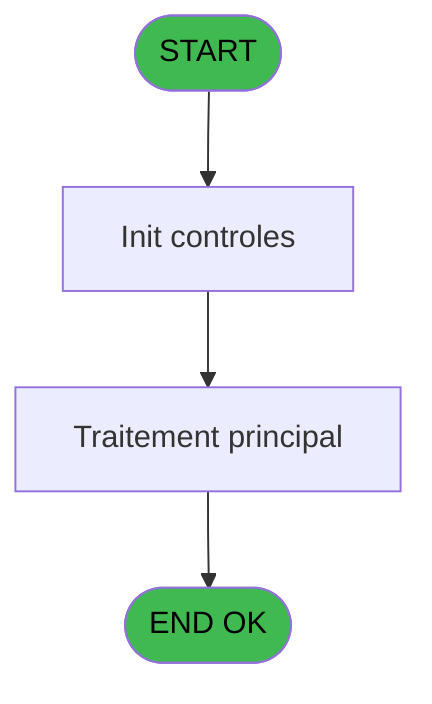
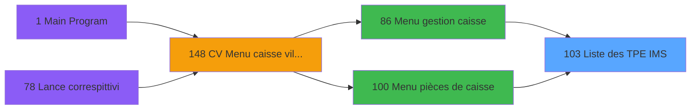

# VIL IDE 103 - Liste des TPE IMS

> **Analyse**: Phases 1-4 2026-02-03 09:23 -> 09:23 (21s) | Assemblage 09:23
> **Pipeline**: V7.2 Enrichi
> **Structure**: 4 onglets (Resume | Ecrans | Donnees | Connexions)

<!-- TAB:Resume -->

## 1. FICHE D'IDENTITE

| Attribut | Valeur |
|----------|--------|
| Projet | VIL |
| IDE Position | 103 |
| Nom Programme | Liste des TPE IMS |
| Fichier source | `Prg_103.xml` |
| Domaine metier | General |
| Taches | 3 (0 ecrans visibles) |
| Tables modifiees | 0 |
| Programmes appeles | 0 |

## 2. DESCRIPTION FONCTIONNELLE

**Liste des TPE IMS** assure la gestion complete de ce processus, accessible depuis [Menu gestion caisse (IDE 86)](VIL-IDE-86.md), [Menu pièces de caisse (IDE 100)](VIL-IDE-100.md).

Le flux de traitement s'organise en **2 blocs fonctionnels** :

- **Saisie** (2 taches) : ecrans de saisie utilisateur (formulaires, champs, donnees)
- **Traitement** (1 tache) : traitements metier divers

**Logique metier** : 2 regles identifiees couvrant conditions metier.

Detail : phases du traitement

#### Phase 1 : Saisie (2 taches)

- **103** - Liste des transactions **[[ECRAN]](#ecran-t1)**
- **103.1.1** - Lecture saisie TPE

#### Phase 2 : Traitement (1 tache)

- **103.1** - Lecture des TPE

## 3. BLOCS FONCTIONNELS

### 3.1 Saisie (2 taches)

L'operateur saisit les donnees de la transaction via 1 ecran (Liste des transactions).

---

#### 103 - Liste des transactions [[ECRAN]](#ecran-t1)

**Role** : Saisie des donnees : Liste des transactions.
**Ecran** : 422 x 56 DLU (MDI) | [Voir mockup](#ecran-t1)
**Variables liees** : D (param total des transactions)

---

#### 103.1.1 - Lecture saisie TPE

**Role** : Saisie des donnees : Lecture saisie TPE.

### 3.2 Traitement (1 tache)

Traitements internes.

---

#### 103.1 - Lecture des TPE

**Role** : Traitement : Lecture des TPE.

## 5. REGLES METIER

2 regles identifiees:

### Autres (2 regles)

#### [RM-001] Si param total des transa... [D]<0 alors param total des transa... [D] sinon 0)

| Element | Detail |
|---------|--------|
| **Condition** | `param total des transa... [D]<0` |
| **Si vrai** | param total des transa... [D] |
| **Si faux** | 0) |
| **Expression source** | Expression 5 : `IF (param total des transa... [D]<0,param total des transa..` |
| **Exemple** | Si param total des transa... [D]<0 → param total des transa... [D]. Sinon → 0) |

#### [RM-002] Traitement conditionnel si param total des transa... [D]> est a zero

| Element | Detail |
|---------|--------|
| **Condition** | `param total des transa... [D]>=0` |
| **Si vrai** | param total des transa... [D] |
| **Si faux** | 0) |
| **Expression source** | Expression 6 : `IF (param total des transa... [D]>=0,param total des transa.` |
| **Exemple** | Si param total des transa... [D]>=0 → param total des transa... [D]. Sinon → 0) |

## 6. CONTEXTE

- **Appele par**: [Menu gestion caisse (IDE 86)](VIL-IDE-86.md), [Menu pièces de caisse (IDE 100)](VIL-IDE-100.md)
- **Appelle**: 0 programmes | **Tables**: 2 (W:0 R:2 L:0) | **Taches**: 3 | **Expressions**: 8

<!-- TAB:Ecrans -->

## 8. ECRANS

*(Programme sans ecran visible)*

## 9. NAVIGATION

### 9.3 Structure hierarchique (3 taches)

| Position | Tache | Type | Dimensions | Bloc |
|----------|-------|------|------------|------|
| **103.1** | [**Liste des transactions** (103)](#t1) [mockup](#ecran-t1) | MDI | 422x56 | Saisie |
| 103.1.1 | [Lecture saisie TPE (103.1.1)](#t3) | MDI | - | |
| **103.2** | [**Lecture des TPE** (103.1)](#t2) | MDI | - | Traitement |

### 9.4 Algorigramme

> **Legende**: Vert = START/END OK | Rouge = END KO | Bleu = Decisions
> *Algorigramme auto-genere. Utiliser `/algorigramme` pour une synthese metier detaillee.*

<!-- TAB:Donnees -->

## 10. TABLES

### Tables utilisees (2)

| ID | Nom | Description | Type | R | W | L | Usages |
|----|-----|-------------|------|---|---|---|--------|
| 259 | tpe_par_service | Services / filieres | DB | R |   |   | 1 |
| 260 | tickets_tpe |  | DB | R |   |   | 1 |

### Colonnes par table (0 / 2 tables avec colonnes identifiees)

Table 259 - tpe_par_service (R) - 1 usages

*Table utilisee uniquement en Link ou aucune colonne Real identifiee dans le DataView.*

Table 260 - tickets_tpe (R) - 1 usages

*Table utilisee uniquement en Link ou aucune colonne Real identifiee dans le DataView.*

## 11. VARIABLES

### 11.1 Variables de session (2)

Variables persistantes pendant toute la session.

| Lettre | Nom | Type | Usage dans |
|--------|-----|------|-----------|
| I | v masqueEdition | Alpha | 1x session |
| J | v total par type de vente | Numeric | - |

### 11.2 Autres (8)

Variables diverses.

| Lettre | Nom | Type | Usage dans |
|--------|-----|------|-----------|
| A | param societe | Alpha | - |
| B | param masque cumul | Alpha | - |
| C | param date comptable | Date | - |
| D | param total des transactions | Numeric | - |
| E | param devise | Alpha | - |
| F | param nom village | Alpha | - |
| G | param user | Alpha | - |
| H | param terminal IMS | Numeric | 2x refs |

## 12. EXPRESSIONS

**8 / 8 expressions decodees (100%)**

### 12.1 Repartition par type

| Type | Expressions | Regles |
|------|-------------|--------|
| CONCATENATION | 2 | 0 |
| CONDITION | 5 | 2 |
| OTHER | 1 | 0 |

### 12.2 Expressions cles par type

#### CONCATENATION (2 expressions)

| Type | IDE | Expression | Regle |
|------|-----|------------|-------|
| CONCATENATION | 1 | `DStr (Date (),'DD/MM/YYYY')&' - '&TStr (Time (),'HH:MM:SS')` | - |
| CONCATENATION | 3 | `'- '&Str (Page (0,1),'3P0Z0')&' -'` | - |

#### CONDITION (5 expressions)

| Type | IDE | Expression | Regle |
|------|-----|------------|-------|
| CONDITION | 6 | `IF (param total des transa... [D]>=0,param total des transa... [D],0)` | [RM-002](#rm-RM-002) |
| CONDITION | 5 | `IF (param total des transa... [D]<0,param total des transa... [D],0)` | [RM-001](#rm-RM-001) |
| CONDITION | 7 | `'Terminal IMS = '&Str (param terminal IMS [H],'3P0')` | - |
| CONDITION | 8 | `param terminal IMS [H]<>0` | - |
| CONDITION | 2 | `INIGet ('[MAGIC_LOGICAL_NAMES]preview')='O'` | - |

#### OTHER (1 expressions)

| Type | IDE | Expression | Regle |
|------|-----|------------|-------|
| OTHER | 4 | `v masqueEdition [I]` | - |

<!-- TAB:Connexions -->

## 13. GRAPHE D'APPELS

### 13.1 Chaine depuis Main (Callers)

Main -> ... -> [Menu gestion caisse (IDE 86)](VIL-IDE-86.md) -> **Liste des TPE IMS (IDE 103)**

Main -> ... -> [Menu pièces de caisse (IDE 100)](VIL-IDE-100.md) -> **Liste des TPE IMS (IDE 103)**

### 13.2 Callers

| IDE | Nom Programme | Nb Appels |
|-----|---------------|-----------|
| [86](VIL-IDE-86.md) | Menu gestion caisse | 1 |
| [100](VIL-IDE-100.md) | Menu pièces de caisse | 1 |

### 13.3 Callees (programmes appeles)

### 13.4 Detail Callees avec contexte

| IDE | Nom Programme | Appels | Contexte |
|-----|---------------|--------|----------|
| - | (aucun) | - | - |

## 14. RECOMMANDATIONS MIGRATION

### 14.1 Profil du programme

| Metrique | Valeur | Impact migration |
|----------|--------|-----------------|
| Lignes de logique | 27 | Programme compact |
| Expressions | 8 | Peu de logique |
| Tables WRITE | 0 | Impact faible |
| Sous-programmes | 0 | Peu de dependances |
| Ecrans visibles | 0 | Ecran unique ou traitement batch |
| Code desactive | 0% (0 / 27) | Code sain |
| Regles metier | 2 | Quelques regles a preserver |

### 14.2 Plan de migration par bloc

#### Saisie (2 taches: 1 ecran, 1 traitement)

- **Strategie** : Formulaire React/Blazor avec validation Zod/FluentValidation.
- Reproduire 1 ecran : Liste des transactions
- Validation temps reel cote client + serveur

#### Traitement (1 tache: 0 ecran, 1 traitement)

- **Strategie** : 1 service(s) backend injectable(s) (Domain Services).
- Decomposer les taches en services unitaires testables.

### 14.3 Dependances critiques

| Dependance | Type | Appels | Impact |
|------------|------|--------|--------|

---
*Spec DETAILED generee par Pipeline V7.2 - 2026-02-03 09:23*
