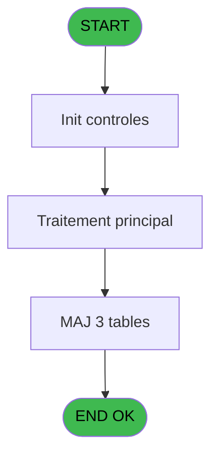
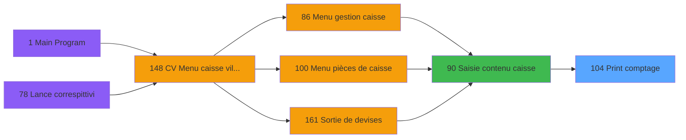

# VIL IDE 104 - Print comptage

> **Analyse**: Phases 1-4 2026-02-03 09:23 -> 09:24 (20s) | Assemblage 09:24
> **Pipeline**: V7.2 Enrichi
> **Structure**: 4 onglets (Resume | Ecrans | Donnees | Connexions)

<!-- TAB:Resume -->

## 1. FICHE D'IDENTITE

| Attribut | Valeur |
|----------|--------|
| Projet | VIL |
| IDE Position | 104 |
| Nom Programme | Print comptage |
| Fichier source | `Prg_104.xml` |
| Domaine metier | Impression |
| Taches | 6 (1 ecrans visibles) |
| Tables modifiees | 3 |
| Programmes appeles | 0 |

## 2. DESCRIPTION FONCTIONNELLE

**Print comptage** assure la gestion complete de ce processus, accessible depuis [Saisie contenu caisse (IDE 90)](VIL-IDE-90.md).

Le flux de traitement s'organise en **2 blocs fonctionnels** :

- **Traitement** (5 taches) : traitements metier divers
- **Impression** (1 tache) : generation de tickets et documents

**Donnees modifiees** : 3 tables en ecriture (saisie_ele_detail_cloture, saisie_transaction, situation_devise).

Detail : phases du traitement

#### Phase 1 : Traitement (5 taches)

- **104** - Veuillez patienter ... **[[ECRAN]](#ecran-t1)**
- **104.1.1** - Veuillez patienter ... **[[ECRAN]](#ecran-t4)**
- **104.1.1.1** - CARTES
- **104.1.1.2** - OD et DEV
- **104.1.1.2.1** - Detail devise

#### Phase 2 : Impression (1 tache)

- **104.1** - Printer 9 **[[ECRAN]](#ecran-t3)**

#### Tables impactees

| Table | Operations | Role metier |
|-------|-----------|-------------|
| saisie_ele_detail_cloture | **W** (2 usages) | Donnees reseau/cloture |
| saisie_transaction | **W** (1 usages) |  |
| situation_devise | **W** (1 usages) | Devises / taux de change |

## 3. BLOCS FONCTIONNELS

### 3.1 Traitement (5 taches)

Traitements internes.

---

#### 104 - Veuillez patienter ... [[ECRAN]](#ecran-t1)

**Role** : Traitement : Veuillez patienter ....
**Ecran** : 422 x 56 DLU (MDI) | [Voir mockup](#ecran-t1)

4 sous-taches directes

| Tache | Nom | Bloc |
|-------|-----|------|
| [104.1.1](#t4) | Veuillez patienter ... **[[ECRAN]](#ecran-t4)** | Traitement |
| [104.1.1.1](#t5) | CARTES | Traitement |
| [104.1.1.2](#t6) | OD et DEV | Traitement |
| [104.1.1.2.1](#t7) | Detail devise | Traitement |

---

#### 104.1.1 - Veuillez patienter ... [[ECRAN]](#ecran-t4)

**Role** : Traitement : Veuillez patienter ....
**Ecran** : 424 x 56 DLU (MDI) | [Voir mockup](#ecran-t4)

---

#### 104.1.1.1 - CARTES

**Role** : Traitement : CARTES.

---

#### 104.1.1.2 - OD et DEV

**Role** : Traitement : OD et DEV.

---

#### 104.1.1.2.1 - Detail devise

**Role** : Traitement : Detail devise.
**Variables liees** : B (Param Devise locale)

### 3.2 Impression (1 tache)

Generation des documents et tickets.

---

#### 104.1 - Printer 9 [[ECRAN]](#ecran-t3)

**Role** : Generation du document : Printer 9.
**Ecran** : 424 x 56 DLU (MDI) | [Voir mockup](#ecran-t3)

## 5. REGLES METIER

*(Aucune regle metier identifiee)*

## 6. CONTEXTE

- **Appele par**: [Saisie contenu caisse (IDE 90)](VIL-IDE-90.md)
- **Appelle**: 0 programmes | **Tables**: 4 (W:3 R:1 L:0) | **Taches**: 6 | **Expressions**: 2

<!-- TAB:Ecrans -->

## 8. ECRANS

### 8.1 Forms visibles (1 / 6)

| # | Position | Tache | Nom | Type | Largeur | Hauteur | Bloc |
|---|----------|-------|-----|------|---------|---------|------|
| 1 | 104 | 104 | Veuillez patienter ... | MDI | 422 | 56 | Traitement |

### 8.2 Mockups Ecrans

---

#### 104 - Veuillez patienter ...
**Tache** : [104](#t1) | **Type** : MDI | **Dimensions** : 422 x 56 DLU
**Bloc** : Traitement | **Titre IDE** : Veuillez patienter ...

<!-- FORM-DATA:
{
    "width":  422,
    "vFactor":  8,
    "type":  "MDI",
    "hFactor":  8,
    "controls":  [
                     {
                         "x":  0,
                         "type":  "label",
                         "var":  "",
                         "y":  0,
                         "w":  423,
                         "fmt":  "",
                         "name":  "",
                         "h":  29,
                         "color":  "",
                         "text":  "",
                         "parent":  null
                     },
                     {
                         "x":  120,
                         "type":  "label",
                         "var":  "",
                         "y":  10,
                         "w":  221,
                         "fmt":  "",
                         "name":  "",
                         "h":  8,
                         "color":  "7",
                         "text":  "Impression en cours ...",
                         "parent":  null
                     },
                     {
                         "x":  0,
                         "type":  "label",
                         "var":  "",
                         "y":  29,
                         "w":  423,
                         "fmt":  "",
                         "name":  "",
                         "h":  27,
                         "color":  "",
                         "text":  "",
                         "parent":  null
                     },
                     {
                         "x":  114,
                         "type":  "label",
                         "var":  "",
                         "y":  38,
                         "w":  203,
                         "fmt":  "",
                         "name":  "",
                         "h":  8,
                         "color":  "",
                         "text":  "Edition reçu change",
                         "parent":  null
                     },
                     {
                         "x":  4,
                         "type":  "image",
                         "var":  "",
                         "y":  2,
                         "w":  72,
                         "fmt":  "",
                         "name":  "",
                         "h":  25,
                         "color":  "",
                         "text":  "",
                         "parent":  null
                     }
                 ],
    "taskId":  "104",
    "height":  56
}
-->

## 9. NAVIGATION

Ecran unique: **Veuillez patienter ...**

### 9.3 Structure hierarchique (6 taches)

| Position | Tache | Type | Dimensions | Bloc |
|----------|-------|------|------------|------|
| **104.1** | [**Veuillez patienter ...** (104)](#t1) [mockup](#ecran-t1) | MDI | 422x56 | Traitement |
| 104.1.1 | [Veuillez patienter ... (104.1.1)](#t4) [mockup](#ecran-t4) | MDI | 424x56 | |
| 104.1.2 | [CARTES (104.1.1.1)](#t5) | MDI | - | |
| 104.1.3 | [OD et DEV (104.1.1.2)](#t6) | MDI | - | |
| 104.1.4 | [Detail devise (104.1.1.2.1)](#t7) | MDI | - | |
| **104.2** | [**Printer 9** (104.1)](#t3) [mockup](#ecran-t3) | MDI | 424x56 | Impression |

### 9.4 Algorigramme

> **Legende**: Vert = START/END OK | Rouge = END KO | Bleu = Decisions
> *Algorigramme auto-genere. Utiliser `/algorigramme` pour une synthese metier detaillee.*

<!-- TAB:Donnees -->

## 10. TABLES

### Tables utilisees (4)

| ID | Nom | Description | Type | R | W | L | Usages |
|----|-----|-------------|------|---|---|---|--------|
| 69 | initialisation___ini |  | DB | R |   |   | 1 |
| 488 | saisie_ele_detail_cloture | Donnees reseau/cloture | TMP |   | **W** |   | 2 |
| 489 | saisie_transaction |  | TMP |   | **W** |   | 1 |
| 490 | situation_devise | Devises / taux de change | TMP |   | **W** |   | 1 |

### Colonnes par table (2 / 4 tables avec colonnes identifiees)

Table 69 - initialisation___ini (R) - 1 usages

| Lettre | Variable | Acces | Type |
|--------|----------|-------|------|
| A | Param societe | R | Alpha |
| B | Param Devise locale | R | Alpha |
| C | Param Masque | R | Alpha |
| D | Param quand | R | Alpha |
| E | Param chrono session | R | Numeric |
| F | W0 fin tâche | R | Alpha |
| G | W0 copies | R | Numeric |

Table 488 - saisie_ele_detail_cloture (**W**) - 2 usages

*Table utilisee uniquement en Link ou aucune colonne Real identifiee dans le DataView.*

Table 489 - saisie_transaction (**W**) - 1 usages

*Table utilisee uniquement en Link ou aucune colonne Real identifiee dans le DataView.*

Table 490 - situation_devise (**W**) - 1 usages

| Lettre | Variable | Acces | Type |
|--------|----------|-------|------|
| B | Param Devise locale | W | Alpha |

## 11. VARIABLES

### 11.1 Variables de travail (2)

Variables internes au programme.

| Lettre | Nom | Type | Usage dans |
|--------|-----|------|-----------|
| F | W0 fin tâche | Alpha | - |
| G | W0 copies | Numeric | - |

### 11.2 Autres (5)

Variables diverses.

| Lettre | Nom | Type | Usage dans |
|--------|-----|------|-----------|
| A | Param societe | Alpha | - |
| B | Param Devise locale | Alpha | - |
| C | Param Masque | Alpha | - |
| D | Param quand | Alpha | - |
| E | Param chrono session | Numeric | - |

## 12. EXPRESSIONS

**2 / 2 expressions decodees (100%)**

### 12.1 Repartition par type

| Type | Expressions | Regles |
|------|-------------|--------|
| OTHER | 2 | 0 |

### 12.2 Expressions cles par type

#### OTHER (2 expressions)

| Type | IDE | Expression | Regle |
|------|-----|------------|-------|
| OTHER | 2 | `SetCrsr (1)` | - |
| OTHER | 1 | `SetCrsr (2)` | - |

<!-- TAB:Connexions -->

## 13. GRAPHE D'APPELS

### 13.1 Chaine depuis Main (Callers)

Main -> ... -> [Saisie contenu caisse (IDE 90)](VIL-IDE-90.md) -> **Print comptage (IDE 104)**

### 13.2 Callers

| IDE | Nom Programme | Nb Appels |
|-----|---------------|-----------|
| [90](VIL-IDE-90.md) | Saisie contenu caisse | 1 |

### 13.3 Callees (programmes appeles)

### 13.4 Detail Callees avec contexte

| IDE | Nom Programme | Appels | Contexte |
|-----|---------------|--------|----------|
| - | (aucun) | - | - |

## 14. RECOMMANDATIONS MIGRATION

### 14.1 Profil du programme

| Metrique | Valeur | Impact migration |
|----------|--------|-----------------|
| Lignes de logique | 59 | Programme compact |
| Expressions | 2 | Peu de logique |
| Tables WRITE | 3 | Impact modere |
| Sous-programmes | 0 | Peu de dependances |
| Ecrans visibles | 1 | Ecran unique ou traitement batch |
| Code desactive | 0% (0 / 59) | Code sain |
| Regles metier | 0 | Pas de regle identifiee |

### 14.2 Plan de migration par bloc

#### Traitement (5 taches: 2 ecrans, 3 traitements)

- **Strategie** : Orchestrateur avec 2 ecrans (Razor/React) et 3 traitements backend (services).
- Les ecrans deviennent des composants UI, les traitements invisibles deviennent des services injectables.
- Decomposer les taches en services unitaires testables.

#### Impression (1 tache: 1 ecran, 0 traitement)

- **Strategie** : Templates HTML -> PDF via wkhtmltopdf ou Puppeteer.
- `PrintService` injectable avec choix imprimante

### 14.3 Dependances critiques

| Dependance | Type | Appels | Impact |
|------------|------|--------|--------|
| saisie_ele_detail_cloture | Table WRITE (Temp) | 2x | Schema + repository |
| saisie_transaction | Table WRITE (Temp) | 1x | Schema + repository |
| situation_devise | Table WRITE (Temp) | 1x | Schema + repository |

---
*Spec DETAILED generee par Pipeline V7.2 - 2026-02-03 09:24*
