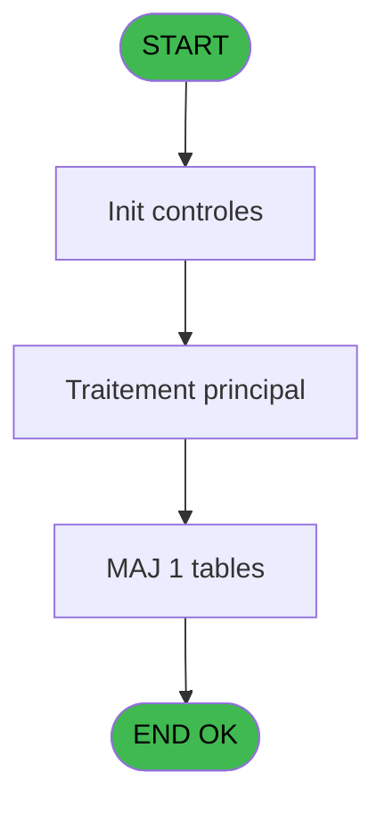
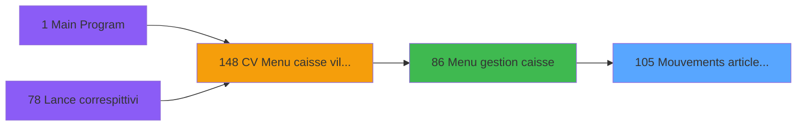
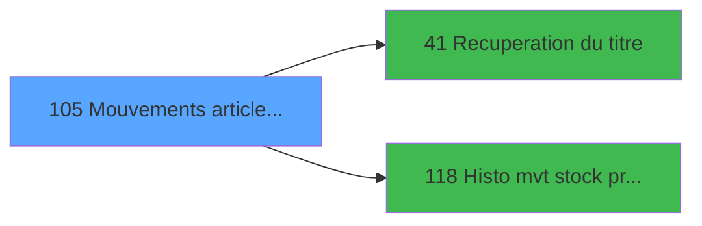

# VIL IDE 105 - Mouvements article coffre

> **Analyse**: Phases 1-4 2026-02-03 09:24 -> 09:24 (20s) | Assemblage 09:24
> **Pipeline**: V7.2 Enrichi
> **Structure**: 4 onglets (Resume | Ecrans | Donnees | Connexions)

<!-- TAB:Resume -->

## 1. FICHE D'IDENTITE

| Attribut | Valeur |
|----------|--------|
| Projet | VIL |
| IDE Position | 105 |
| Nom Programme | Mouvements article coffre |
| Fichier source | `Prg_105.xml` |
| Domaine metier | Caisse |
| Taches | 7 (1 ecrans visibles) |
| Tables modifiees | 1 |
| Programmes appeles | 2 |

## 2. DESCRIPTION FONCTIONNELLE

**Mouvements article coffre** assure la gestion complete de ce processus, accessible depuis [Menu gestion caisse (IDE 86)](VIL-IDE-86.md).

Le flux de traitement s'organise en **4 blocs fonctionnels** :

- **Traitement** (3 taches) : traitements metier divers
- **Validation** (2 taches) : controles et verifications de coherence
- **Saisie** (1 tache) : ecrans de saisie utilisateur (formulaires, champs, donnees)
- **Calcul** (1 tache) : calculs de montants, stocks ou compteurs

**Donnees modifiees** : 1 tables en ecriture (gestion_article_coffre).

Detail : phases du traitement

#### Phase 1 : Traitement (3 taches)

- **105** - Mouvements article coffre
- **105.2** - Charge articles
- **105.3** - Apport articles 146

Delegue a : [Recuperation du titre (IDE 41)](VIL-IDE-41.md)

#### Phase 2 : Saisie (1 tache)

- **105.1** - RAZ table saisie

#### Phase 3 : Calcul (1 tache)

- **105.3.1** - Mouvement stock dans le coffre **[[ECRAN]](#ecran-t6)**

Delegue a : [Histo mvt stock produits (IDE 118)](VIL-IDE-118.md)

#### Phase 4 : Validation (2 taches)

- **105.3.1.1** - Validation
- **105.3.1.1.1** - controle montant

#### Tables impactees

| Table | Operations | Role metier |
|-------|-----------|-------------|
| gestion_article_coffre | R/**W**/L (4 usages) | Articles et stock |

## 3. BLOCS FONCTIONNELS

### 3.1 Traitement (3 taches)

Traitements internes.

---

#### 105 - Mouvements article coffre

**Role** : Traitement : Mouvements article coffre.
**Variables liees** : D (Param montant article)
**Delegue a** : [Recuperation du titre (IDE 41)](VIL-IDE-41.md)

---

#### 105.2 - Charge articles

**Role** : Traitement : Charge articles.
**Delegue a** : [Recuperation du titre (IDE 41)](VIL-IDE-41.md)

---

#### 105.3 - Apport articles 146

**Role** : Traitement : Apport articles 146.
**Delegue a** : [Recuperation du titre (IDE 41)](VIL-IDE-41.md)

### 3.2 Saisie (1 tache)

Ce bloc traite la saisie des donnees de la transaction.

---

#### 105.1 - RAZ table saisie

**Role** : Saisie des donnees : RAZ table saisie.

### 3.3 Calcul (1 tache)

Calculs metier : montants, stocks, compteurs.

---

#### 105.3.1 - Mouvement stock dans le coffre [[ECRAN]](#ecran-t6)

**Role** : Calcul : Mouvement stock dans le coffre.
**Ecran** : 802 x 241 DLU (MDI) | [Voir mockup](#ecran-t6)
**Delegue a** : [Histo mvt stock produits (IDE 118)](VIL-IDE-118.md)

### 3.4 Validation (2 taches)

Controles de coherence : 2 taches verifient les donnees et conditions.

---

#### 105.3.1.1 - Validation

**Role** : Verification : Validation.

---

#### 105.3.1.1.1 - controle montant

**Role** : Verification : controle montant.
**Variables liees** : D (Param montant article)

## 5. REGLES METIER

*(Aucune regle metier identifiee)*

## 6. CONTEXTE

- **Appele par**: [Menu gestion caisse (IDE 86)](VIL-IDE-86.md)
- **Appelle**: 2 programmes | **Tables**: 3 (W:1 R:2 L:2) | **Taches**: 7 | **Expressions**: 1

<!-- TAB:Ecrans -->

## 8. ECRANS

### 8.1 Forms visibles (1 / 7)

| # | Position | Tache | Nom | Type | Largeur | Hauteur | Bloc |
|---|----------|-------|-----|------|---------|---------|------|
| 1 | 105.3.1 | 105.3.1 | Mouvement stock dans le coffre | MDI | 802 | 241 | Calcul |

### 8.2 Mockups Ecrans

---

#### 105.3.1 - Mouvement stock dans le coffre
**Tache** : [105.3.1](#t6) | **Type** : MDI | **Dimensions** : 802 x 241 DLU
**Bloc** : Calcul | **Titre IDE** : Mouvement stock dans le coffre

<!-- FORM-DATA:
{
    "width":  802,
    "vFactor":  8,
    "type":  "MDI",
    "hFactor":  8,
    "controls":  [
                     {
                         "x":  0,
                         "type":  "label",
                         "var":  "",
                         "y":  0,
                         "w":  800,
                         "fmt":  "",
                         "name":  "",
                         "h":  18,
                         "color":  "",
                         "text":  "",
                         "parent":  null
                     },
                     {
                         "x":  62,
                         "type":  "label",
                         "var":  "",
                         "y":  58,
                         "w":  676,
                         "fmt":  "",
                         "name":  "",
                         "h":  115,
                         "color":  "",
                         "text":  "",
                         "parent":  null
                     },
                     {
                         "x":  75,
                         "type":  "table",
                         "var":  "",
                         "name":  "",
                         "titleH":  12,
                         "color":  "110",
                         "w":  650,
                         "y":  65,
                         "fmt":  "",
                         "parent":  5,
                         "text":  "",
                         "rowH":  12,
                         "h":  100,
                         "cols":  [
                                      {
                                          "title":  "Libellé",
                                          "layer":  1,
                                          "w":  206
                                      },
                                      {
                                          "title":  "Prix Unitaire",
                                          "layer":  2,
                                          "w":  105
                                      },
                                      {
                                          "title":  "Quantité",
                                          "layer":  3,
                                          "w":  94
                                      },
                                      {
                                          "title":  "Montant",
                                          "layer":  4,
                                          "w":  213
                                      }
                                  ],
                         "rows":  4
                     },
                     {
                         "x":  375,
                         "type":  "label",
                         "var":  "",
                         "y":  185,
                         "w":  103,
                         "fmt":  "",
                         "name":  "",
                         "h":  10,
                         "color":  "",
                         "text":  "Total",
                         "parent":  null
                     },
                     {
                         "x":  0,
                         "type":  "label",
                         "var":  "",
                         "y":  216,
                         "w":  800,
                         "fmt":  "",
                         "name":  "",
                         "h":  24,
                         "color":  "",
                         "text":  "",
                         "parent":  null
                     },
                     {
                         "x":  80,
                         "type":  "edit",
                         "var":  "",
                         "y":  79,
                         "w":  202,
                         "fmt":  "",
                         "name":  "",
                         "h":  10,
                         "color":  "110",
                         "text":  "",
                         "parent":  6
                     },
                     {
                         "x":  286,
                         "type":  "edit",
                         "var":  "",
                         "y":  79,
                         "w":  95,
                         "fmt":  "",
                         "name":  "",
                         "h":  10,
                         "color":  "110",
                         "text":  "",
                         "parent":  6
                     },
                     {
                         "x":  392,
                         "type":  "edit",
                         "var":  "",
                         "y":  79,
                         "w":  85,
                         "fmt":  "",
                         "name":  "",
                         "h":  10,
                         "color":  "110",
                         "text":  "",
                         "parent":  6
                     },
                     {
                         "x":  485,
                         "type":  "edit",
                         "var":  "",
                         "y":  79,
                         "w":  198,
                         "fmt":  "N## ### ### ###.###Z",
                         "name":  "",
                         "h":  10,
                         "color":  "110",
                         "text":  "",
                         "parent":  6
                     },
                     {
                         "x":  487,
                         "type":  "edit",
                         "var":  "",
                         "y":  185,
                         "w":  198,
                         "fmt":  "## ### ### ###.###Z",
                         "name":  "",
                         "h":  10,
                         "color":  "6",
                         "text":  "",
                         "parent":  null
                     },
                     {
                         "x":  546,
                         "type":  "edit",
                         "var":  "",
                         "y":  5,
                         "w":  248,
                         "fmt":  "WWW  DD MMM YYYYT",
                         "name":  "",
                         "h":  8,
                         "color":  "",
                         "text":  "",
                         "parent":  null
                     },
                     {
                         "x":  62,
                         "type":  "edit",
                         "var":  "",
                         "y":  32,
                         "w":  676,
                         "fmt":  "100",
                         "name":  "",
                         "h":  18,
                         "color":  "142",
                         "text":  "",
                         "parent":  null
                     },
                     {
                         "x":  62,
                         "type":  "image",
                         "var":  "",
                         "y":  178,
                         "w":  98,
                         "fmt":  "",
                         "name":  "",
                         "h":  32,
                         "color":  "",
                         "text":  "",
                         "parent":  null
                     },
                     {
                         "x":  693,
                         "type":  "edit",
                         "var":  "",
                         "y":  185,
                         "w":  45,
                         "fmt":  "3",
                         "name":  "",
                         "h":  10,
                         "color":  "6",
                         "text":  "",
                         "parent":  null
                     },
                     {
                         "x":  12,
                         "type":  "button",
                         "var":  "",
                         "y":  219,
                         "w":  154,
                         "fmt":  "A\u0026bandon",
                         "name":  "",
                         "h":  18,
                         "color":  "",
                         "text":  "",
                         "parent":  null
                     },
                     {
                         "x":  323,
                         "type":  "button",
                         "var":  "",
                         "y":  219,
                         "w":  154,
                         "fmt":  "\u0026Historique",
                         "name":  "",
                         "h":  18,
                         "color":  "",
                         "text":  "",
                         "parent":  null
                     },
                     {
                         "x":  640,
                         "type":  "button",
                         "var":  "",
                         "y":  219,
                         "w":  154,
                         "fmt":  "\u0026Validation",
                         "name":  "",
                         "h":  18,
                         "color":  "",
                         "text":  "",
                         "parent":  null
                     },
                     {
                         "x":  2,
                         "type":  "edit",
                         "var":  "",
                         "y":  5,
                         "w":  267,
                         "fmt":  "30",
                         "name":  "",
                         "h":  8,
                         "color":  "",
                         "text":  "",
                         "parent":  null
                     }
                 ],
    "taskId":  "105.3.1",
    "height":  241
}
-->

<strong>Champs : 9 champs</strong>

| Pos (x,y) | Nom | Variable | Type |
|-----------|-----|----------|------|
| 80,79 | (sans nom) | - | edit |
| 286,79 | (sans nom) | - | edit |
| 392,79 | (sans nom) | - | edit |
| 485,79 | N## ### ### ###.###Z | - | edit |
| 487,185 | ## ### ### ###.###Z | - | edit |
| 546,5 | WWW  DD MMM YYYYT | - | edit |
| 62,32 | 100 | - | edit |
| 693,185 | 3 | - | edit |
| 2,5 | 30 | - | edit |

<strong>Boutons : 3 boutons</strong>

| Bouton | Pos (x,y) | Action |
|--------|-----------|--------|
| Abandon | 12,219 | Annule et retour au menu |
| Historique | 323,219 | Appel [Histo mvt stock produits (IDE 118)](VIL-IDE-118.md) |
| Validation | 640,219 | Valide la saisie et enregistre |

## 9. NAVIGATION

Ecran unique: **Mouvement stock dans le coffre**

### 9.3 Structure hierarchique (7 taches)

| Position | Tache | Type | Dimensions | Bloc |
|----------|-------|------|------------|------|
| **105.1** | [**Mouvements article coffre** (105)](#t1) | MDI | - | Traitement |
| 105.1.1 | [Charge articles (105.2)](#t3) | MDI | - | |
| 105.1.2 | [Apport articles 146 (105.3)](#t4) | MDI | - | |
| **105.2** | [**RAZ table saisie** (105.1)](#t2) | MDI | - | Saisie |
| **105.3** | [**Mouvement stock dans le coffre** (105.3.1)](#t6) [mockup](#ecran-t6) | MDI | 802x241 | Calcul |
| **105.4** | [**Validation** (105.3.1.1)](#t9) | MDI | - | Validation |
| 105.4.1 | [controle montant (105.3.1.1.1)](#t10) | MDI | - | |

### 9.4 Algorigramme

> **Legende**: Vert = START/END OK | Rouge = END KO | Bleu = Decisions
> *Algorigramme auto-genere. Utiliser `/algorigramme` pour une synthese metier detaillee.*

<!-- TAB:Donnees -->

## 10. TABLES

### Tables utilisees (3)

| ID | Nom | Description | Type | R | W | L | Usages |
|----|-----|-------------|------|---|---|---|--------|
| 77 | articles_________art | Articles et stock | DB | R |   |   | 1 |
| 197 | articles_en_stock | Articles et stock | DB |   |   | L | 1 |
| 214 | gestion_article_coffre | Articles et stock | DB | R | **W** | L | 4 |

### Colonnes par table (3 / 2 tables avec colonnes identifiees)

Table 77 - articles_________art (R) - 1 usages

| Lettre | Variable | Acces | Type |
|--------|----------|-------|------|
| A | Montant articles | R | Numeric |

Table 214 - gestion_article_coffre (R/**W**/L) - 4 usages

| Lettre | Variable | Acces | Type |
|--------|----------|-------|------|
| A | Montant articles | W | Numeric |
| B | titre | W | Alpha |

## 11. VARIABLES

### 11.1 Autres (4)

Variables diverses.

| Lettre | Nom | Type | Usage dans |
|--------|-----|------|-----------|
| A | Param Entree ou Sortie | Alpha | - |
| B | Param masque | Alpha | - |
| C | Param devise locale | Alpha | - |
| D | Param montant article | Numeric | - |

## 12. EXPRESSIONS

**1 / 1 expressions decodees (100%)**

### 12.1 Repartition par type

| Type | Expressions | Regles |
|------|-------------|--------|
| REFERENCE_VG | 1 | 0 |

### 12.2 Expressions cles par type

#### REFERENCE_VG (1 expressions)

| Type | IDE | Expression | Regle |
|------|-----|------------|-------|
| REFERENCE_VG | 1 | `VG1` | - |

<!-- TAB:Connexions -->

## 13. GRAPHE D'APPELS

### 13.1 Chaine depuis Main (Callers)

Main -> ... -> [Menu gestion caisse (IDE 86)](VIL-IDE-86.md) -> **Mouvements article coffre (IDE 105)**

### 13.2 Callers

| IDE | Nom Programme | Nb Appels |
|-----|---------------|-----------|
| [86](VIL-IDE-86.md) | Menu gestion caisse | 2 |

### 13.3 Callees (programmes appeles)

### 13.4 Detail Callees avec contexte

| IDE | Nom Programme | Appels | Contexte |
|-----|---------------|--------|----------|
| [41](VIL-IDE-41.md) | Recuperation du titre | 1 | Recuperation donnees |
| [118](VIL-IDE-118.md) | Histo mvt stock produits | 1 | Calcul de donnees |

## 14. RECOMMANDATIONS MIGRATION

### 14.1 Profil du programme

| Metrique | Valeur | Impact migration |
|----------|--------|-----------------|
| Lignes de logique | 85 | Programme compact |
| Expressions | 1 | Peu de logique |
| Tables WRITE | 1 | Impact faible |
| Sous-programmes | 2 | Peu de dependances |
| Ecrans visibles | 1 | Ecran unique ou traitement batch |
| Code desactive | 0% (0 / 85) | Code sain |
| Regles metier | 0 | Pas de regle identifiee |

### 14.2 Plan de migration par bloc

#### Traitement (3 taches: 0 ecran, 3 traitements)

- **Strategie** : 3 service(s) backend injectable(s) (Domain Services).
- 2 sous-programme(s) a migrer ou a reutiliser depuis les services existants.
- Decomposer les taches en services unitaires testables.

#### Saisie (1 tache: 0 ecran, 1 traitement)

- **Strategie** : Formulaire React/Blazor avec validation Zod/FluentValidation.
- Validation temps reel cote client + serveur

#### Calcul (1 tache: 1 ecran, 0 traitement)

- **Strategie** : Services de calcul purs (Domain Services).
- Migrer la logique de calcul (stock, compteurs, montants)

#### Validation (2 taches: 0 ecran, 2 traitements)

- **Strategie** : FluentValidation avec validators specifiques.
- Chaque tache de validation -> un validator injectable

### 14.3 Dependances critiques

| Dependance | Type | Appels | Impact |
|------------|------|--------|--------|
| gestion_article_coffre | Table WRITE (Database) | 2x | Schema + repository |
| [Histo mvt stock produits (IDE 118)](VIL-IDE-118.md) | Sous-programme | 1x | Normale - Calcul de donnees |
| [Recuperation du titre (IDE 41)](VIL-IDE-41.md) | Sous-programme | 1x | Normale - Recuperation donnees |

---
*Spec DETAILED generee par Pipeline V7.2 - 2026-02-03 09:24*
