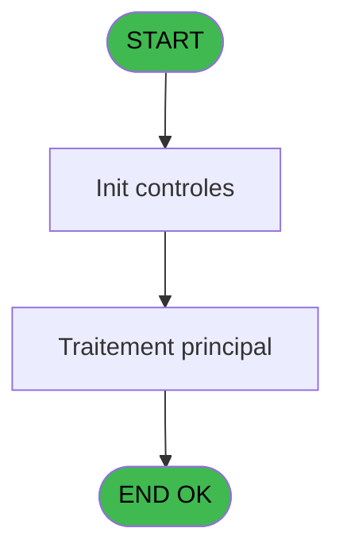
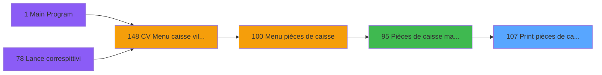

# VIL IDE 107 - Print pièces de caisse / date

> **Analyse**: Phases 1-4 2026-02-03 09:25 -> 09:25 (20s) | Assemblage 09:25
> **Pipeline**: V7.2 Enrichi
> **Structure**: 4 onglets (Resume | Ecrans | Donnees | Connexions)

<!-- TAB:Resume -->

## 1. FICHE D'IDENTITE

| Attribut | Valeur |
|----------|--------|
| Projet | VIL |
| IDE Position | 107 |
| Nom Programme | Print pièces de caisse / date |
| Fichier source | `Prg_107.xml` |
| Domaine metier | Caisse |
| Taches | 2 (1 ecrans visibles) |
| Tables modifiees | 0 |
| Programmes appeles | 0 |

## 2. DESCRIPTION FONCTIONNELLE

**Print pièces de caisse / date** assure la gestion complete de ce processus, accessible depuis [Pièces de caisse manuelles (IDE 95)](VIL-IDE-95.md).

Le flux de traitement s'organise en **1 blocs fonctionnels** :

- **Traitement** (2 taches) : traitements metier divers

**Logique metier** : 1 regles identifiees couvrant conditions metier.

## 3. BLOCS FONCTIONNELS

### 3.1 Traitement (2 taches)

Traitements internes.

---

#### 107 - Pièces de caisse par date [[ECRAN]](#ecran-t1)

**Role** : Traitement : Pièces de caisse par date.
**Ecran** : 640 x 120 DLU (MDI) | [Voir mockup](#ecran-t1)
**Variables liees** : E (Param date comptable), F (Date à editer)

---

#### 107.1 - Veuillez patienter.... [[ECRAN]](#ecran-t3)

**Role** : Traitement : Veuillez patienter.....
**Ecran** : 427 x 56 DLU (MDI) | [Voir mockup](#ecran-t3)

## 5. REGLES METIER

1 regles identifiees:

### Autres (1 regles)

#### [RM-001] Condition toujours vraie (flag actif)

| Element | Detail |
|---------|--------|
| **Condition** | `INIGet ('[MAGIC_LOGICAL_NAMES]preview')='O'` |
| **Si vrai** | 'FALSE'LOG |
| **Si faux** | 'TRUE'LOG) |
| **Expression source** | Expression 5 : `IF (INIGet ('[MAGIC_LOGICAL_NAMES]preview')='O','FALSE'LOG,'` |
| **Exemple** | Si INIGet ('[MAGIC_LOGICAL_NAMES]preview')='O' → 'FALSE'LOG. Sinon → 'TRUE'LOG) |

## 6. CONTEXTE

- **Appele par**: [Pièces de caisse manuelles (IDE 95)](VIL-IDE-95.md)
- **Appelle**: 0 programmes | **Tables**: 2 (W:0 R:1 L:1) | **Taches**: 2 | **Expressions**: 5

<!-- TAB:Ecrans -->

## 8. ECRANS

### 8.1 Forms visibles (1 / 2)

| # | Position | Tache | Nom | Type | Largeur | Hauteur | Bloc |
|---|----------|-------|-----|------|---------|---------|------|
| 1 | 107 | 107 | Pièces de caisse par date | MDI | 640 | 120 | Traitement |

### 8.2 Mockups Ecrans

---

#### 107 - Pièces de caisse par date
**Tache** : [107](#t1) | **Type** : MDI | **Dimensions** : 640 x 120 DLU
**Bloc** : Traitement | **Titre IDE** : Pièces de caisse par date

<!-- FORM-DATA:
{
    "width":  640,
    "vFactor":  8,
    "type":  "MDI",
    "hFactor":  8,
    "controls":  [
                     {
                         "x":  0,
                         "type":  "label",
                         "var":  "",
                         "y":  0,
                         "w":  638,
                         "fmt":  "",
                         "name":  "",
                         "h":  18,
                         "color":  "",
                         "text":  "",
                         "parent":  null
                     },
                     {
                         "x":  146,
                         "type":  "label",
                         "var":  "",
                         "y":  26,
                         "w":  352,
                         "fmt":  "",
                         "name":  "",
                         "h":  59,
                         "color":  "",
                         "text":  "",
                         "parent":  null
                     },
                     {
                         "x":  180,
                         "type":  "label",
                         "var":  "",
                         "y":  50,
                         "w":  146,
                         "fmt":  "",
                         "name":  "",
                         "h":  10,
                         "color":  "",
                         "text":  "Date à éditer",
                         "parent":  null
                     },
                     {
                         "x":  0,
                         "type":  "label",
                         "var":  "",
                         "y":  96,
                         "w":  640,
                         "fmt":  "",
                         "name":  "",
                         "h":  24,
                         "color":  "",
                         "text":  "",
                         "parent":  null
                     },
                     {
                         "x":  331,
                         "type":  "edit",
                         "var":  "",
                         "y":  50,
                         "w":  126,
                         "fmt":  "",
                         "name":  "Date à editer",
                         "h":  10,
                         "color":  "6",
                         "text":  "",
                         "parent":  null
                     },
                     {
                         "x":  479,
                         "type":  "button",
                         "var":  "",
                         "y":  99,
                         "w":  154,
                         "fmt":  "",
                         "name":  "Bouton imprimer",
                         "h":  18,
                         "color":  "",
                         "text":  "",
                         "parent":  null
                     },
                     {
                         "x":  10,
                         "type":  "edit",
                         "var":  "",
                         "y":  5,
                         "w":  267,
                         "fmt":  "30",
                         "name":  "",
                         "h":  8,
                         "color":  "",
                         "text":  "",
                         "parent":  null
                     },
                     {
                         "x":  382,
                         "type":  "edit",
                         "var":  "",
                         "y":  5,
                         "w":  248,
                         "fmt":  "WWW  DD MMM YYYYT",
                         "name":  "",
                         "h":  8,
                         "color":  "",
                         "text":  "",
                         "parent":  null
                     },
                     {
                         "x":  9,
                         "type":  "button",
                         "var":  "",
                         "y":  99,
                         "w":  154,
                         "fmt":  "\u0026Abandon",
                         "name":  "",
                         "h":  18,
                         "color":  "",
                         "text":  "",
                         "parent":  null
                     }
                 ],
    "taskId":  "107",
    "height":  120
}
-->

<strong>Champs : 3 champs</strong>

| Pos (x,y) | Nom | Variable | Type |
|-----------|-----|----------|------|
| 331,50 | Date à editer | - | edit |
| 10,5 | 30 | - | edit |
| 382,5 | WWW  DD MMM YYYYT | - | edit |

<strong>Boutons : 2 boutons</strong>

| Bouton | Pos (x,y) | Action |
|--------|-----------|--------|
| imprimer | 479,99 | Lance l'impression |
| Abandon | 9,99 | Annule et retour au menu |

## 9. NAVIGATION

Ecran unique: **Pièces de caisse par date**

### 9.3 Structure hierarchique (2 taches)

| Position | Tache | Type | Dimensions | Bloc |
|----------|-------|------|------------|------|
| **107.1** | [**Pièces de caisse par date** (107)](#t1) [mockup](#ecran-t1) | MDI | 640x120 | Traitement |
| 107.1.1 | [Veuillez patienter.... (107.1)](#t3) [mockup](#ecran-t3) | MDI | 427x56 | |

### 9.4 Algorigramme

> **Legende**: Vert = START/END OK | Rouge = END KO | Bleu = Decisions
> *Algorigramme auto-genere. Utiliser `/algorigramme` pour une synthese metier detaillee.*

<!-- TAB:Donnees -->

## 10. TABLES

### Tables utilisees (2)

| ID | Nom | Description | Type | R | W | L | Usages |
|----|-----|-------------|------|---|---|---|--------|
| 54 | pieces_caisse____pks | Sessions de caisse | DB | R |   |   | 1 |
| 224 | complement_pieces_de_caisse | Sessions de caisse | DB |   |   | L | 1 |

### Colonnes par table (1 / 1 tables avec colonnes identifiees)

Table 54 - pieces_caisse____pks (R) - 1 usages

| Lettre | Variable | Acces | Type |
|--------|----------|-------|------|
| A | W0 total recette PLUS | R | Numeric |
| B | W0 total recette MOINSx | R | Numeric |
| C | W0 total depense MOINS | R | Numeric |
| D | W0 total depense PLUSx | R | Numeric |

## 11. VARIABLES

### 11.1 Autres (7)

Variables diverses.

| Lettre | Nom | Type | Usage dans |
|--------|-----|------|-----------|
| A | Param societe | Alpha | - |
| B | Param code-devise | Alpha | - |
| C | Param masque | Alpha | - |
| D | Param nom village | Alpha | - |
| E | Param date comptable | Date | [107](#t1) |
| F | Date à editer | Date | - |
| G | Bouton imprimer | Alpha | - |

## 12. EXPRESSIONS

**5 / 5 expressions decodees (100%)**

### 12.1 Repartition par type

| Type | Expressions | Regles |
|------|-------------|--------|
| CAST_LOGIQUE | 1 | 5 |
| CONSTANTE | 1 | 0 |
| DATE | 1 | 0 |
| REFERENCE_VG | 1 | 0 |
| OTHER | 1 | 0 |

### 12.2 Expressions cles par type

#### CAST_LOGIQUE (1 expressions)

| Type | IDE | Expression | Regle |
|------|-----|------------|-------|
| CAST_LOGIQUE | 5 | `IF (INIGet ('[MAGIC_LOGICAL_NAMES]preview')='O','FALSE'LOG,'TRUE'LOG)` | [RM-001](#rm-RM-001) |

#### CONSTANTE (1 expressions)

| Type | IDE | Expression | Regle |
|------|-----|------------|-------|
| CONSTANTE | 4 | `'&Imprimer'` | - |

#### DATE (1 expressions)

| Type | IDE | Expression | Regle |
|------|-----|------------|-------|
| DATE | 2 | `Date ()` | - |

#### REFERENCE_VG (1 expressions)

| Type | IDE | Expression | Regle |
|------|-----|------------|-------|
| REFERENCE_VG | 1 | `VG1` | - |

#### OTHER (1 expressions)

| Type | IDE | Expression | Regle |
|------|-----|------------|-------|
| OTHER | 3 | `Param date comptable [E]` | - |

<!-- TAB:Connexions -->

## 13. GRAPHE D'APPELS

### 13.1 Chaine depuis Main (Callers)

Main -> ... -> [Pièces de caisse manuelles (IDE 95)](VIL-IDE-95.md) -> **Print pièces de caisse / date (IDE 107)**

### 13.2 Callers

| IDE | Nom Programme | Nb Appels |
|-----|---------------|-----------|
| [95](VIL-IDE-95.md) | Pièces de caisse manuelles | 1 |

### 13.3 Callees (programmes appeles)

### 13.4 Detail Callees avec contexte

| IDE | Nom Programme | Appels | Contexte |
|-----|---------------|--------|----------|
| - | (aucun) | - | - |

## 14. RECOMMANDATIONS MIGRATION

### 14.1 Profil du programme

| Metrique | Valeur | Impact migration |
|----------|--------|-----------------|
| Lignes de logique | 62 | Programme compact |
| Expressions | 5 | Peu de logique |
| Tables WRITE | 0 | Impact faible |
| Sous-programmes | 0 | Peu de dependances |
| Ecrans visibles | 1 | Ecran unique ou traitement batch |
| Code desactive | 0% (0 / 62) | Code sain |
| Regles metier | 1 | Quelques regles a preserver |

### 14.2 Plan de migration par bloc

#### Traitement (2 taches: 2 ecrans, 0 traitement)

- **Strategie** : 2 composant(s) UI (Razor/React) avec formulaires et validation.
- Decomposer les taches en services unitaires testables.

### 14.3 Dependances critiques

| Dependance | Type | Appels | Impact |
|------------|------|--------|--------|

---
*Spec DETAILED generee par Pipeline V7.2 - 2026-02-03 09:25*
