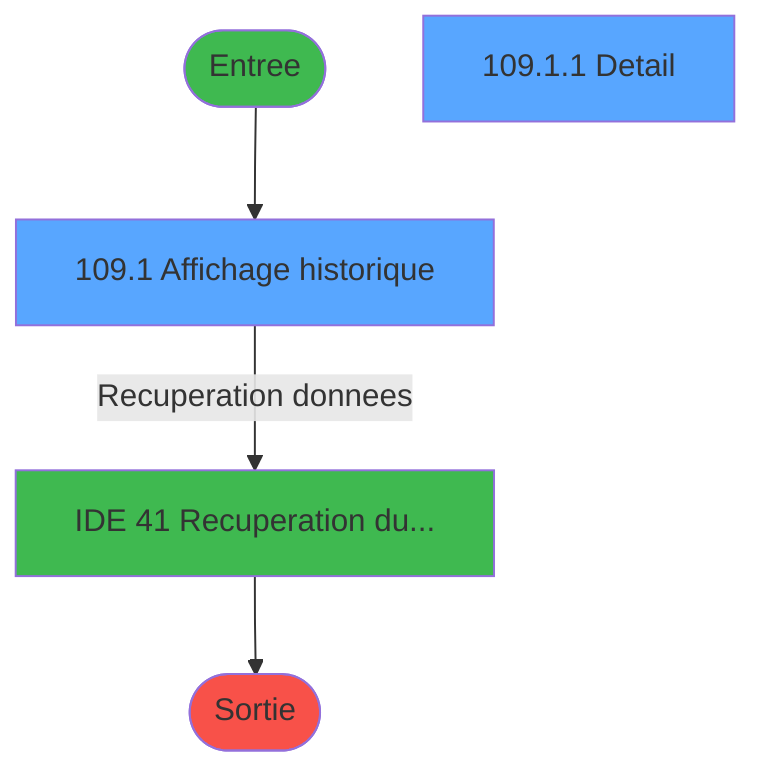
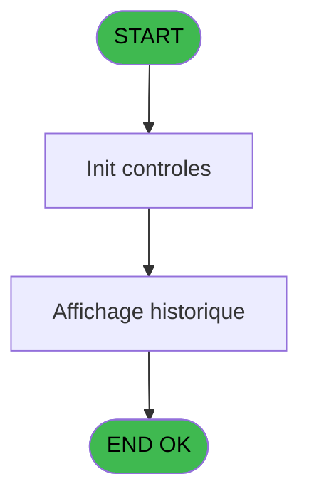
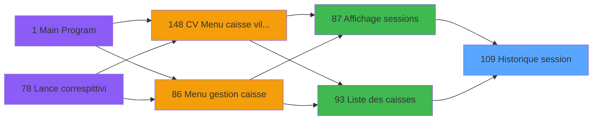
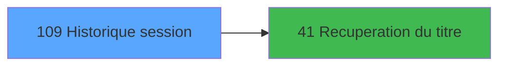

# VIL IDE 109 - Historique session

> **Analyse**: Phases 1-4 2026-02-03 09:26 -> 09:26 (20s) | Assemblage 09:26
> **Pipeline**: V7.2 Enrichi
> **Structure**: 4 onglets (Resume | Ecrans | Donnees | Connexions)

<!-- TAB:Resume -->

## 1. FICHE D'IDENTITE

| Attribut | Valeur |
|----------|--------|
| Projet | VIL |
| IDE Position | 109 |
| Nom Programme | Historique session |
| Fichier source | `Prg_109.xml` |
| Domaine metier | Caisse |
| Taches | 3 (2 ecrans visibles) |
| Tables modifiees | 0 |
| Programmes appeles | 1 |

## 2. DESCRIPTION FONCTIONNELLE

**Historique session** assure la gestion complete de ce processus, accessible depuis [Affichage sessions (IDE 87)](VIL-IDE-87.md), [Liste des caisses (IDE 93)](VIL-IDE-93.md).

Le flux de traitement s'organise en **2 blocs fonctionnels** :

- **Traitement** (2 taches) : traitements metier divers
- **Consultation** (1 tache) : ecrans de recherche, selection et consultation

Detail : phases du traitement

#### Phase 1 : Traitement (2 taches)

- **109** - Historique session 150
- **109.1.1** - Detail **[[ECRAN]](#ecran-t4)**

Delegue a : [Recuperation du titre (IDE 41)](VIL-IDE-41.md)

#### Phase 2 : Consultation (1 tache)

- **109.1** - Affichage historique **[[ECRAN]](#ecran-t2)**

Delegue a : [Recuperation du titre (IDE 41)](VIL-IDE-41.md)

## 3. BLOCS FONCTIONNELS

### 3.1 Traitement (2 taches)

Traitements internes.

---

#### 109 - Historique session 150

**Role** : Consultation/chargement : Historique session 150.
**Variables liees** : E (Fin Historique)
**Delegue a** : [Recuperation du titre (IDE 41)](VIL-IDE-41.md)

---

#### 109.1.1 - Detail [[ECRAN]](#ecran-t4)

**Role** : Traitement : Detail.
**Ecran** : 1248 x 164 DLU (MDI) | [Voir mockup](#ecran-t4)
**Delegue a** : [Recuperation du titre (IDE 41)](VIL-IDE-41.md)

### 3.2 Consultation (1 tache)

Ecrans de recherche et consultation.

---

#### 109.1 - Affichage historique [[ECRAN]](#ecran-t2)

**Role** : Reinitialisation : Affichage historique.
**Ecran** : 1248 x 88 DLU (MDI) | [Voir mockup](#ecran-t2)
**Variables liees** : E (Fin Historique)

## 5. REGLES METIER

*(Aucune regle metier identifiee)*

## 6. CONTEXTE

- **Appele par**: [Affichage sessions (IDE 87)](VIL-IDE-87.md), [Liste des caisses (IDE 93)](VIL-IDE-93.md)
- **Appelle**: 1 programmes | **Tables**: 3 (W:0 R:2 L:1) | **Taches**: 3 | **Expressions**: 1

<!-- TAB:Ecrans -->

## 8. ECRANS

### 8.1 Forms visibles (2 / 3)

| # | Position | Tache | Nom | Type | Largeur | Hauteur | Bloc |
|---|----------|-------|-----|------|---------|---------|------|
| 1 | 109.1 | 109.1 | Affichage historique | MDI | 1248 | 88 | Consultation |
| 2 | 109.1.1 | 109.1.1 | Detail | MDI | 1248 | 164 | Traitement |

### 8.2 Mockups Ecrans

---

#### 109.1 - Affichage historique
**Tache** : [109.1](#t2) | **Type** : MDI | **Dimensions** : 1248 x 88 DLU
**Bloc** : Consultation | **Titre IDE** : Affichage historique

<!-- FORM-DATA:
{
    "width":  1248,
    "vFactor":  8,
    "type":  "MDI",
    "hFactor":  8,
    "controls":  [
                     {
                         "x":  0,
                         "type":  "label",
                         "var":  "",
                         "y":  1,
                         "w":  1248,
                         "fmt":  "",
                         "name":  "",
                         "h":  18,
                         "color":  "",
                         "text":  "",
                         "parent":  null
                     },
                     {
                         "x":  30,
                         "type":  "table",
                         "var":  "",
                         "name":  "",
                         "titleH":  12,
                         "color":  "110",
                         "w":  951,
                         "y":  20,
                         "fmt":  "",
                         "parent":  null,
                         "text":  "",
                         "rowH":  10,
                         "h":  64,
                         "cols":  [
                                      {
                                          "title":  "Numéro session",
                                          "layer":  1,
                                          "w":  161
                                      },
                                      {
                                          "title":  "Date début",
                                          "layer":  2,
                                          "w":  145
                                      },
                                      {
                                          "title":  "Heure début",
                                          "layer":  3,
                                          "w":  143
                                      },
                                      {
                                          "title":  "Date fin",
                                          "layer":  4,
                                          "w":  144
                                      },
                                      {
                                          "title":  "Heure fin",
                                          "layer":  5,
                                          "w":  143
                                      },
                                      {
                                          "title":  "Etat de la session",
                                          "layer":  6,
                                          "w":  180
                                      }
                                  ],
                         "rows":  6
                     },
                     {
                         "x":  1009,
                         "type":  "label",
                         "var":  "",
                         "y":  24,
                         "w":  143,
                         "fmt":  "",
                         "name":  "",
                         "h":  10,
                         "color":  "",
                         "text":  "Monnaie locale",
                         "parent":  null
                     },
                     {
                         "x":  34,
                         "type":  "edit",
                         "var":  "",
                         "y":  34,
                         "w":  155,
                         "fmt":  "",
                         "name":  "Chrono",
                         "h":  8,
                         "color":  "110",
                         "text":  "",
                         "parent":  5
                     },
                     {
                         "x":  198,
                         "type":  "edit",
                         "var":  "",
                         "y":  34,
                         "w":  136,
                         "fmt":  "",
                         "name":  "Date debut session",
                         "h":  8,
                         "color":  "110",
                         "text":  "",
                         "parent":  5
                     },
                     {
                         "x":  342,
                         "type":  "edit",
                         "var":  "",
                         "y":  34,
                         "w":  136,
                         "fmt":  "",
                         "name":  "Heure debut session",
                         "h":  8,
                         "color":  "110",
                         "text":  "",
                         "parent":  5
                     },
                     {
                         "x":  486,
                         "type":  "edit",
                         "var":  "",
                         "y":  34,
                         "w":  136,
                         "fmt":  "",
                         "name":  "Date fin session",
                         "h":  8,
                         "color":  "110",
                         "text":  "",
                         "parent":  5
                     },
                     {
                         "x":  629,
                         "type":  "edit",
                         "var":  "",
                         "y":  34,
                         "w":  136,
                         "fmt":  "",
                         "name":  "Heure fin session",
                         "h":  8,
                         "color":  "110",
                         "text":  "",
                         "parent":  5
                     },
                     {
                         "x":  547,
                         "type":  "edit",
                         "var":  "",
                         "y":  3,
                         "w":  154,
                         "fmt":  "",
                         "name":  "",
                         "h":  12,
                         "color":  "6",
                         "text":  "",
                         "parent":  1
                     },
                     {
                         "x":  7,
                         "type":  "edit",
                         "var":  "",
                         "y":  6,
                         "w":  267,
                         "fmt":  "30",
                         "name":  "",
                         "h":  8,
                         "color":  "",
                         "text":  "",
                         "parent":  null
                     },
                     {
                         "x":  993,
                         "type":  "edit",
                         "var":  "",
                         "y":  6,
                         "w":  248,
                         "fmt":  "WWW  DD MMM YYYYT",
                         "name":  "",
                         "h":  8,
                         "color":  "",
                         "text":  "",
                         "parent":  null
                     },
                     {
                         "x":  771,
                         "type":  "edit",
                         "var":  "",
                         "y":  34,
                         "w":  171,
                         "fmt":  "30",
                         "name":  "",
                         "h":  8,
                         "color":  "110",
                         "text":  "",
                         "parent":  5
                     },
                     {
                         "x":  1159,
                         "type":  "edit",
                         "var":  "",
                         "y":  24,
                         "w":  42,
                         "fmt":  "",
                         "name":  "",
                         "h":  10,
                         "color":  "7",
                         "text":  "",
                         "parent":  null
                     },
                     {
                         "x":  1047,
                         "type":  "button",
                         "var":  "",
                         "y":  40,
                         "w":  154,
                         "fmt":  "\u0026Détail",
                         "name":  "",
                         "h":  14,
                         "color":  "",
                         "text":  "",
                         "parent":  null
                     },
                     {
                         "x":  1047,
                         "type":  "button",
                         "var":  "",
                         "y":  61,
                         "w":  154,
                         "fmt":  "\u0026Quitter",
                         "name":  "",
                         "h":  14,
                         "color":  "",
                         "text":  "",
                         "parent":  null
                     }
                 ],
    "taskId":  "109.1",
    "height":  88
}
-->

<strong>Champs : 10 champs</strong>

| Pos (x,y) | Nom | Variable | Type |
|-----------|-----|----------|------|
| 34,34 | Chrono | - | edit |
| 198,34 | Date debut session | - | edit |
| 342,34 | Heure debut session | - | edit |
| 486,34 | Date fin session | - | edit |
| 629,34 | Heure fin session | - | edit |
| 547,3 | (sans nom) | - | edit |
| 7,6 | 30 | - | edit |
| 993,6 | WWW  DD MMM YYYYT | - | edit |
| 771,34 | 30 | - | edit |
| 1159,24 | (sans nom) | - | edit |

<strong>Boutons : 2 boutons</strong>

| Bouton | Pos (x,y) | Action |
|--------|-----------|--------|
| Détail | 1047,40 | Bouton fonctionnel |
| Quitter | 1047,61 | Quitte le programme |

---

#### 109.1.1 - Detail
**Tache** : [109.1.1](#t4) | **Type** : MDI | **Dimensions** : 1248 x 164 DLU
**Bloc** : Traitement | **Titre IDE** : Detail

<!-- FORM-DATA:
{
    "width":  1248,
    "vFactor":  8,
    "type":  "MDI",
    "hFactor":  8,
    "controls":  [
                     {
                         "x":  31,
                         "type":  "label",
                         "var":  "",
                         "y":  2,
                         "w":  154,
                         "fmt":  "",
                         "name":  "",
                         "h":  8,
                         "color":  "",
                         "text":  "Détail session",
                         "parent":  null
                     },
                     {
                         "x":  24,
                         "type":  "table",
                         "var":  "",
                         "name":  "",
                         "titleH":  12,
                         "color":  "110",
                         "w":  962,
                         "y":  15,
                         "fmt":  "",
                         "parent":  null,
                         "text":  "",
                         "rowH":  10,
                         "h":  141,
                         "cols":  [
                                      {
                                          "title":  "Ordre",
                                          "layer":  1,
                                          "w":  51
                                      },
                                      {
                                          "title":  "Type",
                                          "layer":  2,
                                          "w":  202
                                      },
                                      {
                                          "title":  "Quand",
                                          "layer":  3,
                                          "w":  200
                                      },
                                      {
                                          "title":  "Date",
                                          "layer":  4,
                                          "w":  143
                                      },
                                      {
                                          "title":  "Heure",
                                          "layer":  5,
                                          "w":  144
                                      },
                                      {
                                          "title":  "Montant",
                                          "layer":  6,
                                          "w":  186
                                      }
                                  ],
                         "rows":  6
                     },
                     {
                         "x":  987,
                         "type":  "label",
                         "var":  "",
                         "y":  69,
                         "w":  88,
                         "fmt":  "",
                         "name":  "",
                         "h":  7,
                         "color":  "2",
                         "text":  "Cash",
                         "parent":  null
                     },
                     {
                         "x":  987,
                         "type":  "label",
                         "var":  "",
                         "y":  77,
                         "w":  88,
                         "fmt":  "",
                         "name":  "",
                         "h":  7,
                         "color":  "2",
                         "text":  "Produits",
                         "parent":  null
                     },
                     {
                         "x":  987,
                         "type":  "label",
                         "var":  "",
                         "y":  85,
                         "w":  88,
                         "fmt":  "",
                         "name":  "",
                         "h":  7,
                         "color":  "2",
                         "text":  "Cartes",
                         "parent":  null
                     },
                     {
                         "x":  987,
                         "type":  "label",
                         "var":  "",
                         "y":  93,
                         "w":  88,
                         "fmt":  "",
                         "name":  "",
                         "h":  7,
                         "color":  "2",
                         "text":  "Chèques",
                         "parent":  null
                     },
                     {
                         "x":  987,
                         "type":  "label",
                         "var":  "",
                         "y":  101,
                         "w":  88,
                         "fmt":  "",
                         "name":  "",
                         "h":  7,
                         "color":  "2",
                         "text":  "OD",
                         "parent":  null
                     },
                     {
                         "x":  987,
                         "type":  "label",
                         "var":  "",
                         "y":  109,
                         "w":  88,
                         "fmt":  "",
                         "name":  "",
                         "h":  7,
                         "color":  "2",
                         "text":  "Devises",
                         "parent":  null
                     },
                     {
                         "x":  29,
                         "type":  "edit",
                         "var":  "",
                         "y":  29,
                         "w":  46,
                         "fmt":  "",
                         "name":  "",
                         "h":  8,
                         "color":  "110",
                         "text":  "",
                         "parent":  4
                     },
                     {
                         "x":  482,
                         "type":  "edit",
                         "var":  "",
                         "y":  29,
                         "w":  136,
                         "fmt":  "",
                         "name":  "",
                         "h":  8,
                         "color":  "110",
                         "text":  "",
                         "parent":  4
                     },
                     {
                         "x":  627,
                         "type":  "edit",
                         "var":  "",
                         "y":  29,
                         "w":  136,
                         "fmt":  "",
                         "name":  "",
                         "h":  8,
                         "color":  "110",
                         "text":  "",
                         "parent":  4
                     },
                     {
                         "x":  770,
                         "type":  "edit",
                         "var":  "",
                         "y":  29,
                         "w":  176,
                         "fmt":  "N## ### ### ###.###Z",
                         "name":  "MONTANT",
                         "h":  8,
                         "color":  "110",
                         "text":  "",
                         "parent":  4
                     },
                     {
                         "x":  286,
                         "type":  "edit",
                         "var":  "",
                         "y":  2,
                         "w":  320,
                         "fmt":  "",
                         "name":  "",
                         "h":  8,
                         "color":  "144",
                         "text":  "",
                         "parent":  null
                     },
                     {
                         "x":  631,
                         "type":  "edit",
                         "var":  "",
                         "y":  2,
                         "w":  320,
                         "fmt":  "",
                         "name":  "",
                         "h":  8,
                         "color":  "144",
                         "text":  "",
                         "parent":  null
                     },
                     {
                         "x":  85,
                         "type":  "edit",
                         "var":  "",
                         "y":  29,
                         "w":  192,
                         "fmt":  "",
                         "name":  "",
                         "h":  8,
                         "color":  "110",
                         "text":  "",
                         "parent":  4
                     },
                     {
                         "x":  283,
                         "type":  "edit",
                         "var":  "",
                         "y":  29,
                         "w":  192,
                         "fmt":  "",
                         "name":  "",
                         "h":  8,
                         "color":  "110",
                         "text":  "",
                         "parent":  4
                     },
                     {
                         "x":  1082,
                         "type":  "edit",
                         "var":  "",
                         "y":  77,
                         "w":  159,
                         "fmt":  "N## ### ### ###.###Z",
                         "name":  "",
                         "h":  7,
                         "color":  "2",
                         "text":  "",
                         "parent":  null
                     },
                     {
                         "x":  1082,
                         "type":  "edit",
                         "var":  "",
                         "y":  85,
                         "w":  159,
                         "fmt":  "N## ### ### ###.###Z",
                         "name":  "",
                         "h":  7,
                         "color":  "2",
                         "text":  "",
                         "parent":  null
                     },
                     {
                         "x":  1082,
                         "type":  "edit",
                         "var":  "",
                         "y":  93,
                         "w":  159,
                         "fmt":  "N## ### ### ###.###Z",
                         "name":  "",
                         "h":  7,
                         "color":  "2",
                         "text":  "",
                         "parent":  null
                     },
                     {
                         "x":  1082,
                         "type":  "edit",
                         "var":  "",
                         "y":  101,
                         "w":  159,
                         "fmt":  "N## ### ### ###.###Z",
                         "name":  "",
                         "h":  7,
                         "color":  "2",
                         "text":  "",
                         "parent":  null
                     },
                     {
                         "x":  1082,
                         "type":  "edit",
                         "var":  "",
                         "y":  109,
                         "w":  159,
                         "fmt":  "6Z",
                         "name":  "",
                         "h":  7,
                         "color":  "2",
                         "text":  "",
                         "parent":  null
                     },
                     {
                         "x":  1082,
                         "type":  "edit",
                         "var":  "",
                         "y":  69,
                         "w":  159,
                         "fmt":  "N## ### ### ###.###Z",
                         "name":  "",
                         "h":  7,
                         "color":  "2",
                         "text":  "",
                         "parent":  null
                     }
                 ],
    "taskId":  "109.1.1",
    "height":  164
}
-->

<strong>Champs : 14 champs</strong>

| Pos (x,y) | Nom | Variable | Type |
|-----------|-----|----------|------|
| 29,29 | (sans nom) | - | edit |
| 482,29 | (sans nom) | - | edit |
| 627,29 | (sans nom) | - | edit |
| 770,29 | MONTANT | - | edit |
| 286,2 | (sans nom) | - | edit |
| 631,2 | (sans nom) | - | edit |
| 85,29 | (sans nom) | - | edit |
| 283,29 | (sans nom) | - | edit |
| 1082,77 | N## ### ### ###.###Z | - | edit |
| 1082,85 | N## ### ### ###.###Z | - | edit |
| 1082,93 | N## ### ### ###.###Z | - | edit |
| 1082,101 | N## ### ### ###.###Z | - | edit |
| 1082,109 | 6Z | - | edit |
| 1082,69 | N## ### ### ###.###Z | - | edit |

## 9. NAVIGATION

### 9.1 Enchainement des ecrans

**Detail par enchainement :**

| Depuis | Action | Vers | Retour |
|--------|--------|------|--------|
| Affichage historique | Recuperation donnees | [Recuperation du titre (IDE 41)](VIL-IDE-41.md) | Retour ecran |

### 9.3 Structure hierarchique (3 taches)

| Position | Tache | Type | Dimensions | Bloc |
|----------|-------|------|------------|------|
| **109.1** | [**Historique session 150** (109)](#t1) | MDI | - | Traitement |
| 109.1.1 | [Detail (109.1.1)](#t4) [mockup](#ecran-t4) | MDI | 1248x164 | |
| **109.2** | [**Affichage historique** (109.1)](#t2) [mockup](#ecran-t2) | MDI | 1248x88 | Consultation |

### 9.4 Algorigramme

> **Legende**: Vert = START/END OK | Rouge = END KO | Bleu = Decisions
> *Algorigramme auto-genere. Utiliser `/algorigramme` pour une synthese metier detaillee.*

<!-- TAB:Donnees -->

## 10. TABLES

### Tables utilisees (3)

| ID | Nom | Description | Type | R | W | L | Usages |
|----|-----|-------------|------|---|---|---|--------|
| 246 | histo_sessions_caisse | Sessions de caisse | DB | R |   |   | 1 |
| 249 | histo_sessions_caisse_detail | Sessions de caisse | DB | R |   |   | 1 |
| 693 | devise_in | Devises / taux de change | DB |   |   | L | 1 |

### Colonnes par table (3 / 2 tables avec colonnes identifiees)

Table 246 - histo_sessions_caisse (R) - 1 usages

| Lettre | Variable | Acces | Type |
|--------|----------|-------|------|
| A | Flag detail | R | Logical |
| B | titre | R | Alpha |

Table 249 - histo_sessions_caisse_detail (R) - 1 usages

| Lettre | Variable | Acces | Type |
|--------|----------|-------|------|
| A | Flag detail | R | Logical |
| E | Fin Historique | R | Logical |
| J | Total caisse | R | Numeric |

## 11. VARIABLES

### 11.1 Autres (10)

Variables diverses.

| Lettre | Nom | Type | Usage dans |
|--------|-----|------|-----------|
| A | Param societe | Alpha | - |
| B | Param devise locale | Alpha | - |
| C | Param masque montant | Alpha | - |
| D | Param user | Alpha | - |
| E | Fin Historique | Logical | [109](#t1), [109.1](#t2) |
| F | LastQuand | Alpha | - |
| G | Validation comptage chrono his | Numeric | - |
| H | Validation comptage chrono date | Date | - |
| I | Validation comptage chrono time | Time | - |
| J | Total caisse | Numeric | - |

## 12. EXPRESSIONS

**1 / 1 expressions decodees (100%)**

### 12.1 Repartition par type

| Type | Expressions | Regles |
|------|-------------|--------|
| OTHER | 1 | 0 |

### 12.2 Expressions cles par type

#### OTHER (1 expressions)

| Type | IDE | Expression | Regle |
|------|-----|------------|-------|
| OTHER | 1 | `Fin Historique [E]` | - |

<!-- TAB:Connexions -->

## 13. GRAPHE D'APPELS

### 13.1 Chaine depuis Main (Callers)

Main -> ... -> [Affichage sessions (IDE 87)](VIL-IDE-87.md) -> **Historique session (IDE 109)**

Main -> ... -> [Liste des caisses (IDE 93)](VIL-IDE-93.md) -> **Historique session (IDE 109)**

### 13.2 Callers

| IDE | Nom Programme | Nb Appels |
|-----|---------------|-----------|
| [87](VIL-IDE-87.md) | Affichage sessions | 2 |
| [93](VIL-IDE-93.md) | Liste des caisses | 1 |

### 13.3 Callees (programmes appeles)

### 13.4 Detail Callees avec contexte

| IDE | Nom Programme | Appels | Contexte |
|-----|---------------|--------|----------|
| [41](VIL-IDE-41.md) | Recuperation du titre | 1 | Recuperation donnees |

## 14. RECOMMANDATIONS MIGRATION

### 14.1 Profil du programme

| Metrique | Valeur | Impact migration |
|----------|--------|-----------------|
| Lignes de logique | 114 | Programme compact |
| Expressions | 1 | Peu de logique |
| Tables WRITE | 0 | Impact faible |
| Sous-programmes | 1 | Peu de dependances |
| Ecrans visibles | 2 | Quelques ecrans |
| Code desactive | 0% (0 / 114) | Code sain |
| Regles metier | 0 | Pas de regle identifiee |

### 14.2 Plan de migration par bloc

#### Traitement (2 taches: 1 ecran, 1 traitement)

- **Strategie** : Orchestrateur avec 1 ecrans (Razor/React) et 1 traitements backend (services).
- Les ecrans deviennent des composants UI, les traitements invisibles deviennent des services injectables.
- 1 sous-programme(s) a migrer ou a reutiliser depuis les services existants.
- Decomposer les taches en services unitaires testables.

#### Consultation (1 tache: 1 ecran, 0 traitement)

- **Strategie** : Composants de recherche/selection en modales.
- 1 ecran : Affichage historique

### 14.3 Dependances critiques

| Dependance | Type | Appels | Impact |
|------------|------|--------|--------|
| [Recuperation du titre (IDE 41)](VIL-IDE-41.md) | Sous-programme | 1x | Normale - Recuperation donnees |

---
*Spec DETAILED generee par Pipeline V7.2 - 2026-02-03 09:26*
