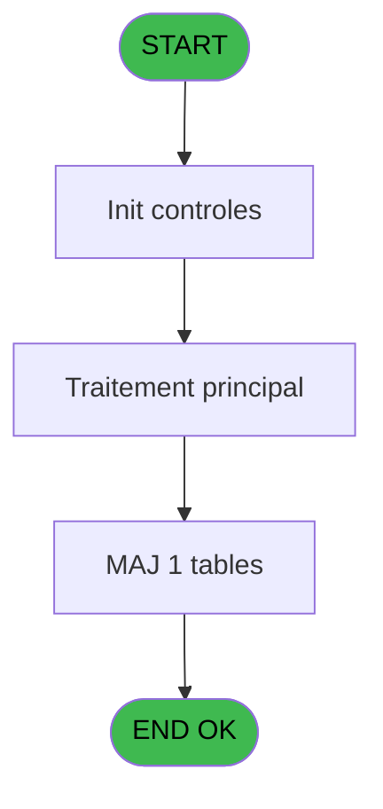
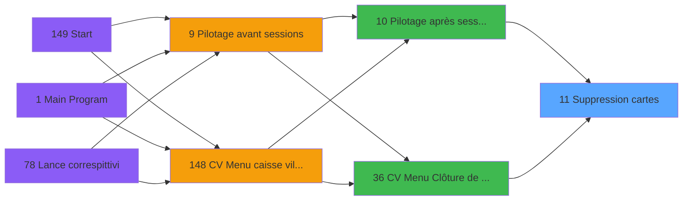

# VIL IDE 11 - Suppression cartes

> **Analyse**: Phases 1-4 2026-02-03 00:58 -> 00:58 (40s) | Assemblage 00:58
> **Pipeline**: V7.2 Enrichi
> **Structure**: 4 onglets (Resume | Ecrans | Donnees | Connexions)

<!-- TAB:Resume -->

## 1. FICHE D'IDENTITE

| Attribut | Valeur |
|----------|--------|
| Projet | VIL |
| IDE Position | 11 |
| Nom Programme | Suppression cartes |
| Fichier source | `Prg_11.xml` |
| Domaine metier | General |
| Taches | 2 (1 ecrans visibles) |
| Tables modifiees | 1 |
| Programmes appeles | 0 |

## 2. DESCRIPTION FONCTIONNELLE

**Suppression cartes** assure la gestion complete de ce processus, accessible depuis [Pilotage après sessions (IDE 10)](VIL-IDE-10.md), [CV  Menu Clôture de caisse (IDE 36)](VIL-IDE-36.md).

Le flux de traitement s'organise en **1 blocs fonctionnels** :

- **Traitement** (2 taches) : traitements metier divers

**Donnees modifiees** : 1 tables en ecriture (temp_histo_sessions_caisse).

## 3. BLOCS FONCTIONNELS

### 3.1 Traitement (2 taches)

Traitements internes.

---

#### 11 - Card Control [[ECRAN]](#ecran-t1)

**Role** : Traitement : Card Control.
**Ecran** : 458 x 65 DLU (MDI) | [Voir mockup](#ecran-t1)

---

#### 11.1 - Histo

**Role** : Traitement : Histo.

## 5. REGLES METIER

*(Aucune regle metier identifiee)*

## 6. CONTEXTE

- **Appele par**: [Pilotage après sessions (IDE 10)](VIL-IDE-10.md), [CV  Menu Clôture de caisse (IDE 36)](VIL-IDE-36.md)
- **Appelle**: 0 programmes | **Tables**: 3 (W:1 R:1 L:1) | **Taches**: 2 | **Expressions**: 5

<!-- TAB:Ecrans -->

## 8. ECRANS

### 8.1 Forms visibles (1 / 2)

| # | Position | Tache | Nom | Type | Largeur | Hauteur | Bloc |
|---|----------|-------|-----|------|---------|---------|------|
| 1 | 11 | 11 | Card Control | MDI | 458 | 65 | Traitement |

### 8.2 Mockups Ecrans

---

#### 11 - Card Control
**Tache** : [11](#t1) | **Type** : MDI | **Dimensions** : 458 x 65 DLU
**Bloc** : Traitement | **Titre IDE** : Card Control

<!-- FORM-DATA:
{
    "width":  458,
    "vFactor":  8,
    "type":  "MDI",
    "hFactor":  8,
    "controls":  [
                     {
                         "x":  0,
                         "type":  "label",
                         "var":  "",
                         "y":  0,
                         "w":  458,
                         "fmt":  "",
                         "name":  "",
                         "h":  34,
                         "color":  "",
                         "text":  "",
                         "parent":  null
                     },
                     {
                         "x":  1,
                         "type":  "label",
                         "var":  "",
                         "y":  36,
                         "w":  454,
                         "fmt":  "",
                         "name":  "",
                         "h":  25,
                         "color":  "6",
                         "text":  "",
                         "parent":  null
                     },
                     {
                         "x":  165,
                         "type":  "edit",
                         "var":  "",
                         "y":  44,
                         "w":  126,
                         "fmt":  "",
                         "name":  "",
                         "h":  10,
                         "color":  "6",
                         "text":  "",
                         "parent":  4
                     },
                     {
                         "x":  6,
                         "type":  "image",
                         "var":  "",
                         "y":  3,
                         "w":  73,
                         "fmt":  "",
                         "name":  "",
                         "h":  26,
                         "color":  "",
                         "text":  "",
                         "parent":  null
                     },
                     {
                         "x":  108,
                         "type":  "edit",
                         "var":  "",
                         "y":  3,
                         "w":  326,
                         "fmt":  "100",
                         "name":  "",
                         "h":  26,
                         "color":  "7",
                         "text":  "",
                         "parent":  null
                     }
                 ],
    "taskId":  "11",
    "height":  65
}
-->

<strong>Champs : 2 champs</strong>

| Pos (x,y) | Nom | Variable | Type |
|-----------|-----|----------|------|
| 165,44 | (sans nom) | - | edit |
| 108,3 | 100 | - | edit |

## 9. NAVIGATION

Ecran unique: **Card Control**

### 9.3 Structure hierarchique (2 taches)

| Position | Tache | Type | Dimensions | Bloc |
|----------|-------|------|------------|------|
| **11.1** | [**Card Control** (11)](#t1) [mockup](#ecran-t1) | MDI | 458x65 | Traitement |
| 11.1.1 | [Histo (11.1)](#t2) | MDI | - | |

### 9.4 Algorigramme

> **Legende**: Vert = START/END OK | Rouge = END KO | Bleu = Decisions
> *Algorigramme auto-genere. Utiliser `/algorigramme` pour une synthese metier detaillee.*

<!-- TAB:Donnees -->

## 10. TABLES

### Tables utilisees (3)

| ID | Nom | Description | Type | R | W | L | Usages |
|----|-----|-------------|------|---|---|---|--------|
| 30 | gm-recherche_____gmr | Index de recherche | DB | R |   |   | 1 |
| 312 | ez_card |  | DB |   |   | L | 1 |
| 460 | temp_histo_sessions_caisse | Sessions de caisse | DB |   | **W** |   | 1 |

### Colonnes par table (0 / 2 tables avec colonnes identifiees)

Table 30 - gm-recherche_____gmr (R) - 1 usages

*Table utilisee uniquement en Link ou aucune colonne Real identifiee dans le DataView.*

Table 460 - temp_histo_sessions_caisse (**W**) - 1 usages

*Table utilisee uniquement en Link ou aucune colonne Real identifiee dans le DataView.*

## 11. VARIABLES

*(Programme sans variables locales mappees)*

## 12. EXPRESSIONS

**5 / 5 expressions decodees (100%)**

### 12.1 Repartition par type

| Type | Expressions | Regles |
|------|-------------|--------|
| OTHER | 4 | 0 |
| NEGATION | 1 | 0 |

### 12.2 Expressions cles par type

#### OTHER (4 expressions)

| Type | IDE | Expression | Regle |
|------|-----|------------|-------|
| OTHER | 3 | `[C]` | - |
| OTHER | 5 | `ASCIIChr (10)&'Processing ... Please wait'` | - |
| OTHER | 1 | `Existe GM [A]` | - |
| OTHER | 2 | `[B]` | - |

#### NEGATION (1 expressions)

| Type | IDE | Expression | Regle |
|------|-----|------------|-------|
| NEGATION | 4 | `NOT ([K])` | - |

<!-- TAB:Connexions -->

## 13. GRAPHE D'APPELS

### 13.1 Chaine depuis Main (Callers)

Main -> ... -> [Pilotage après sessions (IDE 10)](VIL-IDE-10.md) -> **Suppression cartes (IDE 11)**

Main -> ... -> [CV  Menu Clôture de caisse (IDE 36)](VIL-IDE-36.md) -> **Suppression cartes (IDE 11)**

### 13.2 Callers

| IDE | Nom Programme | Nb Appels |
|-----|---------------|-----------|
| [10](VIL-IDE-10.md) | Pilotage après sessions | 1 |
| [36](VIL-IDE-36.md) | CV  Menu Clôture de caisse | 1 |

### 13.3 Callees (programmes appeles)

### 13.4 Detail Callees avec contexte

| IDE | Nom Programme | Appels | Contexte |
|-----|---------------|--------|----------|
| - | (aucun) | - | - |

## 14. RECOMMANDATIONS MIGRATION

### 14.1 Profil du programme

| Metrique | Valeur | Impact migration |
|----------|--------|-----------------|
| Lignes de logique | 44 | Programme compact |
| Expressions | 5 | Peu de logique |
| Tables WRITE | 1 | Impact faible |
| Sous-programmes | 0 | Peu de dependances |
| Ecrans visibles | 1 | Ecran unique ou traitement batch |
| Code desactive | 0% (0 / 44) | Code sain |
| Regles metier | 0 | Pas de regle identifiee |

### 14.2 Plan de migration par bloc

#### Traitement (2 taches: 1 ecran, 1 traitement)

- **Strategie** : Orchestrateur avec 1 ecrans (Razor/React) et 1 traitements backend (services).
- Les ecrans deviennent des composants UI, les traitements invisibles deviennent des services injectables.
- Decomposer les taches en services unitaires testables.

### 14.3 Dependances critiques

| Dependance | Type | Appels | Impact |
|------------|------|--------|--------|
| temp_histo_sessions_caisse | Table WRITE (Database) | 1x | Schema + repository |

---
*Spec DETAILED generee par Pipeline V7.2 - 2026-02-03 00:58*
