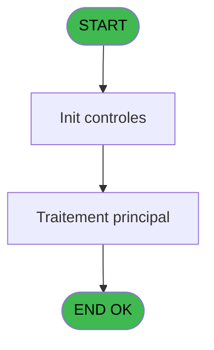
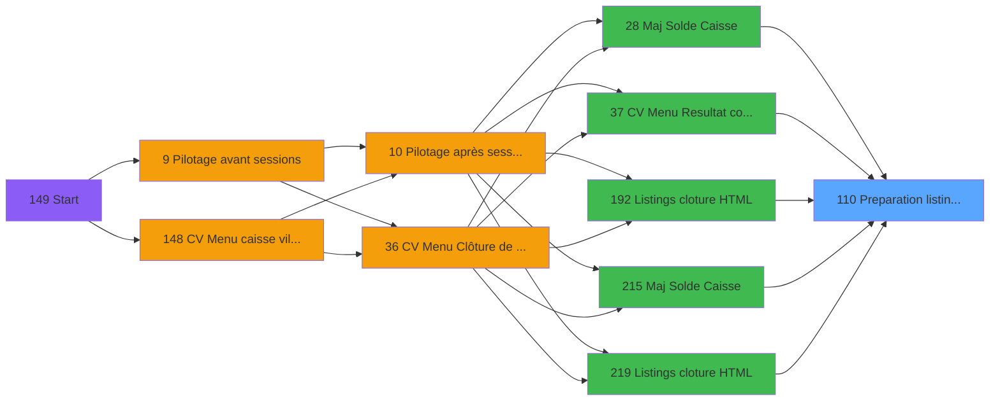

# VIL IDE 110 - Preparation listing comptable

> **Analyse**: Phases 1-4 2026-02-03 09:26 -> 09:27 (20s) | Assemblage 09:27
> **Pipeline**: V7.2 Enrichi
> **Structure**: 4 onglets (Resume | Ecrans | Donnees | Connexions)

<!-- TAB:Resume -->

## 1. FICHE D'IDENTITE

| Attribut | Valeur |
|----------|--------|
| Projet | VIL |
| IDE Position | 110 |
| Nom Programme | Preparation listing comptable |
| Fichier source | `Prg_110.xml` |
| Domaine metier | General |
| Taches | 4 (0 ecrans visibles) |
| Tables modifiees | 0 |
| Programmes appeles | 0 |

## 2. DESCRIPTION FONCTIONNELLE

**Preparation listing comptable** assure la gestion complete de ce processus, accessible depuis [    Maj Solde Caisse (IDE 28)](VIL-IDE-28.md), [CV Menu Resultat comptable (IDE 37)](VIL-IDE-37.md), [    Listings cloture HTML (IDE 192)](VIL-IDE-192.md), [    Maj Solde Caisse (IDE 215)](VIL-IDE-215.md), [    Listings cloture HTML (IDE 219)](VIL-IDE-219.md).

Le flux de traitement s'organise en **2 blocs fonctionnels** :

- **Traitement** (3 taches) : traitements metier divers
- **Calcul** (1 tache) : calculs de montants, stocks ou compteurs

Detail : phases du traitement

#### Phase 1 : Calcul (1 tache)

- **110** - Preparation listing comptable

#### Phase 2 : Traitement (3 taches)

- **110.1** - Cpte versement retrait
- **110.2** - Load ecritures
- **110.3** - Load ecritures

## 3. BLOCS FONCTIONNELS

### 3.1 Calcul (1 tache)

Calculs metier : montants, stocks, compteurs.

---

#### 110 - Preparation listing comptable

**Role** : Traitement : Preparation listing comptable.
**Variables liees** : B (Param date comptable), C (Param comptable ou vente (C/V))

### 3.2 Traitement (3 taches)

Traitements internes.

---

#### 110.1 - Cpte versement retrait

**Role** : Traitement : Cpte versement retrait.
**Variables liees** : D (Cpte versement retrait NON CASH), E (Cpte versement retrait CASH)

---

#### 110.2 - Load ecritures

**Role** : Traitement : Load ecritures.

---

#### 110.3 - Load ecritures

**Role** : Traitement : Load ecritures.

## 5. REGLES METIER

*(Aucune regle metier identifiee)*

## 6. CONTEXTE

- **Appele par**: [    Maj Solde Caisse (IDE 28)](VIL-IDE-28.md), [CV Menu Resultat comptable (IDE 37)](VIL-IDE-37.md), [    Listings cloture HTML (IDE 192)](VIL-IDE-192.md), [    Maj Solde Caisse (IDE 215)](VIL-IDE-215.md), [    Listings cloture HTML (IDE 219)](VIL-IDE-219.md)
- **Appelle**: 0 programmes | **Tables**: 4 (W:0 R:3 L:1) | **Taches**: 4 | **Expressions**: 3

<!-- TAB:Ecrans -->

## 8. ECRANS

*(Programme sans ecran visible)*

## 9. NAVIGATION

### 9.3 Structure hierarchique (4 taches)

| Position | Tache | Type | Dimensions | Bloc |
|----------|-------|------|------------|------|
| **110.1** | [**Preparation listing comptable** (110)](#t1) | MDI | - | Calcul |
| **110.2** | [**Cpte versement retrait** (110.1)](#t2) | MDI | - | Traitement |
| 110.2.1 | [Load ecritures (110.2)](#t3) | MDI | - | |
| 110.2.2 | [Load ecritures (110.3)](#t6) | MDI | - | |

### 9.4 Algorigramme

> **Legende**: Vert = START/END OK | Rouge = END KO | Bleu = Decisions
> *Algorigramme auto-genere. Utiliser `/algorigramme` pour une synthese metier detaillee.*

<!-- TAB:Donnees -->

## 10. TABLES

### Tables utilisees (4)

| ID | Nom | Description | Type | R | W | L | Usages |
|----|-----|-------------|------|---|---|---|--------|
| 40 | comptable________cte |  | DB | R |   |   | 1 |
| 263 | vente | Donnees de ventes | DB | R |   |   | 1 |
| 553 | import_logement__iml |  | DB |   |   | L | 2 |
| 697 | droits_applications | Droits operateur | DB | R |   |   | 1 |

### Colonnes par table (2 / 3 tables avec colonnes identifiees)

Table 40 - comptable________cte (R) - 1 usages

| Lettre | Variable | Acces | Type |
|--------|----------|-------|------|
| B | Param date comptable | R | Date |
| C | Param comptable ou vente (C/V) | R | Alpha |

Table 263 - vente (R) - 1 usages

| Lettre | Variable | Acces | Type |
|--------|----------|-------|------|
| C | Param comptable ou vente (C/V) | R | Alpha |

Table 697 - droits_applications (R) - 1 usages

*Table utilisee uniquement en Link ou aucune colonne Real identifiee dans le DataView.*

## 11. VARIABLES

### 11.1 Autres (5)

Variables diverses.

| Lettre | Nom | Type | Usage dans |
|--------|-----|------|-----------|
| A | Param societe | Alpha | - |
| B | Param date comptable | Date | - |
| C | Param comptable ou vente (C/V) | Alpha | - |
| D | Cpte versement retrait NON CASH | Numeric | - |
| E | Cpte versement retrait CASH | Numeric | - |

## 12. EXPRESSIONS

**3 / 3 expressions decodees (100%)**

### 12.1 Repartition par type

| Type | Expressions | Regles |
|------|-------------|--------|
| OTHER | 1 | 0 |
| CONDITION | 2 | 0 |

### 12.2 Expressions cles par type

#### OTHER (1 expressions)

| Type | IDE | Expression | Regle |
|------|-----|------------|-------|
| OTHER | 1 | `DbDel ('{553,2}'DSOURCE,'')` | - |

#### CONDITION (2 expressions)

| Type | IDE | Expression | Regle |
|------|-----|------------|-------|
| CONDITION | 3 | `[I]='V'` | - |
| CONDITION | 2 | `[I]='C'` | - |

<!-- TAB:Connexions -->

## 13. GRAPHE D'APPELS

### 13.1 Chaine depuis Main (Callers)

Main -> ... -> [    Maj Solde Caisse (IDE 28)](VIL-IDE-28.md) -> **Preparation listing comptable (IDE 110)**

Main -> ... -> [CV Menu Resultat comptable (IDE 37)](VIL-IDE-37.md) -> **Preparation listing comptable (IDE 110)**

Main -> ... -> [    Listings cloture HTML (IDE 192)](VIL-IDE-192.md) -> **Preparation listing comptable (IDE 110)**

Main -> ... -> [    Maj Solde Caisse (IDE 215)](VIL-IDE-215.md) -> **Preparation listing comptable (IDE 110)**

Main -> ... -> [    Listings cloture HTML (IDE 219)](VIL-IDE-219.md) -> **Preparation listing comptable (IDE 110)**

### 13.2 Callers

| IDE | Nom Programme | Nb Appels |
|-----|---------------|-----------|
| [28](VIL-IDE-28.md) |     Maj Solde Caisse | 1 |
| [37](VIL-IDE-37.md) | CV Menu Resultat comptable | 1 |
| [192](VIL-IDE-192.md) |     Listings cloture HTML | 1 |
| [215](VIL-IDE-215.md) |     Maj Solde Caisse | 1 |
| [219](VIL-IDE-219.md) |     Listings cloture HTML | 1 |

### 13.3 Callees (programmes appeles)

### 13.4 Detail Callees avec contexte

| IDE | Nom Programme | Appels | Contexte |
|-----|---------------|--------|----------|
| - | (aucun) | - | - |

## 14. RECOMMANDATIONS MIGRATION

### 14.1 Profil du programme

| Metrique | Valeur | Impact migration |
|----------|--------|-----------------|
| Lignes de logique | 129 | Programme compact |
| Expressions | 3 | Peu de logique |
| Tables WRITE | 0 | Impact faible |
| Sous-programmes | 0 | Peu de dependances |
| Ecrans visibles | 0 | Ecran unique ou traitement batch |
| Code desactive | 0% (0 / 129) | Code sain |
| Regles metier | 0 | Pas de regle identifiee |

### 14.2 Plan de migration par bloc

#### Calcul (1 tache: 0 ecran, 1 traitement)

- **Strategie** : Services de calcul purs (Domain Services).
- Migrer la logique de calcul (stock, compteurs, montants)

#### Traitement (3 taches: 0 ecran, 3 traitements)

- **Strategie** : 3 service(s) backend injectable(s) (Domain Services).
- Decomposer les taches en services unitaires testables.

### 14.3 Dependances critiques

| Dependance | Type | Appels | Impact |
|------------|------|--------|--------|

---
*Spec DETAILED generee par Pipeline V7.2 - 2026-02-03 09:27*
