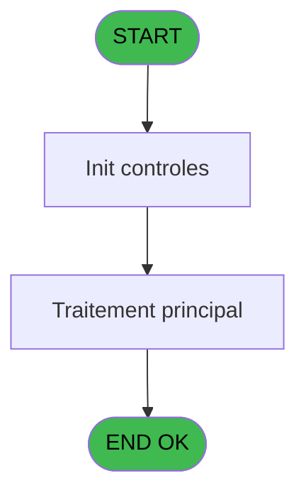
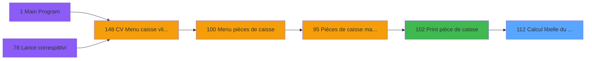

# VIL IDE 112 - Calcul libelle du montant

> **Analyse**: Phases 1-4 2026-02-03 09:27 -> 09:27 (21s) | Assemblage 09:28
> **Pipeline**: V7.2 Enrichi
> **Structure**: 4 onglets (Resume | Ecrans | Donnees | Connexions)

<!-- TAB:Resume -->

## 1. FICHE D'IDENTITE

| Attribut | Valeur |
|----------|--------|
| Projet | VIL |
| IDE Position | 112 |
| Nom Programme | Calcul libelle du montant |
| Fichier source | `Prg_112.xml` |
| Domaine metier | General |
| Taches | 2 (0 ecrans visibles) |
| Tables modifiees | 0 |
| Programmes appeles | 0 |

## 2. DESCRIPTION FONCTIONNELLE

**Calcul libelle du montant** assure la gestion complete de ce processus, accessible depuis [Print pièce de caisse (IDE 102)](VIL-IDE-102.md).

Le flux de traitement s'organise en **2 blocs fonctionnels** :

- **Traitement** (1 tache) : traitements metier divers
- **Calcul** (1 tache) : calculs de montants, stocks ou compteurs

**Logique metier** : 5 regles identifiees couvrant conditions metier.

Detail : phases du traitement

#### Phase 1 : Calcul (1 tache)

- **112** - Calcul libelle du montant

#### Phase 2 : Traitement (1 tache)

- **112.1** - libelle

## 3. BLOCS FONCTIONNELS

### 3.1 Calcul (1 tache)

Calculs metier : montants, stocks, compteurs.

---

#### 112 - Calcul libelle du montant

**Role** : Calcul : Calcul libelle du montant.
**Variables liees** : B (Param Libelle monnaie), C (Param Libelle monnaie centimes), E (Param Montant), F (Param Libelle), G (Libelle centaine 1er)

### 3.2 Traitement (1 tache)

Traitements internes.

---

#### 112.1 - libelle

**Role** : Traitement : libelle.
**Variables liees** : B (Param Libelle monnaie), C (Param Libelle monnaie centimes), F (Param Libelle), G (Libelle centaine 1er), H (Libelle centaine 2em)

## 5. REGLES METIER

5 regles identifiees:

### Autres (5 regles)

#### [RM-001] Traitement si Trim (Libelle centaine 1er [G])='un','cent',IF (Trim (Libelle centaine 1er [G]) est renseigne

| Element | Detail |
|---------|--------|
| **Condition** | `Trim (Libelle centaine 1er [G])='un'` |
| **Si vrai** | 'cent' |
| **Si faux** | IF (Trim (Libelle centaine 1er [G])<>'',Trim (Libelle centaine 1er [G])&' '&'cent'&IF (Fix (Param Montant [E],2,0)=0,'s',''),'')) |
| **Variables** | E (Param Montant), G (Libelle centaine 1er) |
| **Expression source** | Expression 4 : `IF (Trim (Libelle centaine 1er [G])='un','cent',IF (Trim (Li` |
| **Exemple** | Si Trim (Libelle centaine 1er [G])='un' → 'cent' |
| **Impact** | [112.1 - libelle](#t2) |

#### [RM-002] Traitement si Trim (Libelle centaine 2em [H])='un','cent',IF (Trim (Libelle centaine 2em [H]) est renseigne

| Element | Detail |
|---------|--------|
| **Condition** | `Trim (Libelle centaine 2em [H])='un'` |
| **Si vrai** | 'cent' |
| **Si faux** | IF (Trim (Libelle centaine 2em [H])<>'',Trim (Libelle centaine 2em [H])&' '&'cent','')) |
| **Variables** | H (Libelle centaine 2em) |
| **Expression source** | Expression 8 : `IF (Trim (Libelle centaine 2em [H])='un','cent',IF (Trim (Li` |
| **Exemple** | Si Trim (Libelle centaine 2em [H])='un' → 'cent' |
| **Impact** | [112.1 - libelle](#t2) |

#### [RM-003] Traitement si Trim (Libelle centaine 3em [I])='un','cent',IF (Trim (Libelle centaine 3em [I]) est renseigne

| Element | Detail |
|---------|--------|
| **Condition** | `Trim (Libelle centaine 3em [I])='un'` |
| **Si vrai** | 'cent' |
| **Si faux** | IF (Trim (Libelle centaine 3em [I])<>'',Trim (Libelle centaine 3em [I])&' '&'cent','')) |
| **Variables** | I (Libelle centaine 3em) |
| **Expression source** | Expression 11 : `IF (Trim (Libelle centaine 3em [I])='un','cent',IF (Trim (Li` |
| **Exemple** | Si Trim (Libelle centaine 3em [I])='un' → 'cent' |
| **Impact** | [112.1 - libelle](#t2) |

#### [RM-004] Traitement si Trim (Libelle centaine 4em [J])='un','cent',IF (Trim (Libelle centaine 4em [J]) est renseigne

| Element | Detail |
|---------|--------|
| **Condition** | `Trim (Libelle centaine 4em [J])='un'` |
| **Si vrai** | 'cent' |
| **Si faux** | IF (Trim (Libelle centaine 4em [J])<>'',Trim (Libelle centaine 4em [J])&' '&'cent','')) |
| **Variables** | J (Libelle centaine 4em) |
| **Expression source** | Expression 15 : `IF (Trim (Libelle centaine 4em [J])='un','cent',IF (Trim (Li` |
| **Exemple** | Si Trim (Libelle centaine 4em [J])='un' → 'cent' |
| **Impact** | [112.1 - libelle](#t2) |

#### [RM-005] Traitement si Trim (Libelle centaine 5em [K])='un','cent',IF (Trim (Libelle centaine 5em [K]) est renseigne

| Element | Detail |
|---------|--------|
| **Condition** | `Trim (Libelle centaine 5em [K])='un'` |
| **Si vrai** | 'cent' |
| **Si faux** | IF (Trim (Libelle centaine 5em [K])<>'',Trim (Libelle centaine 5em [K])&' '&'cent','')) |
| **Variables** | K (Libelle centaine 5em) |
| **Expression source** | Expression 24 : `IF (Trim (Libelle centaine 5em [K])='un','cent',IF (Trim (Li` |
| **Exemple** | Si Trim (Libelle centaine 5em [K])='un' → 'cent' |
| **Impact** | [112.1 - libelle](#t2) |

## 6. CONTEXTE

- **Appele par**: [Print pièce de caisse (IDE 102)](VIL-IDE-102.md)
- **Appelle**: 0 programmes | **Tables**: 1 (W:0 R:1 L:0) | **Taches**: 2 | **Expressions**: 31

<!-- TAB:Ecrans -->

## 8. ECRANS

*(Programme sans ecran visible)*

## 9. NAVIGATION

### 9.3 Structure hierarchique (2 taches)

| Position | Tache | Type | Dimensions | Bloc |
|----------|-------|------|------------|------|
| **112.1** | [**Calcul libelle du montant** (112)](#t1) | MDI | - | Calcul |
| **112.2** | [**libelle** (112.1)](#t2) | MDI | - | Traitement |

### 9.4 Algorigramme

> **Legende**: Vert = START/END OK | Rouge = END KO | Bleu = Decisions
> *Algorigramme auto-genere. Utiliser `/algorigramme` pour une synthese metier detaillee.*

<!-- TAB:Donnees -->

## 10. TABLES

### Tables utilisees (1)

| ID | Nom | Description | Type | R | W | L | Usages |
|----|-----|-------------|------|---|---|---|--------|
| 696 | droits_par_applications | Droits operateur | DB | R |   |   | 1 |

### Colonnes par table (1 / 1 tables avec colonnes identifiees)

Table 696 - droits_par_applications (R) - 1 usages

| Lettre | Variable | Acces | Type |
|--------|----------|-------|------|
| A | Nombre | R | Numeric |
| B | Libelle | R | Alpha |

## 11. VARIABLES

### 11.1 Autres (12)

Variables diverses.

| Lettre | Nom | Type | Usage dans |
|--------|-----|------|-----------|
| A | Param Langue | Alpha | 1x refs |
| B | Param Libelle monnaie | Alpha | [112](#t1), [112.1](#t2) |
| C | Param Libelle monnaie centimes | Alpha | - |
| D | Param Nombre decimales | Numeric | 2x refs |
| E | Param Montant | Numeric | [112](#t1) |
| F | Param Libelle | Alpha | [112](#t1), [112.1](#t2) |
| G | Libelle centaine 1er | Alpha | [112](#t1), [112.1](#t2) |
| H | Libelle centaine 2em | Alpha | [112](#t1), [112.1](#t2) |
| I | Libelle centaine 3em | Alpha | [112](#t1), [112.1](#t2) |
| J | Libelle centaine 4em | Alpha | [112](#t1), [112.1](#t2) |
| K | Libelle centaine 5em | Alpha | [112](#t1), [112.1](#t2) |
| L | Libelle calcul | Alpha | [112](#t1), [112.1](#t2) |

## 12. EXPRESSIONS

**31 / 31 expressions decodees (100%)**

### 12.1 Repartition par type

| Type | Expressions | Regles |
|------|-------------|--------|
| CONCATENATION | 12 | 5 |
| CALCULATION | 1 | 0 |
| CONSTANTE | 1 | 0 |
| CONDITION | 2 | 0 |
| OTHER | 4 | 0 |
| STRING | 11 | 0 |

### 12.2 Expressions cles par type

#### CONCATENATION (12 expressions)

| Type | IDE | Expression | Regle |
|------|-----|------------|-------|
| CONCATENATION | 8 | `IF (Trim (Libelle centaine 2em [H])='un','cent',IF (Trim (Libelle centaine 2em [H])<>'',Trim (Libelle centaine 2em [H])&' '&'cent',''))` | [RM-002](#rm-RM-002) |
| CONCATENATION | 11 | `IF (Trim (Libelle centaine 3em [I])='un','cent',IF (Trim (Libelle centaine 3em [I])<>'',Trim (Libelle centaine 3em [I])&' '&'cent',''))` | [RM-003](#rm-RM-003) |
| CONCATENATION | 24 | `IF (Trim (Libelle centaine 5em [K])='un','cent',IF (Trim (Libelle centaine 5em [K])<>'',Trim (Libelle centaine 5em [K])&' '&'cent',''))` | [RM-005](#rm-RM-005) |
| CONCATENATION | 15 | `IF (Trim (Libelle centaine 4em [J])='un','cent',IF (Trim (Libelle centaine 4em [J])<>'',Trim (Libelle centaine 4em [J])&' '&'cent',''))` | [RM-004](#rm-RM-004) |
| CONCATENATION | 4 | `IF (Trim (Libelle centaine 1er [G])='un','cent',IF (Trim (Libelle centaine 1er [G])<>'',Trim (Libelle centaine 1er [G])&' '&'cent'&IF (Fix (Param Montant [E],2,0)=0,'s',''),''))` | [RM-001](#rm-RM-001) |
| ... | | *+7 autres* | |

#### CALCULATION (1 expressions)

| Type | IDE | Expression | Regle |
|------|-----|------------|-------|
| CALCULATION | 28 | `Fix (Param Montant [E],0,2)*100` | - |

#### CONSTANTE (1 expressions)

| Type | IDE | Expression | Regle |
|------|-----|------------|-------|
| CONSTANTE | 1 | `''` | - |

#### CONDITION (2 expressions)

| Type | IDE | Expression | Regle |
|------|-----|------------|-------|
| CONDITION | 20 | `Param Nombre decimales [D]=3` | - |
| CONDITION | 19 | `Param Nombre decimales [D]=2` | - |

#### OTHER (4 expressions)

| Type | IDE | Expression | Regle |
|------|-----|------------|-------|
| OTHER | 30 | `Param Langue [A]` | - |
| OTHER | 31 | `Param Montant [E]` | - |
| OTHER | 27 | `Fix (Param Montant [E],12,0)` | - |
| OTHER | 29 | `{1,1}` | - |

#### STRING (11 expressions)

| Type | IDE | Expression | Regle |
|------|-----|------------|-------|
| STRING | 16 | `Val (MID (Str (Param Montant [E],'12.3'),2,2),'2')` | - |
| STRING | 14 | `Val (MID (Str (Param Montant [E],'12.3'),1,1),'1')` | - |
| STRING | 21 | `Val (MID (Str (Param Montant [E],'12.3'),14,2),'2')` | - |
| STRING | 25 | `Val (MID (Str (Param Montant [E],'12.3'),15,2),'2')` | - |
| STRING | 23 | `Val (MID (Str (Param Montant [E],'12.3'),14,1),'1')` | - |
| ... | | *+6 autres* | |

### 12.3 Toutes les expressions (31)

Voir les 31 expressions

#### CONCATENATION (12)

| IDE | Expression Decodee |
|-----|-------------------|
| 22 | `Trim (Param Libelle [F])&IF (Trim (Libelle calcul [L])='','',' et ')&Trim (Libelle calcul [L])&IF (Fix (Param Montant [E],0,2)*100=80,'s','')&IF (Fix (Param Montant [E],0,2)*100=0,'',' '&Trim (Param Libelle monnaie ... [C]))&IF (Fix (Param Montant [E],0,2)*100>1,'s','')` |
| 26 | `Trim (Param Libelle [F])&' et'&IF (Trim (Param Libelle [F])='','',' ')&Trim (Libelle centaine 5em [K])&IF (Trim (Libelle centaine 5em [K])='','',' ')&Trim (Libelle calcul [L])&' '&Trim (Param Libelle monnaie ... [C])&IF (Fix (Param Montant [E],0,3)*100>1,'s','')` |
| 4 | `IF (Trim (Libelle centaine 1er [G])='un','cent',IF (Trim (Libelle centaine 1er [G])<>'',Trim (Libelle centaine 1er [G])&' '&'cent'&IF (Fix (Param Montant [E],2,0)=0,'s',''),''))` |
| 8 | `IF (Trim (Libelle centaine 2em [H])='un','cent',IF (Trim (Libelle centaine 2em [H])<>'',Trim (Libelle centaine 2em [H])&' '&'cent',''))` |
| 11 | `IF (Trim (Libelle centaine 3em [I])='un','cent',IF (Trim (Libelle centaine 3em [I])<>'',Trim (Libelle centaine 3em [I])&' '&'cent',''))` |
| 15 | `IF (Trim (Libelle centaine 4em [J])='un','cent',IF (Trim (Libelle centaine 4em [J])<>'',Trim (Libelle centaine 4em [J])&' '&'cent',''))` |
| 24 | `IF (Trim (Libelle centaine 5em [K])='un','cent',IF (Trim (Libelle centaine 5em [K])<>'',Trim (Libelle centaine 5em [K])&' '&'cent',''))` |
| 5 | `Trim (Libelle centaine 1er [G])&IF (Trim (Libelle centaine 1er [G])='','',' ')&Trim (Libelle calcul [L])&IF (Fix (Param Montant [E],2,0)=80,'s','')` |
| 9 | `Trim (Libelle centaine 2em [H])&IF (Trim (Libelle centaine 2em [H])='','',' ')&IF (Trim (Libelle calcul [L])='un','',Trim (Libelle calcul [L]))&IF (Trim (Libelle centaine 2em [H])&Trim (Libelle calcul [L])<>'',' mil ','')&Trim (Param Libelle [F])` |
| 13 | `Trim (Libelle centaine 3em [I])&IF (Trim (Libelle centaine 3em [I])='','',' ')&Trim (Libelle calcul [L])&IF (Trim (Libelle centaine 3em [I])&Trim (Libelle calcul [L])<>'',' million ','')&Trim (Param Libelle [F])` |
| 17 | `Trim (Libelle centaine 4em [J])&IF (Trim (Libelle centaine 4em [J])='','',' ')&Trim (Libelle calcul [L])&IF (Trim (Libelle centaine 4em [J])&Trim (Libelle calcul [L])<>'',' milliard ','')&Trim (Param Libelle [F])` |
| 18 | `Trim (Param Libelle [F])&' '&Trim (Param Libelle monnaie [B])&IF (Fix (Param Montant [E],12,0)>1,'s','')` |

#### CALCULATION (1)

| IDE | Expression Decodee |
|-----|-------------------|
| 28 | `Fix (Param Montant [E],0,2)*100` |

#### CONSTANTE (1)

| IDE | Expression Decodee |
|-----|-------------------|
| 1 | `''` |

#### CONDITION (2)

| IDE | Expression Decodee |
|-----|-------------------|
| 19 | `Param Nombre decimales [D]=2` |
| 20 | `Param Nombre decimales [D]=3` |

#### OTHER (4)

| IDE | Expression Decodee |
|-----|-------------------|
| 27 | `Fix (Param Montant [E],12,0)` |
| 29 | `{1,1}` |
| 30 | `Param Langue [A]` |
| 31 | `Param Montant [E]` |

#### STRING (11)

| IDE | Expression Decodee |
|-----|-------------------|
| 2 | `Val (MID (Str (Param Montant [E],'12.3'),10,1),'1')` |
| 3 | `Val (MID (Str (Param Montant [E],'12.3'),11,2),'2')` |
| 6 | `Val (MID (Str (Param Montant [E],'12.3'),7,1),'1')` |
| 7 | `Val (MID (Str (Param Montant [E],'12.3'),8,2),'2')` |
| 10 | `Val (MID (Str (Param Montant [E],'12.3'),4,1),'1')` |
| 12 | `Val (MID (Str (Param Montant [E],'12.3'),5,2),'2')` |
| 14 | `Val (MID (Str (Param Montant [E],'12.3'),1,1),'1')` |
| 16 | `Val (MID (Str (Param Montant [E],'12.3'),2,2),'2')` |
| 21 | `Val (MID (Str (Param Montant [E],'12.3'),14,2),'2')` |
| 23 | `Val (MID (Str (Param Montant [E],'12.3'),14,1),'1')` |
| 25 | `Val (MID (Str (Param Montant [E],'12.3'),15,2),'2')` |

<!-- TAB:Connexions -->

## 13. GRAPHE D'APPELS

### 13.1 Chaine depuis Main (Callers)

Main -> ... -> [Print pièce de caisse (IDE 102)](VIL-IDE-102.md) -> **Calcul libelle du montant (IDE 112)**

### 13.2 Callers

| IDE | Nom Programme | Nb Appels |
|-----|---------------|-----------|
| [102](VIL-IDE-102.md) | Print pièce de caisse | 1 |

### 13.3 Callees (programmes appeles)

### 13.4 Detail Callees avec contexte

| IDE | Nom Programme | Appels | Contexte |
|-----|---------------|--------|----------|
| - | (aucun) | - | - |

## 14. RECOMMANDATIONS MIGRATION

### 14.1 Profil du programme

| Metrique | Valeur | Impact migration |
|----------|--------|-----------------|
| Lignes de logique | 72 | Programme compact |
| Expressions | 31 | Peu de logique |
| Tables WRITE | 0 | Impact faible |
| Sous-programmes | 0 | Peu de dependances |
| Ecrans visibles | 0 | Ecran unique ou traitement batch |
| Code desactive | 0% (0 / 72) | Code sain |
| Regles metier | 5 | Quelques regles a preserver |

### 14.2 Plan de migration par bloc

#### Calcul (1 tache: 0 ecran, 1 traitement)

- **Strategie** : Services de calcul purs (Domain Services).
- Migrer la logique de calcul (stock, compteurs, montants)

#### Traitement (1 tache: 0 ecran, 1 traitement)

- **Strategie** : 1 service(s) backend injectable(s) (Domain Services).
- Decomposer les taches en services unitaires testables.

### 14.3 Dependances critiques

| Dependance | Type | Appels | Impact |
|------------|------|--------|--------|

---
*Spec DETAILED generee par Pipeline V7.2 - 2026-02-03 09:28*
