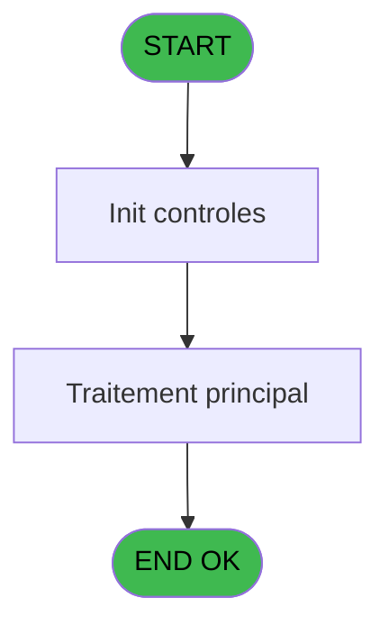

# VIL IDE 113 - Tableau Excel - Cloture Manuel

> **Analyse**: Phases 1-4 2026-02-03 09:28 -> 09:28 (22s) | Assemblage 09:28
> **Pipeline**: V7.2 Enrichi
> **Structure**: 4 onglets (Resume | Ecrans | Donnees | Connexions)

<!-- TAB:Resume -->

## 1. FICHE D'IDENTITE

| Attribut | Valeur |
|----------|--------|
| Projet | VIL |
| IDE Position | 113 |
| Nom Programme | Tableau Excel - Cloture Manuel |
| Fichier source | `Prg_113.xml` |
| Domaine metier | General |
| Taches | 8 (1 ecrans visibles) |
| Tables modifiees | 0 |
| Programmes appeles | 1 |

## 2. DESCRIPTION FONCTIONNELLE

**Tableau Excel - Cloture Manuel** assure la gestion complete de ce processus, accessible depuis [CV  Menu Clôture de caisse (IDE 36)](VIL-IDE-36.md).

Le flux de traitement s'organise en **2 blocs fonctionnels** :

- **Traitement** (7 taches) : traitements metier divers
- **Calcul** (1 tache) : calculs de montants, stocks ou compteurs

Detail : phases du traitement

#### Phase 1 : Traitement (7 taches)

- **113** - Tableau Excel - Cloture Manuel **[[ECRAN]](#ecran-t1)**
- **113.1** - Parametres
- **113.2** - Caisse
- **113.2.1** - detail
- **113.2.2** - global
- **113.3.1** - detail
- **113.3.2** - global

#### Phase 2 : Calcul (1 tache)

- **113.3** - Compte adherent

Delegue a : [Prep. list. comptable avec GP (IDE 111)](VIL-IDE-111.md)

## 3. BLOCS FONCTIONNELS

### 3.1 Traitement (7 taches)

Traitements internes.

---

#### 113 - Tableau Excel - Cloture Manuel [[ECRAN]](#ecran-t1)

**Role** : Tache d'orchestration : point d'entree du programme (7 sous-taches). Coordonne l'enchainement des traitements.
**Ecran** : 427 x 58 DLU (MDI) | [Voir mockup](#ecran-t1)

6 sous-taches directes

| Tache | Nom | Bloc |
|-------|-----|------|
| [113.1](#t2) | Parametres | Traitement |
| [113.2](#t3) | Caisse | Traitement |
| [113.2.1](#t4) | detail | Traitement |
| [113.2.2](#t5) | global | Traitement |
| [113.3.1](#t7) | detail | Traitement |
| [113.3.2](#t8) | global | Traitement |

**Variables liees** : H (Separateur Excel), I (Separateur decimal Excel)

---

#### 113.1 - Parametres

**Role** : Traitement : Parametres.

---

#### 113.2 - Caisse

**Role** : Traitement : Caisse.
**Variables liees** : K (Ancien solde caisse), L (Solde caisse date comptable), P (total debit caisse), Q (total credit caisse), U (total global debit caisse)

---

#### 113.2.1 - detail

**Role** : Traitement : detail.
**Variables liees** : D (Param Mode detail ou global)

---

#### 113.2.2 - global

**Role** : Traitement : global.
**Variables liees** : D (Param Mode detail ou global), U (total global debit caisse), V (total global credit caisse), W (total global debit adherent), X (total global credit adherent)

---

#### 113.3.1 - detail

**Role** : Traitement : detail.
**Variables liees** : D (Param Mode detail ou global)

---

#### 113.3.2 - global

**Role** : Traitement : global.
**Variables liees** : D (Param Mode detail ou global), U (total global debit caisse), V (total global credit caisse), W (total global debit adherent), X (total global credit adherent)

### 3.2 Calcul (1 tache)

Calculs metier : montants, stocks, compteurs.

---

#### 113.3 - Compte adherent

**Role** : Traitement : Compte adherent.
**Variables liees** : F (Param Compte versement/retrait), R (Ancien solde adherent), S (total debit adherent), T (total credit adherent), W (total global debit adherent)
**Delegue a** : [Prep. list. comptable avec GP (IDE 111)](VIL-IDE-111.md)

## 5. REGLES METIER

*(Aucune regle metier identifiee)*

## 6. CONTEXTE

- **Appele par**: [CV  Menu Clôture de caisse (IDE 36)](VIL-IDE-36.md)
- **Appelle**: 1 programmes | **Tables**: 8 (W:0 R:4 L:5) | **Taches**: 8 | **Expressions**: 9

<!-- TAB:Ecrans -->

## 8. ECRANS

### 8.1 Forms visibles (1 / 8)

| # | Position | Tache | Nom | Type | Largeur | Hauteur | Bloc |
|---|----------|-------|-----|------|---------|---------|------|
| 1 | 113 | 113 | Tableau Excel - Cloture Manuel | MDI | 427 | 58 | Traitement |

### 8.2 Mockups Ecrans

---

#### 113 - Tableau Excel - Cloture Manuel
**Tache** : [113](#t1) | **Type** : MDI | **Dimensions** : 427 x 58 DLU
**Bloc** : Traitement | **Titre IDE** : Tableau Excel - Cloture Manuel

<!-- FORM-DATA:
{
    "width":  427,
    "vFactor":  8,
    "type":  "MDI",
    "hFactor":  8,
    "controls":  [
                     {
                         "x":  0,
                         "type":  "label",
                         "var":  "",
                         "y":  0,
                         "w":  423,
                         "fmt":  "",
                         "name":  "",
                         "h":  29,
                         "color":  "",
                         "text":  "",
                         "parent":  null
                     },
                     {
                         "x":  117,
                         "type":  "label",
                         "var":  "",
                         "y":  10,
                         "w":  275,
                         "fmt":  "",
                         "name":  "",
                         "h":  8,
                         "color":  "7",
                         "text":  "Generation en cours ...",
                         "parent":  null
                     },
                     {
                         "x":  0,
                         "type":  "label",
                         "var":  "",
                         "y":  29,
                         "w":  423,
                         "fmt":  "",
                         "name":  "",
                         "h":  27,
                         "color":  "",
                         "text":  "",
                         "parent":  null
                     },
                     {
                         "x":  82,
                         "type":  "label",
                         "var":  "",
                         "y":  39,
                         "w":  254,
                         "fmt":  "",
                         "name":  "",
                         "h":  8,
                         "color":  "",
                         "text":  "Tableau Excel",
                         "parent":  null
                     },
                     {
                         "x":  1,
                         "type":  "image",
                         "var":  "",
                         "y":  2,
                         "w":  72,
                         "fmt":  "",
                         "name":  "",
                         "h":  25,
                         "color":  "",
                         "text":  "",
                         "parent":  null
                     }
                 ],
    "taskId":  "113",
    "height":  58
}
-->

## 9. NAVIGATION

Ecran unique: **Tableau Excel - Cloture Manuel**

### 9.3 Structure hierarchique (8 taches)

| Position | Tache | Type | Dimensions | Bloc |
|----------|-------|------|------------|------|
| **113.1** | [**Tableau Excel - Cloture Manuel** (113)](#t1) [mockup](#ecran-t1) | MDI | 427x58 | Traitement |
| 113.1.1 | [Parametres (113.1)](#t2) | MDI | - | |
| 113.1.2 | [Caisse (113.2)](#t3) | MDI | - | |
| 113.1.3 | [detail (113.2.1)](#t4) | MDI | - | |
| 113.1.4 | [global (113.2.2)](#t5) | MDI | - | |
| 113.1.5 | [detail (113.3.1)](#t7) | MDI | - | |
| 113.1.6 | [global (113.3.2)](#t8) | MDI | - | |
| **113.2** | [**Compte adherent** (113.3)](#t6) | MDI | - | Calcul |

### 9.4 Algorigramme

> **Legende**: Vert = START/END OK | Rouge = END KO | Bleu = Decisions
> *Algorigramme auto-genere. Utiliser `/algorigramme` pour une synthese metier detaillee.*

<!-- TAB:Donnees -->

## 10. TABLES

### Tables utilisees (8)

| ID | Nom | Description | Type | R | W | L | Usages |
|----|-----|-------------|------|---|---|---|--------|
| 31 | gm-complet_______gmc |  | DB | R |   |   | 1 |
| 54 | pieces_caisse____pks | Sessions de caisse | DB | R |   |   | 2 |
| 55 | solde_caisse_____sks | Sessions de caisse | DB | R |   |   | 1 |
| 69 | initialisation___ini |  | DB |   |   | L | 1 |
| 224 | complement_pieces_de_caisse | Sessions de caisse | DB |   |   | L | 2 |
| 253 | solde_compte_adherent | Comptes GM (generaux) | DB |   |   | L | 1 |
| 553 | import_logement__iml |  | DB | R |   | L | 2 |
| 697 | droits_applications | Droits operateur | DB |   |   | L | 1 |

### Colonnes par table (4 / 4 tables avec colonnes identifiees)

Table 31 - gm-complet_______gmc (R) - 1 usages

*Table utilisee uniquement en Link ou aucune colonne Real identifiee dans le DataView.*

Table 54 - pieces_caisse____pks (R) - 2 usages

| Lettre | Variable | Acces | Type |
|--------|----------|-------|------|
| K | Ancien solde caisse | R | Numeric |
| L | Solde caisse date comptable | R | Numeric |
| P | total debit caisse | R | Numeric |
| Q | total credit caisse | R | Numeric |
| U | total global debit caisse | R | Numeric |
| V | total global credit caisse | R | Numeric |

Table 55 - solde_caisse_____sks (R) - 1 usages

| Lettre | Variable | Acces | Type |
|--------|----------|-------|------|
| K | Ancien solde caisse | R | Numeric |
| L | Solde caisse date comptable | R | Numeric |
| P | total debit caisse | R | Numeric |
| Q | total credit caisse | R | Numeric |
| R | Ancien solde adherent | R | Numeric |
| U | total global debit caisse | R | Numeric |
| V | total global credit caisse | R | Numeric |

Table 553 - import_logement__iml (R/L) - 2 usages

*Table utilisee uniquement en Link ou aucune colonne Real identifiee dans le DataView.*

## 11. VARIABLES

### 11.1 Autres (28)

Variables diverses.

| Lettre | Nom | Type | Usage dans |
|--------|-----|------|-----------|
| A | Param societe | Alpha | - |
| B | Param date comptable demandee | Date | - |
| C | Param Masque | Alpha | - |
| D | Param Mode detail ou global | Alpha | - |
| E | Param Format fixe ou variable | Alpha | - |
| F | Param Compte versement/retrait | Alpha | - |
| G | Nom fichier | Alpha | - |
| H | Separateur Excel | Alpha | - |
| I | Separateur decimal Excel | Alpha | - |
| J | Separateur decimal magic | Alpha | - |
| K | Ancien solde caisse | Numeric | [113.2](#t3) |
| L | Solde caisse date comptable | Numeric | - |
| M | Versements | Numeric | 1x refs |
| N | retraits | Numeric | 1x refs |
| O | Code village | Alpha | - |
| P | total debit caisse | Numeric | - |
| Q | total credit caisse | Numeric | - |
| R | Ancien solde adherent | Numeric | - |
| S | total debit adherent | Numeric | - |
| T | total credit adherent | Numeric | - |
| U | total global debit caisse | Numeric | - |
| V | total global credit caisse | Numeric | - |
| W | total global debit adherent | Numeric | - |
| X | total global credit adherent | Numeric | - |
| Y | Ligne variable | Alpha | - |
| Z | Libelle VERSEMENT | Alpha | - |
| BA | Libelle RETRAIT | Alpha | - |
| BB | Montant zero | Numeric | - |

Toutes les 28 variables (liste complete)

| Cat | Lettre | Nom Variable | Type |
|-----|--------|--------------|------|
| Autre | **A** | Param societe | Alpha |
| Autre | **B** | Param date comptable demandee | Date |
| Autre | **C** | Param Masque | Alpha |
| Autre | **D** | Param Mode detail ou global | Alpha |
| Autre | **E** | Param Format fixe ou variable | Alpha |
| Autre | **F** | Param Compte versement/retrait | Alpha |
| Autre | **G** | Nom fichier | Alpha |
| Autre | **H** | Separateur Excel | Alpha |
| Autre | **I** | Separateur decimal Excel | Alpha |
| Autre | **J** | Separateur decimal magic | Alpha |
| Autre | **K** | Ancien solde caisse | Numeric |
| Autre | **L** | Solde caisse date comptable | Numeric |
| Autre | **M** | Versements | Numeric |
| Autre | **N** | retraits | Numeric |
| Autre | **O** | Code village | Alpha |
| Autre | **P** | total debit caisse | Numeric |
| Autre | **Q** | total credit caisse | Numeric |
| Autre | **R** | Ancien solde adherent | Numeric |
| Autre | **S** | total debit adherent | Numeric |
| Autre | **T** | total credit adherent | Numeric |
| Autre | **U** | total global debit caisse | Numeric |
| Autre | **V** | total global credit caisse | Numeric |
| Autre | **W** | total global debit adherent | Numeric |
| Autre | **X** | total global credit adherent | Numeric |
| Autre | **Y** | Ligne variable | Alpha |
| Autre | **Z** | Libelle VERSEMENT | Alpha |
| Autre | **BA** | Libelle RETRAIT | Alpha |
| Autre | **BB** | Montant zero | Numeric |

## 12. EXPRESSIONS

**9 / 9 expressions decodees (100%)**

### 12.1 Repartition par type

| Type | Expressions | Regles |
|------|-------------|--------|
| CONSTANTE | 5 | 0 |
| CONCATENATION | 1 | 0 |
| OTHER | 2 | 0 |
| CAST_LOGIQUE | 1 | 0 |

### 12.2 Expressions cles par type

#### CONSTANTE (5 expressions)

| Type | IDE | Expression | Regle |
|------|-----|------------|-------|
| CONSTANTE | 7 | `'C'` | - |
| CONSTANTE | 8 | `'CAISSE'` | - |
| CONSTANTE | 6 | `'RETRAITS'` | - |
| CONSTANTE | 2 | `'\|'` | - |
| CONSTANTE | 5 | `'VERSEMENTS'` | - |

#### CONCATENATION (1 expressions)

| Type | IDE | Expression | Regle |
|------|-----|------------|-------|
| CONCATENATION | 1 | `'D:\DATA\'&Param Mode detail ou g... [D]&DStr (Param date comptable d... [B],'YYYYMMDD')&'DC.TXT'` | - |

#### OTHER (2 expressions)

| Type | IDE | Expression | Regle |
|------|-----|------------|-------|
| OTHER | 9 | `{1,1}` | - |
| OTHER | 3 | `INIGet ('DecimalSeparator')` | - |

#### CAST_LOGIQUE (1 expressions)

| Type | IDE | Expression | Regle |
|------|-----|------------|-------|
| CAST_LOGIQUE | 4 | `INIPut ('DecimalSeparator  = '&Ancien solde caisse [K],'FALSE'LOG)` | - |

<!-- TAB:Connexions -->

## 13. GRAPHE D'APPELS

### 13.1 Chaine depuis Main (Callers)

Main -> ... -> [CV  Menu Clôture de caisse (IDE 36)](VIL-IDE-36.md) -> **Tableau Excel - Cloture Manuel (IDE 113)**

### 13.2 Callers

| IDE | Nom Programme | Nb Appels |
|-----|---------------|-----------|
| [36](VIL-IDE-36.md) | CV  Menu Clôture de caisse | 2 |

### 13.3 Callees (programmes appeles)

### 13.4 Detail Callees avec contexte

| IDE | Nom Programme | Appels | Contexte |
|-----|---------------|--------|----------|
| [111](VIL-IDE-111.md) | Prep. list. comptable avec GP | 1 | Configuration impression |

## 14. RECOMMANDATIONS MIGRATION

### 14.1 Profil du programme

| Metrique | Valeur | Impact migration |
|----------|--------|-----------------|
| Lignes de logique | 363 | Taille moyenne |
| Expressions | 9 | Peu de logique |
| Tables WRITE | 0 | Impact faible |
| Sous-programmes | 1 | Peu de dependances |
| Ecrans visibles | 1 | Ecran unique ou traitement batch |
| Code desactive | 0% (0 / 363) | Code sain |
| Regles metier | 0 | Pas de regle identifiee |

### 14.2 Plan de migration par bloc

#### Traitement (7 taches: 1 ecran, 6 traitements)

- **Strategie** : Orchestrateur avec 1 ecrans (Razor/React) et 6 traitements backend (services).
- Les ecrans deviennent des composants UI, les traitements invisibles deviennent des services injectables.
- 1 sous-programme(s) a migrer ou a reutiliser depuis les services existants.
- Decomposer les taches en services unitaires testables.

#### Calcul (1 tache: 0 ecran, 1 traitement)

- **Strategie** : Services de calcul purs (Domain Services).
- Migrer la logique de calcul (stock, compteurs, montants)

### 14.3 Dependances critiques

| Dependance | Type | Appels | Impact |
|------------|------|--------|--------|
| [Prep. list. comptable avec GP (IDE 111)](VIL-IDE-111.md) | Sous-programme | 1x | Normale - Configuration impression |

---
*Spec DETAILED generee par Pipeline V7.2 - 2026-02-03 09:28*
