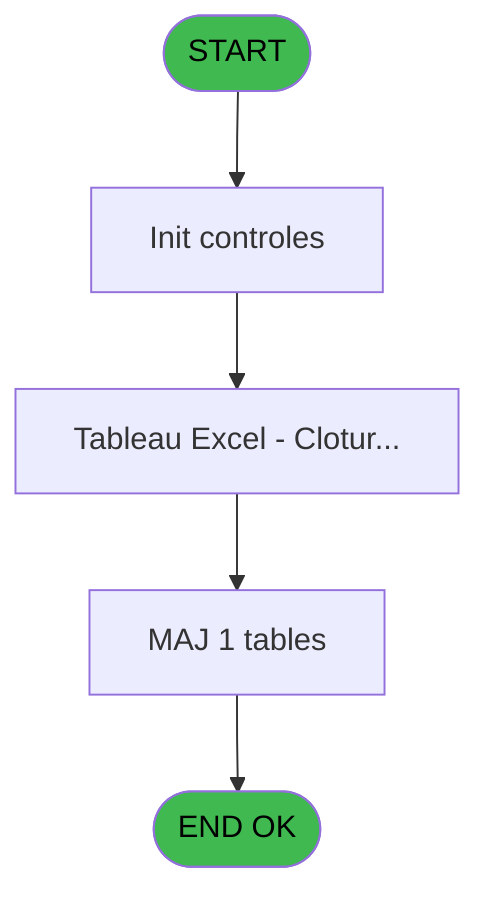

# VIL IDE 114 - Tableau Excel - Cloture Auto

> **Analyse**: Phases 1-4 2026-02-03 09:28 -> 09:29 (20s) | Assemblage 09:29
> **Pipeline**: V7.2 Enrichi
> **Structure**: 4 onglets (Resume | Ecrans | Donnees | Connexions)

<!-- TAB:Resume -->

## 1. FICHE D'IDENTITE

| Attribut | Valeur |
|----------|--------|
| Projet | VIL |
| IDE Position | 114 |
| Nom Programme | Tableau Excel - Cloture Auto |
| Fichier source | `Prg_114.xml` |
| Domaine metier | General |
| Taches | 9 (2 ecrans visibles) |
| Tables modifiees | 1 |
| Programmes appeles | 2 |

## 2. DESCRIPTION FONCTIONNELLE

**Tableau Excel - Cloture Auto** assure la gestion complete de ce processus, accessible depuis [Pilotage après sessions (IDE 10)](VIL-IDE-10.md), [CV  Menu Clôture de caisse (IDE 36)](VIL-IDE-36.md).

Le flux de traitement s'organise en **2 blocs fonctionnels** :

- **Traitement** (8 taches) : traitements metier divers
- **Calcul** (1 tache) : calculs de montants, stocks ou compteurs

**Donnees modifiees** : 1 tables en ecriture (log_cloture_auto).

**Logique metier** : 1 regles identifiees couvrant conditions metier.

Detail : phases du traitement

#### Phase 1 : Traitement (8 taches)

- **114** - Tableau Excel - Cloture Auto **[[ECRAN]](#ecran-t11)**
- **114.1** - Tableau Excel - Cloture Auto **[[ECRAN]](#ecran-t45)**
- **114.1.1** - Parametres
- **114.1.2** - Caisse
- **114.1.2.1** - detail
- **114.1.2.2** - global
- **114.1.3.1** - detail
- **114.1.3.2** - global

#### Phase 2 : Calcul (1 tache)

- **114.1.3** - Compte adherent

Delegue a : [Prep. list. comptable avec GP (IDE 111)](VIL-IDE-111.md)

#### Tables impactees

| Table | Operations | Role metier |
|-------|-----------|-------------|
| log_cloture_auto | **W** (1 usages) | Donnees reseau/cloture |

## 3. BLOCS FONCTIONNELS

### 3.1 Traitement (8 taches)

Traitements internes.

---

#### 114 - Tableau Excel - Cloture Auto [[ECRAN]](#ecran-t11)

**Role** : Traitement : Tableau Excel - Cloture Auto.
**Ecran** : 427 x 58 DLU (MDI) | [Voir mockup](#ecran-t11)
**Variables liees** : G (Param Cloture Auto)

---

#### 114.1 - Tableau Excel - Cloture Auto [[ECRAN]](#ecran-t45)

**Role** : Traitement : Tableau Excel - Cloture Auto.
**Ecran** : 427 x 58 DLU (MDI) | [Voir mockup](#ecran-t45)
**Variables liees** : G (Param Cloture Auto)

---

#### 114.1.1 - Parametres

**Role** : Traitement : Parametres.

---

#### 114.1.2 - Caisse

**Role** : Traitement : Caisse.
**Variables liees** : O (total debit caisse), P (total credit caisse), T (total global debit caisse), U (total global credit caisse)

---

#### 114.1.2.1 - detail

**Role** : Traitement : detail.
**Variables liees** : D (Param Mode detail ou global)

---

#### 114.1.2.2 - global

**Role** : Traitement : global.
**Variables liees** : D (Param Mode detail ou global), T (total global debit caisse), U (total global credit caisse), V (total global debit adherent), W (total global credit adherent)

---

#### 114.1.3.1 - detail

**Role** : Traitement : detail.
**Variables liees** : D (Param Mode detail ou global)

---

#### 114.1.3.2 - global

**Role** : Traitement : global.
**Variables liees** : D (Param Mode detail ou global), T (total global debit caisse), U (total global credit caisse), V (total global debit adherent), W (total global credit adherent)

### 3.2 Calcul (1 tache)

Calculs metier : montants, stocks, compteurs.

---

#### 114.1.3 - Compte adherent

**Role** : Traitement : Compte adherent.
**Variables liees** : F (Param Compte versement/retrait), Q (Ancien solde adherent), R (total debit adherent), S (total credit adherent), V (total global debit adherent)
**Delegue a** : [Prep. list. comptable avec GP (IDE 111)](VIL-IDE-111.md)

## 5. REGLES METIER

1 regles identifiees:

### Autres (1 regles)

#### [RM-001] Si Chemin avec \ [H] alors Trim (INIGet ('[MAGIC_LOGICAL_NAMES]club_exportdata')&'Cloture\') sinon 'D:\DATA\')

| Element | Detail |
|---------|--------|
| **Condition** | `Chemin avec \ [H]` |
| **Si vrai** | Trim (INIGet ('[MAGIC_LOGICAL_NAMES]club_exportdata')&'Cloture\') |
| **Si faux** | 'D:\DATA\') |
| **Variables** | H (Chemin avec \) |
| **Expression source** | Expression 1 : `IF (Chemin avec \ [H],Trim (INIGet ('[MAGIC_LOGICAL_NAMES]cl` |
| **Exemple** | Si Chemin avec \ [H] → Trim (INIGet ('[MAGIC_LOGICAL_NAMES]club_exportdata')&'Cloture\'). Sinon → 'D:\DATA\') |

## 6. CONTEXTE

- **Appele par**: [Pilotage après sessions (IDE 10)](VIL-IDE-10.md), [CV  Menu Clôture de caisse (IDE 36)](VIL-IDE-36.md)
- **Appelle**: 2 programmes | **Tables**: 10 (W:1 R:4 L:6) | **Taches**: 9 | **Expressions**: 21

<!-- TAB:Ecrans -->

## 8. ECRANS

### 8.1 Forms visibles (2 / 9)

| # | Position | Tache | Nom | Type | Largeur | Hauteur | Bloc |
|---|----------|-------|-----|------|---------|---------|------|
| 1 | 114.1 | 114 | Tableau Excel - Cloture Auto | MDI | 427 | 58 | Traitement |
| 2 | 114.1.1 | 114.1 | Tableau Excel - Cloture Auto | MDI | 427 | 58 | Traitement |

### 8.2 Mockups Ecrans

---

#### 114.1 - Tableau Excel - Cloture Auto
**Tache** : [114](#t11) | **Type** : MDI | **Dimensions** : 427 x 58 DLU
**Bloc** : Traitement | **Titre IDE** : Tableau Excel - Cloture Auto

<!-- FORM-DATA:
{
    "width":  427,
    "vFactor":  8,
    "type":  "MDI",
    "hFactor":  8,
    "controls":  [
                     {
                         "x":  0,
                         "type":  "label",
                         "var":  "",
                         "y":  0,
                         "w":  423,
                         "fmt":  "",
                         "name":  "",
                         "h":  29,
                         "color":  "",
                         "text":  "",
                         "parent":  null
                     },
                     {
                         "x":  117,
                         "type":  "label",
                         "var":  "",
                         "y":  10,
                         "w":  275,
                         "fmt":  "",
                         "name":  "",
                         "h":  8,
                         "color":  "7",
                         "text":  "Generation en cours ...",
                         "parent":  null
                     },
                     {
                         "x":  0,
                         "type":  "label",
                         "var":  "",
                         "y":  29,
                         "w":  423,
                         "fmt":  "",
                         "name":  "",
                         "h":  27,
                         "color":  "",
                         "text":  "",
                         "parent":  null
                     },
                     {
                         "x":  82,
                         "type":  "label",
                         "var":  "",
                         "y":  39,
                         "w":  254,
                         "fmt":  "",
                         "name":  "",
                         "h":  8,
                         "color":  "",
                         "text":  "Tableau Excel",
                         "parent":  null
                     },
                     {
                         "x":  1,
                         "type":  "image",
                         "var":  "",
                         "y":  2,
                         "w":  72,
                         "fmt":  "",
                         "name":  "",
                         "h":  25,
                         "color":  "",
                         "text":  "",
                         "parent":  null
                     }
                 ],
    "taskId":  "114.1",
    "height":  58
}
-->

---

#### 114.1.1 - Tableau Excel - Cloture Auto
**Tache** : [114.1](#t45) | **Type** : MDI | **Dimensions** : 427 x 58 DLU
**Bloc** : Traitement | **Titre IDE** : Tableau Excel - Cloture Auto

<!-- FORM-DATA:
{
    "width":  427,
    "vFactor":  8,
    "type":  "MDI",
    "hFactor":  8,
    "controls":  [
                     {
                         "x":  0,
                         "type":  "label",
                         "var":  "",
                         "y":  0,
                         "w":  423,
                         "fmt":  "",
                         "name":  "",
                         "h":  29,
                         "color":  "",
                         "text":  "",
                         "parent":  null
                     },
                     {
                         "x":  117,
                         "type":  "label",
                         "var":  "",
                         "y":  10,
                         "w":  275,
                         "fmt":  "",
                         "name":  "",
                         "h":  8,
                         "color":  "7",
                         "text":  "Generation en cours ...",
                         "parent":  null
                     },
                     {
                         "x":  0,
                         "type":  "label",
                         "var":  "",
                         "y":  29,
                         "w":  423,
                         "fmt":  "",
                         "name":  "",
                         "h":  27,
                         "color":  "",
                         "text":  "",
                         "parent":  null
                     },
                     {
                         "x":  82,
                         "type":  "label",
                         "var":  "",
                         "y":  39,
                         "w":  254,
                         "fmt":  "",
                         "name":  "",
                         "h":  8,
                         "color":  "",
                         "text":  "Tableau Excel",
                         "parent":  null
                     },
                     {
                         "x":  1,
                         "type":  "image",
                         "var":  "",
                         "y":  2,
                         "w":  72,
                         "fmt":  "",
                         "name":  "",
                         "h":  25,
                         "color":  "",
                         "text":  "",
                         "parent":  null
                     }
                 ],
    "taskId":  "114.1.1",
    "height":  58
}
-->

## 9. NAVIGATION

### 9.1 Enchainement des ecrans

**Detail par enchainement :**

| Depuis | Action | Vers | Retour |
|--------|--------|------|--------|
| Tableau Excel - Cloture Auto | Transfert donnees | [Transfert sur Dropbox (IDE 34)](VIL-IDE-34.md) | Retour ecran |
| Tableau Excel - Cloture Auto | Configuration impression | [Prep. list. comptable avec GP (IDE 111)](VIL-IDE-111.md) | Retour ecran |

### 9.3 Structure hierarchique (9 taches)

| Position | Tache | Type | Dimensions | Bloc |
|----------|-------|------|------------|------|
| **114.1** | [**Tableau Excel - Cloture Auto** (114)](#t11) [mockup](#ecran-t11) | MDI | 427x58 | Traitement |
| 114.1.1 | [Tableau Excel - Cloture Auto (114.1)](#t45) [mockup](#ecran-t45) | MDI | 427x58 | |
| 114.1.2 | [Parametres (114.1.1)](#t46) | MDI | - | |
| 114.1.3 | [Caisse (114.1.2)](#t47) | MDI | - | |
| 114.1.4 | [detail (114.1.2.1)](#t48) | MDI | - | |
| 114.1.5 | [global (114.1.2.2)](#t49) | MDI | - | |
| 114.1.6 | [detail (114.1.3.1)](#t51) | MDI | - | |
| 114.1.7 | [global (114.1.3.2)](#t52) | MDI | - | |
| **114.2** | [**Compte adherent** (114.1.3)](#t50) | MDI | - | Calcul |

### 9.4 Algorigramme

> **Legende**: Vert = START/END OK | Rouge = END KO | Bleu = Decisions
> *Algorigramme auto-genere. Utiliser `/algorigramme` pour une synthese metier detaillee.*

<!-- TAB:Donnees -->

## 10. TABLES

### Tables utilisees (10)

| ID | Nom | Description | Type | R | W | L | Usages |
|----|-----|-------------|------|---|---|---|--------|
| 31 | gm-complet_______gmc |  | DB | R |   |   | 1 |
| 54 | pieces_caisse____pks | Sessions de caisse | DB | R |   |   | 2 |
| 55 | solde_caisse_____sks | Sessions de caisse | DB | R |   |   | 1 |
| 69 | initialisation___ini |  | DB |   |   | L | 1 |
| 224 | complement_pieces_de_caisse | Sessions de caisse | DB |   |   | L | 2 |
| 253 | solde_compte_adherent | Comptes GM (generaux) | DB |   |   | L | 1 |
| 348 | log_cloture_auto | Donnees reseau/cloture | DB |   | **W** |   | 1 |
| 372 | pv_budget |  | DB |   |   | L | 1 |
| 553 | import_logement__iml |  | DB | R |   | L | 2 |
| 697 | droits_applications | Droits operateur | DB |   |   | L | 1 |

### Colonnes par table (5 / 5 tables avec colonnes identifiees)

Table 31 - gm-complet_______gmc (R) - 1 usages

*Table utilisee uniquement en Link ou aucune colonne Real identifiee dans le DataView.*

Table 54 - pieces_caisse____pks (R) - 2 usages

| Lettre | Variable | Acces | Type |
|--------|----------|-------|------|
| J | Ancien solde caisse | R | Numeric |
| K | Solde caisse date comptable | R | Numeric |
| O | total debit caisse | R | Numeric |
| P | total credit caisse | R | Numeric |
| T | total global debit caisse | R | Numeric |
| U | total global credit caisse | R | Numeric |

Table 55 - solde_caisse_____sks (R) - 1 usages

| Lettre | Variable | Acces | Type |
|--------|----------|-------|------|
| J | Ancien solde caisse | R | Numeric |
| K | Solde caisse date comptable | R | Numeric |
| O | total debit caisse | R | Numeric |
| P | total credit caisse | R | Numeric |
| Q | Ancien solde adherent | R | Numeric |
| T | total global debit caisse | R | Numeric |
| U | total global credit caisse | R | Numeric |

Table 348 - log_cloture_auto (**W**) - 1 usages

| Lettre | Variable | Acces | Type |
|--------|----------|-------|------|
| A | Param societe | W | Alpha |
| B | Param date comptable demandee | W | Date |
| C | Param Masque | W | Alpha |
| D | Param Mode detail ou global | W | Alpha |
| E | Param Format fixe ou variable | W | Alpha |
| F | Param Compte versement/retrait | W | Alpha |
| G | Param Cloture Auto | W | Logical |
| H | Chemin avec \ | W | Unicode |
| I | Nom fichier | W | Unicode |
| J | V.Chemin+Fichier.txt | W | Unicode |
| K | Separateur decimal magic | W | Alpha |
| L | V.Copie des fichiers ok? (>32) | W | Numeric |

Table 553 - import_logement__iml (R/L) - 2 usages

*Table utilisee uniquement en Link ou aucune colonne Real identifiee dans le DataView.*

## 11. VARIABLES

### 11.1 Variables de session (2)

Variables persistantes pendant toute la session.

| Lettre | Nom | Type | Usage dans |
|--------|-----|------|-----------|
| J | V.Chemin+Fichier.txt | Unicode | - |
| L | V.Copie des fichiers ok? (>32) | Numeric | - |

### 11.2 Autres (25)

Variables diverses.

| Lettre | Nom | Type | Usage dans |
|--------|-----|------|-----------|
| A | Param societe | Alpha | - |
| B | Param date comptable demandee | Date | - |
| C | Param Masque | Alpha | - |
| D | Param Mode detail ou global | Alpha | - |
| E | Param Format fixe ou variable | Alpha | - |
| F | Param Compte versement/retrait | Alpha | - |
| G | Param Cloture Auto | Logical | - |
| H | Chemin avec \ | Unicode | 1x refs |
| I | Nom fichier | Unicode | 3x refs |
| K | Separateur decimal magic | Alpha | - |
| M | retraits | Numeric | 1x refs |
| N | Code village | Alpha | - |
| O | total debit caisse | Numeric | - |
| P | total credit caisse | Numeric | - |
| Q | Ancien solde adherent | Numeric | - |
| R | total debit adherent | Numeric | - |
| S | total credit adherent | Numeric | - |
| T | total global debit caisse | Numeric | - |
| U | total global credit caisse | Numeric | - |
| V | total global debit adherent | Numeric | - |
| W | total global credit adherent | Numeric | - |
| X | Ligne variable | Alpha | - |
| Y | Libelle VERSEMENT | Alpha | - |
| Z | Libelle RETRAIT | Alpha | - |
| BA | Montant zero | Numeric | - |

Toutes les 27 variables (liste complete)

| Cat | Lettre | Nom Variable | Type |
|-----|--------|--------------|------|
| V. | **J** | V.Chemin+Fichier.txt | Unicode |
| V. | **L** | V.Copie des fichiers ok? (>32) | Numeric |
| Autre | **A** | Param societe | Alpha |
| Autre | **B** | Param date comptable demandee | Date |
| Autre | **C** | Param Masque | Alpha |
| Autre | **D** | Param Mode detail ou global | Alpha |
| Autre | **E** | Param Format fixe ou variable | Alpha |
| Autre | **F** | Param Compte versement/retrait | Alpha |
| Autre | **G** | Param Cloture Auto | Logical |
| Autre | **H** | Chemin avec \ | Unicode |
| Autre | **I** | Nom fichier | Unicode |
| Autre | **K** | Separateur decimal magic | Alpha |
| Autre | **M** | retraits | Numeric |
| Autre | **N** | Code village | Alpha |
| Autre | **O** | total debit caisse | Numeric |
| Autre | **P** | total credit caisse | Numeric |
| Autre | **Q** | Ancien solde adherent | Numeric |
| Autre | **R** | total debit adherent | Numeric |
| Autre | **S** | total credit adherent | Numeric |
| Autre | **T** | total global debit caisse | Numeric |
| Autre | **U** | total global credit caisse | Numeric |
| Autre | **V** | total global debit adherent | Numeric |
| Autre | **W** | total global credit adherent | Numeric |
| Autre | **X** | Ligne variable | Alpha |
| Autre | **Y** | Libelle VERSEMENT | Alpha |
| Autre | **Z** | Libelle RETRAIT | Alpha |
| Autre | **BA** | Montant zero | Numeric |

## 12. EXPRESSIONS

**21 / 21 expressions decodees (100%)**

### 12.1 Repartition par type

| Type | Expressions | Regles |
|------|-------------|--------|
| CONCATENATION | 6 | 0 |
| CONDITION | 3 | 5 |
| CONSTANTE | 6 | 0 |
| OTHER | 3 | 0 |
| CAST_LOGIQUE | 1 | 0 |
| REFERENCE_VG | 1 | 0 |
| STRING | 1 | 0 |

### 12.2 Expressions cles par type

#### CONCATENATION (6 expressions)

| Type | IDE | Expression | Regle |
|------|-----|------------|-------|
| CONCATENATION | 3 | `Param Mode detail ou g... [D]&DStr (Param date comptable d... [B],'YYYYMMDD')&'DC-'&Trim([BR])&'.TXT'` | - |
| CONCATENATION | 14 | `'Copie du fichier '&Trim(Nom fichier [I])&Trim([BK])&' vers '&Formatage_chemin_fichier(VG61)&' a échoué'` | - |
| CONCATENATION | 18 | `Trim({1,9})&Trim({1,63})` | - |
| CONCATENATION | 10 | `'cmd /c copy '&Trim([BQ])&' '&Formatage_chemin_fichier(VG61)` | - |
| CONCATENATION | 11 | `'cmd /c copy '&Trim(Nom fichier [I])&'G*.txt '&Formatage_chemin_fichier(VG61)` | - |
| ... | | *+1 autres* | |

#### CONDITION (3 expressions)

| Type | IDE | Expression | Regle |
|------|-----|------------|-------|
| CONDITION | 1 | `IF (Chemin avec \ [H],Trim (INIGet ('[MAGIC_LOGICAL_NAMES]club_exportdata')&'Cloture\'),'D:\DATA\')` | [RM-001](#rm-RM-001) |
| CONDITION | 12 | `[BL]>=32` | - |
| CONDITION | 9 | `VG60 AND Param Mode detail ou g... [D]='D'` | - |

#### CONSTANTE (6 expressions)

| Type | IDE | Expression | Regle |
|------|-----|------------|-------|
| CONSTANTE | 19 | `'VERSEMENTS'` | - |
| CONSTANTE | 20 | `'RETRAITS'` | - |
| CONSTANTE | 21 | `'C'` | - |
| CONSTANTE | 7 | `'COPY_TSFRT'` | - |
| CONSTANTE | 13 | `'ERR'` | - |
| ... | | *+1 autres* | |

#### OTHER (3 expressions)

| Type | IDE | Expression | Regle |
|------|-----|------------|-------|
| OTHER | 17 | `Time()` | - |
| OTHER | 16 | `Param date comptable d... [B]` | - |
| OTHER | 5 | `INIGet ('DecimalSeparator')` | - |

#### CAST_LOGIQUE (1 expressions)

| Type | IDE | Expression | Regle |
|------|-----|------------|-------|
| CAST_LOGIQUE | 6 | `INIPut ('DecimalSeparator  = '&V.Copie des fichiers o... [L],'FALSE'LOG)` | - |

#### REFERENCE_VG (1 expressions)

| Type | IDE | Expression | Regle |
|------|-----|------------|-------|
| REFERENCE_VG | 8 | `VG60` | - |

#### STRING (1 expressions)

| Type | IDE | Expression | Regle |
|------|-----|------------|-------|
| STRING | 4 | `Formatage_chemin_fichier(Nom fichier [I])&Trim([BK])` | - |

### 12.3 Toutes les expressions (21)

Voir les 21 expressions

#### CONCATENATION (6)

| IDE | Expression Decodee |
|-----|-------------------|
| 10 | `'cmd /c copy '&Trim([BQ])&' '&Formatage_chemin_fichier(VG61)` |
| 11 | `'cmd /c copy '&Trim(Nom fichier [I])&'G*.txt '&Formatage_chemin_fichier(VG61)` |
| 2 | `Param Mode detail ou g... [D]&DStr (Param date comptable d... [B],'YYYYMMDD')&'DC.TXT'` |
| 3 | `Param Mode detail ou g... [D]&DStr (Param date comptable d... [B],'YYYYMMDD')&'DC-'&Trim([BR])&'.TXT'` |
| 14 | `'Copie du fichier '&Trim(Nom fichier [I])&Trim([BK])&' vers '&Formatage_chemin_fichier(VG61)&' a échoué'` |
| 18 | `Trim({1,9})&Trim({1,63})` |

#### CONDITION (3)

| IDE | Expression Decodee |
|-----|-------------------|
| 1 | `IF (Chemin avec \ [H],Trim (INIGet ('[MAGIC_LOGICAL_NAMES]club_exportdata')&'Cloture\'),'D:\DATA\')` |
| 9 | `VG60 AND Param Mode detail ou g... [D]='D'` |
| 12 | `[BL]>=32` |

#### CONSTANTE (6)

| IDE | Expression Decodee |
|-----|-------------------|
| 7 | `'COPY_TSFRT'` |
| 13 | `'ERR'` |
| 15 | `'Erreur copie'` |
| 19 | `'VERSEMENTS'` |
| 20 | `'RETRAITS'` |
| 21 | `'C'` |

#### OTHER (3)

| IDE | Expression Decodee |
|-----|-------------------|
| 5 | `INIGet ('DecimalSeparator')` |
| 16 | `Param date comptable d... [B]` |
| 17 | `Time()` |

#### CAST_LOGIQUE (1)

| IDE | Expression Decodee |
|-----|-------------------|
| 6 | `INIPut ('DecimalSeparator  = '&V.Copie des fichiers o... [L],'FALSE'LOG)` |

#### REFERENCE_VG (1)

| IDE | Expression Decodee |
|-----|-------------------|
| 8 | `VG60` |

#### STRING (1)

| IDE | Expression Decodee |
|-----|-------------------|
| 4 | `Formatage_chemin_fichier(Nom fichier [I])&Trim([BK])` |

<!-- TAB:Connexions -->

## 13. GRAPHE D'APPELS

### 13.1 Chaine depuis Main (Callers)

Main -> ... -> [Pilotage après sessions (IDE 10)](VIL-IDE-10.md) -> **Tableau Excel - Cloture Auto (IDE 114)**

Main -> ... -> [CV  Menu Clôture de caisse (IDE 36)](VIL-IDE-36.md) -> **Tableau Excel - Cloture Auto (IDE 114)**

### 13.2 Callers

| IDE | Nom Programme | Nb Appels |
|-----|---------------|-----------|
| [10](VIL-IDE-10.md) | Pilotage après sessions | 2 |
| [36](VIL-IDE-36.md) | CV  Menu Clôture de caisse | 2 |

### 13.3 Callees (programmes appeles)

### 13.4 Detail Callees avec contexte

| IDE | Nom Programme | Appels | Contexte |
|-----|---------------|--------|----------|
| [34](VIL-IDE-34.md) | Transfert sur Dropbox | 1 | Transfert donnees |
| [111](VIL-IDE-111.md) | Prep. list. comptable avec GP | 1 | Configuration impression |

## 14. RECOMMANDATIONS MIGRATION

### 14.1 Profil du programme

| Metrique | Valeur | Impact migration |
|----------|--------|-----------------|
| Lignes de logique | 405 | Taille moyenne |
| Expressions | 21 | Peu de logique |
| Tables WRITE | 1 | Impact faible |
| Sous-programmes | 2 | Peu de dependances |
| Ecrans visibles | 2 | Quelques ecrans |
| Code desactive | 0.2% (1 / 405) | Code sain |
| Regles metier | 1 | Quelques regles a preserver |

### 14.2 Plan de migration par bloc

#### Traitement (8 taches: 2 ecrans, 6 traitements)

- **Strategie** : Orchestrateur avec 2 ecrans (Razor/React) et 6 traitements backend (services).
- Les ecrans deviennent des composants UI, les traitements invisibles deviennent des services injectables.
- 2 sous-programme(s) a migrer ou a reutiliser depuis les services existants.
- Decomposer les taches en services unitaires testables.

#### Calcul (1 tache: 0 ecran, 1 traitement)

- **Strategie** : Services de calcul purs (Domain Services).
- Migrer la logique de calcul (stock, compteurs, montants)

### 14.3 Dependances critiques

| Dependance | Type | Appels | Impact |
|------------|------|--------|--------|
| log_cloture_auto | Table WRITE (Database) | 1x | Schema + repository |
| [Prep. list. comptable avec GP (IDE 111)](VIL-IDE-111.md) | Sous-programme | 1x | Normale - Configuration impression |
| [Transfert sur Dropbox (IDE 34)](VIL-IDE-34.md) | Sous-programme | 1x | Normale - Transfert donnees |

---
*Spec DETAILED generee par Pipeline V7.2 - 2026-02-03 09:29*
