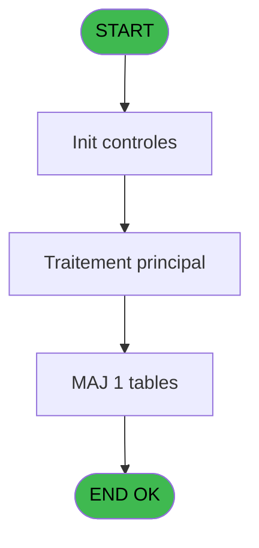

# VIL IDE 115 - Calcul solde compte adherent

> **Analyse**: Phases 1-4 2026-02-03 09:29 -> 09:29 (19s) | Assemblage 09:29
> **Pipeline**: V7.2 Enrichi
> **Structure**: 4 onglets (Resume | Ecrans | Donnees | Connexions)

<!-- TAB:Resume -->

## 1. FICHE D'IDENTITE

| Attribut | Valeur |
|----------|--------|
| Projet | VIL |
| IDE Position | 115 |
| Nom Programme | Calcul solde compte adherent |
| Fichier source | `Prg_115.xml` |
| Domaine metier | Comptabilite |
| Taches | 2 (1 ecrans visibles) |
| Tables modifiees | 1 |
| Programmes appeles | 0 |

## 2. DESCRIPTION FONCTIONNELLE

**Calcul solde compte adherent** assure la gestion complete de ce processus, accessible depuis [Pilotage après sessions (IDE 10)](VIL-IDE-10.md).

Le flux de traitement s'organise en **1 blocs fonctionnels** :

- **Traitement** (2 taches) : traitements metier divers

**Donnees modifiees** : 1 tables en ecriture (solde_compte_adherent).

**Logique metier** : 2 regles identifiees couvrant conditions metier.

## 3. BLOCS FONCTIONNELS

### 3.1 Traitement (2 taches)

Traitements internes.

---

#### 115 - Veuillez patienter ..... [[ECRAN]](#ecran-t1)

**Role** : Traitement : Veuillez patienter ......
**Ecran** : 426 x 56 DLU (MDI) | [Voir mockup](#ecran-t1)

---

#### 115.1 - Ecrit le solde en table

**Role** : Consultation/chargement : Ecrit le solde en table.
**Variables liees** : B (P0 date comptable), I (W0 string-solde), J (W0 string-solde)

## 5. REGLES METIER

2 regles identifiees:

### Autres (2 regles)

#### [RM-001] Si [Q]<0 alors Str (- ([Q]) sinon P0 masque cumul [C]),Fill (' ',17)&Str ([Q],Left (P0 masque cumul [C],17)))

| Element | Detail |
|---------|--------|
| **Condition** | `[Q]<0` |
| **Si vrai** | Str (- ([Q]) |
| **Si faux** | P0 masque cumul [C]),Fill (' ',17)&Str ([Q],Left (P0 masque cumul [C],17))) |
| **Variables** | C (P0 masque cumul) |
| **Expression source** | Expression 8 : `IF ([Q]<0,Str (- ([Q]),P0 masque cumul [C]),Fill (' ',17)&St` |
| **Exemple** | Si [Q]<0 → Str (- ([Q]) |

#### [RM-002] Si W0 cumul credit [H]+W0 cumul debit [G]<0 alors Str (- (W0 cumul credit [H]+W0 cumul debit [G]) sinon P0 masque cumul [C]),Fill (' ',17)&Str (W0 cumul credit [H]+W0 cumul debit [G],Left (P0 masque cumul [C],17)))

| Element | Detail |
|---------|--------|
| **Condition** | `W0 cumul credit [H]+W0 cumul debit [G]<0` |
| **Si vrai** | Str (- (W0 cumul credit [H]+W0 cumul debit [G]) |
| **Si faux** | P0 masque cumul [C]),Fill (' ',17)&Str (W0 cumul credit [H]+W0 cumul debit [G],Left (P0 masque cumul [C],17))) |
| **Variables** | C (P0 masque cumul), G (W0 cumul debit), H (W0 cumul credit) |
| **Expression source** | Expression 9 : `IF (W0 cumul credit [H]+W0 cumul debit [G]<0,Str (- (W0 cumu` |
| **Exemple** | Si W0 cumul credit [H]+W0 cumul debit [G]<0 → Str (- (W0 cumul credit [H]+W0 cumul debit [G]) |

## 6. CONTEXTE

- **Appele par**: [Pilotage après sessions (IDE 10)](VIL-IDE-10.md)
- **Appelle**: 0 programmes | **Tables**: 2 (W:1 R:1 L:0) | **Taches**: 2 | **Expressions**: 13

<!-- TAB:Ecrans -->

## 8. ECRANS

### 8.1 Forms visibles (1 / 2)

| # | Position | Tache | Nom | Type | Largeur | Hauteur | Bloc |
|---|----------|-------|-----|------|---------|---------|------|
| 1 | 115 | 115 | Veuillez patienter ..... | MDI | 426 | 56 | Traitement |

### 8.2 Mockups Ecrans

---

#### 115 - Veuillez patienter .....
**Tache** : [115](#t1) | **Type** : MDI | **Dimensions** : 426 x 56 DLU
**Bloc** : Traitement | **Titre IDE** : Veuillez patienter .....

<!-- FORM-DATA:
{
    "width":  426,
    "vFactor":  8,
    "type":  "MDI",
    "hFactor":  8,
    "controls":  [
                     {
                         "x":  2,
                         "type":  "label",
                         "var":  "",
                         "y":  0,
                         "w":  423,
                         "fmt":  "",
                         "name":  "",
                         "h":  29,
                         "color":  "",
                         "text":  "",
                         "parent":  null
                     },
                     {
                         "x":  119,
                         "type":  "label",
                         "var":  "",
                         "y":  10,
                         "w":  275,
                         "fmt":  "",
                         "name":  "",
                         "h":  8,
                         "color":  "7",
                         "text":  "Impression en cours",
                         "parent":  null
                     },
                     {
                         "x":  2,
                         "type":  "label",
                         "var":  "",
                         "y":  29,
                         "w":  423,
                         "fmt":  "",
                         "name":  "",
                         "h":  27,
                         "color":  "",
                         "text":  "",
                         "parent":  null
                     },
                     {
                         "x":  74,
                         "type":  "label",
                         "var":  "",
                         "y":  39,
                         "w":  302,
                         "fmt":  "",
                         "name":  "",
                         "h":  8,
                         "color":  "",
                         "text":  "Impression  listing des comptes",
                         "parent":  null
                     },
                     {
                         "x":  3,
                         "type":  "image",
                         "var":  "",
                         "y":  2,
                         "w":  72,
                         "fmt":  "",
                         "name":  "",
                         "h":  25,
                         "color":  "",
                         "text":  "",
                         "parent":  null
                     }
                 ],
    "taskId":  "115",
    "height":  56
}
-->

## 9. NAVIGATION

Ecran unique: **Veuillez patienter .....**

### 9.3 Structure hierarchique (2 taches)

| Position | Tache | Type | Dimensions | Bloc |
|----------|-------|------|------------|------|
| **115.1** | [**Veuillez patienter .....** (115)](#t1) [mockup](#ecran-t1) | MDI | 426x56 | Traitement |
| 115.1.1 | [Ecrit le solde en table (115.1)](#t2) | MDI | - | |

### 9.4 Algorigramme

> **Legende**: Vert = START/END OK | Rouge = END KO | Bleu = Decisions
> *Algorigramme auto-genere. Utiliser `/algorigramme` pour une synthese metier detaillee.*

<!-- TAB:Donnees -->

## 10. TABLES

### Tables utilisees (2)

| ID | Nom | Description | Type | R | W | L | Usages |
|----|-----|-------------|------|---|---|---|--------|
| 47 | compte_gm________cgm | Comptes GM (generaux) | DB | R |   |   | 1 |
| 253 | solde_compte_adherent | Comptes GM (generaux) | DB |   | **W** |   | 1 |

### Colonnes par table (2 / 2 tables avec colonnes identifiees)

Table 47 - compte_gm________cgm (R) - 1 usages

| Lettre | Variable | Acces | Type |
|--------|----------|-------|------|
| A | P0 societe | R | Alpha |
| B | P0 date comptable | R | Date |
| C | P0 masque cumul | R | Alpha |
| D | W0 config imp | R | Alpha |
| E | W0 date listing | R | Date |
| F | W0 heure listing | R | Time |
| G | W0 cumul debit | R | Numeric |
| H | W0 cumul credit | R | Numeric |
| I | W0 string-solde | R | Alpha |
| J | W0 string-solde | R | Alpha |

Table 253 - solde_compte_adherent (**W**) - 1 usages

| Lettre | Variable | Acces | Type |
|--------|----------|-------|------|
| I | W0 string-solde | W | Alpha |
| J | W0 string-solde | W | Alpha |

## 11. VARIABLES

### 11.1 Parametres entrants (3)

Variables recues du programme appelant ([Pilotage après sessions (IDE 10)](VIL-IDE-10.md)).

| Lettre | Nom | Type | Usage dans |
|--------|-----|------|-----------|
| A | P0 societe | Alpha | 1x parametre entrant |
| B | P0 date comptable | Date | - |
| C | P0 masque cumul | Alpha | 2x parametre entrant |

### 11.2 Variables de travail (7)

Variables internes au programme.

| Lettre | Nom | Type | Usage dans |
|--------|-----|------|-----------|
| D | W0 config imp | Alpha | - |
| E | W0 date listing | Date | - |
| F | W0 heure listing | Time | - |
| G | W0 cumul debit | Numeric | 2x calcul interne |
| H | W0 cumul credit | Numeric | 2x calcul interne |
| I | W0 string-solde | Alpha | - |
| J | W0 string-solde | Alpha | - |

## 12. EXPRESSIONS

**13 / 13 expressions decodees (100%)**

### 12.1 Repartition par type

| Type | Expressions | Regles |
|------|-------------|--------|
| CALCULATION | 2 | 0 |
| CONDITION | 5 | 2 |
| CONSTANTE | 1 | 0 |
| DATE | 1 | 0 |
| OTHER | 4 | 0 |

### 12.2 Expressions cles par type

#### CALCULATION (2 expressions)

| Type | IDE | Expression | Regle |
|------|-----|------------|-------|
| CALCULATION | 11 | `W0 cumul credit [H]+[Q]` | - |
| CALCULATION | 10 | `W0 cumul debit [G]+[Q]` | - |

#### CONDITION (5 expressions)

| Type | IDE | Expression | Regle |
|------|-----|------------|-------|
| CONDITION | 9 | `IF (W0 cumul credit [H]+W0 cumul debit [G]<0,Str (- (W0 cumul credit [H]+W0 cumul debit [G]),P0 masque cumul [C]),Fill (' ',17)&Str (W0 cumul credit [H]+W0 cumul debit [G],Left (P0 masque cumul [C],17)))` | [RM-002](#rm-RM-002) |
| CONDITION | 8 | `IF ([Q]<0,Str (- ([Q]),P0 masque cumul [C]),Fill (' ',17)&Str ([Q],Left (P0 masque cumul [C],17)))` | [RM-001](#rm-RM-001) |
| CONDITION | 12 | `[Q]<>0` | - |
| CONDITION | 7 | `[Q]>0` | - |
| CONDITION | 6 | `[Q]<0` | - |

#### CONSTANTE (1 expressions)

| Type | IDE | Expression | Regle |
|------|-----|------------|-------|
| CONSTANTE | 13 | `''` | - |

#### DATE (1 expressions)

| Type | IDE | Expression | Regle |
|------|-----|------------|-------|
| DATE | 4 | `Date ()` | - |

#### OTHER (4 expressions)

| Type | IDE | Expression | Regle |
|------|-----|------------|-------|
| OTHER | 3 | `P0 societe [A]` | - |
| OTHER | 5 | `Time ()` | - |
| OTHER | 1 | `SetCrsr (1)` | - |
| OTHER | 2 | `SetCrsr (2)` | - |

<!-- TAB:Connexions -->

## 13. GRAPHE D'APPELS

### 13.1 Chaine depuis Main (Callers)

Main -> ... -> [Pilotage après sessions (IDE 10)](VIL-IDE-10.md) -> **Calcul solde compte adherent (IDE 115)**

### 13.2 Callers

| IDE | Nom Programme | Nb Appels |
|-----|---------------|-----------|
| [10](VIL-IDE-10.md) | Pilotage après sessions | 1 |

### 13.3 Callees (programmes appeles)

### 13.4 Detail Callees avec contexte

| IDE | Nom Programme | Appels | Contexte |
|-----|---------------|--------|----------|
| - | (aucun) | - | - |

## 14. RECOMMANDATIONS MIGRATION

### 14.1 Profil du programme

| Metrique | Valeur | Impact migration |
|----------|--------|-----------------|
| Lignes de logique | 41 | Programme compact |
| Expressions | 13 | Peu de logique |
| Tables WRITE | 1 | Impact faible |
| Sous-programmes | 0 | Peu de dependances |
| Ecrans visibles | 1 | Ecran unique ou traitement batch |
| Code desactive | 0% (0 / 41) | Code sain |
| Regles metier | 2 | Quelques regles a preserver |

### 14.2 Plan de migration par bloc

#### Traitement (2 taches: 1 ecran, 1 traitement)

- **Strategie** : Orchestrateur avec 1 ecrans (Razor/React) et 1 traitements backend (services).
- Les ecrans deviennent des composants UI, les traitements invisibles deviennent des services injectables.
- Decomposer les taches en services unitaires testables.

### 14.3 Dependances critiques

| Dependance | Type | Appels | Impact |
|------------|------|--------|--------|
| solde_compte_adherent | Table WRITE (Database) | 1x | Schema + repository |

---
*Spec DETAILED generee par Pipeline V7.2 - 2026-02-03 09:29*
