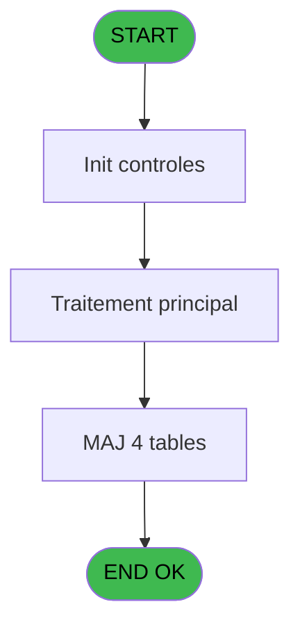
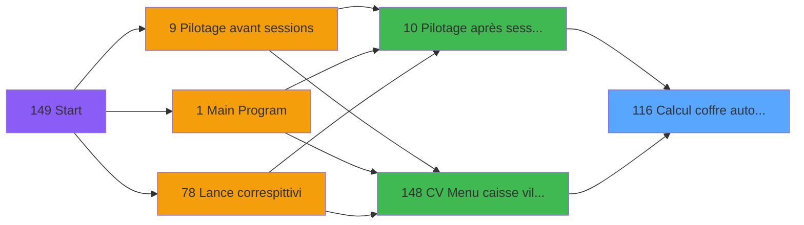
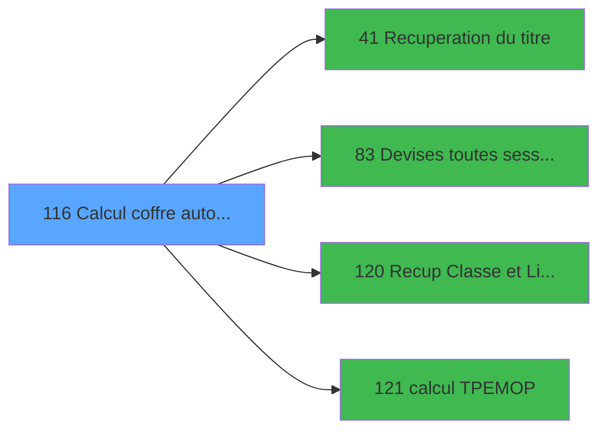

# VIL IDE 116 - Calcul coffre auto avec

> **Analyse**: Phases 1-4 2026-02-03 09:29 -> 09:29 (20s) | Assemblage 09:29
> **Pipeline**: V7.2 Enrichi
> **Structure**: 4 onglets (Resume | Ecrans | Donnees | Connexions)

<!-- TAB:Resume -->

## 1. FICHE D'IDENTITE

| Attribut | Valeur |
|----------|--------|
| Projet | VIL |
| IDE Position | 116 |
| Nom Programme | Calcul coffre auto avec |
| Fichier source | `Prg_116.xml` |
| Domaine metier | Caisse |
| Taches | 42 (1 ecrans visibles) |
| Tables modifiees | 4 |
| Programmes appeles | 4 |

## 2. DESCRIPTION FONCTIONNELLE

**Calcul coffre auto avec** assure la gestion complete de ce processus, accessible depuis [Pilotage après sessions (IDE 10)](VIL-IDE-10.md), [CV  Menu caisse village (IDE 148)](VIL-IDE-148.md).

Le flux de traitement s'organise en **5 blocs fonctionnels** :

- **Traitement** (27 taches) : traitements metier divers
- **Calcul** (9 taches) : calculs de montants, stocks ou compteurs
- **Creation** (4 taches) : insertion d'enregistrements en base (mouvements, prestations)
- **Initialisation** (1 tache) : reinitialisation d'etats et de variables de travail
- **Saisie** (1 tache) : ecrans de saisie utilisateur (formulaires, champs, donnees)

**Donnees modifiees** : 4 tables en ecriture (histo_montants_coffre, histo_fdr, choix_ecritures_solde, pv_customer).

Detail : phases du traitement

#### Phase 1 : Traitement (27 taches)

- **116** - (sans nom) **[[ECRAN]](#ecran-t1)**
- **116.1** - Imputations
- **116.2** - Total TPE
- **116.3** - Total TPE IMS sans session
- **116.3.1** - load session
- **116.4** - Solde PMS
- **116.5.1** - Nbre devise
- **116.6.2** - sessions
- **116.6.2.2.1** - Lecture des sessions
- **116.6.2.3.1** - Lecture des sessions
- **116.6.3** - Nbre devises
- **116.6.4.1** - lect mvt
- **116.6.4.2** - lect mvt
- **116.7** - Lecture user
- **116.7.1** - Sessions caisses
- **116.9** - PDC
- **116.10** - (sans nom) **[[ECRAN]](#ecran-t28)**
- **116.11** - change
- **116.12** - change
- **116.13** - solde APPRO REMISE
- **116.14** - SOLDE FDR
- **116.15** - Versements/Retraits
- **116.16** - sessions non clôturees
- **116.16.1** - Histo session v1
- **116.18** - histo montant
- **116.6.2.2.2** - Lecture des sessions
- **116.6.2.3.2** - Lecture des sessions

Delegue a : [Recuperation du titre (IDE 41)](VIL-IDE-41.md), [Devises toutes sessions (IDE 83)](VIL-IDE-83.md)

#### Phase 2 : Calcul (9 taches)

- **116.5** - Solde compte
- **116.6** - Solde calcule
- **116.6.1** - Date comptable
- **116.6.2.1** - dernier solde compte ?
- **116.6.2.2** - non comptabilisees
- **116.6.2.3** - comptabilisees
- **116.6.4** - Mouvement stock
- **116.6.4.3** - stockage tot mvt pro
- **116.17** - Calcul solde et sortie

Delegue a : [calcul TPE/MOP (IDE 121)](VIL-IDE-121.md)

#### Phase 3 : Creation (4 taches)

- **116.7.1.1** - creation temp
- **116.14.2** - ajout
- **116.16.1.1** - creation 341
- **116.17.1** - Creation 341

#### Phase 4 : Saisie (1 tache)

- **116.8** - Ventes hors reception UNI

#### Phase 5 : Initialisation (1 tache)

- **116.14.1** - init

#### Tables impactees

| Table | Operations | Role metier |
|-------|-----------|-------------|
| choix_ecritures_solde | **W**/L (3 usages) |  |
| pv_customer | R/**W** (3 usages) |  |
| histo_montants_coffre | **W** (2 usages) | Etat du coffre |
| histo_fdr | R/**W** (2 usages) | Historique / journal |

## 3. BLOCS FONCTIONNELS

### 3.1 Traitement (27 taches)

Traitements internes.

---

#### 116 - (sans nom) [[ECRAN]](#ecran-t1)

**Role** : Tache d'orchestration : point d'entree du programme (27 sous-taches). Coordonne l'enchainement des traitements.
**Ecran** : 1040 x 271 DLU (MDI) | [Voir mockup](#ecran-t1)

26 sous-taches directes

| Tache | Nom | Bloc |
|-------|-----|------|
| [116.1](#t2) | Imputations | Traitement |
| [116.2](#t3) | Total TPE | Traitement |
| [116.3](#t4) | Total TPE IMS sans session | Traitement |
| [116.3.1](#t5) | load session | Traitement |
| [116.4](#t6) | Solde PMS | Traitement |
| [116.5.1](#t8) | Nbre devise | Traitement |
| [116.6.2](#t11) | sessions | Traitement |
| [116.6.2.2.1](#t14) | Lecture des sessions | Traitement |
| [116.6.2.3.1](#t16) | Lecture des sessions | Traitement |
| [116.6.3](#t17) | Nbre devises | Traitement |
| [116.6.4.1](#t19) | lect mvt | Traitement |
| [116.6.4.2](#t20) | lect mvt | Traitement |
| [116.7](#t22) | Lecture user | Traitement |
| [116.7.1](#t23) | Sessions caisses | Traitement |
| [116.9](#t26) | PDC | Traitement |
| [116.10](#t28) | (sans nom) **[[ECRAN]](#ecran-t28)** | Traitement |
| [116.11](#t29) | change | Traitement |
| [116.12](#t30) | change | Traitement |
| [116.13](#t31) | solde APPRO REMISE | Traitement |
| [116.14](#t32) | SOLDE FDR | Traitement |
| [116.15](#t35) | Versements/Retraits | Traitement |
| [116.16](#t36) | sessions non clôturees | Traitement |
| [116.16.1](#t37) | Histo session v1 | Traitement |
| [116.18](#t45) | histo montant | Traitement |
| [116.6.2.2.2](#t48) | Lecture des sessions | Traitement |
| [116.6.2.3.2](#t51) | Lecture des sessions | Traitement |

---

#### 116.1 - Imputations

**Role** : Traitement : Imputations.

---

#### 116.2 - Total TPE

**Role** : Traitement : Total TPE.
**Variables liees** : I (PO Solde compte Total), S (Solde calcule Total), Z (Solde total PMS Total), BA (Solde total PMS Monnaie), BB (Solde total PMS Produits)

---

#### 116.3 - Total TPE IMS sans session

**Role** : Traitement : Total TPE IMS sans session.
**Variables liees** : I (PO Solde compte Total), S (Solde calcule Total), Z (Solde total PMS Total), BA (Solde total PMS Monnaie), BB (Solde total PMS Produits)

---

#### 116.3.1 - load session

**Role** : Traitement : load session.
**Variables liees** : CL (Total REMISES CARTES sessions), CN (Total CARD TPE IMS sans session), CO (Montant FDR session), CT (ServiceImsSansSession1), CU (ServiceImsSansSession2)

---

#### 116.4 - Solde PMS

**Role** : Consultation/chargement : Solde PMS.
**Variables liees** : I (PO Solde compte Total), J (PO Solde compte Monnaie), K (PO Solde compte Produits), L (PO Solde compte Cartes), M (PO Solde compte Cheques)

---

#### 116.5.1 - Nbre devise

**Role** : Traitement : Nbre devise.
**Variables liees** : O (PO Solde compte Nbre devises), B (Param devise locale), F (Param nbre decimales), Y (Solde calcule Nbre devises), BF (Solde total PMS Nbre devises)

---

#### 116.6.2 - sessions

**Role** : Traitement : sessions.
**Variables liees** : CL (Total REMISES CARTES sessions)

---

#### 116.6.2.2.1 - Lecture des sessions

**Role** : Traitement : Lecture des sessions.
**Variables liees** : CL (Total REMISES CARTES sessions)

---

#### 116.6.2.3.1 - Lecture des sessions

**Role** : Traitement : Lecture des sessions.
**Variables liees** : CL (Total REMISES CARTES sessions)

---

#### 116.6.3 - Nbre devises

**Role** : Traitement : Nbre devises.
**Variables liees** : O (PO Solde compte Nbre devises), F (Param nbre decimales), Y (Solde calcule Nbre devises), BF (Solde total PMS Nbre devises), BK (devises comptees)

---

#### 116.6.4.1 - lect mvt

**Role** : Traitement : lect mvt.

---

#### 116.6.4.2 - lect mvt

**Role** : Traitement : lect mvt.

---

#### 116.7 - Lecture user

**Role** : Traitement : Lecture user.

---

#### 116.7.1 - Sessions caisses

**Role** : Traitement : Sessions caisses.
**Variables liees** : BT (Total caisses rec Total), BU (Total caisses rec Monnaie), BV (Total caisses rec Produits), BW (Total caisses rec Cartes), BX (Total caisses rec Cheques)

---

#### 116.9 - PDC

**Role** : Traitement interne.

---

#### 116.10 - (sans nom) [[ECRAN]](#ecran-t28)

**Role** : Traitement interne.
**Ecran** : 1240 x 116 DLU (MDI) | [Voir mockup](#ecran-t28)

---

#### 116.11 - change

**Role** : Traitement : change.
**Variables liees** : BR (Total change achat), BS (Total change vente), CS (Total change achat)

---

#### 116.12 - change

**Role** : Traitement : change.
**Variables liees** : BR (Total change achat), BS (Total change vente), CS (Total change achat)

---

#### 116.13 - solde APPRO REMISE

**Role** : Consultation/chargement : solde APPRO REMISE.
**Variables liees** : I (PO Solde compte Total), J (PO Solde compte Monnaie), K (PO Solde compte Produits), L (PO Solde compte Cartes), M (PO Solde compte Cheques)

---

#### 116.14 - SOLDE FDR

**Role** : Consultation/chargement : SOLDE FDR.
**Variables liees** : I (PO Solde compte Total), J (PO Solde compte Monnaie), K (PO Solde compte Produits), L (PO Solde compte Cartes), M (PO Solde compte Cheques)

---

#### 116.15 - Versements/Retraits

**Role** : Traitement : Versements/Retraits.

---

#### 116.16 - sessions non clôturees

**Role** : Traitement : sessions non clôturees.
**Variables liees** : CL (Total REMISES CARTES sessions)

---

#### 116.16.1 - Histo session v1

**Role** : Traitement : Histo session v1.
**Variables liees** : CL (Total REMISES CARTES sessions), CN (Total CARD TPE IMS sans session), CO (Montant FDR session), CT (ServiceImsSansSession1), CU (ServiceImsSansSession2)

---

#### 116.18 - histo montant

**Role** : Traitement : histo montant.
**Variables liees** : D (Param masque montant), CH (Ecart coffre Montant devise), CO (Montant FDR session), CQ (Montant versement), CR (Montant retrait)

---

#### 116.6.2.2.2 - Lecture des sessions

**Role** : Traitement : Lecture des sessions.
**Variables liees** : CL (Total REMISES CARTES sessions)

---

#### 116.6.2.3.2 - Lecture des sessions

**Role** : Traitement : Lecture des sessions.
**Variables liees** : CL (Total REMISES CARTES sessions)

### 3.2 Calcul (9 taches)

Calculs metier : montants, stocks, compteurs.

---

#### 116.5 - Solde compte

**Role** : Consultation/chargement : Solde compte.
**Variables liees** : I (PO Solde compte Total), J (PO Solde compte Monnaie), K (PO Solde compte Produits), L (PO Solde compte Cartes), M (PO Solde compte Cheques)

---

#### 116.6 - Solde calcule

**Role** : Calcul : Solde calcule.
**Variables liees** : I (PO Solde compte Total), J (PO Solde compte Monnaie), K (PO Solde compte Produits), L (PO Solde compte Cartes), M (PO Solde compte Cheques)

---

#### 116.6.1 - Date comptable

**Role** : Traitement : Date comptable.
**Variables liees** : E (Param date comptable), BH (Date compta dernier solde PMS)

---

#### 116.6.2.1 - dernier solde compte ?

**Role** : Consultation/chargement : dernier solde compte ?.
**Variables liees** : I (PO Solde compte Total), J (PO Solde compte Monnaie), K (PO Solde compte Produits), L (PO Solde compte Cartes), M (PO Solde compte Cheques)

---

#### 116.6.2.2 - non comptabilisees

**Role** : Traitement : non comptabilisees.

---

#### 116.6.2.3 - comptabilisees

**Role** : Traitement : comptabilisees.

---

#### 116.6.4 - Mouvement stock

**Role** : Calcul : Mouvement stock.

---

#### 116.6.4.3 - stockage tot mvt pro

**Role** : Calcul : stockage tot mvt pro.

---

#### 116.17 - Calcul solde et sortie

**Role** : Calcul : Calcul solde et sortie.
**Variables liees** : I (PO Solde compte Total), J (PO Solde compte Monnaie), K (PO Solde compte Produits), L (PO Solde compte Cartes), M (PO Solde compte Cheques)

### 3.3 Creation (4 taches)

Insertion de nouveaux enregistrements en base.

---

#### 116.7.1.1 - creation temp

**Role** : Creation d'enregistrement : creation temp.

---

#### 116.14.2 - ajout

**Role** : Creation d'enregistrement : ajout.

---

#### 116.16.1.1 - creation 341

**Role** : Creation d'enregistrement : creation 341.

---

#### 116.17.1 - Creation 341

**Role** : Creation d'enregistrement : Creation 341.

### 3.4 Saisie (1 tache)

Ce bloc traite la saisie des donnees de la transaction.

---

#### 116.8 - Ventes hors reception UNI

**Role** : Saisie des donnees : Ventes hors reception UNI.
**Variables liees** : CI (Solde appro remise reception), DA (TOTAL VENTES CARTES à DC)

### 3.5 Initialisation (1 tache)

Reinitialisation d'etats et variables de travail.

---

#### 116.14.1 - init

**Role** : Reinitialisation : init.

## 5. REGLES METIER

*(Aucune regle metier identifiee)*

## 6. CONTEXTE

- **Appele par**: [Pilotage après sessions (IDE 10)](VIL-IDE-10.md), [CV  Menu caisse village (IDE 148)](VIL-IDE-148.md)
- **Appelle**: 4 programmes | **Tables**: 25 (W:4 R:19 L:7) | **Taches**: 42 | **Expressions**: 13

<!-- TAB:Ecrans -->

## 8. ECRANS

### 8.1 Forms visibles (1 / 42)

| # | Position | Tache | Nom | Type | Largeur | Hauteur | Bloc |
|---|----------|-------|-----|------|---------|---------|------|
| 1 | 116 | 116 | (sans nom) | MDI | 1040 | 271 | Traitement |

### 8.2 Mockups Ecrans

---

#### 116 - (sans nom)
**Tache** : [116](#t1) | **Type** : MDI | **Dimensions** : 1040 x 271 DLU
**Bloc** : Traitement | **Titre IDE** : (sans nom)

<!-- FORM-DATA:
{
    "width":  1040,
    "vFactor":  8,
    "type":  "MDI",
    "hFactor":  8,
    "controls":  [
                     {
                         "x":  120,
                         "type":  "label",
                         "var":  "",
                         "y":  127,
                         "w":  800,
                         "fmt":  "",
                         "name":  "",
                         "h":  16,
                         "color":  "142",
                         "text":  "Mise à jour automatique du coffre",
                         "parent":  null
                     }
                 ],
    "taskId":  "116",
    "height":  271
}
-->

## 9. NAVIGATION

Ecran unique: ****

### 9.3 Structure hierarchique (42 taches)

| Position | Tache | Type | Dimensions | Bloc |
|----------|-------|------|------------|------|
| **116.1** | [**(sans nom)** (116)](#t1) [mockup](#ecran-t1) | MDI | 1040x271 | Traitement |
| 116.1.1 | [Imputations (116.1)](#t2) | MDI | - | |
| 116.1.2 | [Total TPE (116.2)](#t3) | MDI | - | |
| 116.1.3 | [Total TPE IMS sans session (116.3)](#t4) | MDI | - | |
| 116.1.4 | [load session (116.3.1)](#t5) | MDI | - | |
| 116.1.5 | [Solde PMS (116.4)](#t6) | MDI | - | |
| 116.1.6 | [Nbre devise (116.5.1)](#t8) | MDI | - | |
| 116.1.7 | [sessions (116.6.2)](#t11) | MDI | - | |
| 116.1.8 | [Lecture des sessions (116.6.2.2.1)](#t14) | MDI | - | |
| 116.1.9 | [Lecture des sessions (116.6.2.3.1)](#t16) | MDI | - | |
| 116.1.10 | [Nbre devises (116.6.3)](#t17) | MDI | - | |
| 116.1.11 | [lect mvt (116.6.4.1)](#t19) | MDI | - | |
| 116.1.12 | [lect mvt (116.6.4.2)](#t20) | MDI | - | |
| 116.1.13 | [Lecture user (116.7)](#t22) | MDI | - | |
| 116.1.14 | [Sessions caisses (116.7.1)](#t23) | MDI | - | |
| 116.1.15 | [PDC (116.9)](#t26) | MDI | - | |
| 116.1.16 | [(sans nom) (116.10)](#t28) [mockup](#ecran-t28) | MDI | 1240x116 | |
| 116.1.17 | [change (116.11)](#t29) | MDI | - | |
| 116.1.18 | [change (116.12)](#t30) | MDI | - | |
| 116.1.19 | [solde APPRO REMISE (116.13)](#t31) | MDI | - | |
| 116.1.20 | [SOLDE FDR (116.14)](#t32) | MDI | - | |
| 116.1.21 | [Versements/Retraits (116.15)](#t35) | MDI | - | |
| 116.1.22 | [sessions non clôturees (116.16)](#t36) | MDI | - | |
| 116.1.23 | [Histo session v1 (116.16.1)](#t37) | MDI | - | |
| 116.1.24 | [histo montant (116.18)](#t45) | MDI | - | |
| 116.1.25 | [Lecture des sessions (116.6.2.2.2)](#t48) | MDI | - | |
| 116.1.26 | [Lecture des sessions (116.6.2.3.2)](#t51) | MDI | - | |
| **116.2** | [**Solde compte** (116.5)](#t7) | MDI | - | Calcul |
| 116.2.1 | [Solde calcule (116.6)](#t9) | MDI | - | |
| 116.2.2 | [Date comptable (116.6.1)](#t10) | MDI | - | |
| 116.2.3 | [dernier solde compte ? (116.6.2.1)](#t12) | MDI | - | |
| 116.2.4 | [non comptabilisees (116.6.2.2)](#t13) | MDI | - | |
| 116.2.5 | [comptabilisees (116.6.2.3)](#t15) | MDI | - | |
| 116.2.6 | [Mouvement stock (116.6.4)](#t18) | MDI | - | |
| 116.2.7 | [stockage tot mvt pro (116.6.4.3)](#t21) | MDI | - | |
| 116.2.8 | [Calcul solde et sortie (116.17)](#t43) | MDI | - | |
| **116.3** | [**creation temp** (116.7.1.1)](#t24) | MDI | - | Creation |
| 116.3.1 | [ajout (116.14.2)](#t34) | MDI | - | |
| 116.3.2 | [creation 341 (116.16.1.1)](#t38) | MDI | - | |
| 116.3.3 | [Creation 341 (116.17.1)](#t44) | MDI | - | |
| **116.4** | [**Ventes hors reception UNI** (116.8)](#t25) | MDI | - | Saisie |
| **116.5** | [**init** (116.14.1)](#t33) | MDI | - | Initialisation |

### 9.4 Algorigramme

> **Legende**: Vert = START/END OK | Rouge = END KO | Bleu = Decisions
> *Algorigramme auto-genere. Utiliser `/algorigramme` pour une synthese metier detaillee.*

<!-- TAB:Donnees -->

## 10. TABLES

### Tables utilisees (25)

| ID | Nom | Description | Type | R | W | L | Usages |
|----|-----|-------------|------|---|---|---|--------|
| 40 | comptable________cte |  | DB | R |   |   | 1 |
| 44 | change___________chg |  | DB | R |   |   | 1 |
| 54 | pieces_caisse____pks | Sessions de caisse | DB | R |   |   | 1 |
| 55 | solde_caisse_____sks | Sessions de caisse | DB | R |   |   | 1 |
| 57 | devises_caisse___ddk | Sessions de caisse | DB | R |   |   | 1 |
| 89 | moyen_paiement___mop |  | DB | R |   |   | 1 |
| 147 | change_vente_____chg | Donnees de ventes | DB | R |   |   | 1 |
| 224 | complement_pieces_de_caisse | Sessions de caisse | DB |   |   | L | 1 |
| 228 | detail_coffre | Etat du coffre | DB | R |   |   | 2 |
| 229 | detail_coffre_devise | Etat du coffre | DB | R |   | L | 2 |
| 236 | histo_montants_coffre | Etat du coffre | DB |   | **W** |   | 2 |
| 237 | mouvement_stock_histo | Mouvements de prestation | DB |   |   | L | 2 |
| 238 | mouvement_stock_valeur | Mouvements de prestation | DB | R |   |   | 2 |
| 246 | histo_sessions_caisse | Sessions de caisse | DB | R |   |   | 5 |
| 249 | histo_sessions_caisse_detail | Sessions de caisse | DB | R |   | L | 8 |
| 250 | histo_sessions_caisse_devise | Sessions de caisse | DB |   |   | L | 1 |
| 252 | histo_appro_remise | Historique / journal | DB | R |   |   | 1 |
| 254 | histo_fdr | Historique / journal | DB | R | **W** |   | 2 |
| 255 | suivi_pdc |  | DB | R |   |   | 1 |
| 260 | tickets_tpe |  | DB | R |   |   | 1 |
| 263 | vente | Donnees de ventes | DB |   |   | L | 1 |
| 265 | total_ventes_par_mop | Donnees de ventes | DB | R |   |   | 1 |
| 499 | choix_ecritures_solde |  | TMP |   | **W** | L | 3 |
| 508 | pv_customer |  | TMP | R | **W** |   | 3 |
| 697 | droits_applications | Droits operateur | DB | R |   |   | 2 |

### Colonnes par table (19 / 21 tables avec colonnes identifiees)

Table 40 - comptable________cte (R) - 1 usages

| Lettre | Variable | Acces | Type |
|--------|----------|-------|------|
| A | existe a date comptable | R | Logical |
| E | Param date comptable | R | Date |

Table 44 - change___________chg (R) - 1 usages

| Lettre | Variable | Acces | Type |
|--------|----------|-------|------|
| BR | Total change achat | R | Numeric |
| BS | Total change vente | R | Numeric |
| CS | Total change achat | R | Numeric |

Table 54 - pieces_caisse____pks (R) - 1 usages

| Lettre | Variable | Acces | Type |
|--------|----------|-------|------|
| BM | Ecart caisse gain | R | Numeric |
| BN | Ecart caisse perte | R | Numeric |
| BT | Total caisses rec Total | R | Numeric |
| BU | Total caisses rec Monnaie | R | Numeric |
| BV | Total caisses rec Produits | R | Numeric |
| BW | Total caisses rec Cartes | R | Numeric |
| BX | Total caisses rec Cheques | R | Numeric |
| BY | Total caisses rec Od | R | Numeric |
| BZ | Total caisses rec Nbre devises | R | Numeric |
| CK | FIN controle caisse | R | Logical |

Table 55 - solde_caisse_____sks (R) - 1 usages

| Lettre | Variable | Acces | Type |
|--------|----------|-------|------|
| A | _dernier solde compte | R | Logical |
| BA | Solde total PMS Monnaie | R | Numeric |
| BB | Solde total PMS Produits | R | Numeric |
| BC | Solde total PMS Cartes | R | Numeric |
| BD | Solde total PMS Cheques | R | Numeric |
| BE | Solde total PMS Od | R | Numeric |
| BF | Solde total PMS Nbre devises | R | Numeric |
| BG | Solde PMS | R | Numeric |
| BH | Date compta dernier solde PMS | R | Date |
| BM | Ecart caisse gain | R | Numeric |
| BN | Ecart caisse perte | R | Numeric |
| BT | Total caisses rec Total | R | Numeric |
| BU | Total caisses rec Monnaie | R | Numeric |
| BV | Total caisses rec Produits | R | Numeric |
| BW | Total caisses rec Cartes | R | Numeric |
| BX | Total caisses rec Cheques | R | Numeric |
| BY | Total caisses rec Od | R | Numeric |
| BZ | Total caisses rec Nbre devises | R | Numeric |
| CI | Solde appro remise reception | R | Numeric |
| CK | FIN controle caisse | R | Logical |
| CP | Solde FDR | R | Numeric |
| I | PO Solde compte Total | R | Numeric |
| J | PO Solde compte Monnaie | R | Numeric |
| K | PO Solde compte Produits | R | Numeric |
| L | PO Solde compte Cartes | R | Numeric |
| M | PO Solde compte Cheques | R | Numeric |
| N | PO Solde compte Od | R | Numeric |
| O | PO Solde compte Nbre devises | R | Numeric |
| S | Solde calcule Total | R | Numeric |
| T | Solde calcule Monnaie | R | Numeric |
| U | Solde calcule Produits | R | Numeric |
| V | Solde calcule Cartes | R | Numeric |
| W | Solde calcule Cheques | R | Numeric |
| X | Solde calcule Od | R | Numeric |
| Y | Solde calcule Nbre devises | R | Numeric |
| Z | Solde total PMS Total | R | Numeric |

Table 57 - devises_caisse___ddk (R) - 1 usages

| Lettre | Variable | Acces | Type |
|--------|----------|-------|------|
| BF | Solde total PMS Nbre devises | R | Numeric |
| BK | devises comptees | R | Logical |
| BL | devises calculees | R | Logical |
| BM | Ecart caisse gain | R | Numeric |
| BN | Ecart caisse perte | R | Numeric |
| BT | Total caisses rec Total | R | Numeric |
| BU | Total caisses rec Monnaie | R | Numeric |
| BV | Total caisses rec Produits | R | Numeric |
| BW | Total caisses rec Cartes | R | Numeric |
| BX | Total caisses rec Cheques | R | Numeric |
| BY | Total caisses rec Od | R | Numeric |
| BZ | Total caisses rec Nbre devises | R | Numeric |
| CG | Ecart coffre Nbre devises | R | Numeric |
| CK | FIN controle caisse | R | Logical |
| O | PO Solde compte Nbre devises | R | Numeric |
| Y | Solde calcule Nbre devises | R | Numeric |

Table 89 - moyen_paiement___mop (R) - 1 usages

*Table utilisee uniquement en Link ou aucune colonne Real identifiee dans le DataView.*

Table 147 - change_vente_____chg (R) - 1 usages

| Lettre | Variable | Acces | Type |
|--------|----------|-------|------|
| BR | Total change achat | R | Numeric |
| BS | Total change vente | R | Numeric |
| CS | Total change achat | R | Numeric |
| DA | TOTAL VENTES CARTES à DC | R | Numeric |

Table 228 - detail_coffre (R) - 2 usages

| Lettre | Variable | Acces | Type |
|--------|----------|-------|------|
| CA | Ecart coffre Total | R | Numeric |
| CB | Ecart coffre Monnaie | R | Numeric |
| CC | Ecart coffre Produits | R | Numeric |
| CD | Ecart coffre Cartes | R | Numeric |
| CE | Ecart coffre Cheques | R | Numeric |
| CF | Ecart coffre Od | R | Numeric |
| CG | Ecart coffre Nbre devises | R | Numeric |
| CH | Ecart coffre Montant devise | R | Logical |
| CY | COFFRE 2 actif | R | Alpha |
| P | Param N° term coffre2 | R | Numeric |
| Q | Param Hostname coffre2 | R | Unicode |

Table 229 - detail_coffre_devise (R/L) - 2 usages

| Lettre | Variable | Acces | Type |
|--------|----------|-------|------|
| B | Param devise locale | R | Alpha |
| BF | Solde total PMS Nbre devises | R | Numeric |
| BK | devises comptees | R | Logical |
| BL | devises calculees | R | Logical |
| BZ | Total caisses rec Nbre devises | R | Numeric |
| CA | Ecart coffre Total | R | Numeric |
| CB | Ecart coffre Monnaie | R | Numeric |
| CC | Ecart coffre Produits | R | Numeric |
| CD | Ecart coffre Cartes | R | Numeric |
| CE | Ecart coffre Cheques | R | Numeric |
| CF | Ecart coffre Od | R | Numeric |
| CG | Ecart coffre Nbre devises | R | Numeric |
| CH | Ecart coffre Montant devise | R | Logical |
| CY | COFFRE 2 actif | R | Alpha |
| O | PO Solde compte Nbre devises | R | Numeric |
| P | Param N° term coffre2 | R | Numeric |
| Q | Param Hostname coffre2 | R | Unicode |
| Y | Solde calcule Nbre devises | R | Numeric |

Table 236 - histo_montants_coffre (**W**) - 2 usages

| Lettre | Variable | Acces | Type |
|--------|----------|-------|------|
| CA | Ecart coffre Total | W | Numeric |
| CB | Ecart coffre Monnaie | W | Numeric |
| CC | Ecart coffre Produits | W | Numeric |
| CD | Ecart coffre Cartes | W | Numeric |
| CE | Ecart coffre Cheques | W | Numeric |
| CF | Ecart coffre Od | W | Numeric |
| CG | Ecart coffre Nbre devises | W | Numeric |
| CH | Ecart coffre Montant devise | W | Logical |
| CY | COFFRE 2 actif | W | Alpha |
| P | Param N° term coffre2 | W | Numeric |
| Q | Param Hostname coffre2 | W | Unicode |

Table 238 - mouvement_stock_valeur (R) - 2 usages

*Table utilisee uniquement en Link ou aucune colonne Real identifiee dans le DataView.*

Table 246 - histo_sessions_caisse (R) - 5 usages

| Lettre | Variable | Acces | Type |
|--------|----------|-------|------|
| BM | Ecart caisse gain | R | Numeric |
| BN | Ecart caisse perte | R | Numeric |
| BT | Total caisses rec Total | R | Numeric |
| BU | Total caisses rec Monnaie | R | Numeric |
| BV | Total caisses rec Produits | R | Numeric |
| BW | Total caisses rec Cartes | R | Numeric |
| BX | Total caisses rec Cheques | R | Numeric |
| BY | Total caisses rec Od | R | Numeric |
| BZ | Total caisses rec Nbre devises | R | Numeric |
| CK | FIN controle caisse | R | Logical |
| CL | Total REMISES CARTES sessions | R | Numeric |

Table 249 - histo_sessions_caisse_detail (R/L) - 8 usages

| Lettre | Variable | Acces | Type |
|--------|----------|-------|------|
| BM | Ecart caisse gain | R | Numeric |
| BN | Ecart caisse perte | R | Numeric |
| BT | Total caisses rec Total | R | Numeric |
| BU | Total caisses rec Monnaie | R | Numeric |
| BV | Total caisses rec Produits | R | Numeric |
| BW | Total caisses rec Cartes | R | Numeric |
| BX | Total caisses rec Cheques | R | Numeric |
| BY | Total caisses rec Od | R | Numeric |
| BZ | Total caisses rec Nbre devises | R | Numeric |
| CK | FIN controle caisse | R | Logical |
| CL | Total REMISES CARTES sessions | R | Numeric |

Table 252 - histo_appro_remise (R) - 1 usages

| Lettre | Variable | Acces | Type |
|--------|----------|-------|------|
| CI | Solde appro remise reception | R | Numeric |
| CL | Total REMISES CARTES sessions | R | Numeric |

Table 254 - histo_fdr (R/**W**) - 2 usages

| Lettre | Variable | Acces | Type |
|--------|----------|-------|------|
| A | fdr precedent | W | Numeric |

Table 255 - suivi_pdc (R) - 1 usages

| Lettre | Variable | Acces | Type |
|--------|----------|-------|------|
| BI | PDC depenses | R | Numeric |
| BJ | PDC recettes | R | Numeric |

Table 260 - tickets_tpe (R) - 1 usages

*Table utilisee uniquement en Link ou aucune colonne Real identifiee dans le DataView.*

Table 265 - total_ventes_par_mop (R) - 1 usages

| Lettre | Variable | Acces | Type |
|--------|----------|-------|------|
| BA | Solde total PMS Monnaie | R | Numeric |
| BB | Solde total PMS Produits | R | Numeric |
| BC | Solde total PMS Cartes | R | Numeric |
| BD | Solde total PMS Cheques | R | Numeric |
| BE | Solde total PMS Od | R | Numeric |
| BF | Solde total PMS Nbre devises | R | Numeric |
| BR | Total change achat | R | Numeric |
| BS | Total change vente | R | Numeric |
| BT | Total caisses rec Total | R | Numeric |
| BU | Total caisses rec Monnaie | R | Numeric |
| BV | Total caisses rec Produits | R | Numeric |
| BW | Total caisses rec Cartes | R | Numeric |
| BX | Total caisses rec Cheques | R | Numeric |
| BY | Total caisses rec Od | R | Numeric |
| BZ | Total caisses rec Nbre devises | R | Numeric |
| CA | Ecart coffre Total | R | Numeric |
| CL | Total REMISES CARTES sessions | R | Numeric |
| CM | Total CARD TPE | R | Numeric |
| CN | Total CARD TPE IMS sans session | R | Numeric |
| CS | Total change achat | R | Numeric |
| CZ | TOTAL TPE anterieurs à DC | R | Numeric |
| DA | TOTAL VENTES CARTES à DC | R | Numeric |
| I | PO Solde compte Total | R | Numeric |
| S | Solde calcule Total | R | Numeric |
| Z | Solde total PMS Total | R | Numeric |

Table 499 - choix_ecritures_solde (**W**/L) - 3 usages

| Lettre | Variable | Acces | Type |
|--------|----------|-------|------|
| A | _dernier solde compte | W | Logical |
| BA | Solde total PMS Monnaie | W | Numeric |
| BB | Solde total PMS Produits | W | Numeric |
| BC | Solde total PMS Cartes | W | Numeric |
| BD | Solde total PMS Cheques | W | Numeric |
| BE | Solde total PMS Od | W | Numeric |
| BF | Solde total PMS Nbre devises | W | Numeric |
| BG | Solde PMS | W | Numeric |
| BH | Date compta dernier solde PMS | W | Date |
| CI | Solde appro remise reception | W | Numeric |
| CP | Solde FDR | W | Numeric |
| I | PO Solde compte Total | W | Numeric |
| J | PO Solde compte Monnaie | W | Numeric |
| K | PO Solde compte Produits | W | Numeric |
| L | PO Solde compte Cartes | W | Numeric |
| M | PO Solde compte Cheques | W | Numeric |
| N | PO Solde compte Od | W | Numeric |
| O | PO Solde compte Nbre devises | W | Numeric |
| S | Solde calcule Total | W | Numeric |
| T | Solde calcule Monnaie | W | Numeric |
| U | Solde calcule Produits | W | Numeric |
| V | Solde calcule Cartes | W | Numeric |
| W | Solde calcule Cheques | W | Numeric |
| X | Solde calcule Od | W | Numeric |
| Y | Solde calcule Nbre devises | W | Numeric |
| Z | Solde total PMS Total | W | Numeric |

Table 508 - pv_customer (R/**W**) - 3 usages

*Table utilisee uniquement en Link ou aucune colonne Real identifiee dans le DataView.*

Table 697 - droits_applications (R) - 2 usages

*Table utilisee uniquement en Link ou aucune colonne Real identifiee dans le DataView.*

## 11. VARIABLES

### 11.1 Parametres entrants (7)

Variables recues du programme appelant ([Pilotage après sessions (IDE 10)](VIL-IDE-10.md)).

| Lettre | Nom | Type | Usage dans |
|--------|-----|------|-----------|
| I | PO Solde compte Total | Numeric | - |
| J | PO Solde compte Monnaie | Numeric | - |
| K | PO Solde compte Produits | Numeric | - |
| L | PO Solde compte Cartes | Numeric | - |
| M | PO Solde compte Cheques | Numeric | - |
| N | PO Solde compte Od | Numeric | - |
| O | PO Solde compte Nbre devises | Numeric | - |

### 11.2 Autres (72)

Variables diverses.

| Lettre | Nom | Type | Usage dans |
|--------|-----|------|-----------|
| A | Param societe | Alpha | - |
| B | Param devise locale | Alpha | - |
| C | Param UNI/BI | Alpha | 1x refs |
| D | Param masque montant | Alpha | - |
| E | Param date comptable | Date | - |
| F | Param nbre decimales | Numeric | - |
| G | Param abandon ecart | Logical | - |
| H | Param nom village | Alpha | - |
| P | Param N° term coffre2 | Numeric | - |
| Q | Param Hostname coffre2 | Unicode | - |
| R | Param cloture auto en cours | Logical | - |
| S | Solde calcule Total | Numeric | [116.2](#t3), [116.3](#t4), [116.4](#t6) |
| T | Solde calcule Monnaie | Numeric | [116.4](#t6), [116.5](#t7), [116.6](#t9) |
| U | Solde calcule Produits | Numeric | [116.4](#t6), [116.5](#t7), [116.6](#t9) |
| V | Solde calcule Cartes | Numeric | [116.4](#t6), [116.5](#t7), [116.6](#t9) |
| W | Solde calcule Cheques | Numeric | [116.4](#t6), [116.5](#t7), [116.6](#t9) |
| X | Solde calcule Od | Numeric | [116.4](#t6), [116.5](#t7), [116.6](#t9) |
| Y | Solde calcule Nbre devises | Numeric | - |
| Z | Solde total PMS Total | Numeric | - |
| BA | Solde total PMS Monnaie | Numeric | - |
| BB | Solde total PMS Produits | Numeric | - |
| BC | Solde total PMS Cartes | Numeric | - |
| BD | Solde total PMS Cheques | Numeric | - |
| BE | Solde total PMS Od | Numeric | - |
| BF | Solde total PMS Nbre devises | Numeric | - |
| BG | Solde PMS | Numeric | - |
| BH | Date compta dernier solde PMS | Date | - |
| BI | PDC depenses | Numeric | 1x refs |
| BJ | PDC recettes | Numeric | - |
| BK | devises comptees | Logical | - |
| BL | devises calculees | Logical | - |
| BM | Ecart caisse gain | Numeric | - |
| BN | Ecart caisse perte | Numeric | - |
| BO | imputation ecart gain | Numeric | - |
| BP | imputation ecart perte | Numeric | - |
| BQ | Compte FDR | Numeric | - |
| BR | Total change achat | Numeric | - |
| BS | Total change vente | Numeric | - |
| BT | Total caisses rec Total | Numeric | - |
| BU | Total caisses rec Monnaie | Numeric | - |
| BV | Total caisses rec Produits | Numeric | - |
| BW | Total caisses rec Cartes | Numeric | - |
| BX | Total caisses rec Cheques | Numeric | - |
| BY | Total caisses rec Od | Numeric | - |
| BZ | Total caisses rec Nbre devises | Numeric | - |
| CA | Ecart coffre Total | Numeric | - |
| CB | Ecart coffre Monnaie | Numeric | - |
| CC | Ecart coffre Produits | Numeric | - |
| CD | Ecart coffre Cartes | Numeric | - |
| CE | Ecart coffre Cheques | Numeric | - |
| CF | Ecart coffre Od | Numeric | - |
| CG | Ecart coffre Nbre devises | Numeric | - |
| CH | Ecart coffre Montant devise | Logical | - |
| CI | Solde appro remise reception | Numeric | - |
| CJ | titre | Alpha | - |
| CK | FIN controle caisse | Logical | - |
| CL | Total REMISES CARTES sessions | Numeric | - |
| CM | Total CARD TPE | Numeric | - |
| CN | Total CARD TPE IMS sans session | Numeric | - |
| CO | Montant FDR session | Numeric | - |
| CP | Solde FDR | Numeric | - |
| CQ | Montant versement | Numeric | - |
| CR | Montant retrait | Numeric | - |
| CS | Total change achat | Numeric | - |
| CT | ServiceImsSansSession1 | Alpha | - |
| CU | ServiceImsSansSession2 | Alpha | - |
| CV | ServiceImsSansSession3 | Alpha | - |
| CW | ServiceImsSansSession4 | Alpha | - |
| CX | ServiceImsSansSession5 | Alpha | - |
| CY | COFFRE 2 actif | Alpha | - |
| CZ | TOTAL TPE anterieurs à DC | Numeric | - |
| DA | TOTAL VENTES CARTES à DC | Numeric | - |

Toutes les 79 variables (liste complete)

| Cat | Lettre | Nom Variable | Type |
|-----|--------|--------------|------|
| P0 | **I** | PO Solde compte Total | Numeric |
| P0 | **J** | PO Solde compte Monnaie | Numeric |
| P0 | **K** | PO Solde compte Produits | Numeric |
| P0 | **L** | PO Solde compte Cartes | Numeric |
| P0 | **M** | PO Solde compte Cheques | Numeric |
| P0 | **N** | PO Solde compte Od | Numeric |
| P0 | **O** | PO Solde compte Nbre devises | Numeric |
| Autre | **A** | Param societe | Alpha |
| Autre | **B** | Param devise locale | Alpha |
| Autre | **C** | Param UNI/BI | Alpha |
| Autre | **D** | Param masque montant | Alpha |
| Autre | **E** | Param date comptable | Date |
| Autre | **F** | Param nbre decimales | Numeric |
| Autre | **G** | Param abandon ecart | Logical |
| Autre | **H** | Param nom village | Alpha |
| Autre | **P** | Param N° term coffre2 | Numeric |
| Autre | **Q** | Param Hostname coffre2 | Unicode |
| Autre | **R** | Param cloture auto en cours | Logical |
| Autre | **S** | Solde calcule Total | Numeric |
| Autre | **T** | Solde calcule Monnaie | Numeric |
| Autre | **U** | Solde calcule Produits | Numeric |
| Autre | **V** | Solde calcule Cartes | Numeric |
| Autre | **W** | Solde calcule Cheques | Numeric |
| Autre | **X** | Solde calcule Od | Numeric |
| Autre | **Y** | Solde calcule Nbre devises | Numeric |
| Autre | **Z** | Solde total PMS Total | Numeric |
| Autre | **BA** | Solde total PMS Monnaie | Numeric |
| Autre | **BB** | Solde total PMS Produits | Numeric |
| Autre | **BC** | Solde total PMS Cartes | Numeric |
| Autre | **BD** | Solde total PMS Cheques | Numeric |
| Autre | **BE** | Solde total PMS Od | Numeric |
| Autre | **BF** | Solde total PMS Nbre devises | Numeric |
| Autre | **BG** | Solde PMS | Numeric |
| Autre | **BH** | Date compta dernier solde PMS | Date |
| Autre | **BI** | PDC depenses | Numeric |
| Autre | **BJ** | PDC recettes | Numeric |
| Autre | **BK** | devises comptees | Logical |
| Autre | **BL** | devises calculees | Logical |
| Autre | **BM** | Ecart caisse gain | Numeric |
| Autre | **BN** | Ecart caisse perte | Numeric |
| Autre | **BO** | imputation ecart gain | Numeric |
| Autre | **BP** | imputation ecart perte | Numeric |
| Autre | **BQ** | Compte FDR | Numeric |
| Autre | **BR** | Total change achat | Numeric |
| Autre | **BS** | Total change vente | Numeric |
| Autre | **BT** | Total caisses rec Total | Numeric |
| Autre | **BU** | Total caisses rec Monnaie | Numeric |
| Autre | **BV** | Total caisses rec Produits | Numeric |
| Autre | **BW** | Total caisses rec Cartes | Numeric |
| Autre | **BX** | Total caisses rec Cheques | Numeric |
| Autre | **BY** | Total caisses rec Od | Numeric |
| Autre | **BZ** | Total caisses rec Nbre devises | Numeric |
| Autre | **CA** | Ecart coffre Total | Numeric |
| Autre | **CB** | Ecart coffre Monnaie | Numeric |
| Autre | **CC** | Ecart coffre Produits | Numeric |
| Autre | **CD** | Ecart coffre Cartes | Numeric |
| Autre | **CE** | Ecart coffre Cheques | Numeric |
| Autre | **CF** | Ecart coffre Od | Numeric |
| Autre | **CG** | Ecart coffre Nbre devises | Numeric |
| Autre | **CH** | Ecart coffre Montant devise | Logical |
| Autre | **CI** | Solde appro remise reception | Numeric |
| Autre | **CJ** | titre | Alpha |
| Autre | **CK** | FIN controle caisse | Logical |
| Autre | **CL** | Total REMISES CARTES sessions | Numeric |
| Autre | **CM** | Total CARD TPE | Numeric |
| Autre | **CN** | Total CARD TPE IMS sans session | Numeric |
| Autre | **CO** | Montant FDR session | Numeric |
| Autre | **CP** | Solde FDR | Numeric |
| Autre | **CQ** | Montant versement | Numeric |
| Autre | **CR** | Montant retrait | Numeric |
| Autre | **CS** | Total change achat | Numeric |
| Autre | **CT** | ServiceImsSansSession1 | Alpha |
| Autre | **CU** | ServiceImsSansSession2 | Alpha |
| Autre | **CV** | ServiceImsSansSession3 | Alpha |
| Autre | **CW** | ServiceImsSansSession4 | Alpha |
| Autre | **CX** | ServiceImsSansSession5 | Alpha |
| Autre | **CY** | COFFRE 2 actif | Alpha |
| Autre | **CZ** | TOTAL TPE anterieurs à DC | Numeric |
| Autre | **DA** | TOTAL VENTES CARTES à DC | Numeric |

## 12. EXPRESSIONS

**13 / 13 expressions decodees (100%)**

### 12.1 Repartition par type

| Type | Expressions | Regles |
|------|-------------|--------|
| CONSTANTE | 1 | 0 |
| OTHER | 10 | 0 |
| CONDITION | 1 | 0 |
| STRING | 1 | 0 |

### 12.2 Expressions cles par type

#### CONSTANTE (1 expressions)

| Type | IDE | Expression | Regle |
|------|-----|------------|-------|
| CONSTANTE | 4 | `248` | - |

#### OTHER (10 expressions)

| Type | IDE | Expression | Regle |
|------|-----|------------|-------|
| OTHER | 9 | `Solde calcule Produits [U]` | - |
| OTHER | 8 | `Solde calcule Monnaie [T]` | - |
| OTHER | 10 | `Solde calcule Cartes [V]` | - |
| OTHER | 12 | `Solde calcule Od [X]` | - |
| OTHER | 11 | `Solde calcule Cheques [W]` | - |
| ... | | *+5 autres* | |

#### CONDITION (1 expressions)

| Type | IDE | Expression | Regle |
|------|-----|------------|-------|
| CONDITION | 13 | `Param UNI/BI [C]='B'` | - |

#### STRING (1 expressions)

| Type | IDE | Expression | Regle |
|------|-----|------------|-------|
| STRING | 5 | `Trim (PDC depenses [BI])` | - |

<!-- TAB:Connexions -->

## 13. GRAPHE D'APPELS

### 13.1 Chaine depuis Main (Callers)

Main -> ... -> [Pilotage après sessions (IDE 10)](VIL-IDE-10.md) -> **Calcul coffre auto avec (IDE 116)**

Main -> ... -> [CV  Menu caisse village (IDE 148)](VIL-IDE-148.md) -> **Calcul coffre auto avec (IDE 116)**

### 13.2 Callers

| IDE | Nom Programme | Nb Appels |
|-----|---------------|-----------|
| [10](VIL-IDE-10.md) | Pilotage après sessions | 1 |
| [148](VIL-IDE-148.md) | CV  Menu caisse village | 1 |

### 13.3 Callees (programmes appeles)

### 13.4 Detail Callees avec contexte

| IDE | Nom Programme | Appels | Contexte |
|-----|---------------|--------|----------|
| [41](VIL-IDE-41.md) | Recuperation du titre | 1 | Recuperation donnees |
| [83](VIL-IDE-83.md) | Devises toutes sessions | 1 | Gestion session |
| [120](VIL-IDE-120.md) | Recup Classe et Lib du MOP | 1 | Recuperation donnees |
| [121](VIL-IDE-121.md) | calcul TPE/MOP | 1 | Calcul de donnees |

## 14. RECOMMANDATIONS MIGRATION

### 14.1 Profil du programme

| Metrique | Valeur | Impact migration |
|----------|--------|-----------------|
| Lignes de logique | 1022 | Programme volumineux |
| Expressions | 13 | Peu de logique |
| Tables WRITE | 4 | Impact modere |
| Sous-programmes | 4 | Peu de dependances |
| Ecrans visibles | 1 | Ecran unique ou traitement batch |
| Code desactive | 0% (0 / 1022) | Code sain |
| Regles metier | 0 | Pas de regle identifiee |

### 14.2 Plan de migration par bloc

#### Traitement (27 taches: 2 ecrans, 25 traitements)

- **Strategie** : Orchestrateur avec 2 ecrans (Razor/React) et 25 traitements backend (services).
- Les ecrans deviennent des composants UI, les traitements invisibles deviennent des services injectables.
- 4 sous-programme(s) a migrer ou a reutiliser depuis les services existants.
- Decomposer les taches en services unitaires testables.

#### Calcul (9 taches: 0 ecran, 9 traitements)

- **Strategie** : Services de calcul purs (Domain Services).
- Migrer la logique de calcul (stock, compteurs, montants)

#### Creation (4 taches: 0 ecran, 4 traitements)

- **Strategie** : Repository pattern avec Entity Framework Core.
- Insertion via `IRepository<T>.CreateAsync()`

#### Saisie (1 tache: 0 ecran, 1 traitement)

- **Strategie** : Formulaire React/Blazor avec validation Zod/FluentValidation.
- Validation temps reel cote client + serveur

#### Initialisation (1 tache: 0 ecran, 1 traitement)

- **Strategie** : Constructeur/methode `InitAsync()` dans l'orchestrateur.

### 14.3 Dependances critiques

| Dependance | Type | Appels | Impact |
|------------|------|--------|--------|
| histo_montants_coffre | Table WRITE (Database) | 2x | Schema + repository |
| histo_fdr | Table WRITE (Database) | 1x | Schema + repository |
| choix_ecritures_solde | Table WRITE (Temp) | 2x | Schema + repository |
| pv_customer | Table WRITE (Temp) | 2x | Schema + repository |
| [Recup Classe et Lib du MOP (IDE 120)](VIL-IDE-120.md) | Sous-programme | 1x | Normale - Recuperation donnees |
| [calcul TPE/MOP (IDE 121)](VIL-IDE-121.md) | Sous-programme | 1x | Normale - Calcul de donnees |
| [Recuperation du titre (IDE 41)](VIL-IDE-41.md) | Sous-programme | 1x | Normale - Recuperation donnees |
| [Devises toutes sessions (IDE 83)](VIL-IDE-83.md) | Sous-programme | 1x | Normale - Gestion session |

---
*Spec DETAILED generee par Pipeline V7.2 - 2026-02-03 09:30*
