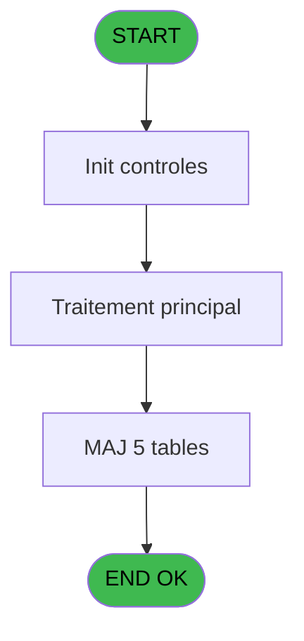
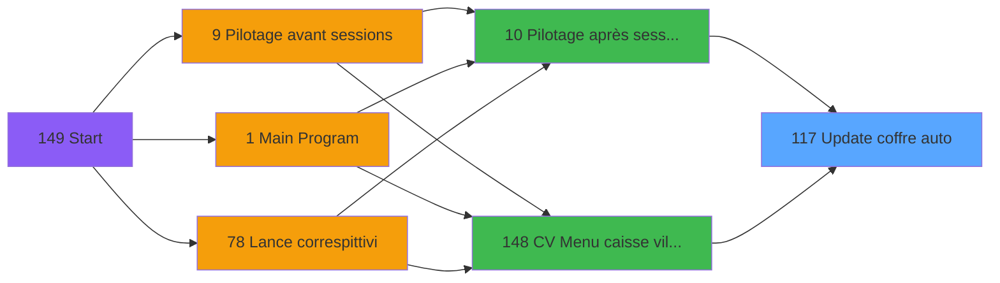
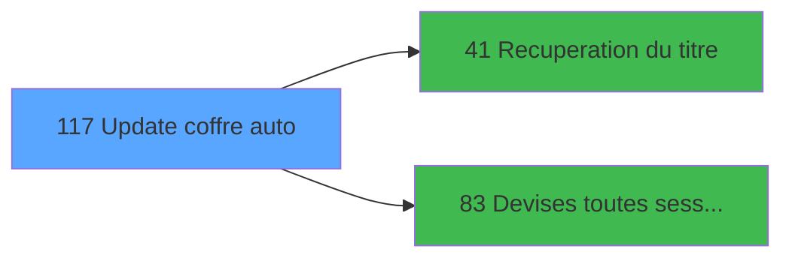

# VIL IDE 117 - Update coffre auto

> **Analyse**: Phases 1-4 2026-02-03 09:30 -> 09:30 (19s) | Assemblage 09:30
> **Pipeline**: V7.2 Enrichi
> **Structure**: 4 onglets (Resume | Ecrans | Donnees | Connexions)

<!-- TAB:Resume -->

## 1. FICHE D'IDENTITE

| Attribut | Valeur |
|----------|--------|
| Projet | VIL |
| IDE Position | 117 |
| Nom Programme | Update coffre auto |
| Fichier source | `Prg_117.xml` |
| Domaine metier | Caisse |
| Taches | 18 (1 ecrans visibles) |
| Tables modifiees | 5 |
| Programmes appeles | 2 |

## 2. DESCRIPTION FONCTIONNELLE

**Update coffre auto** assure la gestion complete de ce processus, accessible depuis [Pilotage après sessions (IDE 10)](VIL-IDE-10.md), [CV  Menu caisse village (IDE 148)](VIL-IDE-148.md).

Le flux de traitement s'organise en **5 blocs fonctionnels** :

- **Traitement** (8 taches) : traitements metier divers
- **Calcul** (5 taches) : calculs de montants, stocks ou compteurs
- **Creation** (3 taches) : insertion d'enregistrements en base (mouvements, prestations)
- **Validation** (1 tache) : controles et verifications de coherence
- **Initialisation** (1 tache) : reinitialisation d'etats et de variables de travail

**Donnees modifiees** : 5 tables en ecriture (detail_coffre, detail_coffre_devise, histo_detail_coffre, histo_montants_coffre, pv_customer).

Detail : phases du traitement

#### Phase 1 : Traitement (8 taches)

- **117** - (sans nom) **[[ECRAN]](#ecran-t1)**
- **117.1** - Param caisse
- **117.3.1** - Histo
- **117.3.1.1** - Histo devise
- **117.3.2.2** - Update 304
- **117.4** - session non clôturees
- **117.4.1** - Lect histo session v1
- **117.4.2** - Lect histo session v1

Delegue a : [Recuperation du titre (IDE 41)](VIL-IDE-41.md), [Devises toutes sessions (IDE 83)](VIL-IDE-83.md)

#### Phase 2 : Calcul (5 taches)

- **117.2** - date comptable derniere clotur
- **117.3.2** - Lecture devises calculees
- **117.3.3** - comptage coffre ?
- **117.3.4** - recup montants comptes
- **117.5** - Calcul solde et sortie

#### Phase 3 : Validation (1 tache)

- **117.3** - Validation Update coffre

#### Phase 4 : Initialisation (1 tache)

- **117.3.2.1** - RAZ 304

#### Phase 5 : Creation (3 taches)

- **117.4.1.1** - Creation 341
- **117.5.1** - Creation
- **117.4.2.1** - Creation 341

#### Tables impactees

| Table | Operations | Role metier |
|-------|-----------|-------------|
| pv_customer | R/**W**/L (6 usages) |  |
| detail_coffre_devise | R/**W**/L (4 usages) | Etat du coffre |
| histo_montants_coffre | **W** (1 usages) | Etat du coffre |
| detail_coffre | **W** (1 usages) | Etat du coffre |
| histo_detail_coffre | **W** (1 usages) | Etat du coffre |

## 3. BLOCS FONCTIONNELS

### 3.1 Traitement (8 taches)

Traitements internes.

---

#### 117 - (sans nom) [[ECRAN]](#ecran-t1)

**Role** : Tache d'orchestration : point d'entree du programme (8 sous-taches). Coordonne l'enchainement des traitements.
**Ecran** : 1040 x 271 DLU (MDI) | [Voir mockup](#ecran-t1)

7 sous-taches directes

| Tache | Nom | Bloc |
|-------|-----|------|
| [117.1](#t2) | Param caisse | Traitement |
| [117.3.1](#t5) | Histo | Traitement |
| [117.3.1.1](#t6) | Histo devise | Traitement |
| [117.3.2.2](#t9) | Update 304 | Traitement |
| [117.4](#t13) | session non clôturees | Traitement |
| [117.4.1](#t14) | Lect histo session v1 | Traitement |
| [117.4.2](#t24) | Lect histo session v1 | Traitement |

**Delegue a** : [Recuperation du titre (IDE 41)](VIL-IDE-41.md), [Devises toutes sessions (IDE 83)](VIL-IDE-83.md)

---

#### 117.1 - Param caisse

**Role** : Traitement : Param caisse.
**Variables liees** : A (Param societe), B (Param devise locale), C (Param masque montant), D (Param date comptable), E (Param Solde comptee Total)
**Delegue a** : [Recuperation du titre (IDE 41)](VIL-IDE-41.md), [Devises toutes sessions (IDE 83)](VIL-IDE-83.md)

---

#### 117.3.1 - Histo

**Role** : Traitement : Histo.
**Delegue a** : [Recuperation du titre (IDE 41)](VIL-IDE-41.md), [Devises toutes sessions (IDE 83)](VIL-IDE-83.md)

---

#### 117.3.1.1 - Histo devise

**Role** : Traitement : Histo devise.
**Variables liees** : B (Param devise locale), K (Param Solde comptee Nb devises)
**Delegue a** : [Recuperation du titre (IDE 41)](VIL-IDE-41.md), [Devises toutes sessions (IDE 83)](VIL-IDE-83.md)

---

#### 117.3.2.2 - Update 304

**Role** : Traitement : Update 304.
**Delegue a** : [Recuperation du titre (IDE 41)](VIL-IDE-41.md), [Devises toutes sessions (IDE 83)](VIL-IDE-83.md)

---

#### 117.4 - session non clôturees

**Role** : Traitement : session non clôturees.
**Delegue a** : [Recuperation du titre (IDE 41)](VIL-IDE-41.md), [Devises toutes sessions (IDE 83)](VIL-IDE-83.md)

---

#### 117.4.1 - Lect histo session v1

**Role** : Traitement : Lect histo session v1.
**Delegue a** : [Recuperation du titre (IDE 41)](VIL-IDE-41.md), [Devises toutes sessions (IDE 83)](VIL-IDE-83.md)

---

#### 117.4.2 - Lect histo session v1

**Role** : Traitement : Lect histo session v1.
**Delegue a** : [Recuperation du titre (IDE 41)](VIL-IDE-41.md), [Devises toutes sessions (IDE 83)](VIL-IDE-83.md)

### 3.2 Calcul (5 taches)

Calculs metier : montants, stocks, compteurs.

---

#### 117.2 - date comptable derniere clotur

**Role** : Traitement : date comptable derniere clotur.
**Variables liees** : D (Param date comptable), O (param cloture auto est en cours), P (Date comptable derniere cloture), T (cloture_auto)

---

#### 117.3.2 - Lecture devises calculees

**Role** : Calcul : Lecture devises calculees.
**Variables liees** : K (Param Solde comptee Nb devises)

---

#### 117.3.3 - comptage coffre ?

**Role** : Traitement : comptage coffre ?.
**Variables liees** : M (Param N° Term coffre2), N (Param Hostame coffre2), S (COFFRE 2 actif)

---

#### 117.3.4 - recup montants comptes

**Role** : Consultation/chargement : recup montants comptes.

---

#### 117.5 - Calcul solde et sortie

**Role** : Calcul : Calcul solde et sortie.
**Variables liees** : E (Param Solde comptee Total), F (Param Solde comptee Monnaie), G (Param Solde comptee Prosuits), H (Param Solde comptee Cartes), I (Param Solde comptee Cheques)

### 3.3 Validation (1 tache)

Controles de coherence : 1 tache verifie les donnees et conditions.

---

#### 117.3 - Validation Update coffre

**Role** : Verification : Validation Update coffre.
**Variables liees** : M (Param N° Term coffre2), N (Param Hostame coffre2), S (COFFRE 2 actif)

### 3.4 Initialisation (1 tache)

Reinitialisation d'etats et variables de travail.

---

#### 117.3.2.1 - RAZ 304

**Role** : Reinitialisation : RAZ 304.

### 3.5 Creation (3 taches)

Insertion de nouveaux enregistrements en base.

---

#### 117.4.1.1 - Creation 341

**Role** : Creation d'enregistrement : Creation 341.

---

#### 117.5.1 - Creation

**Role** : Creation d'enregistrement : Creation.

---

#### 117.4.2.1 - Creation 341

**Role** : Creation d'enregistrement : Creation 341.

## 5. REGLES METIER

*(Aucune regle metier identifiee)*

## 6. CONTEXTE

- **Appele par**: [Pilotage après sessions (IDE 10)](VIL-IDE-10.md), [CV  Menu caisse village (IDE 148)](VIL-IDE-148.md)
- **Appelle**: 2 programmes | **Tables**: 13 (W:5 R:8 L:4) | **Taches**: 18 | **Expressions**: 4

<!-- TAB:Ecrans -->

## 8. ECRANS

### 8.1 Forms visibles (1 / 18)

| # | Position | Tache | Nom | Type | Largeur | Hauteur | Bloc |
|---|----------|-------|-----|------|---------|---------|------|
| 1 | 117 | 117 | (sans nom) | MDI | 1040 | 271 | Traitement |

### 8.2 Mockups Ecrans

---

#### 117 - (sans nom)
**Tache** : [117](#t1) | **Type** : MDI | **Dimensions** : 1040 x 271 DLU
**Bloc** : Traitement | **Titre IDE** : (sans nom)

<!-- FORM-DATA:
{
    "width":  1040,
    "vFactor":  8,
    "type":  "MDI",
    "hFactor":  8,
    "controls":  [
                     {
                         "x":  120,
                         "type":  "label",
                         "var":  "",
                         "y":  127,
                         "w":  800,
                         "fmt":  "",
                         "name":  "",
                         "h":  16,
                         "color":  "142",
                         "text":  "Mise à jour automatique du coffre",
                         "parent":  null
                     }
                 ],
    "taskId":  "117",
    "height":  271
}
-->

## 9. NAVIGATION

Ecran unique: ****

### 9.3 Structure hierarchique (18 taches)

| Position | Tache | Type | Dimensions | Bloc |
|----------|-------|------|------------|------|
| **117.1** | [**(sans nom)** (117)](#t1) [mockup](#ecran-t1) | MDI | 1040x271 | Traitement |
| 117.1.1 | [Param caisse (117.1)](#t2) | MDI | - | |
| 117.1.2 | [Histo (117.3.1)](#t5) | MDI | - | |
| 117.1.3 | [Histo devise (117.3.1.1)](#t6) | MDI | - | |
| 117.1.4 | [Update 304 (117.3.2.2)](#t9) | MDI | - | |
| 117.1.5 | [session non clôturees (117.4)](#t13) | MDI | - | |
| 117.1.6 | [Lect histo session v1 (117.4.1)](#t14) | MDI | - | |
| 117.1.7 | [Lect histo session v1 (117.4.2)](#t24) | MDI | - | |
| **117.2** | [**date comptable derniere clotur** (117.2)](#t3) | MDI | - | Calcul |
| 117.2.1 | [Lecture devises calculees (117.3.2)](#t7) | MDI | - | |
| 117.2.2 | [comptage coffre ? (117.3.3)](#t10) | MDI | - | |
| 117.2.3 | [recup montants comptes (117.3.4)](#t11) | MDI | - | |
| 117.2.4 | [Calcul solde et sortie (117.5)](#t20) | MDI | - | |
| **117.3** | [**Validation Update coffre** (117.3)](#t4) | MDI | - | Validation |
| **117.4** | [**RAZ 304** (117.3.2.1)](#t8) | MDI | - | Initialisation |
| **117.5** | [**Creation 341** (117.4.1.1)](#t15) | MDI | - | Creation |
| 117.5.1 | [Creation (117.5.1)](#t21) | MDI | - | |
| 117.5.2 | [Creation 341 (117.4.2.1)](#t25) | MDI | - | |

### 9.4 Algorigramme

> **Legende**: Vert = START/END OK | Rouge = END KO | Bleu = Decisions
> *Algorigramme auto-genere. Utiliser `/algorigramme` pour une synthese metier detaillee.*

<!-- TAB:Donnees -->

## 10. TABLES

### Tables utilisees (13)

| ID | Nom | Description | Type | R | W | L | Usages |
|----|-----|-------------|------|---|---|---|--------|
| 55 | solde_caisse_____sks | Sessions de caisse | DB | R |   |   | 1 |
| 57 | devises_caisse___ddk | Sessions de caisse | DB | R |   |   | 1 |
| 228 | detail_coffre | Etat du coffre | DB |   | **W** |   | 1 |
| 229 | detail_coffre_devise | Etat du coffre | DB | R | **W** | L | 4 |
| 230 | histo_detail_coffre | Etat du coffre | DB |   | **W** |   | 1 |
| 231 | histo_detail_coffre_devise | Etat du coffre | DB |   |   | L | 1 |
| 236 | histo_montants_coffre | Etat du coffre | DB |   | **W** |   | 1 |
| 246 | histo_sessions_caisse | Sessions de caisse | DB | R |   |   | 1 |
| 249 | histo_sessions_caisse_detail | Sessions de caisse | DB | R |   |   | 2 |
| 250 | histo_sessions_caisse_devise | Sessions de caisse | DB |   |   | L | 3 |
| 255 | suivi_pdc |  | DB | R |   |   | 1 |
| 508 | pv_customer |  | TMP | R | **W** | L | 6 |
| 697 | droits_applications | Droits operateur | DB | R |   |   | 1 |

### Colonnes par table (8 / 11 tables avec colonnes identifiees)

Table 55 - solde_caisse_____sks (R) - 1 usages

| Lettre | Variable | Acces | Type |
|--------|----------|-------|------|
| E | Param Solde comptee Total | R | Numeric |
| F | Param Solde comptee Monnaie | R | Numeric |
| G | Param Solde comptee Prosuits | R | Numeric |
| H | Param Solde comptee Cartes | R | Numeric |
| I | Param Solde comptee Cheques | R | Numeric |
| J | Param Solde comptee Od | R | Numeric |
| K | Param Solde comptee Nb devises | R | Numeric |

Table 57 - devises_caisse___ddk (R) - 1 usages

| Lettre | Variable | Acces | Type |
|--------|----------|-------|------|
| K | Param Solde comptee Nb devises | R | Numeric |

Table 228 - detail_coffre (**W**) - 1 usages

| Lettre | Variable | Acces | Type |
|--------|----------|-------|------|
| A | comptage coffre est fait | W | Logical |
| M | Param N° Term coffre2 | W | Numeric |
| N | Param Hostame coffre2 | W | Unicode |
| S | COFFRE 2 actif | W | Alpha |

Table 229 - detail_coffre_devise (R/**W**/L) - 4 usages

| Lettre | Variable | Acces | Type |
|--------|----------|-------|------|
| A | comptage coffre est fait | W | Logical |
| B | Param devise locale | W | Alpha |
| K | Param Solde comptee Nb devises | W | Numeric |
| M | Param N° Term coffre2 | W | Numeric |
| N | Param Hostame coffre2 | W | Unicode |
| S | COFFRE 2 actif | W | Alpha |

Table 230 - histo_detail_coffre (**W**) - 1 usages

| Lettre | Variable | Acces | Type |
|--------|----------|-------|------|
| A | comptage coffre est fait | W | Logical |
| M | Param N° Term coffre2 | W | Numeric |
| N | Param Hostame coffre2 | W | Unicode |
| S | COFFRE 2 actif | W | Alpha |

Table 236 - histo_montants_coffre (**W**) - 1 usages

| Lettre | Variable | Acces | Type |
|--------|----------|-------|------|
| A | comptage coffre est fait | W | Logical |
| M | Param N° Term coffre2 | W | Numeric |
| N | Param Hostame coffre2 | W | Unicode |
| S | COFFRE 2 actif | W | Alpha |

Table 246 - histo_sessions_caisse (R) - 1 usages

*Table utilisee uniquement en Link ou aucune colonne Real identifiee dans le DataView.*

Table 249 - histo_sessions_caisse_detail (R) - 2 usages

*Table utilisee uniquement en Link ou aucune colonne Real identifiee dans le DataView.*

Table 255 - suivi_pdc (R) - 1 usages

*Table utilisee uniquement en Link ou aucune colonne Real identifiee dans le DataView.*

Table 508 - pv_customer (R/**W**/L) - 6 usages

*Table utilisee uniquement en Link ou aucune colonne Real identifiee dans le DataView.*

Table 697 - droits_applications (R) - 1 usages

*Table utilisee uniquement en Link ou aucune colonne Real identifiee dans le DataView.*

## 11. VARIABLES

### 11.1 Autres (20)

Variables diverses.

| Lettre | Nom | Type | Usage dans |
|--------|-----|------|-----------|
| A | Param societe | Alpha | - |
| B | Param devise locale | Alpha | - |
| C | Param masque montant | Alpha | - |
| D | Param date comptable | Date | - |
| E | Param Solde comptee Total | Numeric | - |
| F | Param Solde comptee Monnaie | Numeric | - |
| G | Param Solde comptee Prosuits | Numeric | - |
| H | Param Solde comptee Cartes | Numeric | - |
| I | Param Solde comptee Cheques | Numeric | - |
| J | Param Solde comptee Od | Numeric | - |
| K | Param Solde comptee Nb devises | Numeric | - |
| L | Param Nbre Decimales | Numeric | - |
| M | Param N° Term coffre2 | Numeric | - |
| N | Param Hostame coffre2 | Unicode | - |
| O | param cloture auto est en cours | Logical | - |
| P | Date comptable derniere cloture | Date | - |
| Q | titre | Alpha | - |
| R | Total change Achat | Numeric | - |
| S | COFFRE 2 actif | Alpha | - |
| T | cloture_auto | Logical | - |

Toutes les 20 variables (liste complete)

| Cat | Lettre | Nom Variable | Type |
|-----|--------|--------------|------|
| Autre | **A** | Param societe | Alpha |
| Autre | **B** | Param devise locale | Alpha |
| Autre | **C** | Param masque montant | Alpha |
| Autre | **D** | Param date comptable | Date |
| Autre | **E** | Param Solde comptee Total | Numeric |
| Autre | **F** | Param Solde comptee Monnaie | Numeric |
| Autre | **G** | Param Solde comptee Prosuits | Numeric |
| Autre | **H** | Param Solde comptee Cartes | Numeric |
| Autre | **I** | Param Solde comptee Cheques | Numeric |
| Autre | **J** | Param Solde comptee Od | Numeric |
| Autre | **K** | Param Solde comptee Nb devises | Numeric |
| Autre | **L** | Param Nbre Decimales | Numeric |
| Autre | **M** | Param N° Term coffre2 | Numeric |
| Autre | **N** | Param Hostame coffre2 | Unicode |
| Autre | **O** | param cloture auto est en cours | Logical |
| Autre | **P** | Date comptable derniere cloture | Date |
| Autre | **Q** | titre | Alpha |
| Autre | **R** | Total change Achat | Numeric |
| Autre | **S** | COFFRE 2 actif | Alpha |
| Autre | **T** | cloture_auto | Logical |

## 12. EXPRESSIONS

**4 / 4 expressions decodees (100%)**

### 12.1 Repartition par type

| Type | Expressions | Regles |
|------|-------------|--------|
| CONSTANTE | 1 | 0 |
| OTHER | 2 | 0 |
| STRING | 1 | 0 |

### 12.2 Expressions cles par type

#### CONSTANTE (1 expressions)

| Type | IDE | Expression | Regle |
|------|-----|------------|-------|
| CONSTANTE | 2 | `244` | - |

#### OTHER (2 expressions)

| Type | IDE | Expression | Regle |
|------|-----|------------|-------|
| OTHER | 4 | `DbDel ('{508,2}'DSOURCE,'')` | - |
| OTHER | 1 | `Delay (10)` | - |

#### STRING (1 expressions)

| Type | IDE | Expression | Regle |
|------|-----|------------|-------|
| STRING | 3 | `Trim (Date comptable dernier... [P])` | - |

<!-- TAB:Connexions -->

## 13. GRAPHE D'APPELS

### 13.1 Chaine depuis Main (Callers)

Main -> ... -> [Pilotage après sessions (IDE 10)](VIL-IDE-10.md) -> **Update coffre auto (IDE 117)**

Main -> ... -> [CV  Menu caisse village (IDE 148)](VIL-IDE-148.md) -> **Update coffre auto (IDE 117)**

### 13.2 Callers

| IDE | Nom Programme | Nb Appels |
|-----|---------------|-----------|
| [10](VIL-IDE-10.md) | Pilotage après sessions | 1 |
| [148](VIL-IDE-148.md) | CV  Menu caisse village | 1 |

### 13.3 Callees (programmes appeles)

### 13.4 Detail Callees avec contexte

| IDE | Nom Programme | Appels | Contexte |
|-----|---------------|--------|----------|
| [41](VIL-IDE-41.md) | Recuperation du titre | 1 | Recuperation donnees |
| [83](VIL-IDE-83.md) | Devises toutes sessions | 1 | Gestion session |

## 14. RECOMMANDATIONS MIGRATION

### 14.1 Profil du programme

| Metrique | Valeur | Impact migration |
|----------|--------|-----------------|
| Lignes de logique | 280 | Taille moyenne |
| Expressions | 4 | Peu de logique |
| Tables WRITE | 5 | Impact modere |
| Sous-programmes | 2 | Peu de dependances |
| Ecrans visibles | 1 | Ecran unique ou traitement batch |
| Code desactive | 0% (0 / 280) | Code sain |
| Regles metier | 0 | Pas de regle identifiee |

### 14.2 Plan de migration par bloc

#### Traitement (8 taches: 1 ecran, 7 traitements)

- **Strategie** : Orchestrateur avec 1 ecrans (Razor/React) et 7 traitements backend (services).
- Les ecrans deviennent des composants UI, les traitements invisibles deviennent des services injectables.
- 2 sous-programme(s) a migrer ou a reutiliser depuis les services existants.
- Decomposer les taches en services unitaires testables.

#### Calcul (5 taches: 0 ecran, 5 traitements)

- **Strategie** : Services de calcul purs (Domain Services).
- Migrer la logique de calcul (stock, compteurs, montants)

#### Validation (1 tache: 0 ecran, 1 traitement)

- **Strategie** : FluentValidation avec validators specifiques.
- Chaque tache de validation -> un validator injectable

#### Initialisation (1 tache: 0 ecran, 1 traitement)

- **Strategie** : Constructeur/methode `InitAsync()` dans l'orchestrateur.

#### Creation (3 taches: 0 ecran, 3 traitements)

- **Strategie** : Repository pattern avec Entity Framework Core.
- Insertion via `IRepository<T>.CreateAsync()`

### 14.3 Dependances critiques

| Dependance | Type | Appels | Impact |
|------------|------|--------|--------|
| detail_coffre | Table WRITE (Database) | 1x | Schema + repository |
| detail_coffre_devise | Table WRITE (Database) | 2x | Schema + repository |
| histo_detail_coffre | Table WRITE (Database) | 1x | Schema + repository |
| histo_montants_coffre | Table WRITE (Database) | 1x | Schema + repository |
| pv_customer | Table WRITE (Temp) | 3x | Schema + repository |
| [Devises toutes sessions (IDE 83)](VIL-IDE-83.md) | Sous-programme | 1x | Normale - Gestion session |
| [Recuperation du titre (IDE 41)](VIL-IDE-41.md) | Sous-programme | 1x | Normale - Recuperation donnees |

---
*Spec DETAILED generee par Pipeline V7.2 - 2026-02-03 09:30*
