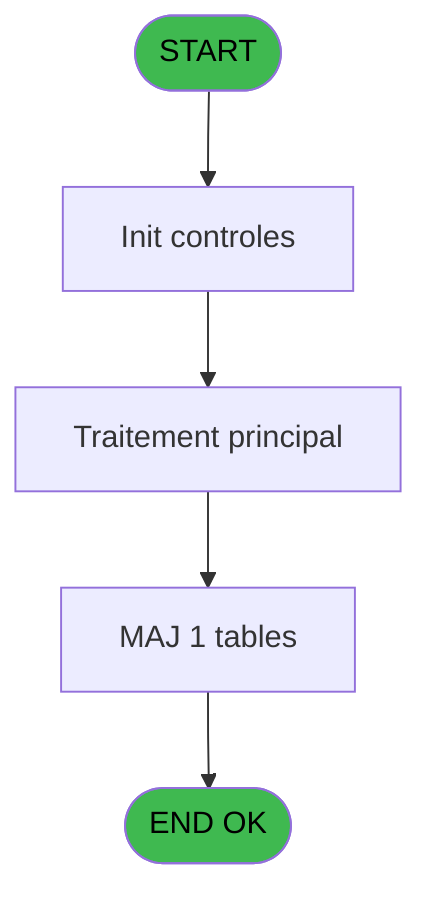
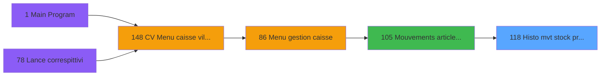
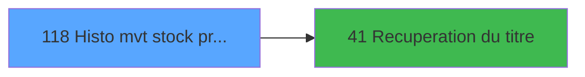

# VIL IDE 118 - Histo mvt stock produits

> **Analyse**: Phases 1-4 2026-02-03 09:30 -> 09:30 (20s) | Assemblage 09:30
> **Pipeline**: V7.2 Enrichi
> **Structure**: 4 onglets (Resume | Ecrans | Donnees | Connexions)

<!-- TAB:Resume -->

## 1. FICHE D'IDENTITE

| Attribut | Valeur |
|----------|--------|
| Projet | VIL |
| IDE Position | 118 |
| Nom Programme | Histo mvt stock produits |
| Fichier source | `Prg_118.xml` |
| Domaine metier | General |
| Taches | 4 (1 ecrans visibles) |
| Tables modifiees | 1 |
| Programmes appeles | 1 |

## 2. DESCRIPTION FONCTIONNELLE

**Histo mvt stock produits** assure la gestion complete de ce processus, accessible depuis [Mouvements article coffre (IDE 105)](VIL-IDE-105.md).

Le flux de traitement s'organise en **3 blocs fonctionnels** :

- **Calcul** (2 taches) : calculs de montants, stocks ou compteurs
- **Creation** (1 tache) : insertion d'enregistrements en base (mouvements, prestations)
- **Initialisation** (1 tache) : reinitialisation d'etats et de variables de travail

**Donnees modifiees** : 1 tables en ecriture (import_identite__imi).

**Logique metier** : 1 regles identifiees couvrant conditions metier.

Detail : phases du traitement

#### Phase 1 : Calcul (2 taches)

- **118** - Histo mvt stock produits **[[ECRAN]](#ecran-t1)**
- **118.2** - Calcul cumul

#### Phase 2 : Initialisation (1 tache)

- **118.1** - RAZ tempo

#### Phase 3 : Creation (1 tache)

- **118.2.1** - create

#### Tables impactees

| Table | Operations | Role metier |
|-------|-----------|-------------|
| import_identite__imi | R/**W** (4 usages) |  |

## 3. BLOCS FONCTIONNELS

### 3.1 Calcul (2 taches)

Calculs metier : montants, stocks, compteurs.

---

#### 118 - Histo mvt stock produits [[ECRAN]](#ecran-t1)

**Role** : Calcul : Histo mvt stock produits.
**Ecran** : 1123 x 243 DLU (MDI) | [Voir mockup](#ecran-t1)

---

#### 118.2 - Calcul cumul

**Role** : Calcul : Calcul cumul.

### 3.2 Initialisation (1 tache)

Reinitialisation d'etats et variables de travail.

---

#### 118.1 - RAZ tempo

**Role** : Reinitialisation : RAZ tempo.

### 3.3 Creation (1 tache)

Insertion de nouveaux enregistrements en base.

---

#### 118.2.1 - create

**Role** : Traitement : create.

## 5. REGLES METIER

1 regles identifiees:

### Autres (1 regles)

#### [RM-001] Si [M]='E' alors MlsTrans ('Entree') sinon MlsTrans ('Sortie'))

| Element | Detail |
|---------|--------|
| **Condition** | `[M]='E'` |
| **Si vrai** | MlsTrans ('Entree') |
| **Si faux** | MlsTrans ('Sortie')) |
| **Expression source** | Expression 3 : `IF ([M]='E',MlsTrans ('Entree'),MlsTrans ('Sortie'))` |
| **Exemple** | Si [M]='E' → MlsTrans ('Entree'). Sinon → MlsTrans ('Sortie')) |

## 6. CONTEXTE

- **Appele par**: [Mouvements article coffre (IDE 105)](VIL-IDE-105.md)
- **Appelle**: 1 programmes | **Tables**: 2 (W:1 R:1 L:1) | **Taches**: 4 | **Expressions**: 7

<!-- TAB:Ecrans -->

## 8. ECRANS

### 8.1 Forms visibles (1 / 4)

| # | Position | Tache | Nom | Type | Largeur | Hauteur | Bloc |
|---|----------|-------|-----|------|---------|---------|------|
| 1 | 118 | 118 | Histo mvt stock produits | MDI | 1123 | 243 | Calcul |

### 8.2 Mockups Ecrans

---

#### 118 - Histo mvt stock produits
**Tache** : [118](#t1) | **Type** : MDI | **Dimensions** : 1123 x 243 DLU
**Bloc** : Calcul | **Titre IDE** : Histo mvt stock produits

<!-- FORM-DATA:
{
    "width":  1123,
    "vFactor":  8,
    "type":  "MDI",
    "hFactor":  8,
    "controls":  [
                     {
                         "x":  0,
                         "type":  "label",
                         "var":  "",
                         "y":  0,
                         "w":  1120,
                         "fmt":  "",
                         "name":  "",
                         "h":  18,
                         "color":  "",
                         "text":  "",
                         "parent":  null
                     },
                     {
                         "x":  220,
                         "type":  "label",
                         "var":  "",
                         "y":  26,
                         "w":  680,
                         "fmt":  "",
                         "name":  "",
                         "h":  12,
                         "color":  "142",
                         "text":  "Historique des mouvements",
                         "parent":  null
                     },
                     {
                         "x":  8,
                         "type":  "table",
                         "var":  "",
                         "name":  "",
                         "titleH":  12,
                         "color":  "110",
                         "w":  1110,
                         "y":  46,
                         "fmt":  "",
                         "parent":  null,
                         "text":  "",
                         "rowH":  10,
                         "h":  131,
                         "cols":  [
                                      {
                                          "title":  "Chrono",
                                          "layer":  1,
                                          "w":  74
                                      },
                                      {
                                          "title":  "Libellé",
                                          "layer":  2,
                                          "w":  171
                                      },
                                      {
                                          "title":  "Prix Unitaire",
                                          "layer":  3,
                                          "w":  106
                                      },
                                      {
                                          "title":  "Quantité",
                                          "layer":  4,
                                          "w":  92
                                      },
                                      {
                                          "title":  "Montant",
                                          "layer":  5,
                                          "w":  212
                                      },
                                      {
                                          "title":  "Type",
                                          "layer":  6,
                                          "w":  75
                                      },
                                      {
                                          "title":  "Date",
                                          "layer":  7,
                                          "w":  123
                                      },
                                      {
                                          "title":  "Heure",
                                          "layer":  8,
                                          "w":  98
                                      },
                                      {
                                          "title":  "Utilisateur",
                                          "layer":  9,
                                          "w":  126
                                      }
                                  ],
                         "rows":  9
                     },
                     {
                         "x":  194,
                         "type":  "label",
                         "var":  "",
                         "y":  181,
                         "w":  160,
                         "fmt":  "",
                         "name":  "",
                         "h":  8,
                         "color":  "",
                         "text":  "Total entrées",
                         "parent":  null
                     },
                     {
                         "x":  194,
                         "type":  "label",
                         "var":  "",
                         "y":  192,
                         "w":  160,
                         "fmt":  "",
                         "name":  "",
                         "h":  8,
                         "color":  "",
                         "text":  "Total sorties",
                         "parent":  null
                     },
                     {
                         "x":  194,
                         "type":  "label",
                         "var":  "",
                         "y":  203,
                         "w":  160,
                         "fmt":  "",
                         "name":  "",
                         "h":  8,
                         "color":  "",
                         "text":  "Stock",
                         "parent":  null
                     },
                     {
                         "x":  0,
                         "type":  "label",
                         "var":  "",
                         "y":  216,
                         "w":  1120,
                         "fmt":  "",
                         "name":  "",
                         "h":  24,
                         "color":  "",
                         "text":  "",
                         "parent":  null
                     },
                     {
                         "x":  14,
                         "type":  "edit",
                         "var":  "",
                         "y":  60,
                         "w":  64,
                         "fmt":  "",
                         "name":  "",
                         "h":  8,
                         "color":  "110",
                         "text":  "",
                         "parent":  5
                     },
                     {
                         "x":  88,
                         "type":  "edit",
                         "var":  "",
                         "y":  60,
                         "w":  160,
                         "fmt":  "",
                         "name":  "",
                         "h":  8,
                         "color":  "110",
                         "text":  "",
                         "parent":  5
                     },
                     {
                         "x":  259,
                         "type":  "edit",
                         "var":  "",
                         "y":  60,
                         "w":  95,
                         "fmt":  "",
                         "name":  "",
                         "h":  8,
                         "color":  "110",
                         "text":  "",
                         "parent":  5
                     },
                     {
                         "x":  365,
                         "type":  "edit",
                         "var":  "",
                         "y":  60,
                         "w":  80,
                         "fmt":  "",
                         "name":  "",
                         "h":  8,
                         "color":  "110",
                         "text":  "",
                         "parent":  5
                     },
                     {
                         "x":  458,
                         "type":  "edit",
                         "var":  "",
                         "y":  60,
                         "w":  198,
                         "fmt":  "",
                         "name":  "",
                         "h":  8,
                         "color":  "110",
                         "text":  "",
                         "parent":  5
                     },
                     {
                         "x":  744,
                         "type":  "edit",
                         "var":  "",
                         "y":  60,
                         "w":  112,
                         "fmt":  "",
                         "name":  "",
                         "h":  8,
                         "color":  "110",
                         "text":  "",
                         "parent":  5
                     },
                     {
                         "x":  869,
                         "type":  "edit",
                         "var":  "",
                         "y":  60,
                         "w":  85,
                         "fmt":  "",
                         "name":  "",
                         "h":  8,
                         "color":  "110",
                         "text":  "",
                         "parent":  5
                     },
                     {
                         "x":  964,
                         "type":  "edit",
                         "var":  "",
                         "y":  60,
                         "w":  112,
                         "fmt":  "",
                         "name":  "",
                         "h":  8,
                         "color":  "110",
                         "text":  "",
                         "parent":  5
                     },
                     {
                         "x":  365,
                         "type":  "edit",
                         "var":  "",
                         "y":  181,
                         "w":  80,
                         "fmt":  "6Z",
                         "name":  "",
                         "h":  8,
                         "color":  "",
                         "text":  "",
                         "parent":  null
                     },
                     {
                         "x":  365,
                         "type":  "edit",
                         "var":  "",
                         "y":  192,
                         "w":  80,
                         "fmt":  "6Z",
                         "name":  "",
                         "h":  8,
                         "color":  "",
                         "text":  "",
                         "parent":  null
                     },
                     {
                         "x":  365,
                         "type":  "edit",
                         "var":  "",
                         "y":  203,
                         "w":  80,
                         "fmt":  "6Z",
                         "name":  "",
                         "h":  8,
                         "color":  "",
                         "text":  "",
                         "parent":  null
                     },
                     {
                         "x":  862,
                         "type":  "edit",
                         "var":  "",
                         "y":  5,
                         "w":  248,
                         "fmt":  "WWW  DD MMM YYYYT",
                         "name":  "",
                         "h":  8,
                         "color":  "",
                         "text":  "",
                         "parent":  null
                     },
                     {
                         "x":  670,
                         "type":  "edit",
                         "var":  "",
                         "y":  60,
                         "w":  64,
                         "fmt":  "7",
                         "name":  "",
                         "h":  8,
                         "color":  "110",
                         "text":  "",
                         "parent":  5
                     },
                     {
                         "x":  12,
                         "type":  "button",
                         "var":  "",
                         "y":  219,
                         "w":  154,
                         "fmt":  "\u0026Quitter",
                         "name":  "",
                         "h":  18,
                         "color":  "",
                         "text":  "",
                         "parent":  null
                     },
                     {
                         "x":  2,
                         "type":  "edit",
                         "var":  "",
                         "y":  5,
                         "w":  267,
                         "fmt":  "30",
                         "name":  "",
                         "h":  8,
                         "color":  "",
                         "text":  "",
                         "parent":  null
                     }
                 ],
    "taskId":  "118",
    "height":  243
}
-->

<strong>Champs : 14 champs</strong>

| Pos (x,y) | Nom | Variable | Type |
|-----------|-----|----------|------|
| 14,60 | (sans nom) | - | edit |
| 88,60 | (sans nom) | - | edit |
| 259,60 | (sans nom) | - | edit |
| 365,60 | (sans nom) | - | edit |
| 458,60 | (sans nom) | - | edit |
| 744,60 | (sans nom) | - | edit |
| 869,60 | (sans nom) | - | edit |
| 964,60 | (sans nom) | - | edit |
| 365,181 | 6Z | - | edit |
| 365,192 | 6Z | - | edit |
| 365,203 | 6Z | - | edit |
| 862,5 | WWW  DD MMM YYYYT | - | edit |
| 670,60 | 7 | - | edit |
| 2,5 | 30 | - | edit |

<strong>Boutons : 1 boutons</strong>

| Bouton | Pos (x,y) | Action |
|--------|-----------|--------|
| Quitter | 12,219 | Quitte le programme |

## 9. NAVIGATION

Ecran unique: **Histo mvt stock produits**

### 9.3 Structure hierarchique (4 taches)

| Position | Tache | Type | Dimensions | Bloc |
|----------|-------|------|------------|------|
| **118.1** | [**Histo mvt stock produits** (118)](#t1) [mockup](#ecran-t1) | MDI | 1123x243 | Calcul |
| 118.1.1 | [Calcul cumul (118.2)](#t3) | MDI | - | |
| **118.2** | [**RAZ tempo** (118.1)](#t2) | MDI | - | Initialisation |
| **118.3** | [**create** (118.2.1)](#t4) | MDI | - | Creation |

### 9.4 Algorigramme

> **Legende**: Vert = START/END OK | Rouge = END KO | Bleu = Decisions
> *Algorigramme auto-genere. Utiliser `/algorigramme` pour une synthese metier detaillee.*

<!-- TAB:Donnees -->

## 10. TABLES

### Tables utilisees (2)

| ID | Nom | Description | Type | R | W | L | Usages |
|----|-----|-------------|------|---|---|---|--------|
| 237 | mouvement_stock_histo | Mouvements de prestation | DB |   |   | L | 2 |
| 551 | import_identite__imi |  | DB | R | **W** |   | 4 |

### Colonnes par table (1 / 1 tables avec colonnes identifiees)

Table 551 - import_identite__imi (R/**W**) - 4 usages

| Lettre | Variable | Acces | Type |
|--------|----------|-------|------|
| A | Titre | W | Alpha |
| B | CUM Sortie | W | Numeric |
| C | CUM Total | W | Numeric |

## 11. VARIABLES

### 11.1 Autres (3)

Variables diverses.

| Lettre | Nom | Type | Usage dans |
|--------|-----|------|-----------|
| A | Titre | Alpha | - |
| B | CUM Sortie | Numeric | - |
| C | CUM Total | Numeric | - |

## 12. EXPRESSIONS

**7 / 7 expressions decodees (100%)**

### 12.1 Repartition par type

| Type | Expressions | Regles |
|------|-------------|--------|
| CONDITION | 1 | 5 |
| CONSTANTE | 2 | 0 |
| DATE | 1 | 0 |
| REFERENCE_VG | 1 | 0 |
| OTHER | 1 | 0 |
| STRING | 1 | 0 |

### 12.2 Expressions cles par type

#### CONDITION (1 expressions)

| Type | IDE | Expression | Regle |
|------|-----|------------|-------|
| CONDITION | 3 | `IF ([M]='E',MlsTrans ('Entree'),MlsTrans ('Sortie'))` | [RM-001](#rm-RM-001) |

#### CONSTANTE (2 expressions)

| Type | IDE | Expression | Regle |
|------|-----|------------|-------|
| CONSTANTE | 6 | `259` | - |
| CONSTANTE | 4 | `1` | - |

#### DATE (1 expressions)

| Type | IDE | Expression | Regle |
|------|-----|------------|-------|
| DATE | 2 | `Date ()` | - |

#### REFERENCE_VG (1 expressions)

| Type | IDE | Expression | Regle |
|------|-----|------------|-------|
| REFERENCE_VG | 1 | `VG2` | - |

#### OTHER (1 expressions)

| Type | IDE | Expression | Regle |
|------|-----|------------|-------|
| OTHER | 5 | `[K]` | - |

#### STRING (1 expressions)

| Type | IDE | Expression | Regle |
|------|-----|------------|-------|
| STRING | 7 | `Trim ([U])` | - |

<!-- TAB:Connexions -->

## 13. GRAPHE D'APPELS

### 13.1 Chaine depuis Main (Callers)

Main -> ... -> [Mouvements article coffre (IDE 105)](VIL-IDE-105.md) -> **Histo mvt stock produits (IDE 118)**

### 13.2 Callers

| IDE | Nom Programme | Nb Appels |
|-----|---------------|-----------|
| [105](VIL-IDE-105.md) | Mouvements article coffre | 1 |

### 13.3 Callees (programmes appeles)

### 13.4 Detail Callees avec contexte

| IDE | Nom Programme | Appels | Contexte |
|-----|---------------|--------|----------|
| [41](VIL-IDE-41.md) | Recuperation du titre | 1 | Recuperation donnees |

## 14. RECOMMANDATIONS MIGRATION

### 14.1 Profil du programme

| Metrique | Valeur | Impact migration |
|----------|--------|-----------------|
| Lignes de logique | 67 | Programme compact |
| Expressions | 7 | Peu de logique |
| Tables WRITE | 1 | Impact faible |
| Sous-programmes | 1 | Peu de dependances |
| Ecrans visibles | 1 | Ecran unique ou traitement batch |
| Code desactive | 0% (0 / 67) | Code sain |
| Regles metier | 1 | Quelques regles a preserver |

### 14.2 Plan de migration par bloc

#### Calcul (2 taches: 1 ecran, 1 traitement)

- **Strategie** : Services de calcul purs (Domain Services).
- Migrer la logique de calcul (stock, compteurs, montants)

#### Initialisation (1 tache: 0 ecran, 1 traitement)

- **Strategie** : Constructeur/methode `InitAsync()` dans l'orchestrateur.

#### Creation (1 tache: 0 ecran, 1 traitement)

- **Strategie** : Repository pattern avec Entity Framework Core.
- Insertion via `IRepository<T>.CreateAsync()`

### 14.3 Dependances critiques

| Dependance | Type | Appels | Impact |
|------------|------|--------|--------|
| import_identite__imi | Table WRITE (Database) | 3x | Schema + repository |
| [Recuperation du titre (IDE 41)](VIL-IDE-41.md) | Sous-programme | 1x | Normale - Recuperation donnees |

---
*Spec DETAILED generee par Pipeline V7.2 - 2026-02-03 09:30*
