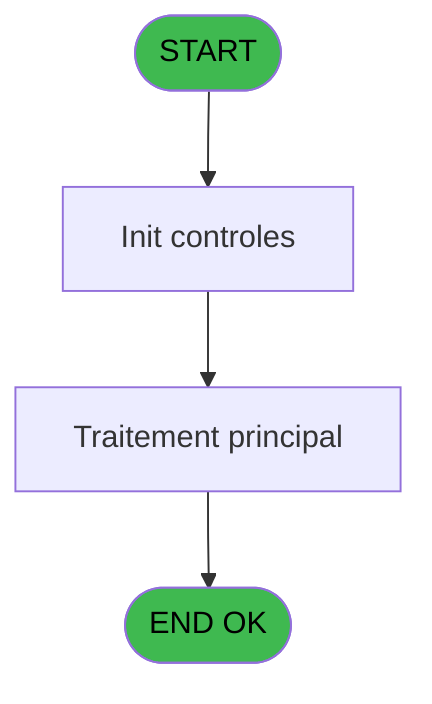
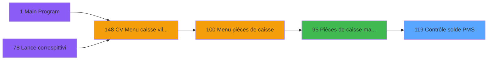

# VIL IDE 119 - Contrôle solde PMS

> **Analyse**: Phases 1-4 2026-02-03 09:31 -> 09:31 (18s) | Assemblage 09:31
> **Pipeline**: V7.2 Enrichi
> **Structure**: 4 onglets (Resume | Ecrans | Donnees | Connexions)

<!-- TAB:Resume -->

## 1. FICHE D'IDENTITE

| Attribut | Valeur |
|----------|--------|
| Projet | VIL |
| IDE Position | 119 |
| Nom Programme | Contrôle solde PMS |
| Fichier source | `Prg_119.xml` |
| Domaine metier | Comptabilite |
| Taches | 7 (1 ecrans visibles) |
| Tables modifiees | 0 |
| Programmes appeles | 0 |

## 2. DESCRIPTION FONCTIONNELLE

**Contrôle solde PMS** assure la gestion complete de ce processus, accessible depuis [Pièces de caisse manuelles (IDE 95)](VIL-IDE-95.md).

Le flux de traitement s'organise en **2 blocs fonctionnels** :

- **Traitement** (6 taches) : traitements metier divers
- **Calcul** (1 tache) : calculs de montants, stocks ou compteurs

Detail : phases du traitement

#### Phase 1 : Traitement (6 taches)

- **119** - Contrôle solde PMS **[[ECRAN]](#ecran-t1)**
- **119.1** - Solde PMS cloture
- **119.2** - Solde PMS coffre
- **119.3.1** - Lecture sessions
- **119.4** - Total FDR
- **119.5** - Ajustement solde PMS

#### Phase 2 : Calcul (1 tache)

- **119.3** - Calcul total des caisse

## 3. BLOCS FONCTIONNELS

### 3.1 Traitement (6 taches)

Traitements internes.

---

#### 119 - Contrôle solde PMS [[ECRAN]](#ecran-t1)

**Role** : Tache d'orchestration : point d'entree du programme (6 sous-taches). Coordonne l'enchainement des traitements.
**Ecran** : 1200 x 0 DLU (MDI) | [Voir mockup](#ecran-t1)

5 sous-taches directes

| Tache | Nom | Bloc |
|-------|-----|------|
| [119.1](#t2) | Solde PMS cloture | Traitement |
| [119.2](#t3) | Solde PMS coffre | Traitement |
| [119.3.1](#t8) | Lecture sessions | Traitement |
| [119.4](#t10) | Total FDR | Traitement |
| [119.5](#t11) | Ajustement solde PMS | Traitement |

**Variables liees** : F (Solde PMS après clôture), G (Solde PMS après contrôle coffre), J (ajustement solde PMS dejà fait)

---

#### 119.1 - Solde PMS cloture

**Role** : Consultation/chargement : Solde PMS cloture.
**Variables liees** : F (Solde PMS après clôture), G (Solde PMS après contrôle coffre), J (ajustement solde PMS dejà fait)

---

#### 119.2 - Solde PMS coffre

**Role** : Consultation/chargement : Solde PMS coffre.
**Variables liees** : D (P0 montant ecart coffre), F (Solde PMS après clôture), G (Solde PMS après contrôle coffre), J (ajustement solde PMS dejà fait)

---

#### 119.3.1 - Lecture sessions

**Role** : Traitement : Lecture sessions.

---

#### 119.4 - Total FDR

**Role** : Traitement : Total FDR.
**Variables liees** : H (Total des caisses), I (Total FDR)

---

#### 119.5 - Ajustement solde PMS

**Role** : Consultation/chargement : Ajustement solde PMS.
**Variables liees** : F (Solde PMS après clôture), G (Solde PMS après contrôle coffre), J (ajustement solde PMS dejà fait)

### 3.2 Calcul (1 tache)

Calculs metier : montants, stocks, compteurs.

---

#### 119.3 - Calcul total des caisse

**Role** : Calcul : Calcul total des caisse.
**Variables liees** : H (Total des caisses), I (Total FDR)

## 5. REGLES METIER

*(Aucune regle metier identifiee)*

## 6. CONTEXTE

- **Appele par**: [Pièces de caisse manuelles (IDE 95)](VIL-IDE-95.md)
- **Appelle**: 0 programmes | **Tables**: 6 (W:0 R:6 L:0) | **Taches**: 7 | **Expressions**: 13

<!-- TAB:Ecrans -->

## 8. ECRANS

### 8.1 Forms visibles (1 / 7)

| # | Position | Tache | Nom | Type | Largeur | Hauteur | Bloc |
|---|----------|-------|-----|------|---------|---------|------|
| 1 | 119 | 119 | Contrôle solde PMS | MDI | 1200 | 0 | Traitement |

### 8.2 Mockups Ecrans

---

#### 119 - Contrôle solde PMS
**Tache** : [119](#t1) | **Type** : MDI | **Dimensions** : 1200 x 0 DLU
**Bloc** : Traitement | **Titre IDE** : Contrôle solde PMS

<!-- FORM-DATA:
{
    "width":  1200,
    "vFactor":  8,
    "type":  "MDI",
    "hFactor":  8,
    "controls":  [
                     {
                         "x":  2,
                         "type":  "label",
                         "var":  "",
                         "y":  2,
                         "w":  1196,
                         "fmt":  "",
                         "name":  "",
                         "h":  19,
                         "color":  "",
                         "text":  "",
                         "parent":  null
                     },
                     {
                         "x":  312,
                         "type":  "label",
                         "var":  "",
                         "y":  27,
                         "w":  160,
                         "fmt":  "",
                         "name":  "",
                         "h":  12,
                         "color":  "7",
                         "text":  "Date comptable",
                         "parent":  null
                     },
                     {
                         "x":  302,
                         "type":  "line",
                         "var":  "",
                         "y":  46,
                         "w":  861,
                         "fmt":  "",
                         "name":  "",
                         "h":  0,
                         "color":  "",
                         "text":  "",
                         "parent":  null
                     },
                     {
                         "x":  304,
                         "type":  "line",
                         "var":  "",
                         "y":  46,
                         "w":  0,
                         "fmt":  "",
                         "name":  "",
                         "h":  120,
                         "color":  "",
                         "text":  "",
                         "parent":  null
                     },
                     {
                         "x":  720,
                         "type":  "line",
                         "var":  "",
                         "y":  46,
                         "w":  0,
                         "fmt":  "",
                         "name":  "",
                         "h":  120,
                         "color":  "",
                         "text":  "",
                         "parent":  null
                     },
                     {
                         "x":  1163,
                         "type":  "line",
                         "var":  "",
                         "y":  46,
                         "w":  0,
                         "fmt":  "",
                         "name":  "",
                         "h":  120,
                         "color":  "",
                         "text":  "",
                         "parent":  null
                     },
                     {
                         "x":  8,
                         "type":  "label",
                         "var":  "",
                         "y":  53,
                         "w":  272,
                         "fmt":  "",
                         "name":  "",
                         "h":  12,
                         "color":  "7",
                         "text":  "Détail des soldes",
                         "parent":  null
                     },
                     {
                         "x":  312,
                         "type":  "label",
                         "var":  "",
                         "y":  53,
                         "w":  400,
                         "fmt":  "",
                         "name":  "",
                         "h":  12,
                         "color":  "7",
                         "text":  "Solde PMS après clôture",
                         "parent":  null
                     },
                     {
                         "x":  728,
                         "type":  "label",
                         "var":  "",
                         "y":  53,
                         "w":  400,
                         "fmt":  "",
                         "name":  "",
                         "h":  12,
                         "color":  "7",
                         "text":  "Solde PMS après contrôle coffre",
                         "parent":  null
                     },
                     {
                         "x":  728,
                         "type":  "label",
                         "var":  "",
                         "y":  70,
                         "w":  192,
                         "fmt":  "",
                         "name":  "",
                         "h":  12,
                         "color":  "7",
                         "text":  "Monnaie",
                         "parent":  null
                     },
                     {
                         "x":  728,
                         "type":  "label",
                         "var":  "",
                         "y":  86,
                         "w":  192,
                         "fmt":  "",
                         "name":  "",
                         "h":  12,
                         "color":  "7",
                         "text":  "Total des caisses",
                         "parent":  null
                     },
                     {
                         "x":  728,
                         "type":  "label",
                         "var":  "",
                         "y":  102,
                         "w":  192,
                         "fmt":  "",
                         "name":  "",
                         "h":  12,
                         "color":  "7",
                         "text":  "Total FDR",
                         "parent":  null
                     },
                     {
                         "x":  302,
                         "type":  "line",
                         "var":  "",
                         "y":  118,
                         "w":  861,
                         "fmt":  "",
                         "name":  "",
                         "h":  0,
                         "color":  "",
                         "text":  "",
                         "parent":  null
                     },
                     {
                         "x":  8,
                         "type":  "label",
                         "var":  "",
                         "y":  125,
                         "w":  272,
                         "fmt":  "",
                         "name":  "",
                         "h":  12,
                         "color":  "7",
                         "text":  "Solde",
                         "parent":  null
                     },
                     {
                         "x":  302,
                         "type":  "line",
                         "var":  "",
                         "y":  143,
                         "w":  861,
                         "fmt":  "",
                         "name":  "",
                         "h":  0,
                         "color":  "",
                         "text":  "",
                         "parent":  null
                     },
                     {
                         "x":  8,
                         "type":  "label",
                         "var":  "",
                         "y":  149,
                         "w":  272,
                         "fmt":  "",
                         "name":  "",
                         "h":  12,
                         "color":  "166",
                         "text":  "Ecart",
                         "parent":  null
                     },
                     {
                         "x":  8,
                         "type":  "label",
                         "var":  "",
                         "y":  149,
                         "w":  272,
                         "fmt":  "",
                         "name":  "",
                         "h":  12,
                         "color":  "7",
                         "text":  "Aucun écart",
                         "parent":  null
                     },
                     {
                         "x":  302,
                         "type":  "line",
                         "var":  "",
                         "y":  166,
                         "w":  861,
                         "fmt":  "",
                         "name":  "",
                         "h":  0,
                         "color":  "",
                         "text":  "",
                         "parent":  null
                     },
                     {
                         "x":  2,
                         "type":  "label",
                         "var":  "",
                         "y":  176,
                         "w":  1198,
                         "fmt":  "",
                         "name":  "",
                         "h":  24,
                         "color":  "",
                         "text":  "",
                         "parent":  null
                     },
                     {
                         "x":  600,
                         "type":  "label",
                         "var":  "",
                         "y":  179,
                         "w":  567,
                         "fmt":  "",
                         "name":  "",
                         "h":  18,
                         "color":  "143",
                         "text":  "Ajustement du solde PMS déjà fait",
                         "parent":  29
                     },
                     {
                         "x":  490,
                         "type":  "edit",
                         "var":  "",
                         "y":  27,
                         "w":  112,
                         "fmt":  "",
                         "name":  "",
                         "h":  12,
                         "color":  "7",
                         "text":  "",
                         "parent":  null
                     },
                     {
                         "x":  512,
                         "type":  "edit",
                         "var":  "",
                         "y":  125,
                         "w":  200,
                         "fmt":  "N## ### ### ###.###Z",
                         "name":  "",
                         "h":  12,
                         "color":  "7",
                         "text":  "",
                         "parent":  null
                     },
                     {
                         "x":  928,
                         "type":  "edit",
                         "var":  "",
                         "y":  70,
                         "w":  200,
                         "fmt":  "N## ### ### ###.###Z",
                         "name":  "",
                         "h":  12,
                         "color":  "7",
                         "text":  "",
                         "parent":  null
                     },
                     {
                         "x":  928,
                         "type":  "edit",
                         "var":  "",
                         "y":  86,
                         "w":  200,
                         "fmt":  "N## ### ### ###.###Z",
                         "name":  "",
                         "h":  12,
                         "color":  "7",
                         "text":  "",
                         "parent":  null
                     },
                     {
                         "x":  928,
                         "type":  "edit",
                         "var":  "",
                         "y":  102,
                         "w":  200,
                         "fmt":  "N## ### ### ###.###Z",
                         "name":  "",
                         "h":  12,
                         "color":  "7",
                         "text":  "",
                         "parent":  null
                     },
                     {
                         "x":  935,
                         "type":  "edit",
                         "var":  "",
                         "y":  7,
                         "w":  256,
                         "fmt":  "WWW DD MMM YYYYT",
                         "name":  "",
                         "h":  8,
                         "color":  "",
                         "text":  "",
                         "parent":  null
                     },
                     {
                         "x":  928,
                         "type":  "edit",
                         "var":  "",
                         "y":  125,
                         "w":  200,
                         "fmt":  "N## ### ### ###.###Z",
                         "name":  "",
                         "h":  12,
                         "color":  "7",
                         "text":  "",
                         "parent":  null
                     },
                     {
                         "x":  512,
                         "type":  "edit",
                         "var":  "",
                         "y":  149,
                         "w":  200,
                         "fmt":  "N## ### ### ###.###Z",
                         "name":  "",
                         "h":  12,
                         "color":  "166",
                         "text":  "",
                         "parent":  null
                     },
                     {
                         "x":  928,
                         "type":  "edit",
                         "var":  "",
                         "y":  149,
                         "w":  200,
                         "fmt":  "N## ### ### ###.###Z",
                         "name":  "",
                         "h":  12,
                         "color":  "166",
                         "text":  "",
                         "parent":  null
                     },
                     {
                         "x":  17,
                         "type":  "button",
                         "var":  "",
                         "y":  179,
                         "w":  154,
                         "fmt":  "\u0026Quitter",
                         "name":  "QUITTER",
                         "h":  18,
                         "color":  "",
                         "text":  "",
                         "parent":  null
                     },
                     {
                         "x":  302,
                         "type":  "button",
                         "var":  "",
                         "y":  179,
                         "w":  240,
                         "fmt":  "\u0026Faire l\u0027ajustement",
                         "name":  "",
                         "h":  18,
                         "color":  "",
                         "text":  "",
                         "parent":  null
                     },
                     {
                         "x":  4,
                         "type":  "edit",
                         "var":  "",
                         "y":  6,
                         "w":  267,
                         "fmt":  "30",
                         "name":  "",
                         "h":  8,
                         "color":  "",
                         "text":  "",
                         "parent":  null
                     }
                 ],
    "taskId":  "119",
    "height":  0
}
-->

<strong>Champs : 10 champs</strong>

| Pos (x,y) | Nom | Variable | Type |
|-----------|-----|----------|------|
| 490,27 | (sans nom) | - | edit |
| 512,125 | N## ### ### ###.###Z | - | edit |
| 928,70 | N## ### ### ###.###Z | - | edit |
| 928,86 | N## ### ### ###.###Z | - | edit |
| 928,102 | N## ### ### ###.###Z | - | edit |
| 935,7 | WWW DD MMM YYYYT | - | edit |
| 928,125 | N## ### ### ###.###Z | - | edit |
| 512,149 | N## ### ### ###.###Z | - | edit |
| 928,149 | N## ### ### ###.###Z | - | edit |
| 4,6 | 30 | - | edit |

<strong>Boutons : 2 boutons</strong>

| Bouton | Pos (x,y) | Action |
|--------|-----------|--------|
| Quitter | 17,179 | Quitte le programme |
| Faire l'ajustement | 302,179 | Bouton fonctionnel |

## 9. NAVIGATION

Ecran unique: **Contrôle solde PMS**

### 9.3 Structure hierarchique (7 taches)

| Position | Tache | Type | Dimensions | Bloc |
|----------|-------|------|------------|------|
| **119.1** | [**Contrôle solde PMS** (119)](#t1) [mockup](#ecran-t1) | MDI | 1200x0 | Traitement |
| 119.1.1 | [Solde PMS cloture (119.1)](#t2) | MDI | - | |
| 119.1.2 | [Solde PMS coffre (119.2)](#t3) | MDI | - | |
| 119.1.3 | [Lecture sessions (119.3.1)](#t8) | MDI | - | |
| 119.1.4 | [Total FDR (119.4)](#t10) | MDI | - | |
| 119.1.5 | [Ajustement solde PMS (119.5)](#t11) | MDI | - | |
| **119.2** | [**Calcul total des caisse** (119.3)](#t7) | MDI | - | Calcul |

### 9.4 Algorigramme

> **Legende**: Vert = START/END OK | Rouge = END KO | Bleu = Decisions
> *Algorigramme auto-genere. Utiliser `/algorigramme` pour une synthese metier detaillee.*

<!-- TAB:Donnees -->

## 10. TABLES

### Tables utilisees (6)

| ID | Nom | Description | Type | R | W | L | Usages |
|----|-----|-------------|------|---|---|---|--------|
| 18 | backup_histo_sessions_caisse | Sessions de caisse | DB | R |   |   | 1 |
| 55 | solde_caisse_____sks | Sessions de caisse | DB | R |   |   | 1 |
| 228 | detail_coffre | Etat du coffre | DB | R |   |   | 1 |
| 235 | histo_ajustement_solde | Historique / journal | DB | R |   |   | 1 |
| 249 | histo_sessions_caisse_detail | Sessions de caisse | DB | R |   |   | 1 |
| 254 | histo_fdr | Historique / journal | DB | R |   |   | 1 |

### Colonnes par table (5 / 6 tables avec colonnes identifiees)

Table 18 - backup_histo_sessions_caisse (R) - 1 usages

| Lettre | Variable | Acces | Type |
|--------|----------|-------|------|
| H | Total des caisses | R | Numeric |

Table 55 - solde_caisse_____sks (R) - 1 usages

| Lettre | Variable | Acces | Type |
|--------|----------|-------|------|
| F | Solde PMS après clôture | R | Numeric |
| G | Solde PMS après contrôle coffre | R | Numeric |
| H | Total des caisses | R | Numeric |
| J | ajustement solde PMS dejà fait | R | Logical |

Table 228 - detail_coffre (R) - 1 usages

| Lettre | Variable | Acces | Type |
|--------|----------|-------|------|
| D | P0 montant ecart coffre | R | Numeric |
| G | Solde PMS après contrôle coffre | R | Numeric |

Table 235 - histo_ajustement_solde (R) - 1 usages

| Lettre | Variable | Acces | Type |
|--------|----------|-------|------|
| F | Solde PMS après clôture | R | Numeric |
| G | Solde PMS après contrôle coffre | R | Numeric |
| J | ajustement solde PMS dejà fait | R | Logical |

Table 249 - histo_sessions_caisse_detail (R) - 1 usages

| Lettre | Variable | Acces | Type |
|--------|----------|-------|------|
| H | Total des caisses | R | Numeric |

Table 254 - histo_fdr (R) - 1 usages

*Table utilisee uniquement en Link ou aucune colonne Real identifiee dans le DataView.*

## 11. VARIABLES

### 11.1 Parametres entrants (4)

Variables recues du programme appelant ([Pièces de caisse manuelles (IDE 95)](VIL-IDE-95.md)).

| Lettre | Nom | Type | Usage dans |
|--------|-----|------|-----------|
| A | P0 in Societe | Alpha | - |
| B | P0 in masque montant | Alpha | 1x parametre entrant |
| C | P0 out ecart existe | Logical | - |
| D | P0 montant ecart coffre | Numeric | - |

### 11.2 Autres (6)

Variables diverses.

| Lettre | Nom | Type | Usage dans |
|--------|-----|------|-----------|
| E | Date comptable | Date | - |
| F | Solde PMS après clôture | Numeric | [119](#t1), [119.1](#t2), [119.2](#t3) |
| G | Solde PMS après contrôle coffre | Numeric | - |
| H | Total des caisses | Numeric | [119.3](#t7), [119.4](#t10) |
| I | Total FDR | Numeric | [119.3](#t7), [119.4](#t10) |
| J | ajustement solde PMS dejà fait | Logical | - |

## 12. EXPRESSIONS

**13 / 13 expressions decodees (100%)**

### 12.1 Repartition par type

| Type | Expressions | Regles |
|------|-------------|--------|
| CALCULATION | 3 | 0 |
| CONDITION | 3 | 0 |
| CONSTANTE | 1 | 0 |
| DATE | 1 | 0 |
| REFERENCE_VG | 1 | 0 |
| OTHER | 2 | 0 |
| CAST_LOGIQUE | 2 | 0 |

### 12.2 Expressions cles par type

#### CALCULATION (3 expressions)

| Type | IDE | Expression | Regle |
|------|-----|------------|-------|
| CALCULATION | 7 | `Solde PMS après contrô... [G]+Total des caisses [H]+Total FDR [I]-Solde PMS après clôture [F]` | - |
| CALCULATION | 6 | `Solde PMS après clôture [F]-(Solde PMS après contrô... [G]+Total des caisses [H]+Total FDR [I])` | - |
| CALCULATION | 5 | `Solde PMS après contrô... [G]+Total des caisses [H]+Total FDR [I]` | - |

#### CONDITION (3 expressions)

| Type | IDE | Expression | Regle |
|------|-----|------------|-------|
| CONDITION | 12 | `Solde PMS après clôture [F]=Solde PMS après contrô... [G]+Total des caisses [H]+Total FDR [I] OR LastClicked ()='QUITTER' OR KbGet (0)='<Esc>'` | - |
| CONDITION | 11 | `Solde PMS après clôture [F]=Solde PMS après contrô... [G]+Total des caisses [H]+Total FDR [I]` | - |
| CONDITION | 10 | `Solde PMS après clôture [F]<>Solde PMS après contrô... [G]+Total des caisses [H]+Total FDR [I] AND NOT (ajustement solde PMS d... [J])` | - |

#### CONSTANTE (1 expressions)

| Type | IDE | Expression | Regle |
|------|-----|------------|-------|
| CONSTANTE | 3 | `0` | - |

#### DATE (1 expressions)

| Type | IDE | Expression | Regle |
|------|-----|------------|-------|
| DATE | 2 | `Date ()` | - |

#### REFERENCE_VG (1 expressions)

| Type | IDE | Expression | Regle |
|------|-----|------------|-------|
| REFERENCE_VG | 1 | `VG1` | - |

#### OTHER (2 expressions)

| Type | IDE | Expression | Regle |
|------|-----|------------|-------|
| OTHER | 13 | `ajustement solde PMS d... [J]` | - |
| OTHER | 4 | `P0 in masque montant [B]` | - |

#### CAST_LOGIQUE (2 expressions)

| Type | IDE | Expression | Regle |
|------|-----|------------|-------|
| CAST_LOGIQUE | 9 | `'FALSE'LOG` | - |
| CAST_LOGIQUE | 8 | `'TRUE'LOG` | - |

<!-- TAB:Connexions -->

## 13. GRAPHE D'APPELS

### 13.1 Chaine depuis Main (Callers)

Main -> ... -> [Pièces de caisse manuelles (IDE 95)](VIL-IDE-95.md) -> **Contrôle solde PMS (IDE 119)**

### 13.2 Callers

| IDE | Nom Programme | Nb Appels |
|-----|---------------|-----------|
| [95](VIL-IDE-95.md) | Pièces de caisse manuelles | 1 |

### 13.3 Callees (programmes appeles)

### 13.4 Detail Callees avec contexte

| IDE | Nom Programme | Appels | Contexte |
|-----|---------------|--------|----------|
| - | (aucun) | - | - |

## 14. RECOMMANDATIONS MIGRATION

### 14.1 Profil du programme

| Metrique | Valeur | Impact migration |
|----------|--------|-----------------|
| Lignes de logique | 73 | Programme compact |
| Expressions | 13 | Peu de logique |
| Tables WRITE | 0 | Impact faible |
| Sous-programmes | 0 | Peu de dependances |
| Ecrans visibles | 1 | Ecran unique ou traitement batch |
| Code desactive | 0% (0 / 73) | Code sain |
| Regles metier | 0 | Pas de regle identifiee |

### 14.2 Plan de migration par bloc

#### Traitement (6 taches: 1 ecran, 5 traitements)

- **Strategie** : Orchestrateur avec 1 ecrans (Razor/React) et 5 traitements backend (services).
- Les ecrans deviennent des composants UI, les traitements invisibles deviennent des services injectables.
- Decomposer les taches en services unitaires testables.

#### Calcul (1 tache: 0 ecran, 1 traitement)

- **Strategie** : Services de calcul purs (Domain Services).
- Migrer la logique de calcul (stock, compteurs, montants)

### 14.3 Dependances critiques

| Dependance | Type | Appels | Impact |
|------------|------|--------|--------|

---
*Spec DETAILED generee par Pipeline V7.2 - 2026-02-03 09:31*
